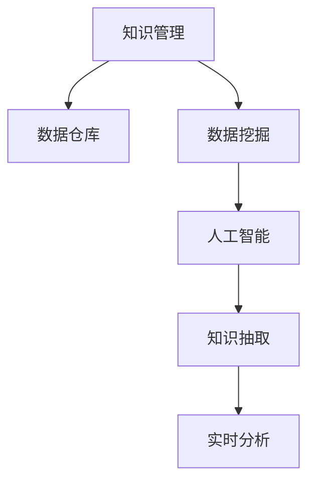
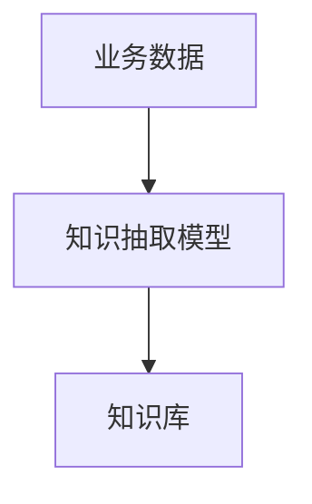

                 

# 知识输出与管理经验的系统化

> 关键词：知识管理, 经验系统化, 数据驱动决策, 知识抽取, 数据仓库, 实时分析, 人工智能, 大数据

## 1. 背景介绍

### 1.1 问题由来

在现代企业中，知识管理（Knowledge Management, KM）正日益成为企业发展的关键要素。随着信息技术的飞速发展，企业积累了大量的数据和知识，但如何在这些海量信息中找到有价值的内容并有效利用，是一个亟待解决的问题。传统的手工检索和基于规则的专家系统方法，已经无法适应日益复杂和快速变化的环境。

### 1.2 问题核心关键点

企业知识管理的主要挑战包括：
1. 信息过载：大量的数据和信息分散在不同的部门和系统，难以整合和有效利用。
2. 知识难以共享：跨部门、跨团队的知识难以充分共享和复用。
3. 经验难以总结：企业的经验知识和隐性知识难以系统化、显性化。
4. 决策支持不足：数据驱动的决策缺乏系统性和深度，难以支撑复杂问题的解决。
5. 创新能力受限：企业对内部知识的挖掘和利用不足，导致创新能力受限。

### 1.3 问题研究意义

解决企业知识管理问题，对于提升企业竞争力、加速知识创新和促进业务增长具有重要意义：
1. 提升决策效率：通过系统化、结构化的知识管理，使得企业能够更快地做出基于数据的决策。
2. 优化业务流程：通过知识共享和经验复用，可以优化企业的业务流程，提升运营效率。
3. 增强创新能力：通过知识的系统化，挖掘和利用隐性知识，激发企业的创新潜力。
4. 实现自动化：利用人工智能技术，自动化知识抽取、分析、推荐和应用，提升知识管理效率。

## 2. 核心概念与联系

### 2.1 核心概念概述

为更好地理解知识管理的实现方式，本节将介绍几个密切相关的核心概念：

- **知识管理(KM)**：通过系统化地管理企业的显性知识和隐性知识，提升企业竞争力、创新能力和运营效率的过程。
- **数据仓库(Data Warehouse)**：集中存储企业历史业务数据的仓库，支持基于数据的分析和报告。
- **数据挖掘(Data Mining)**：通过算法从大量数据中自动发现模式和知识的过程。
- **人工智能(AI)**：通过算法和模型，使计算机具备类似于人类的智能和学习能力。
- **知识抽取(Knowledge Extraction)**：从非结构化数据中自动抽取结构化知识的过程。
- **实时分析(Real-Time Analysis)**：在数据到达后，实时对其进行分析和决策的过程。

这些核心概念之间的逻辑关系可以通过以下Mermaid流程图来展示：



这个流程图展示了几项关键技术之间的联系：

1. 知识管理以数据仓库为基础，用于集中存储和支持业务分析。
2. 数据挖掘通过对数据进行分析，挖掘出有价值的知识。
3. 人工智能利用挖掘出的知识，进行自动化决策和应用。
4. 知识抽取从非结构化数据中自动提取结构化知识，支持更广泛的分析应用。
5. 实时分析在数据到达后，及时进行分析和决策，确保业务处理的及时性。

## 3. 核心算法原理 & 具体操作步骤

### 3.1 算法原理概述

知识管理的核心在于系统化地管理和利用企业的知识资产。具体来说，知识管理的过程包括以下几个步骤：
1. 数据收集与存储：将企业的业务数据和知识存储到数据仓库中。
2. 知识抽取：从存储的数据中自动抽取有价值的知识。
3. 数据挖掘：通过算法从数据中发现模式和关系。
4. 人工智能：利用挖掘出的知识，进行自动化分析和决策。
5. 知识共享与复用：将抽取的知识和经验进行共享和复用，提升业务效率和创新能力。

### 3.2 算法步骤详解

#### 步骤一：数据收集与存储

数据收集与存储是知识管理的基础。主要包括以下步骤：
1. **确定数据源**：根据企业的业务需求，确定需要收集的数据源，包括内部系统和外部数据源。
2. **数据采集**：通过ETL工具（Extract, Transform, Load）将数据源中的数据采集到数据仓库中。
3. **数据清洗**：对采集的数据进行清洗和处理，去除重复、不完整或错误的数据。
4. **数据存储**：将清洗后的数据存储到数据仓库中，供后续分析和应用使用。

#### 步骤二：知识抽取

知识抽取是将非结构化数据中的知识结构化提取出来，供分析和应用使用。主要包括以下步骤：
1. **命名实体识别**：通过自然语言处理技术，识别文本中的实体（如人名、地名、组织名等）。
2. **关系抽取**：从文本中提取实体之间的关系，如主谓宾关系、因果关系等。
3. **事件抽取**：从文本中识别出事件和事件的时间、地点、参与者等信息。
4. **实体关系抽取**：将命名实体和关系进行关联，形成结构化的知识表示。

#### 步骤三：数据挖掘

数据挖掘是从数据中发现模式和关系的过程。主要包括以下步骤：
1. **数据预处理**：对数据进行清洗、归一化和特征选择等预处理。
2. **模型选择**：根据问题的类型和数据特点，选择合适的模型，如分类、聚类、关联规则等。
3. **模型训练**：使用训练数据训练模型，调整模型的参数和超参数。
4. **模型评估**：在测试数据上评估模型的性能，选择合适的模型进行应用。

#### 步骤四：人工智能

人工智能是通过算法和模型，使计算机具备智能和学习能力。主要包括以下步骤：
1. **模型选择**：根据问题的类型和数据特点，选择合适的模型，如回归、分类、聚类等。
2. **模型训练**：使用训练数据训练模型，调整模型的参数和超参数。
3. **模型评估**：在测试数据上评估模型的性能，选择合适的模型进行应用。
4. **自动化决策**：使用训练好的模型进行自动化决策，如预测、分类、推荐等。

#### 步骤五：知识共享与复用

知识共享与复用是将抽取的知识和经验进行共享和复用，提升业务效率和创新能力。主要包括以下步骤：
1. **知识库构建**：将抽取的知识和经验存储到知识库中，供查询和应用使用。
2. **知识检索**：通过搜索和查询，快速找到需要的知识。
3. **知识推送**：将知识推送给需要的人或系统，实现实时应用。
4. **知识更新**：定期更新知识库，保证知识的准确性和时效性。

### 3.3 算法优缺点

知识管理系统的优点包括：
1. 提升决策效率：通过系统化的知识管理，使得企业能够更快地做出基于数据的决策。
2. 优化业务流程：通过知识共享和经验复用，可以优化企业的业务流程，提升运营效率。
3. 增强创新能力：通过知识的系统化，挖掘和利用隐性知识，激发企业的创新潜力。
4. 实现自动化：利用人工智能技术，自动化知识抽取、分析、推荐和应用，提升知识管理效率。

同时，该系统也存在一定的局限性：
1. 数据质量问题：数据收集和存储过程中，容易出现数据质量和完整性问题。
2. 模型复杂度：数据挖掘和人工智能模型的选择和训练较为复杂，需要专业的技术支持。
3. 知识更新困难：知识库的更新和维护需要大量人力和时间成本。
4. 应用成本高：知识管理系统的建设、维护和升级需要较高的成本。

尽管存在这些局限性，但就目前而言，知识管理系统的应用已经得到广泛认可，成为提升企业竞争力的重要手段。未来相关研究的重点在于如何进一步降低知识管理的复杂度和成本，提高系统的自动化和智能化水平。

### 3.4 算法应用领域

知识管理系统的应用领域非常广泛，涵盖了从制造业到金融业、从医疗到零售等多个行业。以下是几个典型的应用场景：

- **制造业**：通过知识管理，优化生产流程、提高生产效率和质量。
- **金融业**：通过知识管理，优化风险管理、提升投资决策的准确性。
- **医疗行业**：通过知识管理，提高诊断准确性、优化诊疗流程。
- **零售业**：通过知识管理，优化库存管理、提升客户体验。
- **教育行业**：通过知识管理，提升教学质量、个性化推荐学习资源。

## 4. 数学模型和公式 & 详细讲解 & 举例说明

### 4.1 数学模型构建

本节将使用数学语言对知识管理系统的构建过程进行更加严格的刻画。

记企业的业务数据为 $D=\{(x_i, y_i)\}_{i=1}^N$，其中 $x_i$ 为业务数据，$y_i$ 为业务标签。知识管理系统的目标是从 $D$ 中抽取有价值的知识 $K$，并进行存储和应用。

数学模型可以表示为：
$$ K = F(D) $$
其中 $F$ 为知识抽取和挖掘算法。

### 4.2 公式推导过程

以分类任务为例，推导知识抽取模型的构建和训练过程。

假设企业的业务数据 $D$ 为文本数据，标签 $y_i \in \{1, 2, ..., C\}$。知识抽取模型 $M$ 的输出为 $M(x_i) \in \mathbb{R}^C$，表示文本数据 $x_i$ 属于各类别的概率。模型的训练目标为最小化交叉熵损失函数：
$$ \mathcal{L}(M) = -\frac{1}{N}\sum_{i=1}^N \sum_{j=1}^C y_{ij} \log M_{ij} $$

其中 $y_{ij} = 1$ 表示样本 $i$ 属于类别 $j$，$y_{ij} = 0$ 表示样本 $i$ 不属于类别 $j$。

通过梯度下降等优化算法，模型的训练过程可以表示为：
$$ M_{ij} \leftarrow M_{ij} - \eta \frac{\partial \mathcal{L}(M)}{\partial M_{ij}} $$
其中 $\eta$ 为学习率。

在得到模型 $M$ 后，可以将其应用于企业的业务数据 $D$，进行分类和决策。知识抽取模型的训练和应用过程如图：



### 4.3 案例分析与讲解

以制造业的故障预测为例，分析知识抽取和人工智能的应用。

假设企业的制造业生产设备存在故障风险，需要通过历史数据和知识进行预测。企业可以收集设备的传感器数据 $X$，标签 $Y$ 表示是否发生故障。知识抽取模型可以从传感器数据中提取特征，如温度、振动、电流等，并抽取设备故障的模式。人工智能模型可以通过历史数据训练出故障预测模型，进行实时预测和预警。

具体的实现过程如下：
1. **数据收集与存储**：将设备的传感器数据 $X$ 和故障标签 $Y$ 存储到数据仓库中。
2. **知识抽取**：通过命名实体识别和关系抽取技术，从传感器数据中提取设备故障的模式和特征。
3. **数据挖掘**：使用回归模型，从历史数据中挖掘故障发生的规律和模式。
4. **人工智能**：使用训练好的模型，进行实时故障预测和预警。

## 5. 项目实践：代码实例和详细解释说明

### 5.1 开发环境搭建

在进行知识管理系统的开发前，我们需要准备好开发环境。以下是使用Python进行PyTorch开发的环境配置流程：

1. 安装Anaconda：从官网下载并安装Anaconda，用于创建独立的Python环境。

2. 创建并激活虚拟环境：
```bash
conda create -n km-env python=3.8 
conda activate km-env
```

3. 安装PyTorch：根据CUDA版本，从官网获取对应的安装命令。例如：
```bash
conda install pytorch torchvision torchaudio cudatoolkit=11.1 -c pytorch -c conda-forge
```

4. 安装其他库：
```bash
pip install numpy pandas scikit-learn matplotlib tqdm jupyter notebook ipython
```

完成上述步骤后，即可在`km-env`环境中开始知识管理系统的开发。

### 5.2 源代码详细实现

下面以制造业故障预测为例，给出使用PyTorch进行知识抽取和人工智能的代码实现。

首先，定义故障预测任务的数学模型：

```python
import torch
import torch.nn as nn
import torch.optim as optim
from torch.utils.data import DataLoader

class FaultPredictionModel(nn.Module):
    def __init__(self, input_dim, output_dim):
        super(FaultPredictionModel, self).__init__()
        self.linear = nn.Linear(input_dim, output_dim)
        self.sigmoid = nn.Sigmoid()
        
    def forward(self, x):
        output = self.linear(x)
        return self.sigmoid(output)
```

然后，定义数据处理函数：

```python
from sklearn.model_selection import train_test_split
from torch.utils.data import TensorDataset, DataLoader

def load_data():
    # 读取数据集
    X, y = load_data_from_file('data.csv')
    
    # 分割数据集
    X_train, X_test, y_train, y_test = train_test_split(X, y, test_size=0.2, random_state=42)
    
    # 转换数据集为Tensor
    train_dataset = TensorDataset(torch.tensor(X_train), torch.tensor(y_train))
    test_dataset = TensorDataset(torch.tensor(X_test), torch.tensor(y_test))
    
    # 创建数据加载器
    train_loader = DataLoader(train_dataset, batch_size=64, shuffle=True)
    test_loader = DataLoader(test_dataset, batch_size=64)
    
    return train_loader, test_loader
```

接着，定义训练和评估函数：

```python
def train_model(model, train_loader, optimizer, num_epochs=10):
    for epoch in range(num_epochs):
        model.train()
        for data, target in train_loader:
            optimizer.zero_grad()
            output = model(data)
            loss = nn.BCELoss()(output, target)
            loss.backward()
            optimizer.step()
        
        model.eval()
        with torch.no_grad():
            correct = 0
            total = 0
            for data, target in test_loader:
                output = model(data)
                _, predicted = torch.max(output.data, 1)
                total += target.size(0)
                correct += (predicted == target).sum().item()
            
            print(f'Epoch {epoch+1}, Accuracy: {correct/total*100:.2f}%')
```

最后，启动训练流程并在测试集上评估：

```python
# 加载数据集
train_loader, test_loader = load_data()

# 定义模型和优化器
model = FaultPredictionModel(input_dim=5, output_dim=1)
optimizer = optim.Adam(model.parameters(), lr=0.001)

# 训练模型
train_model(model, train_loader, optimizer)

# 评估模型
with torch.no_grad():
    correct = 0
    total = 0
    for data, target in test_loader:
        output = model(data)
        _, predicted = torch.max(output.data, 1)
        total += target.size(0)
        correct += (predicted == target).sum().item()
    
    print(f'Test Accuracy: {correct/total*100:.2f}%')
```

以上就是使用PyTorch进行制造业故障预测的知识管理系统的代码实现。可以看到，通过构建合适的数学模型和数据处理函数，我们可以快速实现基于知识抽取和人工智能的故障预测功能。

### 5.3 代码解读与分析

让我们再详细解读一下关键代码的实现细节：

**FaultPredictionModel类**：
- `__init__`方法：初始化线性层和sigmoid激活函数。
- `forward`方法：前向传播，将输入数据 $x$ 经过线性层和sigmoid激活函数，得到输出 $y$。

**load_data函数**：
- 读取数据集，并使用sklearn进行分割。
- 将数据集转换为PyTorch的Tensor，并创建DataLoader，方便批量读取数据。

**train_model函数**：
- 在每个epoch中，将模型设为训练模式，遍历数据集进行训练。
- 在每个batch中，前向传播计算输出，计算损失函数并反向传播更新模型参数。
- 在每个epoch结束后，将模型设为评估模式，遍历测试集计算准确率，并输出结果。

**训练流程**：
- 加载数据集
- 定义模型和优化器
- 调用训练函数进行模型训练
- 在测试集上评估模型准确率

可以看到，通过简单的代码实现，我们可以构建出基于知识抽取和人工智能的故障预测系统。这种实现方式不仅快速高效，而且易于扩展和优化。

当然，工业级的系统实现还需考虑更多因素，如模型的保存和部署、超参数的自动搜索、更灵活的任务适配层等。但核心的知识管理思想基本与此类似。

## 6. 实际应用场景

### 6.1 智能客服系统

基于知识管理的智能客服系统，可以广泛应用于企业客户服务部门。传统客服往往需要配备大量人力，高峰期响应缓慢，且无法实现24小时不间断服务。通过知识管理，智能客服系统可以自动理解客户意图，快速匹配答案，提升客户满意度。

在技术实现上，可以收集企业内部的历史客服对话记录，将问题和最佳答复构建成知识库，通过知识抽取和人工智能技术进行分类和匹配。智能客服系统能够自动理解客户意图，匹配最合适的答案模板进行回复，并在需要时动态搜索最新信息进行回答。如此构建的智能客服系统，能大幅提升客户咨询体验和问题解决效率。

### 6.2 金融舆情监测

金融机构需要实时监测市场舆论动向，以便及时应对负面信息传播，规避金融风险。传统的人工监测方式成本高、效率低，难以应对网络时代海量信息爆发的挑战。通过知识管理，金融机构可以利用人工智能技术，自动监测不同主题下的情感变化趋势，一旦发现负面信息激增等异常情况，系统便会自动预警，帮助金融机构快速应对潜在风险。

在技术实现上，可以收集金融领域相关的新闻、报道、评论等文本数据，并对其进行主题标注和情感标注。利用知识抽取和人工智能技术，构建情感分析模型，实时监测网络舆情，发现异常情况进行预警。

### 6.3 个性化推荐系统

当前的推荐系统往往只依赖用户的历史行为数据进行物品推荐，无法深入理解用户的真实兴趣偏好。通过知识管理，推荐系统可以更好地挖掘用户行为背后的语义信息，从而提供更精准、多样的推荐内容。

在技术实现上，可以收集用户浏览、点击、评论、分享等行为数据，提取和用户交互的物品标题、描述、标签等文本内容。利用知识抽取和人工智能技术，构建推荐模型，从文本内容中准确把握用户的兴趣点。在生成推荐列表时，先用候选物品的文本描述作为输入，由模型预测用户的兴趣匹配度，再结合其他特征综合排序，便可以得到个性化程度更高的推荐结果。

### 6.4 未来应用展望

随着知识管理技术的不断发展，其在更多领域的应用前景将更为广阔。

在智慧医疗领域，知识管理可以为医生提供丰富的医学知识和病历信息，提高诊疗准确性和效率。通过知识抽取和人工智能技术，构建医疗问答系统、诊断辅助系统等，提升医疗服务的智能化水平。

在智能教育领域，知识管理可以提供个性化的学习资源和知识推荐，提高教学质量和学生学习体验。通过知识抽取和人工智能技术，构建智能辅助教学系统，自动生成个性化学习路径，实时推荐学习资源。

在智慧城市治理中，知识管理可以提供城市事件的实时监测和分析，提高城市管理的自动化和智能化水平。通过知识抽取和人工智能技术，构建城市事件监测系统、应急指挥系统等，提升城市管理的智能化水平。

此外，在企业生产、社会治理、文娱传媒等众多领域，知识管理技术的应用也将不断拓展，为各行各业带来新的发展机遇。

## 7. 工具和资源推荐

### 7.1 学习资源推荐

为了帮助开发者系统掌握知识管理的理论和实践，这里推荐一些优质的学习资源：

1. **《知识管理与组织学习》**：管理学的经典教材，详细介绍了知识管理的理论基础和实践方法。
2. **《数据科学与人工智能》**：关于数据科学与人工智能的全面教程，涵盖数据挖掘、机器学习、深度学习等前沿话题。
3. **《深度学习与数据挖掘》**：基于Python的深度学习与数据挖掘实践指南，提供丰富的代码实例和案例分析。
4. **《Python数据科学手册》**：详细介绍Python在数据科学中的应用，包括数据处理、统计分析、可视化等。
5. **Coursera上的“数据科学与机器学习”课程**：由斯坦福大学开设，提供系统化、理论化的数据科学与机器学习教育。

通过对这些资源的学习实践，相信你一定能够快速掌握知识管理的精髓，并用于解决实际的业务问题。

### 7.2 开发工具推荐

高效的开发离不开优秀的工具支持。以下是几款用于知识管理开发的常用工具：

1. **Python**：基于Python的开源深度学习框架，灵活动态的计算图，适合快速迭代研究。大部分预训练语言模型都有Python版本的实现。
2. **TensorFlow**：由Google主导开发的开源深度学习框架，生产部署方便，适合大规模工程应用。同样有丰富的预训练语言模型资源。
3. **Transformers库**：HuggingFace开发的NLP工具库，集成了众多SOTA语言模型，支持PyTorch和TensorFlow，是进行知识抽取和人工智能开发的利器。
4. **Weights & Biases**：模型训练的实验跟踪工具，可以记录和可视化模型训练过程中的各项指标，方便对比和调优。与主流深度学习框架无缝集成。
5. **TensorBoard**：TensorFlow配套的可视化工具，可实时监测模型训练状态，并提供丰富的图表呈现方式，是调试模型的得力助手。
6. **Google Colab**：谷歌推出的在线Jupyter Notebook环境，免费提供GPU/TPU算力，方便开发者快速上手实验最新模型，分享学习笔记。

合理利用这些工具，可以显著提升知识管理系统的开发效率，加快创新迭代的步伐。

### 7.3 相关论文推荐

知识管理技术的发展源于学界的持续研究。以下是几篇奠基性的相关论文，推荐阅读：

1. **《企业知识管理的演变及其前景》**：文章系统总结了企业知识管理的演变历程和未来前景，对知识管理的理论基础进行了全面的梳理。
2. **《数据驱动的智能客服系统》**：研究了基于知识管理的智能客服系统，详细介绍了系统的设计和实现方法。
3. **《基于数据挖掘的金融舆情监测系统》**：通过数据挖掘和人工智能技术，构建了金融舆情监测系统，实时监测市场舆情，进行风险预警。
4. **《个性化推荐系统的知识抽取与数据挖掘》**：研究了基于知识管理的个性化推荐系统，通过知识抽取和数据挖掘技术，提升了推荐系统的准确性和个性化程度。
5. **《知识管理系统的设计与实现》**：介绍了知识管理系统的设计和实现方法，涵盖数据收集、存储、抽取、挖掘等多个环节。

这些论文代表了大数据和人工智能技术在知识管理中的应用前景，通过学习这些前沿成果，可以帮助研究者把握学科前进方向，激发更多的创新灵感。

## 8. 总结：未来发展趋势与挑战

### 8.1 总结

本文对知识管理系统的理论和实践进行了全面系统的介绍。首先阐述了知识管理的背景和意义，明确了知识管理在提升企业竞争力和业务效率中的重要作用。其次，从原理到实践，详细讲解了知识管理的数学模型和核心算法，给出了知识抽取和人工智能的代码实现。同时，本文还广泛探讨了知识管理在多个行业领域的应用场景，展示了知识管理技术的广阔前景。此外，本文精选了知识管理的各类学习资源，力求为读者提供全方位的技术指引。

通过本文的系统梳理，可以看到，知识管理技术正在成为企业提升竞争力的重要手段，通过系统化的知识管理，企业能够更快地做出基于数据的决策，优化业务流程，增强创新能力，提升运营效率。知识管理技术的未来，在于进一步降低系统的复杂度和成本，提高系统的自动化和智能化水平，实现实时化、智能化、精准化的知识管理，为企业数字化转型提供强大的技术支持。

### 8.2 未来发展趋势

展望未来，知识管理技术将呈现以下几个发展趋势：

1. **数据驱动决策**：知识管理系统的核心在于数据驱动决策。未来，知识管理系统将进一步提升数据的准确性和完整性，通过实时数据分析，为业务决策提供更加科学和精准的支撑。
2. **人工智能与知识管理融合**：知识管理系统将进一步与人工智能技术深度融合，通过机器学习、深度学习等技术，实现知识抽取、分类、推荐等功能的自动化和智能化。
3. **知识图谱构建**：构建知识图谱，将知识进行结构化和关联化，使得知识更加系统化和可复用。知识图谱将成为知识管理的重要支撑工具。
4. **多模态知识管理**：知识管理系统将进一步拓展到多模态数据的处理和分析，如文本、图像、视频、语音等，实现全面化的知识管理。
5. **知识共享与协作**：通过知识管理系统的构建，促进企业内部的知识共享和协作，提升团队的创新能力和知识利用率。
6. **智能化知识推荐**：通过知识管理系统，实现个性化的知识推荐，提升用户的体验和满意度。

这些趋势凸显了知识管理系统的广阔前景，相信通过不断的技术创新和应用实践，知识管理将为企业的数字化转型和智能化升级提供更加强大的技术支撑。

### 8.3 面临的挑战

尽管知识管理技术已经取得了显著的进展，但在迈向更加智能化、普适化应用的过程中，它仍面临诸多挑战：

1. **数据质量问题**：数据收集和存储过程中，容易出现数据质量和完整性问题，影响知识管理的准确性和可靠性。
2. **知识抽取与理解**：从文本中抽取和理解知识的过程较为复杂，需要强大的自然语言处理技术支持。
3. **人工智能模型选择与训练**：人工智能模型的选择和训练较为复杂，需要专业的技术支持和大量计算资源。
4. **知识库维护与更新**：知识库的更新和维护需要大量人力和时间成本，且难以保证知识的准确性和时效性。
5. **跨部门协作与知识共享**：企业内部的知识共享和协作需要协调不同部门和团队，存在一定的复杂性和挑战性。
6. **安全与隐私保护**：知识管理系统的数据隐私和安全问题需要重视，防止数据泄露和滥用。

尽管存在这些挑战，但随着技术的不断发展和完善，知识管理系统的应用前景仍然广阔，其对企业数字化转型的促进作用将愈发显著。相信未来相关研究将在这些方向上取得更多的突破，推动知识管理技术的进一步成熟和应用。

### 8.4 研究展望

面对知识管理面临的诸多挑战，未来的研究需要在以下几个方面寻求新的突破：

1. **数据治理与质量控制**：建立数据治理体系，确保数据的质量和完整性，提升知识管理的准确性和可靠性。
2. **知识抽取与理解**：开发更加高效、精准的知识抽取与理解技术，提升知识管理的效率和效果。
3. **人工智能模型的优化**：进一步优化人工智能模型的选择和训练，提高模型的自动化和智能化水平。
4. **知识库的构建与维护**：构建更高效的知识库管理系统，实现知识库的自动化更新和维护。
5. **跨部门协作与知识共享**：建立跨部门的知识共享和协作机制，促进企业内部的知识流动和复用。
6. **安全与隐私保护**：研究数据隐私和安全保护技术，确保知识管理系统的数据安全。

这些研究方向将推动知识管理技术的不断进步，为企业的数字化转型和智能化升级提供更加强大的技术支撑。相信随着研究的深入和技术的成熟，知识管理将更好地支撑企业的创新和发展，成为数字化转型的重要驱动力。

## 9. 附录：常见问题与解答

**Q1：知识管理系统的实现需要哪些关键技术？**

A: 知识管理系统的实现需要以下关键技术：
1. **数据收集与存储**：将企业的业务数据和知识存储到数据仓库中。
2. **知识抽取**：从存储的数据中自动抽取有价值的知识。
3. **数据挖掘**：通过算法从数据中发现模式和关系。
4. **人工智能**：利用挖掘出的知识，进行自动化分析和决策。
5. **知识共享与复用**：将抽取的知识和经验进行共享和复用，提升业务效率和创新能力。

这些技术共同构成了知识管理系统的工作框架，使得企业能够系统化地管理和利用知识资产，提升运营效率和创新能力。

**Q2：知识管理系统的优势有哪些？**

A: 知识管理系统的优势包括：
1. **提升决策效率**：通过系统化的知识管理，使得企业能够更快地做出基于数据的决策。
2. **优化业务流程**：通过知识共享和经验复用，可以优化企业的业务流程，提升运营效率。
3. **增强创新能力**：通过知识的系统化，挖掘和利用隐性知识，激发企业的创新潜力。
4. **实现自动化**：利用人工智能技术，自动化知识抽取、分析、推荐和应用，提升知识管理效率。

这些优势使得知识管理系统成为提升企业竞争力和业务效率的重要手段。

**Q3：知识管理系统如何处理多模态数据？**

A: 知识管理系统处理多模态数据，主要通过以下步骤：
1. **数据采集**：将不同模态的数据源收集到数据仓库中。
2. **数据整合**：将不同模态的数据进行整合和转换，使其能够统一表示和处理。
3. **知识抽取**：通过多模态的数据抽取技术，从不同模态的数据中抽取有价值的知识。
4. **数据挖掘**：通过多模态的数据挖掘技术，从不同模态的数据中发现模式和关系。
5. **人工智能**：通过多模态的数据分析技术，构建多模态的知识模型，进行自动化分析和决策。

多模态数据的管理和分析是知识管理系统的重要研究方向，通过多模态技术的融合，可以提升系统的智能化和自动化水平，实现全面化的知识管理。

**Q4：知识管理系统在实际应用中面临哪些挑战？**

A: 知识管理系统在实际应用中面临以下挑战：
1. **数据质量问题**：数据收集和存储过程中，容易出现数据质量和完整性问题，影响知识管理的准确性和可靠性。
2. **知识抽取与理解**：从文本中抽取和理解知识的过程较为复杂，需要强大的自然语言处理技术支持。
3. **人工智能模型选择与训练**：人工智能模型的选择和训练较为复杂，需要专业的技术支持和大量计算资源。
4. **知识库维护与更新**：知识库的更新和维护需要大量人力和时间成本，且难以保证知识的准确性和时效性。
5. **跨部门协作与知识共享**：企业内部的知识共享和协作需要协调不同部门和团队，存在一定的复杂性和挑战性。
6. **安全与隐私保护**：知识管理系统的数据隐私和安全问题需要重视，防止数据泄露和滥用。

这些挑战需要企业在系统设计和实现过程中综合考虑，通过技术创新和优化，逐步克服，才能实现知识管理的最大化效益。

**Q5：如何构建高效的知识管理系统？**

A: 构建高效的知识管理系统，需要综合考虑以下几个方面：
1. **明确需求**：根据企业的业务需求，明确知识管理系统的目标和功能。
2. **选择合适的技术**：根据企业的实际情况，选择合适的技术栈和工具，确保系统的可扩展性和稳定性。
3. **数据治理与质量控制**：建立数据治理体系，确保数据的质量和完整性，提升知识管理的准确性和可靠性。
4. **知识抽取与理解**：开发高效的知识抽取与理解技术，提升知识管理的效率和效果。
5. **人工智能模型的优化**：进一步优化人工智能模型的选择和训练，提高模型的自动化和智能化水平。
6. **知识库的构建与维护**：构建高效的知识库管理系统，实现知识库的自动化更新和维护。
7. **跨部门协作与知识共享**：建立跨部门的知识共享和协作机制，促进企业内部的知识流动和复用。
8. **安全与隐私保护**：研究数据隐私和安全保护技术，确保知识管理系统的数据安全。

通过综合考虑这些因素，可以构建出高效、可靠、智能的知识管理系统，为企业数字化转型提供强大的技术支撑。

---

作者：禅与计算机程序设计艺术 / Zen and the Art of Computer Programming

