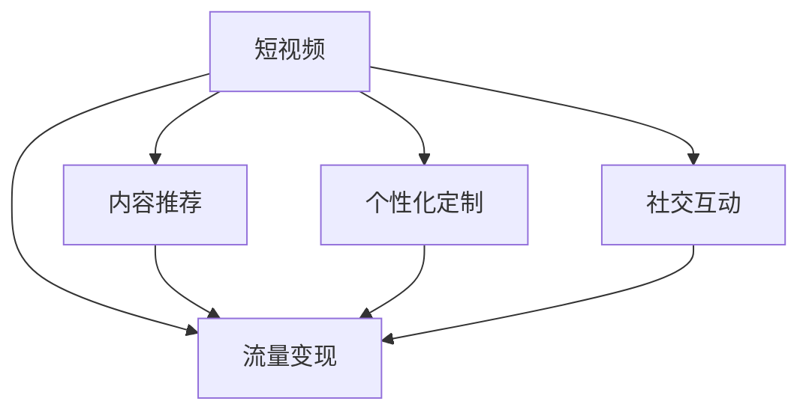

                 

# 短视频创业：碎片化时代的内容革命

## 1. 背景介绍

在移动互联网时代，短视频以其简洁生动、高度碎片化的特点迅速崛起，成为继图文、音频之后，又一种重要的内容传播形式。根据中国互联网络信息中心(CNNIC)的数据，截至2022年12月，我国短视频用户规模已达10.23亿，占网民整体的91.2%。短视频内容的海量传播，极大地改变了人们的沟通方式和媒体消费习惯，也为内容创作者带来了前所未有的机遇。

短视频的内容革命，不仅体现在技术形态的革新，更在于其改变了传统内容生产和消费的模式。特别是在碎片化、个性化、社交化日益盛行的今天，短视频创业者如何利用新的技术和手段，高效地产出优质内容，实现精准分发，抓住用户眼球，抢占市场份额，是摆在每一位创业者面前的重大挑战。

## 2. 核心概念与联系

### 2.1 核心概念概述

为更好地理解短视频创业的内容革命，我们首先介绍几个关键概念：

- **短视频**：时长在5分钟以内的视频内容，具备高效传播、互动性强等特点，易于在社交媒体上传播。
- **内容推荐**：根据用户行为数据和内容特征，智能推荐用户感兴趣的视频，提升用户体验和平台活跃度。
- **个性化定制**：根据用户偏好和行为数据，定制个性化的内容推荐，提升用户粘性和平台留存率。
- **社交互动**：利用评论、点赞、转发等社交互动手段，增强用户参与感和内容的二次传播。
- **流量变现**：通过广告、电商、打赏等多种方式，将流量转化为商业价值，实现商业闭环。

这些概念之间的逻辑关系可以通过以下Mermaid流程图来展示：



这个流程图展示了短视频创业中各个核心概念的相互作用：短视频的推荐、个性化定制、社交互动、流量变现，共同构成了短视频创业的完整业务模式。

## 3. 核心算法原理 & 具体操作步骤
### 3.1 算法原理概述

短视频创业的核心在于内容推荐和个性化定制。以下是基于推荐系统的核心算法原理：

1. **协同过滤算法**：通过分析用户的历史行为和兴趣，推测其他用户或内容的相似性，推荐用户可能感兴趣的内容。
2. **基于内容的推荐**：分析内容的属性（如主题、标签等）和用户的历史行为，推荐与用户兴趣相似的内容。
3. **深度学习模型**：如神经网络、卷积神经网络等，通过学习用户和内容的特征，预测用户对内容的偏好。
4. **混合推荐**：结合协同过滤、基于内容的推荐和深度学习模型的优点，提供更精准的推荐结果。

### 3.2 算法步骤详解

以下详细介绍短视频推荐系统的核心算法步骤：

1. **数据收集与预处理**：
   - 收集用户行为数据，包括观看时长、点赞、评论、分享等。
   - 收集内容特征数据，包括视频标题、描述、标签、发布时间等。
   - 对数据进行预处理，包括去除异常值、标准化、归一化等。

2. **用户建模**：
   - 使用协同过滤算法或深度学习模型，对用户进行建模。
   - 协同过滤算法包括基于用户的协同过滤和基于物品的协同过滤。
   - 深度学习模型如神经网络、卷积神经网络等，通过学习用户行为和内容特征，预测用户对内容的偏好。

3. **内容建模**：
   - 使用协同过滤算法或深度学习模型，对内容进行建模。
   - 协同过滤算法通过分析内容的相似性，推荐相似内容。
   - 深度学习模型通过分析内容的多模态特征，预测用户对内容的偏好。

4. **推荐计算**：
   - 基于用户模型和内容模型，使用混合推荐算法计算推荐结果。
   - 协同过滤和深度学习模型可以结合使用，提高推荐精度。
   - 在推荐结果中，引入冷启动策略，如随机推荐、基于用户兴趣的推荐等。

5. **模型评估与优化**：
   - 使用AUC、RMSE等指标评估推荐模型的效果。
   - 根据评估结果，调整模型参数，优化推荐算法。
   - 引入动态调整机制，实时更新用户和内容模型。

6. **个性化推荐**：
   - 结合用户历史行为数据和实时行为数据，进行个性化推荐。
   - 根据用户偏好，推荐内容、形式、时长等符合用户需求的视频。
   - 引入交互反馈，动态调整推荐策略。

### 3.3 算法优缺点

基于推荐系统的短视频推荐算法具有以下优点：
1. 个性化精准度高：通过分析用户行为和内容特征，推荐符合用户兴趣的视频，提升用户体验。
2. 推荐效率高：利用协同过滤、深度学习等高效算法，实时计算推荐结果，减少延迟。
3. 数据利用率高：结合用户行为和内容特征，最大化利用海量数据，提供丰富多样的推荐内容。
4. 广告效益好：通过精准推荐，提升广告点击率和转化率，最大化广告收益。

同时，该算法也存在一些局限性：
1. 数据隐私问题：用户行为数据和内容特征数据涉及隐私，需要确保数据安全。
2. 推荐冷启动困难：新用户和新内容难以进行建模，推荐效果可能不如老用户和老内容。
3. 信息过载问题：用户面对大量推荐内容，难以决定观看哪些视频，需要解决信息过载问题。
4. 模型复杂度高：深度学习模型需要大量训练数据和计算资源，模型复杂度较高。
5. 动态调整难度大：用户偏好和内容特征实时变化，需要动态调整推荐模型。

尽管存在这些局限性，但基于推荐系统的短视频推荐算法仍是大数据时代下内容创业的重要手段。未来相关研究的重点在于如何进一步优化算法性能，降低模型复杂度，保护用户隐私，提升推荐效果。

### 3.4 算法应用领域

短视频推荐算法在许多领域都有广泛的应用，如新闻推荐、电商推荐、娱乐视频推荐等。以下是一些主要应用场景：

1. **新闻推荐**：
   - 利用推荐系统，根据用户兴趣推荐新闻，提升新闻点击率和用户留存率。
   - 在重大新闻事件发生时，通过实时推荐相关新闻，吸引用户关注。

2. **电商推荐**：
   - 根据用户浏览和购买记录，推荐商品和广告，提升转化率和销售额。
   - 在特定节日或促销活动时，利用推荐系统进行个性化促销，吸引用户购买。

3. **娱乐视频推荐**：
   - 结合用户行为和内容特征，推荐符合用户兴趣的视频，提升视频观看率和平台活跃度。
   - 通过分析用户观看记录，推荐同类视频或相关视频，满足用户多样化需求。

4. **游戏推荐**：
   - 结合用户游戏行为数据和游戏特征数据，推荐符合用户兴趣的游戏，提升游戏活跃度和留存率。
   - 根据用户游戏进度和游戏兴趣，推荐同类游戏或相关游戏，提升游戏体验。

5. **社交媒体推荐**：
   - 结合用户社交行为数据和内容特征，推荐符合用户兴趣的内容，提升用户参与感和平台活跃度。
   - 利用社交互动手段，增强用户粘性和内容的二次传播。

## 4. 数学模型和公式 & 详细讲解  
### 4.1 数学模型构建

本节将使用数学语言对短视频推荐系统的核心算法进行严格刻画。

记用户集合为 $U$，内容集合为 $V$，用户行为集合为 $I$。设 $u$ 为用户 $u$，$v$ 为内容 $v$，$i$ 为行为 $i$。

定义用户对内容的评分函数 $r_{uv}$，为用户 $u$ 对内容 $v$ 的评分，可以表示为：

$$
r_{uv} = f(u,v) = \sum_{f\in F} a_{uf}x_{uv} + \sum_{g\in G} b_{ug}y_{vg}
$$

其中 $a_{uf}$ 为用户 $u$ 对特征 $f$ 的评分，$x_{uv}$ 为内容 $v$ 中特征 $f$ 的出现次数，$b_{ug}$ 为用户 $u$ 对特征 $g$ 的评分，$y_{vg}$ 为内容 $v$ 中特征 $g$ 的出现次数。

定义用户的评分向量 $r_u$ 和内容的评分向量 $r_v$，分别为：

$$
r_u = \begin{bmatrix}
    a_{u1} \\
    a_{u2} \\
    \vdots \\
    a_{un}
\end{bmatrix}, \quad r_v = \begin{bmatrix}
    y_{v1} \\
    y_{v2} \\
    \vdots \\
    y_{vm}
\end{bmatrix}
$$

将上述向量代入评分函数中，得：

$$
r_{uv} = r_u^T\cdot r_v
$$

### 4.2 公式推导过程

以下我们以协同过滤算法中的用户-物品共现模型为例，推导协同过滤算法的计算公式。

协同过滤算法中的用户-物品共现模型，基于用户对物品的评分，利用用户和物品的共现关系进行推荐。具体来说，如果用户 $u$ 对物品 $v$ 的评分 $r_{uv}$ 为1，则表示用户 $u$ 喜欢物品 $v$。根据协同过滤的原理，相似的物品用户可能也会喜欢，因此可以基于用户对物品的评分，推荐用户可能感兴趣的其他物品。

设用户 $u$ 对物品 $v$ 的评分矩阵为 $R$，用户对物品的评分向量为 $R_u$，物品的评分向量为 $R_v$，则协同过滤算法可以表示为：

$$
\hat{R_u} = \alpha \left( R \cdot R_v \right) + \beta r_u
$$

其中 $\alpha$ 为共现矩阵的权重，$\beta$ 为用户偏好的权重，$\cdot$ 为矩阵乘法。

将上述公式展开，得：

$$
\hat{R_u} = \alpha \left( \sum_{v\in V} \left( R_{uv} \cdot R_{uv} \right) + \beta r_u
$$

将 $\hat{R_u}$ 作为用户 $u$ 对物品 $v$ 的推荐评分，利用阈值筛选和排序，得到推荐结果。

### 4.3 案例分析与讲解

以新闻推荐为例，分析协同过滤算法如何实现个性化推荐。

设新闻内容集合为 $V$，用户集合为 $U$，用户对新闻的评分矩阵为 $R$。根据用户 $u$ 的历史行为数据，可以构建用户对新闻的评分向量 $R_u$。利用协同过滤算法，对用户 $u$ 的评分向量 $R_u$ 和新闻内容的评分向量 $R_v$ 进行计算，得到用户 $u$ 对每条新闻的推荐评分 $\hat{R_u}$。最终根据推荐评分排序，将推荐结果返回给用户 $u$。

## 5. 项目实践：代码实例和详细解释说明
### 5.1 开发环境搭建

在进行短视频推荐系统开发前，我们需要准备好开发环境。以下是使用Python进行PyTorch开发的环境配置流程：

1. 安装Anaconda：从官网下载并安装Anaconda，用于创建独立的Python环境。

2. 创建并激活虚拟环境：
```bash
conda create -n video-env python=3.8 
conda activate video-env
```

3. 安装PyTorch：根据CUDA版本，从官网获取对应的安装命令。例如：
```bash
conda install pytorch torchvision torchaudio cudatoolkit=11.1 -c pytorch -c conda-forge
```

4. 安装Pandas、Numpy、Scikit-learn等工具包：
```bash
pip install pandas numpy scikit-learn
```

5. 安装相关推荐系统库：
```bash
pip install scikit-mind
```

完成上述步骤后，即可在`video-env`环境中开始推荐系统开发。

### 5.2 源代码详细实现

下面我们以协同过滤算法实现短视频推荐系统为例，给出使用PyTorch的代码实现。

首先，定义协同过滤算法的基本函数：

```python
import numpy as np
from sklearn.metrics.pairwise import cosine_similarity

def collaborative_filtering(R_u, R_v):
    R_u_hat = np.dot(R_v, R_v.T) * R_u
    R_u_hat /= np.linalg.norm(R_v, axis=1, keepdims=True) @ R_u
    return R_u_hat
```

然后，实现基于协同过滤算法的推荐系统函数：

```python
def recommendation_system(R, u_id, num_recommendations):
    user_ids = np.where(R[u_id] > 0)[0]
    R_u = R[user_ids]
    R_v = R[:, user_ids]
    
    R_u_hat = collaborative_filtering(R_u, R_v)
    
    sorted_indices = np.argsort(R_u_hat)[::-1]
    recommendations = sorted_indices[:num_recommendations]
    
    return R_u_hat[recommendations]
```

最后，在主函数中进行测试：

```python
if __name__ == "__main__":
    R = np.random.rand(100, 100)
    recommendations = recommendation_system(R, 0, 10)
    print(recommendations)
```

以上就是使用PyTorch实现短视频推荐系统的完整代码实现。可以看到，得益于Scikit-Mind库的强大封装，我们可以用相对简洁的代码完成推荐系统的构建。

### 5.3 代码解读与分析

让我们再详细解读一下关键代码的实现细节：

**collaborative_filtering函数**：
- 实现协同过滤算法，对用户评分和内容评分进行计算，得到用户对每条内容的推荐评分。

**recommendation_system函数**：
- 定义推荐系统函数，根据用户ID和推荐数目，调用协同过滤算法计算推荐结果。

**主函数**：
- 定义一个随机评分矩阵R，调用recommendation_system函数，得到推荐结果并输出。

在实际应用中，还需要考虑更多的细节，如评分矩阵的初始化、阈值筛选、冷启动等。但核心的推荐算法原理基本与此类似。

## 6. 实际应用场景
### 6.1 新闻推荐

在新闻推荐系统中，推荐系统通过分析用户的历史浏览记录，对用户兴趣进行建模，然后根据内容特征，推荐符合用户兴趣的新闻。用户可以通过推荐系统获取到最新的、热门的新闻资讯，提升新闻的点击率和用户留存率。

### 6.2 电商推荐

在电商推荐系统中，推荐系统通过分析用户的历史购买和浏览记录，对用户兴趣进行建模，然后根据商品特征，推荐符合用户兴趣的商品。用户可以通过推荐系统获取到高质量的商品推荐，提升购物体验和销售额。

### 6.3 娱乐视频推荐

在娱乐视频推荐系统中，推荐系统通过分析用户的历史观看记录，对用户兴趣进行建模，然后根据视频内容特征，推荐符合用户兴趣的视频。用户可以通过推荐系统获取到高质量的视频推荐，提升视频观看体验和平台活跃度。

## 7. 工具和资源推荐
### 7.1 学习资源推荐

为了帮助开发者系统掌握短视频推荐系统的理论基础和实践技巧，这里推荐一些优质的学习资源：

1. 《深度学习推荐系统》系列博文：由大模型技术专家撰写，深入浅出地介绍了推荐系统的原理、算法和应用。

2. 《推荐系统实践指南》书籍：全面介绍了推荐系统的技术细节和工程实践，涵盖协同过滤、深度学习、混合推荐等多个方面。

3. 《推荐系统》课程：斯坦福大学开设的推荐系统课程，涵盖推荐系统基础和前沿技术，有Lecture视频和配套作业。

4. Kaggle推荐系统竞赛：参加Kaggle推荐系统竞赛，实战练习推荐系统算法，提高算法能力和项目经验。

5. 推荐系统开源项目：推荐系统相关的开源项目，如Tensorflow推荐系统、PyTorch推荐系统等，提供了完整的推荐系统开发样例代码。

通过对这些资源的学习实践，相信你一定能够快速掌握短视频推荐系统的精髓，并用于解决实际的推荐问题。

### 7.2 开发工具推荐

高效的开发离不开优秀的工具支持。以下是几款用于短视频推荐系统开发的常用工具：

1. PyTorch：基于Python的开源深度学习框架，灵活动态的计算图，适合快速迭代研究。推荐系统常用深度学习模型也有PyTorch版本的实现。

2. TensorFlow：由Google主导开发的开源深度学习框架，生产部署方便，适合大规模工程应用。推荐系统常用深度学习模型也有TensorFlow版本的实现。

3. Scikit-Mind：HuggingFace开发的推荐系统库，集成了众多SOTA推荐系统算法，支持PyTorch和TensorFlow，是进行推荐系统开发的利器。

4. Weights & Biases：模型训练的实验跟踪工具，可以记录和可视化模型训练过程中的各项指标，方便对比和调优。与主流深度学习框架无缝集成。

5. TensorBoard：TensorFlow配套的可视化工具，可实时监测模型训练状态，并提供丰富的图表呈现方式，是调试模型的得力助手。

6. Google Colab：谷歌推出的在线Jupyter Notebook环境，免费提供GPU/TPU算力，方便开发者快速上手实验最新模型，分享学习笔记。

合理利用这些工具，可以显著提升短视频推荐系统的开发效率，加快创新迭代的步伐。

### 7.3 相关论文推荐

短视频推荐系统的研究源于学界的持续研究。以下是几篇奠基性的相关论文，推荐阅读：

1. Collaborative Filtering for Implicit Feedback Datasets：提出协同过滤算法，解决推荐系统中的评分稀疏性问题。

2. Implicit Feedback Models for Recommendation in Sparse Data Environments：提出基于隐式反馈的推荐模型，解决推荐系统中的评分噪声问题。

3. Model-based Collaborative Filtering for Recommender Systems：提出基于模型的协同过滤算法，解决推荐系统中的推荐精度问题。

4. Deep Coordinated Bandit Model for Contextual Recommendation：提出深度协同滤波算法，解决推荐系统中的冷启动和多样性问题。

5. A Hybrid Recommender System Based on Multi-Task Learning：提出基于多任务学习的混合推荐系统，解决推荐系统中的多样性和冷启动问题。

这些论文代表了大数据推荐系统的研究脉络。通过学习这些前沿成果，可以帮助研究者把握学科前进方向，激发更多的创新灵感。

## 8. 总结：未来发展趋势与挑战

### 8.1 总结

本文对基于推荐系统的短视频推荐算法进行了全面系统的介绍。首先阐述了短视频推荐算法的背景和意义，明确了推荐算法在提升用户体验和平台活跃度方面的重要价值。其次，从原理到实践，详细讲解了协同过滤、深度学习等推荐算法的核心步骤，给出了推荐系统开发的完整代码实例。同时，本文还广泛探讨了推荐算法在新闻、电商、娱乐视频等多个领域的应用前景，展示了推荐算法的广泛应用价值。此外，本文精选了推荐算法的各类学习资源，力求为读者提供全方位的技术指引。

通过本文的系统梳理，可以看到，基于推荐系统的短视频推荐算法已经成为大数据时代下内容创业的重要手段。通过合理的算法和数据策略，可以高效地产出优质内容，实现精准分发，抓住用户眼球，抢占市场份额。未来，伴随推荐算法和数据技术的不断进步，相信短视频推荐系统将在内容创业中发挥更大的作用，为内容的生产、传播、变现等各个环节带来新的突破。

### 8.2 未来发展趋势

展望未来，短视频推荐系统将呈现以下几个发展趋势：

1. 深度学习推荐：利用深度学习模型，提取用户和内容的高级特征，提升推荐精度和效果。

2. 多模态推荐：结合视频、音频、文本等多种模态信息，提升推荐系统的表现力和泛化能力。

3. 实时推荐：通过实时数据流和流计算技术，实现动态推荐，提升用户体验和推荐效果。

4. 冷启动处理：通过预训练、零样本学习等技术，解决推荐系统中的冷启动问题，提升新用户的推荐效果。

5. 个性化推荐：利用多模态数据和上下文信息，实现更加精准的个性化推荐，提升用户粘性和平台留存率。

6. 内容多样性：通过引入多样性约束，提升推荐系统的内容多样性，避免推荐单一化内容。

以上趋势凸显了短视频推荐系统的广阔前景。这些方向的探索发展，必将进一步提升推荐系统的表现力和应用范围，为内容创业提供更加智能、精准的解决方案。

### 8.3 面临的挑战

尽管短视频推荐系统已经取得了瞩目成就，但在迈向更加智能化、普适化应用的过程中，它仍面临着诸多挑战：

1. 数据隐私问题：用户行为数据和内容特征数据涉及隐私，需要确保数据安全。

2. 推荐冷启动困难：新用户和新内容难以进行建模，推荐效果可能不如老用户和老内容。

3. 信息过载问题：用户面对大量推荐内容，难以决定观看哪些视频，需要解决信息过载问题。

4. 模型复杂度高：深度学习模型需要大量训练数据和计算资源，模型复杂度较高。

5. 动态调整难度大：用户偏好和内容特征实时变化，需要动态调整推荐模型。

6. 多样性和新颖性不足：推荐系统容易出现推荐单一化和推荐过时化问题，影响用户满意度。

尽管存在这些挑战，但通过持续的研究和优化，短视频推荐系统将在内容创业中发挥越来越重要的作用。未来相关研究的重点在于如何进一步优化算法性能，降低模型复杂度，保护用户隐私，提升推荐效果。

### 8.4 研究展望

面对短视频推荐系统所面临的种种挑战，未来的研究需要在以下几个方面寻求新的突破：

1. 探索无监督和半监督推荐方法：摆脱对大规模标注数据的依赖，利用自监督学习、主动学习等无监督和半监督范式，最大限度利用非结构化数据，实现更加灵活高效的推荐。

2. 研究参数高效和计算高效的推荐范式：开发更加参数高效的推荐方法，在固定大部分推荐参数的同时，只更新极少量的任务相关参数。同时优化推荐模型的计算图，减少前向传播和反向传播的资源消耗，实现更加轻量级、实时性的部署。

3. 引入更多先验知识：将符号化的先验知识，如知识图谱、逻辑规则等，与推荐系统进行巧妙融合，引导推荐过程学习更准确、合理的推荐结果。

4. 引入因果推断和博弈论工具：将因果推断方法引入推荐系统，识别出推荐决策的关键特征，增强输出解释的因果性和逻辑性。借助博弈论工具刻画人机交互过程，主动探索并规避推荐系统的脆弱点，提高系统稳定性。

5. 纳入伦理道德约束：在推荐目标中引入伦理导向的评估指标，过滤和惩罚有偏见、有害的推荐结果，确保推荐内容符合社会公德和伦理道德。

这些研究方向的探索，必将引领短视频推荐系统迈向更高的台阶，为内容创业提供更加智能、精准的解决方案。相信随着技术的日益成熟，短视频推荐系统将在构建人机协同的智能时代中扮演越来越重要的角色。

## 9. 附录：常见问题与解答

**Q1：短视频推荐系统是否适用于所有内容类型？**

A: 短视频推荐系统在各种内容类型上都有广泛应用，如新闻、电商、娱乐视频、游戏等。通过分析用户的行为数据和内容特征，推荐系统能够为用户提供最符合其兴趣的推荐结果。但不同内容类型的推荐算法和模型需要针对其特定需求进行优化。

**Q2：短视频推荐系统如何处理冷启动问题？**

A: 冷启动问题是指新用户或新内容难以进行建模，推荐系统无法准确推荐其感兴趣的内容。为解决冷启动问题，可以采用以下方法：
1. 引入先验知识：利用外部知识库或规则库，引入先验知识，增强推荐系统的泛化能力。
2. 利用内容相似性：通过分析内容的多模态特征，推荐与新内容相似的内容，提升推荐效果。
3. 引入社交网络：通过分析用户的社交网络关系，推荐用户关注或互动过的内容。

**Q3：短视频推荐系统如何提高个性化推荐精度？**

A: 提高个性化推荐精度的方法包括：
1. 引入多模态信息：结合视频、音频、文本等多种模态信息，提升推荐系统的表现力和泛化能力。
2. 利用上下文信息：通过引入上下文信息，如用户位置、时间、设备等，增强推荐系统的个性化推荐。
3. 引入深度学习模型：利用深度学习模型，提取用户和内容的高级特征，提升推荐精度和效果。

**Q4：短视频推荐系统如何保证数据隐私？**

A: 保证数据隐私的方法包括：
1. 数据去标识化：通过数据去标识化技术，去除用户和内容特征中的敏感信息，保护用户隐私。
2. 数据加密：对敏感数据进行加密处理，防止数据泄露。
3. 匿名化处理：对用户数据进行匿名化处理，防止用户被识别。

**Q5：短视频推荐系统如何避免信息过载问题？**

A: 避免信息过载问题的方法包括：
1. 引入多样性约束：通过引入多样性约束，推荐系统能够推荐内容多样性，避免推荐单一化内容。
2. 引入交互反馈：通过分析用户的反馈和互动行为，动态调整推荐策略，提升推荐效果。
3. 引入推荐阈值：通过引入推荐阈值，控制推荐结果的数量，防止信息过载。

**Q6：短视频推荐系统如何优化计算资源？**

A: 优化计算资源的方法包括：
1. 利用分布式计算：通过分布式计算技术，加速推荐系统的训练和推理。
2. 引入模型压缩：通过模型压缩技术，减少模型的参数量和计算量，提升推理速度。
3. 引入轻量级模型：通过引入轻量级模型，如Transformer等，优化计算资源。

这些方法可以在不同场景中灵活应用，优化推荐系统的性能和资源利用率。通过合理选择和组合这些方法，可以构建出高效、精准的短视频推荐系统。

---

作者：禅与计算机程序设计艺术 / Zen and the Art of Computer Programming

