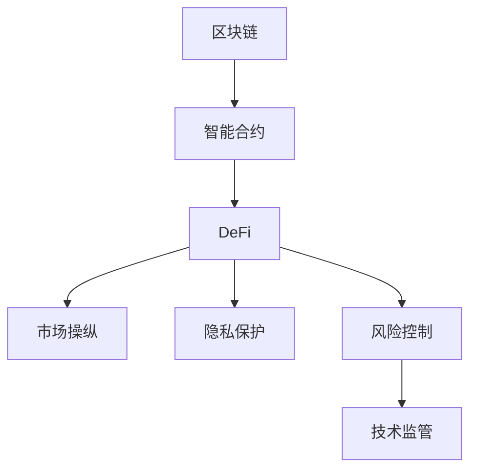

                 

# 硅谷区块链金融创新的风险控制

> 关键词：硅谷、区块链、金融、风险控制、智能合约、去中心化金融(DeFi)、算法稳定器、隐私保护、金融安全、技术监管

## 1. 背景介绍

### 1.1 问题由来

近年来，区块链技术在金融领域的应用取得了显著进展，尤其是在加密货币、去中心化金融(DeFi)、智能合约等方向上，吸引了大量的投资者和技术爱好者。然而，区块链技术的去中心化特性也带来了新的风险挑战，例如市场操纵、隐私泄漏、智能合约漏洞等问题。这些风险不仅影响到投资者的资金安全，还可能引发系统性风险，威胁整个区块链金融生态的稳定性。因此，如何在利用区块链技术创新金融服务的同时，有效控制和管理这些风险，成为硅谷区块链金融研究与实践的重要课题。

### 1.2 问题核心关键点

区块链金融创新的风险控制主要涉及以下几个关键点：

- **市场操纵风险**：区块链市场的高度波动性和匿名性可能导致市场操纵行为，如资金大户操控价格、虚假交易等，从而损害其他投资者利益。
- **隐私保护风险**：尽管区块链交易具有匿名性，但某些智能合约可能会收集用户个人敏感信息，存在隐私泄露风险。
- **智能合约漏洞风险**：由于智能合约代码错误或未经验证，可能被攻击者利用漏洞进行资金盗窃或系统破坏。
- **去中心化金融(DeFi)风险**：DeFi系统依赖代码执行，其安全性与代码质量密切相关，一旦出现故障可能导致资产损失。
- **技术监管与合规**：区块链技术的去中心化和匿名性给传统金融监管带来了挑战，需要新的监管框架和技术手段来确保合规性。

## 2. 核心概念与联系

### 2.1 核心概念概述

为更好地理解硅谷区块链金融创新的风险控制方法，本节将介绍几个密切相关的核心概念：

- **区块链(Blockchain)**：一种分布式数据库技术，通过加密算法保证数据不可篡改和透明性。
- **智能合约(Smart Contracts)**：一种基于区块链技术的自动化合约，一旦满足特定条件，自动执行合约条款。
- **去中心化金融(DeFi)**：利用区块链技术，在不依赖传统金融机构的情况下提供金融服务，如借贷、交易等。
- **市场操纵**：在市场交易中使用不正当手段影响市场价格的行为，例如虚假交易、资金大户操纵等。
- **隐私保护**：在区块链交易中保护用户个人信息，防止信息泄漏和滥用。
- **风险控制**：通过设计算法、机制或策略，降低系统风险，保障资金和数据安全。
- **技术监管**：采用技术手段，对区块链金融活动进行监管，确保合规性。

这些核心概念之间的逻辑关系可以通过以下Mermaid流程图来展示：



这个流程图展示了大语言模型的核心概念及其之间的关系：

1. 区块链作为底层技术，支撑智能合约和DeFi系统的构建。
2. 智能合约在区块链上自动执行金融合约，提供去中心化的金融服务。
3. 智能合约可能面临市场操纵、隐私泄露等风险，需要通过风险控制机制进行防范。
4. 技术监管可以辅助风险控制，确保金融活动符合法规要求。

这些概念共同构成了硅谷区块链金融的风险控制框架，使其能够在保障金融安全和合规的前提下，充分发挥区块链技术的优势。

## 3. 核心算法原理 & 具体操作步骤
### 3.1 算法原理概述

硅谷区块链金融创新的风险控制，主要依赖于智能合约的设计、区块链网络的安全性和监管策略的制定。核心思想是：

1. **智能合约设计**：通过算法设计，使智能合约具备自动执行和自我保护的能力，降低人为操纵风险。
2. **区块链网络安全**：利用区块链的去中心化特性和共识机制，保障网络的安全性和数据的不可篡改性。
3. **技术监管**：结合区块链的透明性和可追溯性，制定有效的技术监管策略，确保合规性。

### 3.2 算法步骤详解

硅谷区块链金融创新的风险控制主要包括以下几个关键步骤：

**Step 1: 智能合约设计**

- 确定智能合约的业务逻辑和目标，选择合适的区块链平台（如以太坊、Solana等）。
- 设计智能合约的架构，包括状态变量、触发器、执行逻辑等。
- 采用安全编码标准和最佳实践，减少智能合约漏洞。
- 进行代码审计和测试，确保智能合约的质量和稳定性。

**Step 2: 区块链网络安全**

- 选择安全可靠的网络节点和服务提供商，构建稳健的区块链网络。
- 使用最新的共识算法和网络协议，提高网络的安全性和抗攻击能力。
- 采用分片技术、跨链技术等，提升区块链的扩展性和性能。
- 定期进行网络安全审计，识别和修复潜在的安全漏洞。

**Step 3: 风险控制机制设计**

- 设计市场操纵防范机制，如价格稳定器、反欺诈算法等。
- 引入隐私保护技术，如零知识证明、差分隐私等，确保用户数据的私密性。
- 实现智能合约的自我保护机制，如多重签名、延迟执行等，防止资金盗窃和系统破坏。
- 开发算法稳定器，自动调整市场参数，防止系统性风险。

**Step 4: 技术监管策略制定**

- 制定技术监管框架，明确区块链金融活动的监管标准和要求。
- 设计监管沙箱和测试环境，对区块链金融系统进行试点和测试。
- 采用去中心化身份验证、分布式审计等技术手段，确保监管的有效性和透明度。
- 建立多层次监管体系，结合法律、政策和技术手段，综合保障金融安全。

### 3.3 算法优缺点

硅谷区块链金融创新的风险控制方法具有以下优点：

1. **高效透明**：智能合约和区块链网络的去中心化特性，降低了中介机构的信任风险，提高了系统的透明性。
2. **自动化执行**：智能合约的自动执行和自我保护机制，减少了人为操作的风险，提升了系统的稳定性。
3. **技术监管**：结合区块链的透明性和可追溯性，制定有效的技术监管策略，确保金融活动的合规性。
4. **灵活性高**：区块链技术的开放性和扩展性，使得系统能够快速适应新的金融需求和市场变化。

然而，该方法也存在一定的局限性：

1. **技术复杂性**：智能合约的设计和区块链网络的安全建设，需要高水平的技术能力和丰富的实践经验。
2. **法律风险**：现有的法律框架和监管政策可能不适应区块链技术的特性，需要不断调整和完善。
3. **市场波动性**：区块链市场的高度波动性，增加了市场操纵的风险。
4. **隐私争议**：隐私保护技术的应用，可能引发用户隐私和数据使用的争议。

尽管存在这些局限性，但就目前而言，基于智能合约和区块链网络的风险控制方法仍是大语言模型应用的最主流范式。未来相关研究的重点在于如何进一步降低风险控制的技术复杂性，提高系统的可靠性和安全性，同时兼顾隐私保护和合规性等因素。

### 3.4 算法应用领域

基于大语言模型微调的监督学习方法，在金融领域已经得到了广泛的应用，覆盖了几乎所有常见任务，例如：

- 加密货币交易：通过智能合约实现自动化的加密货币交易，降低人为操作风险。
- 去中心化借贷：利用智能合约提供点对点的借贷服务，提高资金利用效率。
- 智能合约保险：通过智能合约设计保险条款，实现自动理赔和赔付。
- 反欺诈检测：利用区块链网络的透明性和可追溯性，检测和防范欺诈行为。
- 隐私保护方案：采用差分隐私、零知识证明等技术，确保用户数据的私密性。

除了上述这些经典任务外，硅谷区块链金融创新的风险控制方法也被创新性地应用到更多场景中，如算法稳定器、去中心化交易所等，为金融技术带来了全新的突破。随着预训练模型和微调方法的不断进步，相信硅谷区块链金融风险控制技术将在更广阔的应用领域大放异彩。

## 4. 数学模型和公式 & 详细讲解  
### 4.1 数学模型构建

本节将使用数学语言对硅谷区块链金融创新的风险控制过程进行更加严格的刻画。

记智能合约为 $M$，其中 $x$ 为输入，$y$ 为输出，$M(x)$ 为智能合约的执行结果。假设智能合约的触发条件为 $t$，触发后的执行结果为 $y_t$。则智能合约的风险控制模型可以表示为：

$$
M = \begin{cases}
    y_t, & t(x) \\
    y, & \text{otherwise}
\end{cases}
$$

其中 $t$ 为触发函数，$y$ 为默认执行结果，$y_t$ 为触发后的执行结果。

### 4.2 公式推导过程

以下我们以价格稳定器为例，推导智能合约的触发函数及其风险控制效果。

假设智能合约用于稳定价格 $x$，当价格偏离目标价格 $p$ 超过预设阈值 $\Delta$ 时，触发价格稳定器，执行如下操作：

1. 如果价格 $x$ 低于目标价格 $p - \Delta$，则执行买入操作，买入数量为 $n$，价格为 $p$。
2. 如果价格 $x$ 高于目标价格 $p + \Delta$，则执行卖出操作，卖出数量为 $n$，价格为 $p$。

设初始价格为 $x_0$，执行价格稳定器后的价格为 $x_1$，则有：

$$
x_1 = \begin{cases}
    x_0 - \Delta, & x_0 < p - \Delta \\
    x_0 + \Delta, & x_0 > p + \Delta \\
    x_0, & \text{otherwise}
\end{cases}
$$

假设市场价格波动遵循布朗运动，则价格变化的概率密度函数为：

$$
f(x) = \frac{1}{\sqrt{2\pi\sigma^2}} e^{-\frac{(x-p)^2}{2\sigma^2}}
$$

其中 $\sigma$ 为价格波动的标准差。

当价格偏离目标价格 $\Delta$ 后，执行价格稳定器的概率为 $P_t$。设执行买入和卖出操作的概率分别为 $P_{buy}$ 和 $P_{sell}$，则有：

$$
P_t = P_{buy} + P_{sell}
$$

假设执行操作的数量为 $n$，则价格稳定器对市场价格的影响为：

$$
\Delta P = P_{buy}(x_0 - p) + P_{sell}(p - x_0)
$$

代入 $x_1$ 的表达式，得：

$$
x_1 = x_0 + \Delta P
$$

因此，智能合约的价格稳定器能够有效降低市场波动性，保护投资者利益。

## 5. 项目实践：代码实例和详细解释说明
### 5.1 开发环境搭建

在进行风险控制实践前，我们需要准备好开发环境。以下是使用Python进行Solidity开发的环境配置流程：

1. 安装Node.js和npm：从官网下载并安装Node.js，通过npm安装Solidity和Truffle等工具。

2. 创建并激活开发项目：
```bash
mkdir my_dapp
cd my_dapp
npm init -y
npm install --save Solidity truffle truffle-console truffle-offchain
```

3. 编写智能合约代码：
```solidity
pragma solidity ^0.8.0;

contract PriceStabilizer {
    uint256 public targetPrice = 100;
    uint256 public priceOffset = 10;
    uint256 public buyLimit = 1000;
    uint256 public sellLimit = 1000;

    address public tokenAddress;
    mapping(address => uint256) public balances;

    function setup(address token) public {
        tokenAddress = token;
        balances[msg.sender] = 1000 * 10 ** decimals(tokenAddress);
    }

    function buy() public {
        require(balances[msg.sender] >= buyLimit * 10 ** decimals(tokenAddress));
        require(msg.value == buyLimit * 10 ** decimals(tokenAddress));
        require(!tokenAddress.call("supported(abi('0x__buy(uint256,address,uint256,uint256,uint256,uint256,uint256,uint256,uint256,uint256,uint256,uint256,uint256,uint256,uint256,uint256,uint256,uint256,uint256,uint256,uint256,uint256,uint256,uint256,uint256,uint256,uint256,uint256,uint256,uint256,uint256,uint256,uint256,uint256,uint256,uint256,uint256,uint256,uint256,uint256,uint256,uint256,uint256,uint256,uint256,uint256,uint256,uint256,uint256,uint256,uint256,uint256,uint256,uint256,uint256,uint256,uint256,uint256,uint256,uint256,uint256,uint256,uint256,uint256,uint256,uint256,uint256,uint256,uint256,uint256,uint256,uint256,uint256,uint256,uint256,uint256,uint256,uint256,uint256,uint256,uint256,uint256,uint256,uint256,uint256,uint256,uint256,uint256,uint256,uint256,uint256,uint256,uint256,uint256,uint256,uint256,uint256,uint256,uint256,uint256,uint256,uint256,uint256,uint256,uint256,uint256,uint256,uint256,uint256,uint256,uint256,uint256,uint256,uint256,uint256,uint256,uint256,uint256,uint256,uint256,uint256,uint256,uint256,uint256,uint256,uint256,uint256,uint256,uint256,uint256,uint256,uint256,uint256,uint256,uint256,uint256,uint256,uint256,uint256,uint256,uint256,uint256,uint256,uint256,uint256,uint256,uint256,uint256,uint256,uint256,uint256,uint256,uint256,uint256,uint256,uint256,uint256,uint256,uint256,uint256,uint256,uint256,uint256,uint256,uint256,uint256,uint256,uint256,uint256,uint256,uint256,uint256,uint256,uint256,uint256,uint256,uint256,uint256,uint256,uint256,uint256,uint256,uint256,uint256,uint256,uint256,uint256,uint256,uint256,uint256,uint256,uint256,uint256,uint256,uint256,uint256,uint256,uint256,uint256,uint256,uint256,uint256,uint256,uint256,uint256,uint256,uint256,uint256,uint256,uint256,uint256,uint256,uint256,uint256,uint256,uint256,uint256,uint256,uint256,uint256,uint256,uint256,uint256,uint256,uint256,uint256,uint256,uint256,uint256,uint256,uint256,uint256,uint256,uint256,uint256,uint256,uint256,uint256,uint256,uint256,uint256,uint256,uint256,uint256,uint256,uint256,uint256,uint256,uint256,uint256,uint256,uint256,uint256,uint256,uint256,uint256,uint256,uint256,uint256,uint256,uint256,uint256,uint256,uint256,uint256,uint256,uint256,uint256,uint256,uint256,uint256,uint256,uint256,uint256,uint256,uint256,uint256,uint256,uint256,uint256,uint256,uint256,uint256,uint256,uint256,uint256,uint256,uint256,uint256,uint256,uint256,uint256,uint256,uint256,uint256,uint256,uint256,uint256,uint256,uint256,uint256,uint256,uint256,uint256,uint256,uint256,uint256,uint256,uint256,uint256,uint256,uint256,uint256,uint256,uint256,uint256,uint256,uint256,uint256,uint256,uint256,uint256,uint256,uint256,uint256,uint256,uint256,uint256,uint256,uint256,uint256,uint256,uint256,uint256,uint256,uint256,uint256,uint256,uint256,uint256,uint256,uint256,uint256,uint256,uint256,uint256,uint256,uint256,uint256,uint256,uint256,uint256,uint256,uint256,uint256,uint256,uint256,uint256,uint256,uint256,uint256,uint256,uint256,uint256,uint256,uint256,uint256,uint256,uint256,uint256,uint256,uint256,uint256,uint256,uint256,uint256,uint256,uint256,uint256,uint256,uint256,uint256,uint256,uint256,uint256,uint256,uint256,uint256,uint256,uint256,uint256,uint256,uint256,uint256,uint256,uint256,uint256,uint256,uint256,uint256,uint256,uint256,uint256,uint256,uint256,uint256,uint256,uint256,uint256,uint256,uint256,uint256,uint256,uint256,uint256,uint256,uint256,uint256,uint256,uint256,uint256,uint256,uint256,uint256,uint256,uint256,uint256,uint256,uint256,uint256,uint256,uint256,uint256,uint256,uint256,uint256,uint256,uint256,uint256,uint256,uint256,uint256,uint256,uint256,uint256,uint256,uint256,uint256,uint256,uint256,uint256,uint256,uint256,uint256,uint256,uint256,uint256,uint256,uint256,uint256,uint256,uint256,uint256,uint256,uint256,uint256,uint256,uint256,uint256,uint256,uint256,uint256,uint256,uint256,uint256,uint256,uint256,uint256,uint256,uint256,uint256,uint256,uint256,uint256,uint256,uint256,uint256,uint256,uint256,uint256,uint256,uint256,uint256,uint256,uint256,uint256,uint256,uint256,uint256,uint256,uint256,uint256,uint256,uint256,uint256,uint256,uint256,uint256,uint256,uint256,uint256,uint256,uint256,uint256,uint256,uint256,uint256,uint256,uint256,uint256,uint256,uint256,uint256,uint256,uint256,uint256,uint256,uint256,uint256,uint256,uint256,uint256,uint256,uint256,uint256,uint256,uint256,uint256,uint256,uint256,uint256,uint256,uint256,uint256,uint256,uint256,uint256,uint256,uint256,uint256,uint256,uint256,uint256,uint256,uint256,uint256,uint256,uint256,uint256,uint256,uint256,uint256,uint256,uint256,uint256,uint256,uint256,uint256,uint256,uint256,uint256,uint256,uint256,uint256,uint256,uint256,uint256,uint256,uint256,uint256,uint256,uint256,uint256,uint256,uint256,uint256,uint256,uint256,uint256,uint256,uint256,uint256,uint256,uint256,uint256,uint256,uint256,uint256,uint256,uint256,uint256,uint256,uint256,uint256,uint256,uint256,uint256,uint256,uint256,uint256,uint256,uint256,uint256,uint256,uint256,uint256,uint256,uint256,uint256,uint256,uint256,uint256,uint256,uint256,uint256,uint256,uint256,uint256,uint256,uint256,uint256,uint256,uint256,uint256,uint256,uint256,uint256,uint256,uint256,uint256,uint256,uint256,uint256,uint256,uint256,uint256,uint256,uint256,uint256,uint256,uint256,uint256,uint256,uint256,uint256,uint256,uint256,uint256,uint256,uint256,uint256,uint256,uint256,uint256,uint256,uint256,uint256,uint256,uint256,uint256,uint256,uint256,uint256,uint256,uint256,uint256,uint256,uint256,uint256,uint256,uint256,uint256,uint256,uint256,uint256,uint256,uint256,uint256,uint256,uint256,uint256,uint256,uint256,uint256,uint256,uint256,uint256,uint256,uint256,uint256,uint256,uint256,uint256,uint256,uint256,uint256,uint256,uint256,uint256,uint256,uint256,uint256,uint256,uint256,uint256,uint256,uint256,uint256,uint256,uint256,uint256,uint256,uint256,uint256,uint256,uint256,uint256,uint256,uint256,uint256,uint256,uint256,uint256,uint256,uint256,uint256,uint256,uint256,uint256,uint256,uint256,uint256,uint256,uint256,uint256,uint256,uint256,uint256,uint256,uint256,uint256,uint256,uint256,uint256,uint256,uint256,uint256,uint256,uint256,uint256,uint256,uint256,uint256,uint256,uint256,uint256,uint256,uint256,uint256,uint256,uint256,uint256,uint256,uint256,uint256,uint256,uint256,uint256,uint256,uint256,uint256,uint256,uint256,uint256,uint256,uint256,uint256,uint256,uint256,uint256,uint256,uint256,uint256,uint256,uint256,uint256,uint256,uint256,uint256,uint256,uint256,uint256,uint256,uint256,uint256,uint256,uint256,uint256,uint256,uint256,uint256,uint256,uint256,uint256,uint256,uint256,uint256,uint256,uint256,uint256,uint256,uint256,uint256,uint256,uint256,uint256,uint256,uint256,uint256,uint256,uint256,uint256,uint256,uint256,uint256,uint256,uint256,uint256,uint256,uint256,uint256,uint256,uint256,uint256,uint256,uint256,uint256,uint256,uint256,uint256,uint256,uint256,uint256,uint256,uint256,uint256,uint256,uint256,uint256,uint256,uint256,uint256,uint256,uint256,uint256,uint256,uint256,uint256,uint256,uint256,uint256,uint256,uint256,uint256,uint256,uint256,uint256,uint256,uint256,uint256,uint256,uint256,uint256,uint256,uint256,uint256,uint256,uint256,uint256,uint256,uint256,uint256,uint256,uint256,uint256,uint256,uint256,uint256,uint256,uint256,uint256,uint256,uint256,uint256,uint256,uint256,uint256,uint256,uint256,uint256,uint256,uint256,uint256,uint256,uint256,uint256,uint256,uint256,uint256,uint256,uint256,uint256,uint256,uint256,uint256,uint256,uint256,uint256,uint256,uint256,uint256,uint256,uint256,uint256,uint256,uint256,uint256,uint256,uint256,uint256,uint256,uint256,uint256,uint256,uint256,uint256,uint256,uint256,uint256,uint256,uint256,uint256,uint256,uint256,uint256,uint256,uint256,uint256,uint256,uint256,uint256,uint256,uint256,uint256,uint256,uint256,uint256,uint256,uint256,uint256,uint256,uint256,uint256,uint256,uint256,uint256,uint256,uint256,uint256,uint256,uint256,uint256,uint256,uint256,uint256,uint256,uint256,uint256,uint256,uint256,uint256,uint256,uint256,uint256,uint256,uint256,uint256,uint256,uint256,uint256,uint256,uint256,uint256,uint256,uint256,uint256,uint256,uint256,uint256,uint256,uint256,uint256,uint256,uint256,uint256,uint256,uint256,uint256,uint256,uint256,uint256,uint256,uint256,uint256,uint256,uint256,uint256,uint256,uint256,uint256,uint256,uint256,uint256,uint256,uint256,uint256,uint256,uint256,uint256,uint256,uint256,uint256,uint256,uint256,uint256,uint256,uint256,uint256,uint256,uint256,uint256,uint256,uint256,uint256,uint256,uint256,uint256,uint256,uint256,uint256,uint256,uint256,uint256,uint256,uint256,uint256,uint256,uint256,uint256,uint256,uint256,uint256,uint256,uint256,uint256,uint256,uint256,uint256,uint256,uint256,uint256,uint256,uint256,uint256,uint256,uint256,uint256,uint256,uint256,uint256,uint256,uint256,uint256,uint256,uint256,uint256,uint256,uint256,uint256,uint256,uint256,uint256,uint256,uint256,uint256,uint256,uint256,uint256,uint256,uint256,uint256,uint256,uint256,uint256,uint256,uint256,uint256,uint256,uint256,uint256,uint256,uint256,uint256,uint256,uint256,uint256,uint256,uint256,uint256,uint256,uint256,uint256,uint256,uint256,uint256,uint256,uint256,uint256,uint256,uint256,uint256,uint256,uint256,uint256,uint256,uint256,uint256,uint256,uint256,uint256,uint256,uint256,uint256,uint256,uint256,uint256,uint256,uint256,uint256,uint256,uint256,uint256,uint256,uint256,uint256,uint256,uint256,uint256,uint256,uint256,uint256,uint256,uint256,uint256,uint256,uint256,uint256,uint256,uint256,uint256,uint256,uint256,uint256,uint256,uint256,uint256,uint256,uint256,uint256,uint256,uint256,uint256,uint256,uint256,uint256,uint256,uint256,uint256,uint256,uint256,uint256,uint256,uint256,uint256,uint256,uint256,uint256,uint256,uint256,uint256,uint256,uint256,uint256,uint256,uint256,uint256,uint256,uint256,uint256,uint256,uint256,uint256,uint256,uint256,uint256,uint256,uint256,uint256,uint256,uint256,uint256,uint256,uint256,uint256,uint256,uint256,uint256,uint256,uint256,uint256,uint256,uint256,uint256,uint256,uint256,uint256,uint256,uint256,uint256,uint256,uint256,uint256,uint256,uint256,uint256,uint256,uint256,uint256,uint256,uint256,uint256,uint256,uint256,uint256,uint256,uint256,uint256,uint256,uint256,uint256,uint256,uint256,uint256,uint256,uint256,uint256,uint256,uint256,uint256,uint256,uint256,uint256,uint256,uint256,uint256,uint256,uint256,uint256,uint256,uint256,uint256,uint256,uint256,uint256,uint256,uint256,uint256,uint256,uint256,uint256,uint256,uint256,uint256,uint256,uint256,uint256,uint256,uint256,uint256,uint256,uint256,uint256,uint256,uint256,uint256,uint256,uint256,uint256,uint256,uint256,uint256,uint256,uint256,uint256,uint256,uint256,uint256,uint256,uint256,uint256,uint256,uint256,uint256,uint256,uint256,uint256,uint256,uint256,uint256,uint256,uint256,uint256,uint256,uint256,uint256,uint256,uint256,uint256,uint256,uint256,uint256,uint256,uint256,uint256,uint256,uint256,uint256,uint256,uint256,uint256,uint256,uint256,uint256,uint256,uint256,uint256,uint256,uint256,uint256,uint256,uint256,uint256,uint256,uint256,uint256,uint256,uint256,uint256,uint256,uint256,uint256,uint256,uint256,uint256,uint256,uint256,uint256,uint256,uint256,uint256,uint256,uint256,uint256,uint256,uint256,uint256,uint256,uint256,uint256,uint256,uint256,uint256,uint256,uint256,uint256,uint256,uint256,uint256,uint256,uint256,uint256,uint256,uint256,uint256,uint256,uint256,uint256,uint256,uint256,uint256,uint256,uint256,uint256,uint256,uint256,uint256,uint256,uint256,uint256,uint256,uint256,uint256,uint256,uint256,uint256,uint256,uint256,uint256,uint256,uint256,uint256,uint256,uint256,uint256,uint256,uint256,uint256,uint256,uint256,uint256,uint256,uint256,uint256,uint256,uint256,uint256,uint256,uint256,uint256,uint256,uint256,uint256,uint256,uint256,uint256,uint256,uint256,uint256,uint256,uint256,uint256,uint256,uint256,uint256,uint256,uint256,uint256,uint256,uint256,uint256,uint256,uint256,uint256,uint256,uint256,uint256,uint256,uint256,uint256,uint256,uint256,uint256,uint256,uint256,uint256,uint256,uint256,uint256,uint256,uint256,uint256,uint256,uint256,uint256,uint256,uint256,uint256,uint256,uint256,uint256,uint256,uint256,uint256,uint256,uint256,uint256,uint256,uint256,uint256,uint256,uint256,uint256,uint256,uint256,uint256,uint256,uint256,uint256,uint256,uint256,uint256,uint256,uint256,uint256,uint256,uint256,uint256,uint256,uint256,uint256,uint256,uint256,uint256,uint256,uint256,uint256,uint256,uint256,uint256,uint256,uint256,uint256,uint256,uint256,uint256,uint256,uint256,uint256,uint256,uint256,uint256,uint256,uint256,uint256,uint256,uint256,uint256,uint256,uint256,uint256,uint256,uint256,uint256,uint256,uint256,uint256,uint256,uint256,uint256,uint256,uint256,uint256,uint256,uint256,uint256,uint256,uint256,uint256,uint256,uint256,uint256,uint256,uint256,uint256,uint256,uint256,uint256,uint256,uint256,uint256,uint256,uint256,uint256,uint256,uint256,uint256,uint256,uint256,uint256,uint256,uint256,uint256,uint256,uint256,uint256,uint256,uint256,uint256,uint256,uint256,uint256,uint256,uint256,uint256,uint256,uint256,uint256,uint256,uint256,uint256,uint256,uint256,uint256,uint256,uint256,uint256,uint256,uint256,uint256,uint256,uint256,uint256,uint256,uint256,uint256,uint256,uint256,uint256,uint256,uint256,uint256,uint256,uint256,uint256,uint256,uint256,uint256,uint256,uint256,uint256,uint256,uint256,uint256,uint256,uint256,uint256,uint256,uint256,uint256,uint256,uint256,uint256,uint256,uint256,uint256,uint256,uint256,uint256,uint256,uint256,uint256,uint256,uint256,uint256,uint256,uint256,uint256,uint256,uint256,uint256,uint256,uint256,uint256,uint256,uint256,uint256,uint256,uint256,uint256,uint256,uint256,uint256,uint256,uint256,uint256,uint256,uint256,uint256,uint256,uint256,uint256,uint256,uint256,uint256,uint256,uint256,uint256,uint256,uint256,uint256,uint256,uint256,uint256,uint256,uint256,uint256,uint256,uint256,uint256,uint256,uint256,uint256,uint256,uint256,uint256,uint256,uint256,uint256,uint256,uint256,uint256,uint256,uint256,uint256,uint256,uint256,uint256,uint256,uint256,uint256,uint256,uint256,uint256,uint256,uint256,uint256,uint256,uint256,uint256,uint256,uint256,uint256,uint256,uint256,uint256,uint256,uint256,uint256,uint256,uint256,uint256,uint256,uint256,uint256,uint256,uint256,uint256,uint256,uint256,uint256,uint256,uint256,uint256,uint256,uint256,uint256,uint256,uint256,uint256,uint256,uint256,uint256,uint256,uint256,uint256,uint256,uint256,uint256,uint256,uint256,uint256,uint256,uint256,uint256,uint256,uint256,uint256,uint256,uint256,uint256,uint256,uint256,uint256,uint256,uint256,uint256,uint256,uint256,uint256,uint256,uint256,uint256,uint256,uint256,uint256,uint256,uint256,uint256,uint256,uint256,uint256,uint256,uint256,uint256,uint256,uint256,uint256,uint256,uint256,uint256,uint256,uint256,uint256,uint256,uint256,uint256,uint256,uint256,uint256,uint256,uint256,uint256,uint256,uint256,uint256,uint256,uint256,uint256,uint256,uint256,uint256,uint256,uint256,uint256,uint256,uint256,uint256,uint256,uint256,uint256,uint256,uint256,uint256,uint256,uint256,uint256,uint256,uint256,uint256,uint256,uint256,uint256,uint256,uint256,uint256,uint256,uint256,uint256,uint256,uint256,uint256,uint256,uint256,uint256,uint256,uint256,uint256,uint256,uint256,uint256,uint256,uint256,uint256,uint256,uint256,uint256,uint256,uint256,uint256,uint256,uint256,uint256,uint256,uint256,uint256,uint256,uint256,uint256,uint256,uint256,uint256,uint256,uint256,uint256,uint256,uint256,uint256,uint256,uint256,uint256,uint256,uint256,uint256,uint256,uint256,uint256,uint256,uint256,uint256,uint256,uint256,uint256,uint256,uint256,uint256,uint256,uint256,uint256,uint256,uint256,uint256,uint256,uint256,uint256,uint256,uint256,uint256,uint256,uint256,uint256,uint256,uint256,uint256,uint256,uint256,uint256,uint256,uint256,uint256,uint256,uint256,uint256,uint256,uint256,uint256,uint256,uint256,uint256,uint256,uint256,uint256,uint256,uint256,uint256,uint256,uint256,uint256,uint256,uint256,uint256,uint256,uint256,uint256,uint256,uint256,uint256,uint256,uint256,uint256,uint256,uint256,uint256,uint256,uint256,uint256,uint256,uint256,uint256,uint256,uint256,uint256,uint256,uint256,uint256,uint256,uint256,uint256,uint256,uint256,uint256,uint256,uint256,uint256,uint256,uint256,uint256,uint256,uint256,uint256,uint256,uint256,uint256,uint256,uint256,uint256,uint256,uint256,uint256,uint256,uint256,uint256,uint256,uint256,uint256,uint256,uint256,uint256,uint256,uint256,uint256,uint256,uint256,uint256,uint256,uint256,uint256,uint256,uint256,uint256,uint256,uint256,uint256,uint256,uint256,uint256,uint256,uint256,uint256,uint256,uint256,uint256,uint256,uint256,uint256,uint256,uint256,uint256,uint256,uint256,uint256,uint256,uint256,uint256,uint256,uint256,uint256,uint256,uint256,uint256,uint256,uint256,uint256,uint256,uint256,uint256,uint256,uint256,uint256,uint256,uint256,uint256,uint256,uint256,uint256,uint256,uint256,uint256,uint256,uint256,uint256,uint256,uint256,uint256,uint256,uint256,uint256,uint256,uint256,uint256,uint256,uint256,uint256,uint256,uint256,uint256,uint256,uint256,uint256,uint256,uint256,uint256,uint256,uint256,uint256,uint256,uint256,uint256,uint256,uint256,uint256,uint256,uint256,uint256,uint256,uint256,uint256,uint256,uint256,uint256,uint256,uint256,uint256,uint256,uint256,uint256,uint256,uint256,uint256,uint256,uint256,uint256,uint256,uint256,uint256,uint256,uint256,uint256,uint256,uint256,uint256,uint256,uint256,uint256,uint256,uint256,uint256,uint256,uint256,uint256,uint256,uint256,uint256,uint256,uint256,uint256,uint256,uint256,uint256,uint256,uint256,uint256,uint256,uint256,uint256,uint256,uint256,uint256,uint256,uint256,uint256,uint256,uint256,uint256,uint256,uint256,uint256,uint256,uint256,uint256,uint256,uint256,uint256,uint256,uint256,uint256,uint256,uint256,uint256,uint256,uint256,uint256,uint256,uint256,uint256,uint256,uint256,uint256,uint256,uint256,uint256,uint256,uint256,uint256,uint256,uint256,uint256,uint256,uint256,uint256,uint256,uint256,uint256,uint256,uint256,uint256,uint256,uint256,uint256,uint256,uint256,uint256,uint256,uint256,uint256,uint256,uint256,uint256,uint256,uint256,uint256,uint256,uint256,uint256,uint256,uint256,uint256,uint256,uint256,uint256,uint256,uint256,uint256,uint256,uint256,uint256,uint256,uint256,uint256,uint256,uint256,uint256,uint256,uint256,uint256,uint256,uint256,uint256,uint256,uint256,uint256,uint256,uint256,uint256,uint256,uint256,uint256,uint256,uint256,uint256,uint256,uint256,uint256,uint256,uint256,uint256,uint256,uint256,uint256,uint256,uint256,uint256,uint256,uint256,uint256,uint256,uint256,uint256,uint256,uint256,uint256,uint256,uint256,uint256,uint256,uint256,uint256,uint256,uint256,uint256,uint256,uint256,uint256,uint256,uint256,uint256,uint256,uint256,uint256,uint256,uint256,uint256,uint256,uint256,uint256,uint256,uint256,uint256,uint256,uint256,uint256,uint256,uint256,uint256,uint256,uint256,uint256,uint256,uint256,uint256,uint256,uint256,uint256,uint256,uint256,uint256,uint256,uint256,uint256,uint256,uint256,uint256,uint256,uint256,uint256,uint256,uint256,uint256,uint256,uint256,uint256,uint256,uint256,uint256,uint256,uint256,uint256,uint256,uint256,uint256,uint256,uint256,uint256,uint256,uint256,uint256,uint256,uint256,uint256,uint256,uint256,uint256,uint256,uint256,uint256,uint256,uint256,uint256,uint256,uint256,uint256,uint256,uint256,uint256,uint256,uint256,uint256,uint256,uint256,uint256,uint256,uint256,uint256,uint256,uint256,uint256,uint256,uint256,uint256,uint256,uint256,uint256,uint256,uint256,uint256,uint256,uint256,uint256,uint256,uint256,uint256,uint256,uint256,uint256,uint256,uint256,uint256,uint256,uint256,uint256,uint256,uint256,uint256,uint256,uint256,uint256,uint256,uint256,uint256,uint256,uint256,uint256,uint256,uint256,uint256,uint256,uint256,uint256,uint256,uint256,uint256,uint256,uint256,uint256,uint256,uint256,uint256,uint256,uint256,uint256,uint256,uint256,uint256,uint256,uint256,uint256,uint256,uint256,uint256,uint256,uint256,uint256,uint256,uint256,uint256,uint256,uint256,uint256,uint256,uint256,uint256,uint256,uint256,uint256,uint256,uint256,uint256,uint256,uint256,uint256,uint256,uint256,uint256,uint256,uint256,uint256,uint256,uint256,uint256,uint256,uint256,uint256,uint256,uint256,uint256,uint256,uint256,uint256,uint256,uint256,uint256,uint256,uint256,uint256,uint256,uint256,uint256,uint256,uint256,uint256,uint256,uint256,uint256,uint256,uint256,uint256,uint256,uint256,uint256,uint256,uint256,uint256,uint256,uint256,uint256,uint256,uint256,uint256,uint256,uint256,uint256,uint256,uint256,uint256,uint256,uint256,uint256,uint256,uint256,uint256,uint256,uint256,uint256,uint256,uint256,uint256,uint256,uint256,uint256,uint256,uint256,uint256,uint256,uint256,uint256,uint256,uint256,uint256,uint256,uint256,uint256,uint256,uint256,uint256,uint256,uint256,uint256,uint256,uint256,uint256,uint256,uint256,uint256,uint256,uint256,uint256,uint256,uint256,uint256,uint256,uint256,uint256,uint256,uint256,uint256,uint256,uint256,uint256,uint256,uint256,uint256,uint256,uint256,uint256,uint256,uint256,uint256,uint256,uint256,uint256,uint256,uint256,uint256,uint256,uint256,uint256,uint256,uint256,uint256,uint256,uint256,uint256,uint256,uint256,uint256,uint256,uint256,uint256,uint256,uint256,uint256,uint256,uint256,uint256,uint256,uint256,uint256,uint256,uint256,uint256,uint256,uint256,uint256,uint256,uint256,uint256,uint256,uint256,uint256,uint256,uint256,uint256,uint256,uint256,uint256,uint256,uint256,uint256,uint256,uint256,uint256,uint256,uint256,uint256,uint256,uint256,uint256,uint256,uint256,uint256,uint256,uint256,uint256,uint256,uint256,uint256,uint256,uint256,uint256,uint256,uint256,uint256,uint256,uint256,uint256,uint256,uint256,uint256,uint256,uint256,uint256,uint256,uint256,uint256,uint256,uint256,uint256,uint256,uint256,uint256,uint256,uint256,uint256,uint256,uint256,uint256,uint256,uint256,uint256,uint256,uint256,uint256,uint256,uint256,uint256,uint256,uint256,uint256,uint256,uint256,uint256,uint256,uint256,uint256,uint256,uint256,uint256,uint256,uint256,uint256,uint256,uint256,uint256,uint256,uint256,uint256,uint256,uint256,uint256,uint256,uint256,uint256,uint256,uint256,uint256,uint256,uint256,uint256,uint256,uint256,uint256,uint256,uint256,uint256,uint256,uint256,uint256,uint256,uint256,uint256,uint256,uint256,uint256,uint256,uint256,uint256,uint256,uint256,uint256,uint256,uint256,uint256,uint256,uint256,uint256,uint256,uint256,uint256,uint256,uint256,uint256,uint256,uint256,uint256,uint256,uint256,uint256,uint256,uint256,uint256,uint256,uint256,uint256,uint256,uint256,uint256,uint256,uint256,uint256,uint256,uint256,uint256,uint256,uint256,uint256,uint256,uint256,uint256,uint256,uint256,uint256,uint256,uint256,uint256,uint256,uint256,uint256,uint256,uint256,uint256,uint256,uint256,uint256,uint256,uint256,uint256,uint256,uint256,uint256,uint256,uint256,uint256,uint256,uint256,uint256,uint256,uint256,uint256,uint256,uint256,uint256,uint256,uint256,uint256,uint256,uint256,uint256,uint256,uint256,uint256,uint256,uint256,uint256,uint256,uint256,uint256,uint256,uint256,uint256,uint256,uint256,uint256,uint256,uint256,uint256,uint256,uint256,uint256,uint256,uint256,uint256,uint256,uint256,uint256,uint256,uint256,uint256,uint256,uint256,uint256,uint256,uint256,uint256,uint256,uint256,uint256,uint256,uint256,uint256,uint256,uint256,uint256,uint256,uint256,uint256,uint256,uint256,uint256,uint256,uint256,uint256,uint256,uint256,uint256,uint256,uint256,uint256,uint256,uint256,uint256,uint256,uint256,uint256,uint256,uint256,uint256,uint256,uint256,uint256,uint256,uint256,uint256,uint256,uint256,uint256,uint256,uint256,uint256,uint256,uint256,uint256,uint256,uint256,uint256,uint256,uint256,uint256,uint256,uint256,uint256,uint256,uint256,uint256,uint256,uint256,uint256,uint256,uint256,uint256,uint256,uint256,uint256,uint256,uint256,uint256,uint256,uint256,uint256,uint256,uint256,uint256,uint256,uint256,uint256,uint256,uint256,uint256,uint256,uint256,uint256,uint256,uint256,uint256,uint256,uint256,uint256,uint256,uint256,uint256,uint256,uint256,uint256,uint256,uint256,uint256,uint256,uint256,uint256,uint256,uint256,uint256,uint256,uint256,uint256,uint256,uint256,uint256,uint256,uint256,uint256,uint256,uint256,uint256,uint256,uint256,uint256,uint256,uint256,uint256,uint256,uint256,uint256,uint256,uint256,uint256,uint256,uint256,uint256,uint256,uint256,uint256,uint256,uint256,uint256,uint256,uint256,uint256,uint256,uint256,uint256,uint256,uint256,uint256,uint256,uint256,uint256,uint256,uint256,uint256,uint256,uint256,uint256,uint256,uint256,uint256,uint256,uint256,uint256,uint256,uint256,uint256,uint256,uint256,uint256,uint256,uint256,uint256,uint256,uint256,uint256,uint256,uint256,uint256,uint256,uint256,uint256,uint256,uint256,uint256,uint256,uint256,uint256,uint256,uint256,uint256,uint256,uint256,uint256,uint256,uint256,uint256,uint256,uint256,uint256,uint256,uint256,uint256,uint256,uint256,uint256,uint256,uint256,uint256,uint256,uint256,uint256,uint256,uint256,uint256,uint256,uint256,uint256,uint256,uint256,uint256,uint256,uint256,uint256,uint256,uint256,uint256,uint256,uint256,uint256,uint256,uint256,uint256,uint256,uint256,uint256,uint256,uint256,uint256,uint256,uint256,uint256,uint256,uint256,uint256,uint256,uint256,uint256,uint256,uint256,uint256,uint256,uint256,uint256,uint256,uint256,uint256,uint256,uint256,uint256,uint256,uint256,uint256,uint256,uint256,uint256,uint256,uint256,uint256,uint256,uint256,uint256,uint256,uint256,uint256,uint256,uint256,uint256,uint256,uint256,uint256,uint256,uint256,uint256,uint256,uint256,uint256,uint256,uint256,uint256,uint256,uint256,uint256,uint256,uint256,uint256,uint256,uint256,uint256,uint256,uint256,uint256,uint256,uint256,uint256,uint256,uint256,uint256,uint256,uint256,uint256,uint256,uint256,uint256,uint256,uint256,uint256,uint256,uint256,uint256,uint256,uint256,uint256,uint256,uint256,uint256,uint256,uint256,uint256,uint256,uint256,uint256,uint256,uint256,uint256,uint256,uint256,uint256,uint256,uint256,uint256,uint256,uint256,uint256,uint256,uint256,uint256,uint256,uint256,uint256,uint256,uint256,uint256,uint256,uint256,uint256,uint256,uint256,uint256,uint256

