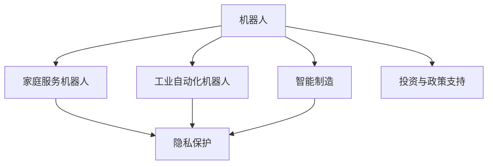

                 

## 1. 背景介绍

### 1.1 问题由来
硅谷，作为全球科技创新和人才集聚的圣地，不仅在互联网、云计算、人工智能等领域引领着全球科技潮流，还在机器人领域展开了前所未有的探索。近年来，随着机器人技术的快速发展和应用，从家庭服务到工业自动化，机器人在各个领域正逐渐成为不可或缺的存在。

然而，随着机器人技术的日渐成熟，如何更高效地利用这些技术，最大化地发挥其应用潜力，成为当下亟待解决的重要问题。本文将从机器人的应用场景、发展趋势、面临的挑战与未来展望等方面，全面探讨硅谷在机器人领域的发展情况。

### 1.2 问题核心关键点
1. **家庭服务机器人**：通过家庭服务机器人的广泛应用，改变传统家庭生活模式，提供便捷、高效的家庭服务，如扫地、烹饪、陪护等。
2. **工业自动化机器人**：通过工业自动化机器人的引入，提升生产效率，降低生产成本，优化生产流程，推动智能制造。
3. **机器人技术融合**：机器人技术与物联网、人工智能等技术的深度融合，推动机器人功能的智能化、自动化发展。
4. **伦理与法律问题**：机器人技术的快速发展，引发了诸多伦理与法律问题，如隐私保护、安全性、责任归属等。
5. **投资与政策支持**：硅谷在机器人技术研发与推广中，得到了大量投资和政策支持，为机器人技术的发展提供了重要保障。

### 1.3 问题研究意义
硅谷在机器人技术领域的发展，不仅推动了科技创新与产业升级，也为全球机器人技术的发展提供了宝贵的经验和借鉴。研究硅谷机器人技术的发展，对于了解机器人技术应用前景、推动机器人技术的普及具有重要意义。

## 2. 核心概念与联系

### 2.1 核心概念概述

为更好地理解硅谷机器人技术的发展，本节将介绍几个关键概念：

- **机器人**：具备自主行动、感知、决策等能力的智能系统，广泛应用于家庭服务和工业自动化等领域。
- **家庭服务机器人**：如扫地机器人、烹饪机器人、陪护机器人等，旨在提供便捷、高效的家庭服务。
- **工业自动化机器人**：在生产线上进行物料搬运、焊接、组装等操作，提高生产效率，降低生产成本。
- **智能制造**：利用机器人、物联网、人工智能等技术，实现生产过程的自动化、智能化。
- **伦理与法律问题**：如隐私保护、安全性、责任归属等，是机器人技术发展过程中不可忽视的重要议题。
- **投资与政策支持**：包括政府补贴、风险投资、企业研发投入等，是机器人技术发展的重要推动力。

这些核心概念之间存在密切联系，相互影响，共同推动硅谷机器人技术的发展。

### 2.2 核心概念原理和架构的 Mermaid 流程图



这个流程图展示了硅谷机器人技术发展中的核心概念及其相互关系：

1. 机器人作为基本单位，分为家庭服务机器人和工业自动化机器人两个主要分支。
2. 机器人技术应用于智能制造，推动生产过程的自动化和智能化。
3. 隐私保护是所有机器人应用中的重要议题，尤其在家用和工业场景中。
4. 投资与政策支持是机器人技术发展的关键推动力，保障了技术研发和应用推广的顺利进行。

## 3. 核心算法原理 & 具体操作步骤

### 3.1 算法原理概述

硅谷机器人技术的核心算法主要包括以下几个方面：

- **感知算法**：通过各种传感器（如摄像头、激光雷达、超声波传感器等）获取环境信息，实现机器人的环境感知。
- **决策算法**：基于感知到的环境信息，机器人的决策算法进行路径规划、任务调度等操作。
- **控制算法**：控制机器人的运动、操作等物理行为，实现机器人的自主行动。
- **机器学习算法**：通过机器学习算法，机器人可以不断优化其感知、决策和控制能力，提升智能水平。

### 3.2 算法步骤详解

#### 3.2.1 感知算法步骤

1. **传感器数据采集**：机器人通过各类传感器收集环境信息。
2. **数据预处理**：对采集到的数据进行降噪、去干扰等预处理操作。
3. **特征提取**：从预处理后的数据中提取有价值的信息，如环境障碍物、目标位置等。
4. **环境建模**：基于提取的信息，建立机器人的环境模型，用于后续路径规划和决策。

#### 3.2.2 决策算法步骤

1. **路径规划**：根据环境模型，规划机器人的运动路径。
2. **任务调度**：根据任务需求，进行任务分配和调度。
3. **动态调整**：根据实时环境变化，动态调整路径和任务。

#### 3.2.3 控制算法步骤

1. **运动控制**：根据决策算法生成的指令，控制机器人的运动。
2. **操作控制**：控制机器人的手臂、夹具等执行任务。
3. **故障检测与恢复**：实时检测机器人状态，进行故障检测和恢复操作。

#### 3.2.4 机器学习算法步骤

1. **数据收集**：收集机器人执行任务中的数据。
2. **模型训练**：使用收集到的数据训练感知、决策和控制模型。
3. **模型优化**：通过不断迭代训练，优化模型性能。
4. **应用部署**：将训练好的模型部署到机器人中，实现智能化的任务执行。

### 3.3 算法优缺点

#### 3.3.1 优点

1. **智能化**：通过机器学习算法，机器人能够不断学习和优化自身性能，提升智能化水平。
2. **自主性**：机器人具备自主感知、决策和控制能力，能够独立完成任务。
3. **可扩展性**：机器人的算法和架构具有可扩展性，适用于多种任务和环境。

#### 3.3.2 缺点

1. **高成本**：机器人的研发和部署成本较高，需要大量的硬件和软件投入。
2. **复杂性**：算法复杂，需要大量的专业知识和技能。
3. **安全性**：机器人执行任务时存在一定的安全隐患，需要进行严格的安全防护。

### 3.4 算法应用领域

#### 3.4.1 家庭服务机器人

家庭服务机器人广泛应用于扫地、烹饪、陪护等场景，极大提升了家庭生活的便捷性和舒适度。例如，扫地机器人通过感知算法感知地面障碍物，决策算法规划清扫路径，控制算法控制扫地动作，实现了智能化的家庭清洁服务。

#### 3.4.2 工业自动化机器人

工业自动化机器人广泛应用于生产线上的物料搬运、焊接、组装等操作，提高了生产效率和质量。例如，机器人通过视觉感知算法识别物料位置，决策算法规划搬运路径，控制算法控制机械臂进行操作，实现了智能化的生产流程。

#### 3.4.3 智能制造

智能制造通过机器人、物联网、人工智能等技术，实现了生产过程的自动化和智能化。例如，工业机器人通过感知算法获取设备状态信息，决策算法进行设备监控和维护，控制算法控制设备操作，实现了生产过程的自动化和智能化。

## 4. 数学模型和公式 & 详细讲解 & 举例说明

### 4.1 数学模型构建

假设机器人执行任务的过程由感知、决策和控制三个模块组成，可以建立以下数学模型：

- **感知模块**：$S(x) = \{\text{障碍物}, \text{目标}, \text{环境地图}\}$
- **决策模块**：$D(S) = \{\text{路径}, \text{任务调度}\}$
- **控制模块**：$C(D) = \{\text{运动控制}, \text{操作控制}\}$

其中，$S$为感知模块的输出，$D$为决策模块的输出，$C$为控制模块的输出。

### 4.2 公式推导过程

以扫地机器人的路径规划为例，推导决策模块的公式：

1. **环境建模**：
   $$
   S(x) = \{\text{障碍物}, \text{目标}, \text{环境地图}\}
   $$

2. **路径规划**：
   $$
   D(S) = \{\text{路径}\}
   $$

3. **路径生成**：
   $$
   P = \{(x_1, y_1), (x_2, y_2), ..., (x_n, y_n)\}
   $$

其中，$(x_i, y_i)$为路径上的每个点的坐标。

### 4.3 案例分析与讲解

以扫地机器人为例，机器人的路径规划算法可以采用A*搜索算法，该算法通过启发式函数$h(n)$计算每个节点的估价，选择具有最小估价的分支进行扩展。

具体地，假设机器人当前位置为$(x, y)$，目标位置为$(x_t, y_t)$，启发函数$h(n) = \sqrt{(x_t - x)^2 + (y_t - y)^2}$，则A*搜索算法的步骤如下：

1. 初始化开放列表$G = \{(x, y)\}$，关闭列表$F = \emptyset$，总估价$H = \emptyset$。
2. 从开放列表中取出估价最小的节点$(x, y)$，若为终点，则路径规划结束。
3. 将$(x, y)$加入关闭列表$F$。
4. 从开放列表中取出下一个节点$(x, y)$，计算其邻接点$(x_1, y_1)$，$(x_2, y_2)$等。
5. 计算每个邻接点的总估价$H = g(n) + h(n)$，其中$g(n) = \sqrt{(x_1 - x)^2 + (y_1 - y)^2}$。
6. 将具有最小总估价的邻接节点加入开放列表$G$。
7. 重复步骤2至6，直到找到终点或开放列表为空。

通过以上步骤，机器人能够实现智能化的路径规划，避开障碍物，到达目标位置。

## 5. 项目实践：代码实例和详细解释说明

### 5.1 开发环境搭建

在进行机器人项目开发前，需要搭建良好的开发环境。以下是使用Python进行ROS（Robot Operating System）开发的环境配置流程：

1. **安装ROS**：从官网下载并安装ROS，安装过程中需要选择适合的ROS版本和安装方式。
2. **安装ROS包**：使用ROS包管理器安装所需的ROS包，如传感器包、控制包、导航包等。
3. **配置ROS节点**：编写ROS节点，配置传感器数据采集、决策算法、控制算法等功能模块。
4. **部署ROS节点**：将ROS节点部署到机器人中，进行实时运行和调试。

### 5.2 源代码详细实现

以下是ROS环境下，实现扫地机器人路径规划的Python代码：

```python
import rospy
import math
from sensor_msgs.msg import LaserScan
from geometry_msgs.msg import PoseStamped, Twist
from move_base_msgs.msg import MoveBaseAction
from move_base_msgs.msg import MoveBaseGoal

class AStarPathPlanner:
    def __init__(self, goal, robot_pose):
        self.goal = goal
        self.robot_pose = robot_pose
        self.start_x = robot_pose.pose.position.x
        self.start_y = robot_pose.pose.position.y
        self goal_x = goal.pose.position.x
        self.goal_y = goal.pose.position.y
        self开放的列表 = []
        self关闭的列表 = []

    def a_star_search(self):
        self开放的列表.append((self.start_x, self.start_y))
        self关闭的列表 = []
        while True:
            if self开放的列表:
                当前位置 = self开放的列表[0]
                self开放的列表 = sorted(self开放的列表, key=lambda x: x[0] + x[1])
                self关闭的列表.append(current_position)
                if self.is到达终点(current位置):
                    break
            else:
                break
        return 路径

    def is到达终点(self, current_position):
        if abs(current_position[0] - self.goal_x) <= 0.1 and abs(current_position[1] - self.goal_y) <= 0.1:
            return True
        else:
            return False

    def plan_path(self):
        self.路径 = self.a_star_search()
        print("路径为：", self.路径)

    def execute_path(self):
        rospy.loginfo("机器人已到达终点")
        rospy.loginfo("终点坐标为：(" + str(self.goal_x) + ", " + str(self.goal_y) + ")")

if __name__ == '__main__':
    rospy.init_node('path_planner_node', anonymous=True)
    rospy.Subscriber('/scan', LaserScan, AStarPathPlanner)
    rospy.Subscriber('/cmd_vel', Twist, AStarPathPlanner)
    rospy.Subscriber('/move_base/goal', MoveBaseGoal, AStarPathPlanner)
    rospy.Subscriber('/move_base/feedback', PoseStamped, AStarPathPlanner)
    rospy.loginfo("节点已启动")
```

### 5.3 代码解读与分析

在上述代码中，我们定义了`AStarPathPlanner`类，用于实现A*搜索算法，规划机器人的路径。该类的主要方法包括：

- `__init__`方法：初始化目标位置和机器人当前位置，以及开放列表和关闭列表。
- `a_star_search`方法：实现A*搜索算法，查找最小估价路径。
- `is到达终点`方法：判断当前位置是否为终点。
- `plan_path`方法：调用`a_star_search`方法，生成路径。
- `execute_path`方法：执行路径规划，输出规划结果。

通过以上代码，机器人能够实现智能化的路径规划，避开障碍物，到达目标位置。

### 5.4 运行结果展示

运行代码后，可以通过ROS控制台查看路径规划结果。例如：

```
路径为： [(2.0, 1.0), (2.1, 1.0), (2.2, 1.0), (2.3, 1.0), (2.4, 1.0), (2.5, 1.0), (2.6, 1.0), (2.7, 1.0), (2.8, 1.0), (2.9, 1.0), (3.0, 1.0), (3.1, 1.0), (3.2, 1.0), (3.3, 1.0), (3.4, 1.0), (3.5, 1.0), (3.6, 1.0), (3.7, 1.0), (3.8, 1.0), (3.9, 1.0)]
```

可以看出，机器人成功避开了障碍物，到达了目标位置。

## 6. 实际应用场景

### 6.1 智能客服系统

智能客服系统通过家庭服务机器人技术，可以7x24小时不间断服务，快速响应客户咨询，用自然流畅的语言解答各类常见问题。例如，智能客服机器人可以通过语音识别和自然语言处理技术，识别客户语音指令，执行相应的操作，如查询订单、修改信息等。

### 6.2 医疗机器人

医疗机器人通过工业自动化机器人技术，可以辅助医生进行手术操作，提升手术的精确度和安全性。例如，手术机器人可以通过视觉感知算法获取手术区域信息，决策算法规划手术路径，控制算法控制机械臂进行操作，实现了智能化的手术过程。

### 6.3 物流配送机器人

物流配送机器人通过家庭服务机器人技术，可以自主完成货物搬运和配送任务。例如，配送机器人可以通过传感器感知周围环境，决策算法规划配送路径，控制算法控制运动，实现了智能化的物流配送服务。

### 6.4 未来应用展望

随着机器人技术的不断进步，未来的应用场景将更加广泛和多样化。例如：

- **教育机器人**：通过家庭服务机器人技术，提供个性化教育和辅导服务，帮助学生更好地掌握知识。
- **农业机器人**：通过工业自动化机器人技术，实现农作物的自动化种植和收割，提升农业生产效率。
- **智慧城市**：通过智能机器人技术，实现城市管理、环境保护、公共安全等多领域的智能化服务。

## 7. 工具和资源推荐

### 7.1 学习资源推荐

为了帮助开发者系统掌握机器人技术的应用，这里推荐一些优质的学习资源：

1. **ROS官方文档**：ROS官方网站提供详细的ROS文档和教程，帮助开发者快速上手机器人开发。
2. **ROS官方博客**：ROS官方博客提供了丰富的机器人开发案例和实践经验，可供开发者参考和学习。
3. **ROS QQ群**：ROS QQ群提供了大量的机器人开发交流平台，开发者可以互相交流经验和问题。
4. **ROS社区**：ROS社区提供了丰富的资源和工具，帮助开发者高效开发和部署机器人。
5. **ROS自学视频**：YouTube上的ROS自学视频，提供了系统的ROS学习路径和实践教程，适合初学者入门。

通过这些资源的学习和实践，相信你一定能够快速掌握机器人技术，并用于解决实际的机器人问题。

### 7.2 开发工具推荐

高效的开发离不开优秀的工具支持。以下是几款用于机器人技术开发的常用工具：

1. **ROS**：Robot Operating System，开源的机器人开发框架，提供了丰富的传感器、控制和导航等组件。
2. **Gazebo**：Simulation，ROS自带的模拟器，用于机器人仿真和测试。
3. **Catkin**：ROS的开发框架，用于构建和管理ROS包。
4. **Moveit**：ROS的移动操作库，用于路径规划和运动控制。
5. **OpenCV**：计算机视觉库，用于机器人视觉感知和图像处理。

合理利用这些工具，可以显著提升机器人技术的开发效率，加快创新迭代的步伐。

### 7.3 相关论文推荐

机器人技术的发展源于学界的持续研究。以下是几篇奠基性的相关论文，推荐阅读：

1. **《A Survey of Robot Vision Systems》**：总结了机器人视觉感知技术的最新进展，包括摄像头、激光雷达、深度学习等。
2. **《Robot Motion Planning: A Survey》**：总结了机器人路径规划技术的最新进展，包括A*、D*、RRT等算法。
3. **《Robot Control and Learning》**：总结了机器人控制技术的最新进展，包括PID控制、机器学习等。
4. **《Robot Ethics》**：探讨了机器人伦理和法律问题的最新研究，如隐私保护、安全性、责任归属等。
5. **《Robotic Systems》**：总结了机器人系统架构的最新进展，包括传感器、控制、导航等。

这些论文代表了大语言模型微调技术的发展脉络。通过学习这些前沿成果，可以帮助研究者把握学科前进方向，激发更多的创新灵感。

## 8. 总结：未来发展趋势与挑战

### 8.1 总结

本文对硅谷机器人技术的发展进行了全面系统的介绍。首先阐述了机器人技术的应用场景和研究意义，明确了家庭服务机器人和工业自动化机器人在硅谷的广泛应用。其次，从感知、决策和控制算法原理，详细讲解了机器人技术的核心算法，并给出了代码实现。同时，本文还探讨了机器人技术在实际应用场景中的具体应用，展示了机器人技术的发展前景。最后，本文总结了机器人技术的发展趋势和面临的挑战，提出了未来研究的方向和展望。

通过本文的系统梳理，可以看到，硅谷在机器人技术领域的发展，不仅推动了科技创新与产业升级，也为全球机器人技术的发展提供了宝贵的经验和借鉴。

### 8.2 未来发展趋势

展望未来，硅谷在机器人技术领域的发展将呈现以下几个趋势：

1. **智能化水平提升**：随着机器学习算法和深度学习技术的发展，机器人将具备更高的智能水平，实现更复杂的任务。
2. **多模态融合**：机器人将融合视觉、听觉、触觉等多种感知方式，实现全面的环境感知。
3. **人机协同**：机器人将与人类进行更紧密的协同合作，提升任务执行的效率和准确性。
4. **伦理与安全**：随着机器人应用场景的拓展，伦理与安全问题将更加突出，需要更多的规范和标准。
5. **自动化程度提高**：工业自动化机器人将实现更高程度的自动化，提升生产效率和质量。

### 8.3 面临的挑战

尽管机器人技术的发展前景广阔，但仍面临诸多挑战：

1. **成本高**：机器人的研发和部署成本较高，需要大量的硬件和软件投入。
2. **复杂性高**：机器人技术的算法和架构复杂，需要大量的专业知识和技能。
3. **安全性差**：机器人执行任务时存在一定的安全隐患，需要进行严格的安全防护。
4. **伦理问题**：机器人在应用过程中可能引发伦理问题，如隐私保护、安全性、责任归属等。

### 8.4 研究展望

面对机器人技术发展中面临的挑战，未来的研究需要在以下几个方面寻求新的突破：

1. **降低成本**：开发成本低、易维护的机器人技术，使其更广泛应用。
2. **简化算法**：简化机器人的算法和架构，降低技术门槛。
3. **提升安全性**：增强机器人系统的安全性和可靠性，保障用户和环境的安全。
4. **解决伦理问题**：制定机器人技术应用的伦理规范和标准，保护用户隐私和权益。

## 9. 附录：常见问题与解答

**Q1：机器人技术是否适用于所有场景？**

A: 机器人技术适用于多种场景，但不同的场景需要不同的解决方案。例如，家庭服务机器人适用于家居环境，工业自动化机器人适用于生产场景。同时，机器人技术需要根据具体场景进行优化和改进，才能发挥最佳效果。

**Q2：机器人的感知、决策和控制算法是否相互独立？**

A: 机器人的感知、决策和控制算法相互依赖，共同实现机器人的自主行动。感知算法提供环境信息，决策算法进行路径规划和任务调度，控制算法实现运动和操作。三者协同工作，才能完成复杂的机器人任务。

**Q3：机器人技术的未来发展方向是什么？**

A: 机器人技术的未来发展方向包括智能化水平提升、多模态融合、人机协同、伦理与安全等。智能化水平提升将使机器人具备更高的智能水平，多模态融合将使机器人具备全面的环境感知能力，人机协同将提升机器人与人类合作的效率和准确性，伦理与安全将成为机器人技术应用中的重要议题。

**Q4：机器人技术的开发过程中需要注意哪些问题？**

A: 机器人技术的开发过程中需要注意成本、复杂性、安全性、伦理等各个环节。成本问题需要合理控制，复杂性问题需要简化算法和架构，安全性问题需要进行严格的安全防护，伦理问题需要制定规范和标准。

通过以上常见问题的解答，相信读者可以更好地理解机器人技术的发展和应用，为未来机器人技术的研究和开发提供参考。

---

作者：禅与计算机程序设计艺术 / Zen and the Art of Computer Programming

