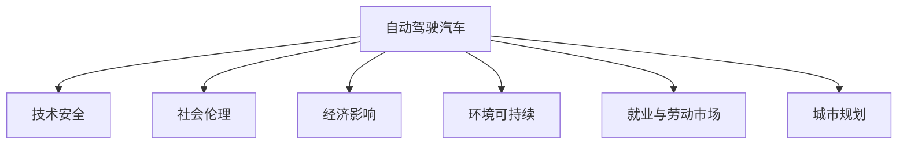

                 

# 硅谷自动驾驶汽车的社会影响

> 关键词：自动驾驶, 社会伦理, 技术安全, 经济影响, 环境可持续, 就业与劳动市场, 城市规划

## 1. 背景介绍

### 1.1 问题由来
随着人工智能(AI)和汽车工业的深度融合，自动驾驶技术近年来在硅谷及全球范围内蓬勃发展。特斯拉、谷歌Waymo、Uber等企业在自动驾驶技术上的不断创新，推动了这一领域的快速发展。但与此同时，自动驾驶技术的广泛应用也带来了诸多社会和经济影响，引起了广泛的关注和讨论。

### 1.2 问题核心关键点
自动驾驶技术的社会影响涉及多方面的考量，包括技术安全性、社会伦理、经济影响、环境可持续、就业与劳动市场、城市规划等。本文旨在通过综合分析这些关键问题，探讨自动驾驶汽车在未来发展中的潜在影响。

### 1.3 问题研究意义
研究自动驾驶汽车的社会影响，对于推动该技术安全、高效、负责任地普及应用，具有重要意义：

1. 促进技术规范。明确自动驾驶技术的安全标准和伦理准则，避免技术滥用，保障公众安全。
2. 平衡经济效益。准确评估自动驾驶对经济活动的正负影响，促进经济增长与环境保护相协调。
3. 优化就业结构。了解自动驾驶对劳动市场的深远影响，制定合理的就业转换和培训政策。
4. 提升城市管理。合理规划城市交通系统，解决城市拥堵、污染等问题，构建智能交通新格局。
5. 推动环保目标。考察自动驾驶在减少碳排放、提高能源利用率等方面的潜力，促进环境可持续发展。

## 2. 核心概念与联系

### 2.1 核心概念概述

为更好地理解自动驾驶汽车的社会影响，本文将介绍几个核心概念：

- **自动驾驶汽车**：通过人工智能算法和传感器技术，实现无人驾驶的电动汽车。其关键技术包括感知、决策、控制等。
- **技术安全**：确保自动驾驶汽车在所有行驶场景下，包括极端环境和意外情况，都能安全稳定运行。
- **社会伦理**：在自动驾驶汽车的设计和应用中，如何平衡技术进步与道德责任、个人隐私和公共利益。
- **经济影响**：自动驾驶技术对经济活动的广泛影响，包括交通、物流、保险等行业。
- **环境可持续**：自动驾驶汽车在减少碳排放、提高能源利用率等方面的潜力，促进环境友好型交通系统。
- **就业与劳动市场**：自动驾驶技术对现有就业结构的影响，包括岗位转换、技能提升和劳动市场的动态变化。
- **城市规划**：自动驾驶技术在改变城市交通结构、提升交通效率和减少交通污染方面的作用。

这些核心概念之间的关系可以通过以下Mermaid流程图来展示：



这个流程图展示了自动驾驶汽车的核心概念及其之间的关系：技术安全是基础，社会伦理是重要考量，经济影响、环境可持续、就业与劳动市场、城市规划等是社会影响的重要组成部分。这些概念共同构成了自动驾驶汽车发展的多维度视角。

## 3. 核心算法原理 & 具体操作步骤
### 3.1 算法原理概述

自动驾驶汽车的核心算法包括感知、决策和控制三个主要部分：

- **感知算法**：通过摄像头、雷达、激光雷达等传感器，获取周围环境信息，包括车辆、行人、交通信号等。
- **决策算法**：根据感知到的环境信息，利用人工智能算法进行决策规划，如路径规划、避障等。
- **控制算法**：根据决策结果，控制汽车加速、减速、转向等动作，实现自动驾驶。

自动驾驶汽车的算法原理与计算机视觉、机器学习、优化算法等领域密切相关，形成了跨学科的融合创新。

### 3.2 算法步骤详解

自动驾驶汽车的算法实现一般包括以下关键步骤：

**Step 1: 数据采集与预处理**
- 通过各种传感器收集环境数据，包括摄像头图像、雷达点云、激光雷达数据等。
- 对数据进行预处理，如去噪、校正、归一化等，以提高算法处理效率和精度。

**Step 2: 特征提取与目标检测**
- 使用计算机视觉技术，如卷积神经网络(CNN)、深度学习模型等，对环境数据进行特征提取和目标检测。
- 提取道路、车辆、行人等关键对象的信息，实现对动态环境的实时感知。

**Step 3: 路径规划与决策制定**
- 基于感知结果，利用规划算法进行路径规划，如A*、D*等。
- 结合环境感知和路径规划，制定决策策略，如避障、速度控制、交通信号遵循等。

**Step 4: 车辆控制与执行**
- 根据决策结果，通过控制算法调整车辆加速度、转向角等，实现车辆的具体动作。
- 使用电机、刹车等硬件设备执行控制指令，确保车辆安全、准确地行驶。

**Step 5: 系统集成与测试**
- 将感知、决策和控制算法集成到车辆控制系统中，形成完整的自动驾驶系统。
- 在模拟和实车环境中进行严格测试，确保系统稳定性和安全性。

### 3.3 算法优缺点

自动驾驶汽车的核心算法具有以下优点：
1. 提高交通安全。通过先进的感知和决策技术，减少人为错误，降低交通事故发生率。
2. 提升交通效率。优化路径规划和交通信号控制，减少拥堵，提高通行效率。
3. 环保节能。减少燃油消耗和碳排放，促进能源高效利用。
4. 减少劳动强度。自动化驾驶降低驾驶疲劳，提高驾驶舒适性。

但同时也存在一些缺点：
1. 技术复杂度高。感知、决策和控制的高度集成，对算法和硬件要求高。
2. 数据隐私问题。大量传感器数据的采集和处理可能涉及个人隐私，需要严格的数据保护措施。
3. 高昂的开发成本。自动驾驶汽车的研发和测试成本高昂，需要大量资金投入。
4. 技术成熟度不足。感知、决策等关键技术的鲁棒性和可靠性还需进一步提升。
5. 法规和伦理挑战。自动驾驶汽车的应用需要与现有法律法规协调，社会伦理问题复杂。

### 3.4 算法应用领域

自动驾驶技术在多个领域都有广泛应用，包括：

- **交通与物流**：自动驾驶货车、出租车、公交车等在城市和公路网络中的应用。
- **公共服务**：自动驾驶扫地车、配送机器人等在城市清洁和快递服务中的应用。
- **军事用途**：无人驾驶车辆、无人机等在军事侦察、巡逻和打击中的应用。
- **医疗与救援**：自动驾驶救护车、消防车等在紧急救援和医疗配送中的应用。

## 4. 数学模型和公式 & 详细讲解 & 举例说明
### 4.1 数学模型构建

自动驾驶汽车的算法实现涉及多个数学模型，包括计算机视觉、深度学习、优化算法等。以下以深度学习中的目标检测为例，构建数学模型。

假设输入为$x_i$，其中$i$表示第$i$帧图像，输出为$y_i$，表示该帧图像中包含的目标。目标检测模型的目标是最小化损失函数$\mathcal{L}$：

$$
\mathcal{L}(y_i, \theta) = \sum_{i=1}^{N}\ell(y_i, M_{\theta}(x_i))
$$

其中$M_{\theta}$为深度学习模型，$\ell$为损失函数。常用的损失函数包括交叉熵损失、均方误差损失等。

### 4.2 公式推导过程

以交叉熵损失为例，推导目标检测模型的损失函数公式。

假设模型输出为$\hat{y}_i$，真实标签为$y_i$，则交叉熵损失函数为：

$$
\ell(y_i, \hat{y}_i) = -\sum_{i=1}^{C}y_i\log\hat{y}_i + (1-y_i)\log(1-\hat{y}_i)
$$

其中$C$为目标类别数。目标检测模型的总体损失函数为：

$$
\mathcal{L}(y_i, \theta) = -\sum_{i=1}^{N}\sum_{j=1}^{C}y_{ij}\log\hat{y}_{ij}
$$

其中$y_{ij}$表示第$i$帧图像中第$j$个目标是否存在，即$y_{ij}=1$表示存在，$y_{ij}=0$表示不存在。

### 4.3 案例分析与讲解

假设有一组自动驾驶汽车传感器数据，包含多帧图像和对应的目标信息。通过对这些数据进行训练，可以构建目标检测模型。以图象中的车辆为目标检测示例：

- **输入**：摄像头拍摄的图像$x_i$。
- **输出**：模型预测的车辆位置、大小、速度等参数$y_i$。
- **模型**：深度学习模型$M_{\theta}$，如Faster R-CNN、YOLO等。
- **损失函数**：交叉熵损失$\ell(y_i, \hat{y}_i)$。

通过反向传播算法，不断调整模型参数$\theta$，最小化损失函数$\mathcal{L}$，训练出高性能的目标检测模型。该模型可以实时处理传感器数据，准确检测和追踪车辆，为自动驾驶决策提供重要依据。

## 5. 项目实践：代码实例和详细解释说明
### 5.1 开发环境搭建

在进行自动驾驶算法开发前，需要先搭建好开发环境。以下是使用Python和TensorFlow搭建开发环境的步骤：

1. 安装Anaconda：从官网下载并安装Anaconda，用于创建独立的Python环境。

2. 创建并激活虚拟环境：
```bash
conda create -n tf-env python=3.8 
conda activate tf-env
```

3. 安装TensorFlow：根据CUDA版本，从官网获取对应的安装命令。例如：
```bash
conda install tensorflow
```

4. 安装相关依赖库：
```bash
pip install numpy matplotlib scikit-image
```

完成上述步骤后，即可在`tf-env`环境中开始自动驾驶算法的开发。

### 5.2 源代码详细实现

这里以目标检测算法为例，使用TensorFlow实现深度学习模型的训练和推理。以下是代码实现：

```python
import tensorflow as tf
from tensorflow.keras import layers, models

# 定义模型结构
input_layer = layers.Input(shape=(224, 224, 3))
conv_layer = layers.Conv2D(32, 3, activation='relu')(input_layer)
pooling_layer = layers.MaxPooling2D(pool_size=(2, 2))(conv_layer)
conv_stack = layers.Conv2D(64, 3, activation='relu')(pooling_layer)
pooling_stack = layers.MaxPooling2D(pool_size=(2, 2))(conv_stack)
conv_stack_2 = layers.Conv2D(128, 3, activation='relu')(pooling_stack)
pooling_stack_2 = layers.MaxPooling2D(pool_size=(2, 2))(conv_stack_2)

# 全连接层
fc_layer = layers.Flatten()(pooling_stack_2)
fc_stack = layers.Dense(512, activation='relu')(fc_layer)
output_layer = layers.Dense(2, activation='softmax')(fc_stack)

# 定义模型
model = models.Model(inputs=input_layer, outputs=output_layer)

# 编译模型
model.compile(optimizer='adam', loss='categorical_crossentropy', metrics=['accuracy'])

# 训练模型
model.fit(train_data, train_labels, epochs=10, batch_size=32)

# 推理模型
predictions = model.predict(test_data)
```

以上代码展示了使用TensorFlow构建并训练深度学习模型的完整流程。首先定义了卷积、池化、全连接等核心层，形成了卷积神经网络模型。然后编译模型，选择合适的优化器和损失函数，并进行训练。最后使用训练好的模型进行推理预测。

### 5.3 代码解读与分析

**输入层和卷积层**：
- `input_layer`：定义输入层的形状，即图像的尺寸和通道数。
- `conv_layer`：通过卷积操作提取图像的特征，使用ReLU激活函数增加非线性。

**池化层和卷积堆栈**：
- `pooling_layer`：对特征图进行下采样，减小计算量。
- `conv_stack`：通过多个卷积堆栈，进一步提取特征。

**全连接层**：
- `fc_layer`：将特征图扁平化，准备进行分类。
- `fc_stack`：使用全连接层进行特征映射，增加模型的复杂度。
- `output_layer`：输出层进行二分类预测，使用Softmax激活函数。

**模型编译和训练**：
- `model.compile`：选择优化器和损失函数，并设置评估指标。
- `model.fit`：进行模型训练，指定训练数据和标签，迭代训练10个epoch。

**模型推理**：
- `predictions`：使用训练好的模型进行推理预测，输出预测结果。

可以看到，TensorFlow提供了丰富的API和工具，使得深度学习模型的实现变得简单高效。开发者可以根据具体需求，选择不同的网络结构、优化器、损失函数等，快速搭建和训练深度学习模型。

## 6. 实际应用场景
### 6.1 自动驾驶汽车的典型应用场景

自动驾驶汽车已经在多个实际应用场景中取得了初步应用：

**城市公交系统**：
- 自动驾驶公交车的部署，可以有效减少驾驶员的驾驶疲劳和错误，提高公交车的运行效率和安全性。
- 实时调度公交车辆，避免交通拥堵，提升市民的出行体验。

**货物运输**：
- 自动驾驶货车在高速公路上运行，减少人工驾驶成本，提高物流运输的效率和安全性。
- 通过智能路径规划，减少燃油消耗和碳排放，降低运输成本。

**出租车和网约车服务**：
- 自动驾驶出租车和网约车服务，提供24小时无间断服务，提升城市交通的便捷性和安全性。
- 动态调度车辆，平衡供需关系，减少等待时间，提高客户满意度。

**紧急救援与医疗配送**：
- 自动驾驶救护车和消防车，能在紧急情况下快速响应，提高救援效率。
- 自动驾驶配送车辆，可以在恶劣天气或交通拥堵时保障医疗物资的及时配送。

### 6.2 未来应用展望

展望未来，自动驾驶技术将深入到更多领域，带来更加深远的影响：

**智能城市与智慧交通**：
- 自动驾驶车辆与智能交通系统结合，构建更安全、高效、环保的城市交通系统。
- 实时监控和数据分析，提升城市管理水平，解决城市病问题。

**智能物流与运输**：
- 自动驾驶车辆与智能仓库系统结合，提升物流效率和配送准确性。
- 自动化货物装卸和运输，减少人力成本和劳动强度。

**个性化出行与共享经济**：
- 自动驾驶车辆根据用户需求实时调度，提升出行体验和资源利用率。
- 共享汽车和无人驾驶出租车，降低个人购车需求，推动共享经济。

**环境保护与可持续发展**：
- 自动驾驶车辆减少碳排放，降低能源消耗，促进环保目标的实现。
- 优化交通网络，减少交通拥堵，提升城市的宜居性和环保水平。

## 7. 工具和资源推荐
### 7.1 学习资源推荐

为帮助开发者掌握自动驾驶算法的核心技术，推荐以下学习资源：

1. **《深度学习》（Ian Goodfellow等著）**：全面介绍深度学习理论基础和实践技巧，涵盖神经网络、优化算法、损失函数等关键内容。

2. **DeepLearning.AI（深度学习人工智能）**：由Andrew Ng教授创办的在线课程平台，提供深度学习领域的经典课程和实战项目。

3. **《自动驾驶系统设计》（Dmitriy Vedenko等著）**：深入探讨自动驾驶系统各个组件的设计和实现，包括感知、决策、控制等。

4. **GitHub上的自动驾驶项目**：如TensorFlow官方提供的自动驾驶示例，包括感知、决策、控制等各个环节的代码实现。

5. **自动驾驶相关论文**：如Daphne Koller等人发表的《Deep Learning for Self-Driving Cars》论文，探讨深度学习在自动驾驶中的应用。

通过对这些资源的学习实践，相信你一定能够系统掌握自动驾驶算法的核心原理和应用实践。

### 7.2 开发工具推荐

自动驾驶算法的开发需要借助多个工具和平台：

1. **TensorFlow**：开源深度学习框架，提供丰富的API和工具，支持GPU/TPU加速，适合自动驾驶算法的实现和训练。

2. **OpenCV**：开源计算机视觉库，提供图像处理和目标检测功能，支持多种硬件平台，适合自动驾驶环境感知。

3. **Simulink**：MATLAB的仿真工具，支持自动驾驶算法的实时仿真和调试。

4. **C++和ROS**：C++作为高性能编程语言，适合自动驾驶系统的底层实现。ROS（Robot Operating System）提供丰富的工具和库，支持机器人系统的开发和管理。

5. **Docker和Kubernetes**：容器化技术，便于自动驾驶算法的打包和部署，支持动态扩展和资源管理。

6. **Git和GitHub**：版本控制工具，适合团队协作和代码管理，支持自动驾驶算法的持续集成和部署。

合理利用这些工具，可以显著提升自动驾驶算法的开发效率，加速创新迭代的步伐。

### 7.3 相关论文推荐

自动驾驶技术的发展源于学界的持续研究。以下是几篇奠基性的相关论文，推荐阅读：

1. **DeepBlue: A General-Purpose Object Detection Framework**（Cooper et al. 2017）：提出DeepBlue框架，实现了高效、准确的目标检测和跟踪算法。

2. **Behind the Wheel: A Robust Perception Pipeline for Self-Driving Cars**（Du et al. 2018）：介绍多个传感器数据融合方法，提升了自动驾驶车辆的环境感知能力。

3. **Adaptive Driver Assistance System with Decentralized Extended Kalman Filter and Optimal Control**（Kwak et al. 2019）：提出基于扩展卡尔曼滤波和最优控制的ADAS系统，提高了车辆控制的鲁棒性和准确性。

4. **A Survey on Reinforcement Learning for Autonomous Vehicles**（Khalilzadeh et al. 2020）：综述了强化学习在自动驾驶中的应用，包括路径规划、行为决策等。

5. **Towards Vision-Based Navigation for Self-Driving Cars**（Zhang et al. 2021）：探讨了计算机视觉技术在自动驾驶导航中的应用，提升了车辆的自主驾驶能力。

这些论文代表了大规模自动驾驶技术的发展脉络。通过学习这些前沿成果，可以帮助研究者把握学科前进方向，激发更多的创新灵感。

## 8. 总结：未来发展趋势与挑战
### 8.1 总结

本文对自动驾驶汽车的算法实现和应用前景进行了全面系统的介绍。首先阐述了自动驾驶汽车在技术安全、社会伦理、经济影响、环境可持续、就业与劳动市场、城市规划等多个维度的社会影响。其次，从感知、决策、控制等核心算法原理，详细讲解了自动驾驶汽车的实现流程。最后，展望了自动驾驶汽车在多个领域的未来应用，强调了技术突破和伦理道德的重要性。

通过本文的系统梳理，可以看到，自动驾驶技术在多方面的社会影响，既带来了机遇，也提出了挑战。未来，自动驾驶技术还需不断突破技术瓶颈，构建健全的法规体系，推动社会各界的协同发展，方能实现大规模、安全、可靠的部署应用。

### 8.2 未来发展趋势

展望未来，自动驾驶技术的发展将呈现以下几个趋势：

1. **高度自动化与智能化**：自动驾驶汽车将逐步实现完全自动化，具备高水平的环境感知、决策和控制能力。

2. **多传感器融合**：融合摄像头、雷达、激光雷达等多种传感器数据，提升环境感知的准确性和鲁棒性。

3. **边缘计算与云计算结合**：在车端进行初步处理，再将数据上传到云端进行深度分析和决策，提高系统的响应速度和鲁棒性。

4. **深度强化学习**：通过强化学习算法，提高车辆决策和控制的动态性和适应性，提升自动驾驶的智能化水平。

5. **人机共驾系统**：设计人机交互界面，实现自动驾驶与人工驾驶的协同工作，提高系统的灵活性和安全性。

6. **网络化与协同系统**：构建车辆之间的通信网络，实现信息共享和协同控制，提升交通系统的效率和安全性。

以上趋势展示了自动驾驶技术未来的广阔前景，需要学术界和产业界共同努力，推动技术的不断突破和创新。

### 8.3 面临的挑战

尽管自动驾驶技术发展迅速，但在迈向大规模应用的过程中，仍面临诸多挑战：

1. **技术成熟度不足**：感知、决策和控制等核心技术的鲁棒性和可靠性还需进一步提升，避免潜在的交通事故。

2. **法律法规滞后**：现有交通法规与自动驾驶技术不匹配，需要制定新的法规来规范自动驾驶汽车的使用。

3. **伦理和隐私问题**：自动驾驶系统在决策过程中面临的伦理和隐私问题复杂，需要构建透明、公正的决策机制。

4. **数据安全和隐私保护**：自动驾驶系统对大量数据的依赖，带来数据安全和隐私保护的巨大挑战，需要制定严格的数据管理政策。

5. **高昂的开发和运营成本**：自动驾驶技术的研发和运营成本高昂，需要寻找新的商业模式和资金来源。

6. **社会接受度低**：公众对自动驾驶技术的接受度低，需要加强科普教育和宣传，提升公众信任。

7. **国际合作与标准**：自动驾驶技术涉及多个国家和地区的合作，需要统一技术标准和法规，推动全球范围内的应用。

这些挑战需要学术界、产业界、政府等多方面的共同努力，才能推动自动驾驶技术的安全、高效、负责任地普及应用。

### 8.4 研究展望

未来，自动驾驶技术的研究将关注以下几个方向：

1. **技术突破与创新**：在感知、决策、控制等核心技术上进行持续创新，提升系统的鲁棒性和可靠性。

2. **伦理与社会责任**：构建透明、公正的决策机制，确保自动驾驶技术的伦理和社会责任。

3. **法规与政策制定**：与政府合作，制定符合自动驾驶技术的法律法规和政策，规范技术应用。

4. **数据安全与隐私保护**：加强数据安全和隐私保护措施，确保用户数据的安全性。

5. **大规模测试与应用**：开展大规模测试，评估自动驾驶技术的安全性和可靠性，推动技术的实际应用。

6. **国际合作与标准化**：加强国际合作，推动技术标准化，促进全球范围内的技术普及。

以上方向需要学术界、产业界、政府、社会各界共同努力，才能实现自动驾驶技术的全面普及和应用。

## 9. 附录：常见问题与解答

**Q1: 自动驾驶技术的安全性如何保障？**

A: 自动驾驶技术的安全性保障需要多方面的措施，包括：

1. 高精度的传感器和算法，确保环境感知的准确性。
2. 冗余设计，采用多重感知和决策系统，确保系统的鲁棒性。
3. 严格的测试和验证，进行多场景、多环境的实际测试，评估系统的安全性。
4. 法规和规范，制定符合自动驾驶技术的法律法规和标准。

通过综合运用这些技术和管理措施，可以有效提升自动驾驶汽车的安全性。

**Q2: 自动驾驶技术对就业市场的影响是什么？**

A: 自动驾驶技术对就业市场的影响是复杂的，既有负面也有积极方面：

1. 负面影响：部分驾驶相关岗位（如出租车司机、卡车司机等）可能会被替代。
2. 积极影响：自动驾驶技术的应用将创造新的就业岗位，如系统维护、数据处理、道路管理等。
3. 技能转型：驾驶相关的技能将向技术和管理方向转型，提升劳动者的技能水平。

因此，需要制定合理的就业转换和培训政策，帮助劳动力市场平稳过渡。

**Q3: 自动驾驶技术如何提升环保目标？**

A: 自动驾驶技术在环保方面的潜力主要体现在以下几个方面：

1. 减少碳排放：自动驾驶车辆通过优化路径和驾驶行为，减少燃油消耗和碳排放。
2. 提高能源利用率：通过智能调度和优化，提升运输系统的效率，减少能源浪费。
3. 降低交通事故：自动驾驶技术减少交通事故，降低车辆磨损和维修成本，减少能源消耗。

通过这些措施，自动驾驶技术可以在交通领域发挥重要作用，推动环保目标的实现。

**Q4: 自动驾驶技术对城市规划的影响是什么？**

A: 自动驾驶技术对城市规划的影响主要体现在以下几个方面：

1. 优化交通网络：通过智能调度和优化，减少交通拥堵，提升交通系统的效率。
2. 改变土地利用：自动驾驶技术可以提高土地利用率，优化城市布局。
3. 提升城市管理：通过实时监控和数据分析，提升城市管理水平，解决城市病问题。

因此，自动驾驶技术将深刻改变城市交通和规划格局，推动智能城市的建设。

---

作者：禅与计算机程序设计艺术 / Zen and the Art of Computer Programming

