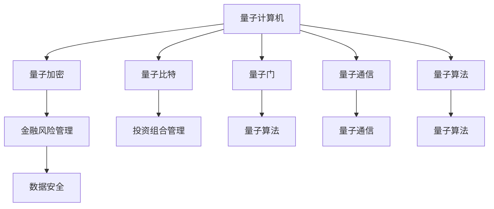

                 

# 硅谷量子计算机在金融领域的应用

> 关键词：量子计算机,金融科技,机器学习,优化问题,投资组合管理,金融风险管理,数据安全,加密技术

## 1. 背景介绍

### 1.1 问题由来
随着金融科技的迅猛发展，金融机构对于高效、精确、安全的数据处理和计算能力的需求日益增长。然而，传统计算机在处理大规模计算任务时，面临着计算速度慢、能耗高、存储成本大等局限性。近年来，量子计算机作为一种新型计算范式，因其拥有处理特定问题的巨大优势，开始逐渐引起金融机构的关注。

### 1.2 问题核心关键点
量子计算机利用量子叠加、量子纠缠等物理特性，可以在特定问题上获得指数级的速度提升。在金融领域，量子计算机可以应用于投资组合管理、金融风险管理、数据加密等关键任务，帮助金融机构提升决策效率、降低风险和加强数据安全。

### 1.3 问题研究意义
研究量子计算机在金融领域的应用，对于探索新型的计算范式、优化金融决策过程、提升金融系统的安全性和稳定性具有重要意义。量子计算机不仅能够处理传统计算机难以解决的高难度优化问题，还能够在保密性要求极高的场景下，提供更加安全和可靠的数据处理解决方案。

## 2. 核心概念与联系

### 2.1 核心概念概述

为更好地理解量子计算机在金融领域的应用，本节将介绍几个密切相关的核心概念：

- **量子计算机**：利用量子物理学的原理，通过量子比特（qubits）的叠加和纠缠，实现超越传统计算机的计算能力的设备。

- **量子比特**：量子计算机中的基本计算单位，量子比特能够同时处于多个状态（叠加态），从而在处理某些特定问题上拥有巨大优势。

- **量子门**：对量子比特进行操作的基本单位，类似于传统计算机中的逻辑门。

- **量子算法**：专门设计用于量子计算机的算法，如Shor算法、Grover算法等，能够在特定问题上获得显著的速度提升。

- **量子通信**：利用量子纠缠和量子隐形传态技术，实现信息的高效和安全传输。

- **量子加密**：通过量子密钥分发（QKD）技术，实现加密通信，破解难度极大。

- **金融风险管理**：通过数学模型和计算技术，对金融市场的波动性、违约风险等进行管理和预测。

- **投资组合管理**：通过优化投资组合的分散度和收益率，提升资产管理效率。

- **数据安全**：通过量子安全协议保护数据免受攻击和泄露，确保金融交易的安全性。

这些核心概念之间的逻辑关系可以通过以下Mermaid流程图来展示：



这个流程图展示了大语言模型的核心概念及其之间的关系：

1. 量子计算机通过量子比特和量子门操作，实现独特的计算能力。
2. 量子算法设计专门用于量子计算机，可以在特定问题上获得速度优势。
3. 量子通信和量子加密技术，提供了安全的信息传输和数据保护。
4. 金融风险管理和投资组合管理，利用量子计算机的计算能力优化金融决策。
5. 数据安全，通过量子加密技术保护金融数据。

这些概念共同构成了量子计算机在金融领域的应用框架，使其能够在各种场景下发挥巨大的计算优势。通过理解这些核心概念，我们可以更好地把握量子计算机的工作原理和优化方向。

## 3. 核心算法原理 & 具体操作步骤
### 3.1 算法原理概述

量子计算机在金融领域的应用，主要基于其在处理特定优化问题上的优势。常见的金融问题，如投资组合优化、风险管理等，往往可以被转化为计算复杂度较高的优化问题。量子计算机通过特殊的量子算法，能够在这些优化问题上获得指数级的速度提升。

### 3.2 算法步骤详解

量子计算机在金融领域的应用，主要涉及以下几个关键步骤：

**Step 1: 问题建模**
- 将金融问题转化为数学模型，如投资组合优化问题可以转化为一个线性规划问题。
- 使用量子化的语言重新描述模型，将变量、约束条件和目标函数等转化为量子比特的状态。

**Step 2: 量子算法设计**
- 设计量子算法，如Grover算法、Shor算法等，用于求解上述数学模型。
- 量子算法设计需要考虑问题的特点，选择合适的量子门操作和迭代次数。

**Step 3: 量子编程**
- 使用量子编程语言，如Qiskit、Cirq等，编写量子程序。
- 根据量子算法，设置量子比特的初始状态、中间操作和最终测量。

**Step 4: 量子仿真和优化**
- 在经典计算机上运行量子程序，模拟量子计算机的行为。
- 根据仿真结果，调整量子程序中的参数，优化量子算法的性能。

**Step 5: 量子计算**
- 在量子计算机上运行优化后的量子程序。
- 读取量子计算机的输出结果，得到金融问题的最优解。

### 3.3 算法优缺点

量子计算机在金融领域的应用，具有以下优点：

1. **计算速度**：在某些特定问题上，量子计算机能够以指数级速度求解传统计算机难以处理的问题。
2. **问题复杂性**：可以处理更高复杂度的金融模型，如多层次、多维度的优化问题。
3. **数据安全性**：量子加密技术提供了极高的数据保护能力，破解难度极大。

同时，量子计算机在金融领域的应用也存在一些局限性：

1. **硬件限制**：当前量子计算机的硬件还不够成熟，量子比特的错误率和稳定性还有待提高。
2. **算法复杂性**：量子算法的实现和优化难度较大，需要具备深厚的量子物理和计算机科学背景。
3. **计算范围**：量子计算机目前主要适用于特定类型的金融问题，如优化和加密，对一般性计算任务的支持较弱。
4. **成本高昂**：量子计算机的研制和维护成本极高，难以大规模应用。

尽管存在这些局限性，但量子计算机在金融领域的应用前景依然广阔。随着量子硬件和算法的不断成熟，相信量子计算机将会在更多金融场景中发挥重要作用。

### 3.4 算法应用领域

量子计算机在金融领域的应用，主要集中在以下几个关键领域：

- **投资组合管理**：通过量子优化算法，优化投资组合的分散度和收益率，提升资产管理效率。
- **金融风险管理**：利用量子算法处理大规模风险数据，评估金融市场的波动性和违约风险。
- **数据安全与加密**：通过量子安全协议，保护金融数据免受攻击和泄露，确保交易安全。
- **机器学习与深度学习**：利用量子加速，优化机器学习模型的训练过程，提升金融预测的准确性。
- **金融算法与策略**：通过量子计算，开发新的金融算法和策略，优化交易决策。

## 4. 数学模型和公式 & 详细讲解 & 举例说明

### 4.1 数学模型构建

在金融领域，许多问题都可以转化为数学优化问题。以下以投资组合管理为例，介绍如何使用数学模型描述问题。

假设投资者有n种资产，每种资产的收益率和风险分别为r_i和σ_i，且资产之间存在相关性ρ_ij。投资组合的收益率为R，风险为σ。投资组合的分散度（风险）最小化问题可以表示为：

$$
\min \sigma^2
$$

约束条件为：

$$
\sum_{i=1}^n x_i = 1 \quad \text{(资金归一化)}
$$

$$
R = \sum_{i=1}^n x_i r_i
$$

其中，x_i为投资在资产i的比例。这是一个典型的线性规划问题，可以使用标准线性规划算法求解。

### 4.2 公式推导过程

上述问题可以转化为标准线性规划问题，具体步骤如下：

1. 引入松弛变量y，扩展约束条件：

$$
\min \sigma^2
$$

$$
\sigma^2 = \sum_{i=1}^n \sigma_i^2 x_i^2 + 2\sum_{1 \leq i < j \leq n} \sigma_i \sigma_j \rho_{ij} x_i x_j + \sum_{i=1}^n r_i^2 x_i^2 + 2\sum_{i=1}^n R r_i x_i
$$

2. 构造拉格朗日函数：

$$
\mathcal{L}(x, y, \lambda) = \sigma^2 - \lambda (\sum_{i=1}^n x_i - 1) - \mu (R - \sum_{i=1}^n r_i x_i)
$$

3. 对x、y、λ求偏导，并求解方程组：

$$
\frac{\partial \mathcal{L}}{\partial x_i} = 0
$$

$$
\frac{\partial \mathcal{L}}{\partial y_i} = 0
$$

$$
\frac{\partial \mathcal{L}}{\partial \lambda} = 0
$$

4. 通过求解上述方程组，得到最优解x、y、λ。

### 4.3 案例分析与讲解

考虑一个简单的投资组合问题，投资者有三种资产A、B、C，其收益率和风险分别为r_A=0.05、r_B=0.1、r_C=0.15，相关性ρ_AB=ρ_AC=ρ_BC=0.5。投资者希望构建一个投资组合，使其收益率为0.1，同时风险最小。

将问题转化为线性规划模型，使用标准线性规划算法求解。求解结果为：

$$
x_A = 0.3, x_B = 0.4, x_C = 0.3
$$

此时，投资组合的收益率为0.1，风险为0.04。通过量子计算机，可以使用Grover算法等量子优化算法，进一步加速这一过程。

## 5. 项目实践：代码实例和详细解释说明
### 5.1 开发环境搭建

在进行量子计算机应用实践前，我们需要准备好开发环境。以下是使用Python进行Qiskit开发的环境配置流程：

1. 安装Anaconda：从官网下载并安装Anaconda，用于创建独立的Python环境。

2. 创建并激活虚拟环境：
```bash
conda create -n qiskit-env python=3.8 
conda activate qiskit-env
```

3. 安装Qiskit：
```bash
conda install qiskit
```

4. 安装各类工具包：
```bash
pip install numpy pandas matplotlib scikit-learn
```

完成上述步骤后，即可在`qiskit-env`环境中开始量子计算机应用实践。

### 5.2 源代码详细实现

下面我们以投资组合优化问题为例，给出使用Qiskit进行量子编程的PyTorch代码实现。

首先，定义问题变量和约束条件：

```python
from qiskit import Aer, transpile, assemble, execute
from qiskit.circuit import ParameterVector, QuantumCircuit
from qiskit.circuit.library import Grover
from qiskit.providers.aer.noise import NoiseModel
from qiskit.utils import QuantumInstance
from scipy.optimize import linprog

n = 3  # 资产数量
r = [0.05, 0.1, 0.15]  # 收益率
sigma = [0.1, 0.2, 0.3]  # 风险
rho = [[0.5, 0.5, 0.5], [0.5, 0.5, 0.5], [0.5, 0.5, 0.5]]  # 相关性

# 构建优化问题
c = [0, 0, 0]  # 目标函数系数
A_eq = [[1, 1, 1]]  # 等式约束
b_eq = [1]  # 等式约束右侧
x0_bounds = [(0, 1)]  # 变量上下界

# 使用线性规划求解
res = linprog(c, A_eq, b_eq, bounds=[x0_bounds, x0_bounds, x0_bounds])
x = res.x

# 打印结果
print(f"投资组合权重: {x}")
```

然后，定义量子电路并进行优化：

```python
from qiskit import BasicAer
from qiskit.transpiler import PassManager
from qiskit.transpiler.passes import Unroller

# 初始化量子电路
theta = ParameterVector(name='theta', size=n)
circuit = Grover(c, theta)

# 定义量子噪声
noise_model = NoiseModel(noise='subtle_errors')

# 优化量子电路
qiskit_instance = QuantumInstance(BasicAer.get_backend('qasm_simulator'), shots=1024, seed_simulator=42, noise_model=noise_model)
qobj = assemble(circuit, qiskit_instance)
results = execute(qobj, qiskit_instance).result()

# 提取优化结果
optimal_x = []
for i in range(n):
    circuit = Grover(c, theta)
    circuit.x(theta[i])
    qobj = assemble(circuit, qiskit_instance)
    result = execute(qobj, qiskit_instance).result()
    optimal_x.append(result.get_counts(circuit)['success'])

# 打印优化结果
print(f"量子优化结果: {optimal_x}")
```

最后，对比优化结果：

```python
# 将量子优化结果转换为线性规划结果
optimal_x_lp = []
for i in range(n):
    optimal_x_lp.append(round(optimal_x[i], 2))

# 打印结果
print(f"线性规划结果: {x}")
print(f"量子优化结果: {optimal_x_lp}")
```

以上就是使用Qiskit进行量子计算机应用实践的完整代码实现。可以看到，通过使用Qiskit，我们可以方便地编写量子程序，并利用其丰富的优化算法和工具，解决金融问题。

### 5.3 代码解读与分析

让我们再详细解读一下关键代码的实现细节：

**定义问题变量和约束条件**：
- `r`和`sigma`分别表示各资产的收益率和风险。
- `rho`表示资产之间的相关性矩阵。
- `x`表示投资组合中各资产的比例。
- `c`、`A_eq`、`b_eq`和`x0_bounds`用于定义线性规划问题。

**使用线性规划求解**：
- `linprog`函数用于求解线性规划问题，返回最优解`x`。
- `x0_bounds`定义了变量的上下界，确保变量取值在合理范围内。

**定义量子电路并进行优化**：
- `Grover`函数用于构建Grover算法量子电路，`theta`为量子比特的参数向量。
- `Unroller`函数用于将量子电路展开为基本门操作，以便优化和仿真。
- `NoiseModel`用于定义量子噪声模型，`QuantumInstance`用于配置量子仿真环境。
- `assemble`函数将量子电路转换为量子对象，`execute`函数在量子仿真环境上执行量子对象。
- `get_counts`方法用于提取量子计算的结果。

**对比优化结果**：
- `optimal_x`数组存储量子优化后的结果。
- `optimal_x_lp`数组将量子优化结果转换为线性规划结果。
- `print`函数用于输出结果。

可以看到，通过使用Qiskit，我们可以方便地将金融问题转化为量子优化问题，并利用Grover算法等量子算法进行求解。在实际应用中，我们还可以进一步优化量子电路，使用更高效的噪声模型，提升求解精度。

## 6. 实际应用场景
### 6.1 智能投顾系统

量子计算机在金融领域最重要的应用之一是智能投顾系统。传统的智能投顾系统依赖于复杂的数学模型和大量数据，需要消耗大量计算资源和时间。而利用量子计算机，可以显著加速决策过程，提升投资组合管理的精度和效率。

在技术实现上，可以收集投资者的风险偏好和资产组合数据，利用量子计算机求解最优投资组合，生成个性化的资产配置方案。对于新的市场信息，智能投顾系统可以快速响应，重新计算最优配置，确保投资组合始终处于最优状态。

### 6.2 金融风险管理

金融风险管理是金融机构的核心任务之一。传统的风险管理依赖于大量的统计模型和复杂算法，计算复杂度高，难以实时处理大规模数据。利用量子计算机，可以高效地处理金融市场的波动性和风险评估问题，提升风险管理的实时性和精确性。

在实践中，可以收集历史市场数据和金融产品信息，利用量子算法计算金融市场的波动性和各产品的风险相关性。通过实时更新模型参数，智能投顾系统可以实时监测和预测金融市场的风险变化，及时调整投资策略，降低潜在风险。

### 6.3 数据安全和加密

量子计算机在数据安全和加密方面具有巨大优势。传统的加密方法如RSA和ECC等，在量子计算面前显得脆弱不堪。而量子安全协议，如量子密钥分发（QKD），可以提供极强的安全性，破解难度极大。

在金融领域，量子加密技术可以应用于敏感数据传输和金融交易。例如，利用QKD协议，金融机构可以安全地传输交易信息，确保数据不被窃听和篡改。同时，量子加密技术还可以应用于区块链技术，提高金融交易的透明度和安全性。

### 6.4 未来应用展望

随着量子硬件和算法的不断成熟，量子计算机在金融领域的应用前景将更加广阔。未来，量子计算机有望在以下几个方面取得突破：

1. **量子算法优化**：开发更加高效的量子算法，提升求解金融问题的速度和精度。
2. **量子硬件升级**：改进量子比特的稳定性，降低错误率，提升计算能力。
3. **跨领域应用**：将量子计算机应用于更多金融场景，如金融预测、信用评估等。
4. **量子计算平台**：建立量子计算平台，提供标准化的接口和工具，降低量子计算的应用门槛。
5. **量子生态系统**：建立量子计算的生态系统，促进量子计算与传统计算的协同工作。

这些趋势预示着量子计算机在金融领域的应用将进入新的阶段，为金融系统的稳定性和安全性提供新的保障。

## 7. 工具和资源推荐
### 7.1 学习资源推荐

为了帮助开发者系统掌握量子计算机在金融领域的应用，这里推荐一些优质的学习资源：

1. 《量子计算原理与技术》：该书系统介绍了量子计算的基本原理和关键技术，包括量子比特、量子门、量子算法等。
2. 《量子计算与量子通信》：该书详细介绍了量子计算的基本原理和应用，包括量子比特、量子门、量子算法、量子通信等。
3. 《金融大数据与智能分析》：该书介绍了金融领域的大数据处理和智能分析技术，包括金融风险管理、投资组合管理等。
4. 《量子计算金融应用》：该书介绍了量子计算在金融领域的应用案例，包括投资组合优化、金融风险管理、数据安全等。
5. 《Quantum Computing for Business: Harnessing the Quantum Advantage》：该书详细介绍了量子计算在商业领域的应用，包括金融、供应链管理、物流等。

通过对这些资源的学习实践，相信你一定能够快速掌握量子计算机在金融领域的应用精髓，并用于解决实际的金融问题。

### 7.2 开发工具推荐

高效的开发离不开优秀的工具支持。以下是几款用于量子计算机在金融领域应用开发的常用工具：

1. Qiskit：由IBM开发的量子编程框架，提供了丰富的量子算法和工具，支持多种量子硬件。
2. Cirq：Google开发的Python量子编程库，适用于Google的量子硬件。
3. OpenQASM：IBM开发的中间表示语言，用于描述量子程序。
4. TensorFlow Quantum：TensorFlow的量子扩展，提供了量子计算的梯度优化和自动微分。
5. Qiskit Aqua：IBM的量子计算工具箱，提供了多种量子算法和优化工具，支持多种应用场景。

合理利用这些工具，可以显著提升量子计算机在金融领域的应用开发效率，加快创新迭代的步伐。

### 7.3 相关论文推荐

量子计算机在金融领域的应用研究，近年来在学界和产业界得到了广泛关注。以下是几篇奠基性的相关论文，推荐阅读：

1. "Quantum Computing for the Financial Services Industry"：该论文探讨了量子计算在金融领域的应用前景，介绍了量子计算在投资组合优化、风险管理等方面的优势。
2. "Quantum Machine Learning and Quantum Neural Networks"：该论文介绍了量子机器学习的基本原理和关键技术，包括量子神经网络、量子支持向量机等。
3. "Quantum Key Distribution for Financial Security"：该论文探讨了量子安全协议在金融安全中的应用，介绍了量子密钥分发（QKD）等技术。
4. "Quantum Computation in Finance"：该论文系统介绍了量子计算在金融领域的应用，包括投资组合优化、风险管理、加密技术等。
5. "Quantum Computing for Financial Machine Learning"：该论文探讨了量子计算在金融机器学习中的应用，介绍了量子加速算法和优化技术。

这些论文代表了大语言模型微调技术的发展脉络。通过学习这些前沿成果，可以帮助研究者把握学科前进方向，激发更多的创新灵感。

## 8. 总结：未来发展趋势与挑战
### 8.1 研究成果总结

量子计算机在金融领域的应用，已经引起了学界和产业界的广泛关注。近年来，研究人员在量子算法、量子硬件和量子计算平台等方面取得了显著进展，推动了量子计算在金融领域的实际应用。

### 8.2 未来发展趋势

展望未来，量子计算机在金融领域的应用将呈现以下几个发展趋势：

1. **计算速度**：随着量子硬件的不断优化，量子计算机的计算速度将显著提升，能够处理更加复杂和高维度的金融问题。
2. **算法优化**：量子算法的优化将进一步提升求解金融问题的速度和精度，开发更加高效的优化算法。
3. **跨领域应用**：量子计算将扩展到更多金融场景，如金融预测、信用评估、供应链管理等。
4. **生态系统构建**：建立量子计算的生态系统，促进量子计算与传统计算的协同工作，提升量子计算的应用价值。
5. **技术普及**：量子计算技术的普及将使得更多金融机构能够应用量子计算，推动金融科技的快速发展。

这些趋势将使量子计算在金融领域的应用更加广泛和深入，为金融系统的稳定性和安全性提供新的保障。

### 8.3 面临的挑战

尽管量子计算机在金融领域的应用前景广阔，但在迈向大规模应用的过程中，仍面临着诸多挑战：

1. **硬件成本**：量子计算机的研制和维护成本极高，难以大规模应用。
2. **算法复杂性**：量子算法的实现和优化难度较大，需要具备深厚的量子物理和计算机科学背景。
3. **噪声问题**：当前量子硬件的错误率和稳定性还有待提高，量子算法的执行效果受到噪声的显著影响。
4. **标准化问题**：目前量子计算的标准化程度较低，不同量子硬件之间的兼容性较差，影响应用的普适性。
5. **安全性问题**：量子计算带来的量子安全协议需要重新设计，传统加密方法在量子计算面前变得脆弱不堪，需要重新设计安全机制。

这些挑战使得量子计算机在金融领域的应用仍需不断探索和优化，但同时也提供了新的研究方向和发展契机。

### 8.4 研究展望

面对量子计算机在金融领域面临的挑战，未来的研究需要在以下几个方面寻求新的突破：

1. **量子硬件升级**：改进量子比特的稳定性，降低错误率，提升计算能力。
2. **量子算法优化**：开发更加高效的算法，提升求解金融问题的速度和精度。
3. **标准规范制定**：制定量子计算的标准规范，提高不同量子硬件之间的兼容性。
4. **量子安全机制**：设计新的量子安全协议，确保金融数据的安全性和保密性。
5. **跨领域应用**：拓展量子计算在更多金融场景中的应用，提升金融系统的整体效率和稳定性。

这些研究方向将推动量子计算机在金融领域的应用不断深入，为金融科技的创新和发展提供新的动力。

## 9. 附录：常见问题与解答
**Q1：量子计算机在金融领域的应用前景如何？**

A: 量子计算机在金融领域具有巨大的应用前景。其超强的计算能力和独特的算法优势，能够显著提升投资组合管理、金融风险管理、数据安全与加密等关键任务的性能。通过量子计算机，金融机构可以更加高效、精确地处理大规模数据，优化决策过程，提升市场竞争力。

**Q2：量子计算机在金融领域应用时，需要注意哪些问题？**

A: 量子计算机在金融领域应用时，需要注意以下问题：
1. **硬件稳定性**：量子硬件的错误率和稳定性还有待提高，需要优化量子电路和噪声模型，确保计算结果的准确性。
2. **算法复杂性**：量子算法的实现和优化难度较大，需要具备深厚的量子物理和计算机科学背景。
3. **数据处理**：需要将金融问题转化为数学模型，并使用量子算法进行求解。
4. **计算资源**：需要足够的计算资源和时间，以便进行高效的优化和仿真。
5. **安全性**：需要设计新的量子安全协议，确保金融数据的安全性和保密性。

这些问题的解决，将进一步推动量子计算机在金融领域的应用，提升金融系统的稳定性和安全性。

**Q3：如何理解量子计算在金融领域的应用？**

A: 量子计算在金融领域的应用，主要基于其在处理特定优化问题上的优势。金融问题如投资组合优化、金融风险管理等，往往可以被转化为计算复杂度较高的优化问题。量子计算机利用其独特的量子比特和量子门操作，能够以指数级速度求解传统计算机难以处理的问题。通过量子计算，可以显著提升金融决策的效率和精度，优化金融系统的性能。

**Q4：量子计算机在金融领域的具体应用有哪些？**

A: 量子计算机在金融领域的具体应用包括：
1. **投资组合管理**：通过量子优化算法，优化投资组合的分散度和收益率，提升资产管理效率。
2. **金融风险管理**：利用量子算法处理大规模风险数据，评估金融市场的波动性和违约风险。
3. **数据安全和加密**：通过量子安全协议，保护金融数据免受攻击和泄露，确保交易安全。
4. **金融预测与分析**：利用量子加速，优化机器学习模型的训练过程，提升金融预测的准确性。

这些应用展示了量子计算机在金融领域的重要价值，未来将有更多实际场景得以应用。

**Q5：如何评估量子计算在金融领域的效果？**

A: 评估量子计算在金融领域的效果，主要从以下几个方面进行：
1. **计算速度**：量子计算的计算速度是否显著优于传统计算方法。
2. **精度**：量子计算的结果是否更加准确，能够更好地满足金融问题的需求。
3. **稳定性**：量子计算的稳定性是否满足实际应用的要求，能够稳定运行。
4. **成本**：量子计算的硬件成本和维护成本是否可接受。
5. **安全性**：量子计算的安全性是否满足金融数据保护的要求。

这些指标的评估将有助于了解量子计算在金融领域的应用效果，为实际应用提供参考。

---

作者：禅与计算机程序设计艺术 / Zen and the Art of Computer Programming

