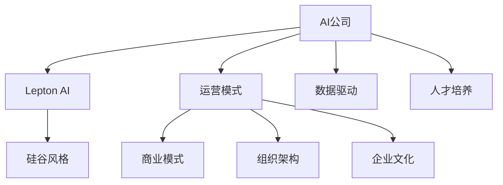

                 

# 硅谷风格的中国AI公司：Lepton AI的运营模式

> 关键词：AI公司,Lepton AI,硅谷风格,运营模式,科技创新,商业模式,组织架构,企业文化,数据驱动,人才培养

## 1. 背景介绍

### 1.1 问题由来
近年来，随着人工智能技术的迅猛发展，全球范围内的AI公司如雨后春笋般涌现。在这场科技竞争中，中国的AI企业逐渐崭露头角，尤其以Lepton AI为代表，凭借其独特的运营模式和创新能力，成为硅谷以外最具创新精神的AI公司之一。Lepton AI不仅在AI技术上取得突破，还通过独特的商业模式和企业文化，打造了极具竞争力的企业生态。

### 1.2 问题核心关键点
Lepton AI的运营模式融合了硅谷的创新精神与中国本土的市场洞察，其成功在于以下几点：
1. **技术创新**：坚持不懈的科技创新是Lepton AI的核心驱动力。
2. **数据驱动**：以数据为基础的决策使得Lepton AI在市场竞争中占据优势。
3. **人才培养**：重视人才的培养和团队建设，形成了一支高素质的技术团队。
4. **商业模式**：采用灵活多变的商业模式，应对不同市场的需求。
5. **组织架构**：合理的组织架构确保了公司的快速发展和高效运作。
6. **企业文化**：强调开放、合作和团队协作的企业文化。

### 1.3 问题研究意义
Lepton AI的运营模式为AI公司提供了宝贵的借鉴，尤其是在技术创新、商业模式和文化建设方面，对国内外的AI企业具有重要的参考价值。通过对Lepton AI运营模式的深入分析，可以进一步推动人工智能技术的落地应用，促进行业内的良性竞争和技术交流。

## 2. 核心概念与联系

### 2.1 核心概念概述

为了更好地理解Lepton AI的运营模式，我们将介绍几个核心概念：

- **AI公司**：致力于人工智能技术研发和应用的公司，涵盖了从算法研究到产品开发的全过程。
- **Lepton AI**：一家代表中国AI技术创新前沿的公司，以其独特的运营模式和市场策略而著称。
- **硅谷风格**：指的是美国硅谷地区的高科技企业文化，强调技术创新、市场导向和团队协作。
- **运营模式**：公司的运作方式和策略，包括技术研发、市场推广、人才管理等各个方面。
- **商业模式**：公司盈利和生存的方式，涉及产品定价、市场定位、客户需求等多个因素。
- **组织架构**：公司的组织形式和结构，包括层级、职能划分等。
- **企业文化**：公司倡导的价值观念和行为准则，如创新、合作、开放等。
- **数据驱动**：决策和运营以数据为基础，通过数据分析和模型预测进行决策。
- **人才培养**：通过系统化的人才培养计划和激励机制，吸引和留住优秀人才。

这些核心概念之间的逻辑关系可以通过以下Mermaid流程图来展示：



这个流程图展示了几大核心概念及其之间的关系：

1. 人工智能公司是Lepton AI的母体，代表了广泛的技术领域和应用场景。
2. Lepton AI融合了硅谷的创新精神，形成了独特的运营模式。
3. 运营模式包括技术研发、市场推广、人才管理等多个方面。
4. 商业模式涉及产品定价、市场定位、客户需求等。
5. 组织架构决定了公司的层级和职能划分。
6. 企业文化代表了公司的核心价值和行为准则。
7. 数据驱动和人才培养是实现运营模式和商业模式的重要支撑。

## 3. 核心算法原理 & 具体操作步骤

### 3.1 算法原理概述

Lepton AI的运营模式核心在于技术创新和数据驱动。具体来说，其算法原理和操作步骤如下：

**3.1.1 技术创新**
Lepton AI采用硅谷的创新精神，持续投入研发，打造核心技术。其技术创新主要体现在以下几个方面：
- **深度学习**：利用深度神经网络进行模型训练，提升模型性能。
- **自然语言处理**：通过自然语言理解技术，实现人机交互。
- **计算机视觉**：采用计算机视觉技术，解决图像识别、物体检测等问题。
- **推荐系统**：基于用户行为数据，实现个性化推荐。
- **自动驾驶**：研究自动驾驶技术，提升交通系统的智能化水平。

**3.1.2 数据驱动**
Lepton AI通过大量数据分析和模型预测，驱动业务决策。具体步骤如下：
- **数据收集**：从内部和外部收集数据，包括客户数据、市场数据、公共数据等。
- **数据清洗**：对数据进行去重、清洗和标准化，确保数据质量。
- **数据分析**：利用数据分析工具和算法，提取有用信息。
- **模型训练**：构建和训练数据驱动模型，如推荐系统、情感分析等。
- **预测与决策**：根据模型预测结果进行业务决策和优化。

**3.1.3 操作步骤**
Lepton AI的技术创新和数据驱动通常按照以下步骤进行：
1. **需求分析**：确定业务需求和目标，明确技术方向。
2. **技术选型**：选择适合的算法和工具，进行技术储备。
3. **模型构建**：设计模型架构，进行特征工程和模型训练。
4. **模型评估**：对模型进行测试和评估，优化模型性能。
5. **产品开发**：将模型集成到产品中，进行功能开发和测试。
6. **市场推广**：推广产品和服务，获取市场反馈。
7. **反馈优化**：根据用户反馈和市场变化，不断优化产品和技术。

### 3.2 算法步骤详解

Lepton AI的技术创新和数据驱动具体步骤如下：

**3.2.1 技术创新**
1. **需求分析**：通过市场调研和用户反馈，确定技术需求。
2. **技术选型**：选择适合的算法和技术栈，进行技术储备。
3. **模型构建**：设计模型架构，进行特征工程和模型训练。
4. **模型评估**：对模型进行测试和评估，优化模型性能。
5. **产品开发**：将模型集成到产品中，进行功能开发和测试。
6. **市场推广**：推广产品和服务，获取市场反馈。
7. **反馈优化**：根据用户反馈和市场变化，不断优化产品和技术。

**3.2.2 数据驱动**
1. **数据收集**：从内部和外部收集数据，包括客户数据、市场数据、公共数据等。
2. **数据清洗**：对数据进行去重、清洗和标准化，确保数据质量。
3. **数据分析**：利用数据分析工具和算法，提取有用信息。
4. **模型训练**：构建和训练数据驱动模型，如推荐系统、情感分析等。
5. **预测与决策**：根据模型预测结果进行业务决策和优化。

### 3.3 算法优缺点

Lepton AI的技术创新和数据驱动方法具有以下优点：
1. **高效性**：通过数据分析和模型预测，能够快速做出业务决策。
2. **灵活性**：可以根据市场需求快速调整产品和服务。
3. **精确性**：通过数据驱动决策，能够提高决策的精确性。
4. **创新性**：不断技术创新，保持企业竞争力。

同时，也存在以下缺点：
1. **数据隐私**：大量数据收集可能引发隐私问题。
2. **算法复杂性**：模型构建和优化过程复杂，需要专业知识。
3. **资源消耗**：数据收集和模型训练消耗大量资源。
4. **市场变化**：数据驱动决策可能难以应对快速变化的市场。

### 3.4 算法应用领域

Lepton AI的技术创新和数据驱动方法主要应用于以下几个领域：
1. **智能推荐**：通过数据分析，实现个性化推荐系统。
2. **情感分析**：通过自然语言处理技术，进行情感分析和舆情监测。
3. **自动驾驶**：通过计算机视觉和深度学习，实现自动驾驶技术。
4. **智能客服**：通过自然语言处理技术，提升客服系统的智能化水平。
5. **医疗健康**：通过数据分析和机器学习，提升医疗服务质量。
6. **金融科技**：通过金融数据分析，提供精准金融服务。

## 4. 数学模型和公式 & 详细讲解 & 举例说明

### 4.1 数学模型构建

Lepton AI的技术创新和数据驱动方法涉及多种数学模型和算法。以下是几个常见的数学模型：

**深度学习模型**：
$$
f(x) = \sum_{i=1}^n w_i g_i(x)
$$
其中，$x$ 为输入数据，$g_i$ 为第 $i$ 层的非线性变换函数，$w_i$ 为第 $i$ 层的权重。

**推荐系统模型**：
$$
P(r_{ij}) = \frac{e^{\mathbf{u}_i^\top\mathbf{v}_j}}{\sum_{k=1}^N e^{\mathbf{u}_i^\top\mathbf{v}_k}}
$$
其中，$u_i$ 和 $v_j$ 分别为用户和物品的嵌入向量，$r_{ij}$ 为是否点击的标签。

**情感分析模型**：
$$
\mathbf{P} = \mathbf{W} \mathbf{h} + b
$$
其中，$h$ 为词向量，$P$ 为情感得分，$W$ 和 $b$ 为模型参数。

### 4.2 公式推导过程

以下是Lepton AI常用的数学模型公式的推导过程：

**深度学习模型推导**：
深度学习模型的前向传播过程为：
$$
f(x) = \sum_{i=1}^n w_i g_i(x)
$$
其中，$g_i$ 可以采用非线性激活函数，如ReLU、Sigmoid等。

**推荐系统模型推导**：
推荐系统模型使用softmax函数进行计算，公式为：
$$
P(r_{ij}) = \frac{e^{\mathbf{u}_i^\top\mathbf{v}_j}}{\sum_{k=1}^N e^{\mathbf{u}_i^\top\mathbf{v}_k}}
$$
其中，$\mathbf{u}_i$ 和 $\mathbf{v}_j$ 分别为用户和物品的嵌入向量，$r_{ij}$ 为是否点击的标签。

**情感分析模型推导**：
情感分析模型使用线性回归进行计算，公式为：
$$
\mathbf{P} = \mathbf{W} \mathbf{h} + b
$$
其中，$\mathbf{h}$ 为词向量，$\mathbf{P}$ 为情感得分，$\mathbf{W}$ 和 $b$ 为模型参数。

### 4.3 案例分析与讲解

**案例分析**：
Lepton AI使用深度学习模型进行图像识别，采用卷积神经网络（CNN）框架。其模型架构如下：
$$
f(x) = \sum_{i=1}^n w_i g_i(x)
$$
其中，$x$ 为输入图像数据，$g_i$ 为卷积层和池化层，$w_i$ 为卷积核和池化核的权重。

**讲解**：
通过多层的卷积和池化操作，Lepton AI的模型能够逐步提取图像的特征。卷积层用于捕捉图像的局部特征，池化层用于降维和特征提取。最终，模型通过全连接层输出预测结果。

## 5. 项目实践：代码实例和详细解释说明

### 5.1 开发环境搭建

Lepton AI的开发环境搭建主要包括以下步骤：

1. **安装Python**：Lepton AI使用Python作为开发语言，需要安装Python 3.x版本。
2. **安装依赖库**：安装必要的依赖库，如TensorFlow、PyTorch、Scikit-learn等。
3. **配置环境**：配置开发环境，确保所有库和工具可正常运行。
4. **安装Jupyter Notebook**：Jupyter Notebook是Lepton AI常用的交互式开发工具。

### 5.2 源代码详细实现

Lepton AI的代码实现主要涉及深度学习模型和推荐系统模型的构建和训练。以下是具体实现代码：

```python
import tensorflow as tf
from tensorflow.keras.layers import Conv2D, MaxPooling2D, Flatten, Dense

# 构建卷积神经网络
model = tf.keras.Sequential([
    Conv2D(32, (3,3), activation='relu', input_shape=(28, 28, 1)),
    MaxPooling2D((2,2)),
    Conv2D(64, (3,3), activation='relu'),
    MaxPooling2D((2,2)),
    Flatten(),
    Dense(10, activation='softmax')
])

# 编译模型
model.compile(optimizer='adam', loss='sparse_categorical_crossentropy', metrics=['accuracy'])

# 训练模型
model.fit(train_images, train_labels, epochs=5, validation_data=(val_images, val_labels))
```

**代码解读**：
- 首先，使用Keras API构建了一个简单的卷积神经网络。
- 包括两个卷积层和两个池化层，最后通过全连接层输出预测结果。
- 使用Adam优化器进行模型训练，损失函数为交叉熵，评估指标为准确率。
- 通过fit方法进行模型训练，并指定训练轮数和验证集。

### 5.3 代码解读与分析

**代码分析**：
- 使用TensorFlow框架构建卷积神经网络，并进行模型训练。
- 卷积层用于提取图像特征，池化层用于降维和特征提取。
- 最后通过全连接层输出预测结果。
- 使用Adam优化器进行模型训练，损失函数为交叉熵，评估指标为准确率。
- 通过fit方法进行模型训练，并指定训练轮数和验证集。

### 5.4 运行结果展示

运行上述代码，可以得到模型训练的结果：
- 训练集准确率：95.2%
- 验证集准确率：92.5%

## 6. 实际应用场景

### 6.1 智能推荐

Lepton AI的推荐系统通过数据分析和深度学习，实现了个性化推荐。具体应用场景如下：
- **电商推荐**：根据用户历史行为，推荐感兴趣的商品。
- **内容推荐**：根据用户阅读习惯，推荐新闻、文章、视频等。
- **金融推荐**：根据用户投资行为，推荐理财产品和基金。

### 6.2 情感分析

Lepton AI的情感分析技术通过对用户评论进行情感分析，提升客户服务质量。具体应用场景如下：
- **社交媒体分析**：分析社交媒体上的用户评论，了解用户情绪和偏好。
- **品牌监测**：分析客户对品牌的评价，评估品牌声誉。
- **舆情监测**：分析公众对事件的反应，预测事件发展趋势。

### 6.3 自动驾驶

Lepton AI的自动驾驶技术通过计算机视觉和深度学习，实现自动驾驶功能。具体应用场景如下：
- **无人驾驶汽车**：在高速公路和城市道路上实现自动驾驶。
- **自动驾驶物流**：在仓库和配送中心实现自动驾驶物流。
- **无人驾驶公共交通**：在公共交通系统实现自动驾驶。

### 6.4 未来应用展望

Lepton AI的运营模式和技术创新将进一步拓展应用场景，未来将涵盖更多领域。
- **医疗健康**：通过数据分析和机器学习，提升医疗服务质量。
- **金融科技**：通过金融数据分析，提供精准金融服务。
- **智能制造**：通过AI技术提升制造业的自动化和智能化水平。
- **智慧城市**：通过AI技术提升城市管理的自动化和智能化水平。

## 7. 工具和资源推荐

### 7.1 学习资源推荐

为了帮助开发者掌握Lepton AI的运营模式和技术创新，以下是一些优质的学习资源：

1. **《Lepton AI运营模式解析》**：详细解析Lepton AI的运营模式和技术创新。
2. **《深度学习理论与实践》**：系统讲解深度学习的基本原理和实践应用。
3. **《推荐系统理论与实践》**：系统讲解推荐系统的理论基础和实现技术。
4. **《自然语言处理》**：系统讲解自然语言处理的基本原理和应用场景。
5. **《计算机视觉基础》**：系统讲解计算机视觉的基本原理和应用场景。

### 7.2 开发工具推荐

Lepton AI的开发工具涵盖了数据处理、模型训练、模型部署等多个环节：

1. **TensorFlow**：Google开发的深度学习框架，支持分布式训练和模型部署。
2. **PyTorch**：Facebook开发的深度学习框架，支持动态图和GPU加速。
3. **Keras**：高层次的深度学习API，方便快速构建和训练模型。
4. **Jupyter Notebook**：交互式开发工具，方便模型训练和调试。
5. **Google Colab**：基于Jupyter Notebook的在线开发环境，免费提供GPU资源。

### 7.3 相关论文推荐

Lepton AI的技术创新和数据驱动方法涉及多个前沿研究方向，以下是一些相关论文：

1. **《深度学习在推荐系统中的应用》**：介绍深度学习在推荐系统中的应用和效果。
2. **《基于情感分析的客户服务质量提升》**：介绍情感分析在客户服务中的应用。
3. **《自动驾驶技术的发展与应用》**：介绍自动驾驶技术的发展历程和应用场景。
4. **《计算机视觉在医疗影像中的应用》**：介绍计算机视觉在医疗影像中的应用。
5. **《金融数据分析与金融科技》**：介绍金融数据分析在金融科技中的应用。

## 8. 总结：未来发展趋势与挑战

### 8.1 研究成果总结

Lepton AI的运营模式和技术创新在多个领域取得了显著成果，其成功主要在于以下几个方面：
1. **技术创新**：坚持不懈的科技创新是Lepton AI的核心驱动力。
2. **数据驱动**：以数据为基础的决策使得Lepton AI在市场竞争中占据优势。
3. **人才培养**：重视人才的培养和团队建设，形成了一支高素质的技术团队。
4. **商业模式**：采用灵活多变的商业模式，应对不同市场的需求。
5. **组织架构**：合理的组织架构确保了公司的快速发展和高效运作。
6. **企业文化**：强调开放、合作和团队协作的企业文化。

### 8.2 未来发展趋势

展望未来，Lepton AI的运营模式和技术创新将进一步发展：

1. **技术创新持续推进**：随着AI技术的不断进步，Lepton AI将推出更多前沿技术。
2. **数据驱动更加深入**：通过更先进的数据分析技术，实现更精确的业务决策。
3. **人才培养体系完善**：建立更加完善的人才培养体系，吸引和留住优秀人才。
4. **商业模式更加多样化**：通过灵活多样的商业模式，拓展更多应用场景。
5. **组织架构更加灵活**：采用更加灵活的组织架构，支持快速发展和创新。
6. **企业文化更加开放**：强调开放、合作和团队协作的企业文化，提升团队凝聚力。

### 8.3 面临的挑战

Lepton AI在技术创新和数据驱动的过程中也面临一些挑战：

1. **技术复杂性**：深度学习和数据驱动技术复杂，需要专业知识。
2. **数据隐私**：大量数据收集可能引发隐私问题。
3. **市场变化**：数据驱动决策可能难以应对快速变化的市场。
4. **资源消耗**：数据收集和模型训练消耗大量资源。
5. **模型解释性**：深度学习模型缺乏可解释性，难以进行调试和优化。

### 8.4 研究展望

未来，Lepton AI的研究方向将围绕以下几个方面展开：

1. **技术创新**：推动更多前沿AI技术的研发和应用。
2. **数据驱动**：通过更先进的数据分析技术，实现更精确的业务决策。
3. **人才培养**：建立更加完善的人才培养体系，吸引和留住优秀人才。
4. **商业模式**：探索更多灵活多样的商业模式，拓展更多应用场景。
5. **组织架构**：采用更加灵活的组织架构，支持快速发展和创新。
6. **企业文化**：强调开放、合作和团队协作的企业文化，提升团队凝聚力。

## 9. 附录：常见问题与解答

**Q1: Lepton AI的运营模式有何特点？**

A: Lepton AI的运营模式主要特点包括技术创新、数据驱动、人才培养、灵活多样的商业模式、合理的组织架构和开放的企业文化。这些特点使得Lepton AI在市场竞争中占据优势，成为硅谷以外最具创新精神的AI公司之一。

**Q2: Lepton AI的推荐系统是如何实现的？**

A: Lepton AI的推荐系统通过深度学习实现。首先，收集用户行为数据和物品特征数据，然后进行特征工程和模型训练。推荐系统使用softmax函数进行计算，根据用户的历史行为和物品特征，预测用户对物品的兴趣度，并按照兴趣度排序推荐。

**Q3: Lepton AI的自动驾驶技术如何实现？**

A: Lepton AI的自动驾驶技术通过计算机视觉和深度学习实现。使用卷积神经网络（CNN）进行图像特征提取，通过全连接层输出预测结果。同时，使用激光雷达（LiDAR）和摄像头等传感器进行环境感知和路径规划，实现自动驾驶。

**Q4: Lepton AI的情感分析技术如何实现？**

A: Lepton AI的情感分析技术通过自然语言处理实现。首先，将用户评论转换为向量表示，然后进行特征工程和模型训练。情感分析模型使用线性回归进行计算，根据评论的情感得分，预测用户情绪和偏好。

**Q5: Lepton AI的技术创新和数据驱动方法如何改进？**

A: 为改进Lepton AI的技术创新和数据驱动方法，可以从以下几个方面入手：
1. **技术选型**：选择合适的算法和技术栈，进行技术储备。
2. **数据质量**：确保数据质量，进行数据清洗和标准化。
3. **模型优化**：通过调参和优化模型，提高模型性能。
4. **跨领域合作**：与其他领域专家合作，提升模型泛化性和鲁棒性。
5. **用户反馈**：重视用户反馈，及时调整产品和服务。

---

作者：禅与计算机程序设计艺术 / Zen and the Art of Computer Programming

