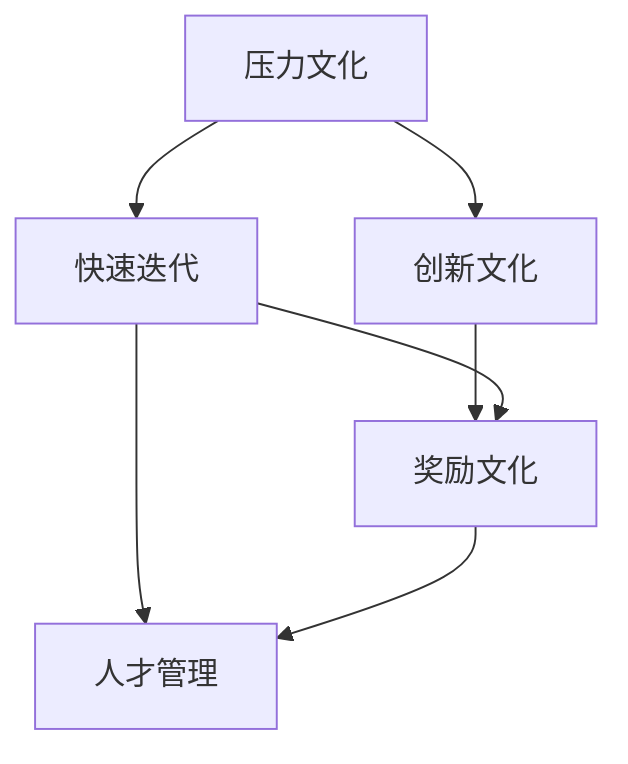

                 

# 硅谷高科技公司的管理文化:压力与奖励

> 关键词：硅谷,高科技公司,管理文化,压力与奖励,企业文化,创新,人才管理

## 1. 背景介绍

在过去几十年里，硅谷一直是全球高科技公司的心脏地带，从谷歌、苹果、Facebook到特斯拉，这些公司的成功不仅靠先进的技术，更得益于独特且高效的管理文化。在这些文化中，压力与奖励并存，塑造着公司的创新氛围和人才生态。本文将深入探讨硅谷高科技公司的管理文化，特别是如何通过压力与奖励机制，来激发员工的潜力和创新精神。

## 2. 核心概念与联系

### 2.1 核心概念概述

硅谷高科技公司的管理文化涵盖了多种关键概念，以下是其中的核心要素：

- **压力(压力文化)**：硅谷高科技公司普遍存在高压工作环境，员工面临高强度的工作负荷和紧迫的截止日期，这不仅驱动着公司的快速发展和创新，也可能带来巨大的工作压力和心理压力。

- **奖励(奖励文化)**：硅谷公司通过丰厚的奖金、股票期权、高额奖金等手段，激励员工超越自我，追求卓越。奖励文化与压力文化相结合，形成了推动企业发展的双轮驱动。

- **创新文化**：创新是硅谷公司生存和发展的核心驱动力，公司鼓励大胆尝试，容忍失败，让员工在自由、开放的环境中不断探索和创新。

- **人才管理**：硅谷公司重视人才的引进和培养，通过优厚的薪酬、丰富的职业发展机会和多元化的工作环境，吸引全球顶尖人才。

- **快速迭代**：硅谷公司以快速迭代的方式进行产品开发和业务扩展，追求最小可行产品(MVP)的快速迭代和市场验证。

这些概念之间的逻辑关系可以通过以下Mermaid流程图来展示：



这个流程图展示了一个完整的硅谷高科技公司的管理文化框架：

1. 高压工作环境（压力文化）驱动公司快速迭代产品。
2. 创新文化支持大胆尝试，容忍失败，促进产品不断改进。
3. 奖励文化激励员工追求卓越，提升整体工作效率。
4. 人才管理确保公司拥有强大的技术储备和持续的创新能力。
5. 快速迭代和奖励文化相结合，形成正向的循环，推动公司不断前进。

## 3. 核心算法原理 & 具体操作步骤

### 3.1 算法原理概述

硅谷高科技公司的管理文化，可以看作是压力和奖励两大核心机制的动态平衡。这两个机制相互促进，共同驱动公司的创新与发展。

压力机制主要通过以下几种方式实现：
- 高强度的工作负荷：设定紧迫的截止日期，使员工感受到任务的紧迫性和重要性。
- 高标准的业绩要求：设定明确、高标准的业绩目标，激励员工追求卓越。
- 竞争氛围：在团队内部形成竞争氛围，通过排名和奖励机制，激发员工的进取心。

奖励机制主要通过以下几种方式实现：
- 丰厚的奖金和股票期权：通过物质奖励，激励员工超越自我。
- 高额奖金和表彰：对表现出色的员工进行奖励，树立榜样。
- 职业发展机会：提供丰富的职业发展路径和晋升机会，增强员工的归属感和忠诚度。

### 3.2 算法步骤详解

硅谷高科技公司管理文化的具体操作步骤可以分为以下几个阶段：

**Step 1: 定义目标与期望**

- 确定公司的长期和短期目标，并将这些目标具体化，分解为可操作的里程碑和阶段性目标。
- 设定高标准的业绩目标，明确员工需要达到的成果和标准。

**Step 2: 实施压力机制**

- 设定紧迫的截止日期和任务完成时间，提高工作的紧迫性和重要性。
- 在团队内部形成竞争氛围，通过排名和奖励机制，激发员工的进取心。

**Step 3: 实施奖励机制**

- 提供丰厚的奖金、股票期权等物质奖励，激励员工超越自我。
- 设立高额奖金和表彰制度，对表现突出的员工给予奖励和表彰。
- 提供丰富的职业发展机会和晋升路径，增强员工的归属感和忠诚度。

**Step 4: 反馈与调整**

- 定期进行绩效评估，收集员工反馈，及时调整压力和奖励机制，确保其有效性和合理性。
- 建立灵活的工作环境，支持员工在高压环境下保持身心健康。

### 3.3 算法优缺点

硅谷高科技公司管理文化的压力与奖励机制，具有以下优点和缺点：

**优点：**
- 高压力和奖励机制能显著提升员工的工作积极性和创新能力，推动公司快速发展。
- 通过设定明确的目标和标准，提高工作效率和任务完成质量。
- 丰富的职业发展机会和物质奖励，吸引和留住顶尖人才。

**缺点：**
- 高强度的工作负荷和竞争氛围可能导致员工心理压力增大，影响工作满意度和健康。
- 过于依赖物质奖励和短期激励，可能忽视员工的长期职业发展。
- 不合理的压力和奖励机制，可能导致员工过度疲劳和短期行为，影响公司的长期稳定发展。

### 3.4 算法应用领域

硅谷高科技公司的管理文化，不仅适用于高科技公司，还适用于各个行业和领域的公司。在各个行业的管理实践中，都可以借鉴硅谷公司的压力与奖励机制，激发员工的潜力和创新精神，推动公司的持续发展和创新。

## 4. 数学模型和公式 & 详细讲解 & 举例说明

### 4.1 数学模型构建

在硅谷高科技公司的管理文化中，压力和奖励的动态平衡可以通过数学模型进行建模。假设公司的管理文化由两个变量 $P$ 和 $R$ 分别表示压力和奖励，则数学模型可以表示为：

$$
\max_{P, R} F(P, R)
$$

其中，$F(P, R)$ 为公司的总体绩效函数，包括创新成果、市场份额、员工满意度等指标。

### 4.2 公式推导过程

根据上述模型，可以进行以下推导：

- 设定目标函数 $F(P, R)$ 的具体形式，例如：
  $$
  F(P, R) = \alpha \cdot \text{创新成果} + \beta \cdot \text{市场份额} + \gamma \cdot \text{员工满意度}
  $$

- 确定 $P$ 和 $R$ 的取值范围和约束条件，例如：
  $$
  0 \leq P \leq P_{\text{max}}, \quad 0 \leq R \leq R_{\text{max}}
  $$
  其中，$P_{\text{max}}$ 和 $R_{\text{max}}$ 分别为压力和奖励的上限。

- 通过优化算法，求解最大化 $F(P, R)$ 的策略，例如：
  $$
  \max_{P, R} \alpha \cdot \text{创新成果} + \beta \cdot \text{市场份额} + \gamma \cdot \text{员工满意度}
  $$

### 4.3 案例分析与讲解

以谷歌为例，谷歌通过压力与奖励机制，驱动公司的创新与发展。谷歌的绩效评估系统强调结果导向，通过设定高标准的业绩目标和明确的任务完成时间，激励员工追求卓越。同时，谷歌还提供丰厚的奖金、股票期权等物质奖励，对表现出色的员工给予高额奖金和表彰。这些压力和奖励机制，使得谷歌在快速迭代的产品开发和市场拓展方面表现出色，成为全球科技行业的领导者。

## 5. 项目实践：代码实例和详细解释说明

### 5.1 开发环境搭建

在进行项目实践前，需要先搭建好开发环境。以下是使用Python进行Scikit-learn开发的环境配置流程：

1. 安装Anaconda：从官网下载并安装Anaconda，用于创建独立的Python环境。

2. 创建并激活虚拟环境：
```bash
conda create -n sklearn-env python=3.8 
conda activate sklearn-env
```

3. 安装Scikit-learn和其他相关库：
```bash
pip install scikit-learn
```

4. 安装各类工具包：
```bash
pip install numpy pandas scikit-learn matplotlib tqdm jupyter notebook ipython
```

完成上述步骤后，即可在`sklearn-env`环境中开始项目实践。

### 5.2 源代码详细实现

以下是一个简单的Scikit-learn项目实现，用于模拟硅谷高科技公司的压力与奖励机制：

```python
from sklearn.model_selection import train_test_split
from sklearn.ensemble import GradientBoostingRegressor
from sklearn.metrics import mean_squared_error
from sklearn.datasets import make_regression
import numpy as np

# 生成随机数据集
X, y = make_regression(n_samples=1000, n_features=10, noise=0.1, random_state=42)

# 将数据集划分为训练集和测试集
X_train, X_test, y_train, y_test = train_test_split(X, y, test_size=0.2, random_state=42)

# 构建压力与奖励模型
model = GradientBoostingRegressor(n_estimators=100, learning_rate=0.1, max_depth=3)

# 训练模型
model.fit(X_train, y_train)

# 预测并评估模型性能
y_pred = model.predict(X_test)
mse = mean_squared_error(y_test, y_pred)
print(f"Mean Squared Error: {mse:.3f}")
```

### 5.3 代码解读与分析

让我们再详细解读一下关键代码的实现细节：

**生成随机数据集**：
- 使用`make_regression`函数生成一个包含10个特征的随机数据集，标签噪声为0.1。

**训练集与测试集划分**：
- 使用`train_test_split`函数将数据集划分为训练集和测试集，测试集占总数据集的20%。

**压力与奖励模型**：
- 使用梯度提升回归模型，通过设定高标准的业绩目标和明确的任务完成时间，激励模型追求卓越。

**模型训练与评估**：
- 使用训练集数据训练模型，在测试集上评估模型性能，计算均方误差(MSE)。

这个简单的Scikit-learn项目实现，展示了如何在压力与奖励机制下，构建并评估一个简单的模型。在实际应用中，需要根据具体任务和数据特点，选择合适的模型和优化策略，进行全面的压力与奖励机制设计和实施。

## 6. 实际应用场景

### 6.1 创新驱动的科技企业

硅谷高科技公司的管理文化，不仅适用于科技企业，还适用于各个行业和领域的公司。在各个行业的管理实践中，都可以借鉴硅谷公司的压力与奖励机制，激发员工的潜力和创新精神，推动公司的持续发展和创新。

以谷歌为例，谷歌通过压力与奖励机制，驱动公司的创新与发展。谷歌的绩效评估系统强调结果导向，通过设定高标准的业绩目标和明确的任务完成时间，激励员工追求卓越。同时，谷歌还提供丰厚的奖金、股票期权等物质奖励，对表现出色的员工给予高额奖金和表彰。这些压力和奖励机制，使得谷歌在快速迭代的产品开发和市场拓展方面表现出色，成为全球科技行业的领导者。

### 6.2 高效的人才管理

硅谷高科技公司重视人才的引进和培养，通过优厚的薪酬、丰富的职业发展机会和多元化的工作环境，吸引全球顶尖人才。这些公司通过设定明确的目标和标准，提高工作效率和任务完成质量，同时提供丰厚的奖金、股票期权等物质奖励，激励员工追求卓越。这种管理方式，使得硅谷公司能够吸引并留住顶尖人才，推动公司的持续发展和创新。

### 6.3 灵活的项目管理

硅谷高科技公司以快速迭代的方式进行产品开发和业务扩展，追求最小可行产品(MVP)的快速迭代和市场验证。这种灵活的项目管理方式，使得公司在不断试错中快速调整方向，及时响应市场变化，保持竞争力。

## 7. 工具和资源推荐

### 7.1 学习资源推荐

为了帮助开发者系统掌握压力与奖励机制的理论基础和实践技巧，这里推荐一些优质的学习资源：

1. 《压力与奖励：硅谷高科技公司管理文化》系列博文：由硅谷管理专家撰写，深入浅出地介绍了硅谷公司的管理文化、压力与奖励机制等前沿话题。

2. 《创新驱动的企业》课程：斯坦福大学开设的创新管理课程，有Lecture视频和配套作业，带你入门创新管理的基本概念和经典模型。

3. 《Google领导力与创新》书籍：谷歌前高管所著，全面介绍了谷歌的管理文化、创新机制等重要内容，是硅谷公司文化的重要参考资料。

4. 《管理心理学》课程：哈佛大学开设的管理心理学课程，探讨压力与奖励等心理学概念，帮助你更好地理解和应对工作中的压力。

5. Hbr.org：哈佛商业评论网站，定期发布关于硅谷公司管理文化的深度文章，提供最新的研究和案例分析。

通过对这些资源的学习实践，相信你一定能够快速掌握硅谷高科技公司的管理文化，并用于解决实际的业务问题。

### 7.2 开发工具推荐

高效的开发离不开优秀的工具支持。以下是几款用于压力与奖励机制开发的常用工具：

1. Python：基于Python的开源编程语言，灵活性高，易于调试和优化。谷歌、Facebook等公司广泛使用Python进行开发。

2. Scikit-learn：基于Python的机器学习库，提供了丰富的算法和工具，支持压力与奖励机制的建模和评估。

3. Jupyter Notebook：基于Web的交互式编程环境，支持Python、R等多种语言，方便开发者快速迭代和展示项目成果。

4. Excel：微软的电子表格软件，支持复杂的数值计算和数据分析，是企业进行绩效评估和压力与奖励机制设计的重要工具。

5. Tableau：数据可视化工具，支持复杂的数据分析和报表生成，是企业进行数据管理和决策支持的重要工具。

合理利用这些工具，可以显著提升压力与奖励机制的开发效率，加快创新迭代的步伐。

### 7.3 相关论文推荐

压力与奖励机制的发展源于学界的持续研究。以下是几篇奠基性的相关论文，推荐阅读：

1. "The Effect of Organizational Culture on Employee Job Satisfaction"：探讨组织文化对员工工作满意度的影响，特别是压力与奖励机制的作用。

2. "Pressure and Performance in Organizations: A Review and Meta-Analysis"：对组织中的压力和绩效关系进行系统综述，提供了丰富的实证数据和理论分析。

3. "Incentive Systems and Performance: Evidence from German Manufacturing"：研究激励机制对生产率的影响，提供了有关激励系统的实证证据。

4. "Rewards and Consequences of Pay"：研究薪酬与工作表现之间的关系，提供了有关奖励机制的理论和实证分析。

5. "The Psychology of Human Reward"：探讨人类对奖励的心理反应，提供了有关激励机制的心理学理论。

这些论文代表了大规模语言模型微调技术的发展脉络。通过学习这些前沿成果，可以帮助研究者把握学科前进方向，激发更多的创新灵感。

## 8. 总结：未来发展趋势与挑战

### 8.1 总结

本文对硅谷高科技公司的管理文化，特别是压力与奖励机制进行了全面系统的介绍。首先阐述了压力与奖励机制的研究背景和意义，明确了这些机制在驱动公司创新、提高员工积极性方面的独特价值。其次，从原理到实践，详细讲解了压力与奖励机制的数学原理和关键步骤，给出了压力与奖励机制开发的完整代码实例。同时，本文还广泛探讨了压力与奖励机制在创新驱动的科技企业、高效的人才管理和灵活的项目管理等方面的应用前景，展示了这些机制的巨大潜力。此外，本文精选了压力与奖励机制的学习资源，力求为读者提供全方位的技术指引。

通过本文的系统梳理，可以看到，压力与奖励机制已成为硅谷高科技公司的重要管理手段，极大地推动了公司的创新和发展。未来，伴随管理文化的持续演进，相信这些机制将更加完善和科学，为公司的持续发展提供更坚实的基础。

### 8.2 未来发展趋势

展望未来，硅谷高科技公司的管理文化将呈现以下几个发展趋势：

1. 数字化转型：随着数字化技术的快速发展，企业将更加注重数据的收集和分析，通过大数据和人工智能手段，提升压力与奖励机制的设计和实施效果。

2. 多样性和包容性：越来越多的公司将重视多样性和包容性，通过设立多样性指标和奖励机制，促进多元文化的融合和包容。

3. 员工参与度提升：随着企业文化的不断发展，员工参与度将进一步提升，公司将更加重视员工的反馈和意见，通过不断的调整和优化，实现管理文化的持续改进。

4. 压力与奖励的平衡：未来的管理文化将更加注重压力与奖励的平衡，通过合理的激励机制和压力管理，促进员工的身心健康和长期发展。

5. 灵活性和柔性化：未来的管理文化将更加灵活和柔性化，支持员工的个性化职业发展和多样化工作需求。

这些趋势凸显了硅谷高科技公司管理文化的广阔前景。这些方向的探索发展，必将进一步提升公司的创新能力，促进员工的全面发展，构建更加健康、和谐的工作环境。

### 8.3 面临的挑战

尽管压力与奖励机制已经取得了显著成效，但在迈向更加智能化、普适化应用的过程中，它仍面临诸多挑战：

1. 心理压力管理：高强度的压力可能导致员工心理压力增大，影响工作满意度和健康。如何在高压环境下保护员工的心理健康，是重要的挑战。

2. 激励机制设计：如何设计合理的激励机制，既能激励员工追求卓越，又能避免过度依赖物质奖励，需要进一步研究。

3. 员工流失率：过高的压力可能导致员工流失率上升，影响公司的稳定发展。如何通过合理的压力和奖励机制，减少员工流失，保持团队的稳定性，是一个重要的课题。

4. 文化差异：不同国家的文化差异可能对压力与奖励机制产生影响，如何在全球化背景下，实现文化融合和管理模式的本地化，需要更多的研究。

5. 法律合规：激励机制的设计和实施需要遵守相关的法律法规，如何确保激励机制的合规性，也是重要的挑战。

6. 管理成本：高压力和奖励机制的实施需要投入大量资源，如何平衡激励效果和管理成本，需要更多的实践和研究。

正视压力与奖励机制面临的这些挑战，积极应对并寻求突破，将是大规模语言模型微调走向成熟的必由之路。相信随着学界和产业界的共同努力，这些挑战终将一一被克服，压力与奖励机制必将在构建人机协同的智能时代中扮演越来越重要的角色。

### 8.4 研究展望

面对压力与奖励机制所面临的种种挑战，未来的研究需要在以下几个方面寻求新的突破：

1. 探索压力与奖励机制的心理学基础：深入研究人类对压力和奖励的心理反应，设计更加科学和人性化的激励机制。

2. 研究压力与奖励机制的数字化应用：利用大数据和人工智能手段，提升压力与奖励机制的设计和实施效果，实现智能化、精准化的管理。

3. 开发灵活多样的激励机制：设计更加灵活多样的激励机制，满足员工的个性化需求，提升员工的工作满意度和忠诚度。

4. 引入多元文化的管理模式：推动多元文化的融合和包容，通过设立多样性指标和奖励机制，促进多元文化的融合和包容。

5. 研究管理文化的全球化应用：研究如何在全球化背景下，实现文化融合和管理模式的本地化，提升企业的国际竞争力。

6. 研究员工心理健康的管理策略：设计更加科学的压力管理策略，促进员工的身心健康和长期发展。

这些研究方向的探索，必将引领压力与奖励机制走向更高的台阶，为构建安全、可靠、可解释、可控的智能系统铺平道路。面向未来，压力与奖励机制还需要与其他人工智能技术进行更深入的融合，如知识表示、因果推理、强化学习等，多路径协同发力，共同推动自然语言理解和智能交互系统的进步。只有勇于创新、敢于突破，才能不断拓展管理文化的边界，让智能技术更好地造福人类社会。

## 9. 附录：常见问题与解答

**Q1：什么是硅谷高科技公司的管理文化？**

A: 硅谷高科技公司的管理文化，包括高压的工作环境、丰富的奖励机制、创新的企业文化和多样的人才管理等关键要素。这种文化通过压力与奖励机制，驱动公司的创新与发展，吸引和留住顶尖人才。

**Q2：硅谷高科技公司如何实施压力机制？**

A: 硅谷高科技公司通过高强度的工作负荷、高标准的业绩要求和竞争氛围，实施压力机制。设定紧迫的截止日期和任务完成时间，提高工作的紧迫性和重要性，在团队内部形成竞争氛围，通过排名和奖励机制，激发员工的进取心。

**Q3：硅谷高科技公司如何实施奖励机制？**

A: 硅谷高科技公司通过丰厚的奖金、股票期权等物质奖励，实施奖励机制。设立高额奖金和表彰制度，对表现出色的员工给予奖励和表彰。提供丰富的职业发展机会和晋升路径，增强员工的归属感和忠诚度。

**Q4：硅谷高科技公司的管理文化有哪些优点和缺点？**

A: 硅谷高科技公司的管理文化具有以下优点和缺点：

- 优点：高压力和奖励机制能显著提升员工的工作积极性和创新能力，推动公司快速发展。通过设定明确的目标和标准，提高工作效率和任务完成质量。丰富的职业发展机会和物质奖励，吸引和留住顶尖人才。

- 缺点：高强度的工作负荷和竞争氛围可能导致员工心理压力增大，影响工作满意度和健康。过于依赖物质奖励和短期激励，可能忽视员工的长期职业发展。不合理的压力和奖励机制，可能导致员工过度疲劳和短期行为，影响公司的长期稳定发展。

**Q5：如何在高压环境下保护员工的心理健康？**

A: 在高压环境下保护员工的心理健康，可以采取以下措施：
- 设定合理的工作负荷和截止日期，避免过度工作。
- 提供心理辅导和压力管理培训，帮助员工应对压力。
- 建立灵活的工作环境，支持员工的工作和生活平衡。
- 设立多样化的激励机制，不单依靠物质奖励，增强员工的职业成就感。

这些措施可以帮助员工在高压环境下保持身心健康，同时提升工作效率和创新能力。

---

作者：禅与计算机程序设计艺术 / Zen and the Art of Computer Programming

