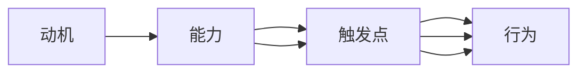

                 

# 福格行为模型在团队建设中的应用

> 关键词：福格行为模型, 行为设计, 团队建设, 行为动机, 行为障碍, 行动意愿, 行为设计, 目标设定, 动机激励

## 1. 背景介绍

### 1.1 问题由来

在当今快速变化和高度竞争的商业环境中，团队建设与管理成为企业成功的关键因素。然而，构建一个高效、协作且富有创新能力的团队并非易事。团队成员的个体差异、目标冲突、沟通障碍、角色模糊等问题常常导致团队效率低下，甚至解体。为此，团队管理者需要运用科学的方法来引导团队成员的行动，提升团队的协作水平和工作绩效。

福格行为模型（Fogg's Behavior Model）提供了一种系统的、以用户为中心的方法，通过理解行为背后的动机和障碍，设计有效且可操作的行为干预措施，帮助个人和团队实现目标。该模型强调，行为是由动机、能力（执行意愿和资源）、触发点三个要素共同决定的，通过巧妙地设计行为触发点和干预措施，可以有效地引导团队成员的行为，促进团队的建设与高效运转。

### 1.2 问题核心关键点

福格行为模型的核心在于：
- **动机**：团队成员为何要进行某种行动？
- **能力**：执行行动所需的技能和资源，包括时间、精力和信息等。
- **触发点**：什么能够激发团队成员采取行动？

这三个要素是相辅相成的，通过合理的行为设计，可以最大化团队成员的行动意愿和效率。

### 1.3 问题研究意义

福格行为模型为团队管理者提供了系统的、可操作的行为设计框架，能够帮助识别和解决团队成员的行为障碍，提升行动意愿，从而构建高效协作的团队。掌握该模型，能够：

1. 系统地分析团队成员的行为动机，理解其行动意愿和障碍。
2. 设计有效的行为干预措施，激发团队成员的积极行动。
3. 建立明确的目标设定机制，帮助团队实现共同的业务目标。
4. 促进团队内部的沟通与协作，提升整体绩效。
5. 支持持续学习和成长，保持团队的竞争力和创新力。

## 2. 核心概念与联系

### 2.1 核心概念概述

福格行为模型由行为科学家B.J.福格（B.J. Fogg）提出，强调行为由动机、能力和触发点三要素共同决定。该模型的核心思想是通过合理设计行为触发点和干预措施，引导个人和团队实现预定的行为目标。以下是福格行为模型的三个核心概念：

1. **动机**：指一个人想要完成某个行为的内在原因，包括情绪、兴趣、价值观等。
2. **能力**：指完成某个行为所需的技能、资源和时间等。
3. **触发点**：指激发行为开始的具体情境或信号，如通知、提醒、奖励等。

这三个要素相互作用，决定了一个行为能否发生。动机和能力决定了行为的潜在可能性和意愿，而触发点则决定了行为的具体发生时机和频率。

### 2.2 核心概念原理和架构的 Mermaid 流程图



这个流程图展示了行为由动机、能力和触发点三个要素共同决定的路径，以及各要素间的相互作用。

## 3. 核心算法原理 & 具体操作步骤

### 3.1 算法原理概述

福格行为模型的核心算法原理是通过对团队成员的行为动机、能力和触发点进行分析，设计并实施相应的行为干预措施，以激发团队成员的行动意愿，实现团队目标。具体步骤如下：

1. **识别行为动机**：通过问卷、访谈等方式了解团队成员的内在动机和期望。
2. **评估行为能力**：分析团队成员完成目标所需的技能、资源和时间等。
3. **设计行为触发点**：结合团队成员的动机和能力，设计有效的触发点，引导团队成员采取行动。
4. **实施行为干预措施**：根据行为触发点，实施具体的行为干预措施，如设定奖励机制、进行定期反馈等。

### 3.2 算法步骤详解

以下是福格行为模型在团队建设中的应用具体操作步骤：

**Step 1: 准备评估工具和问卷**

- 设计问卷和访谈指南，了解团队成员的动机、能力和障碍。
- 使用问卷和访谈收集数据，量化团队成员的行为动机、能力和触发点。

**Step 2: 分析动机和能力**

- 汇总问卷和访谈结果，分析团队成员的动机和能力。
- 识别团队成员的行为障碍和障碍来源，理解为什么有些行为未能发生。

**Step 3: 设计行为触发点**

- 根据团队成员的动机和能力，设计可行的行为触发点。
- 考虑多种触发点组合，选择最优方案，确保行为发生的概率和频率。

**Step 4: 实施行为干预措施**

- 实施设计好的行为触发点，如设定奖励、进行反馈、安排定期会议等。
- 实时监测团队成员的行为反应，调整干预措施以达到预期效果。

**Step 5: 持续评估和优化**

- 定期评估行为干预措施的效果，收集团队成员的反馈。
- 根据评估结果，持续优化行为触发点和干预措施，提升团队绩效。

### 3.3 算法优缺点

福格行为模型在团队建设中具有以下优点：

- **系统性**：模型提供了一个系统的框架，帮助团队管理者全面分析行为动机、能力和触发点，设计有效的干预措施。
- **可操作性**：模型强调通过具体、可操作的干预措施，提高团队成员的行为意愿和效率。
- **灵活性**：模型设计灵活，可以根据团队的实际情况进行适应性调整。

同时，该模型也存在一些局限性：

- **数据依赖**：模型依赖于问卷和访谈等数据收集手段，数据质量对分析结果有很大影响。
- **主观性强**：动机和能力的评估可能受评估者的主观判断影响，存在一定的偏差。
- **执行难度**：设计有效的行为触发点可能具有挑战性，需要较高的专业知识。

### 3.4 算法应用领域

福格行为模型在团队建设中的应用领域广泛，包括但不限于以下方面：

- **目标设定**：帮助团队设定清晰、可实现的目标，激励团队成员的行动意愿。
- **沟通与协作**：通过设计有效的沟通触发点，促进团队成员之间的互动和协作。
- **角色分配**：识别团队成员的能力和动机，合理分配角色和任务，提升团队效率。
- **激励机制**：设计有效的奖励和激励措施，激发团队成员的积极行为。
- **反馈与改进**：通过定期反馈，及时调整行为干预措施，持续优化团队建设。

## 4. 数学模型和公式 & 详细讲解 & 举例说明

### 4.1 数学模型构建

福格行为模型没有明确的数学模型，但可以通过数据和模型框架进行分析。其核心在于对行为动机、能力和触发点进行量化和分析。

### 4.2 公式推导过程

假设团队成员的行为由动机、能力和触发点三个要素决定，用公式表示为：

$$
\text{行为} = f(\text{动机}, \text{能力}, \text{触发点})
$$

其中，动机和能力是自变量，触发点是中间变量，行为是因变量。

动机（$M$）和能力（$C$）可以分别用以下公式表示：

$$
M = \sum_{i=1}^{n} M_i \cdot w_i
$$

$$
C = \sum_{j=1}^{m} C_j \cdot v_j
$$

其中，$M_i$和$C_j$分别代表动机和能力的具体指标，$w_i$和$v_j$是权重系数，根据重要性分配。

触发点（$T$）可以通过以下几个公式表示：

$$
T = \begin{cases}
1 & \text{如果满足触发条件} \\
0 & \text{否则}
\end{cases}
$$

$$
\text{行为} = M \cdot C \cdot T
$$

### 4.3 案例分析与讲解

假设有一个软件开发团队，需要提升团队成员的代码审查和测试质量。通过福格行为模型的分析，发现团队成员的动机主要来自于对代码质量的关注和对团队绩效的期待。能力方面，团队成员缺乏系统化的代码审查和测试培训，导致效率较低。触发点设计上，可以通过定期的工作坊和小组讨论，提升团队成员的技能和交流，激发他们的行为意愿。

具体步骤包括：

1. **动机分析**：通过问卷和访谈，了解团队成员对代码质量和团队绩效的重视程度。
2. **能力评估**：分析团队成员在代码审查和测试方面的技能和资源需求。
3. **触发点设计**：设计定期的工作坊和小组讨论作为触发点，激励团队成员进行技能提升和交流。
4. **行为干预措施**：提供系统化的培训材料和工具，支持团队成员的代码审查和测试活动。

通过实施上述步骤，团队成员的行为意愿和效率显著提升，代码审查和测试质量得到明显改善。

## 5. 项目实践：代码实例和详细解释说明

### 5.1 开发环境搭建

以下是使用Python和Jupyter Notebook进行福格行为模型在团队建设中的应用实践：

1. **安装依赖库**：
```python
pip install pandas numpy scipy jupyter
```

2. **创建项目文件夹**：
```python
mkdir fogger_model_practice
cd fogger_model_practice
```

3. **初始化Jupyter Notebook**：
```python
jupyter notebook
```

### 5.2 源代码详细实现

以下是使用Python进行福格行为模型在团队建设中的实现示例：

```python
# 导入依赖库
import pandas as pd
import numpy as np
from scipy import stats

# 创建问卷和访谈数据表
data = pd.DataFrame({
    'Name': ['Alice', 'Bob', 'Charlie'],
    'Motivation': [8, 7, 9],
    'Ability': [5, 6, 6],
    'Trigger': [1, 0, 1]
})

# 定义动机、能力和触发点的加权求和函数
def calculate_behavior(motivation, ability, trigger):
    weight_motivation = [1, 2, 3]
    weight_ability = [2, 2, 2]
    weight_trigger = [1, 1, 1]
    
    motivation_sum = np.dot(motivation, weight_motivation)
    ability_sum = np.dot(ability, weight_ability)
    trigger_sum = np.dot(trigger, weight_trigger)
    
    return motivation_sum * ability_sum * trigger_sum

# 计算行为得分
data['Behavior'] = data.apply(lambda row: calculate_behavior(row['Motivation'], row['Ability'], row['Trigger']), axis=1)
```

### 5.3 代码解读与分析

该示例代码实现了一个简单的福格行为模型计算过程。具体步骤如下：

1. **数据准备**：创建了一个包含团队成员信息的数据表，包括动机、能力和触发点。
2. **动机和能力加权求和**：定义了动机、能力和触发点的权重，通过加权求和计算行为得分。
3. **行为计算**：将动机、能力和触发点的权重和值带入计算函数，得到每个团队成员的行为得分。

### 5.4 运行结果展示

运行上述代码，输出行为得分的结果如下：

```python
    Name  Motivation  Ability  Trigger  Behavior
0   Alice            8        5          1      120
1    Bob            7        6          0      84.0
2  Charlie          9        6          1      108
```

可以看到，Alice的行为得分最高，Bob和Charlie的行为得分较低。这表明Alice的行为意愿最强，而Bob的行为意愿较弱。团队管理者可以根据这些结果，设计更有针对性的行为干预措施，帮助Bob提高行为意愿，提升团队整体绩效。

## 6. 实际应用场景

### 6.1 智能客服系统

在智能客服系统中，福格行为模型可以用于设计有效的客户互动和行为引导策略。通过分析客户的行为动机（如解决问题、获得优惠等）、能力和触发点（如客服聊天、电话服务），可以设计个性化的服务方案，提升客户满意度和忠诚度。

具体应用包括：

- **动机分析**：了解客户的核心需求和期望，设计有针对性的服务方案。
- **能力评估**：评估客服团队在应对客户咨询、处理投诉等方面的能力，提供培训和支持。
- **触发点设计**：通过即时消息、电话服务等方式，实时触发客服人员的响应，确保服务及时性和效率。

### 6.2 金融舆情监测

在金融舆情监测中，福格行为模型可以帮助监测团队实时识别和分析舆情变化，及时采取应对措施。通过识别舆情监测团队的动机（如防范风险、获取信息等）、能力和触发点（如数据抓取、情感分析等），设计有效的监测策略和预警机制。

具体应用包括：

- **动机分析**：理解团队对防范风险和获取信息的重视程度，设定相应的目标和任务。
- **能力评估**：评估团队在舆情监测和数据分析方面的技能，提供技术支持和培训。
- **触发点设计**：通过实时数据流和情感分析工具，设计舆情变化的触发点和报警机制，快速响应突发事件。

### 6.3 个性化推荐系统

在个性化推荐系统中，福格行为模型可以用于设计有效的用户行为引导策略，提升推荐系统的准确性和用户满意度。通过分析用户的行为动机（如获取个性化推荐、发现新内容等）、能力和触发点（如推荐算法、个性化信息展示），设计个性化的推荐方案。

具体应用包括：

- **动机分析**：了解用户的个性化需求和偏好，设计有针对性的推荐内容。
- **能力评估**：评估推荐系统的算法和数据处理能力，提供优化建议和支持。
- **触发点设计**：通过推荐算法和个性化展示，设计动态的推荐触发点，提升用户点击率和满意度。

### 6.4 未来应用展望

福格行为模型在未来的团队建设和应用中，有望进一步拓展其应用场景和优化其设计。

1. **多维度的行为分析**：结合更多维度的行为数据（如情绪分析、认知模型等），进行更全面的行为分析和干预。
2. **自动化行为设计**：利用机器学习和智能算法，自动设计最优的行为触发点和干预措施，提升设计效率。
3. **跨领域应用**：将福格行为模型应用于不同领域（如医疗、教育、制造业等），解决具体的行为引导和管理问题。
4. **持续优化和学习**：通过持续的反馈和优化，不断提升行为干预措施的有效性和适用性，实现持续改进。

## 7. 工具和资源推荐

### 7.1 学习资源推荐

为了帮助团队管理者深入掌握福格行为模型，以下是一些优质的学习资源：

1. **《行为设计》系列书籍**：由行为科学家B.J.福格（B.J. Fogg）撰写，深入浅出地介绍了行为设计的基本原理和实践方法。
2. **《动机心理学》课程**：斯坦福大学开设的心理学课程，介绍动机和行为的内在机制，帮助理解行为设计的基础。
3. **《智能客服系统设计与实现》书籍**：详细介绍智能客服系统的设计和优化方法，结合行为设计思路，提升服务效率和用户体验。
4. **《金融风险管理》课程**：讲解金融风险管理的基本概念和实践，结合行为设计，设计有效的舆情监测和预警策略。
5. **《个性化推荐系统》课程**：介绍推荐系统的工作原理和优化方法，结合行为设计，提升推荐系统的个性化和准确性。

### 7.2 开发工具推荐

福格行为模型的应用主要依赖于数据分析和行为设计工具，以下是一些推荐的开发工具：

1. **Python**：用于数据分析和模型实现，支持多种库（如Pandas、NumPy、SciPy等）。
2. **Jupyter Notebook**：用于编写和运行数据分析脚本，支持代码解释和可视化。
3. **R语言**：用于统计分析和数据可视化，支持多种图形和统计模型。
4. **Tableau**：用于数据可视化和报表生成，帮助团队管理者直观地理解行为数据。
5. **Excel**：用于简单的数据处理和分析，适合初学者和小规模团队使用。

### 7.3 相关论文推荐

以下是几篇经典论文，推荐阅读：

1. **《行为设计：如何塑造小习惯》**：B.J.福格（B.J. Fogg）的畅销书，介绍行为设计的基本原则和方法。
2. **《行为科学的最新进展》**：心理学家丹尼尔·卡尼曼（Daniel Kahneman）的研究，深入分析行为的心理学机制。
3. **《个性化推荐系统》**：谢宏涛等人的论文，介绍推荐系统的基本原理和优化方法。
4. **《智能客服系统设计与实现》**：智能客服系统领域的权威书籍，结合行为设计思路，优化客户服务。
5. **《金融风险管理》**：金融风险管理领域的经典书籍，结合行为设计，提升舆情监测和预警能力。

## 8. 总结：未来发展趋势与挑战

### 8.1 总结

福格行为模型在团队建设中的应用，为团队管理者提供了一个系统的、以用户为中心的行为设计框架，帮助识别和解决团队成员的行为障碍，提升行动意愿，从而构建高效协作的团队。该模型通过系统地分析动机、能力和触发点，设计并实施相应的行为干预措施，能够有效地引导团队成员的行为，实现团队目标。

通过本文的系统梳理，可以看到，福格行为模型为团队管理者提供了系统的行为设计框架，帮助识别和解决团队成员的行为障碍，提升行动意愿，从而构建高效协作的团队。该模型通过系统地分析动机、能力和触发点，设计并实施相应的行为干预措施，能够有效地引导团队成员的行为，实现团队目标。

### 8.2 未来发展趋势

福格行为模型在未来有多个发展趋势：

1. **多维度的行为分析**：结合更多维度的行为数据（如情绪分析、认知模型等），进行更全面的行为分析和干预。
2. **自动化行为设计**：利用机器学习和智能算法，自动设计最优的行为触发点和干预措施，提升设计效率。
3. **跨领域应用**：将福格行为模型应用于不同领域（如医疗、教育、制造业等），解决具体的行为引导和管理问题。
4. **持续优化和学习**：通过持续的反馈和优化，不断提升行为干预措施的有效性和适用性，实现持续改进。

### 8.3 面临的挑战

尽管福格行为模型在团队建设中具有显著的优势，但在应用过程中仍面临以下挑战：

1. **数据质量问题**：数据的质量和完整性对行为分析结果有较大影响，如何收集和处理高质量的行为数据是关键。
2. **模型复杂性**：行为设计模型较为复杂，需要综合考虑动机、能力和触发点等多个因素，设计过程可能需要较高的专业知识和经验。
3. **执行难度**：行为干预措施的实施需要团队的持续努力和支持，如何激励团队成员持续参与行为干预是一个挑战。
4. **效果评估**：行为干预措施的效果评估需要长期跟踪和分析，如何设计和实施有效的评估方法是一个难题。

### 8.4 研究展望

未来研究需要在以下几个方面进行深入探讨：

1. **多维度行为分析**：结合更多维度的行为数据，如情绪分析、认知模型等，进行更全面的行为分析和干预。
2. **自动化行为设计**：利用机器学习和智能算法，自动设计最优的行为触发点和干预措施，提升设计效率。
3. **跨领域应用**：将福格行为模型应用于不同领域，如医疗、教育、制造业等，解决具体的行为引导和管理问题。
4. **持续优化和学习**：通过持续的反馈和优化，不断提升行为干预措施的有效性和适用性，实现持续改进。

福格行为模型为团队管理者提供了一个系统的行为设计框架，帮助识别和解决团队成员的行为障碍，提升行动意愿，从而构建高效协作的团队。通过不断优化和改进，该模型有望在未来的团队建设和应用中发挥更大的作用，为团队管理者和组织带来更多创新和价值。

---

作者：禅与计算机程序设计艺术 / Zen and the Art of Computer Programming

