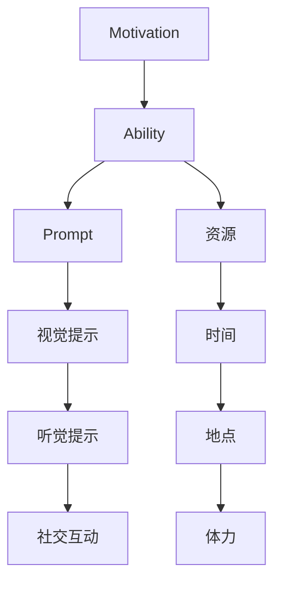

                 

# 福格行为模型：行为改变的三要素

> 关键词：行为改变,福格模型,行为设计,动机,能力,提示

## 1. 背景介绍

在个人发展和企业改进的旅程中，行为改变始终是一个核心议题。无论是要增加锻炼次数，提升工作效率，还是优化客户体验，改变行为都是实现目标的必要步骤。然而，行为改变并不总是容易实现，很大程度上因为我们对行为背后的心理机制了解不足。今天，我们将探讨一个有效且广受认可的行为设计模型——福格行为模型。

### 1.1 问题由来

在生活与工作中，我们经常会遇到需要改变行为的情况，但改变往往难以持久。即使我们在短期内取得了一些进展，很快就会因为各种原因而放弃。例如：

- **健身**：很多人制定了严格的锻炼计划，但往往因为缺乏动力或遇到突发事件而半途而废。
- **学习**：尽管有学习计划，但当我们遇到困难或挫折时，很容易失去动力。
- **工作**：我们可能因为紧急任务或同事的干扰而偏离既定的工作节奏。
- **消费**：我们可能购买了一些不必要的物品，后悔之后却很难戒除这些不健康的生活习惯。

这些行为问题的核心在于，我们没有充分理解是什么驱使我们采取某个行动，以及如何设计一个能够持续执行的系统。福格行为模型提供了一个理论框架，帮助理解行为背后的动机、能力和提示，从而实现可持续的行为改变。

## 2. 核心概念与联系

### 2.1 核心概念概述

福格行为模型由行为科学家宾·福格（B.J. Fogg）提出，它基于三个核心要素：动机（Motivation）、能力（Ability）和提示（Prompts）。通过这三个要素的合理设计，可以最大化行为发生的概率。

- **动机（Motivation）**：为什么一个人愿意去做某事。动机可以是内在的（如情感、欲望）或外在的（如奖励、惩罚）。
- **能力（Ability）**：执行某行为所需的资源和条件，包括时间、地点、体力等。
- **提示（Prompts）**：引导一个人采取行动的刺激，如视觉提示、听觉提示或社交互动。

### 2.2 核心概念原理和架构的 Mermaid 流程图



这个流程图展示了动机、能力和提示之间的关系。动机推动我们产生行动，能力决定了我们是否能够执行这些行动，而提示则提供了执行行动的具体时机和环境。这三个要素相辅相成，共同作用于人的行为选择和执行。

## 3. 核心算法原理 & 具体操作步骤

### 3.1 算法原理概述

福格行为模型的核心在于理解动机、能力和提示的交互作用，并设计策略最大化行为发生的概率。模型认为，行为发生的可能性取决于动机强度、能力和提示强度的乘积（Fogg公式：**B = M * A * P**，其中B是行为概率，M是动机，A是能力，P是提示）。当动机、能力和提示同时最大化时，行为发生的可能性最高。

### 3.2 算法步骤详解

根据福格行为模型，行为改变的步骤可以归纳为以下三个步骤：

1. **增强动机**：通过内在的满足感或外在的奖励，提升行为发生的内在驱动力。
2. **降低能力要求**：通过简化任务、减少资源消耗、优化执行环境等方式，降低行为执行的难度。
3. **提供及时提示**：通过视觉、听觉、社交等形式，为行为提供明确的执行时机和环境，确保行为能够顺利发生。

### 3.3 算法优缺点

福格行为模型提供了清晰的行为设计框架，帮助人们理解并优化行为改变的过程。其优点包括：

- **可操作性强**：模型提供了具体的行动指南，易于实施。
- **适应性广**：适用于各种行为改变的情景，如健康、学习、工作效率等。
- **科学依据**：基于心理学原理，具有坚实的理论基础。

然而，该模型也存在一些局限性：

- **复杂性**：对于复杂的、长期的行为改变，可能需要综合多个动机、能力和提示策略。
- **依赖于执行者**：模型的效果很大程度上取决于执行者的内在动机和行为习惯。

### 3.4 算法应用领域

福格行为模型在个人发展和组织改进中都有广泛的应用：

- **个人健康**：如通过设定具体的锻炼时间、地点，并在社交媒体上分享锻炼成果，增加锻炼的可能性。
- **学习提升**：如利用学习游戏化、即时反馈等技术，降低学习难度，提升学习动机。
- **工作效率**：通过时间管理工具、任务自动化等方式，优化工作流程，减少干扰，提升工作效率。
- **消费行为**：通过推荐算法、限时折扣等方式，提供合适的提示，引导合理消费。

## 4. 数学模型和公式 & 详细讲解 & 举例说明

### 4.1 数学模型构建

福格行为模型是一个基于心理学原理的行为设计模型，不涉及复杂的数学模型。然而，为了更好地理解模型的工作机制，我们可以通过一个简单的数学框架来描述行为概率的计算。

假设一个行为B的概率可以用动机M、能力和提示P的函数来表示：

$$ B = M * A * P $$

其中，动机M可以是内在的（如欲望、情感）或外在的（如奖励、惩罚），能力A可以表示为资源、时间、体力等因素的组合，提示P可以是视觉、听觉或社交等形式的刺激。

### 4.2 公式推导过程

在实际应用中，我们需要根据具体情况调整动机、能力和提示的强度，以最大化行为概率。例如：

- **动机增强**：通过奖励机制（如积分、金钱）、社交认可（如分享成果、公开承诺）等方式，提升行为的内在驱动力。
- **能力简化**：将复杂任务分解为更小的步骤，利用技术手段（如提醒工具、自动化脚本）减少执行难度。
- **提示优化**：通过视觉提示（如色块、图标）、听觉提示（如声音提醒）、社交互动（如朋友激励）等方式，提供明确的行为执行时机和环境。

### 4.3 案例分析与讲解

以下是一个具体的案例分析：

**目标**：增加每日步数

**动机**：健身带来的身体健康和心理满足感

**能力**：
- **资源**：手机、步行环境
- **时间**：5-10分钟
- **体力**：轻度运动

**提示**：
- **视觉提示**：手机上显示的步数统计图表
- **听觉提示**：手机应用程序的走路提示音
- **社交互动**：与朋友的步数挑战

**策略**：
1. **动机增强**：设定具体的步数目标，并在达到目标后给予自我奖励。
2. **能力简化**：选择离家近的步道，减少行走距离和时间。
3. **提示优化**：在走路时打开手机应用程序，自动记录步数并提醒，同时与朋友分享步数，增加社交互动。

## 5. 项目实践：代码实例和详细解释说明

### 5.1 开发环境搭建

在实践福格行为模型时，我们需要一些工具和资源。以下是一个简单的实践环境搭建指南：

1. **安装Python和相关库**：
   ```bash
   pip install numpy pandas matplotlib scikit-learn requests
   ```

2. **准备数据**：
   收集关于目标行为的数据，如步数、时间、地点等，并使用数据可视化工具（如Matplotlib）绘制图表，以便分析。

3. **选择工具**：
   可以使用行为设计框架（如Behavior Designer）来设计行为策略，也可以使用编程语言（如Python）实现定制化的提示和监测工具。

### 5.2 源代码详细实现

以下是一个Python脚本示例，用于记录步数并生成提示：

```python
import time
import random
import requests

# 定义步数目标
step_target = 5000

# 初始步数
current_step = 0

# 记录步数
while current_step < step_target:
    # 模拟行走
    walk_steps = random.randint(1000, 2000)
    current_step += walk_steps
    
    # 记录步数并发送提示
    with open('step_log.txt', 'a') as f:
        f.write(f"{time.strftime('%Y-%m-%d %H:%M:%S')} {current_step}\n")
    send_prompt(current_step)

# 发送提示函数
def send_prompt(steps):
    # 发送短信或邮件提示
    send_sms(steps)
    send_email(steps)

def send_sms(steps):
    # 发送短信提示
    message = f"You've walked {steps} steps today! Keep it up!"
    send_sms(message)

def send_email(steps):
    # 发送邮件提示
    recipient = "example@email.com"
    subject = "Your step count today"
    body = f"You've walked {steps} steps today! Keep it up!"
    send_email(recipient, subject, body)
```

### 5.3 代码解读与分析

这个Python脚本实现了一个基本的步数记录和提示生成功能：

1. **步数记录**：在行走过程中记录步数，并将每小时步数写入日志文件。
2. **提示生成**：在每次记录步数后，发送短信和邮件提示，增强动机。

### 5.4 运行结果展示

执行上述代码，你将看到记录在日志文件中的步数变化，并收到定期的短信和邮件提示。这些提示不仅能够增加行为的可见性，还能通过社交互动进一步提升动机。

## 6. 实际应用场景

福格行为模型在多个领域都有广泛的应用，以下是一些具体的场景：

### 6.1 个人健康管理

- **案例**：增加每日饮水量
  - **动机**：保持水分平衡、促进健康
  - **能力**：方便取水、设定提醒时间
  - **提示**：手机的饮水记录应用、水杯上的标签

- **案例**：减少久坐
  - **动机**：改善身体状况、提高工作效率
  - **能力**：办公桌椅、定时器
  - **提示**：坐姿监测器、站立提醒应用

### 6.2 学习提升

- **案例**：增加每日学习时间
  - **动机**：提升知识水平、职业发展
  - **能力**：学习工具、固定时间
  - **提示**：学习日历、学习奖励系统

- **案例**：完成学习任务
  - **动机**：考试准备、兴趣驱动
  - **能力**：简化任务、时间管理
  - **提示**：学习提醒应用、社交学习小组

### 6.3 工作效率提升

- **案例**：减少会议时间
  - **动机**：提高生产力、减少干扰
  - **能力**：会议调度工具、简明议程
  - **提示**：会议开始提醒、会议记录应用

- **案例**：优化项目流程
  - **动机**：项目成功、减少返工
  - **能力**：项目管理工具、自动化脚本
  - **提示**：任务完成提醒、进度跟踪应用

### 6.4 未来应用展望

福格行为模型为行为设计提供了坚实的理论基础和实际操作指南，未来在更多领域和场景中将会得到更广泛的应用：

- **企业培训**：通过行为设计提高员工的学习和培训效果。
- **产品设计**：设计更符合用户习惯的产品界面和交互方式。
- **智能家居**：通过智能设备提高家庭生活便利性和舒适性。
- **城市管理**：优化市民行为，提高城市运行效率和居民生活质量。

## 7. 工具和资源推荐

### 7.1 学习资源推荐

- **书籍**：
  - 《行为设计学：让改变成为一种习惯》（The Elements of Behavior Design）
  - 《小习惯的力量》（Atomic Habits）
  - 《影响力》（Influence: The Psychology of Persuasion）

- **在线课程**：
  - Coursera上的“行为经济学”（Behavioral Economics）课程
  - Udemy上的“行为设计”（Behavior Design）课程

- **网站**：
  - B.J. Fogg的官方网站：https://www.fogg.com/
  - 行为设计联盟：https://www.behaviordesignalliance.org/

### 7.2 开发工具推荐

- **工具**：
  - 行为设计框架（Behavior Designer）
  - 数据分析工具（如Python的Pandas、Matplotlib）
  - 社交互动工具（如Slack、Zoom）

### 7.3 相关论文推荐

- **论文**：
  - 《行为设计：21世纪创新者的竞争优势》（Behavior Design: Competitive Advantage in the 21st Century）
  - 《行为改变的新科学》（The Science of Habit: Why We Do What We Do in the First Two Minutes）
  - 《行为经济学》（Behavioral Economics）

## 8. 总结：未来发展趋势与挑战

### 8.1 研究成果总结

福格行为模型为我们理解行为改变提供了重要的理论框架和方法，在实际应用中已经取得了显著成效。该模型通过动机、能力和提示的相互作用，最大化行为发生的概率，具有高度的可操作性和适应性。

### 8.2 未来发展趋势

未来，福格行为模型将继续在以下方向发展：

- **跨领域应用**：随着对行为科学的深入研究，模型将在更多领域得到广泛应用，如医疗、教育、环境保护等。
- **智能化扩展**：结合人工智能技术，实现更精准的行为预测和干预，如智能提醒系统、个性化行为设计。
- **多层次设计**：将行为设计与其他心理学理论（如动机理论、认知行为理论）结合，提供更全面、系统的方法论。

### 8.3 面临的挑战

尽管福格行为模型具有诸多优点，但在实际应用中也面临一些挑战：

- **复杂性管理**：对于复杂的、长期的行为改变，模型需要综合多个动机、能力和提示策略，设计难度较大。
- **数据隐私**：行为设计中可能需要收集和分析用户的个人信息，隐私保护是一个重要挑战。
- **执行难度**：模型的效果很大程度上依赖于执行者的内在动机和行为习惯，难以在所有人身上实现。

### 8.4 研究展望

未来的研究方向包括：

- **数据驱动行为设计**：通过大数据分析和机器学习技术，实现更精确的行为预测和干预策略。
- **社会化行为设计**：研究社交互动对行为改变的影响，设计更具社交支持性的行为干预系统。
- **跨文化行为设计**：研究不同文化背景下行为设计的差异，实现全球化的行为设计策略。

总之，福格行为模型为行为改变提供了坚实的理论基础和实用的操作指南，将继续在个人和组织行为设计中发挥重要作用。

## 9. 附录：常见问题与解答

**Q1：福格行为模型是否适用于所有行为改变？**

A: 福格行为模型适用于大部分行为改变，但并不适用于所有情况。对于某些高度依赖于特定情境或技能的行为，模型的效果可能有限。

**Q2：如何设计有效的提示策略？**

A: 设计有效的提示策略需要考虑行为发生的具体情境和资源。例如：
- **视觉提示**：使用醒目的颜色、图标等。
- **听觉提示**：使用特定的铃声、提示音等。
- **社交提示**：通过社交媒体、朋友激励等方式。

**Q3：如何在多层次上应用福格行为模型？**

A: 福格行为模型可以应用于个人行为、团队行为、组织行为等多个层次。例如：
- **个人层面**：制定每日锻炼计划、减少拖延行为等。
- **团队层面**：设定团队目标、优化会议流程等。
- **组织层面**：改善公司文化、提高员工满意度等。

**Q4：如何评估行为设计的效果？**

A: 评估行为设计效果需要综合考虑行为发生概率、动机强度、能力要求等多个因素。可以通过问卷调查、数据分析、实验测试等方式进行评估。

**Q5：行为设计如何结合人工智能技术？**

A: 结合人工智能技术可以实现更精准的行为预测和干预。例如：
- **预测模型**：使用机器学习算法预测行为发生概率，设计更有效的提示策略。
- **自动化系统**：开发自动化行为管理系统，实时监测和干预用户行为。

本文通过详细解析福格行为模型，探讨了行为改变背后的心理学原理和实践操作指南。相信通过科学的行为设计，我们能够更好地实现个人和组织目标，提升生活质量和工作效率。

