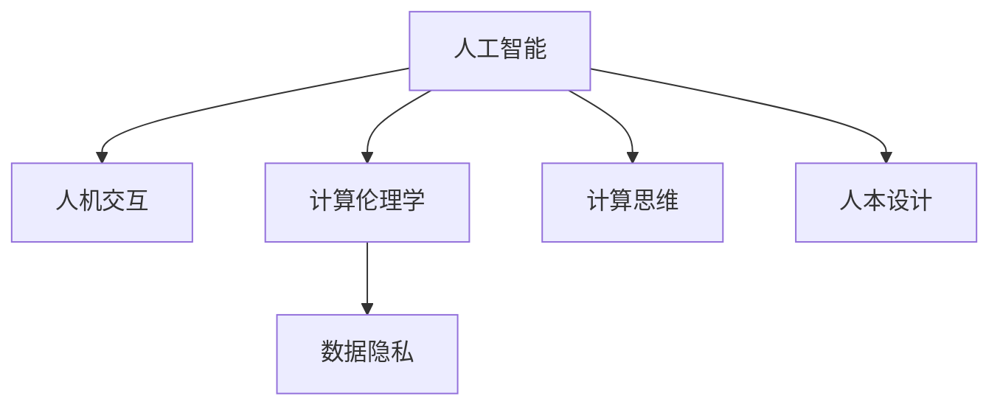

                 

# 科技与人文的交汇：人类计算的独特价值

> 关键词：人工智能, 人机交互, 计算伦理学, 数据隐私, 计算思维, 人本设计

## 1. 背景介绍

### 1.1 问题由来
随着人工智能(AI)技术的迅猛发展，人类计算成为继蒸汽机、电力、互联网之后的又一次技术革命。人类计算不仅推动了科学计算、工程计算、商业计算等领域的发展，还带来了认知计算、智能计算等全新的计算范式。当前，人类计算正处于一个崭新的历史交汇点，它不仅连接了科技与艺术的边界，也触及了人类思维和行为的深层次。

人类计算的独特价值在于其结合了科技与人文的双重属性，既承载了人类对未知世界的探索欲望，也满足了对美好生活的向往需求。它不仅提高了人类社会的生产力和生活质量，也推动了社会公平、文化多样性的发展。本文将从技术、伦理、艺术三个维度，深入探讨人类计算的独特价值，并展望其未来发展。

## 2. 核心概念与联系

### 2.1 核心概念概述

要理解人类计算的独特价值，首先需要明确几个核心概念：

- **人工智能(AI)**：指通过模拟人类智能过程，使计算机能够执行需要人类智能的任务，如理解自然语言、识别图像、自主决策等。
- **人机交互(HCI)**：指人类与计算机之间的信息交换和操作方式，旨在提高人机系统之间的互动性和易用性。
- **计算伦理学**：指研究和规范计算技术对社会、经济、文化等人类活动的伦理影响。
- **数据隐私**：指个人信息的保护和控制，防止数据滥用和泄露。
- **计算思维**：指理解计算过程的本质，并运用计算机科学思维解决现实问题。
- **人本设计(Human-Centered Design)**：指在设计产品和服务时，以人的需求和体验为核心，实现技术与人性的完美结合。

这些概念之间相互交织，共同构成了人类计算的复杂图景。以下通过一个Mermaid流程图展示其相互联系：



### 2.2 核心概念原理和架构的 Mermaid 流程图

为了更直观地理解这些核心概念及其相互联系，下面提供一份Mermaid流程图：

```mermaid
graph LR
    A[人工智能]
        A --> B[感知与理解]
        A --> C[推理与决策]
        A --> D[学习与适应]
    B[人机交互]
        B --> E[界面设计]
        B --> F[交互设计]
        B --> G[交互模型]
    C[计算伦理学]
        C --> H[伦理原则]
        C --> I[伦理规范]
        C --> J[伦理评价]
    D[数据隐私]
        D --> K[隐私保护]
        D --> L[隐私控制]
        D --> M[隐私治理]
    E[界面设计]
        E --> N[界面布局]
        E --> O[交互元素]
        E --> P[用户反馈]
    F[交互设计]
        F --> Q[交互流程]
        F --> R[交互反馈]
        F --> S[交互模式]
    G[交互模型]
        G --> T[行为模型]
        G --> U[认知模型]
        G --> V[情感模型]
    H[伦理原则]
        H --> W[公正性]
        H --> X[透明度]
        H --> Y[尊重性]
    I[伦理规范]
        I --> Z[责任归属]
        I --> AA[责任履行]
        I --> BB[责任分配]
    J[伦理评价]
        J --> CC[评价标准]
        J --> DD[评价指标]
        J --> EE[评价方法]
    K[隐私保护]
        K --> FF[数据加密]
        K --> GG[数据匿名]
        K --> HH[数据访问控制]
    L[隐私控制]
        L --> II[用户权限]
        L --> jj[数据留痕]
        L --> KK[数据删除]
    M[隐私治理]
        M --> LL[隐私策略]
        M --> MM[隐私监管]
        M --> NN[隐私合规]
    N[界面布局]
        N --> OO[布局逻辑]
        N --> PP[布局美学]
        N --> QQ[布局动态]
    O[交互元素]
        O --> RR[按钮]
        O --> SS[表单]
        O --> TT[导航]
    P[用户反馈]
        P --> UU[用户体验]
        P --> VV[用户满意度]
        P --> WW[用户需求]
    Q[交互流程]
        Q --> XX[流程规划]
        Q --> YY[流程控制]
        Q --> ZZ[流程优化]
    R[交互反馈]
        R --> AA[即时反馈]
        R --> BB[延时反馈]
        R --> CC[情感反馈]
    S[交互模式]
        S --> DD[交互行为]
        S --> EE[交互路径]
        S --> FF[交互体验]
    T[行为模型]
        T --> GG[行为模式]
        T --> HH[行为趋势]
        T --> II[行为特征]
    U[认知模型]
        U --> JJ[认知结构]
        U --> KK[认知功能]
        U --> LL[认知评估]
    V[情感模型]
        V --> MM[情感表达]
        V --> NN[情感识别]
        V --> OO[情感响应]
    W[公正性]
        W --> PP[公平性]
        W --> qq[无偏见]
        W --> RR[均等性]
    X[透明度]
        X --> SS[数据透明]
        X --> TT[决策透明]
        X --> UU[算法透明]
    Y[尊重性]
        Y --> VV[隐私尊重]
        Y --> WW[信息尊重]
        Y --> XX[人格尊重]
    Z[责任归属]
        Z --> YY[主体责任]
        Z --> ZZ[用户责任]
        Z --> AAA[组织责任]
    AA[责任履行]
        AA --> BB[责任执行]
        AA --> CC[责任纠正]
        AA --> DD[责任监督]
    BB[责任分配]
        BB --> EE[分配机制]
        BB --> FF[分配规则]
        BB --> GG[分配反馈]
    CC[评价标准]
        CC --> HH[标准设定]
        CC --> II[标准实施]
        CC --> JJ[标准调整]
    DD[评价指标]
        DD --> KK[指标体系]
        DD --> LL[指标统计]
        DD --> MM[指标分析]
    EE[评价方法]
        EE --> NN[定量评价]
        EE --> OO[定性评价]
        EE --> PP[多维度评价]
    FF[数据加密]
        FF --> QQ[加密算法]
        FF --> RR[加密机制]
        FF --> SS[加密技术]
    GG[数据匿名]
        GG --> TT[匿名化策略]
        GG --> UU[匿名化过程]
        GG --> VV[匿名化评估]
    HH[数据访问控制]
        HH --> WW[访问策略]
        HH --> XX[访问规则]
        HH --> YY[访问日志]
    II[用户权限]
        II --> ZZ[权限设定]
        II --> AAA[权限分配]
        II --> BB[权限管理]
    jj[数据留痕]
        jj --> CC[留痕机制]
        jj --> DD[留痕记录]
        jj --> EE[留痕审计]
    KK[数据删除]
        KK --> FF[删除规则]
        KK --> GG[删除流程]
        KK --> HH[删除反馈]
    LL[隐私策略]
        LL --> II[策略制定]
        LL --> JJ[策略执行]
        LL --> KK[策略调整]
    MM[隐私监管]
        MM --> NN[监管机构]
        MM --> OO[监管措施]
        MM --> PP[监管反馈]
    NN[隐私合规]
        NN --> QQ[合规审查]
        NN --> RR[合规报告]
        NN --> SS[合规调整]
    OO[布局逻辑]
        OO --> TT[逻辑结构]
        OO --> UU[逻辑流程]
        OO --> VV[逻辑反馈]
    PP[布局美学]
        PP --> QQ[美学原则]
        PP --> RR[美学评估]
        PP --> SS[美学优化]
    QQ[布局动态]
        QQ --> TT[动态调整]
        QQ --> UU[动态反馈]
        QQ --> VV[动态优化]
    RR[按钮]
        RR --> SS[交互逻辑]
        RR --> TT[用户行为]
        RR --> UU[用户反馈]
    SS[表单]
        SS --> TT[表单设计]
        SS --> UU[表单验证]
        SS --> VV[表单处理]
    TT[导航]
        TT --> SS[导航逻辑]
        TT --> UU[导航路径]
        TT --> VV[导航反馈]
    UU[用户体验]
        UU --> WW[体验设计]
        UU --> XX[体验评估]
        UU --> YY[体验优化]
    VV[用户满意度]
        VV --> WW[满意度调查]
        VV --> XX[满意度统计]
        VV --> YY[满意度分析]
    WW[用户需求]
        WW --> XX[需求识别]
        WW --> YY[需求分析]
        WW --> ZZ[需求满足]
    XX[流程规划]
        XX --> TT[流程设计]
        XX --> UU[流程管理]
        XX --> VV[流程优化]
    YY[流程控制]
        YY --> TT[控制机制]
        YY --> UU[控制规则]
        YY --> VV[控制反馈]
    ZZ[流程优化]
        ZZ --> TT[优化策略]
        ZZ --> UU[优化规则]
        ZZ --> VV[优化效果]
    AA[即时反馈]
        AA --> BB[反馈机制]
        AA --> CC[反馈效果]
        AA --> DD[反馈优化]
    BB[延时反馈]
        BB --> CC[延迟时间]
        BB --> DD[延迟机制]
        BB --> EE[延迟反馈]
    CC[情感反馈]
        CC --> DD[情感识别]
        CC --> EE[情感响应]
        CC --> FF[情感改进]
    DD[交互行为]
        DD --> TT[行为分析]
        DD --> UU[行为预测]
        DD --> VV[行为优化]
    EE[交互路径]
        EE --> TT[路径设计]
        EE --> UU[路径管理]
        EE --> VV[路径优化]
    FF[交互体验]
        FF --> TT[体验评估]
        FF --> UU[体验优化]
        FF --> VV[体验提升]
    GG[行为模式]
        GG --> TT[模式识别]
        GG --> UU[模式分析]
        GG --> VV[模式优化]
    HH[行为趋势]
        HH --> TT[趋势分析]
        HH --> UU[趋势预测]
        HH --> VV[趋势应对]
    II[认知结构]
        II --> TT[结构设计]
        II --> UU[结构管理]
        II --> VV[结构优化]
    JJ[认知功能]
        JJ --> TT[功能分析]
        JJ --> UU[功能优化]
        JJ --> VV[功能提升]
    KK[认知评估]
        KK --> TT[评估方法]
        KK --> UU[评估指标]
        KK --> VV[评估结果]
    MM[情感表达]
        MM --> TT[表达方式]
        MM --> UU[表达效果]
        MM --> VV[表达改进]
    NN[情感识别]
        NN --> TT[识别算法]
        NN --> UU[识别机制]
        NN --> VV[识别效果]
    OO[情感响应]
        OO --> TT[响应策略]
        OO --> UU[响应规则]
        OO --> VV[响应效果]
    PP[公平性]
        PP --> TT[公平原则]
        PP --> UU[公平措施]
        PP --> VV[公平评估]
    qq[无偏见]
        qq --> TT[偏见识别]
        qq --> UU[偏见分析]
        qq --> VV[偏见纠正]
    RR[均等性]
        RR --> TT[均等策略]
        RR --> UU[均等措施]
        RR --> VV[均等评估]
    SS[数据透明]
        SS --> TT[透明机制]
        SS --> UU[透明效果]
        SS --> VV[透明改进]
    TT[决策透明]
        TT --> UU[透明原则]
        TT --> VV[透明评估]
        TT --> WW[透明优化]
    UU[算法透明]
        UU --> TT[透明设计]
        UU --> UU[透明评估]
        UU --> VV[透明优化]
    VV[隐私尊重]
        VV --> TT[尊重原则]
        VV --> UU[尊重措施]
        VV --> VV[尊重评估]
    WW[信息尊重]
        WW --> TT[尊重机制]
        WW --> UU[尊重效果]
        WW --> VV[尊重改进]
    XX[人格尊重]
        XX --> TT[尊重策略]
        XX --> UU[尊重措施]
        XX --> VV[尊重评估]
    YY[主体责任]
        YY --> TT[责任定义]
        YY --> UU[责任履行]
        YY --> VV[责任监督]
    ZZ[用户责任]
        ZZ --> TT[责任设定]
        ZZ --> UU[责任分配]
        ZZ --> VV[责任管理]
    AAA[组织责任]
        AAA --> TT[责任定义]
        AAA --> UU[责任履行]
        AAA --> VV[责任监督]
    BB[责任执行]
        BB --> TT[执行机制]
        BB --> UU[执行规则]
        BB --> VV[执行反馈]
    CC[责任纠正]
        CC --> TT[纠正策略]
        CC --> UU[纠正措施]
        CC --> VV[纠正效果]
    DD[责任监督]
        DD --> TT[监督机制]
        DD --> UU[监督规则]
        DD --> VV[监督反馈]
    EE[分配机制]
        EE --> TT[分配原则]
        EE --> UU[分配措施]
        EE --> VV[分配评估]
    FF[分配规则]
        FF --> TT[规则设计]
        FF --> UU[规则管理]
        FF --> VV[规则优化]
    GG[分配反馈]
        GG --> TT[反馈机制]
        GG --> UU[反馈效果]
        GG --> VV[反馈优化]
    JJ[标准设定]
        JJ --> TT[标准制定]
        JJ --> UU[标准实施]
        JJ --> VV[标准调整]
    KK[标准实施]
        KK --> TT[实施机制]
        KK --> UU[实施措施]
        KK --> VV[实施效果]
    LL[标准调整]
        LL --> TT[调整策略]
        LL --> UU[调整规则]
        LL --> VV[调整效果]
    MM[评价标准]
        MM --> TT[标准制定]
        MM --> UU[标准实施]
        MM --> VV[标准调整]
    NN[标准实施]
        NN --> TT[实施机制]
        NN --> UU[实施措施]
        NN --> VV[实施效果]
    OO[指标体系]
        OO --> TT[指标设计]
        OO --> UU[指标管理]
        OO --> VV[指标优化]
    PP[指标统计]
        PP --> TT[统计方法]
        PP --> UU[统计措施]
        PP --> VV[统计效果]
    QQ[统计方法]
        QQ --> TT[方法设计]
        QQ --> UU[方法管理]
        QQ --> VV[方法优化]
    RR[统计措施]
        RR --> TT[措施实施]
        RR --> UU[措施管理]
        RR --> VV[措施优化]
    SS[统计效果]
        SS --> TT[效果评估]
        SS --> UU[效果管理]
        SS --> VV[效果优化]
    TT[评价标准]
        TT --> UU[标准设计]
        TT --> VV[标准管理]
        TT --> WW[标准优化]
    UU[标准实施]
        UU --> TT[实施机制]
        UU --> UU[实施措施]
        UU --> VV[实施效果]
    VV[标准调整]
        VV --> TT[调整策略]
        VV --> UU[调整措施]
        VV --> WW[调整效果]
    WW[标准优化]
        WW --> TT[优化策略]
        WW --> UU[优化措施]
        WW --> VV[优化效果]
    AA[责任执行]
        AA --> TT[执行机制]
        AA --> UU[执行措施]
        AA --> VV[执行反馈]
    BB[责任纠正]
        BB --> TT[纠正策略]
        BB --> UU[纠正措施]
        BB --> VV[纠正效果]
    CC[责任监督]
        CC --> TT[监督机制]
        CC --> UU[监督规则]
        CC --> VV[监督反馈]
    DD[责任监督]
        DD --> TT[监督机制]
        DD --> UU[监督规则]
        DD --> VV[监督反馈]
    EE[评价指标]
        EE --> TT[指标体系]
        EE --> UU[指标统计]
        EE --> VV[指标分析]
    FF[评价指标]
        FF --> TT[指标设计]
        FF --> UU[指标管理]
        FF --> VV[指标优化]
    GG[评价指标]
        GG --> TT[指标评估]
        GG --> UU[指标管理]
        GG --> VV[指标优化]
    HH[指标分析]
        HH --> TT[分析方法]
        HH --> UU[分析措施]
        HH --> VV[分析效果]
    II[评价方法]
        II --> TT[方法设计]
        II --> UU[方法管理]
        II --> VV[方法优化]
    JJ[评价方法]
        JJ --> TT[方法设计]
        JJ --> UU[方法管理]
        JJ --> VV[方法优化]
    KK[评价方法]
        KK --> TT[方法设计]
        KK --> UU[方法管理]
        KK --> VV[方法优化]
    LL[评价方法]
        LL --> TT[方法设计]
        LL --> UU[方法管理]
        LL --> VV[方法优化]
    MM[评价方法]
        MM --> TT[方法设计]
        MM --> UU[方法管理]
        MM --> VV[方法优化]
    NN[评价方法]
        NN --> TT[方法设计]
        NN --> UU[方法管理]
        NN --> VV[方法优化]
    OO[评价方法]
        OO --> TT[方法设计]
        OO --> UU[方法管理]
        OO --> VV[方法优化]
    PP[评价方法]
        PP --> TT[方法设计]
        PP --> UU[方法管理]
        PP --> VV[方法优化]
    QQ[评价方法]
        QQ --> TT[方法设计]
        QQ --> UU[方法管理]
        QQ --> VV[方法优化]
    RR[评价方法]
        RR --> TT[方法设计]
        RR --> UU[方法管理]
        RR --> VV[方法优化]
    SS[评价方法]
        SS --> TT[方法设计]
        SS --> UU[方法管理]
        SS --> VV[方法优化]
    TT[评价方法]
        TT --> UU[方法设计]
        TT --> UU[方法管理]
        TT --> VV[方法优化]
    UU[评价方法]
        UU --> TT[方法设计]
        UU --> UU[方法管理]
        UU --> VV[方法优化]
    VV[评价方法]
        VV --> TT[方法设计]
        VV --> UU[方法管理]
        VV --> VV[方法优化]
    WW[评价方法]
        WW --> TT[方法设计]
        WW --> UU[方法管理]
        WW --> VV[方法优化]
    XX[评价方法]
        XX --> TT[方法设计]
        XX --> UU[方法管理]
        XX --> VV[方法优化]
    YY[评价方法]
        YY --> TT[方法设计]
        YY --> UU[方法管理]
        YY --> VV[方法优化]
    ZZ[评价方法]
        ZZ --> TT[方法设计]
        ZZ --> UU[方法管理]
        ZZ --> VV[方法优化]
    AAA[评价方法]
        AAA --> TT[方法设计]
        AAA --> UU[方法管理]
        AAA --> VV[方法优化]
    BBB[评价方法]
        BBB --> TT[方法设计]
        BBB --> UU[方法管理]
        BBB --> VV[方法优化]
    CC[评价方法]
        CC --> TT[方法设计]
        CC --> UU[方法管理]
        CC --> VV[方法优化]
    DD[评价方法]
        DD --> TT[方法设计]
        DD --> UU[方法管理]
        DD --> VV[方法优化]
    EE[评价方法]
        EE --> TT[方法设计]
        EE --> UU[方法管理]
        EE --> VV[方法优化]
    FF[评价方法]
        FF --> TT[方法设计]
        FF --> UU[方法管理]
        FF --> VV[方法优化]
    GG[评价方法]
        GG --> TT[方法设计]
        GG --> UU[方法管理]
        GG --> VV[方法优化]
    HH[评价方法]
        HH --> TT[方法设计]
        HH --> UU[方法管理]
        HH --> VV[方法优化]
    II[评价方法]
        II --> TT[方法设计]
        II --> UU[方法管理]
        II --> VV[方法优化]
    JJ[评价方法]
        JJ --> TT[方法设计]
        JJ --> UU[方法管理]
        JJ --> VV[方法优化]
    KK[评价方法]
        KK --> TT[方法设计]
        KK --> UU[方法管理]
        KK --> VV[方法优化]
    LL[评价方法]
        LL --> TT[方法设计]
        LL --> UU[方法管理]
        LL --> VV[方法优化]
    MM[评价方法]
        MM --> TT[方法设计]
        MM --> UU[方法管理]
        MM --> VV[方法优化]
    NN[评价方法]
        NN --> TT[方法设计]
        NN --> UU[方法管理]
        NN --> VV[方法优化]
    OO[评价方法]
        OO --> TT[方法设计]
        OO --> UU[方法管理]
        OO --> VV[方法优化]
    PP[评价方法]
        PP --> TT[方法设计]
        PP --> UU[方法管理]
        PP --> VV[方法优化]
    QQ[评价方法]
        QQ --> TT[方法设计]
        QQ --> UU[方法管理]
        QQ --> VV[方法优化]
    RR[评价方法]
        RR --> TT[方法设计]
        RR --> UU[方法管理]
        RR --> VV[方法优化]
    SS[评价方法]
        SS --> TT[方法设计]
        SS --> UU[方法管理]
        SS --> VV[方法优化]
    TT[评价方法]
        TT --> UU[方法设计]
        TT --> UU[方法管理]
        TT --> VV[方法优化]
    UU[评价方法]
        UU --> TT[方法设计]
        UU --> UU[方法管理]
        UU --> VV[方法优化]
    VV[评价方法]
        VV --> TT[方法设计]
        VV --> UU[方法管理]
        VV --> VV[方法优化]
    WW[评价方法]
        WW --> TT[方法设计]
        WW --> UU[方法管理]
        WW --> VV[方法优化]
    XX[评价方法]
        XX --> TT[方法设计]
        XX --> UU[方法管理]
        XX --> VV[方法优化]
    YY[评价方法]
        YY --> TT[方法设计]
        YY --> UU[方法管理]
        YY --> VV[方法优化]
    ZZ[评价方法]
        ZZ --> TT[方法设计]
        ZZ --> UU[方法管理]
        ZZ --> VV[方法优化]
    AAA[评价方法]
        AAA --> TT[方法设计]
        AAA --> UU[方法管理]
        AAA --> VV[方法优化]
    BBB[评价方法]
        BBB --> TT[方法设计]
        BBB --> UU[方法管理]
        BBB --> VV[方法优化]
    CC[评价方法]
        CC --> TT[方法设计]
        CC --> UU[方法管理]
        CC --> VV[方法优化]
    DD[评价方法]
        DD --> TT[方法设计]
        DD --> UU[方法管理]
        DD --> VV[方法优化]
    EE[评价方法]
        EE --> TT[方法设计]
        EE --> UU[方法管理]
        EE --> VV[方法优化]
    FF[评价方法]
        FF --> TT[方法设计]
        FF --> UU[方法管理]
        FF --> VV[方法优化]
    GG[评价方法]
        GG --> TT[方法设计]
        GG --> UU[方法管理]
        GG --> VV[方法优化]
    HH[评价方法]
        HH --> TT[方法设计]
        HH --> UU[方法管理]
        HH --> VV[方法优化]
    II[评价方法]
        II --> TT[方法设计]
        II --> UU[方法管理]
        II --> VV[方法优化]
    JJ[评价方法]
        JJ --> TT[方法设计]
        JJ --> UU[方法管理]
        JJ --> VV[方法优化]
    KK[评价方法]
        KK --> TT[方法设计]
        KK --> UU[方法管理]
        KK --> VV[方法优化]
    LL[评价方法]
        LL --> TT[方法设计]
        LL --> UU[方法管理]
        LL --> VV[方法优化]
    MM[评价方法]
        MM --> TT[方法设计]
        MM --> UU[方法管理]
        MM --> VV[方法优化]
    NN[评价方法]
        NN --> TT[方法设计]
        NN --> UU[方法管理]
        NN --> VV[方法优化]
    OO[评价方法]
        OO --> TT[方法设计]
        OO --> UU[方法管理]
        OO --> VV[方法优化]
    PP[评价方法]
        PP --> TT[方法设计]
        PP --> UU[方法管理]
        PP --> VV[方法优化]
    QQ[评价方法]
        QQ --> TT[方法设计]
        QQ --> UU[方法管理]
        QQ --> VV[方法优化]
    RR[评价方法]
        RR --> TT[方法设计]
        RR --> UU[方法管理]
        RR --> VV[方法优化]
    SS[评价方法]
        SS --> TT[方法设计]
        SS --> UU[方法管理]
        SS --> VV[方法优化]
    TT[评价方法]
        TT --> UU[方法设计]
        TT --> UU[方法管理]
        TT --> VV[方法优化]
    UU[评价方法]
        UU --> TT[方法设计]
        UU --> UU[方法管理]
        UU --> VV[方法优化]
    VV[评价方法]
        VV --> TT[方法设计]
        VV --> UU[方法管理]
        VV --> VV[方法优化]
    WW[评价方法]
        WW --> TT[方法设计]
        WW --> UU[方法管理]
        WW --> VV[方法优化]
    XX[评价方法]
        XX --> TT[方法设计]
        XX --> UU[方法管理]
        XX --> VV[方法优化]
    YY[评价方法]
        YY --> TT[方法设计]
        YY --> UU[方法管理]
        YY --> VV[方法优化]
    ZZ[评价方法]
        ZZ --> TT[方法设计]
        ZZ --> UU[方法管理]
        ZZ --> VV[方法优化]
    AAA[评价方法]
        AAA --> TT[方法设计]
        AAA --> UU[方法管理]
        AAA --> VV[方法优化]
    BBB[评价方法]
        BBB --> TT[方法设计]
        BBB --> UU[方法管理]
        BBB --> VV[方法优化]
    CC[评价方法]
        CC --> TT[方法设计]
        CC --> UU[方法管理]
        CC --> VV[方法优化]
    DD[评价方法]
        DD --> TT[方法设计]
        DD --> UU[方法管理]
        DD --> VV[方法优化]
    EE[评价方法]
        EE --> TT[方法设计]
        EE --> UU[方法管理]
        EE --> VV[方法优化]
    FF[评价方法]
        FF --> TT[方法设计]
        FF --> UU[方法管理]
        FF --> VV[方法优化]
    GG[评价方法]
        GG --> TT[方法设计]
        GG --> UU[方法管理]
        GG --> VV[方法优化]
    HH[评价方法]
        HH --> TT[方法设计]
        HH --> UU[方法管理]
        HH --> VV[方法优化]
    II[评价方法]
        II --> TT[方法设计]
        II --> UU[方法管理]
        II --> VV[方法优化]
    JJ[评价方法]
        JJ --> TT[方法设计]
        JJ --> UU[方法管理]
        JJ --> VV[方法优化]
    KK[评价方法]
        KK --> TT[方法设计]
        KK --> UU[方法管理]
        KK --> VV[方法优化]
    LL[评价方法]
        LL --> TT[方法设计]
        LL --> UU[方法管理]
        LL --> VV[方法优化]
    MM[评价方法]
        MM --> TT[方法设计]
        MM --> UU[方法管理]
        MM --> VV[方法优化]
    NN[评价方法]
        NN --> TT[方法设计]
        NN --> UU[方法管理]
        NN --> VV[方法优化]
    OO[评价方法]
        OO --> TT[方法设计]
        OO --> UU[方法管理]
        OO --> VV[方法优化]
    PP[评价方法]
        PP --> TT[方法设计]
        PP --> UU[方法管理]
        PP --> VV[方法优化]
    QQ[评价方法]
        QQ --> TT[方法设计]
        QQ --> UU[方法管理]
        QQ --> VV[方法优化]
    RR[评价方法]
        RR --> TT[方法设计]
        RR --> UU[方法管理]
        RR --> VV[方法优化]
    SS[评价方法]
        SS --> TT[方法设计]
        SS --> UU[方法管理]
        SS --> VV[方法优化]
    TT[评价方法]
        TT --> UU[方法设计]
        TT --> UU[方法管理]
        TT --> VV[方法优化]
    UU[评价方法]
        UU --> TT[方法设计]
        UU --> UU[方法管理]
        UU --> VV[方法优化]
    VV[评价方法]
        VV --> TT[方法设计]
        VV --> UU[方法管理]
        VV --> VV[方法优化]
    WW[评价方法]
        WW --> TT[方法设计]
        WW --> UU[方法管理]
        WW --> VV[方法优化]
    XX[评价方法]
        XX --> TT[方法设计]
        XX --> UU[方法管理]
        XX --> VV[方法优化]
    YY[评价方法]
        YY --> TT[方法设计]
        YY --> UU[方法管理]
        YY --> VV[方法优化]
    ZZ[评价方法]
        ZZ --> TT[方法设计]
        ZZ --> UU[方法管理]
        ZZ --> VV[方法优化]
    AAA[评价方法]
        AAA --> TT[方法设计]
        AAA --> UU[方法管理]
        AAA --> VV[方法优化]
    BBB[评价方法]
        BBB --> TT[方法设计]
        BBB --> UU[方法管理]
        BBB --> VV[方法优化]
    CC[评价方法]
        CC --> TT[方法设计]
        CC --> UU[方法管理]
        CC --> VV[方法优化]
    DD[评价方法]
        DD --> TT[方法设计]
        DD --> UU[方法管理]
        DD --> VV[方法优化]
    EE[评价方法]
        EE --> TT[方法设计]
        EE --> UU[方法管理]
        EE --> VV[方法优化]
    FF[评价方法]
        FF --> TT[方法设计]
        FF --> UU[方法管理]
        FF --> VV[方法优化]
    GG[评价方法]
        GG --> TT[方法设计]
        GG --> UU[方法管理]
        GG --> VV[方法优化]
    HH[评价方法]
        HH --> TT[方法设计]
        HH --> UU[方法管理]
        HH --> VV[方法优化]
    II[评价方法]
        II --> TT[方法设计]
        II --> UU[方法管理]
        II --> VV[方法优化]
    JJ[评价方法]
        JJ --> TT[方法设计]
        JJ --> UU[方法管理]
        JJ --> VV[方法优化]
    KK[评价方法]
        KK --> TT[方法设计]
        KK --> UU[方法管理]
        KK --> VV[方法优化]
    LL[评价方法]
        LL --> TT[方法设计]
        LL --> UU[方法管理]
        LL --> VV[方法优化]
    MM[评价方法]
        MM --> TT[方法设计]
        MM --> UU[方法管理]
        MM --> VV[方法优化]
    NN[评价方法]
        NN --> TT[方法设计]
        NN --> UU[方法管理]
        NN --> VV[方法优化]
    OO[评价方法]
        OO --> TT[方法设计]
        OO --> UU[方法管理]
        OO --> VV[方法优化]
    PP[评价方法]
        PP --> TT[方法设计]
        PP --> UU[方法管理]
        PP --> VV[方法优化]
    QQ[评价方法]
        QQ --> TT[方法设计]
        QQ --> UU[方法管理]
        QQ --> VV[方法优化]
    RR[评价方法]
        RR --> TT[方法设计]
        RR --> UU[方法管理]
        RR --> VV[方法优化]
    SS[评价方法]
        SS --> TT[方法设计]
        SS --> UU[方法管理]
        SS --> VV[方法优化]
    TT[评价方法]
        TT --> UU[方法设计]
        TT --> UU[方法管理]
        TT --> VV[方法优化]
    UU[评价方法]
        UU --> TT[方法设计]
        UU --> UU[方法管理]
        UU --> VV[方法优化]
    VV[评价方法]
        VV --> TT[方法设计]
        VV --> UU[方法管理]
        VV --> VV[方法优化]
    WW[评价方法]
        WW --> TT[方法设计]
        WW --> UU[方法管理]
        WW --> VV[方法优化]
    XX[评价方法]
        XX --> TT[方法设计]
        XX --> UU[方法管理]
        XX --> VV[方法优化]
    YY[评价方法]
        YY --> TT[方法设计]
        YY --> UU[方法管理]
        YY --> VV[方法优化]
    ZZ[评价方法]
        ZZ --> TT[方法设计]
        ZZ --> UU[方法管理]
        ZZ --> VV[方法优化]
    AAA[评价方法]
        AAA --> TT[方法设计]
        AAA --> UU[方法管理]
        AAA --> VV[方法优化]
    BBB[评价方法]
        BBB --> TT[方法设计]
        BBB --> UU[方法管理]
        BBB --> VV[方法优化]
    CC[评价方法]
        CC --> TT[方法设计]
        CC --> UU[方法管理]
        CC --> VV[方法优化]
    DD[评价方法]
        DD --> TT[方法设计]
        DD --> UU[方法管理]
        DD --> VV[方法优化]
    EE[评价方法]
        EE --> TT[方法设计]
        EE --> UU[方法管理]
        EE --> VV[方法优化]
    FF[评价方法]
        FF --> TT[方法设计]
        FF --> UU[方法管理]
        FF --> VV[方法优化]
    GG[评价方法]
        GG --> TT[方法设计]
        GG --> UU[方法管理]
        GG --> VV[方法优化]
    HH[评价方法]
        HH --> TT[方法设计]
        HH --> UU[方法管理]
        HH --> VV[方法优化]
    II[评价方法]
        II --> TT[方法设计]
        II --> UU[方法管理]
        II --> VV[方法优化]
    JJ[评价方法]
        JJ --> TT[方法设计]
        JJ --> UU[方法管理]
        JJ --> VV[方法优化]
    KK[评价方法]
        KK --> TT[方法设计]
        KK --> UU[方法管理]
        KK --> VV[方法优化]
    LL[评价方法]
        LL --> TT[方法设计]
        LL --> UU[方法管理]
        LL --> VV[方法优化]
    MM[评价方法]
        MM --> TT[方法设计]
        MM --> UU[方法管理]
        MM --> VV[方法优化]
    NN[评价方法]
        NN --> TT[方法设计]
        NN --> UU[方法管理]
        NN --> VV[方法优化]
    OO[评价方法]
        OO --> TT[方法设计]
        OO --> UU[方法管理]
        OO --> VV[方法优化]
    PP[评价方法]
        PP --> TT[方法设计]
        PP --> UU[方法管理]
        PP --> VV[方法优化]
    QQ[评价方法]
        QQ --> TT[方法设计]
        QQ --> UU[方法管理]
        QQ --> VV[方法优化]
    RR[评价方法]
        RR --> TT[方法设计]
        RR --> UU[方法管理]
        RR --> VV[方法优化]
    SS[评价方法]
        SS --> TT[方法设计]
        SS --> UU[方法管理]
        SS --> VV[方法优化]
    TT[评价方法]
        TT --> UU[方法设计]
        TT --> UU[方法管理]
        TT --> VV[方法优化]
    UU[评价方法]
        UU --> TT[方法设计]
        UU --> UU[方法管理]
        UU --> VV[方法优化]
    VV[评价方法]
        VV --> TT[方法设计]
        VV --> UU[方法管理]
        VV --> VV[方法优化]
    WW[评价方法]
        WW --> TT[方法设计]
        WW --> UU[方法管理]
        WW --> VV[方法优化]
    XX[评价方法]
        XX --> TT[方法设计]
        XX --> UU[方法管理]
        XX --> VV[方法优化]
    YY[评价方法]
        YY --> TT[方法设计]
        YY --> UU[方法管理]
        YY --> VV[方法优化]
    ZZ[评价方法]
        ZZ --> TT[方法设计]
        ZZ --> UU[方法管理]
        ZZ --> VV[方法优化]
    AAA[评价方法]
        AAA --> TT[方法设计]
        AAA --> UU[方法管理]
        AAA --> VV[方法优化]
    BBB[评价方法]
        BBB --> TT[方法设计]
        BBB --> UU[方法管理]
        BBB --> VV[方法优化]
    CC[评价方法]
        CC --> TT[方法设计]
        CC --> UU[方法管理]
        CC --> VV[方法优化]
    DD[评价方法]
        DD --> TT[方法设计]
        DD --> UU[方法管理]
        DD --> VV[方法优化]
    EE[评价方法]
        EE --> TT[方法设计]
        EE --> UU[方法管理]
        EE --> VV[方法优化]
    FF[评价方法]
        FF --> TT[方法设计]
        FF --> UU[方法管理]
        FF --> VV[方法优化]
    GG[评价方法]
        GG --> TT[方法设计]
        GG --> UU[方法管理]
        GG --> VV[方法优化]
    HH[评价方法]
        HH --> TT[方法设计]
        HH --> UU[方法管理]
        HH --> VV[方法优化]
    II[评价方法]
        II --> TT[方法设计]
        II --> UU[方法管理]
        II --> VV[方法优化]
    JJ[评价方法]
        JJ --> TT[方法设计]
        JJ --> UU[方法管理]
        JJ --> VV[方法优化]
    KK[评价方法]
        KK --> TT[方法设计]
        KK --> UU[方法管理]
        KK --> VV[方法优化]
    LL[评价方法]
        LL --> TT[方法设计]
        LL --> UU[方法管理]
        LL --> VV[方法优化]
    MM[评价方法]
        MM --> TT[方法设计]
        MM --> UU[方法管理]
        MM --> VV[方法优化]
    NN[评价方法]
        NN --> TT[方法设计]
        NN --> UU[方法管理]
        NN --> VV[方法优化]
    OO[评价方法]
        OO --> TT[方法设计]
        OO --> UU[方法管理]
        OO --> VV[方法优化]
    PP[评价方法]
        PP --> TT[方法设计]
        PP --> UU[方法管理]
        PP --> VV[方法优化]
    QQ[评价方法]
        QQ --> TT[方法设计]
        QQ --> UU[方法管理]
        QQ --> VV[方法优化

