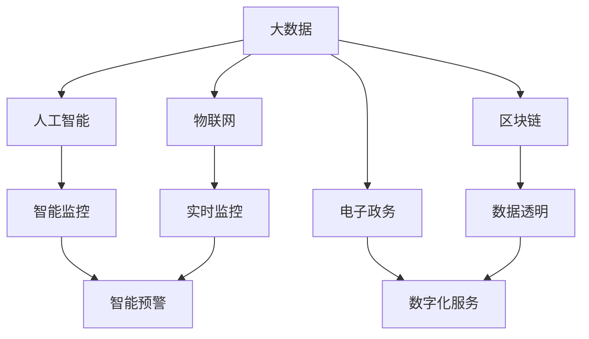

                 

## 1. 背景介绍

在数字化转型的浪潮下，科技创新已经成为社会治理的重要驱动力。从智慧城市、智能交通、金融科技，到健康医疗、教育管理，科技创新正在全方位重塑社会治理的方式。本文将探讨科技创新在社会治理中的应用，分析其优势与挑战，并展望未来的发展趋势。

### 1.1 问题由来

随着信息技术的快速发展，社会治理体系面临许多新的挑战。人口老龄化、资源环境压力、社会公平与效率的矛盾等问题日益凸显。传统的人治方式已难以应对复杂多变的新形势。科技创新以其高效、透明、智能的特性，成为解决社会问题的重要工具。通过大数据、人工智能、区块链等前沿技术，社会治理的效率、公平性和透明度得以显著提升。

### 1.2 问题核心关键点

科技创新在社会治理中的应用主要体现在以下几个方面：

- **数据驱动决策**：通过大数据分析，可以从海量数据中提取有价值的信息，辅助政府做出更加精准的决策。
- **智能监控与预警**：利用物联网、人工智能等技术，实现对城市运行状态的实时监控和风险预警。
- **协同治理与参与**：通过社交媒体、移动应用等平台，鼓励公众参与社会治理，实现多方协同合作。
- **数字化政务服务**：借助电子政务平台，优化行政流程，提升政务服务的效率和便利性。

这些关键点揭示了科技创新在社会治理中的重要性和潜力，同时也指出了其在实际应用中面临的挑战。

### 1.3 问题研究意义

科技创新在社会治理中的应用，不仅能够提高治理效率，降低成本，还能够提升政府的透明度和公信力。通过科技创新，可以实现数据共享、信息透明、治理智能化，为构建更公正、更高效的社会治理体系提供支撑。同时，科技创新还能促进社会包容性，增强公众参与感，构建和谐共治的治理环境。

## 2. 核心概念与联系

### 2.1 核心概念概述

科技创新在社会治理中的应用涉及多个核心概念，包括：

- **大数据**：通过收集、存储和分析海量数据，为决策提供支持。
- **人工智能**：利用机器学习和深度学习技术，实现智能监控、预测和决策。
- **物联网**：通过传感器网络，实现对物理世界的感知和数据采集。
- **区块链**：通过分布式账本技术，确保数据的透明、安全和不可篡改。
- **电子政务**：利用信息技术和互联网，实现政务服务的数字化和智能化。

这些概念之间相互关联，共同构成了社会治理的科技支撑体系。

### 2.2 核心概念原理和架构的 Mermaid 流程图(Mermaid 流程节点中不要有括号、逗号等特殊字符)



此图展示了各概念之间的联系和互动。大数据提供基础数据支持，人工智能进行智能分析，物联网实现实时感知，区块链确保数据透明，电子政务优化政务服务。这些技术相互融合，共同推动社会治理的智能化转型。

## 3. 核心算法原理 & 具体操作步骤

### 3.1 算法原理概述

科技创新在社会治理中的应用，主要依赖于数据驱动、算法优化和协同治理等关键技术。

- **数据驱动**：通过大数据分析，从海量数据中提取有用信息，辅助决策。
- **算法优化**：利用机器学习和深度学习算法，提升预测和决策的准确性。
- **协同治理**：通过社交媒体、移动应用等平台，实现多方协同合作，增强治理的透明度和公信力。

这些技术的应用，依赖于高效的算法和数据处理能力。例如，利用聚类算法分析城市运行数据，优化交通流量；利用自然语言处理技术分析公众意见，提升政策制定透明度。

### 3.2 算法步骤详解

科技创新在社会治理中的应用，通常包括以下关键步骤：

1. **数据采集与处理**：收集相关领域的各类数据，并进行清洗、去重、标准化等预处理。
2. **模型训练与优化**：选择合适的算法模型，在数据集上进行训练和优化，提升模型的预测能力。
3. **系统集成与应用**：将训练好的模型集成到社会治理系统中，实现智能监控、预测和决策。
4. **效果评估与改进**：定期评估系统的运行效果，根据反馈进行模型优化和改进。

### 3.3 算法优缺点

科技创新在社会治理中的应用，具有以下优点：

- **效率提升**：通过智能化手段，大幅提高社会治理的效率和响应速度。
- **决策辅助**：提供科学的数据支持，辅助政府做出更加精准的决策。
- **透明度增强**：利用数据公开和透明化，提升政府的公信力和透明度。

然而，科技创新也面临一些挑战：

- **数据隐私**：在数据收集和处理过程中，如何保护个人隐私和数据安全。
- **技术门槛**：科技创新在实际应用中需要高水平的技术支持和资源投入。
- **伦理问题**：人工智能的决策透明性和公平性问题，需要在应用中加以考虑。

### 3.4 算法应用领域

科技创新在社会治理中的应用，覆盖了诸多领域，例如：

- **智慧城市**：通过物联网、大数据等技术，实现城市运行的智能监控和优化。
- **智能交通**：利用AI技术，优化交通流量，提升交通安全和效率。
- **健康医疗**：利用区块链和大数据，实现电子病历共享和精准医疗。
- **教育管理**：利用人工智能和大数据分析，提升教育质量和公平性。
- **社会安全**：通过智能监控和预警系统，提升社会安全水平。

科技创新在这些领域的应用，正在逐步改变传统治理方式，推动社会治理向智能化、精细化、透明化方向发展。

## 4. 数学模型和公式 & 详细讲解 & 举例说明

### 4.1 数学模型构建

科技创新在社会治理中的应用，涉及多个数学模型，例如：

- **回归分析模型**：用于预测社会经济指标，如GDP增长、就业率等。
- **聚类分析模型**：用于对城市运行数据进行分类和聚类，优化交通流量。
- **决策树模型**：用于辅助政府决策，提高政策制定的科学性。

### 4.2 公式推导过程

以回归分析模型为例，其基本公式为：

$$
y = \beta_0 + \beta_1 x_1 + \beta_2 x_2 + ... + \beta_n x_n + \epsilon
$$

其中，$y$为预测变量，$x_1, x_2, ..., x_n$为自变量，$\beta_0, \beta_1, ..., \beta_n$为模型参数，$\epsilon$为误差项。

利用最小二乘法，可以求解模型参数，最小化预测误差：

$$
\hat{\beta} = (X^T X)^{-1} X^T y
$$

其中，$X = [x_1, x_2, ..., x_n]^T$，$\hat{\beta}$为最优参数估计值。

### 4.3 案例分析与讲解

以智能交通系统的预测模型为例，通过收集交通流量、天气、时间等数据，构建回归模型，预测交通拥堵情况。利用最小二乘法，计算模型参数，生成预测曲线。在实际应用中，通过不断更新数据，优化模型，提升预测精度。

## 5. 项目实践：代码实例和详细解释说明

### 5.1 开发环境搭建

在实践中，通常需要以下开发环境：

1. **Python编程语言**：选择Python 3.x版本，安装必要的库和工具。
2. **大数据平台**：如Hadoop、Spark等，用于数据处理和分析。
3. **机器学习框架**：如TensorFlow、PyTorch等，用于模型训练和优化。
4. **云计算平台**：如AWS、Google Cloud等，提供计算资源和存储服务。
5. **社交媒体和移动应用平台**：如微信、微博等，用于公众参与和数据收集。

### 5.2 源代码详细实现

以下是一个简单的智慧交通系统预测模型代码实现：

```python
import pandas as pd
import numpy as np
from sklearn.linear_model import LinearRegression

# 数据采集与处理
data = pd.read_csv('traffic_data.csv')
data = data.dropna()

# 数据特征选择
X = data[['flow', 'weather', 'hour']]
y = data['congestion']

# 模型训练与优化
model = LinearRegression()
model.fit(X, y)

# 效果评估与改进
y_pred = model.predict(X)
rmse = np.sqrt(mean_squared_error(y, y_pred))

print('RMSE:', rmse)
```

此代码实现了利用线性回归模型预测交通拥堵情况。首先从CSV文件中读取数据，并进行数据清洗和特征选择。然后，构建线性回归模型，进行训练和预测。最后，计算预测误差RMSE，评估模型效果。

### 5.3 代码解读与分析

此代码实现的核心步骤如下：

1. **数据采集与处理**：从CSV文件中读取交通数据，并进行数据清洗，去除缺失值。
2. **特征选择**：选择流量、天气、时间等特征，作为模型的输入。
3. **模型训练与优化**：使用线性回归模型进行训练，优化模型参数。
4. **效果评估与改进**：计算预测误差RMSE，评估模型性能。

### 5.4 运行结果展示

运行上述代码，输出RMSE值，表示模型的预测精度。通常，RMSE值越小，模型的预测效果越好。

## 6. 实际应用场景

科技创新在社会治理中的应用场景广泛，以下列举几个典型案例：

### 6.1 智慧城市

智慧城市利用物联网、大数据等技术，实现城市运行的智能监控和优化。例如，通过智能路灯、智能交通信号灯等设备，实现对交通流量的实时监控和调整。利用大数据分析，预测城市能耗和环境污染，制定优化方案。

### 6.2 智能交通

智能交通通过AI技术，优化交通流量，提升交通安全和效率。例如，利用深度学习模型，识别交通违法行为，提升交通管理水平。利用预测模型，优化交通信号灯控制策略，减少交通拥堵。

### 6.3 健康医疗

健康医疗利用区块链和大数据，实现电子病历共享和精准医疗。例如，通过区块链技术，确保电子病历的安全性和透明性。利用大数据分析，预测疾病流行趋势，提升公共卫生管理水平。

### 6.4 教育管理

教育管理利用人工智能和大数据分析，提升教育质量和公平性。例如，利用智能教学系统，实现个性化教育。利用预测模型，优化课程安排和资源分配，提升教育资源利用效率。

### 6.5 社会安全

社会安全通过智能监控和预警系统，提升社会安全水平。例如，利用AI技术，分析视频监控数据，识别异常行为和安全隐患。利用预测模型，预测安全事件风险，提前采取应对措施。

## 7. 工具和资源推荐

### 7.1 学习资源推荐

为帮助读者系统掌握科技创新在社会治理中的应用，以下推荐一些学习资源：

1. **《大数据分析与数据挖掘》**：介绍大数据的采集、存储和分析技术，涵盖数据清洗、数据挖掘、机器学习等多个方面。
2. **《深度学习理论与实践》**：系统讲解深度学习的基本理论和实践技术，涵盖神经网络、卷积神经网络、循环神经网络等。
3. **《人工智能在社会治理中的应用》**：探讨人工智能在智慧城市、智能交通、教育管理等多个领域的应用，提供实际案例和应用建议。
4. **《区块链技术与应用》**：介绍区块链的基本原理和应用场景，涵盖共识机制、智能合约、去中心化等多个方面。
5. **《电子政务与智慧政府》**：讲解电子政务的基本概念和应用实践，涵盖政府数据共享、信息公开、电子审批等多个方面。

### 7.2 开发工具推荐

以下推荐一些用于科技创新在社会治理中应用的开发工具：

1. **Hadoop**：大数据处理与分析平台，提供分布式计算、数据存储和处理能力。
2. **Spark**：大数据处理框架，提供高效的内存计算和数据处理能力。
3. **TensorFlow**：深度学习框架，提供丰富的模型和算法支持。
4. **PyTorch**：深度学习框架，提供灵活的模型构建和优化能力。
5. **Keras**：深度学习框架，提供简单易用的API和模型构建工具。

### 7.3 相关论文推荐

为深入理解科技创新在社会治理中的应用，以下推荐一些相关论文：

1. **《大数据驱动的智慧城市研究》**：探讨大数据技术在智慧城市中的应用，涵盖数据采集、数据处理、智能分析等多个方面。
2. **《人工智能在智能交通中的应用》**：研究人工智能技术在智能交通中的应用，涵盖自动驾驶、智能交通信号灯、智能监控等多个方面。
3. **《区块链在电子病历中的应用研究》**：探讨区块链技术在电子病历中的应用，确保数据安全性和透明性。
4. **《深度学习在社会安全中的应用》**：研究深度学习技术在社会安全中的应用，涵盖视频监控、异常行为识别、预测预警等多个方面。
5. **《电子政务系统设计与实现》**：介绍电子政务的基本概念和系统设计，涵盖数据共享、信息公开、电子审批等多个方面。

## 8. 总结：未来发展趋势与挑战

### 8.1 研究成果总结

科技创新在社会治理中的应用，已经取得了显著成效，提升了治理效率和透明度。然而，仍面临数据隐私、技术门槛、伦理问题等挑战。未来，需要在数据保护、技术普及、伦理审查等方面进行深入研究，推动科技创新在社会治理中的广泛应用。

### 8.2 未来发展趋势

科技创新在社会治理中的未来发展趋势，主要包括以下几个方面：

1. **智能化转型**：通过智能化手段，实现更高效、更精确的社会治理。
2. **数字化服务**：利用电子政务平台，提供更便捷、更高效的政务服务。
3. **公众参与**：通过社交媒体、移动应用等平台，增强公众参与感，构建共治环境。
4. **跨领域融合**：将科技创新与教育、医疗、文化等多个领域进行深度融合，提升整体治理水平。

### 8.3 面临的挑战

科技创新在社会治理中的应用，仍面临以下挑战：

1. **数据隐私**：在数据收集和处理过程中，如何保护个人隐私和数据安全。
2. **技术门槛**：科技创新在实际应用中需要高水平的技术支持和资源投入。
3. **伦理问题**：人工智能的决策透明性和公平性问题，需要在应用中加以考虑。
4. **系统安全**：通过智能监控和预警系统，提升社会安全水平。

### 8.4 研究展望

未来，需要在以下几个方面进行深入研究：

1. **数据隐私保护**：开发数据隐私保护技术，确保数据采集和使用过程中的隐私安全。
2. **技术普及与应用**：推动科技创新在各领域的应用普及，降低技术门槛，提升应用效果。
3. **伦理审查与监管**：建立科技创新应用的伦理审查机制，确保应用的公平性和透明性。
4. **跨领域融合**：将科技创新与教育、医疗、文化等多个领域进行深度融合，提升整体治理水平。

## 9. 附录：常见问题与解答

### Q1: 数据采集与处理中，如何保证数据的准确性和完整性？

A: 在数据采集与处理过程中，可以采用以下方法保证数据的准确性和完整性：

1. **数据清洗**：对数据进行去重、去噪、处理缺失值等预处理，确保数据的完整性和准确性。
2. **数据校验**：对数据进行校验和验证，检查数据格式和内容是否符合要求。
3. **数据标准化**：对数据进行标准化处理，统一数据格式和单位，方便后续分析和应用。
4. **数据备份**：对关键数据进行备份，避免数据丢失和损坏。

### Q2: 在模型训练与优化中，如何选择适合的算法和模型？

A: 在模型训练与优化中，可以选择以下方法选择适合的算法和模型：

1. **模型选择**：根据任务类型和数据特点，选择适合的算法和模型。例如，回归问题可以选择线性回归、决策树、支持向量机等模型。
2. **超参数调优**：根据模型训练效果，调整超参数，优化模型性能。例如，调整学习率、正则化系数、特征选择等。
3. **模型集成**：利用多个模型进行集成，提升模型预测能力和鲁棒性。例如，利用Bagging、Boosting等集成方法。
4. **模型验证**：通过交叉验证等方法，验证模型的预测效果和泛化能力。

### Q3: 在效果评估与改进中，如何评价模型性能？

A: 在效果评估与改进中，可以采用以下方法评价模型性能：

1. **评估指标**：根据任务类型，选择合适的评估指标。例如，回归问题可以选择均方误差（MSE）、均方根误差（RMSE）等指标。
2. **对比实验**：通过对比实验，比较不同模型的性能和效果。例如，利用交叉验证、留一法等方法进行对比。
3. **模型改进**：根据评估结果，优化模型参数和结构，提升模型性能。例如，利用调参工具、模型压缩等方法进行改进。
4. **用户反馈**：收集用户反馈，评估模型的实际效果和应用效果。例如，通过用户调查、问卷等方法获取反馈。

### Q4: 在实际应用中，如何保障系统的安全性和可靠性？

A: 在实际应用中，可以采用以下方法保障系统的安全性和可靠性：

1. **数据加密**：对敏感数据进行加密处理，确保数据传输和存储的安全性。例如，采用AES、RSA等加密算法。
2. **访问控制**：设置访问权限，限制数据的访问范围。例如，采用RBAC、ABAC等访问控制机制。
3. **异常检测**：实时监控系统运行状态，检测异常行为和数据篡改。例如，采用入侵检测系统（IDS）、异常检测算法等。
4. **系统备份**：定期备份关键数据和系统配置，避免数据丢失和损坏。例如，采用RAID、备份软件等技术。

### Q5: 在公众参与中，如何提高公众参与度？

A: 在公众参与中，可以采用以下方法提高公众参与度：

1. **用户友好界面**：设计简洁友好的用户界面，方便用户进行操作和使用。例如，采用响应式设计、移动端优化等方法。
2. **激励机制**：设置激励机制，鼓励用户参与和贡献。例如，提供积分奖励、荣誉证书等激励措施。
3. **互动交流**：建立互动交流平台，增强用户参与感和满意度。例如，采用社交媒体、在线论坛等平台。
4. **透明度和公开性**：公开系统数据和应用过程，增强用户信任感和参与感。例如，采用数据公开、信息透明等措施。

---

作者：禅与计算机程序设计艺术 / Zen and the Art of Computer Programming

