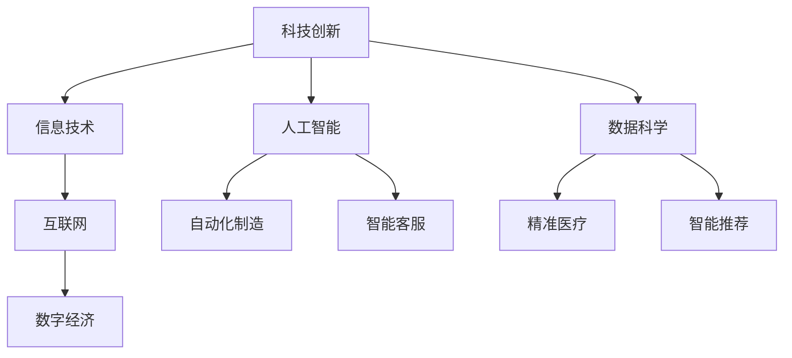

                 

# 科技创新：社会进步的阶梯

> 关键词：科技创新, 社会进步, 技术驱动, 信息技术, 人工智能, 数据科学, 互联网, 数字经济

## 1. 背景介绍

在人类历史的长河中，科技创新始终是推动社会进步的重要阶梯。从蒸汽机的诞生，到电气革命的兴起，再到信息时代的到来，每一次科技的跨越都极大地改变了人类的生产方式、生活方式和社会结构。而当下，我们正站在一个新的历史节点，科技创新正以前所未有的速度和广度，塑造着未来的世界。

### 1.1 科技创新的定义和意义

科技创新是指在科学技术领域中，通过研究、开发、应用新技术，实现新的产品、新的生产方式、新的经济模式等的过程。科技创新不仅推动了产业的升级和经济的增长，也深刻改变了人类的生活方式和思维模式，促进了社会的全面进步。

### 1.2 科技创新的历史回顾

从古代的四大发明（造纸术、印刷术、指南针、火药），到近现代的工业革命、信息革命，科技创新一直是人类进步的引擎。特别是在20世纪后半叶，科技创新的步伐不断加快，互联网的兴起、计算机技术的突破、移动通信的普及、人工智能的崛起，无一不深刻改变了我们的世界。

## 2. 核心概念与联系

### 2.1 核心概念概述

为了更好地理解科技创新的原理和过程，我们首先需要明确几个关键概念：

- **科技创新**：通过研究、开发和应用新技术，实现新的产品、生产方式和经济模式的过程。
- **信息技术**：利用计算机、通信和互联网等技术，对信息进行处理、存储、传输和应用的技术领域。
- **人工智能**：使计算机系统能够模拟人类的智能行为和思维过程，实现自主学习、推理、感知等能力的技术。
- **数据科学**：通过数据收集、处理、分析和解释，提取有价值信息，支持决策制定的学科。
- **互联网**：由计算机网络技术连接而成，实现全球范围内的信息交流和资源共享。
- **数字经济**：基于数字技术，以数据为关键生产要素，通过互联网平台实现商品和服务交易的经济模式。

这些概念之间存在着紧密的联系。信息技术为科技创新提供了工具和平台，而人工智能和数据科学则是科技创新的核心驱动力。互联网则将创新的成果广泛传播，推动了数字经济的发展。

### 2.2 核心概念原理和架构的 Mermaid 流程图



这个流程图展示了科技创新与核心概念之间的联系：

- 科技创新推动了信息技术的发展，使信息处理和传输能力大幅提升。
- 人工智能和数据科学的发展，使得计算机系统具备了更强的智能和学习能力。
- 互联网的应用，使得信息传播和资源共享变得快速高效。
- 数字经济基于这些技术基础，实现了经济活动的数字化和智能化。
- 科技创新通过推动信息技术、人工智能、数据科学和互联网的发展，最终支撑了数字经济的发展。

## 3. 核心算法原理 & 具体操作步骤

### 3.1 算法原理概述

科技创新并非一蹴而就，而是基于一系列的研究和实验，逐步形成新的技术方案和产品。在这个过程中，算法原理起着至关重要的作用。以下是几种常见的科技创新算法原理：

- **强化学习**：通过智能体与环境的交互，学习最优策略，实现自动决策和优化。
- **深度学习**：利用神经网络模型，自动提取数据的高级特征，支持图像、语音、文本等多种数据的处理和分析。
- **机器学习**：通过学习历史数据，发现规律和模式，支持预测和分类等任务。
- **遗传算法**：模拟生物进化过程，通过交叉和变异，逐步优化解决方案。

### 3.2 算法步骤详解

科技创新涉及多个步骤，以下是一个典型的科技创新流程：

**Step 1: 问题定义和目标设定**

明确要解决的问题和预期的目标，这是科技创新的起点。例如，目标可能是提高产品的生产效率、改善用户体验、降低运营成本等。

**Step 2: 数据收集和预处理**

收集相关的数据，并进行清洗、筛选和预处理，确保数据的质量和一致性。数据可以是实验结果、用户行为数据、市场调研数据等。

**Step 3: 算法选择和模型设计**

根据问题的特点，选择合适的算法和模型。例如，对于图像分类问题，可以选择卷积神经网络(CNN)；对于自然语言处理，可以选择循环神经网络(RNN)或Transformer。

**Step 4: 模型训练和验证**

使用训练数据集对模型进行训练，并在验证集上评估模型的性能，不断调整模型参数，直到满足预期目标。

**Step 5: 模型优化和部署**

在满足性能要求的基础上，对模型进行优化，如提升推理速度、减少计算资源消耗等。然后将模型部署到实际应用中，支持业务决策和运营优化。

### 3.3 算法优缺点

科技创新算法虽然强大，但也存在一些局限性：

- **算法复杂度**：许多算法需要大量的计算资源和时间，可能难以在实际应用中快速部署。
- **数据依赖**：算法的效果高度依赖于数据的质量和数量，数据缺失或不平衡可能导致模型失效。
- **模型解释性**：许多复杂模型缺乏可解释性，难以理解和调试。
- **泛化能力**：模型可能过度拟合训练数据，难以泛化到新数据集。

### 3.4 算法应用领域

科技创新算法广泛应用在多个领域，以下列举几个典型应用：

- **工业制造**：使用机器人自动化生产线，提高生产效率和产品质量。
- **金融科技**：利用大数据和机器学习进行风险评估、欺诈检测和交易预测。
- **医疗健康**：通过人工智能辅助诊断，提高疾病预测和个性化治疗的准确性。
- **交通物流**：利用物联网和机器学习优化交通流量和物流配送。
- **电子商务**：利用推荐算法提升用户体验，增加销售转化率。

## 4. 数学模型和公式 & 详细讲解

### 4.1 数学模型构建

科技创新涉及多个领域的数学模型，以下以深度学习为例，构建一个简单的数学模型：

假设我们有一个输入序列 $x=(x_1,x_2,...,x_n)$，一个线性神经网络 $f_w(x)$ 表示为：

$$
f_w(x) = w^Tx + b
$$

其中 $w$ 为权重，$b$ 为偏置，$x$ 为输入向量。

### 4.2 公式推导过程

对于一个简单的线性回归问题，目标是最小化预测值与真实值之间的平方误差，即：

$$
\min_{w,b} \sum_{i=1}^n (y_i - f_w(x_i))^2
$$

利用平方误差函数的导数，可以求得最优的权重和偏置：

$$
w = \frac{\sum_{i=1}^n (x_i y_i)}{\sum_{i=1}^n x_i^2}
$$

$$
b = \bar{y} - \frac{\sum_{i=1}^n x_i y_i}{\sum_{i=1}^n x_i^2}
$$

其中 $\bar{y}$ 为 $y$ 的平均值。

### 4.3 案例分析与讲解

考虑一个股票价格预测问题，输入序列为历史股价 $x=(x_1,x_2,...,x_n)$，目标为预测下一天的价格 $y$。可以构建一个简单的线性回归模型：

$$
f_w(x) = wx + b
$$

其中 $w$ 为权重，$b$ 为偏置。通过训练数据集 $(x_i,y_i)$ 进行模型优化，得到最优的权重和偏置，即可进行股票价格的预测。

## 5. 项目实践：代码实例和详细解释说明

### 5.1 开发环境搭建

进行科技创新项目实践，需要搭建一个高效的开发环境。以下是Python开发环境搭建的步骤：

1. 安装Python：下载并安装Python 3.8及以上版本，确保环境变量的正确配置。
2. 安装NumPy：使用pip安装NumPy库，支持多维数组和科学计算。
3. 安装Pandas：使用pip安装Pandas库，支持数据处理和分析。
4. 安装Scikit-Learn：使用pip安装Scikit-Learn库，支持机器学习和数据挖掘。
5. 安装TensorFlow：使用pip安装TensorFlow库，支持深度学习模型的训练和推理。
6. 安装Keras：使用pip安装Keras库，简化深度学习模型的搭建和训练。

完成上述步骤后，即可在Python环境中进行科技创新项目开发。

### 5.2 源代码详细实现

以下是一个简单的Python代码示例，展示了如何使用TensorFlow进行线性回归模型的训练和预测：

```python
import tensorflow as tf
import numpy as np

# 定义输入和标签数据
x = np.array([[1], [2], [3], [4], [5]], dtype=float)
y = np.array([[1], [3], [5], [7], [9]], dtype=float)

# 定义模型参数
w = tf.Variable(np.random.randn(), dtype=float)
b = tf.Variable(np.random.randn(), dtype=float)

# 定义损失函数
loss_fn = tf.keras.losses.MeanSquaredError()

# 定义优化器
optimizer = tf.keras.optimizers.Adam(learning_rate=0.01)

# 定义训练循环
@tf.function
def train_step(x):
    with tf.GradientTape() as tape:
        y_pred = tf.matmul(x, w) + b
        loss = loss_fn(y_pred, y)
    gradients = tape.gradient(loss, [w, b])
    optimizer.apply_gradients(zip(gradients, [w, b]))

# 训练模型
for i in range(1000):
    train_step(x)

# 预测新数据
x_test = np.array([[6]], dtype=float)
y_test = tf.matmul(x_test, w) + b
print(y_test.numpy())
```

### 5.3 代码解读与分析

在上述代码中，我们定义了输入和标签数据，初始化模型参数，并使用TensorFlow搭建了一个简单的线性回归模型。在训练过程中，使用均方误差作为损失函数，使用Adam优化器进行参数更新。

在预测新数据时，通过调用训练好的模型，即可得到预测结果。

## 6. 实际应用场景

### 6.1 金融科技

在金融科技领域，科技创新算法被广泛应用。例如，利用机器学习模型进行信用评估和风险控制，利用深度学习模型进行股票价格预测和市场趋势分析。这些技术不仅提高了金融机构的运营效率，还为投资者提供了更精准的投资决策支持。

### 6.2 医疗健康

在医疗健康领域，科技创新算法也发挥了重要作用。例如，利用深度学习模型进行医学影像分析，自动检测和诊断疾病；利用自然语言处理技术，提取和分析患者病历，提高诊疗效率。这些技术不仅减轻了医生的负担，还提高了诊疗的准确性和效率。

### 6.3 交通物流

在交通物流领域，科技创新算法也被广泛应用。例如，利用物联网和机器学习优化交通流量和物流配送，提高运输效率和安全性。这些技术不仅减少了交通拥堵和事故发生率，还降低了物流成本，提高了运营效率。

## 7. 工具和资源推荐

### 7.1 学习资源推荐

为了深入学习和掌握科技创新算法，以下是一些优质的学习资源：

1. 《深度学习》课程：由斯坦福大学Andrew Ng教授主讲，系统介绍了深度学习的基本概念和算法原理。
2. 《机器学习实战》书籍：适合初学者入门，介绍了机器学习的基本概念和实现方法。
3. 《TensorFlow实战》书籍：介绍了TensorFlow的搭建和训练方法，适合TensorFlow的深度学习应用开发。
4. 《Python深度学习》课程：由IBM的AI专家主讲，介绍了深度学习在Python中的实现。
5. Kaggle竞赛：全球最大的数据科学竞赛平台，提供了大量的数据集和算法竞赛，适合实践和锻炼。

### 7.2 开发工具推荐

在进行科技创新项目开发时，选择合适的开发工具可以大大提高开发效率和质量。以下是一些常用的开发工具：

1. Jupyter Notebook：支持交互式编程和数据分析，适合机器学习和深度学习应用开发。
2. PyCharm：功能强大的Python IDE，支持代码编辑、调试和测试，适合Python应用开发。
3. Git：版本控制系统，支持多人协作开发和代码管理，适合软件开发的团队协作。
4. Docker：容器化技术，支持应用在不同环境下的稳定部署，适合复杂系统的开发和部署。
5. Kubernetes：容器编排平台，支持大规模分布式系统的自动化管理和部署。

### 7.3 相关论文推荐

以下是一些经典的科技创新算法论文，推荐阅读：

1. AlexNet：ImageNet大规模视觉识别挑战赛的冠军算法，展示了深度学习在图像识别中的巨大潜力。
2. Inception：引入多尺度卷积核的设计，提升了深度神经网络的性能。
3. RNN：递归神经网络，用于自然语言处理中的序列建模。
4. Transformer：通过自注意力机制，提升了机器翻译等任务的效果。
5. GAN：生成对抗网络，用于生成高质量的图像、音频和视频内容。

## 8. 总结：未来发展趋势与挑战

### 8.1 研究成果总结

科技创新算法在多个领域取得了显著的进展和应用。例如，深度学习在图像识别、语音识别和自然语言处理中取得了突破性进展；机器学习在金融、医疗和交通等领域提升了决策的准确性和效率。这些成果不仅推动了科技进步，也深刻改变了人类的生活。

### 8.2 未来发展趋势

未来，科技创新算法将继续在多个领域取得突破：

- **AI与大数据的融合**：大数据的积累和处理能力，将进一步推动AI技术的进步，实现更加智能和精准的决策。
- **跨学科的融合**：科技创新算法将与其他学科相结合，如与生物医学、化学、物理等领域的交叉应用，产生新的突破。
- **联邦学习**：通过分布式计算和隐私保护技术，实现数据的本地化处理和模型训练，提升数据安全和隐私保护能力。
- **边缘计算**：利用边缘计算技术，实现实时数据处理和智能决策，提升系统的响应速度和可靠性。

### 8.3 面临的挑战

科技创新算法虽然前景广阔，但也面临一些挑战：

- **数据隐私和安全**：随着数据的重要性日益增加，如何保护数据隐私和安全，防止数据泄露和滥用，是一个重要的挑战。
- **模型复杂度和可解释性**：许多复杂模型缺乏可解释性，难以理解和调试，需要进一步研究和改进。
- **计算资源消耗**：许多算法需要大量的计算资源和时间，如何高效利用计算资源，提升算法的性能和效率，是一个重要的研究方向。
- **跨学科知识融合**：科技创新算法需要跨学科的知识融合，如何更好地整合不同领域的知识和技能，是一个重要的挑战。

### 8.4 研究展望

未来，科技创新算法需要在以下几个方面进行深入研究和探索：

- **隐私保护技术**：研究新的隐私保护技术，如联邦学习、差分隐私等，确保数据安全和隐私保护。
- **模型可解释性**：研究新的模型解释方法，如可解释性神经网络、因果推断等，提升模型的可解释性和可信度。
- **边缘计算技术**：研究新的边缘计算技术，如雾计算、边缘机器学习等，实现实时数据处理和智能决策。
- **跨学科知识整合**：研究跨学科的知识整合方法，如知识图谱、领域特定知识等，提升模型的全面性和准确性。

## 9. 附录：常见问题与解答

**Q1：科技创新算法是否适用于所有领域？**

A: 科技创新算法在多个领域具有广泛的应用前景，但不同领域的应用需要根据具体情况进行设计和调整。例如，在金融领域，需要考虑数据隐私和安全问题；在医疗领域，需要考虑模型的可解释性和临床验证等。

**Q2：科技创新算法如何处理数据隐私和安全问题？**

A: 数据隐私和安全是科技创新算法应用中必须考虑的重要问题。以下是几种常用的方法：
1. 数据加密：对数据进行加密处理，确保数据传输和存储的安全性。
2. 差分隐私：在数据分析和建模过程中加入噪声，确保个体数据的隐私保护。
3. 联邦学习：通过分布式计算和模型共享，实现数据本地化处理和模型训练，确保数据安全和隐私保护。

**Q3：科技创新算法在实际应用中需要注意哪些问题？**

A: 科技创新算法在实际应用中需要注意以下几个问题：
1. 数据质量和数量：数据质量和数量对算法的性能有重要影响，需要确保数据的完整性和一致性。
2. 算法复杂度和计算资源消耗：复杂算法需要大量的计算资源和时间，需要合理规划和优化。
3. 模型可解释性和可信度：复杂模型缺乏可解释性，需要进一步研究和改进，确保模型的可信度。
4. 跨学科知识整合：科技创新算法需要跨学科的知识融合，需要进一步研究和探索。

---

作者：禅与计算机程序设计艺术 / Zen and the Art of Computer Programming

