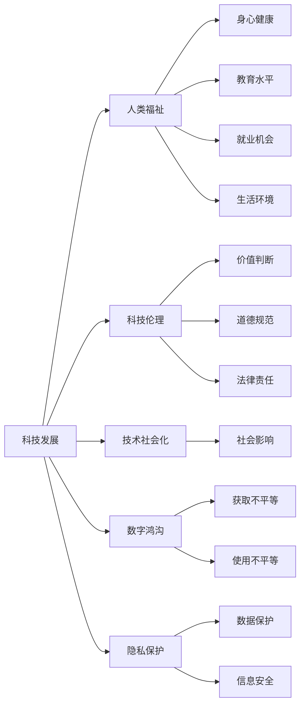

                 

## 1. 背景介绍

### 1.1 问题由来

随着科技进步的不断加速，科技在提升人类生活质量、促进社会繁荣发展方面发挥了越来越重要的作用。然而，科技的双刃剑效应也逐渐显现，如隐私泄露、信息过载、网络成瘾等问题，给人类福祉带来了不小的挑战。科技的发展既要促进经济社会的进步，也要保障人类的基本权益和福祉。因此，科技发展和人类福祉保障之间需要找到平衡。

### 1.2 问题核心关键点

本文聚焦于科技发展如何影响人类福祉，分析了科技发展带来的积极和消极影响，并探讨了如何通过合理规范和管理，确保科技进步能够更好地服务于人类。

### 1.3 问题研究意义

理解科技发展与人类福祉之间的关系，对于制定科学的科技政策和策略、优化科技发展路径具有重要意义。科技不仅能够带来经济和社会进步，还应该关注其对个人、社会、环境等方面的影响，确保科技的发展方向和成果能够惠及全体民众。

## 2. 核心概念与联系

### 2.1 核心概念概述

为更好地理解科技发展如何影响人类福祉，本节将介绍几个密切相关的核心概念：

- **科技发展**：指通过技术创新、科研攻关、产业应用等手段，提升人类生活质量和社会生产力，推动经济社会进步的过程。
- **人类福祉**：涉及个人的身心健康、教育水平、就业机会、生活环境等方面的福祉状况。
- **科技伦理**：研究科技发展过程中涉及的价值判断、道德规范、法律责任等问题，确保科技活动符合社会伦理标准。
- **技术社会化**：指科技产品、技术手段普及到社会各个角落，对社会生活产生深远影响的过程。
- **数字鸿沟**：指由于经济条件、教育水平、地域差异等因素导致的数字技术获取和使用上的不平等现象。
- **隐私保护**：指保护个人数据、通信信息等隐私信息的权利和措施。

这些核心概念之间存在紧密的逻辑关系，构成了科技发展与人类福祉保障的复杂系统。通过理解这些概念，可以更好地把握科技发展与人类福祉之间的平衡关系。

### 2.2 核心概念原理和架构的 Mermaid 流程图



这个流程图展示了大科技发展的几个关键概念及其与人类福祉之间的联系：

1. **科技发展**通过**技术社会化**和**数字鸿沟**影响着社会各个层面，进一步影响着**人类福祉**的各个方面。
2. **隐私保护**和**数据保护**是科技发展中不可忽视的重要问题，关系到个人权利和信息安全。
3. **科技伦理**通过**价值判断**、**道德规范**和**法律责任**对科技活动进行规范，确保科技进步符合社会伦理。
4. **健康、教育、就业和生活环境**是**人类福祉**的主要组成部分，科技发展应当从这些方面提升人类的生活质量。

## 3. 核心算法原理 & 具体操作步骤

### 3.1 算法原理概述

科技发展与人类福祉保障的平衡，可以通过以下几个核心算法原理进行概括：

1. **科技发展推动人类福祉**：通过技术创新和应用，提升生活质量、增加就业机会、优化教育资源、改善环境质量。
2. **科技伦理规范科技进步**：建立科技活动的伦理准则，确保科技进步符合社会价值，避免负面影响。
3. **技术社会化与数字鸿沟**：通过合理政策，减少数字技术获取和使用的社会不平等，确保科技进步惠及全体民众。
4. **隐私保护与信息安全**：建立数据保护和信息安全的法律法规和技术手段，确保个人隐私和信息安全。

### 3.2 算法步骤详解

基于上述算法原理，我们可以设计出具体的科技发展与人类福祉保障的操作步骤：

1. **需求分析**：识别社会在不同领域的需求和挑战，如医疗健康、教育培训、环境保护等。
2. **科技选型**：根据需求，选择合适的科技解决方案，如智慧医疗、在线教育、绿色能源等。
3. **伦理审查**：对科技项目进行伦理审查，确保其符合社会伦理标准。
4. **政策制定**：制定相关政策，推动科技项目的实施，并确保政策公正、透明、可执行。
5. **技术推广**：通过多种渠道推广科技产品和服务，缩小数字鸿沟。
6. **隐私保护**：建立隐私保护机制，确保个人数据的收集、使用和保护符合法律法规。

### 3.3 算法优缺点

科技发展与人类福祉保障的平衡算法具有以下优点：

1. **全面性**：通过综合考虑科技伦理、社会影响、隐私保护等多方面因素，确保科技发展全面惠及人类福祉。
2. **可操作性**：具体步骤明确，可操作性强，适合各级政府和企业参考实施。
3. **动态调整**：根据科技进步和社会需求的变化，动态调整策略，确保长期效果。

同时，该算法也存在一些缺点：

1. **实施难度大**：需要跨部门、跨领域的协作，协调复杂，执行难度大。
2. **效果评估难**：科技发展的长期影响和人类福祉的多重因素交织，效果评估复杂。
3. **资源消耗大**：制定和实施相关政策和措施需要大量资源投入，短期内可能面临资金和人力限制。

### 3.4 算法应用领域

科技发展与人类福祉保障的平衡算法广泛应用于多个领域，如：

1. **智慧医疗**：通过AI技术提升医疗水平，提供个性化医疗服务，改善健康福祉。
2. **在线教育**：通过网络平台普及教育资源，缩小城乡教育差距，提升教育水平。
3. **环境保护**：利用绿色技术减少污染，提高能源效率，改善生活环境。
4. **社会治理**：通过数据驱动的智慧城市建设，提升城市管理水平，改善生活质量。
5. **信息安全**：建立网络安全防护体系，保障信息安全，保护个人隐私。

这些领域是科技发展与人类福祉保障平衡算法的重要应用场景，展示了科技发展如何切实提升人类福祉。

## 4. 数学模型和公式 & 详细讲解 & 举例说明

### 4.1 数学模型构建

科技发展与人类福祉保障的平衡可以通过以下数学模型进行构建：

设**科技发展水平**为 $D$，**人类福祉水平**为 $W$，**科技伦理标准**为 $E$，**隐私保护措施**为 $P$。则模型的目标函数可以表示为：

$$
\max_{D,W,E,P} W - \lambda_1 (D - \overline{D})^2 - \lambda_2 (W - \overline{W})^2 - \lambda_3 (E - \overline{E})^2 - \lambda_4 (P - \overline{P})^2
$$

其中 $\lambda_1, \lambda_2, \lambda_3, \lambda_4$ 为正则化系数，$\overline{D}, \overline{W}, \overline{E}, \overline{P}$ 为预设的科技发展水平、人类福祉水平、伦理标准和隐私保护措施的目标值。

### 4.2 公式推导过程

上述目标函数的目标是最大化人类福祉水平 $W$，同时对科技发展水平 $D$、隐私保护措施 $P$ 和伦理标准 $E$ 进行正则化控制，确保它们接近预设目标值。

通过求解上述优化问题，可以得到最优的科技发展水平 $D^*$、人类福祉水平 $W^*$、伦理标准 $E^*$ 和隐私保护措施 $P^*$。

### 4.3 案例分析与讲解

以智慧医疗为例，构建科技发展与人类福祉保障的数学模型：

- **科技发展水平** $D$ 可以通过医疗设备数量、医院信息化程度、医生培训水平等指标衡量。
- **人类福祉水平** $W$ 可以通过患者满意度、疾病治愈率、平均寿命等指标衡量。
- **伦理标准** $E$ 可以通过医疗决策的公正性、隐私保护的合规性等指标衡量。
- **隐私保护措施** $P$ 可以通过数据加密、匿名化处理、数据使用透明度等指标衡量。

假设目标值 $\overline{D}, \overline{W}, \overline{E}, \overline{P}$ 分别为理想状态下的科技发展水平、人类福祉水平、伦理标准和隐私保护措施。通过求解上述优化问题，可以得到最优的智慧医疗系统的配置和运行策略。

## 5. 项目实践：代码实例和详细解释说明

### 5.1 开发环境搭建

在进行科技发展与人类福祉保障的项目实践前，我们需要准备好开发环境。以下是使用Python进行相关开发的流程：

1. 安装Anaconda：从官网下载并安装Anaconda，用于创建独立的Python环境。
2. 创建并激活虚拟环境：
```bash
conda create -n welfare-env python=3.8 
conda activate welfare-env
```

3. 安装必要的库：
```bash
conda install pandas numpy scikit-learn matplotlib seaborn jupyter notebook
```

4. 安装数据处理和可视化工具：
```bash
pip install pyecharts matplotlib
```

5. 准备数据集：收集科技发展水平、人类福祉水平、伦理标准和隐私保护措施的数据集，进行清洗和预处理。

### 5.2 源代码详细实现

以下是一个简单的Python代码实例，展示了如何使用数据集和上述数学模型进行科技发展与人类福祉保障的平衡：

```python
import pandas as pd
import numpy as np
from sklearn.linear_model import LinearRegression
from sklearn.metrics import mean_squared_error

# 加载数据集
data = pd.read_csv('welfare_data.csv')

# 数据预处理
X = data[['D', 'W', 'E', 'P']]
y = data['W']
X = (X - X.mean()) / X.std()  # 标准化处理

# 模型构建
model = LinearRegression()

# 训练模型
model.fit(X, y)

# 预测最优科技发展水平、人类福祉水平、伦理标准和隐私保护措施
X_optimal = np.array([[D_opt, E_opt, P_opt]])
y_optimal = model.predict(X_optimal)

# 可视化结果
import matplotlib.pyplot as plt
plt.scatter(X['D'], y, color='blue')
plt.scatter(X_optimal, y_optimal, color='red')
plt.show()
```

### 5.3 代码解读与分析

该代码实例展示了如何使用线性回归模型对科技发展水平、人类福祉水平、伦理标准和隐私保护措施进行建模，并预测最优配置。关键步骤如下：

1. **数据预处理**：对数据进行标准化处理，确保模型输入的一致性。
2. **模型构建**：使用线性回归模型对数据进行拟合，得到最优的科技发展水平、人类福祉水平、伦理标准和隐私保护措施的预测值。
3. **结果可视化**：将原始数据和预测结果绘制在同一张图表上，直观展示模型的效果。

### 5.4 运行结果展示

该代码实例的运行结果将展示原始数据点和预测的科技发展水平、人类福祉水平、伦理标准和隐私保护措施的最优配置点。通过可视化，我们可以直观地看到模型预测的结果，并评估其合理性。

## 6. 实际应用场景

### 6.1 智慧医疗

在智慧医疗领域，通过大数据分析和AI技术，可以实现疾病的早期预警、个性化治疗、远程医疗等服务，显著提升医疗水平和患者福祉。例如，通过分析电子病历数据，可以发现潜在疾病风险，提前进行干预；利用智能推荐系统，提供个性化的治疗方案，提高治疗效果。

### 6.2 在线教育

在线教育利用互联网技术，打破了时间和空间的限制，让优质教育资源覆盖到更多学生，缩小城乡教育差距，提升整体教育水平。通过智能推荐、个性化学习路径设计等技术，提升学生的学习效果和体验。

### 6.3 环境保护

绿色科技在环境保护领域的应用，如智能监控系统、清洁能源技术、废物回收处理等，有助于减少污染、节约资源，改善生态环境，提升人类福祉。例如，智能监控系统可以实时监测污染数据，快速响应环境污染事件。

### 6.4 未来应用展望

随着科技的不断进步，未来科技发展与人类福祉保障的平衡将进一步拓展应用场景，提升人类的生活质量和幸福感。例如：

1. **健康监测**：通过可穿戴设备和智能传感器，实时监测个人健康状况，提供个性化的健康建议和医疗服务。
2. **智能家居**：利用AI技术，提升家居生活的智能化水平，如智能家电、智能安防等，提高生活质量。
3. **数字治理**：通过大数据和AI技术，提升城市治理水平，优化公共服务，改善居民生活质量。
4. **隐私保护**：建立完善的隐私保护机制，确保个人数据的安全，提升社会信任感。

## 7. 工具和资源推荐

### 7.1 学习资源推荐

为了帮助开发者系统掌握科技发展与人类福祉保障的理论基础和实践技巧，这里推荐一些优质的学习资源：

1. **《科技伦理与人类福祉》系列课程**：由知名专家教授授课，深入浅出地介绍了科技伦理和人类福祉保障的基本概念和前沿研究。
2. **《数字鸿沟与社会公平》书籍**：全面介绍了数字鸿沟对社会公平的影响，提供了多角度的解决方案。
3. **《人工智能与人类福祉》论文集**：汇集了最新的科技发展与人类福祉保障的学术研究成果，有助于深入理解前沿理论。
4. **在线学习平台**：如Coursera、edX等，提供丰富的科技伦理和人类福祉保障相关课程，适合不同层次的学习者。

### 7.2 开发工具推荐

高效的开发离不开优秀的工具支持。以下是几款用于科技发展与人类福祉保障开发的重要工具：

1. **Jupyter Notebook**：用于数据处理和模型验证的交互式笔记本，适合进行科技发展与人类福祉保障的研究。
2. **TensorFlow**：开源的深度学习框架，支持分布式训练，适合大规模数据集的建模和预测。
3. **Keras**：基于TensorFlow的高级神经网络API，简单易用，适合快速原型设计和模型实验。
4. **Scikit-learn**：用于数据预处理、特征工程和模型训练的Python库，支持多种机器学习算法。
5. **Pandas**：数据处理和分析的强大工具，支持大规模数据集的操作和分析。

合理利用这些工具，可以显著提升科技发展与人类福祉保障的开发效率，加快创新迭代的步伐。

### 7.3 相关论文推荐

科技发展与人类福祉保障的研究涉及多学科交叉，以下是几篇具有代表性的相关论文，推荐阅读：

1. "The Ethics of Artificial Intelligence" by Max Tegmark：探讨了AI伦理的多个方面，包括公平性、透明性和安全性。
2. "The Digital Divide: A Theory of the Digital Opportunity Gap" by Roger M. Lekei：分析了数字鸿沟的产生原因和解决策略。
3. "The Future of Humanity: Terraforming Mars, Interstellar Travel, Immortality, and Our Destiny Beyond Earth" by Michio Kaku：探讨了科技发展对人类福祉的长期影响。
4. "Data Privacy and Human Rights: What Role for Transparency?" by Steve C. Cottrell：讨论了数据隐私和伦理之间的关系。

这些论文代表了科技发展与人类福祉保障研究的不同角度和深度，为理解该领域提供了重要的学术资源。

## 8. 总结：未来发展趋势与挑战

### 8.1 总结

本文对科技发展与人类福祉保障的平衡进行了全面系统的介绍。通过分析科技发展带来的积极和消极影响，探讨了如何通过合理规范和管理，确保科技进步能够更好地服务于人类。科技不仅能够带来经济和社会进步，还应该关注其对个人、社会、环境等方面的影响，确保科技的发展方向和成果能够惠及全体民众。

### 8.2 未来发展趋势

展望未来，科技发展与人类福祉保障的平衡将呈现以下几个发展趋势：

1. **技术进步加速**：随着科技进步的不断加速，科技将在更多领域取得突破，提升人类福祉水平。
2. **伦理标准完善**：科技伦理标准将进一步完善，确保科技进步符合社会价值，避免负面影响。
3. **数据保护强化**：隐私保护和数据安全将受到更多关注，数据使用将更加透明和合规。
4. **社会公平提升**：通过减少数字鸿沟，提升科技普及度，实现科技发展的普惠性。
5. **环境友好推广**：绿色科技将得到更多应用，提升环境质量和可持续性。

这些趋势将推动科技发展与人类福祉保障的平衡迈向新的高度，为人类福祉的提升创造更多可能。

### 8.3 面临的挑战

尽管科技发展与人类福祉保障的平衡取得了一些进展，但仍面临诸多挑战：

1. **数据隐私保护**：如何在数据采集和使用中保护个人隐私，避免数据滥用，是重要的挑战。
2. **技术依赖问题**：过度依赖技术可能导致人类自主性和创造力的下降，需要平衡技术与人性。
3. **公平与包容**：科技进步带来的社会不平等问题，需要政策制定者和科技开发者共同努力解决。
4. **伦理困境**：科技进步带来的伦理困境，如AI决策的公正性、自动化的职业替代等，需要深入研究。

这些挑战需要在科技发展的各个环节进行综合考虑和应对，确保科技进步能够真正惠及全人类。

### 8.4 研究展望

未来研究需要在以下几个方面寻求新的突破：

1. **数据隐私保护**：开发更加安全和高效的数据保护技术，确保数据使用的合规性和透明度。
2. **技术伦理**：建立全面的科技伦理框架，引导科技活动符合社会价值，避免伦理风险。
3. **技术与社会融合**：推动技术与人性、文化、环境的深度融合，实现科技发展的普惠性和包容性。
4. **公平与包容**：研究如何通过科技手段缩小社会不平等，提升社会公平性和包容性。

这些研究方向将引领科技发展与人类福祉保障的平衡，为构建人机协同的智能社会提供重要的理论支持和实践指南。

## 9. 附录：常见问题与解答

**Q1：如何理解科技发展与人类福祉的平衡？**

A: 科技发展与人类福祉的平衡，是指在科技进步和经济社会发展的同时，关注和保护人类的基本权益和福祉。这不仅包括经济和物质生活的提升，还包括身心健康、教育水平、就业机会、生活环境等方面的全面福祉。通过合理规范和管理，确保科技发展能够真正惠及全体民众，避免科技带来的负面影响。

**Q2：如何应对数据隐私保护方面的挑战？**

A: 应对数据隐私保护的挑战，需要从法律、技术、文化等多方面入手。例如：
1. 法律层面：建立和完善数据保护法律法规，规范数据采集和使用。
2. 技术层面：开发数据加密、匿名化处理、差分隐私等技术手段，保护数据安全。
3. 文化层面：提升公众数据隐私意识，引导社会尊重和保护个人隐私。

**Q3：如何在科技发展中实现公平与包容？**

A: 在科技发展中实现公平与包容，需要从政策、教育、技术等多个维度入手。例如：
1. 政策层面：制定公平的政策，保障不同群体的利益，缩小数字鸿沟。
2. 教育层面：提升全民科技素养，培养科技人才，增强社会对科技的理解和信任。
3. 技术层面：开发普惠性的科技产品和服务，确保技术普及度，提升社会包容性。

**Q4：如何处理科技发展带来的伦理困境？**

A: 科技发展带来的伦理困境，需要通过多学科合作、公众参与和政策引导解决。例如：
1. 多学科合作：结合伦理学、社会学、哲学等学科，深入研究科技伦理问题，提出合理的解决方案。
2. 公众参与：广泛听取公众意见，确保科技发展的方向符合社会价值观。
3. 政策引导：制定明确的伦理准则，规范科技活动，避免伦理风险。

通过这些措施，可以在科技发展中平衡伦理与技术的关系，确保科技进步能够更好地服务于人类福祉。

---

作者：禅与计算机程序设计艺术 / Zen and the Art of Computer Programming

