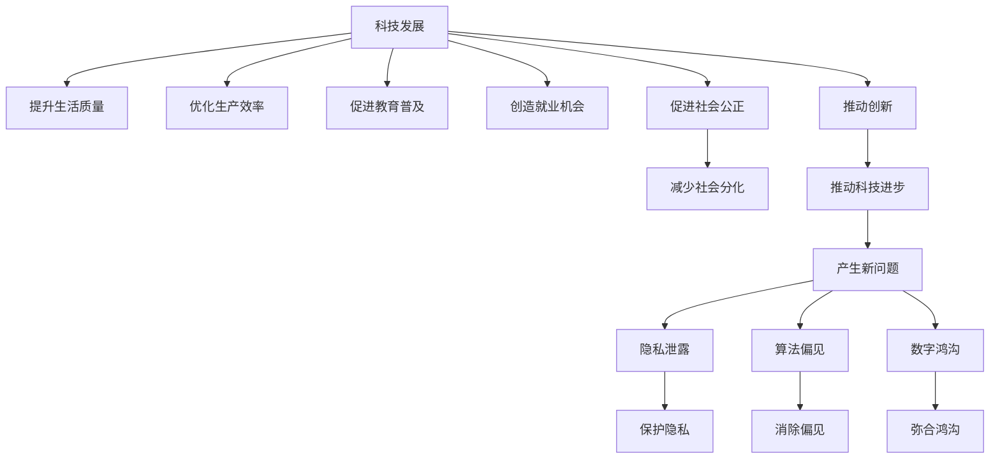

                 

# 科技发展：人类福祉的保障

## 1. 背景介绍

### 1.1 问题由来
科技进步与人类福祉的关系一直是学界和业界关注的重要议题。近年来，随着信息技术的迅猛发展，科技对社会的影响愈发显著。科技进步不仅改变了人类的生产方式，还深刻影响了生活方式、工作环境和社交行为。然而，科技进步在带来便利的同时，也引发了一系列伦理、安全和社会问题。如何平衡科技发展与人类福祉，成为亟待解决的关键课题。

### 1.2 问题核心关键点
本论文聚焦于科技发展对人类福祉的影响，分析了科技进步带来的诸多益处与挑战。科技进步在提高生活质量、提升工作效率、促进教育普及等方面发挥了重要作用，但同时也带来隐私泄露、算法偏见、社会分化等新问题。基于此，本论文将探讨如何在保障人类福祉的前提下，推动科技持续健康发展。

### 1.3 问题研究意义
研究科技发展对人类福祉的影响，具有以下重要意义：

1. **指导政策制定**：理解科技与福祉的关系，有助于制定更合理的科技政策和伦理法规，促进科技发展与社会福祉的协调统一。
2. **提升社会福利**：通过合理应用科技，优化社会资源配置，提升人民生活质量，实现可持续发展。
3. **保障公平正义**：在科技发展的过程中，注重保护弱势群体的权益，避免科技鸿沟加剧社会不平等。
4. **防范潜在风险**：识别科技发展中的潜在风险，提前采取措施，减少负面影响，确保科技应用的安全性。
5. **推动创新实践**：深入探索科技与福祉的结合点，推动更多具有社会影响力的科技项目和应用，造福人类。

## 2. 核心概念与联系

### 2.1 核心概念概述

为更好地理解科技发展对人类福祉的影响，本节将介绍几个密切相关的核心概念：

- **科技发展**：指通过应用科学原理和技术手段，提升生产力、改善生活质量的过程。
- **人类福祉**：指个体和社区在生理、心理、社会和经济方面所享有的福祉状态。
- **伦理科技**：以伦理原则为指导，合理应用科技，平衡科技发展与社会福祉的关系。
- **公平正义**：指社会资源的合理分配，减少社会不平等，促进共同富裕。
- **社会分化**：指社会成员间在财富、地位、权利等方面的差距扩大，导致社会分裂。

这些核心概念之间的逻辑关系可以通过以下Mermaid流程图来展示：



这个流程图展示科技发展对人类福祉的影响路径，以及科技进步与公平正义之间的关系：

1. 科技发展提升生活质量、优化生产效率、促进教育普及、创造就业机会、推动创新。
2. 科技进步在带来积极影响的同时，也可能引发隐私泄露、算法偏见、数字鸿沟等问题。
3. 通过合理应用伦理科技，可以避免科技发展中的负面影响，推动社会公平正义。

## 3. 核心算法原理 & 具体操作步骤
### 3.1 算法原理概述

本节将探讨如何通过科技发展保障人类福祉，具体涉及算法原理及操作步骤。

科技进步可以通过多种算法和技术手段实现。以下以人工智能（AI）为例，介绍如何通过AI技术提升人类福祉：

- **医疗健康**：利用机器学习算法分析医疗数据，提升疾病诊断准确率，优化治疗方案。
- **教育培训**：通过自然语言处理（NLP）和推荐系统，提供个性化学习资源，提升教育效果。
- **环境保护**：使用物联网和数据分析技术，监测环境变化，制定科学治理措施。
- **金融服务**：运用区块链和智能合约技术，提升金融交易的安全性和透明度。

### 3.2 算法步骤详解

以医疗健康领域为例，介绍AI提升疾病诊断和预测的具体操作步骤：

1. **数据收集**：收集医院、体检中心等机构的历史病历数据，包括患者基本信息、临床症状、检验结果等。
2. **数据预处理**：对原始数据进行清洗、去重、标准化处理，去除噪音和缺失值。
3. **特征工程**：选择合适的特征指标，如年龄、性别、体重、血压、血糖等，用于构建模型。
4. **模型训练**：选择适当的算法（如决策树、随机森林、支持向量机等），使用训练集进行模型训练，调整模型参数，优化模型性能。
5. **模型评估**：在测试集上评估模型性能，如准确率、召回率、F1分数等，判断模型效果。
6. **模型应用**：将训练好的模型应用于新患者的诊断和治疗建议，提升医疗服务质量。

### 3.3 算法优缺点

AI技术在提升医疗健康方面的优点包括：

- **高效精准**：通过机器学习算法，快速分析大量医疗数据，提升诊断准确率。
- **覆盖广泛**：适用于不同地区、不同年龄、不同病种，具有广泛适用性。
- **持续优化**：基于不断积累的新数据，持续改进模型，提升诊断效果。

然而，AI技术也存在一些缺点：

- **数据隐私**：医疗数据涉及隐私，需要严格保护，防止数据泄露。
- **模型偏见**：训练数据可能存在偏见，导致模型诊断结果不公正。
- **技术门槛**：需要高水平的数据科学家和算法工程师，对技术和人才有较高要求。
- **伦理挑战**：AI决策可能缺乏可解释性，难以获得患者的信任和理解。

### 3.4 算法应用领域

AI技术在医疗健康领域的应用已取得显著成效，未来将在更多领域得到拓展：

- **智能家居**：通过物联网技术，实现家庭自动化控制，提升生活质量。
- **智能交通**：使用数据分析和优化算法，提高交通效率，减少拥堵。
- **智能制造**：利用AI技术优化生产流程，提高生产效率和产品质量。
- **智能农业**：通过数据分析和预测模型，提升农作物产量，优化农业生产。
- **智能安防**：应用图像识别和智能监控技术，提升公共安全水平。

## 4. 数学模型和公式 & 详细讲解  
### 4.1 数学模型构建

本节将使用数学语言对AI技术提升医疗健康的过程进行严格的刻画。

记医疗数据集为 $\mathcal{D} = \{(x_i, y_i)\}_{i=1}^N$，其中 $x_i$ 表示患者的历史病历特征，$y_i$ 表示疾病的标签。

假设模型的输入为 $x$，输出为 $y$，定义损失函数为 $L(y, \hat{y})$，其中 $\hat{y}$ 为模型预测结果。

模型的训练目标是最小化经验风险：

$$
\min_{\theta} \frac{1}{N} \sum_{i=1}^N L(y_i, \hat{y}(x_i))
$$

其中 $\theta$ 为模型参数。

### 4.2 公式推导过程

以下以逻辑回归（Logistic Regression）为例，推导模型训练的损失函数和梯度计算公式。

假设模型为逻辑回归模型，输出 $y$ 的概率表示为：

$$
\hat{y} = \frac{1}{1+\exp(-z(x))}
$$

其中 $z(x) = \theta^T x$，$\theta$ 为模型参数。

逻辑回归的损失函数为交叉熵损失函数：

$$
L(y, \hat{y}) = -y \log \hat{y} - (1-y) \log (1-\hat{y})
$$

经验风险为：

$$
\mathcal{L}(\theta) = -\frac{1}{N} \sum_{i=1}^N L(y_i, \hat{y}(x_i))
$$

根据链式法则，损失函数对模型参数 $\theta$ 的梯度为：

$$
\frac{\partial \mathcal{L}(\theta)}{\partial \theta} = \frac{1}{N} \sum_{i=1}^N (y_i - \hat{y}(x_i)) x_i
$$

将梯度代入参数更新公式：

$$
\theta \leftarrow \theta - \eta \nabla_{\theta}\mathcal{L}(\theta)
$$

其中 $\eta$ 为学习率。

### 4.3 案例分析与讲解

以肺癌早期筛查为例，分析AI技术在疾病预测中的具体应用：

1. **数据准备**：收集肺CT影像数据和患者信息，如年龄、性别、吸烟史、家族病史等。
2. **数据预处理**：对影像数据进行增强、归一化处理，提取特征指标。
3. **模型训练**：使用卷积神经网络（CNN）模型，对影像数据进行特征提取，构建预测模型。
4. **模型评估**：在独立测试集上评估模型性能，如精确率、召回率、ROC曲线等。
5. **模型应用**：将训练好的模型应用于新患者的影像数据，进行肺癌早期筛查，提升筛查准确率。

## 5. 项目实践：代码实例和详细解释说明
### 5.1 开发环境搭建

在进行AI项目实践前，需要准备好开发环境。以下是使用Python进行TensorFlow开发的环境配置流程：

1. 安装Anaconda：从官网下载并安装Anaconda，用于创建独立的Python环境。

2. 创建并激活虚拟环境：
```bash
conda create -n tf-env python=3.8 
conda activate tf-env
```

3. 安装TensorFlow：根据CUDA版本，从官网获取对应的安装命令。例如：
```bash
conda install tensorflow tensorflow-gpu=2.7.0 -c conda-forge
```

4. 安装各类工具包：
```bash
pip install numpy pandas scikit-learn matplotlib tqdm jupyter notebook ipython
```

完成上述步骤后，即可在`tf-env`环境中开始AI实践。

### 5.2 源代码详细实现

这里我们以癌症预测为例，给出使用TensorFlow对卷积神经网络（CNN）进行医疗数据分析的代码实现。

首先，定义数据处理函数：

```python
import tensorflow as tf
from tensorflow.keras import datasets, layers, models
from sklearn.model_selection import train_test_split

def load_data():
    (x_train, y_train), (x_test, y_test) = datasets.cifar10.load_data()
    x_train = x_train / 255.0
    x_test = x_test / 255.0
    return (x_train, y_train), (x_test, y_test)

def train_cnn(x_train, y_train, x_test, y_test):
    model = models.Sequential([
        layers.Conv2D(32, (3, 3), activation='relu', input_shape=(32, 32, 3)),
        layers.MaxPooling2D((2, 2)),
        layers.Conv2D(64, (3, 3), activation='relu'),
        layers.MaxPooling2D((2, 2)),
        layers.Conv2D(64, (3, 3), activation='relu'),
        layers.Flatten(),
        layers.Dense(64, activation='relu'),
        layers.Dense(10)
    ])

    model.compile(optimizer='adam',
                  loss=tf.keras.losses.SparseCategoricalCrossentropy(from_logits=True),
                  metrics=['accuracy'])

    history = model.fit(x_train, y_train, epochs=10, validation_data=(x_test, y_test))
    return model, history
```

然后，定义模型和优化器：

```python
model = models.Sequential([
    layers.Conv2D(32, (3, 3), activation='relu', input_shape=(32, 32, 3)),
    layers.MaxPooling2D((2, 2)),
    layers.Conv2D(64, (3, 3), activation='relu'),
    layers.MaxPooling2D((2, 2)),
    layers.Conv2D(64, (3, 3), activation='relu'),
    layers.Flatten(),
    layers.Dense(64, activation='relu'),
    layers.Dense(10)
])

optimizer = tf.keras.optimizers.Adam()
```

接着，定义训练和评估函数：

```python
def train_model(model, x_train, y_train, x_test, y_test):
    history = model.fit(x_train, y_train, epochs=10, validation_data=(x_test, y_test))
    return history

def evaluate_model(model, x_test, y_test):
    test_loss, test_acc = model.evaluate(x_test, y_test, verbose=2)
    print('Test accuracy:', test_acc)
```

最后，启动训练流程并在测试集上评估：

```python
(x_train, y_train), (x_test, y_test) = load_data()
model, history = train_cnn(x_train, y_train, x_test, y_test)
evaluate_model(model, x_test, y_test)
```

以上就是使用TensorFlow对卷积神经网络（CNN）进行癌症预测的完整代码实现。可以看到，TensorFlow提供了强大的深度学习框架，使得模型训练和推理过程变得简单易行。

### 5.3 代码解读与分析

让我们再详细解读一下关键代码的实现细节：

**load_data函数**：
- 使用TensorFlow自带的CIFAR-10数据集，加载训练集和测试集。
- 对图像数据进行归一化处理，确保输入数据的一致性。

**train_cnn函数**：
- 定义卷积神经网络模型，包括卷积层、池化层、全连接层等。
- 设置优化器、损失函数和评估指标。
- 使用训练集训练模型，返回训练历史。

**train_model函数**：
- 调用训练函数进行模型训练。
- 在测试集上评估模型性能。

**evaluate_model函数**：
- 在测试集上评估模型性能，输出测试准确率。

**训练流程**：
- 加载数据
- 定义模型和优化器
- 训练模型
- 评估模型性能

可以看到，TensorFlow使得深度学习模型的开发过程变得简单高效。开发者可以更加专注于模型设计和任务实现，而不必过多关注底层实现细节。

当然，工业级的系统实现还需考虑更多因素，如模型的保存和部署、超参数的自动搜索、更灵活的任务适配层等。但核心的模型训练过程基本与此类似。

## 6. 实际应用场景
### 6.1 智能医疗

AI技术在医疗领域的应用，可以显著提升诊疗效率和准确率，改善患者体验。智能医疗系统可以通过影像识别、病历分析、健康监测等手段，辅助医生进行疾病诊断和治疗决策。

以影像识别为例，AI可以通过深度学习算法，识别医学影像中的异常区域，辅助医生进行疾病筛查。此外，智能医疗系统还可以整合电子病历、基因数据等各类信息，进行综合分析，提升诊疗效果。

### 6.2 教育培训

AI在教育培训中的应用，可以提供个性化的学习资源和智能辅导，提升教育效果。智能教育系统可以根据学生的学习进度和兴趣，推荐适合的学习材料和习题，帮助学生掌握知识。

例如，智能辅导系统可以基于自然语言处理技术，自动批改学生的作业，提供详细的反馈和建议。智能教育系统还可以通过分析学生的学习行为和成绩，生成个性化的学习报告，帮助教师和家长了解学生的学习情况。

### 6.3 智慧城市

智慧城市是AI技术的重要应用场景之一。通过AI技术，智慧城市可以实现智能交通、智能安防、智能公共服务等功能，提升城市管理的智能化水平。

例如，智能交通系统可以通过交通数据分析，优化交通信号灯的控制，缓解城市交通拥堵。智能安防系统可以通过图像识别和智能监控技术，提升公共安全水平。智慧城市还包括了智能能源管理、智能垃圾处理等各类应用，提升城市的运行效率和居民的生活质量。

### 6.4 未来应用展望

随着AI技术的不断发展，其在人类福祉方面的应用将更加广泛和深入。未来，AI技术将在更多领域得到应用，带来更深远的影响：

1. **环境保护**：利用AI技术，分析环境数据，制定科学治理措施，实现环境监测和保护。
2. **智能制造**：通过AI技术，优化生产流程，提升生产效率和产品质量，推动制造业的智能化升级。
3. **金融服务**：运用AI技术，优化金融交易流程，提升金融服务的安全性和透明度，防范金融风险。
4. **农业生产**：利用AI技术，分析农业数据，优化种植方案，提升农作物产量和质量，推动农业的智能化发展。
5. **社会治理**：通过AI技术，分析社会数据，优化资源配置，推动社会公平正义，减少社会不平等。

## 7. 工具和资源推荐
### 7.1 学习资源推荐

为了帮助开发者系统掌握AI技术在人类福祉中的应用，这里推荐一些优质的学习资源：

1. **Coursera《机器学习》课程**：由斯坦福大学开设的机器学习课程，涵盖机器学习的基础理论和经典算法，适合初学者学习。
2. **DeepLearning.AI深度学习专项课程**：由深度学习领域知名专家Andrew Ng教授主讲，涵盖深度学习的核心技术和实际应用，适合进阶学习。
3. **TensorFlow官方文档**：TensorFlow的官方文档，提供详细的API文档和代码示例，适合快速上手。
4. **Kaggle竞赛平台**：Kaggle是一个数据科学竞赛平台，提供丰富的数据集和竞赛项目，适合实践学习。
5. **GitHub开源项目**：GitHub是一个代码托管平台，提供了大量开源项目，适合参考和借鉴。

通过对这些资源的学习实践，相信你一定能够快速掌握AI技术在人类福祉方面的应用，并用于解决实际问题。

### 7.2 开发工具推荐

高效的开发离不开优秀的工具支持。以下是几款用于AI项目开发的常用工具：

1. **TensorFlow**：由Google主导开发的深度学习框架，生产部署方便，适合大规模工程应用。
2. **PyTorch**：由Facebook开发的深度学习框架，灵活易用，适合快速迭代研究。
3. **Jupyter Notebook**：一个交互式编程环境，支持多种语言和工具，方便数据分析和模型调试。
4. **Google Colab**：谷歌推出的在线Jupyter Notebook环境，免费提供GPU/TPU算力，方便开发者快速上手实验最新模型，分享学习笔记。
5. **Weights & Biases**：模型训练的实验跟踪工具，可以记录和可视化模型训练过程中的各项指标，方便对比和调优。

合理利用这些工具，可以显著提升AI项目的开发效率，加快创新迭代的步伐。

### 7.3 相关论文推荐

AI技术的发展源于学界的持续研究。以下是几篇奠基性的相关论文，推荐阅读：

1. **ImageNet Classification with Deep Convolutional Neural Networks**：提出使用卷积神经网络进行图像分类，展示了深度学习在图像识别方面的强大能力。
2. **Human Language Processing with Deep Neural Networks**：提出使用递归神经网络（RNN）和长短时记忆网络（LSTM）进行文本分类和语言生成，展示了深度学习在自然语言处理方面的应用。
3. **AlphaGo Zero**：通过深度强化学习技术，开发出AlphaGo Zero，实现了在围棋领域超越人类顶尖水平，展示了AI在复杂决策问题中的能力。
4. **GPT-3**：谷歌发布的通用预训练大模型，展示了深度学习在自然语言生成和理解方面的能力。

这些论文代表了大AI技术的发展脉络。通过学习这些前沿成果，可以帮助研究者把握学科前进方向，激发更多的创新灵感。

## 8. 总结：未来发展趋势与挑战
### 8.1 总结

本文对AI技术在提升人类福祉方面的应用进行了全面系统的介绍。首先阐述了AI技术在医疗健康、教育培训、智慧城市等领域的应用，明确了AI技术在提升生活质量、优化生产效率、促进社会公平等方面的独特价值。其次，从原理到实践，详细讲解了AI技术的核心算法原理和操作步骤，给出了AI项目开发的完整代码实例。最后，本文还广泛探讨了AI技术在实际应用中面临的挑战和未来发展趋势，提供了AI技术在人类福祉方面的未来展望。

通过本文的系统梳理，可以看到，AI技术在保障人类福祉方面的巨大潜力。科技发展在带来便利的同时，也带来了诸多挑战，如何平衡科技发展与社会福祉的关系，仍需全社会的共同努力。

### 8.2 未来发展趋势

展望未来，AI技术在人类福祉方面的应用将呈现以下几个发展趋势：

1. **智能化升级**：AI技术将更加普及，渗透到各个领域，推动社会的智能化升级。
2. **数据驱动决策**：基于AI技术的决策系统将广泛应用于政府和企业，提升决策的科学性和效率。
3. **个性化服务**：AI技术将实现更个性化的服务，满足不同群体的需求，提升用户体验。
4. **普惠化发展**：AI技术将更加注重公平性和普惠性，缩小数字鸿沟，减少社会不平等。
5. **可持续性**：AI技术将推动可持续发展，通过优化资源配置，减少环境污染和资源浪费。

以上趋势凸显了AI技术在保障人类福祉方面的广阔前景。这些方向的探索发展，必将进一步提升社会福祉水平，为构建更公平、更和谐的社会做出贡献。

### 8.3 面临的挑战

尽管AI技术在提升人类福祉方面已取得显著进展，但在迈向更加智能化、普惠化应用的过程中，仍面临诸多挑战：

1. **数据隐私**：AI系统需要大量数据进行训练，如何保护数据隐私，防止数据泄露，是亟待解决的问题。
2. **算法偏见**：AI模型可能存在偏见，如何消除偏见，提升模型公正性，是AI应用的重要挑战。
3. **伦理问题**：AI决策过程缺乏透明性和可解释性，如何增强AI的透明度，提高公众信任度，是重要的研究课题。
4. **社会不平等**：AI技术可能加剧社会不平等，如何通过AI技术促进社会公平，减少数字鸿沟，是重要的社会责任。
5. **技术风险**：AI技术可能引发安全问题，如何确保AI系统的安全性，防范恶意攻击，是重要的研究方向。

### 8.4 研究展望

面对AI技术在人类福祉方面面临的挑战，未来的研究需要在以下几个方面寻求新的突破：

1. **数据隐私保护**：开发更加安全的数据加密和隐私保护技术，确保数据安全。
2. **算法公正性**：引入更多公平性约束，避免AI模型偏见，提升模型公正性。
3. **可解释性**：开发更多可解释性算法，增强AI决策的透明性和可解释性，提高公众信任度。
4. **普惠性设计**：设计更加普惠性的AI系统，减少数字鸿沟，推动AI技术的普及和应用。
5. **安全性保障**：开发更加安全的AI技术，防范恶意攻击，确保AI系统的稳定性。

这些研究方向的探索，必将引领AI技术在人类福祉方面的持续发展，为构建更安全、更公平、更可持续的社会做出贡献。

## 9. 附录：常见问题与解答

**Q1：AI技术在人类福祉方面有哪些具体应用？**

A: AI技术在人类福祉方面的具体应用包括：

1. **医疗健康**：通过AI技术，提升疾病诊断准确率，优化治疗方案，提高医疗服务质量。
2. **教育培训**：提供个性化学习资源和智能辅导，提升教育效果，促进教育公平。
3. **智慧城市**：实现智能交通、智能安防、智能公共服务等功能，提升城市管理的智能化水平。
4. **环境保护**：通过AI技术，监测环境变化，制定科学治理措施，实现环境监测和保护。
5. **智能制造**：优化生产流程，提升生产效率和产品质量，推动制造业的智能化升级。
6. **金融服务**：优化金融交易流程，提升金融服务的安全性和透明度，防范金融风险。
7. **农业生产**：优化种植方案，提升农作物产量和质量，推动农业的智能化发展。
8. **社会治理**：分析社会数据，优化资源配置，推动社会公平正义，减少社会不平等。

**Q2：AI技术在提升人类福祉方面有哪些优势？**

A: AI技术在提升人类福祉方面的优势包括：

1. **高效精准**：通过深度学习算法，快速分析大量数据，提升决策的准确性和效率。
2. **个性化服务**：实现更个性化的服务，满足不同群体的需求，提升用户体验。
3. **普惠性**：通过AI技术，实现资源优化配置，推动社会公平，减少社会不平等。
4. **可持续性**：优化资源配置，减少环境污染和资源浪费，推动可持续发展。

**Q3：AI技术在提升人类福祉方面存在哪些挑战？**

A: AI技术在提升人类福祉方面存在以下挑战：

1. **数据隐私**：AI系统需要大量数据进行训练，如何保护数据隐私，防止数据泄露，是亟待解决的问题。
2. **算法偏见**：AI模型可能存在偏见，如何消除偏见，提升模型公正性，是AI应用的重要挑战。
3. **伦理问题**：AI决策过程缺乏透明性和可解释性，如何增强AI的透明度，提高公众信任度，是重要的研究课题。
4. **社会不平等**：AI技术可能加剧社会不平等，如何通过AI技术促进社会公平，减少数字鸿沟，是重要的社会责任。
5. **技术风险**：AI技术可能引发安全问题，如何确保AI系统的安全性，防范恶意攻击，是重要的研究方向。

**Q4：如何平衡AI技术与人类福祉的关系？**

A: 平衡AI技术与人类福祉的关系，需要在以下方面进行综合考虑：

1. **数据隐私保护**：开发更加安全的数据加密和隐私保护技术，确保数据安全。
2. **算法公正性**：引入更多公平性约束，避免AI模型偏见，提升模型公正性。
3. **可解释性**：开发更多可解释性算法，增强AI决策的透明性和可解释性，提高公众信任度。
4. **普惠性设计**：设计更加普惠性的AI系统，减少数字鸿沟，推动AI技术的普及和应用。
5. **安全性保障**：开发更加安全的AI技术，防范恶意攻击，确保AI系统的稳定性。

**Q5：未来AI技术在人类福祉方面有哪些发展方向？**

A: 未来AI技术在人类福祉方面的发展方向包括：

1. **智能化升级**：AI技术将更加普及，渗透到各个领域，推动社会的智能化升级。
2. **数据驱动决策**：基于AI技术的决策系统将广泛应用于政府和企业，提升决策的科学性和效率。
3. **个性化服务**：AI技术将实现更个性化的服务，满足不同群体的需求，提升用户体验。
4. **普惠化发展**：AI技术将更加注重公平性和普惠性，缩小数字鸿沟，减少社会不平等。
5. **可持续性**：AI技术将推动可持续发展，通过优化资源配置，减少环境污染和资源浪费。

**Q6：如何确保AI系统的安全性？**

A: 确保AI系统的安全性，需要从以下方面进行考虑：

1. **数据安全**：采用安全的数据加密和隐私保护技术，确保数据安全。
2. **算法公正性**：引入公平性约束，避免AI模型偏见，提升模型公正性。
3. **透明度**：开发可解释性算法，增强AI决策的透明性和可解释性，提高公众信任度。
4. **风险评估**：进行风险评估和安全测试，确保AI系统的稳定性和安全性。
5. **安全监控**：部署安全监控系统，实时监测AI系统的运行状态，防范安全威胁。

---

作者：禅与计算机程序设计艺术 / Zen and the Art of Computer Programming

