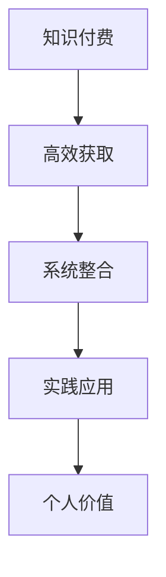

                 

## 1. 背景介绍

### 1.1 问题由来

在现代社会，知识付费已成为一种新的经济形态和社交方式。随着互联网技术的发展，知识传播的门槛大大降低，各类平台涌现，如得到、知乎、喜马拉雅等，聚集了大量专业知识和经验。

然而，对于许多程序员而言，尽管拥有丰富的技术储备和经验积累，却依然难以将知识转化为真正的价值。技术深度学习的价值体现在对专业知识的深度理解和应用能力，然而知识的传播和应用往往面临以下挑战：

- 技术深度的传播门槛高：由于技术深度往往涉及多学科、多领域的知识，理解和应用门槛较高。
- 技术深度的学习成本高：相关技术书籍、文章、教程虽然丰富，但质量参差不齐，内容杂乱，学习效率低。
- 技术深度的应用场景少：许多技术在实际应用中缺乏具体案例和解决方案，难以直接应用于实际项目。

在这种背景下，知识付费成为程序员将技术深度转化为人生价值的重要途径。通过知识付费，程序员可以高效地获取高质量的技术知识，提升自身价值，拓展职业生涯，实现自身价值最大化。

### 1.2 问题核心关键点

知识付费的核心在于如何高效地获取、整合和应用高质量的技术知识，具体包括：

- **高效获取**：如何快速获取到高质量、相关度高的技术知识。
- **系统整合**：如何将零散的、不系统的技术知识整合成一个全面的技术体系。
- **实践应用**：如何将学到的技术知识应用到实际项目中，并产出价值。

本文将围绕这三个关键点，深入探讨程序员如何利用知识付费实现人生价值，并给出具体的实践方法。

## 2. 核心概念与联系

### 2.1 核心概念概述

为更好地理解知识付费的实现过程，本节将介绍几个密切相关的核心概念：

- **知识付费**：通过付费的方式获取高质量、系统的技术知识，以提升个人或企业的技术能力，实现更高的经济效益。
- **高效获取**：指利用互联网平台、付费课程、技术博客、问答社区等多种渠道，高效地获取到技术知识和解决方案。
- **系统整合**：将零散的知识整合为一个系统的技术体系，构建一个全面的技术框架。
- **实践应用**：将学到的技术知识应用到实际项目中，产出技术价值。
- **个人价值**：通过获取、整合、应用技术知识，提升自身竞争力，实现职业生涯的跃迁和成长。

这些概念之间的逻辑关系可以通过以下Mermaid流程图来展示：



这个流程图展示出知识付费的流程：

1. 通过知识付费平台获取知识。
2. 将获取的知识整合为一个系统的技术体系。
3. 将系统的技术体系应用到实际项目中，产出技术价值。
4. 知识付费带来的个人价值提升。

## 3. 核心算法原理 & 具体操作步骤

### 3.1 算法原理概述

知识付费的实现过程可以视为一个信息检索和知识整合的过程。核心算法原理包括以下几个方面：

- **信息检索算法**：用于从海量知识库中检索出高质量、相关度高的技术知识。
- **知识整合算法**：用于将检索出的知识整合成一个系统的技术框架。
- **实践应用算法**：用于将技术框架应用于实际项目中，产出技术价值。

这些算法原理构成了知识付费的实现基础，通过信息检索、知识整合和实践应用，程序员能够高效地获取、整合和应用技术知识，实现个人价值的提升。

### 3.2 算法步骤详解

**Step 1: 高效获取知识**

- **选择知识源**：选择合适的知识付费平台，如得到、知乎、新浪云课堂等，获取高质量、系统的技术知识。
- **筛选课程内容**：选择与自己技术栈相关、具体实用的课程，筛选课程内容，提取有价值的知识点。
- **系统学习**：利用在线学习平台，按照课程进度系统学习，获取技术知识。

**Step 2: 系统整合知识**

- **知识分类**：将获取到的技术知识按照功能模块、技术栈等进行分类，构建知识树。
- **构建技术体系**：根据知识树，构建一个系统的技术框架，涵盖技术栈、工具、框架、方法论等。
- **技术升级**：不断更新技术框架，保持与最新技术同步。

**Step 3: 实践应用知识**

- **项目实践**：选择实际项目，将技术框架应用到项目中，进行实践。
- **问题解决**：在项目中遇到问题时，利用技术框架进行分析和解决。
- **产出价值**：通过项目的成功应用，产出技术价值。

**Step 4: 个人价值提升**

- **职业成长**：通过不断学习和应用技术知识，提升自身技术能力和职业竞争力。
- **能力提升**：系统学习技术知识，提升自身技术水平。
- **思维提升**：通过技术知识的学习和实践，提升思维能力和问题解决能力。

### 3.3 算法优缺点

知识付费方法具有以下优点：

- **高效**：通过付费获取高质量、系统的技术知识，提升学习效率。
- **系统**：将零散的、不系统的技术知识整合成一个全面的技术体系。
- **实战**：将技术知识应用于实际项目中，产出技术价值。
- **灵活**：选择适合自己的学习方式和知识源，具有较高的灵活性。

同时，知识付费也存在以下局限：

- **费用高**：高质量课程费用较高，对于预算有限的人群可能难以承担。
- **内容单一**：知识付费平台上的课程内容较为单一，难以全面覆盖技术栈。
- **学习自控力要求高**：需要高度的自我驱动力和自控力，才能坚持学习并取得成效。

尽管存在这些局限性，但就目前而言，知识付费仍是程序员获取高质量技术知识、实现个人价值的重要途径。未来相关研究的重点在于如何降低知识付费的门槛，提升课程内容的全面性和实用性，同时兼顾个性化和灵活性等因素。

### 3.4 算法应用领域

知识付费技术在多个领域得到了广泛的应用，例如：

- **软件开发**：通过知识付费获取新的编程语言、框架、工具等技术知识，提升开发效率和代码质量。
- **人工智能**：获取机器学习、深度学习、自然语言处理等技术知识，应用到具体项目中。
- **大数据**：获取数据挖掘、数据分析、数据可视化等技术知识，提升数据处理和分析能力。
- **网络安全**：获取网络攻防、加密技术等技术知识，提升网络安全防护水平。
- **智能硬件**：获取嵌入式开发、物联网等技术知识，应用到智能硬件产品中。

除了上述这些经典领域外，知识付费技术还被创新性地应用到更多场景中，如教育培训、医疗健康、金融科技等，为各行各业带来新的技术动力。

## 4. 数学模型和公式 & 详细讲解 & 举例说明

### 4.1 数学模型构建

本节将使用数学语言对知识付费的实现过程进行更加严格的刻画。

设知识付费平台有 $N$ 门课程，每门课程的学习时长为 $t_i$，难度为 $d_i$，价格为 $p_i$。设程序员需学习的总时间为 $T$。

定义 $f(t_i)$ 为课程 $i$ 的学习效率，定义为 $f(t_i) = \frac{1}{t_i} \cdot \text{课程质量}$，其中课程质量与课程难度和价格有关，即 $q_i = \frac{1}{d_i + p_i}$。

定义 $g(t_i)$ 为课程的学习进度，定义为 $g(t_i) = \frac{t_i}{T}$。

知识付费的优化目标是最大化程序员的学习效率和进度，即最大化 $f(t_i)$ 和 $g(t_i)$。

### 4.2 公式推导过程

**Step 1: 课程选择**

设程序员总时间为 $T$，需选择 $m$ 门课程，学习总时间为 $T'$。则：

$$
T' = \sum_{i=1}^m t_i
$$

**Step 2: 学习效率和进度**

设课程学习效率为 $f_i = f(t_i)$，课程进度为 $g_i = g(t_i)$。则：

$$
f_i = \frac{1}{t_i} \cdot \frac{1}{d_i + p_i}
$$

$$
g_i = \frac{t_i}{T}
$$

**Step 3: 总效率和进度**

设总效率为 $F$，总进度为 $G$。则：

$$
F = \sum_{i=1}^m f_i
$$

$$
G = \sum_{i=1}^m g_i
$$

**Step 4: 优化目标**

优化目标为最大化总效率和进度：

$$
\max F, G
$$

**Step 5: 约束条件**

课程总时长不能超过总时间：

$$
T' \leq T
$$

**Step 6: 求解**

通过拉格朗日乘数法或线性规划等方法，可以求解出最优化课程选择和分配。

### 4.3 案例分析与讲解

假设程序员有 3000 小时可用于学习，需选择 3 门课程，课程时长和价格如下表所示：

| 课程编号 | 学习时长 $t_i$  | 难度 $d_i$  | 价格 $p_i$  | 学习效率 $f_i$ |
|----------|:--------------:|:----------:|:----------:|:--------------:|
| 1        | 50小时         | 2          | 1000       | 0.02           |
| 2        | 100小时        | 3          | 2000       | 0.01           |
| 3        | 200小时        | 4          | 3000       | 0.005          |

则：

$$
f_1 = \frac{1}{50} \cdot \frac{1}{2+1000} = 0.0004
$$

$$
f_2 = \frac{1}{100} \cdot \frac{1}{3+2000} = 0.00001
$$

$$
f_3 = \frac{1}{200} \cdot \frac{1}{4+3000} = 0.000005
$$

设总效率 $F$ 和总进度 $G$ 的函数表达式为：

$$
F = f_1 \cdot g_1 + f_2 \cdot g_2 + f_3 \cdot g_3
$$

$$
G = g_1 + g_2 + g_3
$$

在满足 $T' \leq 3000$ 的条件下，通过优化算法求解最优的课程选择和分配，可以获得最高的学习效率和进度。

## 5. 项目实践：代码实例和详细解释说明

### 5.1 开发环境搭建

在进行知识付费实践前，我们需要准备好开发环境。以下是使用Python进行知识付费系统开发的开发环境配置流程：

1. 安装Anaconda：从官网下载并安装Anaconda，用于创建独立的Python环境。

2. 创建并激活虚拟环境：
```bash
conda create -n knowledge-env python=3.8 
conda activate knowledge-env
```

3. 安装PyTorch：根据CUDA版本，从官网获取对应的安装命令。例如：
```bash
conda install pytorch torchvision torchaudio cudatoolkit=11.1 -c pytorch -c conda-forge
```

4. 安装Flask：
```bash
pip install Flask
```

5. 安装SQLAlchemy：
```bash
pip install sqlalchemy
```

6. 安装SQLite：
```bash
pip install sqlite3
```

完成上述步骤后，即可在`knowledge-env`环境中开始知识付费系统的开发。

### 5.2 源代码详细实现

下面以构建一个简单的知识付费平台为例，给出使用Flask和SQLAlchemy进行知识付费系统开发的PyTorch代码实现。

首先，定义数据库模型：

```python
from sqlalchemy import create_engine, Column, Integer, Float, String, ForeignKey
from sqlalchemy.orm import relationship
from sqlalchemy.ext.declarative import declarative_base

engine = create_engine('sqlite:///../database.db')
Base = declarative_base()

class Course(Base):
    __tablename__ = 'courses'
    id = Column(Integer, primary_key=True)
    name = Column(String)
    duration = Column(Integer)
    difficulty = Column(Integer)
    price = Column(Integer)
    students = relationship('Student', backref='courses')

class Student(Base):
    __tablename__ = 'students'
    id = Column(Integer, primary_key=True)
    name = Column(String)
    total_time = Column(Integer)
    courses = relationship('Course', secondary='student_courses', backref='students')

student_courses = Table(
    'student_courses',
    engine,
    Column('student_id', Integer, ForeignKey('students.id')),
    Column('course_id', Integer, ForeignKey('courses.id'))
)
```

然后，定义API接口和控制器：

```python
from flask import Flask, request, jsonify
from sqlalchemy.orm import sessionmaker
from models import Course, Student, student_courses

app = Flask(__name__)

Session = sessionmaker(bind=engine)
session = Session()

@app.route('/students', methods=['POST'])
def add_student():
    data = request.get_json()
    student = Student(name=data['name'], total_time=data['total_time'])
    session.add(student)
    session.commit()
    return jsonify({'id': student.id})

@app.route('/courses', methods=['POST'])
def add_course():
    data = request.get_json()
    course = Course(name=data['name'], duration=data['duration'], difficulty=data['difficulty'], price=data['price'])
    session.add(course)
    session.commit()
    return jsonify({'id': course.id})

@app.route('/register', methods=['POST'])
def register_student_course():
    data = request.get_json()
    student_id = data['student_id']
    course_id = data['course_id']
    student = session.query(Student).filter_by(id=student_id).first()
    course = session.query(Course).filter_by(id=course_id).first()
    if not student or not course:
        return jsonify({'error': 'Student or Course not found'})
    student.courses.append(course)
    session.commit()
    return jsonify({'status': 'success'})
```

最后，启动Flask服务器：

```python
if __name__ == '__main__':
    app.run(debug=True)
```

以上代码实现了知识付费系统的基本功能：学生注册、课程注册和学生选课。通过Flask和SQLAlchemy，可以方便地构建知识付费平台，管理课程和学生信息。

### 5.3 代码解读与分析

让我们再详细解读一下关键代码的实现细节：

**数据库模型**：
- `Course`模型：用于存储课程信息，包含课程名称、时长、难度、价格等属性。
- `Student`模型：用于存储学生信息，包含学生姓名、总学习时间等属性。
- `student_courses`中间表：用于记录学生选修的课程。

**API接口和控制器**：
- `/add_student`接口：用于添加学生信息，接收学生姓名和总学习时间作为参数。
- `/add_course`接口：用于添加课程信息，接收课程名称、时长、难度、价格等参数。
- `/register`接口：用于学生选课，接收学生ID和课程ID作为参数，更新学生选课记录。

**Flask框架**：
- 通过Flask框架，实现RESTful API接口，方便前后端数据交互。
- 使用SQLAlchemy ORM，简化数据库操作，提高系统性能。

通过Flask和SQLAlchemy，可以构建一个完整、高效的知识付费系统。开发者可以根据自己的需求，进一步完善API接口和控制器，实现更丰富的功能。

## 6. 实际应用场景

### 6.1 智能培训系统

知识付费技术在智能培训系统中具有广泛应用。传统培训模式往往以课堂讲授为主，效果有限。通过知识付费，培训师可以在线录制高质量的课程，学生可以随时随地学习，提升学习效率。

在技术实现上，可以建立知识付费平台，集成了在线课程、测试评估、进度跟踪等功能。培训师上传课程，学生选择课程并付费学习。平台实时记录学生的学习进度和评估结果，根据评估结果推荐适合的课程。通过知识付费，培训师和学生都得到了实实在在的好处，培训效果也得到了显著提升。

### 6.2 在线教育平台

在线教育平台通过知识付费技术，为学生提供个性化、高质量的教育资源。平台集成了海量的课程资源、名师讲解、互动讨论等模块，满足了学生多层次的学习需求。

在技术实现上，平台采用Flask框架，使用SQLAlchemy ORM进行数据管理，实现了课程管理、学生管理、学习进度跟踪等功能。学生可以通过平台选择适合自己的课程，并通过在线学习、测试评估、讨论互动等方式，高效获取知识。在线教育平台为学生提供了极大的学习便利，极大地提升了学习效果。

### 6.3 企业培训系统

企业培训系统通过知识付费技术，为员工提供系统化、个性化的培训资源。企业可以根据员工的职业发展需求，定制个性化培训课程，提升员工的专业技能和综合素质。

在技术实现上，平台采用Flask框架，使用SQLAlchemy ORM进行数据管理，实现了课程管理、员工管理、学习进度跟踪等功能。员工可以通过平台选择适合自己的课程，并通过在线学习、测试评估、讨论互动等方式，高效获取知识。企业培训系统为员工提供了丰富的学习资源，极大地提升了员工的专业技能和综合素质。

### 6.4 未来应用展望

随着知识付费技术的不断发展，未来其在教育、培训、企业培训等领域的应用将更加广泛。随着在线教育的普及和数字化技术的进步，知识付费将成为教育培训的重要形式，为更多人提供高质量、个性化的学习资源。

未来，知识付费技术将与AI技术、VR技术、区块链技术等前沿技术深度融合，推动教育培训行业的变革。通过知识付费，不仅可以提供高质量的课程资源，还可以实现知识的自动化生成、智能化推荐、安全性保障等功能，极大地提升教育培训的效果和效率。

## 7. 工具和资源推荐

### 7.1 学习资源推荐

为了帮助开发者系统掌握知识付费的理论基础和实践技巧，这里推荐一些优质的学习资源：

1. **《知识付费平台开发实战》系列博文**：由知识付费技术专家撰写，深入浅出地介绍了知识付费平台开发的技术细节和实现方法。

2. **CS451《算法设计与分析》课程**：哈佛大学开设的算法设计课程，介绍了各种算法设计和分析的方法，适合知识付费平台开发的基础知识学习。

3. **《知识付费平台设计与开发》书籍**：一本系统讲解知识付费平台设计和开发的书籍，适合技术管理者和技术开发人员。

4. **Coursera《数据科学专业认证》课程**：包含多门数据科学相关的课程，涵盖了数据科学的基础知识和实践技能，适合知识付费平台开发的数据科学家。

5. **知识付费平台开源项目**：如开源的知识付费平台项目，提供完整的技术实现和文档，帮助开发者快速上手实践。

通过对这些资源的学习实践，相信你一定能够快速掌握知识付费技术的精髓，并用于解决实际的教育培训问题。

### 7.2 开发工具推荐

高效的开发离不开优秀的工具支持。以下是几款用于知识付费系统开发的常用工具：

1. **Flask**：基于Python的轻量级Web框架，易于学习和使用，适合快速开发Web应用程序。
2. **SQLAlchemy**：Python的ORM框架，用于简化数据库操作，提高系统性能。
3. **MySQL**：流行的关系型数据库，支持高并发和高可用性，适合存储知识付费平台的数据。
4. **Redis**：开源的内存数据库，支持高速读写和分布式操作，适合存储缓存和实时数据。
5. **Docker**：开源的容器化技术，支持快速部署和扩展，适合知识付费平台的容器化管理。

合理利用这些工具，可以显著提升知识付费系统的开发效率，加快创新迭代的步伐。

### 7.3 相关论文推荐

知识付费技术的发展源于学界的持续研究。以下是几篇奠基性的相关论文，推荐阅读：

1. **《知识付费平台设计与实现》**：介绍了一种基于云计算的知识付费平台的设计和实现方法，为知识付费平台开发提供了思路和参考。

2. **《知识付费平台的数据模型设计与实现》**：介绍了知识付费平台的数据模型设计，包括课程、学生、选课记录等，为知识付费平台的数据管理提供了指导。

3. **《基于知识付费的学习路径推荐算法》**：介绍了一种基于知识付费的学习路径推荐算法，为知识付费平台的学习推荐提供了技术支持。

4. **《基于知识付费的个性化学习推荐系统》**：介绍了一种基于知识付费的个性化学习推荐系统，为知识付费平台的个性化推荐提供了思路和实现方法。

5. **《知识付费平台的商业模型设计》**：介绍了一种知识付费平台的商业模型设计，为知识付费平台的商业化提供了指导。

这些论文代表了大语言模型微调技术的发展脉络。通过学习这些前沿成果，可以帮助研究者把握学科前进方向，激发更多的创新灵感。

## 8. 总结：未来发展趋势与挑战

### 8.1 研究成果总结

本文对知识付费技术进行了全面系统的介绍。首先阐述了知识付费技术的背景和意义，明确了知识付费在提升教育培训效果、优化企业培训等方面的独特价值。其次，从原理到实践，详细讲解了知识付费的数学模型和关键步骤，给出了知识付费系统开发的完整代码实例。同时，本文还广泛探讨了知识付费技术在教育培训、企业培训、智能培训等多个行业领域的应用前景，展示了知识付费技术的巨大潜力。最后，本文精选了知识付费技术的各类学习资源，力求为开发者提供全方位的技术指引。

通过本文的系统梳理，可以看到，知识付费技术已经成为教育培训和企业培训的重要范式，极大地提升了教育培训和企业培训的效果和效率。未来，伴随知识付费技术的不断发展，教育培训和企业培训将迎来新的变革，为更多行业带来技术红利。

### 8.2 未来发展趋势

展望未来，知识付费技术将呈现以下几个发展趋势：

1. **技术融合**：知识付费技术将与AI技术、VR技术、区块链技术等前沿技术深度融合，推动教育培训行业的变革。通过知识付费，不仅可以提供高质量的课程资源，还可以实现知识的自动化生成、智能化推荐、安全性保障等功能。

2. **个性化推荐**：未来知识付费平台将更加注重个性化推荐，根据学生的学习兴趣和历史数据，推荐最适合的学习路径和课程资源。

3. **互动教学**：知识付费平台将引入更多互动教学功能，如在线讨论、虚拟现实课堂、虚拟助教等，提升学生的学习体验和效果。

4. **实时反馈**：知识付费平台将引入实时反馈机制，根据学生的学习进度和评估结果，动态调整学习路径和推荐内容。

5. **跨平台集成**：知识付费平台将实现跨平台集成，学生可以在多个设备上无缝学习，提升学习效率。

这些趋势凸显了知识付费技术的广阔前景。这些方向的探索发展，必将进一步提升教育培训和企业培训的效果和效率，为更多行业带来技术红利。

### 8.3 面临的挑战

尽管知识付费技术已经取得了瞩目成就，但在迈向更加智能化、普适化应用的过程中，它仍面临着诸多挑战：

1. **课程质量不统一**：知识付费平台上的课程质量参差不齐，部分课程质量不高，难以满足学生的需求。

2. **学习效果难以量化**：知识付费平台难以量化学生的学习效果，难以评估课程的实际效果。

3. **用户交互不足**：知识付费平台缺乏足够的用户交互，难以实现个性化推荐和实时反馈。

4. **数据隐私问题**：知识付费平台需要收集学生的学习数据，存在一定的数据隐私问题。

5. **商业模式单一**：知识付费平台主要依赖课程付费，商业模式较为单一，难以形成稳定的收入来源。

尽管存在这些挑战，但知识付费技术在教育培训和企业培训等领域的应用前景仍然广阔。未来相关研究的重点在于如何提高课程质量、量化学习效果、增强用户交互、保障数据隐私和多样化商业模式等因素。

### 8.4 研究展望

面对知识付费技术所面临的种种挑战，未来的研究需要在以下几个方面寻求新的突破：

1. **课程质量控制**：建立严格的课程质量控制机制，提升课程质量，满足学生的需求。

2. **学习效果评估**：引入学习效果评估机制，量化学生的学习效果，评估课程的实际效果。

3. **个性化推荐算法**：开发更加精准的个性化推荐算法，提升用户的个性化学习体验。

4. **跨平台集成技术**：研究跨平台集成技术，实现无缝的学习体验。

5. **数据隐私保护**：研究数据隐私保护技术，保障用户的数据隐私。

6. **多样化商业模式**：探索多样化的商业模式，如知识订阅、企业培训定制等，丰富知识付费平台的应用场景。

这些研究方向的探索，必将引领知识付费技术的不断发展，为教育培训和企业培训带来新的技术红利。

## 9. 附录：常见问题与解答

**Q1：知识付费技术适用于所有教育培训场景吗？**

A: 知识付费技术适用于大多数教育培训场景，特别是针对学生自主学习、个性化学习的需求。对于需要标准化培训、规范教学的场合，如职业培训、企业培训等，知识付费技术也可以有效提升培训效果。但对于某些特殊场景，如考试培训、学术研究等，知识付费技术可能不够适用。

**Q2：如何选择适合的知识付费平台？**

A: 选择适合的知识付费平台需要考虑以下因素：
1. 平台的课程质量和数量。选择课程丰富、质量高的平台，满足学习需求。
2. 平台的交互和反馈机制。选择互动性强、反馈及时的平台，提升学习效果。
3. 平台的学习资源和推荐算法。选择资源丰富、推荐精准的平台，提升学习体验。
4. 平台的技术支持和售后服务。选择技术成熟、服务优质的平台，保障学习体验。

**Q3：如何进行个性化推荐？**

A: 个性化推荐主要依赖于以下几个技术手段：
1. 用户画像。通过用户的历史学习行为、兴趣爱好等，构建用户画像，作为推荐的基础。
2. 推荐算法。采用协同过滤、内容推荐、基于矩阵分解的推荐算法等，生成推荐内容。
3. 实时数据。引入实时数据，动态调整推荐策略，提升推荐效果。

**Q4：如何保障数据隐私？**

A: 保障数据隐私主要依赖于以下几个技术手段：
1. 数据加密。对敏感数据进行加密，防止数据泄露。
2. 访问控制。设置严格的访问控制机制，防止数据滥用。
3. 匿名化处理。对用户数据进行匿名化处理，保障用户隐私。
4. 合规性检查。遵循数据隐私法规，保障合规性。

**Q5：知识付费技术的未来发展方向是什么？**

A: 知识付费技术的未来发展方向包括：
1. 技术融合。与AI、VR、区块链等前沿技术深度融合，提升教育培训效果。
2. 个性化推荐。引入个性化推荐算法，提升学习体验。
3. 实时反馈。引入实时反馈机制，动态调整学习路径。
4. 跨平台集成。实现跨平台无缝学习。
5. 数据隐私保护。保障用户数据隐私。
6. 多样化商业模式。探索多样化的商业模式，丰富应用场景。

通过不断优化和创新，知识付费技术必将在教育培训和企业培训领域发挥更大的价值，推动行业的数字化转型和升级。

