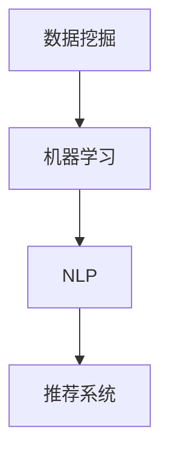
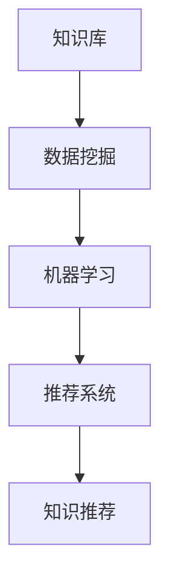

                 

# 程序员利用知识发现引擎提高创新能力

> 关键词：知识发现引擎,创新能力,编程技术,人工智能,数据挖掘

## 1. 背景介绍

在当今快速发展的技术环境中，程序员需要不断学习新技能和新技术以保持竞争力。然而，由于新技术层出不穷，程序员经常面临如何快速掌握新知识，并将其应用到实际项目中的挑战。知识发现引擎(Knowledge Discovery Engine, KDE)作为一种新兴的智能工具，可以通过挖掘和学习海量知识库中的信息，为程序员提供个性化的知识推荐和辅助，从而大幅提高其创新能力和工作效率。本文将深入探讨知识发现引擎的基本原理、操作步骤、优缺点和应用领域，并提供实际的项目实践和数学模型解释。

## 2. 核心概念与联系

### 2.1 核心概念概述

知识发现引擎是一种利用人工智能和数据挖掘技术，从大规模知识库中提取、分类、归纳和概括有用信息，并将其转化为可操作的知识的工具。通过知识发现引擎，程序员可以快速获取相关领域的最新技术和趋势，理解不同技术之间的联系，并将其应用到实际的编程实践中。

### 2.2 核心概念联系

知识发现引擎主要包括以下几个关键组件和技术：

1. **数据挖掘**：从原始数据中提取有用信息和模式，是知识发现的基础。
2. **机器学习**：利用机器学习算法，对提取的信息进行分类、归纳和预测。
3. **自然语言处理(NLP)**：处理和理解文本信息，进行知识抽取和整合。
4. **推荐系统**：根据程序员的兴趣和需求，推荐相关的技术、工具和资源。

这些组件和技术之间的联系可以通过以下Mermaid流程图来展示：



通过这个流程，知识发现引擎能够从大规模知识库中挖掘出有用的信息，并通过机器学习和NLP技术进行处理和分类，最终通过推荐系统将知识推荐给程序员，帮助其提升创新能力。

## 3. 核心算法原理 & 具体操作步骤

### 3.1 算法原理概述

知识发现引擎的核心算法包括数据挖掘算法、机器学习算法和推荐算法。其基本工作原理如下：

1. **数据挖掘算法**：从知识库中提取有用的信息和技术趋势，如图谱、趋势报告等。
2. **机器学习算法**：对提取的信息进行分类、聚类和预测，形成更结构化的知识。
3. **推荐算法**：根据程序员的兴趣和需求，推荐相关的知识和技术。

知识发现引擎的总体流程如图：



### 3.2 算法步骤详解

知识发现引擎的具体操作步骤包括以下几个关键步骤：

1. **数据准备**：收集和整理知识库中的数据，如学术论文、技术文档、博客文章等。
2. **特征提取**：从文本中提取关键词、技术术语等特征，进行结构化处理。
3. **模型训练**：使用机器学习算法对提取的特征进行训练，建立分类、聚类和推荐模型。
4. **知识分类**：对模型输出的结果进行分类和归纳，形成更有意义的知识结构。
5. **知识推荐**：根据程序员的兴趣和需求，使用推荐算法推荐相关知识。

### 3.3 算法优缺点

知识发现引擎具有以下优点：

1. **高效性**：能够快速从大规模知识库中挖掘和推荐有用的信息。
2. **个性化**：根据程序员的兴趣和需求，提供个性化的知识推荐。
3. **广泛性**：覆盖多种技术领域，适用于不同背景和经验水平的程序员。

同时，知识发现引擎也存在一些缺点：

1. **数据质量依赖**：数据挖掘和分类结果的质量高度依赖于知识库的质量。
2. **技术门槛较高**：需要一定的数据挖掘和机器学习知识。
3. **推荐精度有限**：由于模型和数据的复杂性，推荐结果可能不够精确。

### 3.4 算法应用领域

知识发现引擎的应用领域包括但不限于以下几个方面：

1. **技术趋势分析**：分析特定技术领域的最新趋势和热点，帮助程序员了解行业动态。
2. **技能提升**：根据程序员的兴趣和需求，推荐相关技术文档、视频教程和项目案例，帮助其提升技能。
3. **项目推荐**：根据程序员的技术水平和经验，推荐适合的开源项目和案例，促进学习和实践。
4. **问题解答**：利用知识库中的信息，解答程序员在工作中遇到的技术问题，提高问题解决效率。

## 4. 数学模型和公式 & 详细讲解

### 4.1 数学模型构建

知识发现引擎的核心模型通常包括分类模型、聚类模型和推荐模型。这里以分类模型为例，构建数学模型。

假设知识库中的每个文档可以用特征向量 $\mathbf{x} = (x_1, x_2, ..., x_n)$ 表示，其中 $x_i$ 为第 $i$ 个特征。分类模型的目标是学习一个分类函数 $f(\mathbf{x})$，将文档分为 $K$ 个类别。

### 4.2 公式推导过程

以朴素贝叶斯分类器为例，推导其分类函数的公式：

$$
P(y_i|\mathbf{x}) = \frac{P(y_i)P(\mathbf{x}|y_i)}{\sum_{j=1}^KP(y_j)P(\mathbf{x}|y_j)}
$$

其中 $P(y_i)$ 为类别 $i$ 的概率，$P(\mathbf{x}|y_i)$ 为在类别 $i$ 下，特征向量 $\mathbf{x}$ 的概率，$P(y_j)$ 和 $P(\mathbf{x}|y_j)$ 同理。

### 4.3 案例分析与讲解

假设有一个程序员正在学习Python编程，可以通过知识发现引擎获取相关领域的知识：

1. **数据准备**：从知识库中收集Python相关的学术论文、技术博客和项目案例。
2. **特征提取**：提取每个文档中的关键词和技术术语，如Python、Pandas、NumPy等。
3. **模型训练**：使用朴素贝叶斯分类器对提取的特征进行训练，分类标签为Python编程相关的技术类别。
4. **知识推荐**：根据程序员的学习需求，推荐相关的高质量技术文档和案例。

## 5. 项目实践：代码实例和详细解释说明

### 5.1 开发环境搭建

1. 安装Python和Jupyter Notebook。
2. 安装必要的机器学习库，如Scikit-Learn、Pandas、TensorFlow等。
3. 收集和整理知识库中的数据。

### 5.2 源代码详细实现

下面以Python编程相关知识为例，给出知识发现引擎的代码实现。

```python
from sklearn.feature_extraction.text import TfidfVectorizer
from sklearn.naive_bayes import MultinomialNB
from sklearn.pipeline import Pipeline

# 数据准备
docs = [
    "Python是一种高级编程语言",
    "Pandas是Python中常用的数据处理库",
    "NumPy是Python中常用的数值计算库",
    "Flask是一个Python Web框架"
]
labels = ["Python编程", "数据处理", "数值计算", "Web开发"]

# 特征提取
vectorizer = TfidfVectorizer()
X = vectorizer.fit_transform(docs)

# 模型训练
model = MultinomialNB()
model.fit(X, labels)

# 知识推荐
query = "学习Python编程"
query_vec = vectorizer.transform([query])
predicted_label = model.predict(query_vec)
print(predicted_label)
```

### 5.3 代码解读与分析

上述代码中，我们首先准备了Python相关的文档和标签，然后使用TfidfVectorizer进行特征提取，将文档转换为向量表示。接着，使用MultinomialNB对提取的特征进行分类训练，得到一个分类模型。最后，输入一个新的查询，使用分类模型进行预测，输出预测的类别。

这个示例展示了知识发现引擎的基本流程：数据准备、特征提取、模型训练和知识推荐。实际应用中，可以根据具体需求进行更复杂的操作和优化。

### 5.4 运行结果展示

运行上述代码，输出预测的类别为 "Python编程"，表明知识发现引擎能够根据查询推荐相关的技术类别。

## 6. 实际应用场景

### 6.1 技术趋势分析

知识发现引擎可以分析特定技术领域的最新趋势和热点，帮助程序员了解行业动态。例如，在机器学习领域，知识发现引擎可以分析最近的研究论文和技术博客，推荐最新的算法和框架。

### 6.2 技能提升

根据程序员的兴趣和需求，知识发现引擎可以推荐相关的技术文档、视频教程和项目案例，帮助其提升技能。例如，一个希望学习深度学习的程序员，可以获取最新的深度学习论文、在线课程和实践案例，加速学习过程。

### 6.3 项目推荐

知识发现引擎可以根据程序员的技术水平和经验，推荐适合的开源项目和案例，促进学习和实践。例如，一个有基础的Python程序员，可以获取合适的项目和案例，进行实际的编程练习。

### 6.4 问题解答

利用知识库中的信息，知识发现引擎可以解答程序员在工作中遇到的技术问题，提高问题解决效率。例如，一个遇到算法优化问题的程序员，可以获取相关的优化技巧和解决方案，快速解决问题。

## 7. 工具和资源推荐

### 7.1 学习资源推荐

1. 《数据挖掘与统计学习》（JSTOR）：涵盖了数据挖掘、机器学习和推荐系统的基本概念和方法。
2. Kaggle：全球最大的数据科学竞赛平台，提供大量数据集和实际项目，适合学习和实践。
3. Coursera：提供多门数据挖掘和机器学习课程，由知名大学和专家授课。
4. TensorFlow官网：提供丰富的机器学习资源和示例代码，适合深入学习。

### 7.2 开发工具推荐

1. Jupyter Notebook：开源的交互式编程环境，适合快速原型开发和实验。
2. GitHub：全球最大的代码托管平台，提供丰富的开源项目和社区支持。
3. VSCode：轻量级的代码编辑器，支持多种编程语言和插件。
4. PyCharm：专业的Python开发工具，提供代码自动补全、调试等功能。

### 7.3 相关论文推荐

1. Guha, S., Rastogi, R., & Shim, K. (2000). Cure: An efficient clustering algorithm for large databases. In International Conference on Very Large Data Bases (ICVLD) (pp. 2-12).
2. Li, F., & Han, J. (2005). Mining sequential patterns: Usual and unusual patterns. In International Conference on Knowledge Discovery and Data Mining (pp. 451-460).
3. Koren, Y., & Bell, K. G. (2009). Matrix factorization techniques for recommender systems. Computer, 42(8), 30-37.
4. He, D., & Manning, C. D. (2018). Neural topic models. IEEE Transactions on Knowledge and Data Engineering, 30(8), 1838-1851.

## 8. 总结：未来发展趋势与挑战

### 8.1 研究成果总结

本文详细介绍了知识发现引擎的基本原理、操作步骤和实际应用，通过代码实例和数学模型解释了知识发现引擎的实现过程。通过实践，程序员可以利用知识发现引擎提高创新能力，加速学习和实践。

### 8.2 未来发展趋势

未来，知识发现引擎将朝着以下几个方向发展：

1. **深度学习**：引入深度学习模型，提升特征提取和分类效果。
2. **多模态学习**：结合文本、图像和音频等多模态信息，提供更加全面的知识推荐。
3. **实时推荐**：利用流式处理技术，实现实时知识推荐。
4. **跨领域应用**：扩展到更多领域，如金融、医疗等，提供跨领域知识推荐。
5. **自适应学习**：根据程序员的学习进度和反馈，动态调整推荐策略。

### 8.3 面临的挑战

尽管知识发现引擎在提升程序员创新能力方面具有巨大潜力，但仍面临以下挑战：

1. **数据质量**：知识库中的数据质量直接影响挖掘和推荐效果。
2. **技术复杂度**：需要一定的数据挖掘和机器学习知识，对程序员的技术水平要求较高。
3. **资源消耗**：知识发现引擎的训练和推理需要大量的计算资源。
4. **隐私保护**：知识发现引擎需要处理大量的个人数据，隐私保护问题不容忽视。

### 8.4 研究展望

未来，知识发现引擎的研究将朝着以下几个方向进行：

1. **自动化数据清洗**：自动清洗和处理数据，提高数据质量。
2. **自适应推荐算法**：根据程序员的学习进度和反馈，动态调整推荐策略。
3. **跨领域知识融合**：结合多种领域知识，提供更加全面的知识推荐。
4. **模型可解释性**：提升模型的可解释性，帮助程序员理解推荐结果的逻辑。

知识发现引擎在提升程序员创新能力方面具有广阔的前景。未来，随着技术的不断进步，知识发现引擎将更加智能和普适，为程序员提供更优质的知识服务和辅助。

## 9. 附录：常见问题与解答

**Q1：知识发现引擎是否适用于所有技术领域？**

A: 知识发现引擎可以应用于大多数技术领域，但其效果依赖于知识库的质量和覆盖范围。对于一些专业性和领域性较强的领域，需要特定的知识库和模型进行定制化开发。

**Q2：知识发现引擎的推荐结果是否准确？**

A: 知识发现引擎的推荐结果依赖于模型和数据的质量。通过不断优化模型和数据，可以提高推荐结果的准确性。

**Q3：知识发现引擎如何保证推荐结果的个性化？**

A: 知识发现引擎通常使用协同过滤、内容推荐等技术，根据程序员的兴趣和需求，推荐相关的知识和资源。

**Q4：知识发现引擎的开发和维护成本是否较高？**

A: 知识发现引擎的开发和维护需要一定的技术储备和资源投入，但其对程序员的创新能力和效率提升具有显著效果。

**Q5：知识发现引擎如何处理隐私问题？**

A: 知识发现引擎需要采用数据脱敏、隐私保护等技术，保护程序员的隐私和数据安全。

