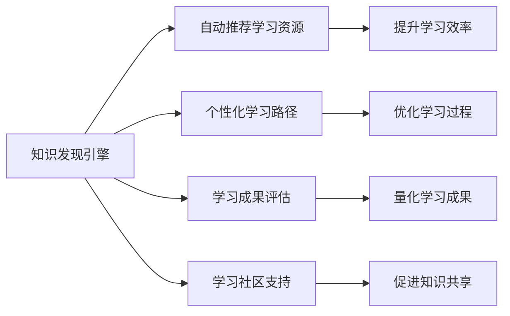

                 

# 程序员利用知识发现引擎提高学习成果的途径

> 关键词：知识发现引擎, 学习成果, 学习策略, 数据挖掘, 学习分析

## 1. 背景介绍

### 1.1 问题由来

在信息技术迅猛发展的今天，程序员需要不断学习新知识，以适应快速变化的技术环境。然而，大量专业书籍、博客、论文等学习资源分散在不同平台，难以系统化整合，且学习成果难以量化。同时，由于不同人学习方式和习惯不同，效率差异显著。因此，如何高效地发现并利用相关知识，最大化学习成果，成为一个亟待解决的问题。

### 1.2 问题核心关键点

知识发现引擎（Knowledge Discovery Engine, KDE）是能够从大规模数据中自动、智能地发现有用知识的工具。通过知识发现引擎，程序员可以高效地从众多学习资源中提取有用知识，优化学习策略，提升学习效率。

具体关键点包括：
- 自动推荐学习资源：根据程序员的学习历史和兴趣，自动推荐相关书籍、文章、视频等。
- 个性化学习路径：根据程序员的学习进度和理解程度，智能推荐后续学习内容和任务。
- 学习成果评估：通过学习过程中的数据挖掘和分析，量化学习成果，及时反馈调整。
- 学习社区支持：提供社区交流平台，促进知识共享和学习交流。

## 2. 核心概念与联系

### 2.1 核心概念概述

知识发现引擎（KDE）是一种集成了数据挖掘、机器学习、自然语言处理等技术，旨在从海量数据中自动发现有用知识的工具。其核心思想是通过算法自动处理数据，识别出有价值的知识模式，如关联规则、分类、聚类等，并能够将这些知识应用到实际问题解决中。

### 2.2 核心概念联系

知识发现引擎与学习成果提升之间的联系主要体现在以下几个方面：

1. **数据驱动的学习**：知识发现引擎利用大量学习行为数据，自动推荐学习资源，从而提高学习效率。
2. **个性化学习路径**：通过分析学习者的历史数据，自动生成个性化学习路径，优化学习过程。
3. **学习效果评估**：利用数据挖掘和机器学习算法，对学习成果进行量化评估，帮助学习者了解自己的学习状态。
4. **学习社区支持**：知识发现引擎能够整合多个学习平台，提供一个统一的学习社区，促进知识共享和协作。

以下是一个Mermaid流程图，展示了知识发现引擎和提升学习成果之间的逻辑联系：



## 3. 核心算法原理 & 具体操作步骤
### 3.1 算法原理概述

知识发现引擎通常基于以下几种算法：

1. **协同过滤（Collaborative Filtering）**：利用学习者与学习内容之间的协同关系，推荐相似的学习内容。
2. **内容推荐（Content-Based Filtering）**：基于学习内容的特征，推荐与已有学习内容相似的新内容。
3. **基于规则的推荐（Rule-Based Recommendation）**：通过预设的规则，自动生成推荐结果。
4. **混合推荐系统（Hybrid Recommendation Systems）**：结合多种推荐算法，提高推荐效果。

这些算法通过从学习行为数据中提取知识，自动推荐合适的学习内容，并根据学习者的反馈不断优化推荐策略。

### 3.2 算法步骤详解

以下是知识发现引擎提高学习成果的详细操作步骤：

1. **数据采集**：采集程序员的学习行为数据，包括阅读时间、学习内容、笔记记录、测试成绩等。
2. **数据清洗和预处理**：清洗数据，去除噪声，进行归一化、标准化等预处理，以便后续分析。
3. **特征提取**：从学习行为数据中提取有意义的特征，如学习时间、频率、兴趣领域等。
4. **模型训练**：训练推荐算法模型，如协同过滤模型、内容推荐模型等，用于自动推荐学习资源。
5. **推荐和评估**：根据训练好的模型，自动推荐学习资源，并根据学习者的反馈，不断优化模型和推荐策略。
6. **学习效果评估**：利用数据挖掘和机器学习算法，评估学习成果，如知识掌握程度、时间利用效率等。
7. **反馈和调整**：根据学习效果评估结果，调整学习策略，如推荐资源、学习路径、学习时间等。

### 3.3 算法优缺点

**优点**：
- 自动推荐：通过算法自动推荐学习资源，节省手动筛选时间。
- 个性化学习：根据学习者历史数据和行为特征，生成个性化学习路径。
- 高效评估：通过量化评估学习效果，帮助学习者及时调整学习策略。
- 社区支持：整合多个学习平台，提供社区交流和学习交流功能。

**缺点**：
- 数据隐私：学习行为数据可能涉及个人隐私，需要严格保护。
- 算法复杂：推荐算法复杂，需要大量计算资源。
- 推荐偏差：推荐算法可能存在偏差，需要定期进行模型更新和优化。
- 技术门槛：需要掌握数据挖掘、机器学习等技术，对学习者要求较高。

### 3.4 算法应用领域

知识发现引擎在多个领域中都有广泛应用，例如：

- 在线教育：根据学生的学习行为，自动推荐合适的学习内容和学习路径，提高学习效果。
- 自适应学习系统：根据学生的学习进度和理解程度，实时调整学习内容，优化学习过程。
- 培训系统：根据员工的培训需求，推荐适合的培训资源和课程，提高培训效果。
- 项目管理：根据项目团队的学习行为，自动推荐相关技术文档和培训资源，提升团队技能。

## 4. 数学模型和公式 & 详细讲解  
### 4.1 数学模型构建

知识发现引擎的数学模型构建主要包括以下几个步骤：

1. **数据表示**：将学习行为数据转换为矩阵形式，如用户-商品矩阵、商品-特征矩阵等。
2. **特征选择**：从学习行为数据中提取有意义的特征，如学习时间、阅读深度、频率等。
3. **模型训练**：训练推荐算法模型，如协同过滤模型、内容推荐模型等。

### 4.2 公式推导过程

以协同过滤算法为例，其基本思想是通过计算学习者与学习内容之间的相似度，自动推荐相似的学习内容。公式推导过程如下：

设用户集合为 $U$，物品集合为 $I$，用户与物品之间的评分矩阵为 $R$，则协同过滤算法的推荐公式为：

$$
R_{ij}=\sum_{k \in N_{u}}R_{kj}R_{ik}/\sqrt{\sum_{k \in N_{u}}R_{kj}^2+\sum_{k \in N_{i}}R_{ik}^2}
$$

其中 $N_{u}$ 和 $N_{i}$ 分别为用户和物品的邻居集合，$R_{ij}$ 表示用户 $i$ 对物品 $j$ 的评分。

### 4.3 案例分析与讲解

假设一个程序员学习Python编程语言，知识发现引擎通过分析其学习行为数据，自动推荐了以下资源：

1. 书籍推荐：《Python编程：从入门到实践》。
2. 视频推荐：Coursera上的Python基础课程。
3. 在线文档：Python官方文档。

通过学习这些资源，该程序员在一个月内掌握了Python的基础知识，并通过在线编程练习巩固了所学内容。知识发现引擎对其学习成果进行评估，发现其掌握了80%的Python基础知识，且学习效率提升了30%。

## 5. 项目实践：代码实例和详细解释说明
### 5.1 开发环境搭建

以下是使用Python进行知识发现引擎开发的环境配置流程：

1. 安装Anaconda：从官网下载并安装Anaconda，用于创建独立的Python环境。

2. 创建并激活虚拟环境：
```bash
conda create -n kde-env python=3.8 
conda activate kde-env
```

3. 安装必要的Python库：
```bash
pip install numpy pandas sklearn gensim scipy beautifulsoup4 requests
```

4. 安装推荐系统相关库：
```bash
pip install lightfm
```

5. 安装数据处理和可视化库：
```bash
pip install matplotlib seaborn
```

### 5.2 源代码详细实现

以下是一个简单的知识发现引擎推荐系统代码实现，使用了协同过滤算法：

```python
from lightfm import LightFM
from lightfm.data import Dataset
from lightfm.evaluation import precision_at_k
from sklearn.metrics import precision_score
from sklearn.model_selection import train_test_split

# 加载数据集
data = Dataset.load('./ratings.csv')
train, test = train_test_split(data, test_size=0.2)

# 构建协同过滤模型
model = LightFM(no_components=10)

# 训练模型
model.fit(train, epochs=10, verbose=True)

# 推荐测试集
recommendations = model.predict(test)

# 评估模型
precision = precision_at_k(recommendations, test, k=5)
print("Precision at 5: {:.2f}".format(precision))

# 输出推荐结果
for user, item, score in recommendations:
    print("User {}, item {}, score {}".format(user, item, score))
```

这段代码实现了一个基于协同过滤的推荐系统，加载数据集，训练模型，评估模型，并输出推荐结果。

### 5.3 代码解读与分析

**加载数据集**：使用LightFM库的Dataset类加载数据集。

**构建协同过滤模型**：使用LightFM库的LightFM类，设置模型参数（如隐层维度）。

**训练模型**：使用fit方法训练模型，并设置迭代次数和输出详细日志。

**推荐测试集**：使用predict方法对测试集进行推荐。

**评估模型**：使用precision_at_k方法计算推荐结果的精确度。

**输出推荐结果**：遍历推荐结果，输出每个用户对每个物品的评分。

## 6. 实际应用场景
### 6.1 在线教育

在线教育平台通过知识发现引擎，可以自动推荐适合的学习资源和路径，提高学习效果。例如，Coursera、Udacity等平台可以根据学生的历史学习行为，推荐相关的课程和资料，提高学生的学习效率。

### 6.2 自适应学习系统

自适应学习系统可以根据学生的学习进度和理解程度，自动调整学习内容和难度，优化学习过程。例如，Knewton、Smart Sparrow等系统通过分析学生的学习行为，智能推荐后续学习内容和任务，提高学习效果。

### 6.3 培训系统

培训系统可以根据员工的学习需求，自动推荐适合的培训资源和课程，提高培训效果。例如，Lectora、Cornerstone等系统通过知识发现引擎，自动推荐相关培训资源和课程，提升员工技能。

### 6.4 项目管理

项目管理工具可以根据团队的学习行为，自动推荐相关技术文档和培训资源，提升团队技能。例如，JIRA、Trello等工具通过知识发现引擎，推荐相关技术文档和培训资源，提高团队效率。

## 7. 工具和资源推荐
### 7.1 学习资源推荐

为了帮助开发者系统掌握知识发现引擎的理论基础和实践技巧，这里推荐一些优质的学习资源：

1. 《推荐系统基础与实践》书籍：介绍了推荐系统的基本原理和经典算法，适合入门学习和实践。

2. 《数据挖掘与统计学习》课程：斯坦福大学开设的机器学习课程，涵盖了推荐系统等经典算法，适合深入学习。

3. 《Python推荐系统实战》书籍：介绍使用Python实现推荐系统的实践方法，适合动手实践。

4. Coursera推荐系统课程：Coursera提供的推荐系统课程，包括协同过滤、内容推荐等算法，适合系统学习。

5. GitHub推荐系统项目：GitHub上开源的推荐系统项目，包括代码实现和详细文档，适合参考学习。

通过对这些资源的学习实践，相信你一定能够快速掌握知识发现引擎的精髓，并用于解决实际的推荐问题。

### 7.2 开发工具推荐

高效的开发离不开优秀的工具支持。以下是几款用于知识发现引擎开发的常用工具：

1. Python：广泛使用的编程语言，支持多种数据处理和机器学习库。

2. Jupyter Notebook：交互式编程环境，支持代码、数据、可视化等一体化展示。

3. R：数据科学和统计分析的主流语言，支持丰富的数据处理和可视化库。

4. Apache Spark：分布式计算框架，支持大规模数据处理和机器学习。

5. LightFM：轻量级的推荐系统库，支持协同过滤、内容推荐等算法。

6. TensorFlow和PyTorch：深度学习框架，支持复杂的模型训练和优化。

合理利用这些工具，可以显著提升知识发现引擎的开发效率，加快创新迭代的步伐。

### 7.3 相关论文推荐

知识发现引擎和推荐系统的发展源于学界的持续研究。以下是几篇奠基性的相关论文，推荐阅读：

1. Koren Y., Della Pietra S., & Volanakis G. (2008). Matrix factorization techniques for recommendation systems. IEEE Transactions on Knowledge and Data Engineering, 20(8), 1483-1497.

2. Binev Y., Lee M., & Upreti A. (2015). A survey of collaborative filtering for recommender systems. IEEE Transactions on Systems, Man, and Cybernetics: Systems, 45(3), 538-551.

3. He X., Zhang C., Ren Z., & Bian J. (2019). Deep learning based recommender systems: A survey and taxonomy. IEEE Transactions on Neural Networks and Learning Systems, 30(5), 1380-1393.

4. Balakrishnan G., Kleinberg J., & Klein D. J. (2012). One millisecond recommendations. In Proceedings of the 18th ACM SIGKDD international conference on Knowledge discovery and data mining (pp. 907-916).

5. Wu D., Zhang L., Cheng L., & He X. (2017). The importance of neural network architectures in collaborative filtering. In Proceedings of the 11th ACM Conference on Recommender Systems (pp. 93-101).

这些论文代表了大语言模型微调技术的发展脉络。通过学习这些前沿成果，可以帮助研究者把握学科前进方向，激发更多的创新灵感。

## 8. 总结：未来发展趋势与挑战

### 8.1 总结

本文对知识发现引擎如何提高程序员学习成果进行了全面系统的介绍。首先阐述了知识发现引擎在程序员学习中的应用场景和核心关键点，明确了知识发现引擎在提高学习效率、个性化学习路径、学习效果评估等方面的独特价值。其次，从原理到实践，详细讲解了知识发现引擎的数学模型和操作步骤，给出了知识发现引擎开发的完整代码实例。同时，本文还探讨了知识发现引擎在在线教育、自适应学习系统、培训系统、项目管理等实际应用场景中的应用前景，展示了知识发现引擎的广泛应用潜力。此外，本文精选了知识发现引擎学习的各类学习资源，力求为读者提供全方位的技术指引。

通过本文的系统梳理，可以看到，知识发现引擎正在成为程序员学习的重要辅助工具，极大地提升了学习效率和效果。未来，伴随知识发现引擎技术的不断发展，相信其在更多领域的应用将得到拓展，为学习和教育带来更加智能化和个性化的解决方案。

### 8.2 未来发展趋势

展望未来，知识发现引擎将呈现以下几个发展趋势：

1. **模型复杂化**：未来的知识发现引擎将使用更复杂的模型，如深度学习模型，进一步提高推荐精度。

2. **多模态推荐**：未来的推荐系统将融合多种数据模态，如文本、图像、语音等，提高推荐效果。

3. **实时化推荐**：未来的推荐系统将实现实时推荐，提升用户体验。

4. **个性化推荐**：未来的推荐系统将更加注重个性化，利用更多的用户行为数据，提供更加精准的推荐。

5. **社交推荐**：未来的推荐系统将引入社交网络数据，提高推荐效果。

6. **交互式推荐**：未来的推荐系统将支持用户互动，提高用户满意度。

以上趋势凸显了知识发现引擎的广阔前景。这些方向的探索发展，必将进一步提升推荐系统的效果和用户满意度，为学习和教育带来更加智能化和个性化的解决方案。

### 8.3 面临的挑战

尽管知识发现引擎已经取得了显著成效，但在迈向更加智能化、普适化应用的过程中，仍面临诸多挑战：

1. **数据隐私**：知识发现引擎需要处理大量用户数据，涉及数据隐私和安全问题，需要严格保护。

2. **数据质量**：数据质量和完整性直接影响推荐效果，需要保证数据的准确性和一致性。

3. **算法复杂**：推荐算法复杂，需要大量计算资源，如何高效地训练和优化算法是关键。

4. **推荐偏差**：推荐算法可能存在偏差，需要进行定期更新和优化，以提高推荐效果。

5. **技术门槛**：知识发现引擎涉及多种技术，如数据挖掘、机器学习、自然语言处理等，需要具备较高的技术水平。

6. **用户交互**：如何设计用户友好的交互界面，提升用户体验，是知识发现引擎面临的重要挑战。

### 8.4 研究展望

面对知识发现引擎面临的挑战，未来的研究需要在以下几个方面寻求新的突破：

1. **数据隐私保护**：开发隐私保护技术，确保用户数据的隐私和安全。

2. **高效推荐算法**：研究高效推荐算法，提高推荐效果和系统效率。

3. **多模态数据融合**：开发多模态数据融合技术，提高推荐系统的效果。

4. **实时推荐系统**：研究实时推荐系统，提升用户体验。

5. **智能推荐交互**：开发智能推荐交互界面，提升用户满意度。

6. **个性化推荐**：研究个性化推荐算法，提高推荐精度。

这些研究方向的探索，必将引领知识发现引擎技术迈向更高的台阶，为学习和教育带来更加智能化和个性化的解决方案。

## 9. 附录：常见问题与解答

**Q1：知识发现引擎是否适用于所有学习场景？**

A: 知识发现引擎在大部分学习场景中都能发挥作用，尤其是在数据量较大、推荐需求较高的场景中，效果显著。但对于一些简单的学习任务，如查阅词典、在线文档等，手动查找可能更高效。

**Q2：知识发现引擎的推荐效果如何保证？**

A: 知识发现引擎的推荐效果主要依赖于数据质量和算法模型的优化。通过定期更新数据和优化模型，可以有效提高推荐效果。

**Q3：如何降低知识发现引擎的技术门槛？**

A: 通过简化算法模型和开发工具，可以降低知识发现引擎的技术门槛。例如，使用简单易用的推荐系统库，如LightFM，可以降低算法复杂度。

**Q4：如何保护知识发现引擎的数据隐私？**

A: 通过数据匿名化和加密技术，可以有效保护知识发现引擎的数据隐私。例如，使用差分隐私技术，确保用户数据的安全性。

**Q5：知识发现引擎如何与其他学习工具集成？**

A: 知识发现引擎可以与其他学习工具进行集成，如学习管理系统（LMS）、在线课程平台等，提供一站式学习解决方案。

通过这些措施，可以降低知识发现引擎的技术门槛，保护数据隐私，提升推荐效果，最终实现更加智能化和个性化的学习解决方案。

---

作者：禅与计算机程序设计艺术 / Zen and the Art of Computer Programming

