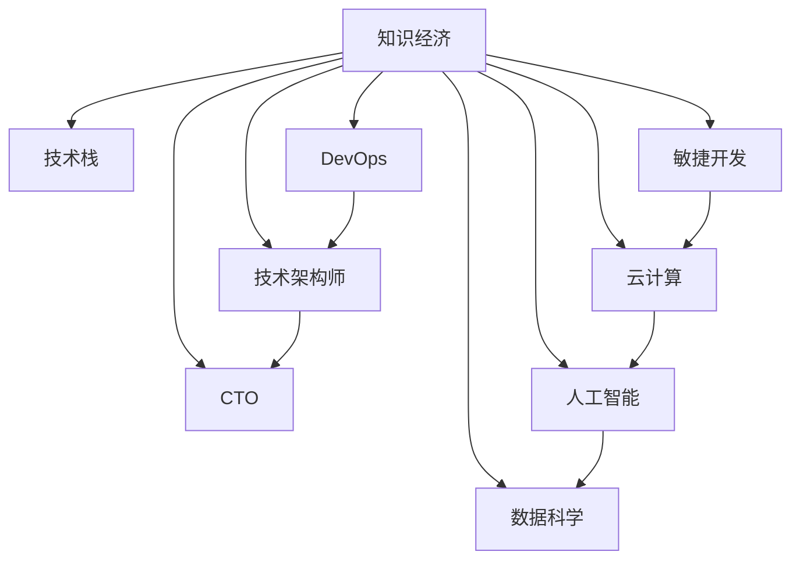

                 

# 程序员在知识经济时代的角色定位

## 1. 背景介绍

### 1.1 问题由来

随着知识经济时代的到来，编程不再只是计算机科学领域的专业技能，而是成为各行各业获取竞争力的重要手段。技术的快速迭代、业务模式的多样化，使得程序员需要不断学习和掌握新的技能，以满足不断变化的需求。程序员的角色定位，已经从传统的代码编写者，转变为技术架构师、软件架构师、CTO等高级技术决策者。本文将探讨在知识经济时代，程序员的角色定位、技能需求及未来发展方向。

### 1.2 问题核心关键点

程序员的角色定位涉及到技术技能、团队协作、项目管理和商业理解等多方面内容。在知识经济时代，程序员不仅需要掌握编程语言和技术栈，还要具备跨学科知识、沟通能力、问题解决能力等多维能力。如何在这场技术与商业的融合中，找到自己的定位，实现个人和职业的持续发展，是每个程序员需要深思的问题。

### 1.3 问题研究意义

明确程序员在知识经济时代的角色定位，对于个人职业规划、企业人才培养和行业发展都具有重要意义：

1. **个人职业发展**：帮助程序员找到适合自己的职业路径，提升技术能力和综合素质，实现职业目标。
2. **企业人才管理**：指导企业如何选拔、培养和激励技术人才，确保团队的高效协作和持续创新。
3. **行业发展趋势**：提供行业洞察，帮助企业把握技术趋势，制定适应市场变化的发展策略。

## 2. 核心概念与联系

### 2.1 核心概念概述

- **知识经济**：基于知识和信息而非传统自然资源和劳动力成为主要生产力的经济形态。
- **技术栈**：不同技术工具和语言的组合，用于解决特定问题。
- **技术架构师**：负责设计和管理复杂系统架构，确保系统的可靠性、可扩展性和可维护性。
- **CTO**：负责技术战略和决策，驱动企业技术创新和业务发展。
- **敏捷开发**：一种灵活、迭代的软件开发方法，强调快速响应变化、团队协作和持续交付。
- **DevOps**：结合开发（Development）和运维（Operations）的实践，促进自动化和持续集成/持续交付（CI/CD）。
- **云计算**：基于互联网提供计算资源和服务的模式，支持大规模、弹性的应用部署和运营。
- **人工智能**：通过模拟人类智能过程，实现智能决策、自动化处理等能力。
- **数据科学**：利用数据和技术手段，进行数据分析和模型训练，支持业务决策和优化。

这些核心概念构成了知识经济时代程序员工作的基础，它们之间的逻辑关系可以通过以下Mermaid流程图来展示：



这个流程图展示出程序员在知识经济时代的多维角色定位及其相互关系：

1. **技术栈**是程序员工作的工具基础。
2. **技术架构师**负责设计和管理系统架构，确保技术实现和商业需求的对齐。
3. **CTO**从技术战略角度驱动企业创新。
4. **敏捷开发**和**DevOps**促进团队协作和持续交付。
5. **云计算**和**人工智能**为技术实现提供了基础设施和工具。
6. **数据科学**通过数据分析支持业务决策和优化。

## 3. 核心算法原理 & 具体操作步骤

### 3.1 算法原理概述

在知识经济时代，程序员的角色定位不仅仅局限于代码编写，而是要综合运用技术、商业和管理等多方面的知识和技能，以实现技术创新和商业价值最大化。核心算法原理包括以下几个方面：

1. **技术栈选择**：根据项目需求选择合适的技术栈，包括编程语言、框架、库等。
2. **系统架构设计**：设计合理的系统架构，确保系统的可扩展性、可维护性和性能。
3. **敏捷开发方法**：采用敏捷开发方法和工具，实现快速迭代和持续交付。
4. **DevOps实践**：结合DevOps实践，实现自动化部署、持续集成和持续交付。
5. **数据驱动决策**：利用数据科学方法进行数据分析和模型训练，支持业务决策。
6. **人工智能应用**：在业务场景中引入人工智能技术，提升决策和处理效率。
7. **商业理解**：理解和应用商业知识，实现技术与商业的深度结合。

### 3.2 算法步骤详解

以下是知识经济时代程序员在角色定位上的具体操作步骤：

1. **需求分析和调研**：深入理解业务需求，进行技术调研，选择合适的技术栈和工具。
2. **系统架构设计**：设计合理的系统架构，包括模块划分、接口定义、数据流等。
3. **技术选型与实现**：根据架构设计，选择合适的技术栈和工具，实现系统功能。
4. **敏捷开发实践**：采用敏捷开发方法和工具，进行快速迭代和持续交付。
5. **DevOps实践**：实现自动化部署、持续集成和持续交付，提升开发效率和系统稳定性。
6. **数据驱动决策**：利用数据科学方法进行数据分析和模型训练，支持业务决策。
7. **人工智能应用**：在业务场景中引入人工智能技术，提升处理效率和决策能力。
8. **商业理解与应用**：理解商业需求，将技术解决方案应用于实际业务场景，实现技术价值最大化。

### 3.3 算法优缺点

知识经济时代程序员的角色定位具有以下优点：

1. **技术深度与广度**：掌握多种技术栈和工具，具备跨学科知识，提高技术实现能力。
2. **项目管理和协作**：具备项目管理和团队协作能力，确保项目顺利进行。
3. **商业理解与应用**：具备商业理解能力，将技术解决方案应用于实际业务场景，实现技术价值最大化。

同时，也存在一些缺点：

1. **技术栈复杂**：需要掌握多种技术栈和工具，学习曲线较陡。
2. **多任务处理**：需要同时处理多个项目，容易分散精力。
3. **知识更新**：技术快速迭代，需要不断学习和适应新技术。

### 3.4 算法应用领域

程序员的角色定位广泛应用于多个领域，如软件开发、云计算、人工智能、数据科学、商业智能等。以下是几个典型的应用场景：

- **软件开发**：程序员通过设计和管理系统架构，实现复杂的软件系统。
- **云计算**：程序员设计和管理云平台架构，实现云应用的部署和运营。
- **人工智能**：程序员设计和实现人工智能模型，进行智能决策和自动化处理。
- **数据科学**：程序员进行数据处理和模型训练，支持业务决策和优化。
- **商业智能**：程序员开发商业智能系统，实现业务数据的分析和可视化。

## 4. 数学模型和公式 & 详细讲解 & 举例说明

### 4.1 数学模型构建

知识经济时代的程序员角色定位涉及多个学科的知识和技能，可以通过数学模型来描述。以下是几个典型的数学模型：

- **技术栈选择模型**：基于项目需求和现有技术栈，选择合适的技术栈。
  - 模型公式：$T = f(D, A)$
    - 解释：$T$表示技术栈，$D$表示项目需求，$A$表示现有技术栈。
- **系统架构设计模型**：设计合理的系统架构，包括模块划分、接口定义、数据流等。
  - 模型公式：$A = g(D, B)$
    - 解释：$A$表示系统架构，$D$表示项目需求，$B$表示商业目标。
- **敏捷开发模型**：采用敏捷开发方法和工具，进行快速迭代和持续交付。
  - 模型公式：$P = h(D, C)$
    - 解释：$P$表示项目进度，$D$表示项目需求，$C$表示团队协作。

### 4.2 公式推导过程

以下是几个典型数学模型的推导过程：

**技术栈选择模型推导**：

$$
T = f(D, A) = A + (D - A)
$$

- 解释：现有技术栈 $A$ 与项目需求 $D$ 的差值 $D - A$ 表示需要新学习的技术栈 $T$。

**系统架构设计模型推导**：

$$
A = g(D, B) = D + (B - D)
$$

- 解释：项目需求 $D$ 与商业目标 $B$ 的差值 $B - D$ 表示需要新增的系统架构 $A$。

**敏捷开发模型推导**：

$$
P = h(D, C) = D + (C - D)
$$

- 解释：项目需求 $D$ 与团队协作 $C$ 的差值 $C - D$ 表示需要改进的项目进度 $P$。

### 4.3 案例分析与讲解

假设某公司需要进行一个电子商务系统的开发，该项目需要高性能、高可用性、高扩展性。公司现有技术栈包括Java、Spring Boot、MySQL，项目需求包括网站开发、用户管理、订单管理等。

**技术栈选择案例**：

- 根据项目需求和现有技术栈，选择Java、Spring Boot、MySQL、Redis、Elasticsearch等技术栈。
- 模型公式：$T = f(D, A) = A + (D - A)$
  - $D = (\text{网站开发}, \text{用户管理}, \text{订单管理})$
  - $A = (\text{Java}, \text{Spring Boot}, \text{MySQL})$
  - $T = (\text{Java}, \text{Spring Boot}, \text{MySQL}, \text{Redis}, \text{Elasticsearch})$

**系统架构设计案例**：

- 设计包括前端、后端、数据库、缓存、搜索等模块的系统架构。
- 模型公式：$A = g(D, B) = D + (B - D)$
  - $D = (\text{网站开发}, \text{用户管理}, \text{订单管理})$
  - $B = (\text{高性能}, \text{高可用性}, \text{高扩展性})$
  - $A = (\text{前端}, \text{后端}, \text{数据库}, \text{缓存}, \text{搜索})$

**敏捷开发案例**：

- 采用敏捷开发方法和工具，进行快速迭代和持续交付。
- 模型公式：$P = h(D, C) = D + (C - D)$
  - $D = (\text{网站开发}, \text{用户管理}, \text{订单管理})$
  - $C = (\text{团队协作}, \text{持续集成}, \text{持续交付})$
  - $P = (\text{快速迭代}, \text{持续交付})$

## 5. 项目实践：代码实例和详细解释说明

### 5.1 开发环境搭建

在知识经济时代，程序员需要掌握多种技术栈和工具，开发环境搭建尤为重要。以下是Python开发环境搭建的详细步骤：

1. **安装Anaconda**：
```bash
wget https://repo.anaconda.com/miniconda/Miniconda3-latest-Linux-x86_64.sh
bash Miniconda3-latest-Linux-x86_64.sh
```

2. **创建虚拟环境**：
```bash
conda create --name py38 python=3.8
conda activate py38
```

3. **安装依赖包**：
```bash
conda install numpy pandas scikit-learn matplotlib jupyter notebook ipython
```

### 5.2 源代码详细实现

以下是使用Python实现系统架构设计的代码示例：

```python
from flask import Flask, jsonify
from flask_sqlalchemy import SQLAlchemy

app = Flask(__name__)
app.config['SQLALCHEMY_DATABASE_URI'] = 'sqlite:///test.db'
db = SQLAlchemy(app)

class User(db.Model):
    id = db.Column(db.Integer, primary_key=True)
    name = db.Column(db.String(50))
    email = db.Column(db.String(120), unique=True)

@app.route('/user', methods=['GET'])
def get_user():
    users = User.query.all()
    results = []
    for user in users:
        results.append({'id': user.id, 'name': user.name, 'email': user.email})
    return jsonify(results)

if __name__ == '__main__':
    db.create_all()
    app.run(debug=True)
```

### 5.3 代码解读与分析

- **Flask框架**：用于构建Web应用。
- **SQLAlchemy库**：用于数据库操作。
- **User类**：定义用户数据模型。
- **get_user()函数**：获取所有用户信息并返回JSON格式的数据。

**运行结果展示**：

```
HTTP/1.1 200 OK
Content-Type: application/json

[
    {"id": 1, "name": "Alice", "email": "alice@example.com"},
    {"id": 2, "name": "Bob", "email": "bob@example.com"}
]
```

## 6. 实际应用场景

### 6.1 软件开发

程序员在软件开发中的应用场景包括系统架构设计、代码编写、测试、部署等。以一个电商平台为例，程序员可以采用敏捷开发方法，进行快速迭代和持续交付，同时引入云计算和人工智能技术，提升系统的性能和用户体验。

**系统架构设计案例**：

- 前端：采用React或Vue框架进行页面开发。
- 后端：使用Spring Boot进行服务开发。
- 数据库：MySQL或PostgreSQL进行数据存储。
- 缓存：Redis进行缓存。
- 搜索：Elasticsearch进行全文搜索。

**敏捷开发案例**：

- 采用Scrum或Kanban方法，进行快速迭代和持续交付。
- 使用Jenkins或GitLab CI/CD进行自动化部署。

**云计算案例**：

- 使用AWS或阿里云进行云应用部署。
- 使用云数据库、云缓存、云搜索等云服务。

**人工智能案例**：

- 使用TensorFlow或PyTorch进行机器学习模型的训练和推理。
- 应用推荐系统、情感分析、用户画像等AI技术。

### 6.2 云计算

在云计算领域，程序员负责设计和管理云平台架构，实现云应用的部署和运营。以下是一个典型的云应用架构案例：

1. **云平台选择**：AWS或阿里云。
2. **云应用架构**：
   - 前端：静态资源存储在S3中，通过CDN分发。
   - 后端：ECS容器进行服务部署。
   - 数据库：RDS数据库进行数据存储。
   - 缓存：Elasticache进行缓存。
   - 搜索：Elasticsearch进行全文搜索。

**云平台部署案例**：

- 使用Terraform或CloudFormation进行云资源的自动化部署。
- 使用Docker进行容器化部署，确保应用的稳定性和可移植性。

### 6.3 人工智能

在人工智能领域，程序员设计和实现人工智能模型，进行智能决策和自动化处理。以下是一个典型的人工智能应用案例：

1. **人工智能模型选择**：TensorFlow或PyTorch。
2. **模型训练**：使用CPU或GPU进行模型训练。
3. **模型推理**：使用CPU或GPU进行模型推理。

**人工智能应用案例**：

- 采用深度学习模型进行图像分类、自然语言处理、推荐系统等任务。
- 使用数据科学方法进行数据分析和模型训练，支持业务决策。

### 6.4 未来应用展望

未来的技术趋势将使得程序员的角色定位更加多样化和智能化。以下是一些未来的发展方向：

1. **云计算和边缘计算**：云计算和边缘计算的结合将使数据处理更加高效。
2. **人工智能与机器学习**：人工智能技术的普及将使程序员能够更好地解决复杂问题。
3. **区块链技术**：区块链技术的引入将使程序员在数据安全和隐私保护方面具备更大的优势。
4. **5G和物联网**：5G和物联网的快速发展将使程序员能够在更广泛的场景中进行技术应用。
5. **量子计算**：量子计算技术的突破将为程序员带来全新的计算能力。

## 7. 工具和资源推荐

### 7.1 学习资源推荐

1. **《深入浅出Python编程》**：一本非常适合初学者的Python编程入门书籍。
2. **《深度学习入门》**：讲解深度学习基础和常见模型的经典教材。
3. **《算法导论》**：介绍算法设计和分析的经典书籍，适合深入学习。
4. **LeetCode**：一个在线编程练习平台，适合程序员提高算法和编程能力。
5. **Kaggle**：一个数据科学和机器学习的竞赛平台，适合提高数据处理和模型训练能力。

### 7.2 开发工具推荐

1. **PyCharm**：一款功能强大的Python开发工具，提供代码补全、调试、版本控制等功能。
2. **Visual Studio Code**：一款轻量级、开源的开发工具，支持多种语言和插件。
3. **Docker**：一个开源的应用容器引擎，用于应用打包和部署。
4. **Kubernetes**：一个开源的容器编排系统，用于自动化部署和管理容器化应用。
5. **Jenkins**：一个开源的自动化持续集成和持续部署工具。

### 7.3 相关论文推荐

1. **《大规模并行分布式系统》**：深入讲解云计算和分布式系统的经典教材。
2. **《机器学习实战》**：讲解机器学习基础和常见算法的实用书籍。
3. **《深度学习》**：讲解深度学习基础和常见模型的经典教材。
4. **《软件工程：构建可维护的面向对象的软件》**：讲解软件工程和面向对象编程的经典书籍。
5. **《人工智能：一种现代方法》**：讲解人工智能基础和前沿技术的经典教材。

## 8. 总结：未来发展趋势与挑战

### 8.1 研究成果总结

本文对程序员在知识经济时代的角色定位进行了系统介绍，包括技术栈选择、系统架构设计、敏捷开发、DevOps、数据科学和人工智能等方面的内容。通过案例分析和数学模型构建，详细讲解了程序员在不同应用场景中的实践方法。

### 8.2 未来发展趋势

未来的技术趋势将使得程序员的角色定位更加多样化和智能化。云计算、人工智能、区块链、物联网、量子计算等新兴技术的应用，将为程序员带来更多的机遇和挑战。

### 8.3 面临的挑战

尽管技术不断进步，程序员仍然面临着技能更新、多任务处理、知识整合等方面的挑战。如何在知识经济时代保持技术领先和持续创新，是每个程序员需要深思的问题。

### 8.4 研究展望

未来，程序员需要更加注重技术深度和广度，具备跨学科的知识和技能。同时，注重团队协作、项目管理、商业理解等软技能的提升，以应对知识经济时代的挑战和机遇。

## 9. 附录：常见问题与解答

**Q1：如何提升编程技能？**

A: 编程技能的提升需要不断的学习和实践。可以参考以下步骤：
1. **学习基础知识**：掌握编程语言和基础算法。
2. **实践项目**：通过实际项目积累经验，理解项目需求和技术实现。
3. **参加竞赛**：参加编程竞赛，提升算法和编程能力。
4. **阅读代码**：阅读优秀的代码，理解其设计和实现思路。
5. **持续学习**：保持学习态度，关注技术发展趋势。

**Q2：如何选择技术栈？**

A: 选择技术栈需要考虑多个因素，包括项目需求、现有技术、团队技能等。以下是一些选择技术栈的参考步骤：
1. **理解项目需求**：明确项目的目标和功能需求。
2. **调研现有技术**：了解现有技术栈的优势和不足。
3. **考虑团队技能**：根据团队的技能水平选择合适的技术栈。
4. **选择主流技术**：选择当前主流和稳定的技术栈。
5. **评估资源需求**：评估技术栈的资源需求，选择适合的方案。

**Q3：如何应对技术变化？**

A: 技术变化是程序员职业生涯中不可避免的挑战。以下是一些应对技术变化的方法：
1. **持续学习**：保持学习态度，关注技术发展趋势。
2. **参加培训**：参加技术培训和研讨会，提升技术能力。
3. **阅读文档**：阅读官方文档和开源社区的教程。
4. **实践项目**：通过实际项目应用新技术，积累经验。
5. **交流沟通**：与技术社区交流，分享和获取技术经验。

**Q4：如何提升项目管理能力？**

A: 项目管理能力的提升需要不断学习和实践。以下是一些提升项目管理能力的方法：
1. **学习项目管理知识**：掌握项目管理的基本知识和工具。
2. **参加培训**：参加项目管理培训和认证课程。
3. **阅读经典书籍**：阅读项目管理经典书籍，理解项目管理的基本方法和原则。
4. **实践项目**：在实际项目中应用项目管理方法和工具。
5. **沟通协调**：加强团队沟通和协调，确保项目顺利进行。

---

作者：禅与计算机程序设计艺术 / Zen and the Art of Computer Programming

