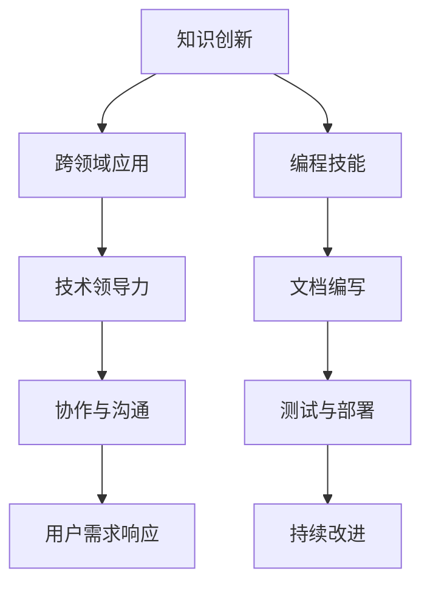

                 

# 程序员在知识经济时代的角色定位

## 1. 背景介绍

### 1.1 知识经济的概念
知识经济是指以知识和信息为最重要的生产要素，通过知识创新和信息处理来驱动经济增长的新型经济形态。与之相对应的是传统工业经济，其生产方式主要依赖于资本和劳力。知识经济的核心在于创新驱动，强调知识的创造、传播和应用，从而实现经济的高质量发展。

### 1.2 知识经济时代对程序员的挑战
随着知识经济时代的到来，传统的IT岗位正在快速向知识型岗位转变。以软件开发为代表的程序员工作，不仅要具备基础的编程能力，还需要具备更广泛的跨领域知识、创新思维和综合素质。在知识经济时代，程序员的角色定位也在悄然发生变化，从单纯的代码编写者转变为知识创造者、问题解决者和技术创新者。

## 2. 核心概念与联系

### 2.1 核心概念概述
知识经济时代对程序员的挑战来自于多个方面，核心概念包括：

- **知识创新**：程序员需要不断学习和掌握新知识、新技术，以支持企业或项目进行持续创新。
- **跨领域应用**：程序员需具备跨学科知识，能在不同领域进行问题解决和项目实践。
- **技术领导力**：程序员不仅要能写代码，还需要具备领导团队和技术战略规划的能力。
- **协作与沟通**：知识经济时代的项目往往需要跨团队、跨地域协作，程序员需具备良好的沟通和协作能力。
- **用户需求响应**：程序员需具备快速响应用户需求的能力，并根据用户反馈进行迭代优化。

### 2.2 核心概念原理和架构的 Mermaid 流程图


此图展示了知识经济时代程序员的核心技能与工作流程的联系。从知识创新到用户需求响应，每一个环节都依赖于编程技能、文档编写、测试与部署等基本技能。同时，技术领导力、协作与沟通能力是贯穿整个工作流程的关键要素。

## 3. 核心算法原理 & 具体操作步骤

### 3.1 算法原理概述
在知识经济时代，程序员的工作不仅仅是编写代码，而是将编程技能作为知识创新的基础，通过跨领域应用和协作沟通，解决复杂问题，提升用户满意度。核心算法原理包括：

- **知识积累与创新**：程序员通过学习、实践和经验积累，不断获取新的知识和技能，并将其应用于项目中，驱动创新。
- **问题解决**：通过跨领域应用和综合素质，程序员能够更全面地分析和解决问题，提供更高效的解决方案。
- **技术领导**：程序员不仅需要具备编程能力，还需具备技术领导力，能够指导和协调团队合作，推进项目进展。
- **协作沟通**：程序员需要在团队中有效沟通，快速响应需求，与不同背景的团队成员协作。

### 3.2 算法步骤详解
程序员在知识经济时代的具体步骤包括：

1. **学习与积累**：通过在线课程、技术社区、阅读技术书籍等方式，持续学习和更新知识，如掌握新的编程语言、框架、工具等。
2. **跨领域应用**：在项目中，根据需求选择合适的技术和工具，并在跨领域应用中寻求最优解决方案。例如，基于自然语言处理技术，提升用户反馈处理效率。
3. **技术领导**：作为技术骨干，指导和协调团队合作，推动技术方案的实施，并提出改进意见。
4. **协作沟通**：在团队中有效沟通，快速响应需求，确保项目按计划推进。
5. **用户需求响应**：通过用户反馈和数据分析，持续优化产品功能，提升用户体验。

### 3.3 算法优缺点
知识经济时代程序员的角色定位，优缺点如下：

#### 优点
- **综合素质**：在跨领域应用中，综合素质提升，能够处理复杂问题。
- **技术领导力**：具备技术领导力，能够指导和协调团队合作。
- **持续创新**：持续学习和创新，推动企业技术进步。
- **灵活性**：在知识经济时代，编程语言、技术框架等不断变化，灵活应对新技术是程序员的核心竞争力。

#### 缺点
- **工作强度**：知识经济时代对程序员的要求更高，工作强度大。
- **学习压力**：需要不断学习新知识，学习压力增大。
- **技能转换**：跨领域应用和问题解决需要不断切换技能，增加了技能转换难度。

### 3.4 算法应用领域
知识经济时代程序员的角色定位，适用于多个应用领域，包括：

- **软件开发**：编写代码，进行需求分析、测试与部署，推进项目进展。
- **数据分析与处理**：通过数据分析，提取和应用有价值的信息，提升决策支持。
- **机器学习与AI**：开发和优化机器学习模型，解决复杂问题，提升系统智能化水平。
- **技术咨询与培训**：为企业提供技术咨询服务，进行技术培训和知识传播。
- **产品设计与优化**：参与产品设计和用户体验优化，提升产品竞争力。

## 4. 数学模型和公式 & 详细讲解 & 举例说明

### 4.1 数学模型构建
在知识经济时代，程序员的工作不再局限于算法和数据结构，更多涉及复杂的系统设计和优化。以产品开发为例，其数学模型可表示为：

$$
S = \sum_{i=1}^{n} P_i \times C_i + \sum_{j=1}^{m} R_j \times T_j
$$

其中，$S$表示产品价值，$P_i$表示第$i$个功能的用户满意度，$C_i$表示第$i$个功能的开发成本，$R_j$表示第$j$个场景的用户体验，$T_j$表示第$j$个场景的优化时间。

### 4.2 公式推导过程
通过优化产品价值模型，可得：

$$
\frac{\partial S}{\partial P_i} > 0, \frac{\partial S}{\partial C_i} < 0, \frac{\partial S}{\partial R_j} > 0, \frac{\partial S}{\partial T_j} < 0
$$

推导得出，增加用户满意度、减少开发成本、优化用户体验、缩短优化时间均能提升产品价值。

### 4.3 案例分析与讲解
以一款社交应用的开发为例，其需求包括用户登录、消息推送、社区功能等。通过构建数学模型，可以优化各功能，提升用户满意度。例如，优化用户登录体验，减少页面加载时间，增加功能的多样性，提升社区活跃度。

## 5. 项目实践：代码实例和详细解释说明

### 5.1 开发环境搭建
开发环境搭建需包括：

- **编程语言**：Python、Java、JavaScript等常用编程语言。
- **开发工具**：如IDE（如Visual Studio Code、IntelliJ IDEA）、版本控制工具（如Git）。
- **测试框架**：如JUnit、pytest等。
- **部署平台**：如Docker、Kubernetes等。

### 5.2 源代码详细实现
以Java为例，开发一个用户登录功能的代码实现如下：

```java
public class LoginController {
    public String login(User user) {
        // 用户登录验证逻辑
        if (user.isValid()) {
            return "登录成功";
        } else {
            return "登录失败";
        }
    }
}

public class User {
    private String username;
    private String password;

    public User(String username, String password) {
        this.username = username;
        this.password = password;
    }

    public boolean isValid() {
        // 根据用户输入的username和password进行验证
        // 返回验证结果
    }
}
```

### 5.3 代码解读与分析
代码解读与分析如下：

- **LoginController**：实现用户登录验证逻辑，返回登录结果。
- **User**：用户类，包含用户名和密码，进行验证逻辑。
- **isValid**方法：验证用户名和密码是否合法，若合法返回true，否则返回false。

### 5.4 运行结果展示
通过用户登录功能的代码实现，可以展示用户登录成功或失败的结果，从而实现用户身份验证。

## 6. 实际应用场景

### 6.1 软件开发
软件开发是程序员最重要的工作领域之一。在知识经济时代，软件开发不仅需要快速响应需求，还需持续改进。以Web应用开发为例，程序员需掌握前端技术、后端技术、数据库设计等多方面知识。例如，通过前端框架（如React、Vue）和后端框架（如Spring Boot、Django）进行全栈开发，构建高效、稳定的Web应用。

### 6.2 数据分析与处理
数据分析与处理在知识经济时代的需求日益增加。程序员需具备数据分析技能，使用SQL、Python等工具进行数据清洗、挖掘和可视化。例如，通过可视化工具（如Tableau、Power BI）展示数据分析结果，支持决策制定。

### 6.3 机器学习与AI
机器学习与AI技术是知识经济时代的重要驱动力。程序员需掌握机器学习算法（如回归、分类、聚类等），使用深度学习框架（如TensorFlow、PyTorch）进行模型训练和优化。例如，通过自然语言处理技术，提升智能客服系统的自然交互能力，提升用户体验。

### 6.4 技术咨询与培训
技术咨询与培训是程序员拓展知识经济时代角色的重要途径。通过技术咨询，帮助企业解决复杂问题；通过技术培训，提升团队技术水平。例如，为软件开发团队提供技术支持，进行技术培训，提升团队技能。

### 6.5 产品设计与优化
产品设计与优化是程序员在知识经济时代的重要工作内容之一。程序员需具备良好的设计思维，通过用户体验优化，提升产品竞争力。例如，通过A/B测试等方法，优化产品功能，提升用户满意度。

## 7. 工具和资源推荐

### 7.1 学习资源推荐
为了帮助程序员在知识经济时代快速学习和成长，推荐以下学习资源：

- **在线课程**：如Coursera、edX等平台提供的计算机科学课程。
- **技术社区**：如Stack Overflow、GitHub等平台，学习编程技巧和项目实践。
- **技术书籍**：如《代码大全》、《设计模式》等经典书籍，深入理解编程和设计原则。
- **博客与论文**：如Medium、arXiv等平台，阅读最新的技术文章和学术论文，跟进技术发展。

### 7.2 开发工具推荐
以下是几款常用的开发工具，推荐程序员在知识经济时代使用：

- **IDE**：如Visual Studio Code、IntelliJ IDEA等。
- **版本控制工具**：如Git、SVN等。
- **测试框架**：如JUnit、pytest等。
- **调试工具**：如Chrome DevTools、Xdebug等。
- **部署平台**：如Docker、Kubernetes等。

### 7.3 相关论文推荐
为了深入理解知识经济时代程序员的角色定位和未来发展方向，推荐以下相关论文：

- 《程序员的角色演变：从技术工人到知识工作者》
- 《技术团队协作与管理：知识经济时代的挑战与应对》
- 《基于用户反馈的产品迭代与优化》
- 《敏捷开发与持续交付：提升软件开发效率的实践》
- 《数据驱动的决策支持系统：大数据与人工智能的融合》

## 8. 总结：未来发展趋势与挑战

### 8.1 研究成果总结
知识经济时代，程序员的角色定位从技术执行者向知识创造者、问题解决者和技术创新者转变。核心算法原理包括知识积累与创新、问题解决、技术领导、协作沟通和用户需求响应。数学模型构建和公式推导过程展示了知识经济时代程序员需具备的综合素质和技能。项目实践代码实例和详细解释说明展示了程序员需掌握的编程技能和设计思维。实际应用场景展示了程序员在不同领域的应用，包括软件开发、数据分析、机器学习、技术咨询与培训、产品设计与优化等。

### 8.2 未来发展趋势
知识经济时代，程序员的未来发展趋势包括：

- **技术领导力增强**：随着知识经济的发展，技术领导力将成为程序员的核心竞争力。
- **跨领域应用广泛**：跨领域应用将带来更多机会，程序员需具备更广泛的知识和技能。
- **持续学习与创新**：知识经济时代，编程语言和技术框架不断变化，持续学习和创新是程序员永恒的主题。
- **协作沟通提升**：团队协作和沟通将更加重要，程序员需具备更好的协作沟通能力。
- **用户体验优化**：提升用户体验是知识经济时代的重要目标，程序员需具备设计思维和用户体验优化能力。

### 8.3 面临的挑战
知识经济时代，程序员面临的挑战包括：

- **学习压力增大**：不断更新的技术和知识，增加了程序员的学习压力。
- **工作强度高**：知识经济时代对程序员的要求更高，工作强度大。
- **技能转换难度大**：跨领域应用和问题解决需要不断切换技能，增加了技能转换难度。
- **技术领导力不足**：技术领导力将成为核心竞争力，但部分程序员仍需提升这一能力。

### 8.4 研究展望
未来，程序员在知识经济时代的研究展望包括：

- **技术领导力培训**：通过培训提升程序员的技术领导力，支持团队发展。
- **跨领域应用方法**：探索跨领域应用的方法，提升程序员的综合素质。
- **持续学习机制**：建立持续学习的机制，帮助程序员快速更新知识和技能。
- **协作沟通策略**：探索协作沟通的策略，提升团队协作效率。
- **用户体验优化技术**：提升用户体验优化技术，支持产品设计与优化。

## 9. 附录：常见问题与解答

**Q1：知识经济时代程序员的工作内容有哪些变化？**

A: 知识经济时代，程序员的工作内容主要包括以下变化：
1. **学习与积累**：持续学习和积累新知识，提升综合素质。
2. **跨领域应用**：在跨领域应用中寻求最优解决方案，提升问题解决能力。
3. **技术领导**：具备技术领导力，支持团队合作和项目推进。
4. **协作与沟通**：有效沟通，快速响应需求，提升团队协作效率。
5. **用户需求响应**：根据用户反馈和数据分析，优化产品功能，提升用户体验。

**Q2：知识经济时代程序员面临哪些挑战？**

A: 知识经济时代，程序员面临的挑战包括：
1. **学习压力增大**：持续更新技术和知识，增加了学习压力。
2. **工作强度高**：对技术要求更高，工作强度增大。
3. **技能转换难度大**：跨领域应用和问题解决需要不断切换技能。
4. **技术领导力不足**：需提升技术领导力，支持团队发展。

**Q3：知识经济时代程序员应具备哪些技能？**

A: 知识经济时代，程序员应具备以下技能：
1. **编程技能**：掌握常用的编程语言和技术框架。
2. **跨领域应用**：具备跨学科知识，能在不同领域进行问题解决。
3. **技术领导力**：具备指导和协调团队合作的能力。
4. **协作与沟通**：具备良好的沟通和协作能力。
5. **用户需求响应**：具备快速响应用户需求的能力。

**Q4：知识经济时代程序员的学习资源有哪些？**

A: 知识经济时代，程序员的学习资源包括：
1. **在线课程**：如Coursera、edX等平台提供的计算机科学课程。
2. **技术社区**：如Stack Overflow、GitHub等平台，学习编程技巧和项目实践。
3. **技术书籍**：如《代码大全》、《设计模式》等经典书籍，深入理解编程和设计原则。
4. **博客与论文**：如Medium、arXiv等平台，阅读最新的技术文章和学术论文，跟进技术发展。

**Q5：知识经济时代程序员的开发工具有哪些？**

A: 知识经济时代，程序员的开发工具包括：
1. **IDE**：如Visual Studio Code、IntelliJ IDEA等。
2. **版本控制工具**：如Git、SVN等。
3. **测试框架**：如JUnit、pytest等。
4. **调试工具**：如Chrome DevTools、Xdebug等。
5. **部署平台**：如Docker、Kubernetes等。

**Q6：知识经济时代程序员的未来发展方向有哪些？**

A: 知识经济时代，程序员的未来发展方向包括：
1. **技术领导力提升**：通过培训提升技术领导力，支持团队发展。
2. **跨领域应用研究**：探索跨领域应用的方法，提升综合素质。
3. **持续学习机制建立**：建立持续学习的机制，帮助快速更新知识和技能。
4. **协作沟通策略优化**：探索协作沟通的策略，提升团队协作效率。
5. **用户体验优化技术提升**：提升用户体验优化技术，支持产品设计与优化。

---

作者：禅与计算机程序设计艺术 / Zen and the Art of Computer Programming

