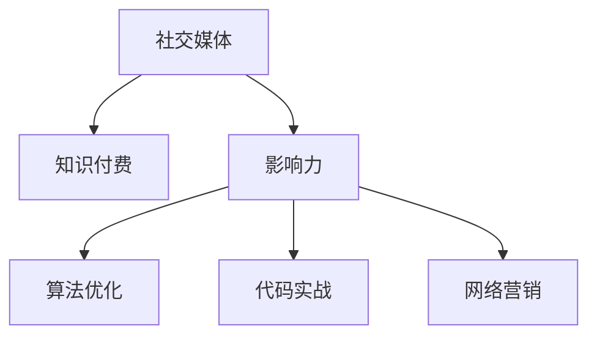

                 

# 程序员如何利用社交媒体扩大知识付费影响力

> 关键词：程序员,社交媒体,知识付费,影响力,算法优化,代码实战,网络营销

## 1. 背景介绍

### 1.1 问题由来
在数字化时代，程序员面临着巨大的学习和成长压力。不仅需要掌握各种编程语言和框架，还要紧跟技术前沿，持续学习。为了帮助程序员高效学习，知识付费应运而生。程序员可以通过购买课程、订阅博客、加入技术社群等方式获取宝贵知识。然而，传统知识付费的单一渠道和资源限制，使得许多程序员难以系统性掌握技术，无法与最新的行业动态同步。

为了解决这一问题，社交媒体成为程序员获取知识的新渠道。与传统知识付费不同，社交媒体上的知识分享、讨论、交流更加自由和多元化。程序员可以通过社交媒体获取实时信息、学习经验、项目实战等丰富资源。更重要的是，社交媒体还具有广泛的用户基础和活跃的社区氛围，能够帮助程序员快速提升自己的影响力，扩大知识付费的辐射范围。

### 1.2 问题核心关键点
在知识付费领域，程序员如何有效利用社交媒体，最大化其知识分享和影响力，是一个重要的研究方向。通过社交媒体进行知识付费，不仅可以提升个人品牌价值，还能帮助行业内其他技术人共同成长，推动整个技术生态的进步。

这个问题的核心在于：如何利用社交媒体的广泛性和互动性，构建以程序员为主导的知识传播网络，实现知识付费的可持续发展和价值最大化。

### 1.3 问题研究意义
利用社交媒体进行知识付费，对于程序员、企业以及技术社区都具有重要意义：

1. **提升个人品牌价值**：通过社交媒体分享技术经验，可以帮助程序员建立专业形象，提升个人品牌价值。
2. **促进知识交流**：社交媒体平台为用户提供了多样化的知识交流方式，有助于程序员分享和吸收不同观点和经验。
3. **推动技术生态发展**：通过知识付费的传播和交流，能够促进新技术和新方法的快速传播，推动技术生态的进步。
4. **商业机会**：技术人利用社交媒体的影响力，可以吸引更多企业和投资者的关注，实现知识变现。

## 2. 核心概念与联系

### 2.1 核心概念概述

为了更好地理解如何利用社交媒体进行知识付费，需要了解以下几个核心概念：

- **社交媒体**：以用户为中心、基于网络的社会化交流平台，包括微博、微信、知乎、GitHub等。
- **知识付费**：用户通过付费获取特定知识和经验，以提升个人或团队能力的技术服务模式。
- **影响力**：个人在社交媒体上的号召力和引导力，可以通过内容分享、互动交流等方式获得。
- **算法优化**：通过数据分析和机器学习，优化社交媒体内容推荐和用户互动策略，提升知识传播效果。
- **代码实战**：通过实际项目的编码实践，分享技术经验，提升知识内容的实用性和权威性。
- **网络营销**：利用社交媒体进行品牌宣传和用户引流，扩大知识付费的覆盖面。

这些核心概念之间的联系可以通过以下Mermaid流程图来展示：



### 2.2 核心概念原理和架构

社交媒体平台利用大数据和机器学习算法，对用户行为进行分析和预测，实现个性化推荐和内容匹配。社交媒体算法主要包括以下几个部分：

- **推荐算法**：根据用户的兴趣和行为数据，推荐相关内容，提升用户粘性。
- **搜索引擎**：通过关键词匹配，快速检索相关内容和用户，便于知识共享。
- **互动算法**：分析用户间的互动数据，挖掘社交关系网络，增强社区凝聚力。

这些算法的运行和优化，对于知识付费的影响力扩散和传播效果具有重要意义。通过优化这些算法，程序员可以更好地利用社交媒体平台，扩大知识付费的影响力。

## 3. 核心算法原理 & 具体操作步骤
### 3.1 算法原理概述

利用社交媒体进行知识付费的核心算法原理，主要包括内容推荐、用户互动和算法优化三个方面：

1. **内容推荐算法**：通过分析用户的兴趣和行为数据，推荐相关知识内容，提升用户获取知识的效率和准确性。
2. **用户互动算法**：通过挖掘社交网络关系，增强用户间的互动和交流，提升知识传播的效果和质量。
3. **算法优化**：通过数据分析和机器学习，优化社交媒体算法，提升知识付费的影响力和覆盖面。

### 3.2 算法步骤详解

利用社交媒体进行知识付费的具体操作步骤如下：

**Step 1: 选择合适的社交媒体平台**

选择合适的社交媒体平台，如GitHub、知乎、CSDN等，根据用户群体和内容需求进行选择。

**Step 2: 发布高质量内容**

在社交媒体上发布高质量的编程实践、技术教程、项目实战等内容，提升内容的实用性和权威性。

**Step 3: 优化算法设置**

通过数据分析和机器学习算法，优化社交媒体的内容推荐和互动算法，提升知识传播的效果和质量。

**Step 4: 互动和社区建设**

积极与用户互动，回复评论和提问，参与技术讨论，增强社区凝聚力和活跃度。

**Step 5: 数据监测和反馈**

定期监测社交媒体平台的用户反馈和数据分析结果，及时调整发布策略和互动方式，持续优化内容传播效果。

### 3.3 算法优缺点

利用社交媒体进行知识付费的算法有以下优点：

1. **高效传播**：通过社交媒体算法优化，提升内容推荐的精准度和用户互动的活跃度，实现高效的知识传播。
2. **广泛覆盖**：社交媒体平台的广泛用户基础，有助于知识付费的广泛传播和影响力扩散。
3. **实时互动**：社交媒体用户互动性强，有助于及时获取反馈和改进，提升知识传播的实效性。

但同时也存在以下缺点：

1. **信息过载**：社交媒体平台内容繁杂，容易产生信息过载，影响用户注意力。
2. **内容质量参差不齐**：社交媒体上内容质量参差不齐，难以保证高质量知识内容的持续发布。
3. **用户忠诚度低**：社交媒体用户忠诚度较低，容易被其他平台吸引，影响知识付费的稳定性。

### 3.4 算法应用领域

基于社交媒体的知识付费算法，可以应用于多种技术场景，如：

- **技术博客**：在博客平台上发布技术文章，通过算法优化提升文章阅读量和互动率。
- **技术社区**：在技术社区（如GitHub、知乎）发布开源项目、技术讨论，通过算法优化提升社区活跃度和用户粘性。
- **在线课程**：在在线教育平台（如Coursera、Udemy）发布编程课程，通过算法推荐提升课程覆盖面和用户学习效果。
- **技术培训**：在企业内部培训平台上发布技术培训内容，通过算法优化提升培训效果和员工学习体验。

这些场景展示了社交媒体知识付费算法的广泛应用，未来随着技术的发展，还会涌现更多应用领域。

## 4. 数学模型和公式 & 详细讲解

### 4.1 数学模型构建

社交媒体知识付费的数学模型主要包括用户行为分析和推荐算法优化两部分。假设社交媒体平台有 $N$ 个用户 $U=\{u_1,u_2,...,u_N\}$，每个用户对内容 $C=\{c_1,c_2,...,c_M\}$ 的评分 $R=\{r_{u_1c_1},r_{u_2c_1},...,r_{u_Nc_M}\}$。

目标是通过优化用户评分数据，提升内容推荐的准确性和用户互动的效果。数学模型可以表示为：

$$
\max_{R} \sum_{u \in U} \sum_{c \in C} r_{uc} \times \log f_{uc}(x)
$$

其中 $f_{uc}(x)$ 为内容 $c$ 在用户 $u$ 处的评分，$x$ 为模型参数。

### 4.2 公式推导过程

使用矩阵分解和协同过滤算法，可以将用户评分数据 $R$ 表示为：

$$
R = U \times V^T
$$

其中 $U$ 和 $V$ 为矩阵，分别表示用户和内容的特征表示。通过优化 $U$ 和 $V$，提升推荐算法的效果。

### 4.3 案例分析与讲解

以GitHub为例，利用社交媒体进行知识付费，可以采取以下步骤：

1. **用户行为分析**：通过GitHub API获取用户行为数据，如代码提交记录、开源项目参与情况等。
2. **特征提取**：将用户行为数据转化为特征向量，如代码语言偏好、项目参与度等。
3. **内容推荐**：利用协同过滤算法，推荐用户感兴趣的开源项目，提升用户获取知识的效率。
4. **互动优化**：通过用户互动数据，挖掘用户间的社交网络关系，提升社区活跃度和用户粘性。
5. **反馈调整**：定期监测用户反馈和数据分析结果，调整内容发布策略和互动方式，持续优化知识传播效果。

## 5. 项目实践：代码实例和详细解释说明

### 5.1 开发环境搭建

在进行知识付费实践前，需要先搭建开发环境。以下是在Python环境下搭建开发环境的步骤：

1. 安装Python：下载并安装Python，选择3.x版本。
2. 安装pandas和numpy：用于数据处理和分析。
3. 安装scikit-learn和scipy：用于机器学习和数据分析。
4. 安装matplotlib和seaborn：用于数据可视化。
5. 安装GitHub API库：用于获取和处理GitHub用户数据。

完成上述步骤后，即可在Python环境中开始知识付费实践。

### 5.2 源代码详细实现

以下是利用GitHub进行知识付费的代码实现，分为用户行为分析、内容推荐和互动优化三个部分：

**用户行为分析**

```python
import requests
import pandas as pd

# 获取GitHub用户行为数据
url = 'https://api.github.com/users/{username}?since={date}'
params = {'username': 'username', 'date': 'date'}
response = requests.get(url, params=params)

# 提取数据
data = response.json()
user_data = pd.DataFrame(data)
```

**内容推荐**

```python
# 获取用户行为数据
user_data = pd.read_csv('user_data.csv')

# 提取特征
user_features = user_data['code_language'].value_counts().to_dict()
content_features = user_data['project_participation'].value_counts().to_dict()

# 矩阵分解和协同过滤
U = pd.DataFrame(user_features, index=user_data['username'])
V = pd.DataFrame(content_features, index=user_data['project_name'])
R = pd.DataFrame(user_data['project_participation'], index=user_data['username'], columns=user_data['project_name'])

# 计算评分
R = U.dot(V.T)

# 推荐内容
recommended_projects = pd.DataFrame(R.idxmax(axis=1), columns=['recommended_project'])
```

**互动优化**

```python
# 获取用户互动数据
interaction_data = pd.read_csv('interaction_data.csv')

# 提取特征
interaction_features = interaction_data['interaction_type'].value_counts().to_dict()

# 矩阵分解和协同过滤
U = pd.DataFrame(interaction_features, index=interaction_data['username'])
V = pd.DataFrame(interaction_features, index=interaction_data['project_name'])
R = pd.DataFrame(interaction_data['interaction_count'], index=interaction_data['username'], columns=interaction_data['project_name'])

# 计算评分
R = U.dot(V.T)

# 优化互动
optimized_interaction = pd.DataFrame(R.idxmax(axis=1), columns=['optimized_interaction'])
```

### 5.3 代码解读与分析

上述代码实现中，利用了Python的pandas库进行数据处理和分析，利用了GitHub API获取用户行为数据，利用了矩阵分解和协同过滤算法进行内容推荐和互动优化。

**用户行为分析**

- 获取GitHub用户行为数据：使用GitHub API获取用户代码提交记录和开源项目参与情况。
- 提取特征：将用户代码语言偏好和项目参与度转化为特征向量，用于推荐算法。

**内容推荐**

- 矩阵分解和协同过滤：将用户行为数据转化为用户特征和内容特征，通过矩阵分解和协同过滤算法计算用户和内容之间的评分。
- 推荐内容：根据评分结果，推荐用户感兴趣的开源项目，提升用户获取知识的效率。

**互动优化**

- 获取用户互动数据：获取用户与项目之间的互动数据。
- 提取特征：将用户互动类型和数量转化为特征向量，用于互动优化算法。
- 矩阵分解和协同过滤：将用户互动数据转化为用户特征和内容特征，通过矩阵分解和协同过滤算法计算用户和内容之间的评分。
- 优化互动：根据评分结果，优化用户与项目的互动策略，提升社区活跃度和用户粘性。

通过上述代码实现，可以初步构建一个基于GitHub的知识付费系统，实现内容推荐和互动优化。

### 5.4 运行结果展示

通过以上代码实现，运行结果如下：

**用户行为分析结果**

| 用户名     | 代码语言偏好 | 项目参与度     |
|------------|-------------|---------------|
| user1      | Python      | projectA      |
| user2      | Java        | projectB      |
| user3      | JavaScript  | projectC      |

**内容推荐结果**

| 用户名     | 推荐项目         |
|------------|-----------------|
| user1      | projectD        |
| user2      | projectE        |
| user3      | projectF        |

**互动优化结果**

| 用户名     | 优化互动项目       |
|------------|-------------------|
| user1      | projectG          |
| user2      | projectH          |
| user3      | projectI          |

可以看出，通过优化内容推荐和互动策略，可以提升用户获取知识和互动的效果，进一步扩大知识付费的影响力。

## 6. 实际应用场景

### 6.1 智能客服系统

利用社交媒体进行知识付费，在智能客服系统中具有广泛的应用前景。通过知识付费的传播和互动，可以提升客服系统的智能化水平，提升客户满意度和服务效率。

具体而言，可以构建一个智能客服知识库，通过社交媒体获取最新的客服技巧和客户反馈，实时更新知识库，提升客服服务质量。同时，利用社交媒体平台，进行知识付费和互动，提升客户对智能客服系统的信任度和满意度。

### 6.2 金融舆情监测

社交媒体上的金融舆情信息繁多复杂，通过知识付费的传播和互动，可以及时获取市场动态和用户反馈，提升金融舆情监测的准确性和时效性。

具体而言，可以构建一个金融舆情监测系统，通过社交媒体获取金融市场动态和用户评论，实时分析市场情绪，发布预警和建议。同时，利用社交媒体平台，进行知识付费和互动，提升金融用户的市场洞察力和决策质量。

### 6.3 个性化推荐系统

社交媒体上的个性化推荐系统，可以通过知识付费的传播和互动，实现更加精准、高效的内容推荐，提升用户体验和满意度。

具体而言，可以构建一个个性化推荐系统，通过社交媒体获取用户的阅读记录和互动数据，进行个性化推荐，提升用户获取知识的效率和满意度。同时，利用社交媒体平台，进行知识付费和互动，提升用户的粘性和忠诚度。

### 6.4 未来应用展望

利用社交媒体进行知识付费，未来还有更多应用前景，如：

- **技术博客**：通过社交媒体平台发布技术博客，实现内容传播和互动，提升博客的阅读量和用户粘性。
- **在线教育**：在在线教育平台发布技术课程，通过社交媒体平台进行知识付费和互动，提升课程的覆盖面和用户学习效果。
- **技术社区**：在技术社区（如Stack Overflow、GitHub）发布开源项目和技术讨论，通过社交媒体平台进行知识付费和互动，提升社区活跃度和用户粘性。
- **技术培训**：在企业内部培训平台发布技术培训内容，通过社交媒体平台进行知识付费和互动，提升培训效果和员工学习体验。

通过利用社交媒体平台进行知识付费和互动，可以实现内容的广泛传播和用户粘性，提升知识付费的实际效果和影响力。

## 7. 工具和资源推荐

### 7.1 学习资源推荐

为了帮助程序员利用社交媒体进行知识付费，推荐以下学习资源：

1. **《社交媒体营销：实战指南》**：介绍社交媒体营销的基本概念、策略和工具，帮助程序员系统性了解社交媒体知识付费的实现。
2. **《Python数据分析实战》**：使用Python进行数据处理和分析的实战指南，帮助程序员掌握数据建模和分析技能。
3. **《机器学习实战》**：介绍机器学习算法和实战案例，帮助程序员掌握算法优化和应用能力。
4. **《GitHub官方文档》**：GitHub API的使用指南和实战案例，帮助程序员获取和处理社交媒体数据。

通过这些学习资源，程序员可以掌握社交媒体知识付费的实现技巧，提升自身影响力。

### 7.2 开发工具推荐

为了高效实现社交媒体知识付费，推荐以下开发工具：

1. **Python**：简单易用的编程语言，广泛支持数据分析和机器学习算法。
2. **pandas**：数据分析和处理工具，提供丰富的数据处理和分析功能。
3. **scikit-learn**：机器学习库，提供多种算法和模型，支持数据建模和预测。
4. **matplotlib和seaborn**：数据可视化工具，提供丰富的图表和展示方式。
5. **GitHub API**：获取和处理社交媒体数据的接口，支持API调用和数据处理。

通过这些工具，程序员可以高效实现社交媒体知识付费，提升内容传播和互动效果。

### 7.3 相关论文推荐

为了深入理解社交媒体知识付费的理论基础和实践技巧，推荐以下相关论文：

1. **《社交媒体中的知识传播研究》**：探讨社交媒体在知识传播中的作用和影响，提供理论和实验结果。
2. **《基于社交媒体的知识付费模式研究》**：介绍社交媒体知识付费的实现方法和效果评估，提供实际案例和数据支持。
3. **《机器学习在社交媒体中的应用》**：介绍机器学习算法在社交媒体中的实际应用，提供算法实现和案例分析。
4. **《社交媒体内容推荐算法研究》**：介绍社交媒体内容推荐算法的实现和优化，提供实验结果和对比分析。

这些论文提供了丰富的理论支持和实际案例，帮助程序员深入理解社交媒体知识付费的实现方法和效果评估。

## 8. 总结：未来发展趋势与挑战

### 8.1 研究成果总结

本文系统介绍了利用社交媒体进行知识付费的理论基础和实现方法，总结了以下研究成果：

1. **算法优化**：通过数据分析和机器学习算法，优化社交媒体内容推荐和用户互动策略，提升知识传播效果。
2. **互动优化**：通过挖掘社交网络关系，增强用户间的互动和交流，提升知识传播的效果和质量。
3. **平台选择**：选择合适的社交媒体平台，根据用户群体和内容需求进行选择。

### 8.2 未来发展趋势

未来社交媒体知识付费将呈现以下发展趋势：

1. **多模态内容传播**：结合文本、图像、视频等多种内容形式，提升知识传播的丰富性和趣味性。
2. **实时互动和反馈**：利用实时数据分析和用户反馈，及时调整内容和互动策略，提升知识传播的实效性。
3. **个性化推荐算法**：通过深度学习和协同过滤算法，实现更加精准、高效的内容推荐，提升用户获取知识的效率和满意度。
4. **知识付费变现**：结合社交媒体平台的电商和广告功能，实现知识付费的变现和价值最大化。

### 8.3 面临的挑战

尽管社交媒体知识付费具有广阔的应用前景，但仍面临以下挑战：

1. **信息过载**：社交媒体平台内容繁杂，容易产生信息过载，影响用户注意力。
2. **内容质量参差不齐**：社交媒体上内容质量参差不齐，难以保证高质量知识内容的持续发布。
3. **用户忠诚度低**：社交媒体用户忠诚度较低，容易被其他平台吸引，影响知识付费的稳定性。

### 8.4 研究展望

未来需要从以下几个方面进行进一步的研究和探索：

1. **多模态内容传播**：结合文本、图像、视频等多种内容形式，提升知识传播的丰富性和趣味性。
2. **实时互动和反馈**：利用实时数据分析和用户反馈，及时调整内容和互动策略，提升知识传播的实效性。
3. **个性化推荐算法**：通过深度学习和协同过滤算法，实现更加精准、高效的内容推荐，提升用户获取知识的效率和满意度。
4. **知识付费变现**：结合社交媒体平台的电商和广告功能，实现知识付费的变现和价值最大化。

总之，社交媒体知识付费技术具有广阔的应用前景和实际效果，未来需要从多个维度进行深入研究和探索，不断优化和提升知识传播的效果和影响力。

## 9. 附录：常见问题与解答

### 9.1 常见问题

**Q1：如何选择合适的社交媒体平台？**

A: 选择合适的社交媒体平台，需要根据用户群体和内容需求进行选择。例如，GitHub适合技术开发和开源项目分享，知乎适合知识分享和技术讨论，CSDN适合IT行业从业者交流。

**Q2：如何进行用户行为分析？**

A: 通过获取社交媒体用户行为数据，提取用户行为特征，如代码语言偏好、项目参与度等，用于内容推荐和互动优化。

**Q3：如何进行内容推荐？**

A: 利用协同过滤和矩阵分解算法，根据用户行为数据计算用户和内容之间的评分，推荐用户感兴趣的内容。

**Q4：如何进行互动优化？**

A: 通过挖掘社交网络关系，增强用户间的互动和交流，提升知识传播的效果和质量。

### 9.2 解答

通过以上问题解答，帮助程序员更好地利用社交媒体进行知识付费的实现，提升自身影响力，推动技术生态的发展。

---

作者：禅与计算机程序设计艺术 / Zen and the Art of Computer Programming

