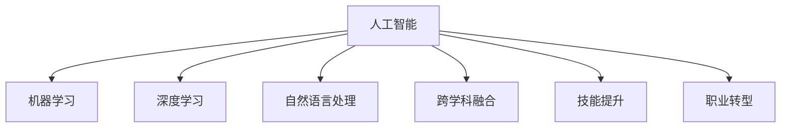

                 

# 程序员如何应对人工智能时代的职业转型

> 关键词：人工智能,职业转型,技能提升,数据科学,深度学习,跨学科融合

## 1. 背景介绍

### 1.1 问题由来

随着人工智能技术的迅猛发展，程序员职业正在经历深刻而剧烈的变革。越来越多的企业开始引入AI技术，以提升运营效率、优化产品体验、开拓新的商业空间。AI正从边缘应用向中心地位转变，成为企业战略的关键组成部分。

然而，对于大部分传统程序员而言，人工智能技术复杂度高、学习成本大，转型过程中的适应性、学习能力和接受程度成了不容忽视的问题。如何在人工智能大潮中，保持职业竞争力，甚至发挥出更大的作用，成为每位程序员必须面对的挑战。

### 1.2 问题核心关键点

在人工智能时代，程序员的职业转型主要围绕以下几个核心问题：

- **技能提升**：了解并掌握AI核心技术，如机器学习、深度学习、自然语言处理等。
- **跨学科融合**：在特定领域内将AI技术与其他学科知识结合，解决实际问题。
- **项目实践**：将理论知识应用于具体项目，提升问题解决能力。
- **持续学习**：面对技术快速迭代，持续更新知识结构，保持学习热情。
- **职业规划**：明确个人职业发展方向，制定转型策略和目标。

### 1.3 问题研究意义

深入理解人工智能时代下的职业转型，对于推动技术创新、提升行业竞争力、培养跨领域人才具有重要意义：

- **技术进步**：促使技术迭代，推动社会整体技术水平提升。
- **企业发展**：辅助企业通过AI技术优化业务流程，获取竞争优势。
- **个人成长**：帮助程序员拓展职业路径，提升职业满意度。
- **教育普及**：促进AI知识普及，提高公众科学素养。

## 2. 核心概念与联系

### 2.1 核心概念概述

为更好地理解AI时代下的职业转型，我们首先介绍几个密切相关的核心概念：

- **人工智能(Artificial Intelligence, AI)**：通过机器学习、深度学习等技术，赋予计算机系统类似于人类的智能能力。
- **机器学习(Machine Learning, ML)**：使用数据和算法让计算机系统具备从经验中学习的能力。
- **深度学习(Deep Learning, DL)**：一种基于多层神经网络的机器学习方法，能处理大规模数据，进行复杂特征提取和模式识别。
- **自然语言处理(Natural Language Processing, NLP)**：使计算机能理解、处理、生成人类语言。
- **跨学科融合**：将AI技术与其他学科（如医学、金融、教育等）的知识相结合，解决实际问题。
- **技能提升**：通过学习新的技术工具和方法，提高个人专业技能。
- **职业转型**：在AI技术快速发展的背景下，对现有职业进行重新定位和规划。

这些核心概念之间的逻辑关系可以通过以下Mermaid流程图来展示：



这个流程图展示了一系列核心概念及其之间的关系：

1. 人工智能是基础，机器学习和深度学习是核心技术，自然语言处理是其重要应用之一。
2. 跨学科融合是将AI技术应用于其他领域的关键方式，技能提升和职业转型则是个人适应和利用AI技术的策略。

## 3. 核心算法原理 & 具体操作步骤
### 3.1 算法原理概述

人工智能时代的职业转型，本质上是一个多层次、多维度的技能提升和能力重构过程。其核心思想是：通过学习、实践和融合，使程序员在AI技术的支持下，拓展新的职业路径，提升解决问题和实现创新的能力。

具体来说，AI时代下的职业转型涉及以下几个主要方面：

- **技术学习**：掌握AI相关的基础理论和核心技术。
- **项目实践**：在实际项目中应用AI技术，验证和优化学习成果。
- **跨学科融合**：将AI与其他领域知识结合，解决实际问题。
- **持续学习**：保持学习和提升的持续性，适应技术变化。
- **职业规划**：结合个人兴趣和市场需求，明确职业发展方向。

### 3.2 算法步骤详解

AI时代下的职业转型主要包括以下几个关键步骤：

**Step 1: 技术学习**

- **基础理论**：深入理解机器学习、深度学习、NLP等AI核心技术的基础理论，掌握必要的数学和算法知识。
- **技术工具**：熟练使用TensorFlow、PyTorch、Scikit-Learn等主流AI技术框架，提升编程能力。
- **实践项目**：通过实际项目，巩固所学知识，提升动手能力和问题解决能力。

**Step 2: 项目实践**

- **项目选择**：根据个人兴趣和市场需求，选择适合的AI项目。
- **任务分解**：将项目任务分解为多个子任务，逐一实现。
- **实验验证**：通过实验验证模型效果，进行参数调优和优化。
- **成果展示**：将项目成果展示给团队或客户，获取反馈和改进。

**Step 3: 跨学科融合**

- **领域知识**：了解所从事领域的背景知识，包括业务流程、数据特点等。
- **技术应用**：将AI技术应用于领域问题，如使用NLP处理文本数据，用机器学习预测趋势等。
- **业务协同**：与业务人员、数据工程师等协同工作，确保AI技术得到正确应用。

**Step 4: 持续学习**

- **在线课程**：参加线上AI课程，持续学习新知识和新技能。
- **学术研究**：阅读最新学术论文，了解前沿研究动态。
- **技术社区**：参与技术社区讨论，获取行业动态和技术分享。

**Step 5: 职业规划**

- **目标设定**：根据自身情况和市场需求，设定明确的职业发展目标。
- **路径规划**：选择适合的发展路径，如技术专家、产品经理、AI工程师等。
- **资源整合**：利用线上线下资源，如培训课程、企业内训、行业会议等，提升职业竞争力。

### 3.3 算法优缺点

AI时代下的职业转型方法具有以下优点：

1. **适应性强**：通过学习新技术和跨学科知识，能快速适应市场需求的变化。
2. **实践导向**：在实际项目中应用AI技术，能更直观地理解和应用理论知识。
3. **知识全面**：跨学科融合能帮助理解和解决更复杂的问题，提升综合能力。
4. **持续提升**：持续学习机制，保持知识更新和技能提升的持续性。

同时，该方法也存在一定的局限性：

1. **学习成本高**：需要投入大量时间和精力学习新知识和新技术。
2. **技术门槛高**：AI技术复杂度高，对学习者要求较高，存在一定的学习门槛。
3. **应用范围有限**：AI技术在特定领域的应用范围可能受限，需要结合领域知识。
4. **效果依赖于项目**：项目选择和实现效果直接影响转型效果，需精心规划。

尽管存在这些局限性，但总体而言，AI时代下的职业转型方法在技术变革的背景下，提供了清晰的路径和可行的策略，为程序员在AI技术大潮中保持竞争力和发展潜力奠定了坚实的基础。

### 3.4 算法应用领域

AI时代下的职业转型，在多个领域得到了广泛应用，包括但不限于：

- **软件开发**：利用AI技术提升软件开发效率，如代码生成、自动化测试等。
- **数据分析**：通过机器学习、NLP技术进行数据分析和预测，辅助决策。
- **产品设计**：利用AI技术优化产品设计和用户体验，提升产品竞争力。
- **医疗健康**：在医疗影像分析、疾病预测、个性化治疗等领域应用AI技术。
- **金融科技**：使用AI进行信用评估、欺诈检测、智能投顾等。
- **智能制造**：结合AI和物联网技术，实现智能生产和质量控制。
- **教育培训**：开发智能教育平台，个性化教学和作业批改等。

这些应用领域展示了AI技术在各行各业中的广泛应用前景，同时也为程序员提供了广阔的职业发展空间。

## 4. 数学模型和公式 & 详细讲解 & 举例说明

### 4.1 数学模型构建

为了更好地理解AI时代下的职业转型，我们从数学模型角度对核心概念进行更严格的刻画。

假设程序员需要掌握的AI技能集合为 $\mathcal{S}$，技能提升后的新能力集合为 $\mathcal{S}'$。那么，职业转型过程可以视为从 $\mathcal{S}$ 到 $\mathcal{S}'$ 的映射，即：

$$
f: \mathcal{S} \rightarrow \mathcal{S'}
$$

其中 $f$ 表示从 $\mathcal{S}$ 到 $\mathcal{S}'$ 的转换过程，包括技术学习、项目实践、跨学科融合、持续学习和职业规划等步骤。

### 4.2 公式推导过程

在数学模型构建的基础上，我们可以进一步推导出职业转型过程中的关键步骤。

以技能提升为例，假设程序员初始掌握的技能为 $\mathcal{S}_0$，通过学习获得的新技能为 $\mathcal{S}_1$。则技能提升的过程可以表示为：

$$
\mathcal{S}' = \mathcal{S}_0 \cup \mathcal{S}_1
$$

其中 $\cup$ 表示并集，表示新技能集合包含了初始技能和新增技能。

### 4.3 案例分析与讲解

假设某程序员初始技能集合为 $\mathcal{S}_0 = \{\text{Python, SQL, UI设计}\}$。他希望转型为数据科学家，需要掌握机器学习、深度学习等新技能。设 $\mathcal{S}_1 = \{\text{机器学习, 深度学习, 数据分析}\}$。

经过一段时间的学习和实践，他获得了新的技能 $\mathcal{S}' = \{\text{Python, SQL, UI设计, 机器学习, 深度学习, 数据分析}\}$。这些新技能将使他在数据科学领域具备更强的竞争力。

## 5. 项目实践：代码实例和详细解释说明
### 5.1 开发环境搭建

在进行AI项目实践前，我们需要准备好开发环境。以下是使用Python进行PyTorch开发的环境配置流程：

1. 安装Anaconda：从官网下载并安装Anaconda，用于创建独立的Python环境。

2. 创建并激活虚拟环境：
```bash
conda create -n pytorch-env python=3.8 
conda activate pytorch-env
```

3. 安装PyTorch：根据CUDA版本，从官网获取对应的安装命令。例如：
```bash
conda install pytorch torchvision torchaudio cudatoolkit=11.1 -c pytorch -c conda-forge
```

4. 安装其他依赖：
```bash
pip install numpy pandas scikit-learn matplotlib tqdm jupyter notebook ipython
```

完成上述步骤后，即可在`pytorch-env`环境中开始AI项目实践。

### 5.2 源代码详细实现

这里以使用PyTorch进行机器学习项目为例，给出完整的代码实现。

```python
import torch
import torch.nn as nn
import torch.optim as optim
from sklearn.datasets import make_classification
from sklearn.model_selection import train_test_split
from torch.utils.data import DataLoader
from torchvision import datasets, transforms

# 加载数据集
def load_data():
    X, y = make_classification(n_samples=1000, n_features=10, n_informative=5, n_redundant=0, random_state=42)
    X_train, X_test, y_train, y_test = train_test_split(X, y, test_size=0.2, random_state=42)
    return X_train, X_test, y_train, y_test

# 定义模型
class MyModel(nn.Module):
    def __init__(self):
        super(MyModel, self).__init__()
        self.linear1 = nn.Linear(10, 50)
        self.linear2 = nn.Linear(50, 2)
        self.relu = nn.ReLU()

    def forward(self, x):
        x = self.linear1(x)
        x = self.relu(x)
        x = self.linear2(x)
        return x

# 训练模型
def train_model(model, train_loader, test_loader, num_epochs, learning_rate):
    model.train()
    criterion = nn.CrossEntropyLoss()
    optimizer = optim.SGD(model.parameters(), lr=learning_rate)
    
    for epoch in range(num_epochs):
        running_loss = 0.0
        for i, data in enumerate(train_loader, 0):
            inputs, labels = data
            optimizer.zero_grad()
            outputs = model(inputs)
            loss = criterion(outputs, labels)
            loss.backward()
            optimizer.step()
            running_loss += loss.item()
            if i % 100 == 99:
                print('[%d, %5d] loss: %.3f' %
                      (epoch + 1, i + 1, running_loss / 100))
                running_loss = 0.0
                
    model.eval()
    with torch.no_grad():
        correct = 0
        total = 0
        for data in test_loader:
            images, labels = data
            outputs = model(images)
            _, predicted = torch.max(outputs.data, 1)
            total += labels.size(0)
            correct += (predicted == labels).sum().item()

    print('Accuracy of the network on the 10000 test images: %d %%' % (
        100 * correct / total))

# 加载数据集
X_train, X_test, y_train, y_test = load_data()

# 数据预处理
transform = transforms.Compose([
    transforms.ToTensor(),
    transforms.Normalize((0.5, 0.5, 0.5), (0.5, 0.5, 0.5))
])

trainset = datasets.MNIST(root='./data', train=True,
                         download=True, transform=transform)
train_loader = DataLoader(trainset, batch_size=4,
                         shuffle=True, num_workers=2)

testset = datasets.MNIST(root='./data', train=False,
                        download=True, transform=transform)
test_loader = DataLoader(testset, batch_size=4,
                        shuffle=False, num_workers=2)

# 定义模型和优化器
model = MyModel()
optimizer = optim.SGD(model.parameters(), lr=0.001)

# 训练模型
train_model(model, train_loader, test_loader, 10, 0.001)
```

以上就是使用PyTorch进行机器学习项目开发的完整代码实现。可以看到，通过合理使用PyTorch，我们能够高效地实现模型构建、数据加载和模型训练等过程。

### 5.3 代码解读与分析

让我们再详细解读一下关键代码的实现细节：

**数据加载函数**：
- 使用Scikit-Learn的make_classification函数生成合成数据集。
- 使用train_test_split函数将数据集划分为训练集和测试集。

**模型定义**：
- 定义了一个简单的多层神经网络模型，包含两个线性层和一个ReLU激活函数。

**训练函数**：
- 定义训练函数train_model，包括模型的前向传播、损失函数计算、反向传播和参数更新等步骤。
- 使用SGD优化器进行模型训练，并在训练过程中输出每个epoch的损失和精度。
- 在测试集上评估模型性能，输出测试精度。

**模型训练**：
- 加载数据集并进行预处理，定义模型和优化器。
- 调用train_model函数进行模型训练，并在测试集上输出最终结果。

## 6. 实际应用场景
### 6.1 数据科学

数据科学是AI技术的重要应用领域之一。数据科学家利用机器学习、深度学习等技术，从大量数据中提取有价值的信息，辅助决策和优化业务流程。

在实际应用中，数据科学家需要对数据进行清洗、特征工程、模型训练和评估等步骤，以解决实际问题。例如，在金融风控领域，数据科学家可以通过机器学习模型，识别出高风险用户，预防欺诈行为。在医疗健康领域，数据科学家可以利用深度学习技术，分析患者影像数据，辅助诊断和治疗。

### 6.2 智能制造

智能制造是AI技术在制造业的重要应用方向。通过将AI技术与物联网、自动化等技术结合，可以实现智能化生产和管理。

在智能制造中，AI技术可以用于预测设备故障、优化生产流程、提高生产效率等。例如，通过机器学习模型，对设备传感器数据进行分析，预测设备故障，提前进行维护，减少停机时间。通过深度学习技术，优化生产过程，提高产品质量和生产效率。

### 6.3 金融科技

金融科技是AI技术在金融领域的重要应用方向。通过AI技术，金融机构可以提升风险控制能力、优化客户服务体验等。

在金融科技中，AI技术可以用于信用评估、风险管理、智能投顾等。例如，利用机器学习模型，分析客户的信用数据，预测信用风险，帮助金融机构做出更准确的决策。通过深度学习技术，进行情感分析，了解客户需求和情感变化，提供更个性化的金融服务。

### 6.4 未来应用展望

未来，AI技术将在更多领域得到广泛应用，带来更深远的影响：

1. **医疗健康**：AI技术在医疗影像分析、疾病预测、个性化治疗等领域的应用将大大提升医疗服务的质量和效率。
2. **教育培训**：AI技术在智能教育平台、个性化教学、作业批改等领域的应用，将提升教育质量，实现教育公平。
3. **智能交通**：AI技术在智能交通管理、自动驾驶、智慧出行等领域的应用，将提高交通系统的效率和安全。
4. **智慧城市**：AI技术在城市管理、智能安防、智慧医疗等领域的应用，将提升城市管理的智能化水平。

总之，AI技术将在各行各业发挥更大的作用，带来更广泛的应用前景。

## 7. 工具和资源推荐
### 7.1 学习资源推荐

为了帮助程序员系统掌握AI技术，这里推荐一些优质的学习资源：

1. **《深度学习》课程**：由斯坦福大学开设的深度学习课程，涵盖深度学习的基础理论、核心算法和实际应用。
2. **《机器学习实战》书籍**：由Peter Harrington编写的实战指南，适合初学者和进阶者阅读。
3. **Kaggle平台**：提供大量数据集和竞赛项目，通过实际项目提升技能和知识。
4. **Coursera平台**：提供众多机器学习和深度学习课程，涵盖从入门到进阶的内容。
5. **PyTorch官方文档**：PyTorch的官方文档，提供了详细的API参考和示例代码，适合快速学习和实践。

### 7.2 开发工具推荐

高效的开发离不开优秀的工具支持。以下是几款用于AI开发常用的工具：

1. **PyTorch**：基于Python的开源深度学习框架，支持动态图计算，适合快速迭代研究。
2. **TensorFlow**：由Google主导开发的开源深度学习框架，生产部署方便，适合大规模工程应用。
3. **Jupyter Notebook**：支持多语言编程和实时调试，适合数据科学和机器学习项目开发。
4. **Scikit-Learn**：Python中的机器学习库，提供了丰富的机器学习算法和工具。
5. **TensorBoard**：TensorFlow配套的可视化工具，可实时监测模型训练状态，提供丰富的图表呈现方式。

### 7.3 相关论文推荐

AI技术的快速发展离不开学界的持续研究。以下是几篇奠基性的相关论文，推荐阅读：

1. **《神经网络与深度学习》**：Ian Goodfellow等编著，介绍了深度学习的基础理论和实践方法。
2. **《深度学习》**：Ian Goodfellow等编著，涵盖了深度学习的理论、算法和应用。
3. **《机器学习实战》**：Peter Harrington编写，提供了机器学习的实战指南。

这些论文代表了大数据、机器学习、深度学习等领域的最新进展，通过阅读这些前沿成果，可以帮助程序员了解当前AI技术的最新趋势和研究方向。

## 8. 总结：未来发展趋势与挑战
### 8.1 研究成果总结

本文对AI时代下的职业转型进行了全面系统的介绍，从核心概念、算法原理到具体操作步骤，给出了一个清晰的转型路径和实施指南。通过系统的学习、实践和融合，程序员可以在AI技术的支持下，拓展新的职业路径，提升解决问题和实现创新的能力。

### 8.2 未来发展趋势

未来，AI技术将继续快速发展，对各行各业带来深远影响。以下是一些可能的发展趋势：

1. **技术普及化**：AI技术将逐渐普及到更多行业和领域，成为各行各业的核心竞争力。
2. **应用多样化**：AI技术将在医疗、金融、教育、制造等多个领域发挥更大作用，带来新的应用场景和解决方案。
3. **产业融合化**：AI技术与物联网、区块链、云计算等技术结合，推动产业数字化转型。
4. **知识自动化**：AI技术将自动化处理大量重复性任务，提高工作效率。
5. **决策智能化**：AI技术将辅助决策，提升决策质量。

### 8.3 面临的挑战

尽管AI技术在各领域得到了广泛应用，但在其快速发展过程中，也面临诸多挑战：

1. **数据隐私与安全**：AI技术的应用需要大量数据支持，如何保护数据隐私和安全，是当前亟需解决的问题。
2. **模型透明性与可解释性**：许多AI模型，尤其是深度学习模型，缺乏可解释性，难以理解和解释其决策过程。
3. **技术伦理与法律**：AI技术的快速发展可能带来伦理和法律问题，如算法偏见、决策透明性等。
4. **技术规范与标准化**：AI技术需要统一的技术规范和标准，才能实现更好的互操作性和标准化。

### 8.4 研究展望

未来，AI技术的研究需要在以下几个方面进一步探索和突破：

1. **数据治理与隐私保护**：研究和开发更高效的数据治理和隐私保护技术，确保数据安全。
2. **可解释性与透明性**：开发更可解释的AI模型，提高模型的透明性和可解释性。
3. **伦理与法律**：制定和完善AI技术的伦理规范和法律框架，确保技术的合法合规使用。
4. **标准化与互操作性**：推动AI技术的标准化工作，促进不同技术之间的互操作性。
5. **跨领域应用**：探索AI技术在不同领域的应用，如农业、环境保护等，提升技术普适性。

总之，AI技术在不断进步，但同时也面临着诸多挑战。通过不断探索和突破，AI技术将更好地服务社会，推动各行各业的发展。

## 9. 附录：常见问题与解答

**Q1：AI技术复杂度高，如何克服学习障碍？**

A: 学习AI技术需要逐步深入，可以从基础理论开始，逐步掌握核心算法和技术框架。多参与项目实践，通过实战提升技能。可以参考在线课程、文档和开源项目，获取学习资源和支持。

**Q2：AI技术在特定领域的应用范围有限，如何解决？**

A: 跨学科融合是解决AI技术应用范围有限的关键。结合特定领域的业务知识，进行模型训练和优化，确保AI技术在实际问题中的应用效果。

**Q3：AI技术带来新的风险和挑战，如何解决？**

A: 要加强对AI技术的伦理和法律研究，制定和完善相关规范和标准。同时，加强技术社区的交流与合作，共同应对挑战和风险。

**Q4：AI技术的未来发展方向是什么？**

A: AI技术将朝着更普及化、多样化和智能化方向发展。未来，AI技术将在更多领域发挥更大作用，带来新的应用场景和解决方案。

**Q5：AI技术的实际应用前景如何？**

A: AI技术将在医疗、金融、教育、制造等多个领域得到广泛应用，带来更广泛的影响和变革。

---

作者：禅与计算机程序设计艺术 / Zen and the Art of Computer Programming

