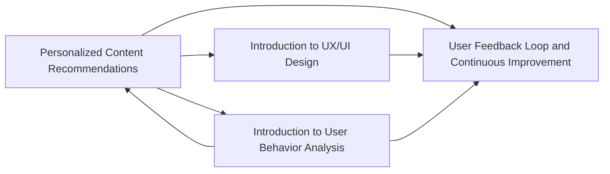

                 

## 1. 背景介绍

在信息技术日新月异的今天，知识付费已经成为大众获取高质量教育资源的重要方式。程序员作为技术和产品的双重身份，在打造知识付费专栏的过程中，需要综合考虑教育学、心理学、用户体验设计等多方面的知识。本文将介绍如何从零开始，逐步构建一个高质量、高粘性的程序员知识付费专栏。

## 2. 核心概念与联系

### 2.1 核心概念概述

- **知识付费专栏**：基于专业知识和技能，提供有价值、系统化的学习资源，通过订阅、付费等方式获取的专栏。
- **内容生产**：专栏的核心，包括内容创意、素材收集、内容编排等。
- **交互设计**：用户与专栏的互动方式，影响用户粘性和满意度。
- **技术支持**：专栏内容的展示、分发和维护，涉及Web开发、云服务、数据分析等技术。

这些概念之间的联系紧密：内容生产是核心，技术支持是基础，而良好的交互设计则起到连接用户和内容的桥梁作用。

### 2.2 核心概念原理和架构的 Mermaid 流程图



这个流程图展示了内容生产、用户行为分析、用户体验设计和技术基础设施之间的联系，以及它们如何共同作用于知识付费专栏的成功。

## 3. 核心算法原理 & 具体操作步骤

### 3.1 算法原理概述

知识付费专栏的构建涉及多个核心算法，包括：

- **个性化推荐算法**：根据用户的行为数据，推荐符合其兴趣的内容。
- **内容分析算法**：对内容进行结构化处理，提取关键词、主题等信息。
- **交互设计算法**：设计用户界面，提升用户的操作体验。
- **用户行为预测算法**：预测用户可能采取的行为，优化用户互动。

### 3.2 算法步骤详解

#### 3.2.1 个性化推荐算法

**步骤**：
1. 收集用户数据，包括浏览历史、搜索行为、评分和评论等。
2. 使用协同过滤、内容过滤或混合过滤等方法，构建用户-物品评分矩阵。
3. 通过矩阵分解、奇异值分解或基于梯度的优化算法，找出用户和物品的潜在特征。
4. 根据潜在特征，预测用户对未交互物品的评分。
5. 按照评分排序，推荐高分物品。

**推荐系统**：可以使用TensorFlow或PyTorch等深度学习框架实现，如Google的Wide & Deep模型、Amazon的DeepFM模型。

#### 3.2.2 内容分析算法

**步骤**：
1. 对文本进行分词、去除停用词、词干提取等预处理。
2. 使用TF-IDF、LDA、Word2Vec等算法，提取文本的关键词、主题或语义向量。
3. 对关键词或主题进行统计分析，找出热点和趋势。

**工具**：Natural Language Toolkit (NLTK)、Gensim、spaCy等。

#### 3.2.3 交互设计算法

**步骤**：
1. 使用用户行为数据，如点击率、停留时间、转化率等，分析用户对不同界面元素的使用情况。
2. 根据分析结果，优化用户界面设计，提升用户体验。
3. 进行A/B测试，比较不同设计方案的效果。

**工具**：Hotjar、Google Analytics等。

#### 3.2.4 用户行为预测算法

**步骤**：
1. 收集用户行为数据，包括点击、购买、收藏等。
2. 使用回归模型、随机森林、神经网络等方法，训练预测模型。
3. 根据预测结果，优化推荐和广告投放策略。

**工具**：Scikit-learn、TensorFlow、XGBoost等。

### 3.3 算法优缺点

#### 3.3.1 个性化推荐算法的优缺点

**优点**：
- 可以提供高度个性化的内容推荐，提升用户粘性。
- 有助于挖掘潜在用户，扩大市场份额。

**缺点**：
- 用户行为数据的隐私问题。
- 算法模型的准确性和实时性问题。

#### 3.3.2 内容分析算法的优缺点

**优点**：
- 可以快速提取文本的核心信息，提升内容质量。
- 有助于发现热点话题和趋势，增强内容的相关性。

**缺点**：
- 对数据质量和处理复杂度要求较高。
- 分析结果的解释性较差。

#### 3.3.3 交互设计算法的优缺点

**优点**：
- 可以提升用户的操作体验，降低流失率。
- 有助于提高转化率和用户满意度。

**缺点**：
- 设计过程需要大量试验和迭代。
- 设计效果受用户群体多样性的影响。

#### 3.3.4 用户行为预测算法的优缺点

**优点**：
- 可以预测用户行为，优化推荐策略。
- 有助于控制广告投放的成本和效果。

**缺点**：
- 预测模型的准确性受数据质量和模型选择的影响。
- 预测结果的解释性较差。

### 3.4 算法应用领域

这些算法可以应用于多种场景：

- 电商网站的个性化推荐。
- 内容聚合平台的个性化内容推荐。
- 在线教育平台的用户行为分析和个性化学习推荐。
- 社交媒体平台的个性化内容推荐和用户行为预测。

## 4. 数学模型和公式 & 详细讲解 & 举例说明

### 4.1 数学模型构建

以个性化推荐算法为例，数学模型为：

$$
R_{ui} = \sum_{j=1}^D \theta_{uj} \times X_{ij}
$$

其中 $R_{ui}$ 为用户 $u$ 对物品 $i$ 的评分，$\theta_{uj}$ 为用户的潜在特征向量，$X_{ij}$ 为物品 $i$ 的特征向量，$D$ 为特征维度。

### 4.2 公式推导过程

将 $R_{ui}$ 展开，得到：

$$
R_{ui} = \theta_u \cdot X_i
$$

其中 $\theta_u$ 为用户 $u$ 的潜在特征向量，$X_i$ 为物品 $i$ 的特征向量。

### 4.3 案例分析与讲解

以Amazon的DeepFM模型为例，该模型结合了FM因子和深度神经网络，可以处理高维稀疏数据。其核心公式为：

$$
\hat{y} = \hat{y}_{linear} + \sum_{j=1}^M \hat{y}_j
$$

其中 $\hat{y}_{linear}$ 为线性部分，$\hat{y}_j$ 为深度部分的第 $j$ 个神经元输出。

## 5. 项目实践：代码实例和详细解释说明

### 5.1 开发环境搭建

使用Python和Flask框架搭建知识付费专栏的开发环境：

1. 安装Python、Flask和相关库。
2. 创建虚拟环境。
3. 编写数据管理脚本，处理数据收集、清洗和存储。
4. 编写推荐算法脚本，使用TensorFlow或PyTorch实现推荐模型。
5. 编写交互设计脚本，使用JavaScript和HTML进行页面设计。

### 5.2 源代码详细实现

以下是一个简单的Flask应用示例，用于推荐系统的前端实现：

```python
from flask import Flask, render_template
import pandas as pd

app = Flask(__name__)

@app.route('/')
def index():
    data = pd.read_csv('data.csv')
    # 对数据进行预处理和分析
    # 使用推荐算法进行推荐
    recommendations = recommend(data)
    return render_template('index.html', recommendations=recommendations)

if __name__ == '__main__':
    app.run(debug=True)
```

### 5.3 代码解读与分析

- 使用Flask框架创建Web应用。
- 加载数据文件，对数据进行预处理和分析。
- 使用推荐算法进行推荐，并将结果传递到前端页面。
- 使用HTML和JavaScript渲染页面，展示推荐结果。

### 5.4 运行结果展示

运行Flask应用，即可在浏览器中看到推荐结果。推荐结果应根据用户行为数据进行动态更新，以提升推荐效果。

## 6. 实际应用场景

### 6.1 电商平台

电商平台可以使用个性化推荐算法，为用户推荐感兴趣的商品。用户行为数据包括浏览历史、购买记录和评分等。推荐系统可以使用TensorFlow的Wide & Deep模型，将用户行为和商品属性结合，生成个性化推荐。

### 6.2 内容聚合平台

内容聚合平台可以使用内容分析算法，对用户输入的关键词或话题进行自动分类和推荐。使用NLTK和Gensim等工具，提取文本的核心信息和热点话题，提升内容的相关性和吸引力。

### 6.3 在线教育平台

在线教育平台可以使用个性化学习推荐算法，为用户推荐符合其学习风格和知识点的课程。用户行为数据包括浏览历史、学习时间和课程评分等。推荐系统可以使用协同过滤或内容过滤算法，生成个性化学习路径。

### 6.4 社交媒体平台

社交媒体平台可以使用用户行为预测算法，预测用户的活跃时间和关注点，优化内容发布和广告投放。用户行为数据包括发布时间、互动率和关注用户等。预测模型可以使用随机森林或神经网络算法，生成精准的预测结果。

## 7. 工具和资源推荐

### 7.1 学习资源推荐

- **在线课程**：Coursera、Udacity等平台提供的数据科学、机器学习和Web开发课程。
- **书籍**：《Python数据科学手册》、《深度学习》、《Web前端开发实战》等。
- **博客和社区**：Kaggle、GitHub、Stack Overflow等平台提供丰富的学习资源和社区支持。

### 7.2 开发工具推荐

- **Python**：开源且社区活跃，适合开发Web应用和数据分析。
- **Flask**：轻量级的Web框架，适合快速开发和部署。
- **TensorFlow**：深度学习框架，适合构建推荐系统和内容分析模型。
- **PyTorch**：深度学习框架，适合构建个性化推荐和交互设计算法。

### 7.3 相关论文推荐

- **个性化推荐系统**：《Item2Vec: Collaborative Filtering Factorization with User-Item Correlations》。
- **内容分析**：《LDA: Latent Dirichlet Allocation》。
- **交互设计**：《Designing Interactive Systems》。
- **用户行为预测**：《Predictive Modeling with Time Series Data》。

## 8. 总结：未来发展趋势与挑战

### 8.1 研究成果总结

本文介绍了知识付费专栏的核心概念和关键算法，包括个性化推荐、内容分析、交互设计和用户行为预测等。这些算法共同作用于知识付费专栏的构建，提升了用户体验和平台价值。

### 8.2 未来发展趋势

- **大数据分析**：随着数据量的不断增长，大数据分析将更深入地应用于推荐系统。
- **人工智能技术**：深度学习、强化学习等AI技术将进一步提升推荐系统的精度和效果。
- **实时计算**：流式计算和实时分析技术将提升推荐系统的实时性和动态性。
- **跨平台应用**：知识付费专栏将拓展到多个平台，如Web、移动端和社交媒体。

### 8.3 面临的挑战

- **隐私和安全**：用户数据隐私和安全问题需严格保障。
- **模型透明性**：推荐系统的透明度和可解释性需加强。
- **用户粘性**：提高用户粘性和平台留存率仍需努力。

### 8.4 研究展望

- **深度融合**：AI技术和人类智慧的深度融合，提升推荐系统的智能化水平。
- **跨领域应用**：知识付费专栏将拓展到更多领域，如健康、教育、金融等。
- **个性化服务**：提供更多个性化服务，如虚拟助教、个性化课程定制等。

## 9. 附录：常见问题与解答

**Q1: 如何确保推荐系统的准确性和实时性？**

A: 使用高性能计算资源和实时数据处理技术，如流式计算、分布式存储等，提升推荐系统的实时性和准确性。

**Q2: 用户数据的隐私和安全如何保障？**

A: 严格遵循数据保护法规，如GDPR等，对用户数据进行加密和匿名处理。

**Q3: 如何提升推荐系统的透明度和可解释性？**

A: 使用可解释的机器学习算法，如决策树、线性回归等，提升模型的可解释性。

**Q4: 如何提高用户粘性？**

A: 设计吸引用户的UI界面，增加互动元素和激励机制，如积分系统、排行榜等。

**Q5: 如何优化推荐算法？**

A: 使用A/B测试和用户反馈，不断优化推荐算法，提升推荐效果。

---

作者：禅与计算机程序设计艺术 / Zen and the Art of Computer Programming

