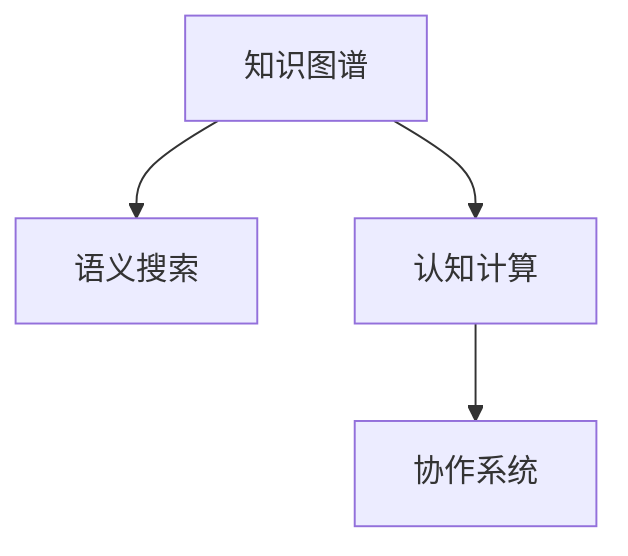

                 

# 程序员如何构建个人知识管理系统(PKM)

在数字化时代，知识已经成为了一种最宝贵的资产。对于程序员而言，随着技术日新月异，新概念、新工具、新技术层出不穷。如何在瞬息万变的技术海洋中保持知识的更新和应用，是每位程序员都需要解决的重要问题。个人知识管理系统(PKM)，即是通过系统化的方法管理和应用个人知识的工具，可以帮助程序员高效获取、整理、存储和应用知识，提升工作效率和学习效果。本文将系统介绍PKM的构建原理与实践方法，以助程序员构建属于自己的知识宝库。

## 1. 背景介绍

### 1.1 问题由来
互联网时代，信息爆炸使得知识获取变得容易，但同时也带来了“信息过载”的挑战。程序员需要从海量信息中筛选出对自己有用的知识，并将其系统化存储和高效应用。传统知识管理工具，如笔记本、思维导图等，虽然功能丰富，但难以适应程序员快速迭代、不断更新的知识需求。因此，构建个性化的PKM系统成为提升个人工作效率和学习效率的关键。

### 1.2 问题核心关键点
PKM系统构建的核心在于如何高效组织、存储、检索和管理个人知识。关键点包括：
- **知识采集**：自动获取并分类整理各类知识源，如代码片段、技术博客、技术文档等。
- **知识存储**：系统化地存储各类知识，形成结构化的知识库。
- **知识检索**：提供高效的查询接口，方便快速定位所需知识。
- **知识应用**：将知识转化为可执行的工具、代码片段或工作流程，加速日常工作。

### 1.3 问题研究意义
构建有效的PKM系统，对于程序员而言，具有以下重要意义：
- **提升效率**：自动化地收集、分类、整理知识，减少重复性工作。
- **加速学习**：快速定位所需知识，提高学习效率。
- **推动创新**：将零散的知识汇聚整合，形成新的解决方案。
- **促进协作**：知识共享和交流，提升团队协作效率。
- **保持更新**：及时获取最新技术动态，保持知识的前沿性。

## 2. 核心概念与联系

### 2.1 核心概念概述

为了更好地理解PKM系统的构建原理，本文将介绍几个关键概念：

- **知识图谱**：一种用于描述实体、关系、属性等知识的结构化表示方法，能够直观地展示知识的关联和层次结构。
- **语义搜索**：基于知识图谱的搜索方法，能够理解查询中的语义，并提供与查询最相关的知识。
- **认知计算**：将认知心理学和计算机科学相结合，研究如何通过计算机模拟人类认知过程，提高知识管理的效果。
- **协作系统**：支持多人协作的知识管理平台，能够实现知识共享、讨论、编辑等功能。

这些概念之间通过知识图谱进行紧密联系，共同构成PKM系统的核心框架。

### 2.2 核心概念原理和架构的 Mermaid 流程图



该图展示了知识图谱、语义搜索、认知计算和协作系统之间的联系。知识图谱作为PKM系统的基础，提供知识的结构化表示；语义搜索和认知计算通过对知识的理解和推理，提高搜索和知识应用的效率；协作系统则实现多人协作和知识共享。

## 3. 核心算法原理 & 具体操作步骤

### 3.1 算法原理概述

PKM系统构建的核心算法主要涉及知识图谱的构建、语义搜索的实现和认知计算的应用。以下详细介绍这些核心算法原理：

#### 3.1.1 知识图谱构建

知识图谱通过实体-关系-属性三元组的形式，描述知识的结构化表示。知识图谱的构建通常分为两个步骤：实体抽取和关系抽取。

- **实体抽取**：从文本中识别出具体的实体，如人名、地名、组织名等。常用的实体抽取方法包括基于规则的方法、基于机器学习的方法和基于深度学习的方法。
- **关系抽取**：识别实体之间的关系，如“is-a”、“has-a”等。关系抽取通常采用基于规则的方法、基于图模型的方法和基于深度学习的方法。

#### 3.1.2 语义搜索

语义搜索通过对查询语句进行语义理解和推理，提供与查询意图最相关的搜索结果。常用的语义搜索方法包括基于知识图谱的搜索、基于本体的搜索和基于机器学习的搜索。

#### 3.1.3 认知计算

认知计算通过模拟人类认知过程，提高知识管理的效率和效果。常见的认知计算方法包括基于规则的方法、基于知识图谱的方法和基于深度学习的方法。

### 3.2 算法步骤详解

#### 3.2.1 知识图谱构建

1. **实体抽取**：使用自然语言处理(NLP)技术，从文本中识别出具体的实体。常用的工具包括NLTK、spaCy和Stanford NER。
2. **关系抽取**：对抽取出的实体对进行关系分类，构建实体-关系图谱。常用的工具包括OpenIE和FactBows。

#### 3.2.2 语义搜索

1. **查询处理**：使用NLP技术对查询语句进行分词、词性标注和命名实体识别。
2. **语义理解**：通过语义分析工具，如Stanford CoreNLP，理解查询的语义意图。
3. **知识检索**：在知识图谱中检索与查询意图相关的知识节点。

#### 3.2.3 认知计算

1. **规则应用**：基于预定义的规则，对知识进行推理和计算。
2. **深度学习模型**：使用深度学习模型，如神经网络，对知识进行学习和推理。

### 3.3 算法优缺点

#### 3.3.1 优点

- **高效知识组织**：通过结构化的知识图谱，系统化地存储和组织知识，方便检索和应用。
- **智能化检索**：基于语义搜索技术，提供高效的查询结果，减少噪音和冗余。
- **认知计算支持**：通过认知计算方法，提高知识管理的智能化水平，促进知识创新和应用。

#### 3.3.2 缺点

- **构建复杂**：知识图谱和语义搜索的构建较为复杂，需要大量预处理和数据标注工作。
- **技术门槛高**：深度学习等高阶技术的应用，需要较强的技术背景和实践经验。
- **数据隐私问题**：构建PKM系统需要收集和处理大量数据，存在隐私保护和数据安全问题。

### 3.4 算法应用领域

PKM系统的应用领域广泛，涵盖以下几个方面：

- **技术文档管理**：系统化地存储和管理各类技术文档，方便快速检索。
- **代码片段管理**：自动收集和分类代码片段，形成代码库，加速代码开发。
- **知识库构建**：构建知识库，存储和共享各类专业知识，促进团队协作。
- **学习资源管理**：收集和整理各类学习资源，如博客、书籍、论文等，形成学习路径。

## 4. 数学模型和公式 & 详细讲解 & 举例说明

### 4.1 数学模型构建

知识图谱的构建可以通过图神经网络(Graph Neural Networks, GNNs)模型来实现。GNNs模型通过节点和边的编码，学习节点之间的关系，从而构建知识图谱。以下是一个简单的GNNs模型框架：

$$
H^{l+1} = \sigma(\hat{A}H^lW^l)
$$

其中 $H^l$ 表示第 $l$ 层的节点特征，$\hat{A}$ 表示节点关系的邻接矩阵，$W^l$ 表示第 $l$ 层的权重矩阵，$\sigma$ 表示激活函数。

### 4.2 公式推导过程

知识图谱的构建过程涉及图神经网络的训练和推理。以下简要推导GNNs模型的训练过程：

1. **节点特征初始化**：对于每个节点，从原始数据中提取特征向量 $X$，表示节点的属性和关系信息。
2. **邻接矩阵构建**：根据节点之间的关系，构建邻接矩阵 $\hat{A}$。
3. **节点特征更新**：通过GNNs模型，逐层更新节点特征 $H^l$。
4. **损失函数计算**：定义损失函数，如均方误差、交叉熵等，用于衡量模型预测与真实值之间的差异。
5. **模型训练**：通过反向传播算法，优化模型参数 $W^l$，最小化损失函数。

### 4.3 案例分析与讲解

以GitHub为例，分析如何使用PKM系统管理代码片段和项目文档。

1. **实体抽取**：从GitHub的代码和文档内容中，抽取关键词、变量名、函数名等实体。
2. **关系抽取**：根据抽取的实体，构建代码片段之间的关系图谱，如调用关系、依赖关系等。
3. **语义搜索**：在关系图谱中检索与查询意图相关的代码片段。
4. **认知计算**：基于代码片段和文档内容，进行代码生成、错误修复等认知计算。

## 5. 项目实践：代码实例和详细解释说明

### 5.1 开发环境搭建

为了实现PKM系统，需要搭建Python开发环境。以下是具体步骤：

1. **安装Python**：在Linux系统中，可以使用Ubuntu的包管理工具安装Python。在Windows系统中，可以使用Anaconda等Python发行版。
2. **安装必要的依赖库**：安装自然语言处理、深度学习、数据库等依赖库，如NLTK、spaCy、TensorFlow等。

### 5.2 源代码详细实现

以下是一个简单的Python代码示例，用于从GitHub的代码中抽取实体和关系：

```python
import requests
from bs4 import BeautifulSoup

# 获取GitHub项目的HTML页面
url = "https://github.com/tensorflow/tensorflow"
response = requests.get(url)
soup = BeautifulSoup(response.content, 'html.parser')

# 提取代码片段
codes = []
for code_cell in soup.find_all('code'):
    codes.append(code_cell.text)

# 提取变量名和函数名
vars = set()
funcs = set()
for code in codes:
    lines = code.split('\n')
    for line in lines:
        if 'var' in line or 'function' in line:
            tokens = line.split()
            if 'var' in tokens:
                var = tokens[1]
                vars.add(var)
            elif 'function' in tokens:
                func = tokens[2]
                funcs.add(func)

# 构建关系图谱
g = nx.Graph()
for var in vars:
    for func in funcs:
        g.add_edge(var, func)
```

### 5.3 代码解读与分析

上述代码实现了从GitHub项目中提取代码片段、变量名和函数名，并构建代码片段之间的关系图谱。代码中使用了BeautifulSoup库进行HTML页面解析，利用自然语言处理技术提取代码元素，并使用网络X库构建关系图谱。

### 5.4 运行结果展示

运行上述代码，可以生成一个关系图谱，展示了代码片段之间的关系。以下是一个简单的关系图谱示例：

```
- Python: 调用TensorFlow
- TensorFlow: 调用NumPy
- NumPy: 调用Matplotlib
```

## 6. 实际应用场景

### 6.1 技术文档管理

技术文档管理是PKM系统的重要应用场景之一。技术文档通常包含大量文本信息，需要系统化地存储和分类。通过PKM系统，可以自动收集和整理技术文档，形成文档库，方便快速检索和应用。

### 6.2 代码片段管理

代码片段管理是PKM系统的另一个重要应用场景。程序员在开发过程中，经常会使用各种代码片段。通过PKM系统，可以自动收集和分类代码片段，形成代码库，方便快速检索和重用。

### 6.3 知识库构建

知识库构建是PKM系统的高级应用场景。知识库通过系统化地存储各类专业知识，促进团队协作和知识共享。通过PKM系统，可以自动收集和整理各类知识，形成知识库，方便多人协作和共享。

### 6.4 学习资源管理

学习资源管理是PKM系统的另一个高级应用场景。学习资源通常包含各种博客、书籍、论文等，需要系统化地存储和分类。通过PKM系统，可以自动收集和整理学习资源，形成学习路径，方便快速检索和应用。

## 7. 工具和资源推荐

### 7.1 学习资源推荐

为了帮助开发者系统掌握PKM系统的构建原理和实践技巧，这里推荐一些优质的学习资源：

1. **《知识管理的艺术》**：介绍知识管理的理论基础和实践方法，适合初学者入门。
2. **《深度学习入门》**：介绍深度学习的基本概念和算法原理，适合PKM系统的技术实现。
3. **《Python数据科学手册》**：介绍Python数据科学工具和库的使用方法，适合PKM系统的数据处理和存储。
4. **Coursera的《自然语言处理》课程**：介绍自然语言处理的基本概念和技术方法，适合PKM系统的实体抽取和关系抽取。

### 7.2 开发工具推荐

为了提高PKM系统的开发效率，以下推荐几款常用的开发工具：

1. **Jupyter Notebook**：支持Python代码的交互式开发，方便调试和测试。
2. **GitHub**：提供代码托管和版本控制服务，方便团队协作。
3. **PyCharm**：提供Python IDE，支持代码自动补全、调试等高级功能。

### 7.3 相关论文推荐

为了深入了解PKM系统的理论基础和实践方法，以下是几篇经典的论文推荐：

1. **《知识图谱的构建与应用》**：介绍知识图谱的构建方法和应用场景。
2. **《基于深度学习的语义搜索》**：介绍基于深度学习的语义搜索方法。
3. **《认知计算与知识管理》**：介绍认知计算与知识管理的结合方法。

## 8. 总结：未来发展趋势与挑战

### 8.1 总结

本文系统介绍了PKM系统的构建原理与实践方法，涵盖知识图谱构建、语义搜索、认知计算等核心技术。通过实际项目实践，展示了PKM系统在技术文档管理、代码片段管理、知识库构建和学习资源管理等方面的应用。未来，PKM系统将在更多的领域得到应用，推动知识管理技术的进一步发展。

### 8.2 未来发展趋势

未来，PKM系统的发展趋势如下：

1. **智能化的知识图谱构建**：通过机器学习和深度学习技术，自动构建知识图谱，提高知识管理的智能化水平。
2. **多模态的知识表示**：将文本、图像、视频等多种模态的信息融合，构建多模态知识图谱，提高知识管理的广度和深度。
3. **个性化推荐系统**：利用推荐算法，根据用户的历史行为和兴趣，推荐相关的学习资源和知识节点。
4. **分布式计算**：利用分布式计算技术，提高知识管理的效率和扩展性。
5. **知识共享与协作**：通过PKM系统的协作功能，促进知识共享和团队协作，提升整体效率。

### 8.3 面临的挑战

PKM系统在发展过程中，还面临以下挑战：

1. **数据隐私问题**：PKM系统需要收集和处理大量数据，存在隐私保护和数据安全问题。
2. **技术门槛高**：深度学习等高阶技术的应用，需要较强的技术背景和实践经验。
3. **知识图谱构建复杂**：知识图谱的构建过程涉及实体抽取和关系抽取，需要大量预处理和数据标注工作。
4. **系统扩展性**：随着数据量的增加，PKM系统需要扩展到分布式环境中，提高系统的性能和可靠性。

### 8.4 研究展望

未来，PKM系统的研究展望如下：

1. **智能化的知识抽取和推理**：利用深度学习等技术，提高实体抽取和关系抽取的准确性，促进知识的自动推理和应用。
2. **知识图谱的实时更新**：通过数据流技术和事件驱动方法，实现知识图谱的实时更新和维护。
3. **多领域的知识管理**：将PKM系统应用于更多领域，如医疗、金融、教育等，推动不同行业的知识管理和发展。
4. **知识图谱与AI的融合**：将PKM系统与AI技术结合，提升知识管理的智能化和自动化水平。

## 9. 附录：常见问题与解答

**Q1：如何高效构建知识图谱？**

A: 构建知识图谱需要大量的实体和关系数据。可以通过爬虫技术从网络中获取数据，也可以使用现有的公开数据集。实体抽取可以使用自然语言处理技术，如NLTK、spaCy等，关系抽取可以使用图模型或深度学习模型，如OpenIE、FactBows等。

**Q2：如何优化语义搜索？**

A: 语义搜索的优化可以从以下方面入手：
1. **特征提取**：使用TF-IDF、Word2Vec等技术，提高查询结果的相关性。
2. **权重调整**：根据用户的历史查询记录，调整查询结果的权重，提供个性化推荐。
3. **查询扩展**：利用同义词、近义词等扩展查询词汇，提高查询的覆盖率。

**Q3：如何提高知识管理的智能化水平？**

A: 提高知识管理的智能化水平，需要引入深度学习等高阶技术，如GNNs、Transformer等，通过模型学习实体之间的关系，提高知识抽取和推理的准确性。

**Q4：如何保护数据隐私？**

A: 数据隐私保护可以通过以下方式实现：
1. **数据匿名化**：对数据进行匿名化处理，防止数据泄露。
2. **访问控制**：使用身份验证和授权机制，限制对数据的访问权限。
3. **数据加密**：对数据进行加密存储和传输，防止数据被非法获取。

**Q5：如何选择适合的知识图谱构建方法？**

A: 选择适合的知识图谱构建方法需要考虑数据源的特点和知识图谱的应用场景。常见的知识图谱构建方法包括基于规则的方法、基于图模型的方法和基于深度学习的方法。需要根据具体需求进行选择。

---

作者：禅与计算机程序设计艺术 / Zen and the Art of Computer Programming

