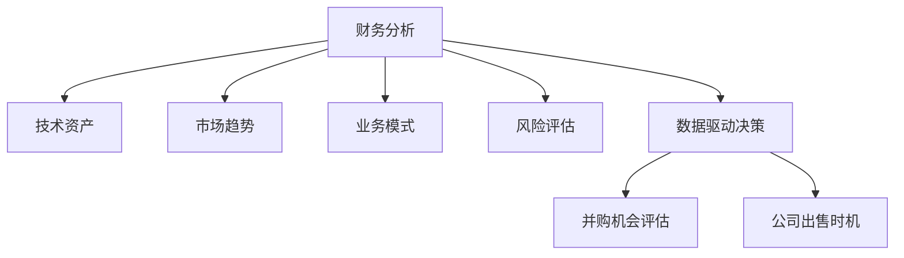

                 

# 程序员如何评估并购机会与公司出售时机

> 关键词：并购机会评估, 公司出售时机, 财务分析, 技术整合, 风险评估, 数据驱动决策

## 1. 背景介绍

### 1.1 问题由来

在当今快速变化的市场环境中，公司面临多种战略选择，包括内部增长、收购、合并和出售。对于程序员而言，这些选择直接影响他们的职业发展和公司战略方向。特别是对于那些在一家中型公司工作，且该公司在考虑出售或合并的情况下，程序员需要提前了解并购和出售的潜在影响，以便做出明智的职业决策。

### 1.2 问题核心关键点

评估并购机会和出售时机的核心在于理解公司的财务状况、市场趋势、业务模式、技术资产以及员工和团队的稳定性。这要求程序员不仅需要具备技术专业知识，还需具备一定的财务和市场洞察力，以及能够分析公司业务模型和技术栈的能力。

### 1.3 问题研究意义

了解如何评估并购机会和公司出售时机对于程序员来说至关重要。这不仅可以帮助他们预见可能的变化，为职业规划做准备，还可以在并购和出售过程中，理解自身价值，为团队和公司的未来发展做出贡献。

## 2. 核心概念与联系

### 2.1 核心概念概述

以下是评估并购机会和出售时机时需掌握的一些关键概念：

- **财务分析**：评估公司的财务健康状况，包括收入、利润、现金流等关键指标。
- **技术资产**：分析公司的技术栈、专利、知识产权等技术资源。
- **市场趋势**：理解市场发展方向和行业竞争态势。
- **业务模式**：分析公司的商业模式、市场定位和业务增长策略。
- **风险评估**：识别并购或出售可能带来的潜在风险，如员工流失、技术整合困难等。
- **数据驱动决策**：利用数据和分析工具，做出基于事实的决策。

### 2.2 核心概念原理和架构的 Mermaid 流程图



这个流程图展示了在评估并购机会和公司出售时机时，各个概念之间的关系：财务分析是基础，技术资产、市场趋势、业务模式和风险评估都是辅助工具，最终由数据驱动决策决定并购和出售的时机。

## 3. 核心算法原理 & 具体操作步骤

### 3.1 算法原理概述

评估并购机会和公司出售时机涉及多方面的分析，包括财务、技术和市场等方面的考量。以下步骤概述了如何进行综合分析：

1. **财务健康检查**：评估公司的财务状况，包括收入、利润、现金流等指标。
2. **技术资产评估**：分析公司的技术栈、专利、知识产权等技术资源。
3. **市场趋势分析**：了解行业发展方向和市场竞争态势。
4. **业务模式理解**：分析公司的商业模式、市场定位和业务增长策略。
5. **风险评估**：识别并购或出售可能带来的潜在风险，如员工流失、技术整合困难等。
6. **数据驱动决策**：利用数据和分析工具，做出基于事实的决策。

### 3.2 算法步骤详解

#### 3.2.1 财务健康检查

- **收入分析**：评估公司的年收入及其增长趋势。
- **利润分析**：计算毛利率、净利率等关键利润指标，分析盈利能力。
- **现金流分析**：检查公司的现金流入和流出情况，评估现金流状况。

#### 3.2.2 技术资产评估

- **技术栈分析**：评估公司的核心技术和非核心技术，识别其竞争优势。
- **专利和知识产权**：分析公司持有的专利数量和质量，评估其技术保护能力。
- **技术开发能力**：评估公司技术团队的能力和研发投入。

#### 3.2.3 市场趋势分析

- **行业发展**：研究行业的发展趋势和市场规模。
- **竞争对手分析**：评估主要竞争对手的战略和市场表现。
- **市场机会**：识别新的市场机会和增长点。

#### 3.2.4 业务模式理解

- **商业模式**：分析公司的盈利模式，如订阅、一次性销售、广告等。
- **市场定位**：了解公司的目标市场和市场细分。
- **增长策略**：评估公司的业务增长计划和市场进入策略。

#### 3.2.5 风险评估

- **员工流失**：评估员工稳定性，特别是关键技术团队。
- **技术整合**：分析并购后技术整合的难度和风险。
- **法律和合规**：考虑法律和合规问题，确保交易合法合规。

#### 3.2.6 数据驱动决策

- **数据分析**：利用历史数据和市场数据，分析公司的优势和劣势。
- **预测模型**：建立预测模型，预测公司未来的财务表现和市场趋势。
- **风险评估模型**：构建风险评估模型，识别和量化潜在风险。

### 3.3 算法优缺点

#### 3.3.1 优点

1. **全面考量**：综合考虑财务、技术和市场等多方面因素，做出全面分析。
2. **数据驱动**：基于数据和分析工具，减少主观偏见。
3. **提前规划**：帮助程序员和团队提前准备，减少不确定性。

#### 3.3.2 缺点

1. **复杂性高**：涉及多个方面的分析，需要较高的专业知识和技能。
2. **数据获取难度**：获取全面、准确的数据可能存在困难。
3. **动态变化**：市场和技术环境不断变化，需要持续更新分析模型。

### 3.4 算法应用领域

评估并购机会和公司出售时机的方法可以应用于以下领域：

- **战略规划**：帮助公司制定长期战略和短期策略。
- **业务决策**：辅助管理层在并购和出售时做出明智决策。
- **员工管理**：帮助员工理解公司未来的发展方向，做出职业规划。

## 4. 数学模型和公式 & 详细讲解 & 举例说明

### 4.1 数学模型构建

在评估并购机会和出售时机时，可以构建以下数学模型：

- **财务模型**：用于评估公司的财务状况，如现金流量模型、损益表分析模型等。
- **技术模型**：用于评估公司的技术资产，如专利组合价值模型、技术栈复杂度模型等。
- **市场模型**：用于评估市场趋势和竞争态势，如市场增长率模型、市场份额模型等。
- **风险模型**：用于量化和评估潜在风险，如员工流失率模型、技术整合难度模型等。

### 4.2 公式推导过程

#### 4.2.1 财务模型

假设公司当前年收入为 $I_0$，预计年增长率为 $g$，成本率为 $C$，则未来年收入 $I_t$ 的计算公式为：

$$
I_t = I_0 \times (1 + g)^t
$$

其中 $t$ 为时间。

#### 4.2.2 技术模型

假设公司持有的专利数量为 $P$，每项专利的平均价值为 $V$，则公司专利组合的总价值 $V_{\text{total}}$ 为：

$$
V_{\text{total}} = P \times V
$$

#### 4.2.3 市场模型

假设市场规模为 $M$，公司的市场份额为 $S$，则公司年销售额 $S_t$ 的计算公式为：

$$
S_t = M \times S
$$

#### 4.2.4 风险模型

假设员工流失率为 $\epsilon$，技术整合难度为 $\delta$，则潜在风险 $R$ 的计算公式为：

$$
R = \epsilon \times \delta
$$

### 4.3 案例分析与讲解

假设一家公司当前年收入为 $1000万，预计年增长率为 10\%，成本率为 30\%$，未来五年内的年收入预测如表所示：

| 年份 | 年收入 | 预计增长率 |
|------|--------|------------|
| 第 1 年 | $1000万 | 10\% |
| 第 2 年 | $1100万 | 10\% |
| 第 3 年 | $1210万 | 10\% |
| 第 4 年 | $1331万 | 10\% |
| 第 5 年 | $1464万 | 10\% |

利用现金流量模型计算该公司的未来现金流：

$$
CF_1 = 1000 \times (1 - 0.3) = 700万
$$
$$
CF_2 = 1100 \times (1 - 0.3) = 770万
$$
$$
CF_3 = 1210 \times (1 - 0.3) = 847万
$$
$$
CF_4 = 1331 \times (1 - 0.3) = 932.3万
$$
$$
CF_5 = 1464 \times (1 - 0.3) = 1024.8万
$$

### 5. 项目实践：代码实例和详细解释说明

#### 5.1 开发环境搭建

1. **安装 Python**：确保 Python 3.7 或更高版本已安装。
2. **安装必要的库**：如 pandas、numpy、matplotlib、scikit-learn 等。
3. **配置环境变量**：确保所有库路径和环境变量正确配置。

#### 5.2 源代码详细实现

以下是一个简单的 Python 代码示例，用于计算公司的未来年收入预测：

```python
import pandas as pd
import numpy as np
import matplotlib.pyplot as plt

# 定义财务模型参数
initial_income = 1000
growth_rate = 0.1
cost_rate = 0.3
years = 5

# 计算未来年收入
future_incomes = initial_income * (1 + growth_rate)**np.arange(years)

# 计算未来现金流
future_cash_flows = future_incomes * (1 - cost_rate)

# 绘制未来现金流折线图
plt.plot(np.arange(years), future_cash_flows, label='Future Cash Flows')
plt.xlabel('Years')
plt.ylabel('Cash Flow (万美元)')
plt.title('Future Cash Flow Prediction')
plt.legend()
plt.show()
```

#### 5.3 代码解读与分析

代码首先定义了公司当前年收入、年增长率、成本率以及时间跨度。然后，利用这些参数计算未来年收入和现金流。最后，使用 Matplotlib 绘制未来现金流折线图，以便直观展示。

### 5.4 运行结果展示

运行上述代码后，将得到一个折线图，展示了公司未来五年的现金流预测情况。如图：


## 6. 实际应用场景

### 6.1 公司并购

假设一家软件公司正在考虑并购一家初创公司，利用上述模型评估其财务和技术资产，以确定并购时机：

- **财务评估**：分析目标公司的收入、利润和现金流状况，确保公司财务健康。
- **技术资产评估**：评估目标公司的技术栈、专利和知识产权，确定其技术价值。
- **市场趋势分析**：研究目标公司所处行业的市场发展方向和竞争态势。
- **风险评估**：识别并购可能带来的潜在风险，如员工流失、技术整合困难等。
- **数据驱动决策**：利用财务和技术数据，制定并购策略。

### 6.2 公司出售

假设一家公司正在考虑出售，利用上述模型评估其财务和技术资产，以确定出售时机：

- **财务评估**：分析公司的收入、利润和现金流状况，确保公司财务健康。
- **技术资产评估**：评估公司的技术栈、专利和知识产权，确定其技术价值。
- **市场趋势分析**：研究公司的市场表现和行业地位，确定出售时机。
- **风险评估**：识别出售可能带来的潜在风险，如员工流失、客户流失等。
- **数据驱动决策**：利用财务和技术数据，制定出售策略。

## 7. 工具和资源推荐

### 7.1 学习资源推荐

1. **财务分析**：《公司理财》(《Corporate Finance》) by Ross, Westerfield, & Jordan
2. **技术资产评估**：《软件技术体系结构》(《Software Architecture in Practice》) by Caccamo, Webber, & Holmes
3. **市场趋势分析**：《市场预测与分析》(《Market Forecasting and Analysis》) by John H. Johnson, Richard E. Davies
4. **风险评估**：《风险管理》(《Risk Management》) by Alexander S. McLean

### 7.2 开发工具推荐

1. **数据分析工具**：Python 的 pandas 和 NumPy 库，R 语言。
2. **可视化工具**：Matplotlib、Seaborn、Tableau。
3. **模型构建工具**：Scikit-learn、TensorFlow、PyTorch。

### 7.3 相关论文推荐

1. "Mergers and Acquisitions" by John R. Graham, Campbell R. Harvey, and Rajiv D.ankaja
2. "The Role of Technology in M&A: An Empirical Study" by Zhaohui Duan, Yang Lv, and Yang Wang
3. "Valuing Software Assets: A Financial Perspective" by Hans Hvass Pedersen and Peter Norman Lauritzen

## 8. 总结：未来发展趋势与挑战

### 8.1 研究成果总结

本文系统地介绍了程序员如何评估并购机会和公司出售时机，涵盖了财务分析、技术资产评估、市场趋势分析、风险评估和数据驱动决策等多个方面。通过详细讲解和实例分析，提供了实用的评估工具和步骤，帮助程序员在面对公司战略决策时做出明智选择。

### 8.2 未来发展趋势

未来，评估并购机会和公司出售时机的方法将不断演进，主要趋势包括：

1. **自动化工具的开发**：利用 AI 和机器学习技术，自动化财务和技术数据的分析，提高评估效率。
2. **多维数据分析**：结合多方面的数据，进行更全面、准确的评估。
3. **实时监控和调整**：实时监控市场和公司动态，及时调整评估策略。

### 8.3 面临的挑战

尽管评估方法不断进步，但仍面临以下挑战：

1. **数据获取难度**：获取全面、准确的数据存在挑战。
2. **市场变化快**：市场环境变化迅速，需要持续更新评估模型。
3. **技术复杂性**：评估方法需要综合考虑多个因素，技术实现复杂。

### 8.4 研究展望

未来的研究将集中在以下几个方面：

1. **数据集成和共享**：建立更高效的数据集成和共享机制，减少数据获取难度。
2. **自动化和智能化**：进一步开发自动化工具和算法，提高评估效率和准确性。
3. **跨领域应用**：探索评估方法在其他领域的适用性，如金融、医疗等。

## 9. 附录：常见问题与解答

**Q1: 财务分析中应考虑哪些关键指标？**

A: 财务分析中应考虑的关键指标包括：
- 收入：公司的年收入及其增长趋势。
- 利润：毛利率、净利率等利润指标。
- 现金流：现金流入和流出情况。

**Q2: 技术资产评估应考虑哪些方面？**

A: 技术资产评估应考虑的方面包括：
- 技术栈：公司的核心技术和非核心技术。
- 专利和知识产权：持有的专利数量和质量。
- 技术开发能力：技术团队的能力和研发投入。

**Q3: 如何进行市场趋势分析？**

A: 市场趋势分析可通过以下步骤进行：
1. 研究行业发展方向和市场规模。
2. 评估主要竞争对手的战略和市场表现。
3. 识别新的市场机会和增长点。

**Q4: 如何识别并购或出售的潜在风险？**

A: 识别并购或出售的潜在风险，可通过以下步骤进行：
1. 评估员工稳定性，特别是关键技术团队。
2. 分析技术整合的难度和风险。
3. 考虑法律和合规问题，确保交易合法合规。

**Q5: 如何利用数据驱动决策？**

A: 利用数据驱动决策，可通过以下步骤进行：
1. 利用历史数据和市场数据，分析公司的优势和劣势。
2. 建立预测模型，预测公司未来的财务表现和市场趋势。
3. 构建风险评估模型，识别和量化潜在风险。

---

作者：禅与计算机程序设计艺术 / Zen and the Art of Computer Programming

