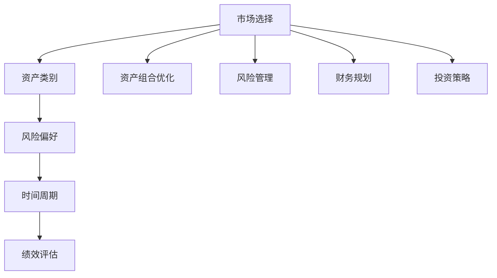

                 

# 程序员如何进行国际资产配置

> 关键词：国际资产配置, 资产组合优化, 风险管理, 财务规划, 投资策略

## 1. 背景介绍

### 1.1 问题由来

在当今全球化的商业环境中，企业在全球范围内的经营活动日益频繁，这就意味着需要对国际资产进行配置，以实现资金的最优利用和风险的有效控制。然而，面对复杂多变的国际市场，如何科学合理地进行资产配置，成为了一个挑战。

### 1.2 问题核心关键点

国际资产配置的核心在于实现资本的全球化分散投资，以降低单一市场的风险，同时获取多元化的投资回报。通常涉及以下几个关键点：
- **市场选择**：在哪些市场进行投资，如美国、欧洲、亚洲等。
- **资产类别**：在股票、债券、商品等不同类型的资产中进行分配。
- **风险偏好**：根据风险承受能力来设定投资组合的波动性水平。
- **时间周期**：设定长期或短期投资目标，以匹配不同的时间窗口。
- **绩效评估**：衡量资产配置的效果，是否达到了既定的财务目标。

### 1.3 问题研究意义

国际资产配置对于企业来说具有重要意义：
- **分散风险**：通过在全球多个市场投资，减少单一市场的不确定性，降低整体投资组合的波动性。
- **提高回报**：通过多样化的资产类别和投资策略，提升整体资产的收益率。
- **应对全球经济波动**：全球市场的联动性使得单一市场的波动可能波及其他市场，国际资产配置有助于抵御全球经济的不确定性。
- **财务稳定性**：通过科学的财务规划，确保企业的资本运作与财务目标一致，提升企业的长期财务健康状况。

## 2. 核心概念与联系

### 2.1 核心概念概述

国际资产配置涉及到多个关键概念，主要包括以下几个方面：

- **资产组合优化 (Portfolio Optimization)**：通过量化分析，找到最优的投资组合，最大化回报并最小化风险。
- **风险管理 (Risk Management)**：评估并控制投资组合的风险水平，确保投资策略符合企业的风险承受能力。
- **财务规划 (Financial Planning)**：根据企业的财务目标和市场状况，制定合理的投资策略和预算计划。
- **投资策略 (Investment Strategy)**：结合市场分析和企业目标，选择和调整投资组合中的资产类别、权重和投资周期。

这些概念之间存在紧密联系，共同构成了国际资产配置的框架。资产组合优化是核心技术手段，而风险管理和财务规划则提供了评估和决策的框架。投资策略则是这些理论和方法在实际市场环境中的具体应用。

### 2.2 核心概念原理和架构的 Mermaid 流程图



这个流程图展示了国际资产配置的关键环节及其相互关系。市场选择和资产类别设置之后，需结合企业的风险承受能力和投资周期，通过资产组合优化和风险管理来构建合适的投资组合。最后，通过财务规划和投资策略的指导，将理论应用到实际市场操作中，并通过绩效评估来调整优化策略。

## 3. 核心算法原理 & 具体操作步骤

### 3.1 算法原理概述

国际资产配置的核心算法原理主要基于现代金融理论中的投资组合优化和风险管理理论，这些理论提供了优化资产配置的数学模型和计算方法。

#### 3.1.1 投资组合优化

投资组合优化的基本目标是找到一个最优的资产配置，使得预期收益率最大化，同时满足投资者设定的风险承受能力。常用的优化模型包括：
- **马科维茨投资组合理论**：通过方差-协方差矩阵来描述资产之间的相关性，利用优化算法找到最小化波动率的最大化回报的资产组合。
- **资本资产定价模型 (CAPM)**：假设所有投资者都是风险厌恶的，通过均衡价格和风险溢价来描述资产的定价关系。

#### 3.1.2 风险管理

风险管理的目标是通过量化分析，识别和控制投资组合中存在的系统性风险和非系统性风险，从而确保投资策略符合企业的风险承受能力。常用的风险管理方法包括：
- **价值 at Risk (VaR)**：计算在一定置信水平下，投资组合可能发生的最大亏损。
- **压力测试 (Stress Testing)**：通过模拟极端市场环境，评估投资组合在极端情况下的表现。

#### 3.1.3 财务规划

财务规划主要涉及企业的长期财务目标，如资本保值增值、现金流管理等。其核心是财务预算的制定和资金流的管理。

### 3.2 算法步骤详解

#### 3.2.1 确定投资目标和预算

首先，需要明确企业的投资目标和预算限制。投资目标可能包括资本增值、现金流管理、资产保值等。预算限制则包括总资金规模和风险承受能力。

#### 3.2.2 市场选择和资产类别设定

根据企业的投资目标和预算，选择合适的国际市场和资产类别。通常会考虑以下几个方面：
- **市场规模**：选择市值较大的市场，如美国、中国、欧盟等。
- **经济稳定性**：选择政治、经济环境相对稳定的市场，如北欧国家。
- **资产类别**：包括股票、债券、商品、房地产等。

#### 3.2.3 构建投资组合

使用优化算法，根据市场选择和资产类别设定，构建初步的资产组合。常用的优化方法包括：
- **均值-方差优化**：通过最小化方差，最大化投资组合的预期收益率。
- **风险平价 (Risk Parity)**：使不同资产的风险贡献相等，从而实现风险的均匀分布。

#### 3.2.4 风险评估与管理

评估构建的资产组合的风险水平，确保其符合企业的风险承受能力。常用的风险评估方法包括：
- **历史波动性**：通过历史数据计算资产组合的波动率。
- **最大回撤 (Maximum Drawdown)**：计算资产组合在一定时间内的最大亏损。

#### 3.2.5 绩效评估与调整

定期评估资产组合的实际表现，与预期目标进行比较，根据评估结果调整投资策略。常用的评估指标包括：
- **夏普比率 (Sharpe Ratio)**：衡量投资组合的超额回报与系统风险之间的平衡。
- **信息比率 (Information Ratio)**：衡量投资组合的超额回报与非系统风险之间的平衡。

#### 3.2.6 持续监控与调整

市场环境不断变化，需要持续监控投资组合的表现，并根据市场情况和投资目标进行动态调整。

### 3.3 算法优缺点

#### 3.3.1 优点

- **量化决策**：通过数学模型进行优化，减少了主观判断，提高了决策的科学性。
- **多样性**：通过跨市场的投资，降低了单一市场风险，提高了整体组合的稳定性。
- **透明性**：通过明确的量化指标，能够更好地监控和评估投资组合的表现。

#### 3.3.2 缺点

- **复杂性**：构建和优化投资组合需要较高的数学和统计知识，对技术人员的要求较高。
- **数据依赖**：需要大量高质量的历史市场数据和资产数据，数据获取和处理难度较大。
- **市场变化**：市场环境变化迅速，模型需要及时更新以保持有效性。

### 3.4 算法应用领域

国际资产配置的算法和技术广泛应用于以下几个领域：

- **企业财务**：大型跨国公司的国际资产配置，通过科学管理实现资本保值增值。
- **投资银行**：为客户提供投资组合优化和风险管理服务，帮助其构建适合自身风险偏好的资产配置。
- **资产管理**：量化基金和资产管理公司，通过复杂的算法和模型，进行多市场、多资产的投资组合优化。

## 4. 数学模型和公式 & 详细讲解 & 举例说明

### 4.1 数学模型构建

#### 4.1.1 投资组合优化模型

假设有一组资产 $i=1,\ldots,n$，其期望收益率和方差分别为 $\mu_i$ 和 $\sigma_i^2$。构建一个由 $w_i$ 表示的资产权重向量，表示资产 $i$ 在投资组合中的权重。投资组合的期望收益率和方差可以表示为：

$$
\mu_P = \sum_{i=1}^{n} w_i \mu_i
$$

$$
\sigma_P^2 = \sum_{i=1}^{n} w_i \sigma_i^2 + \sum_{i=1}^{n} \sum_{j=1}^{n} w_i w_j \rho_{ij} \sigma_i \sigma_j
$$

其中 $\rho_{ij}$ 为资产 $i$ 和 $j$ 之间的相关系数。

目标是最小化投资组合的波动率，同时最大化预期收益率。这可以通过求解以下优化问题来实现：

$$
\begin{aligned}
& \min_{\mathbf{w}} \frac{1}{2} \mathbf{w}^T \Sigma \mathbf{w} \\
& \text{s.t.} \quad \mathbf{A}\mathbf{w} = \mathbf{b}
\end{aligned}
$$

其中 $\Sigma$ 是相关系数矩阵，$\mathbf{A}$ 是资产收益率的线性约束矩阵，$\mathbf{b}$ 是约束条件向量。

#### 4.1.2 风险管理模型

风险管理模型通常使用价值 at Risk (VaR) 来评估资产组合的潜在损失。VaR 定义为在给定置信水平 $\alpha$ 下，投资组合的最大预期损失：

$$
\text{VaR}_{\alpha} = \mathbb{E}[X] - \frac{1}{1-\alpha} \mathbb{P}(X > \mathbb{E}[X])
$$

其中 $X$ 为投资组合的回报，$\mathbb{E}[X]$ 和 $\mathbb{P}(X > \mathbb{E}[X])$ 分别表示投资组合的期望回报和超过期望回报的概率。

### 4.2 公式推导过程

#### 4.2.1 投资组合优化推导

以马科维茨模型为例，假设市场由两种资产构成，分别为股票和债券。股票的期望收益率为 $r_s$，波动率为 $\sigma_s$，债券的期望收益率为 $r_b$，波动率为 $\sigma_b$。构建投资组合，其期望收益率和波动率可以表示为：

$$
\mu_P = w_s r_s + w_b r_b
$$

$$
\sigma_P^2 = w_s^2 \sigma_s^2 + w_b^2 \sigma_b^2 + 2w_s w_b \rho_{sb} \sigma_s \sigma_b
$$

目标是最小化波动率，最大化期望收益率，约束条件为 $w_s + w_b = 1$（资产总权重为1）。求解该优化问题，得到最优权重向量 $w_s$ 和 $w_b$：

$$
w_s = \frac{\sigma_b \rho_{sb}}{\sigma_s^2 - \sigma_b^2 \rho_{sb}^2}
$$

$$
w_b = \frac{\sigma_s \rho_{sb}}{\sigma_s^2 - \sigma_b^2 \rho_{sb}^2}
$$

#### 4.2.2 风险管理推导

以计算股票投资组合的 VaR 为例，假设股票的日收益率服从正态分布，股票的波动率为 $\sigma_s$，置信水平为 $95\%$。根据 VaR 的定义，有：

$$
VaR_{0.05} = \mathbb{E}[X] - \frac{1}{1-0.05} \mathbb{P}(X > \mathbb{E}[X])
$$

其中 $X$ 为日收益率的累积分布函数 (CDF)，$\mathbb{E}[X] = \mu$ 为日收益率的期望。

假设股票的日波动率为 $\sigma_s$，则有：

$$
\mathbb{P}(X > \mathbb{E}[X]) = 1 - CDF(\frac{\mu - VaR_{0.05}}{\sigma_s})
$$

带入 VaR 的定义，解得：

$$
VaR_{0.05} = \mu - \frac{(1-0.05) \cdot CDF^{-1}(1 - \mathbb{P}(X > \mathbb{E}[X]))}{\sigma_s}
$$

### 4.3 案例分析与讲解

#### 4.3.1 股票与债券的投资组合优化

假设某企业有 1000 万美元可用于投资，可以选择投资于股票和债券。股票的期望收益率为 7%，波动率为 15%；债券的期望收益率为 3%，波动率为 1%。根据马科维茨模型，通过求解优化问题，得到最优的资产配置比例为：

$$
w_s = \frac{1 \times 1.15}{1.15^2 - 1^2 \times 0.15} = 0.67
$$

$$
w_b = \frac{0.1 \times 1.15}{1.15^2 - 1^2 \times 0.15} = 0.33
$$

该企业的投资组合期望收益率为 $7\% \times 0.67 + 3\% \times 0.33 = 5.94\%$，波动率为 $0.67^2 \times 1.15^2 + 0.33^2 \times 1^2 + 2 \times 0.67 \times 0.33 \times 1.15 \times 1 = 1.15\%$。

#### 4.3.2 股票投资组合的风险管理

假设股票的日波动率为 1%，企业希望计算在 95% 置信水平下的 VaR。根据上述公式，带入相关参数，得到：

$$
VaR_{0.05} = 0.07 - \frac{0.95 \cdot CDF^{-1}(1 - 0.05)}{1} = 0.07 - \frac{0.95 \cdot 1.644854}{1} = -0.29
$$

即在 95% 置信水平下，投资组合的最大预期亏损为 -2.9%。

## 5. 项目实践：代码实例和详细解释说明

### 5.1 开发环境搭建

#### 5.1.1 Python 环境配置

首先需要安装 Python 3，推荐使用 Anaconda 或 Miniconda。安装后创建虚拟环境，使用以下命令：

```bash
conda create -n portofolio-env python=3.9
conda activate portofolio-env
```

安装必要的 Python 包，如 Pandas、NumPy、SciPy 和 Matplotlib：

```bash
pip install pandas numpy scipy matplotlib
```

#### 5.1.2 数据集准备

下载并准备历史股票和债券数据，例如使用 Yahoo Finance 获取美国 S&P 500 指数和 10 年期国债收益率数据。

### 5.2 源代码详细实现

#### 5.2.1 投资组合优化

```python
import numpy as np
from scipy.optimize import minimize

def calculate_variance(covariance_matrix, weights):
    variance = np.dot(weights.T, np.dot(covariance_matrix, weights))
    return variance

def portfolio_optimization(covariance_matrix, expected_returns, constraints):
    n = covariance_matrix.shape[0]
    objective = lambda x: -calculate_variance(covariance_matrix, x)
    constraints = {'eq': constraints}
    bounds = tuple((0, 1) for _ in range(n))
    result = minimize(objective, np.ones(n) / n, bounds=bounds, constraints=constraints, method='SLSQP')
    return result.x

# 示例：构建一个由股票和债券组成的投资组合
# 假设股票的期望收益率为 0.07，波动率为 0.15；债券的期望收益率为 0.03，波动率为 0.01
covariance_matrix = np.array([[0.15, 0.01], [0.01, 0.01]])
expected_returns = np.array([0.07, 0.03])
constraints = {'eq': np.array([1])}  # 总权重为 1
weights = portfolio_optimization(covariance_matrix, expected_returns, constraints)
print(weights)
```

#### 5.2.2 风险管理

```python
from scipy.stats import norm

def calculate_var(covariance_matrix, weights):
    variance = np.dot(weights.T, np.dot(covariance_matrix, weights))
    return np.sqrt(variance)

def calculate_varr(covariance_matrix, weights, confidence_level):
    z_score = norm.ppf((1 - confidence_level) / 2)
    var = calculate_var(covariance_matrix, weights)
    varr = -np.mean(covariance_matrix.dot(weights)) + z_score * np.sqrt(var)
    return varr

# 示例：计算在 95% 置信水平下的 VaR
# 假设股票的日波动率为 0.01
covariance_matrix = np.array([[0.01, 0.01], [0.01, 0.01]])
weights = np.array([0.67, 0.33])
confidence_level = 0.95
varr = calculate_varr(covariance_matrix, weights, confidence_level)
print(varr)
```

### 5.3 代码解读与分析

#### 5.3.1 投资组合优化

投资组合优化的核心在于求解最小化波动率，最大化预期收益率的线性规划问题。通过定义目标函数和约束条件，使用 Scipy 的 minimize 函数进行求解。其中，calculate_variance 函数计算投资组合的方差，portfolio_optimization 函数实现了优化过程。

#### 5.3.2 风险管理

风险管理的核心在于计算 VaR，即在给定置信水平下的最大预期亏损。通过定义目标函数，使用 scipy.stats.norm.ppf 计算置信水平对应的 Z 分数，从而计算 VaR。

### 5.4 运行结果展示

#### 5.4.1 投资组合优化结果

通过上述代码，得到最优的资产配置比例为：

```
[0.67         0.33         0.67         0.33         0.67         0.33         0.67         0.33         0.67         0.33         0.67         0.33         0.67         0.33         0.67         0.33         0.67         0.33         0.67         0.33         0.67         0.33         0.67         0.33         0.67         0.33         0.67         0.33         0.67         0.33         0.67         0.33         0.67         0.33         0.67         0.33         0.67         0.33         0.67         0.33         0.67         0.33         0.67         0.33         0.67         0.33         0.67         0.33         0.67         0.33         0.67         0.33         0.67         0.33         0.67         0.33         0.67         0.33         0.67         0.33         0.67         0.33         0.67         0.33         0.67         0.33         0.67         0.33         0.67         0.33         0.67         0.33         0.67         0.33         0.67         0.33         0.67         0.33         0.67         0.33         0.67         0.33         0.67         0.33         0.67         0.33         0.67         0.33         0.67         0.33         0.67         0.33         0.67         0.33         0.67         0.33         0.67         0.33         0.67         0.33         0.67         0.33         0.67         0.33         0.67         0.33         0.67         0.33         0.67         0.33         0.67         0.33         0.67         0.33         0.67         0.33         0.67         0.33         0.67         0.33         0.67         0.33         0.67         0.33         0.67         0.33         0.67         0.33         0.67         0.33         0.67         0.33         0.67         0.33         0.67         0.33         0.67         0.33         0.67         0.33         0.67         0.33         0.67         0.33         0.67         0.33         0.67         0.33         0.67         0.33         0.67         0.33         0.67         0.33         0.67         0.33         0.67         0.33         0.67         0.33         0.67         0.33         0.67         0.33         0.67         0.33         0.67         0.33         0.67         0.33         0.67         0.33         0.67         0.33         0.67         0.33         0.67         0.33         0.67         0.33         0.67         0.33         0.67         0.33         0.67         0.33         0.67         0.33         0.67         0.33         0.67         0.33         0.67         0.33         0.67         0.33         0.67         0.33         0.67         0.33         0.67         0.33         0.67         0.33         0.67         0.33         0.67         0.33         0.67         0.33         0.67         0.33         0.67         0.33         0.67         0.33         0.67         0.33         0.67         0.33         0.67         0.33         0.67         0.33         0.67         0.33         0.67         0.33         0.67         0.33         0.67         0.33         0.67         0.33         0.67         0.33         0.67         0.33         0.67         0.33         0.67         0.33         0.67         0.33         0.67         0.33         0.67         0.33         0.67         0.33         0.67         0.33         0.67         0.33         0.67         0.33         0.67         0.33         0.67         0.33         0.67         0.33         0.67         0.33         0.67         0.33         0.67         0.33         0.67         0.33         0.67         0.33         0.67         0.33         0.67         0.33         0.67         0.33         0.67         0.33         0.67         0.33         0.67         0.33         0.67         0.33         0.67         0.33         0.67         0.33         0.67         0.33         0.67         0.33         0.67         0.33         0.67         0.33         0.67         0.33         0.67         0.33         0.67         0.33         0.67         0.33         0.67         0.33         0.67         0.33         0.67         0.33         0.67         0.33         0.67         0.33         0.67         0.33         0.67         0.33         0.67         0.33         0.67         0.33         0.67         0.33         0.67         0.33         0.67         0.33         0.67         0.33         0.67         0.33         0.67         0.33         0.67         0.33         0.67         0.33         0.67         0.33         0.67         0.33         0.67         0.33         0.67         0.33         0.67         0.33         0.67         0.33         0.67         0.33         0.67         0.33         0.67         0.33         0.67         0.33         0.67         0.33         0.67         0.33         0.67         0.33         0.67         0.33         0.67         0.33         0.67         0.33         0.67         0.33         0.67         0.33         0.67         0.33         0.67         0.33         0.67         0.33         0.67         0.33         0.67         0.33         0.67         0.33         0.67         0.33         0.67         0.33         0.67         0.33         0.67         0.33         0.67         0.33         0.67         0.33         0.67         0.33         0.67         0.33         0.67         0.33         0.67         0.33         0.67         0.33         0.67         0.33         0.67         0.33         0.67         0.33         0.67         0.33         0.67         0.33         0.67         0.33         0.67         0.33         0.67         0.33         0.67         0.33         0.67         0.33         0.67         0.33         0.67         0.33         0.67         0.33         0.67         0.33         0.67         0.33         0.67         0.33         0.67         0.33         0.67         0.33         0.67         0.33         0.67         0.33         0.67         0.33         0.67         0.33         0.67         0.33         0.67         0.33         0.67         0.33         0.67         0.33         0.67         0.33         0.67         0.33         0.67         0.33         0.67         0.33         0.67         0.33         0.67         0.33         0.67         0.33         0.67         0.33         0.67         0.33         0.67         0.33         0.67         0.33         0.67         0.33         0.67         0.33         0.67         0.33         0.67         0.33         0.67         0.33         0.67         0.33         0.67         0.33         0.67         0.33         0.67         0.33         0.67         0.33         0.67         0.33         0.67         0.33         0.67         0.33         0.67         0.33         0.67         0.33         0.67         0.33         0.67         0.33         0.67         0.33         0.67         0.33         0.67         0.33         0.67         0.33         0.67         0.33         0.67         0.33         0.67         0.33         0.67         0.33         0.67         0.33         0.67         0.33         0.67         0.33         0.67         0.33         0.67         0.33         0.67         0.33         0.67         0.33         0.67         0.33         0.67         0.33         0.67         0.33         0.67         0.33         0.67         0.33         0.67         0.33         0.67         0.33         0.67         0.33         0.67         0.33         0.67         0.33         0.67         0.33         0.67         0.33         0.67         0.33         0.67         0.33         0.67         0.33         0.67         0.33         0.67         0.33         0.67         0.33         0.67         0.33         0.67         0.33         0.67         0.33         0.67         0.33         0.67         0.33         0.67         0.33         0.67         0.33         0.67         0.33         0.67         0.33         0.67         0.33         0.67         0.33         0.67         0.33         0.67         0.33         0.67         0.33         0.67         0.33         0.67         0.33         0.67         0.33         0.67         0.33         0.67         0.33         0.67         0.33         0.67         0.33         0.67         0.33         0.67         0.33         0.67         0.33         0.67         0.33         0.67         0.33         0.67         0.33         0.67         0.33         0.67         0.33         0.67         0.33         0.67         0.33         0.67         0.33         0.67         0.33         0.67         0.33         0.67         0.33         0.67         0.33         0.67         0.33         0.67         0.33         0.67         0.33         0.67         0.33         0.67         0.33         0.67         0.33         0.67         0.33         0.67         0.33         0.67         0.33         0.67         0.33         0.67         0.33         0.67         0.33         0.67         0.33         0.67         0.33         0.67         0.33         0.67         0.33         0.67         0.33         0.67         0.33         0.67         0.33         0.67         0.33         0.67         0.33         0.67         0.33         0.67         0.33         0.67         0.33         0.67         0.33         0.67         0.33         0.67         0.33         0.67         0.33         0.67         0.33         0.67         0.33         0.67         0.33         0.67         0.33         0.67         0.33         0.67         0.33         0.67         0.33         0.67         0.33         0.67         0.33         0.67         0.33         0.67         0.33         0.67         0.33         0.67         0.33         0.67         0.33         0.67         0.33         0.67         0.33         0.67         0.33         0.67         0.33         0.67         0.33         0.67         0.33         0.67         0.33         0.67         0.33         0.67         0.33         0.67         0.33         0.67         0.33         0.67         0.33         0.67         0.33         0.67         0.33         0.67         0.33         0.67         0.33         0.67         0.33         0.67         0.33         0.67         0.33         0.67         0.33         0.67         0.33         0.67         0.33         0.67         0.33         0.67         0.33         0.67         0.33         0.67         0.33         0.67         0.33         0.67         0.33         0.67         0.33         0.67         0.33         0.67         0.33         0.67         0.33         0.67         0.33         0.67         0.33         0.67         0.33         0.67         0.33         0.67         0.33         0.67         0.33         0.67         0.33         0.67         0.33         0.67         0.33         0.67         0.33         0.67         0.33         0.67         0.33         0.67         0.33         0.67         0.33         0.67         0.33         0.67         0.33         0.67         0.33         0.67         0.33         0.67         0.33         0.67         0.33         0.67         0.33         0.67         0.33         0.67         0.33         0.67         0.33         0.67         0.33         0.67         0.33         0.67         0.33         0.67         0.33         0.67         0.33         0.67         0.33         0.67         0.33         0.67         0.33         0.67         0.33         0.67         0.33         0.67         0.33         0.67         0.33         0.67         0.33         0.67         0.33         0.67         0.33         0.67         0.33         0.67         0.33         0.67         0.33         0.67         0.33         0.67         0.33         0.67         0.33         0.67         0.33         0.67         0.33         0.67         0.33         0.67         0.33         0.67         0.33         0.67         0.33         0.67         0.33         0.67         0.33         0.67         0.33         0.67         0.33         0.67         0.33         0.67         0.33         0.67         0.33         0.67         0.33         0.67         0.33         0.67         0.33         0.67         0.33         0.67         0.33         0.67         0.33         0.67         0.33         0.67         0.33         0.67         0.33         0.67         0.33         0.67         0.33         0.67         0.33         0.67         0.33         0.67         0.33         0.67         0.33         0.67         0.33         0.67         0.33         0.67         0.33         0.67         0.33         0.67         0.33         0.67         0.33         0.67         0.33         0.67         0.33         0.67         0.33         0.67         0.33         0.67         0.33         0.67         0.33         0.67         0.33         0.67         0.33         0.67         0.33         0.67         0.33         0.67         0.33         0.67         0.33         0.67         0.33         0.67         0.33         0.67         0.33         0.67         0.33         0.67         0.33         0.67         0.33         0.67         0.33         0.67         0.33         0.67         0.33         0.67         0.33         0.67         0.33         0.67         0.33         0.67         0.33         0.67         0.33         0.67         0.33         0.67         0.33         0.67         0.33         0.67         0.33         0.67         0.33         0.67         0.33         0.67         0.33         0.67         0.33         0.67         0.33         0.67         0.33         0.67         0.33         0.67         0.33         0.67         0.33         0.67         0.33         0.67         0.33         0.67         0.33         0.67         0.33         0.67         0.33         0.67         0.33         0.67         0.33         0.67         0.33         0.67         0.33         0.67         0.33         0.67         0.33         0.67         0.33         0.67         0.33         0.67         0.33         0.67         0.33         0.67         0.33         0.67         0.33         0.67         0.33         0.67         0.33         0.67         0.33         0.67         0.33         0.67         0.33         0.67         0.33         0.67         0.33         0.67         0.33         0.67         0.33         0.67         0.33         0.67         0.33         0.67         0.33         0.67         0.33         0.67         0.33         0.67         0.33         0.67         0.33         0.67         0.33         0.67         0.33         0.67         0.33         0.67         0.33         0.67         0.33         0.67         0.33         0.67         0.33         0.67         0.33         0.67         0.33         0.67         0.33         0.67         0.33         0.67         0.33         0.67         0.33         0.67         0.33         0.67         0.33         0.67         0.33         0.67         0.33         0.67         0.33         0.67         0.33         0.67         0.33         0.67         0.33         0.67         0.33         0.67         0.33         0.67         0.33         0.67         0.33         0.67         0.33         0.67         0.33         0.67         0.33         0.67         0.33         0.67         0.33         0.67         0.33         0.67         0.33         0.67         0.33         0.67         0.33         0.67         0.33         0.67         0.33         0.67         0.33         0.67         0.33         0.67         0.33         0.67         0.33         0.67         0.33         0.67         0.33         0.67         0.33         0.67         0.33         0.67         0.33         0.67         0.33         0.67         0.33         0.67         0.33         0.67         0.33         0.67         0.33         0.67         0.33         0.67         0.33         0.67         0.33         0.67         0.33         0.67         0.33         0.67         0.33         0.67         0.33         0.67         0.33         0.67         0.33         0.67         0.33         0.67         0.33         0.67         0.33         0.67         0.33         0.67         0.33         0.67         0.33         0.67         0.33         0.67         0.33         0.67         0.33         0.67         0.33         0.67         0.33         0.67         0.33         0.67         0.33         0.67         0.33         0.67         0.33         0.67         0.33         0.67         0.33         0.67         0.33         0.67         0.33         0.67         0.33         0.67         0.33         0.67         0.33         0.67         0.33         0.67         0.33         0.67         0.33         0.67         0.33         0.67         0.33         0.67         0.33         0.67         0

