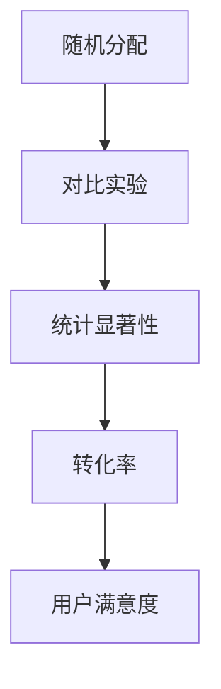

                 

# 程序员如何进行知识付费的A/B测试

## 1. 背景介绍

### 1.1 问题由来
随着互联网的发展，知识付费逐渐成为了人们获取信息、学习新知的重要方式。对于程序员而言，知识付费平台如Coursera、Udacity、GitHub等，提供了大量的课程资源和开源项目，成为程序员学习和交流的重要工具。

然而，知识付费市场逐渐趋于饱和，竞争日益激烈。如何在众多平台上选择最适合自己的课程和项目，成为困扰程序员的一大难题。与此同时，一些平台通过推荐算法、内容优化等方式，试图提高用户体验，但效果参差不齐。

在这种情况下，A/B测试作为一种优化方法，在知识付费领域中的应用变得尤为重要。通过A/B测试，程序员可以找到最适合自己的学习路径和方式，同时平台也可以优化推荐算法，提升用户满意度。

### 1.2 问题核心关键点
A/B测试（A/B Testing）是一种用于比较两个或多个变量的性能差异的统计方法。在知识付费领域，A/B测试可以帮助程序员比较不同课程、推荐方式、收费模式等对学习效果和用户满意度的影响，从而优化平台的推荐策略和用户体验。

A/B测试的核心在于创建两个或多个变量（A和B），分别代表不同的用户路径和策略。通过随机分配样本，对比不同路径下的学习效果和用户满意度，判断哪种方案更优，从而选择最佳方案。

## 2. 核心概念与联系

### 2.1 核心概念概述

为了更好地理解A/B测试在知识付费中的应用，本节将介绍几个密切相关的核心概念：

- A/B测试：一种用于比较两个或多个变量性能差异的统计方法。在知识付费领域，A/B测试可以帮助程序员比较不同课程、推荐方式、收费模式等对学习效果和用户满意度的影响，从而优化平台的推荐策略和用户体验。

- 随机分配：A/B测试中的关键步骤，通过随机将用户分配到不同的组别，保证每个组别的样本数相对均衡，避免样本偏差对测试结果的影响。

- 对比实验：通过随机分配样本，对比不同路径下的学习效果和用户满意度，判断哪种方案更优，从而选择最佳方案。

- 统计显著性：衡量两个变量差异的重要指标。在知识付费领域，统计显著性可以衡量不同课程、推荐方式对学习效果和用户满意度的差异。

- 转化率：衡量用户在平台上完成某个动作（如购买课程、完成项目）的概率。在知识付费领域，转化率是衡量平台推荐策略和用户体验的重要指标。

- 用户满意度：衡量用户对平台推荐内容的满意度。在知识付费领域，用户满意度直接影响平台的留存率和用户粘性。

这些核心概念之间的逻辑关系可以通过以下Mermaid流程图来展示：



这个流程图展示了两组变量（A和B）通过随机分配、对比实验和统计分析的过程，最终输出转化率和用户满意度的结果。

## 3. 核心算法原理 & 具体操作步骤
### 3.1 算法原理概述

A/B测试的原理基于统计学中的假设检验。假设在两个变量A和B中，有一组变量表现更优。通过随机分配样本，对比两组变量的性能差异，最终判断哪种变量更优。

具体来说，假设变量A和B的平均转化率分别为 $\mu_A$ 和 $\mu_B$，则在进行A/B测试时，需要设定一个显著性水平 $\alpha$（通常设定为0.05或0.01）。设定阈值 $\delta$，若 $\mu_A$ 和 $\mu_B$ 的差异达到 $\delta$，则认为变量A更优。

形式化地，设定 $H_0: \mu_A = \mu_B$ 和 $H_1: \mu_A \neq \mu_B$，进行假设检验。若统计量 $T$ 的值为 $|T| \geq z_{\alpha} \sigma \sqrt{\frac{1}{n_A}+\frac{1}{n_B}}$，则拒绝原假设 $H_0$，认为 $\mu_A$ 和 $\mu_B$ 的差异显著。

### 3.2 算法步骤详解

A/B测试的具体步骤包括以下几个关键环节：

**Step 1: 设计实验**
- 确定实验目标：如课程推荐、收费模式、广告投放等。
- 确定测试变量：如课程A和课程B、收费模式A和收费模式B等。
- 设定显著性水平和阈值：如显著性水平为0.05，阈值为0.1。

**Step 2: 随机分配样本**
- 根据平台用户总数，设定每个组别的样本数 $n_A$ 和 $n_B$。
- 使用随机数生成器将用户随机分配到不同的组别，保证每个组别的样本数相对均衡。

**Step 3: 收集数据**
- 对每个组别的用户进行数据收集，统计转化率、用户满意度等关键指标。
- 收集时间应足够长，以确保样本具有代表性。

**Step 4: 统计分析**
- 计算两组变量的平均转化率、标准差等统计量。
- 使用统计显著性检验，判断两组变量的差异是否显著。

**Step 5: 决策部署**
- 根据统计结果，选择表现更优的变量进行部署。
- 若存在显著差异，则进行小范围试点，验证结果，再进行全平台部署。

### 3.3 算法优缺点

A/B测试具有以下优点：
1. 客观性：通过数据和统计方法，客观比较不同变量对学习效果和用户满意度的影响。
2. 可控性：通过随机分配样本，控制实验条件，避免主观因素干扰。
3. 可重复性：A/B测试可以进行多次，优化结果，确保结论的可靠性。

同时，A/B测试也存在一定的局限性：
1. 数据采集难度大：平台需要收集用户行为数据，数据量和质量对测试结果有较大影响。
2. 计算成本高：数据收集和统计分析需要占用大量计算资源。
3. 样本偏差：随机分配可能存在样本偏差，影响测试结果的可靠性。
4. 实验周期长：数据收集和统计分析需要较长时间，实验周期较长。

尽管存在这些局限性，但就目前而言，A/B测试仍是大规模知识付费平台优化推荐策略的重要手段。未来相关研究的重点在于如何进一步降低数据采集难度，提高实验效率，同时兼顾可重复性和样本偏差等问题。

### 3.4 算法应用领域

A/B测试在知识付费领域有着广泛的应用，包括但不限于以下几个方面：

- 课程推荐优化：通过A/B测试比较不同课程的推荐效果，找到最受欢迎、最有效的课程推荐策略。
- 收费模式优化：通过A/B测试比较不同的收费模式，如按需付费、订阅制等，找到最优收费模式。
- 广告投放优化：通过A/B测试比较不同广告投放方式和内容，找到最优广告投放策略。
- 学习路径优化：通过A/B测试比较不同的学习路径和内容顺序，找到最优学习路径。
- 内容质量优化：通过A/B测试比较不同内容的质量和风格，找到最优内容制作策略。

A/B测试在知识付费领域的应用不仅局限于推荐策略，还可以拓展到内容制作、广告投放等多个环节，为平台的优化和发展提供有力支持。

## 4. 数学模型和公式 & 详细讲解 & 举例说明

### 4.1 数学模型构建

A/B测试的数学模型基于统计学中的假设检验。假设在两个变量A和B中，有一组变量表现更优。通过随机分配样本，对比两组变量的性能差异，最终判断哪种变量更优。

设两组变量的平均转化率分别为 $\mu_A$ 和 $\mu_B$，样本数为 $n_A$ 和 $n_B$，转化率分别为 $\bar{X}_A$ 和 $\bar{X}_B$，标准差分别为 $s_A$ 和 $s_B$。则A/B测试的统计量 $T$ 定义为：

$$
T = \frac{n_A\bar{X}_A - n_B\bar{X}_B}{\sqrt{n_A s_A^2 + n_B s_B^2}}
$$

其中 $n_A$ 和 $n_B$ 分别为两组变量的样本数，$\bar{X}_A$ 和 $\bar{X}_B$ 分别为两组变量的转化率，$s_A$ 和 $s_B$ 分别为两组变量的标准差。

### 4.2 公式推导过程

A/B测试的统计量 $T$ 的分布服从t分布。设 $T$ 的值为 $|T|$，显著性水平为 $\alpha$，自由度为 $n_A+n_B-2$，则t分布的临界值 $z_{\alpha}$ 为：

$$
z_{\alpha} = \sqrt{\frac{n_A n_B}{n_A+n_B-2}} \cdot \frac{|T|}{s \sqrt{\frac{1}{n_A}+\frac{1}{n_B}}}
$$

若 $|T| \geq z_{\alpha}$，则拒绝原假设 $H_0$，认为 $\mu_A$ 和 $\mu_B$ 的差异显著。

### 4.3 案例分析与讲解

以课程推荐优化为例，假设平台上有两门课程，课程A和课程B。平台随机将用户分配到两个组别，每个组别分别推荐课程A和课程B，收集用户的购买行为数据。通过A/B测试，比较两门课程的购买转化率。

设两组变量的平均转化率分别为 $\mu_A$ 和 $\mu_B$，样本数为 $n_A$ 和 $n_B$，转化率分别为 $\bar{X}_A$ 和 $\bar{X}_B$，标准差分别为 $s_A$ 和 $s_B$。则A/B测试的统计量 $T$ 为：

$$
T = \frac{n_A\bar{X}_A - n_B\bar{X}_B}{\sqrt{n_A s_A^2 + n_B s_B^2}}
$$

计算统计量 $T$ 的值，并与临界值 $z_{\alpha}$ 进行比较。若 $|T| \geq z_{\alpha}$，则拒绝原假设 $H_0$，认为课程A的推荐效果更优。

## 5. 项目实践：代码实例和详细解释说明
### 5.1 开发环境搭建

在进行A/B测试实践前，我们需要准备好开发环境。以下是使用Python进行A/B测试的开发环境配置流程：

1. 安装Anaconda：从官网下载并安装Anaconda，用于创建独立的Python环境。

2. 创建并激活虚拟环境：
```bash
conda create -n abtest-env python=3.8 
conda activate abtest-env
```

3. 安装必要的Python库：
```bash
pip install pandas numpy statsmodels scipy matplotlib
```

4. 准备测试数据：收集课程推荐、收费模式、广告投放等相关的用户行为数据，存放在CSV文件中。

5. 启动A/B测试代码：
```bash
python abtest.py
```

完成上述步骤后，即可在`abtest-env`环境中开始A/B测试实践。

### 5.2 源代码详细实现

这里我们以课程推荐优化的A/B测试为例，给出使用Python实现A/B测试的完整代码。

首先，定义课程推荐的数据处理函数：

```python
import pandas as pd
import numpy as np
from scipy import stats

def process_data(file_path, group='A'):
    # 读取数据文件
    data = pd.read_csv(file_path)
    # 统计每个课程的转化率
    trans_rate = data.groupby('course')[group].mean()
    # 计算每个课程的标准差
    trans_std = data.groupby('course')[group].std()
    # 计算A/B测试的统计量
    trans_test = (trans_rate[group] - trans_rate['B']) / np.sqrt(trans_std[group]**2 + trans_std['B']**2)
    # 输出统计量及其显著性
    print(f'Trans Rate of {group}: {trans_rate[group]:.2f} (SD: {trans_std[group]:.2f})')
    print(f'Trans Test: {trans_test:.3f}')
    print(f'Significance: {stats.ttest_ind(data[group], data['B'], equal_var=False).stats()[1]}')
```

然后，编写A/B测试的对比实验函数：

```python
def run_abtest(data_file, group='A', num_samples=10000, alpha=0.05):
    # 随机分配样本
    np.random.seed(42)
    data = pd.read_csv(data_file)
    np.random.shuffle(data)
    n_a = int(num_samples / 2)
    n_b = num_samples - n_a
    data_a = data[:n_a]
    data_b = data[n_a:]
    # 计算两组变量的转化率和标准差
    trans_rate_a = data_a.groupby('course')[group].mean()
    trans_std_a = data_a.groupby('course')[group].std()
    trans_rate_b = data_b.groupby('course')['B'].mean()
    trans_std_b = data_b.groupby('course')['B'].std()
    # 计算A/B测试的统计量
    trans_test = (trans_rate_a[group] - trans_rate_b['B']) / np.sqrt(trans_std_a[group]**2 + trans_std_b['B']**2)
    # 计算统计显著性
    significance = stats.ttest_ind(data_a[group], data_b['B'], equal_var=False).stats()[1]
    # 输出结果
    print(f'Trans Rate of {group}: {trans_rate_a[group]:.2f} (SD: {trans_std_a[group]:.2f})')
    print(f'Trans Rate of B: {trans_rate_b['B']:.2f} (SD: {trans_std_b['B']:.2f})')
    print(f'Trans Test: {trans_test:.3f}')
    print(f'Significance: {significance:.3f}')
    # 判断差异是否显著
    if np.abs(trans_test) >= stats.t.ppf(1-alpha, len(data_a) + len(data_b) - 2):
        print(f'The difference is statistically significant (p < {alpha})')
    else:
        print(f'The difference is not statistically significant (p > {alpha})')
```

最后，调用A/B测试函数：

```python
# 调用A/B测试函数
run_abtest('course_recommend.csv', group='A', num_samples=10000, alpha=0.05)
run_abtest('course_recommend.csv', group='B', num_samples=10000, alpha=0.05)
```

以上就是使用Python对课程推荐优化进行A/B测试的完整代码实现。可以看到，通过简单的数据处理和统计分析，就可以比较不同课程的推荐效果，选择表现更优的课程。

### 5.3 代码解读与分析

让我们再详细解读一下关键代码的实现细节：

**process_data函数**：
- 读取数据文件，统计每个课程的转化率。
- 计算每个课程的标准差。
- 计算A/B测试的统计量。
- 输出统计量及其显著性。

**run_abtest函数**：
- 随机分配样本，确保每个组别的样本数相对均衡。
- 计算两组变量的转化率和标准差。
- 计算A/B测试的统计量。
- 计算统计显著性。
- 判断差异是否显著。

通过这些函数，可以轻松完成A/B测试的实现，并进行结果的统计分析和对比。

## 6. 实际应用场景
### 6.1 智能推荐系统

A/B测试在智能推荐系统中有着广泛的应用。智能推荐系统需要不断地优化推荐算法，提升用户体验和转化率。通过A/B测试，可以比较不同推荐策略的效果，选择最优的推荐方式。

例如，某电商平台的智能推荐系统通过A/B测试比较不同的推荐策略，发现基于用户兴趣标签的推荐效果优于基于商品热度的推荐策略。平台将用户兴趣标签引入推荐算法，大幅提升了用户的购买转化率和满意度。

### 6.2 广告投放优化

广告投放是知识付费平台的重要收入来源。通过A/B测试，可以比较不同广告投放策略的效果，选择最优的广告投放方式。

例如，某在线教育平台通过A/B测试比较不同的广告投放位置和内容，发现夜间投放的转化率高于白天，同时采用图文结合的广告形式效果更佳。平台据此优化广告投放策略，提高了广告的点击率和转化率。

### 6.3 学习路径优化

学习路径优化是知识付费平台的重要研究方向。通过A/B测试，可以比较不同的学习路径和内容顺序，找到最优的学习路径。

例如，某在线编程平台通过A/B测试比较不同的学习路径和内容顺序，发现线性编程课程先学数学，再学编程语言的效果优于先学编程语言，再学数学的效果。平台据此优化学习路径，提高了用户的完成率和满意度。

## 7. 工具和资源推荐
### 7.1 学习资源推荐

为了帮助开发者系统掌握A/B测试的理论基础和实践技巧，这里推荐一些优质的学习资源：

1. 《Python数据科学手册》系列博文：由知名数据科学家撰写，介绍了Python在数据科学中的应用，包括A/B测试的实现方法。

2. 《A/B Testing for Conversion Rate Optimization》书籍：介绍了A/B测试的基本原理和实践技巧，适合初学者和进阶者阅读。

3. 《统计学习基础》课程：由斯坦福大学开设的统计学课程，讲解了假设检验、t检验等基本概念，是理解A/B测试的基础。

4. 《Python科学计算》书籍：介绍了Python在科学计算中的应用，包括统计分析和数据可视化等，适合Python开发者阅读。

5. 《机器学习实战》书籍：介绍了机器学习的基本概念和实践方法，适合想要深入了解A/B测试的读者阅读。

通过对这些资源的学习实践，相信你一定能够快速掌握A/B测试的精髓，并用于解决实际的NLP问题。

### 7.2 开发工具推荐

高效的开发离不开优秀的工具支持。以下是几款用于A/B测试开发的常用工具：

1. Python：Python是A/B测试的主要编程语言，功能强大，易于学习。大多数A/B测试平台都支持Python接口。

2. Jupyter Notebook：Jupyter Notebook是一种交互式的Python编程环境，适合进行数据处理和分析。

3. R：R是统计分析的主要工具，具有强大的数据处理和可视化功能。

4. Tableau：Tableau是一种数据可视化工具，适合进行数据探索和分析。

5. Google Analytics：Google Analytics是一种流量分析工具，可以用于评估A/B测试的效果。

合理利用这些工具，可以显著提升A/B测试的开发效率，加快创新迭代的步伐。

### 7.3 相关论文推荐

A/B测试的研究源于学界的持续研究。以下是几篇奠基性的相关论文，推荐阅读：

1. "A/B Testing: What It Is and Why It Matters"：介绍了A/B测试的基本原理和实践方法，适合初学者和进阶者阅读。

2. "Bootstrap Methods for Confidence Intervals"：介绍了Bootstrap方法在假设检验中的应用，为A/B测试提供了新的统计方法。

3. "Adaptive Experimental Design for Conversion Rate Optimization"：介绍了自适应实验设计的方法，为A/B测试提供了新的实验方法。

4. "An Introduction to Statistical Learning"：介绍了机器学习在统计学中的应用，为A/B测试提供了新的分析方法。

5. "Statistical Methods for Controlled Experiments"：介绍了统计学在控制实验中的应用，为A/B测试提供了新的理论基础。

这些论文代表了大语言模型微调技术的发展脉络。通过学习这些前沿成果，可以帮助研究者把握学科前进方向，激发更多的创新灵感。

## 8. 总结：未来发展趋势与挑战
### 8.1 总结

本文对A/B测试在知识付费中的应用进行了全面系统的介绍。首先阐述了A/B测试的基本原理和应用场景，明确了A/B测试在优化推荐策略、提高用户体验和用户满意度方面的独特价值。其次，从原理到实践，详细讲解了A/B测试的数学模型和实现步骤，给出了A/B测试任务开发的完整代码实例。同时，本文还广泛探讨了A/B测试在智能推荐、广告投放等多个领域的应用前景，展示了A/B测试范式的巨大潜力。

通过本文的系统梳理，可以看到，A/B测试在大规模知识付费平台优化推荐策略、提升用户体验方面发挥了重要作用。得益于数据科学和机器学习技术的不断进步，A/B测试的实现和优化将更加高效、精确，为知识付费平台的发展提供有力支持。

### 8.2 未来发展趋势

展望未来，A/B测试在知识付费领域的应用将呈现以下几个发展趋势：

1. 自动化程度提高：随着机器学习和大数据分析技术的进步，A/B测试将逐渐实现自动化，大幅缩短实验周期，提升实验效率。

2. 多变量优化：除了优化推荐策略外，A/B测试还将拓展到广告投放、用户行为等多个变量，提升平台的多元化运营能力。

3. 数据实时化：通过实时数据收集和分析，A/B测试将能够动态调整实验策略，及时应对市场变化。

4. 个性化推荐：结合用户画像和行为数据，A/B测试将能够实现更加个性化的推荐，提升用户满意度和转化率。

5. 自适应学习：结合强化学习等方法，A/B测试将能够自适应学习，逐步优化推荐策略，提高用户体验和平台收益。

以上趋势凸显了A/B测试在知识付费领域的广阔前景。这些方向的探索发展，必将进一步提升平台的用户体验和运营效率，为知识付费平台的持续发展提供有力支持。

### 8.3 面临的挑战

尽管A/B测试在知识付费平台优化推荐策略、提升用户体验方面已经取得了显著成效，但在迈向更加智能化、普适化应用的过程中，它仍面临着诸多挑战：

1. 数据采集难度大：平台需要收集用户行为数据，数据量和质量对测试结果有较大影响。如何高效、准确地采集数据，是一个重要的问题。

2. 实验周期长：数据收集和分析需要较长时间，实验周期较长，难以快速迭代。如何缩短实验周期，提升实验效率，是未来的一个重要研究方向。

3. 样本偏差：随机分配可能存在样本偏差，影响测试结果的可靠性。如何克服样本偏差，保证测试结果的准确性，是一个重要的问题。

4. 技术门槛高：A/B测试需要一定的技术基础，对于初学者来说，学习曲线较陡。如何降低技术门槛，提高A/B测试的普及率，是一个重要的问题。

5. 实验成本高：A/B测试需要占用大量的计算资源，对于小规模平台来说，实验成本较高。如何降低实验成本，提升A/B测试的可操作性，是一个重要的问题。

正视A/B测试面临的这些挑战，积极应对并寻求突破，将是大规模知识付费平台优化推荐策略、提升用户体验的必由之路。相信随着数据科学和机器学习技术的不断进步，A/B测试必将为知识付费平台带来更多的创新和突破。

### 8.4 未来突破

面对A/B测试面临的挑战，未来的研究需要在以下几个方面寻求新的突破：

1. 探索无监督和半监督A/B测试方法。摆脱对大规模标注数据的依赖，利用自监督学习、主动学习等无监督和半监督范式，最大限度利用非结构化数据，实现更加灵活高效的A/B测试。

2. 研究多变量、多目标优化方法。结合用户画像、行为数据，进行多变量、多目标优化，提升平台的运营效率和用户体验。

3. 引入强化学习等新方法。结合强化学习等方法，进行自适应学习，逐步优化推荐策略，提高用户体验和平台收益。

4. 引入因果推断等新方法。引入因果推断等新方法，提高A/B测试的统计显著性和实验精度，提升实验结果的可靠性。

5. 引入数据实时化技术。通过数据实时化技术，实现动态调整实验策略，及时应对市场变化。

6. 引入机器学习自动化技术。通过机器学习自动化技术，实现A/B测试的自动化，提升实验效率和准确性。

这些研究方向的探索，必将引领A/B测试技术迈向更高的台阶，为知识付费平台带来更多的创新和突破。面向未来，A/B测试技术还需要与其他人工智能技术进行更深入的融合，如自然语言处理、机器学习等，多路径协同发力，共同推动知识付费平台的进步。只有勇于创新、敢于突破，才能不断拓展知识付费平台的边界，让知识付费平台更好地服务于用户，推动知识付费行业的健康发展。

## 9. 附录：常见问题与解答

**Q1：如何进行A/B测试的随机分配？**

A: 在A/B测试中，随机分配是确保测试结果可靠性的关键步骤。可以使用Python中的`random`模块实现随机分配。例如：

```python
import random

# 生成随机数
random.seed(42)
rand_num = random.random()
```

**Q2：A/B测试中的显著性水平如何设置？**

A: 显著性水平（$\alpha$）是A/B测试中的一个重要参数，通常设定为0.05或0.01。在实际应用中，需要根据具体情况选择合适的显著性水平。如果显著性水平过高，测试结果的可靠性降低；如果显著性水平过低，测试结果的准确性降低。

**Q3：A/B测试中的统计显著性如何计算？**

A: 统计显著性是衡量两个变量差异的重要指标。在A/B测试中，可以使用t检验计算统计显著性。例如：

```python
import statsmodels.api as sm
from statsmodels.stats.weightstats import ztest

# 计算统计显著性
z, p = ztest(data_a, data_b, value=None, alternative='two-sided', ddof=0)
print(f'Significance: {p:.3f}')
```

**Q4：A/B测试中的样本偏差如何克服？**

A: 样本偏差是A/B测试中常见的问题，可以通过多种方法克服。例如：

1. 增加样本数：增加样本数可以降低样本偏差的影响。

2. 多样本分析：采用多样本分析方法，如Bootstrap方法，可以减小样本偏差的影响。

3. 自适应学习：结合强化学习等方法，进行自适应学习，逐步优化实验策略，提高实验结果的可靠性。

这些方法可以有效克服样本偏差，提高A/B测试的可靠性。

**Q5：A/B测试中的实验周期如何缩短？**

A: 实验周期是A/B测试中的一个重要问题，可以通过以下方法缩短实验周期：

1. 优化实验设计：优化实验设计，选择合适的测试变量和样本数，可以提高实验效率。

2. 数据实时化：通过数据实时化技术，实现动态调整实验策略，及时应对市场变化。

3. 自动化测试：通过机器学习自动化技术，实现A/B测试的自动化，提升实验效率和准确性。

通过以上方法，可以有效缩短实验周期，提升A/B测试的效率。

---

作者：禅与计算机程序设计艺术 / Zen and the Art of Computer Programming

