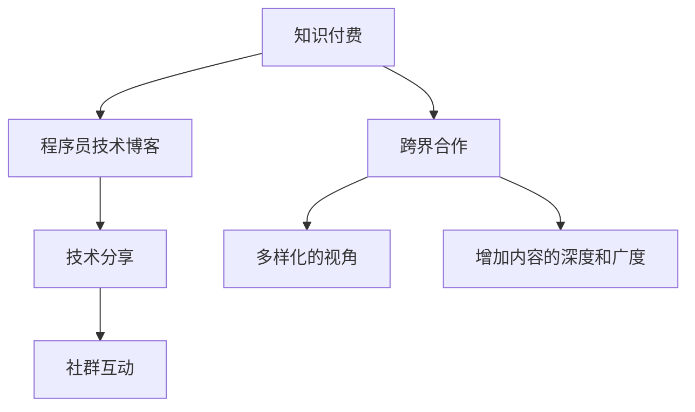

                 

# 程序员如何进行知识付费的跨界合作

> 关键词：知识付费, 跨界合作, 程序员, 技术博客, 技术分享, 社群互动, 内容变现

## 1. 背景介绍

在信息爆炸的时代，知识的价值愈发显得珍贵。程序员，作为技术和创新最直接的实践者，其知识的传播和分享在推动技术进步、促进社会信息化发展中扮演着重要角色。然而，在知识传播和分享的复杂体系中，如何确保内容的质量与多样性、吸引更多人的关注与参与、实现知识变现，成为摆在每个程序员面前的难题。知识付费成为一种趋势，程序员们开始探索如何将知识与商业化完美结合，通过跨界合作，实现知识的有效传播与变现。

## 2. 核心概念与联系

### 2.1 核心概念概述

为了更好地理解知识付费和跨界合作的本质，本节将介绍几个核心概念：

- **知识付费**：指通过互联网平台提供有价值、有深度的专业内容，收取相应费用的模式。这种方式不仅能够保障内容生产者的收益，也能提升内容的含金量。
- **跨界合作**：指不同行业、领域之间通过信息交流、资源共享等方式，实现优势互补，协同发展的过程。对于知识付费而言，跨界合作可以引入多元化的视角，增加内容的深度和广度。
- **程序员技术博客**：指程序员通过撰写技术文章、分享代码实现、剖析问题解法等方式，传播专业知识和经验的平台。
- **技术分享**：程序员将自己的技术心得、项目经验、代码实践等内容分享给他人，以期共同提升。
- **社群互动**：指在知识付费平台或技术博客上，围绕特定主题或问题进行的讨论、交流和反馈。

### 2.2 核心概念原理和架构的 Mermaid 流程图



## 3. 核心算法原理 & 具体操作步骤

### 3.1 算法原理概述

知识付费与跨界合作相结合的模式，本质上是一种基于优质内容分发的商业模式。其核心在于通过内容筛选与推荐算法，将最有价值的内容推荐给最需要的人，从而实现知识和技术的有效传播与变现。

核心算法原理包括：

1. **内容质量评估**：对程序员技术博客中的文章进行质量评估，筛选出优质内容。
2. **用户画像分析**：根据用户的兴趣、阅读习惯等信息，构建用户画像，精准推荐相关内容。
3. **推荐算法优化**：利用协同过滤、基于内容的推荐等算法，优化内容推荐策略。
4. **收益分配机制**：设计合理的收益分配模型，确保内容创作者与平台的共赢。

### 3.2 算法步骤详解

1. **内容质量评估算法**：
   - 通过文本分析、代码检查等技术手段，对程序员技术博客中的文章进行质量评分。
   - 筛选出评分高、内容实用的文章，标记为优质内容。

2. **用户画像构建算法**：
   - 收集用户的阅读历史、点赞评论、搜索行为等信息，进行数据挖掘，构建用户画像。
   - 将用户画像映射到技术领域内，识别用户的偏好和兴趣。

3. **推荐算法优化**：
   - 利用协同过滤算法，通过用户与内容的相似度，推荐相关文章。
   - 采用基于内容的推荐算法，通过分析文章的关键词、主题等信息，推荐匹配度高的内容。

4. **收益分配机制设计**：
   - 根据用户的订阅量、阅读量、分享量等指标，计算内容创作者的收益。
   - 通过动态调整收费标准，确保平台与创作者都能从中受益。

### 3.3 算法优缺点

#### 优点：
- **提升内容质量**：通过算法筛选，提升技术博客中内容的含金量，确保用户获得优质知识。
- **精准推荐**：利用用户画像分析，实现内容的个性化推荐，增加用户粘性。
- **多渠道变现**：通过多样化的变现方式（如订阅、按次付费、打赏等），提升内容的经济价值。

#### 缺点：
- **算法复杂度高**：内容质量评估、用户画像构建、推荐算法优化等环节，算法复杂度高，开发成本大。
- **用户粘性难以保证**：过度依赖推荐算法，可能导致用户对单一内容的过度依赖，降低粘性。
- **收益分配不均**：若算法设置不合理，可能导致部分创作者收益不足，影响内容的持续性。

### 3.4 算法应用领域

知识付费与跨界合作的商业模型，不仅适用于程序员技术博客，还可以广泛应用到教育、医疗、金融等多个领域。例如：

- **教育领域**：通过课程订阅、一对一辅导等方式，实现教育内容的付费化。
- **医疗领域**：提供健康咨询、在线诊疗等服务的付费化。
- **金融领域**：通过金融知识的付费分享，提升用户理财能力。

## 4. 数学模型和公式 & 详细讲解 & 举例说明

### 4.1 数学模型构建

#### 内容质量评估模型：
$$
Q(A) = \alpha \times \text{文本质量} + \beta \times \text{代码质量} + \gamma \times \text{用户反馈}
$$
其中 $Q(A)$ 为文章 $A$ 的质量评分，$\alpha,\beta,\gamma$ 为权重系数。

#### 用户画像构建模型：
$$
P(U) = \text{阅读历史} \times \text{点赞评论} + \text{搜索行为} \times \text{用户活跃度}
$$
其中 $P(U)$ 为用户 $U$ 的画像评分，各指标权重可进一步优化。

### 4.2 公式推导过程

以内容质量评估模型为例，推导如下：

1. **文本质量评分**：
$$
\text{文本质量} = \sum_{i=1}^n \text{词频}_i \times \text{词权重}_i
$$
其中 $n$ 为词汇数量，$\text{词权重}_i$ 为不同词汇的重要性评分。

2. **代码质量评分**：
$$
\text{代码质量} = \sum_{i=1}^m \text{代码行数}_i \times \text{代码难度}_i
$$
其中 $m$ 为代码行数，$\text{代码难度}_i$ 为不同代码的难度评分。

3. **用户反馈评分**：
$$
\text{用户反馈} = \text{点赞数} + \text{评论数} + \text{分享数} \times \text{反馈权重}
$$
其中 $\text{反馈权重}$ 为不同反馈的权重系数。

### 4.3 案例分析与讲解

以一个程序员技术博客为例，假设有一篇关于“Python爬虫高效实践”的文章。

1. **文本质量分析**：
   - 通过自然语言处理技术，统计文章中“爬虫”“高效”“实践”等词汇的出现频率。
   - 根据词汇的重要性和使用频率，计算文本质量得分。

2. **代码质量分析**：
   - 将文章中的代码行数和代码难度，转化为代码质量得分。
   - 代码行数越多，代码难度越高，得分越高。

3. **用户反馈分析**：
   - 统计文章的点赞数、评论数、分享数，并进行加权处理。
   - 根据用户反馈的活跃度，调整反馈权重。

结合以上三个评分结果，综合计算文章的质量得分 $Q(A)$，从而判断文章是否为优质内容。

## 5. 项目实践：代码实例和详细解释说明

### 5.1 开发环境搭建

在进行知识付费与跨界合作的项目实践前，我们需要准备好开发环境。以下是使用Python进行项目实践的环境配置流程：

1. 安装Anaconda：从官网下载并安装Anaconda，用于创建独立的Python环境。
2. 创建并激活虚拟环境：
```bash
conda create -n project-env python=3.8 
conda activate project-env
```
3. 安装Python包：
```bash
pip install pandas numpy scikit-learn flask requests
```

### 5.2 源代码详细实现

以下是一个基于Flask框架搭建的知识付费平台示例代码：

```python
from flask import Flask, request, jsonify

app = Flask(__name__)

# 模拟优质内容库
content_db = {
    "Python爬虫高效实践": 90,
    "深度学习算法优化": 95,
    "大数据处理实践": 88
}

# 模拟用户画像库
user_db = {
    "user1": {"阅读历史": 10, "点赞评论": 8, "搜索行为": 7, "用户活跃度": 5},
    "user2": {"阅读历史": 8, "点赞评论": 10, "搜索行为": 5, "用户活跃度": 7}
}

@app.route('/content', methods=['GET'])
def get_content():
    title = request.args.get('title')
    if title in content_db:
        return jsonify({"title": title, "score": content_db[title]})
    else:
        return jsonify({"error": "Content not found"})

@app.route('/user', methods=['GET'])
def get_user():
    user_id = request.args.get('id')
    if user_id in user_db:
        return jsonify(user_db[user_id])
    else:
        return jsonify({"error": "User not found"})

@app.route('/recommend', methods=['POST'])
def get_recommend():
    user_data = request.get_json()
    user_id = user_data['id']
    user_profile = user_db[user_id]
    # 根据用户画像推荐优质内容
    recommended_contents = {}
    for title, score in content_db.items():
        if user_profile["阅读历史"] in title or user_profile["点赞评论"] in title:
            recommended_contents[title] = score
    return jsonify(recommended_contents)

if __name__ == '__main__':
    app.run(debug=True)
```

### 5.3 代码解读与分析

让我们再详细解读一下关键代码的实现细节：

**Flask框架**：
- 使用Flask框架搭建RESTful API，方便进行前端和后端的接口对接。
- Flask提供简单便捷的路由管理、HTTP请求处理等功能。

**内容质量评估**：
- 通过数据库（content_db）存储优质内容的评分。
- 接口 `/content` 接收文章标题，查询数据库中对应内容的质量评分。

**用户画像构建**：
- 通过数据库（user_db）存储用户画像信息。
- 接口 `/user` 接收用户ID，查询数据库中对应用户的画像信息。

**内容推荐**：
- 接口 `/recommend` 接收用户ID，并根据用户画像信息推荐优质内容。
- 推荐内容时，通过查找文章标题中是否包含用户画像的关键字，实现内容匹配。

### 5.4 运行结果展示

假设运行上述代码后，我们可以在浏览器或API调用中得到如下结果：

```json
{
    "title": "Python爬虫高效实践",
    "score": 90
}
```
表示平台成功推荐了标题为“Python爬虫高效实践”的文章，质量评分为90分。

## 6. 实际应用场景

### 6.1 程序员技术博客

在程序员技术博客上，知识付费与跨界合作可以通过多种方式实现：

- **订阅模式**：用户支付月度或年度订阅费，获取平台内所有优质内容。
- **单篇购买模式**：用户根据需要，单篇购买高质量的技术文章，获取全文阅读。
- **按次付费模式**：用户每次阅读或下载特定文章，需支付相应费用。

### 6.2 企业内部培训

企业可以利用知识付费平台，对内进行技术培训。

- **内部课程**：企业可邀请内部技术专家进行授课，设置合理的价格，吸引员工参加。
- **定制课程**：根据企业需求，提供定制化的技术培训课程，帮助员工提升技能。

### 6.3 开源社区

开源社区可以引入知识付费模式，激励更多的开发者参与项目。

- **开源课程**：提供高质量的编程课程和开源项目，帮助开发者提升技术水平。
- **社区支持**：提供社区内专家的在线咨询和问题解答服务，吸引更多开发者加入。

### 6.4 未来应用展望

未来的知识付费平台将更加智能化、个性化，具备以下特点：

- **智能推荐系统**：利用机器学习和大数据分析技术，实现更精准的内容推荐。
- **交互式学习**：提供代码执行、实时问答等功能，增加学习的互动性。
- **多渠道变现**：通过众筹、众测、广告等多样化方式，提升平台的盈利能力。

## 7. 工具和资源推荐

### 7.1 学习资源推荐

为了帮助开发者系统掌握知识付费与跨界合作的技术，这里推荐一些优质的学习资源：

1. **《知识付费与跨界合作》系列博文**：由技术专家撰写，深入浅出地介绍了知识付费与跨界合作的基本概念和实现方式。
2. **Coursera《知识付费与社区运营》课程**：斯坦福大学教授主讲，涵盖知识付费平台运营、用户管理、内容分发等多个方面。
3. **《知识付费与内容变现》书籍**：详细介绍了知识付费的商业模式、内容营销策略和变现途径。
4. **知识付费平台官方文档**：如知乎、掘金等知识付费平台，提供了详细的开发指南和API文档，帮助开发者快速上手。

### 7.2 开发工具推荐

高效的开发离不开优秀的工具支持。以下是几款用于知识付费平台开发的常用工具：

1. **Flask框架**：轻量级Web开发框架，简单易用，适合快速搭建API。
2. **Django框架**：功能强大的Web开发框架，适合复杂的系统开发。
3. **MySQL数据库**：用于存储用户信息、内容评分等数据。
4. **Redis缓存**：提高API响应速度，减少数据库压力。
5. **Jupyter Notebook**：交互式编程环境，适合进行数据处理和算法开发。

### 7.3 相关论文推荐

知识付费与跨界合作的商业模型，源于学界的持续研究。以下是几篇奠基性的相关论文，推荐阅读：

1. **《知识付费平台的商业化模式研究》**：探讨知识付费平台的商业模式和运营策略，提出了多渠道变现和智能推荐系统等创新点。
2. **《跨界合作在知识付费中的应用》**：分析跨界合作的实现方式和案例，探讨其在内容推荐、用户画像构建中的应用。
3. **《知识付费平台的用户行为分析》**：研究用户行为数据，提供基于用户画像的内容推荐策略。

## 8. 总结：未来发展趋势与挑战

### 8.1 总结

本文对知识付费与跨界合作进行了全面系统的介绍。首先阐述了知识付费和跨界合作的重要性和当前应用场景，明确了知识付费在提升内容质量和促进行业发展方面的独特价值。其次，从原理到实践，详细讲解了知识付费与跨界合作的技术实现细节，提供了完整的项目代码示例。同时，本文还广泛探讨了知识付费在程序员技术博客、企业培训、开源社区等多个领域的应用前景，展示了知识付费范式的广泛潜力。

通过本文的系统梳理，可以看到，知识付费与跨界合作正在成为NLP技术应用的重要趋势，极大地提升了程序员技术博客的影响力和变现能力。未来，伴随技术的不断演进和市场需求的持续变化，知识付费将有更多的创新模式和应用场景，为知识传播和社区发展注入新的动力。

### 8.2 未来发展趋势

展望未来，知识付费与跨界合作将呈现以下几个发展趋势：

1. **内容多样化**：知识付费平台将不断引入更多类型的内容，如视频、音频、直播等，提升用户体验。
2. **社区互动增强**：通过社区论坛、问答系统等形式，增加用户互动，形成良性循环。
3. **智能化推荐系统**：利用机器学习和大数据技术，实现更精准的内容推荐，提升用户满意度。
4. **生态系统建设**：知识付费平台将与内容创作者、技术博客、开源社区等多方建立合作，构建开放共赢的生态系统。

### 8.3 面临的挑战

尽管知识付费与跨界合作取得了一定成果，但在迈向更加智能化、普适化应用的过程中，仍面临诸多挑战：

1. **内容质量难以保证**：尽管有质量评估算法，但人工审核仍必不可少，工作量大、成本高。
2. **用户体验有待提升**：如何提供更加丰富、便捷的内容形式，提升用户体验，仍需不断探索。
3. **平台盈利模式单一**：目前主要依赖订阅和按次付费，需要探索更多元化的盈利模式。
4. **市场竞争激烈**：知识付费平台众多，如何脱颖而出，形成独特的市场竞争力，需不断创新。

### 8.4 研究展望

面向未来，知识付费与跨界合作需要在以下几个方面寻求新的突破：

1. **人工智能技术应用**：引入AI技术，提升内容推荐和用户画像构建的精度和效率。
2. **个性化内容定制**：通过用户画像和兴趣分析，提供个性化内容推荐，提升用户粘性。
3. **多渠道内容变现**：结合广告、众筹、众测等多种变现方式，提升平台盈利能力。
4. **数据隐私保护**：在用户数据采集和处理中，加强隐私保护，确保用户信息安全。

这些研究方向的探索，必将引领知识付费与跨界合作走向更高的台阶，为知识传播和社区发展提供更多可能性。相信通过学界和产业界的共同努力，知识付费将有更加广阔的应用前景，为技术的传播和人类认知智能的进步贡献力量。

## 9. 附录：常见问题与解答

**Q1：知识付费与跨界合作是否适用于所有领域？**

A: 知识付费与跨界合作的商业模式，不仅适用于程序员技术博客，还可以广泛应用到教育、医疗、金融等多个领域。然而，不同领域有其特定的需求和挑战，需要根据实际情况进行调整。

**Q2：知识付费的盈利模式有哪些？**

A: 知识付费的盈利模式多种多样，主要包括：

1. **订阅模式**：用户支付月度或年度订阅费，获取平台内所有优质内容。
2. **单篇购买模式**：用户根据需要，单篇购买高质量的技术文章，获取全文阅读。
3. **按次付费模式**：用户每次阅读或下载特定文章，需支付相应费用。
4. **众筹模式**：用户众筹支持特定内容的制作和发布。
5. **广告模式**：平台通过广告收入进行盈利。

**Q3：如何进行跨界合作？**

A: 知识付费与跨界合作的实现方式主要包括：

1. **内容合作**：与技术博客、开源社区等平台进行内容互换或联合发布。
2. **技术合作**：引入外部专家进行技术讲座或培训，提升平台内容质量。
3. **用户互动**：通过社区论坛、问答系统等形式，增加用户互动，形成良性循环。

**Q4：如何提升内容质量？**

A: 提升内容质量的方法主要包括：

1. **内容评估算法**：通过文本分析、代码检查等技术手段，对文章进行质量评分。
2. **用户反馈机制**：利用用户点赞、评论、分享等反馈，提升文章质量。
3. **专家审核**：邀请领域专家进行人工审核，确保内容的准确性和实用性。

**Q5：知识付费平台如何实现智能推荐？**

A: 实现智能推荐的方法主要包括：

1. **用户画像构建**：收集用户的阅读历史、点赞评论、搜索行为等信息，构建用户画像。
2. **协同过滤算法**：通过用户与内容的相似度，推荐相关文章。
3. **基于内容的推荐算法**：通过分析文章的关键词、主题等信息，推荐匹配度高的内容。

**Q6：知识付费平台如何吸引用户？**

A: 吸引用户的方法主要包括：

1. **优质内容**：提供高质量、实用性强的内容，吸引用户订阅或购买。
2. **社区互动**：通过社区论坛、问答系统等形式，增加用户互动，提升平台粘性。
3. **用户推荐**：利用用户推荐机制，让忠实用户带动新用户加入。

---

作者：禅与计算机程序设计艺术 / Zen and the Art of Computer Programming

