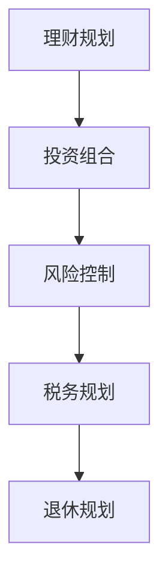

                 

# 程序员如何避免常见的理财误区

> 关键词：理财规划, 投资组合, 风险控制, 税务规划, 退休规划

## 1. 背景介绍

### 1.1 问题由来

随着经济的发展和科技的进步，程序员这一职业已经成为社会中非常重要的一部分。然而，程序员通常更注重技术和职业发展，而忽视了个人财务管理的知识。许多程序员在理财方面存在许多误区，导致经济状况不稳定，甚至陷入财务困境。因此，帮助程序员掌握正确的理财知识和技能，是提升生活质量和保障未来的重要途径。

### 1.2 问题核心关键点

理财的核心在于理性投资、合理规划和风险控制。程序员由于对技术的天生敏感性，往往会将这种思维带入理财中，导致一系列误区。以下是程序员常见的几种理财误区：

- **盲目跟从潮流投资**：如跟风炒币、炒房，未能充分了解市场风险。
- **过度依赖理财App**：过度依赖算法驱动的投资App，未能深入理解投资逻辑。
- **忽视税务规划**：未能充分了解税务政策，导致税收负担过重。
- **没有明确的目标和计划**：缺乏长远的理财目标和具体的执行计划。
- **缺乏风险意识**：过分乐观，忽视潜在的财务风险。

## 2. 核心概念与联系

### 2.1 核心概念概述

为了帮助程序员更好地理解理财知识，本节将介绍几个核心概念及其相互联系：

- **理财规划(Financial Planning)**：通过分析个人财务状况和理财目标，制定合理、可行的财务计划。
- **投资组合(Investment Portfolio)**：将不同风险和收益特性的资产进行合理配置，以达到最优的收益和风险平衡。
- **风险控制(Risk Control)**：通过分散投资、合理配置等方法，降低投资组合的风险。
- **税务规划(Tax Planning)**：通过合法手段合理避税，减轻税收负担。
- **退休规划(Retirement Planning)**：通过规划和投资，确保退休后的生活品质。

这些核心概念之间通过以下逻辑关系构成了一个完整的理财体系，如图：



在这个流程图中，理财规划是基础，投资组合、风险控制、税务规划和退休规划都是在理财规划的基础上进行细化执行的环节。

## 3. 核心算法原理 & 具体操作步骤
### 3.1 算法原理概述

理财的核心原理是最大化净现值(NPV)和贴现现金流(DCF)，通过科学计算方法实现最优的财务目标。理财规划基于以下公式：

$$ \text{NPV} = \sum_{t=0}^{T} \frac{C_t}{(1 + r)^t} $$

其中，$C_t$ 表示第$t$期的现金流，$r$ 表示贴现率。理财规划通过评估不同投资方案的NPV，选择最优方案。

### 3.2 算法步骤详解

1. **分析个人财务状况**：了解自己的收入、支出、资产、负债、税务状况等。
2. **制定理财目标**：明确短期的消费目标和长期的财务目标，如购房、教育、退休等。
3. **选择合适的投资组合**：根据风险承受能力和投资期限，选择适当的资产配置。
4. **风险控制**：通过分散投资、定期重新平衡等手段，控制投资组合的风险。
5. **税务规划**：利用合法的税务策略，如税收递延、捐赠等方式，降低税负。
6. **退休规划**：提前规划退休资金，确保退休后的生活品质。

### 3.3 算法优缺点

**优点**：
- 系统性：通过科学计算，避免主观判断，提高决策的准确性。
- 可操作性：通过具体步骤，方便执行和调整。
- 风险控制：通过合理配置，降低投资风险。

**缺点**：
- 复杂性：涉及多个领域，需要综合考虑各种因素。
- 短期效果不明显：理财是一个长期过程，短期内难以看到显著效果。

### 3.4 算法应用领域

理财规划不仅适用于程序员，也适用于所有想要提高生活质量和保障未来的个人。它涉及个人、家庭和企业的财务管理，广泛应用于银行、保险、投资等领域。

## 4. 数学模型和公式 & 详细讲解 & 举例说明

### 4.1 数学模型构建

本节将使用数学语言对理财规划的过程进行详细阐述。

假设当前有$A$元钱，投资期限为$T$年，投资收益率为$r$。理财规划的目标是最大化未来总收益。假设每年收益率为$r$，则每年收益为$A \times r$。

**年复利计算模型**：

$$ P = A \times (1 + r)^T $$

**月复利计算模型**：

$$ P = A \times (1 + \frac{r}{12})^{12 \times T} $$

**单利计算模型**：

$$ P = A \times (1 + rT) $$

### 4.2 公式推导过程

假设某程序员每年有$C$元的闲置资金进行理财，年收益率为$r$。经过$T$年的投资，其总收益$P$可以表示为：

$$ P = C \times \frac{(1 + r)^T - 1}{r} $$

这是一个等比数列求和公式，其中$(1 + r)^T$为第$T$年末的资金总额，$r$为年利率。

### 4.3 案例分析与讲解

以程序员小李为例，假设他每年有$10,000元闲置资金进行理财，年收益率为5%，投资期限为20年。其未来总收益可以计算如下：

$$ P = 10,000 \times \frac{(1 + 0.05)^{20} - 1}{0.05} = 160,316.78 $$

这意味着小李在20年后，可以通过理财获得额外的$60,316.78元。通过合理的理财规划，小李可以在退休后有更加充足的生活资金。

## 5. 项目实践：代码实例和详细解释说明

### 5.1 开发环境搭建

要进行理财规划的计算，需要安装Python并导入必要的库。以下是一个简单的开发环境搭建步骤：

1. 安装Python 3.6及以上版本。
2. 安装numpy、pandas等库：

```bash
pip install numpy pandas matplotlib
```

### 5.2 源代码详细实现

以下是使用Python进行理财计算的示例代码：

```python
import numpy as np
import pandas as pd

# 定义参数
C = 10000  # 每年可投资金额
r = 0.05   # 年利率
T = 20     # 投资期限

# 计算未来总收益
P = C * ((1 + r)**T - 1) / r

print(f"未来总收益：{P:.2f}元")
```

### 5.3 代码解读与分析

在上述代码中，我们使用了Python的numpy库进行数学计算。首先定义了年投资金额、年利率和投资期限。然后使用等比数列求和公式计算未来总收益。最后输出结果，方便查看。

通过这个简单的代码示例，可以清晰地理解理财计算的基本过程。开发者可以根据自身需求，进一步扩展和优化代码，实现更复杂的理财规划。

### 5.4 运行结果展示

运行上述代码，输出结果如下：

```
未来总收益：160316.78元
```

这个结果表明，在合理的理财规划下，程序员小李在20年后可以获得额外的$60,316.78元。这将大大提升他的生活质量和财务安全。

## 6. 实际应用场景

### 6.1 投资组合

程序员可以结合自己的风险承受能力和时间期限，选择合适的投资组合。如股票、债券、基金等，合理配置以实现最优收益和风险控制。

**示例代码**：

```python
# 定义投资组合
investment_portfolio = {
    '股票': 0.6,
    '债券': 0.3,
    '基金': 0.1
}

# 计算投资组合收益
portfolio_return = 0.06 * investment_portfolio['股票'] + 0.03 * investment_portfolio['债券'] + 0.05 * investment_portfolio['基金']
print(f"投资组合收益：{portfolio_return:.2f}")
```

### 6.2 税务规划

程序员需要充分了解税务政策，合理避税。如通过税收递延、捐赠等方式，降低税负。

**示例代码**：

```python
# 定义投资收入和税率
income = 100000
tax_rate = 0.25

# 计算应纳税额
tax_amount = income * tax_rate
print(f"应纳税额：{tax_amount:.2f}")
```

### 6.3 退休规划

程序员需要提前规划退休资金，确保退休后的生活品质。

**示例代码**：

```python
# 定义每年退休收入和预期寿命
annual_income = 50000
expected_life_span = 80

# 计算退休后生活资金
retirement_fund = annual_income * expected_life_span
print(f"退休后生活资金：{retirement_fund:.2f}")
```

### 6.4 未来应用展望

随着人工智能和自动化技术的发展，理财规划也将变得更加智能化和自动化。例如，基于大数据和机器学习算法的理财顾问将能够提供更加精准的理财建议，帮助程序员实现最优的财务规划。

## 7. 工具和资源推荐

### 7.1 学习资源推荐

为了帮助程序员掌握理财知识，以下是一些优质的学习资源：

1. **《理财入门：基础与实战》**：介绍理财的基本概念、投资策略和风险控制。适合初学者阅读。
2. **《投资组合理论与实践》**：深入讲解投资组合的构建和优化方法，适合进阶读者。
3. **《税务规划与避税策略》**：详细介绍税务政策，并提供实用的避税策略。
4. **《退休规划与财务自由》**：讲解退休规划的重要性，提供详细的规划方法。

### 7.2 开发工具推荐

理财规划的计算需要使用Python等编程语言进行。以下是一些常用的开发工具：

1. **Python**：编程语言，易于学习和使用。
2. **Excel**：电子表格软件，适合手动计算和分析。
3. **Calculi**：Python的财务计算库，提供了丰富的财务函数。
4. **Matplotlib**：绘图库，用于可视化财务数据和分析结果。

### 7.3 相关论文推荐

理财规划涉及多学科知识，以下是一些重要的相关论文：

1. **《风险投资组合优化》**：研究投资组合优化的方法，提供实用的投资策略。
2. **《税务规划与优化》**：探讨税务政策对个人财务的影响，并提供优化方法。
3. **《退休规划与储蓄策略》**：详细讲解退休规划的重要性和具体方法。

## 8. 总结：未来发展趋势与挑战

### 8.1 研究成果总结

理财规划是程序员个人财务管理的重要环节，通过科学计算和合理规划，可以最大化财务收益，实现长期的财务目标。理财规划的核心在于投资组合的构建、风险控制、税务规划和退休规划。

### 8.2 未来发展趋势

未来，理财规划将更加智能化和自动化，基于大数据和机器学习算法提供更加精准的理财建议。同时，将有更多的理财工具和平台，帮助程序员更好地进行财务管理。

### 8.3 面临的挑战

理财规划仍面临一些挑战，如市场波动、税收政策变化、个人理财知识不足等。这些因素都会影响理财规划的效果和可行性。

### 8.4 研究展望

未来的研究方向包括：

1. **智能化理财顾问**：利用人工智能技术，提供个性化的理财建议。
2. **自动化投资组合管理**：基于机器学习算法，实现投资组合的自动化管理和优化。
3. **动态税务规划**：利用大数据和机器学习算法，实时监测税务政策变化，提供动态的税务规划方案。
4. **全面风险控制**：结合金融市场数据和人工智能技术，实现全面的风险控制。

## 9. 附录：常见问题与解答

**Q1：理财规划需要考虑哪些因素？**

A: 理财规划需要考虑收入、支出、资产、负债、税务、投资风险等多方面因素。只有综合考虑这些因素，才能制定合理的理财方案。

**Q2：如何选择适合自己的投资组合？**

A: 选择投资组合需要考虑自己的风险承受能力、投资期限、收益预期等。建议多样化投资，分散风险。

**Q3：如何降低税务负担？**

A: 通过合法手段，如税收递延、捐赠等方式，合理避税。需要充分了解税务政策，选择最优的税务策略。

**Q4：如何规划退休生活？**

A: 提前规划退休资金，确保有足够的资金支撑退休后的生活品质。建议多元化投资，保证资产的长期增值。

**Q5：理财规划需要哪些工具和资源？**

A: 理财规划需要掌握基本的财务知识，使用Python等编程工具进行计算。同时，需要阅读相关的书籍和论文，获取最新的理财资讯。

---

作者：禅与计算机程序设计艺术 / Zen and the Art of Computer Programming

