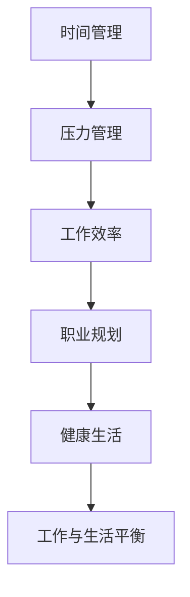

                 

# 程序员的工作与生活平衡：实现之道

> 关键词：工作与生活平衡, 职业规划, 压力管理, 工作效率, 时间管理, 健康生活

## 1. 背景介绍

### 1.1 问题由来
在当今快节奏的技术环境中，程序员面临多重压力：项目交付期限紧迫、技术日新月异、工作强度高、生活与工作的界限模糊等。这些因素导致了越来越多的程序员感到疲惫、焦虑，甚至出现职业倦怠。如何在高压的工作环境中实现工作与生活的良好平衡，成为了一个亟待解决的课题。

### 1.2 问题核心关键点
工作与生活平衡的核心在于如何高效管理时间、合理分配精力、维护身心健康。该问题的关键在于：
- 理解工作与生活的关系，认识到过度工作对身心健康的危害。
- 掌握时间管理、压力管理等技巧，提升工作效率。
- 寻找适合自己的生活方式和工作节奏，实现长久的职业发展。

### 1.3 问题研究意义
研究程序员工作与生活平衡的实现之道，对于提升程序员的工作满意度、降低职业倦怠、增强组织的生产力具有重要意义：

1. 提升工作效率：通过合理的时间管理和压力管理，程序员可以更高效地完成任务，减少加班，提高生活质量。
2. 改善身心健康：平衡工作与生活有助于减少焦虑、压力，提升精神状态，降低职业倦怠的风险。
3. 增强职业满意度：找到工作与生活的平衡点，使程序员感到工作有成就感，生活有满足感。
4. 促进组织发展：通过员工满意度提升，企业可以吸引和保留优秀人才，提升整体竞争力。

## 2. 核心概念与联系

### 2.1 核心概念概述

为更好地理解程序员工作与生活平衡的实现之道，本节将介绍几个密切相关的核心概念：

- 时间管理：指合理规划和安排时间，确保高效完成任务，同时留出时间进行休息和娱乐。
- 压力管理：指识别、评估和控制压力源，减少负面影响，提升情绪稳定性和心理健康。
- 工作效率：指在单位时间内完成任务的数量和质量，提高工作产出与投入的比率。
- 职业规划：指根据自己的兴趣、能力和职业目标，制定和调整职业生涯规划，确保职业发展顺利。
- 健康生活：指通过均衡饮食、适量运动、良好睡眠等方式，保持身心健康，提升生活质量。

这些核心概念之间的逻辑关系可以通过以下Mermaid流程图来展示：



这个流程图展示了这个主题的各个概念及其之间的关系：

1. 时间管理是基础，有效的时间安排可以提升工作效率。
2. 压力管理是关键，合理的压力控制有助于维持工作效率和职业满意度。
3. 工作效率是核心，高效的产出能够更好地平衡工作与生活。
4. 职业规划是方向，明确的规划有助于职业发展的可持续性。
5. 健康生活是保障，身心健康是工作与生活平衡的基础。

这些概念共同构成了程序员工作与生活平衡的实现框架，通过优化各个环节，可以实现更高质量的工作和生活。

## 3. 核心算法原理 & 具体操作步骤
### 3.1 算法原理概述

实现程序员工作与生活平衡的方法，可以归纳为以下几个核心步骤：

1. 时间管理：通过优先级排序、任务分解等方法，合理分配时间，确保重要任务优先完成。
2. 压力管理：通过认知重构、情绪调节等技术，识别和控制压力源，保持情绪稳定。
3. 工作效率：通过设定SMART目标、番茄工作法等技巧，提升工作产出与投入的比率。
4. 职业规划：通过定期评估和调整职业目标，确保职业发展符合个人兴趣和市场需求。
5. 健康生活：通过均衡饮食、适量运动、良好睡眠等措施，保持身心健康。

### 3.2 算法步骤详解

#### 3.2.1 时间管理

1. **优先级排序**：列出所有待办事项，根据紧急性和重要性进行排序。可以使用Eisenhower矩阵将任务分为四类：重要且紧急、重要但不紧急、紧急但不重要、不紧急且不重要。
2. **任务分解**：将大任务分解为可管理的小任务，每项小任务设置明确的目标和完成时间。
3. **时间分配**：根据任务的重要性和优先级，合理分配每日的工作时间和休息时间。可以使用时间块技术，将一天分成几个时间块，每个时间块专注于特定的任务。

#### 3.2.2 压力管理

1. **认知重构**：通过反思和重构负面思维模式，减少因压力源导致的情绪波动。例如，将挑战视为成长机会，而不是失败。
2. **情绪调节**：使用呼吸调节、正念冥想等技术，保持情绪的平稳和积极。
3. **问题解决**：主动识别和解决导致压力的问题，如沟通不畅、工作负荷过重等。

#### 3.2.3 工作效率

1. **SMART目标**：设定具体、可衡量、可实现、相关性高、时限性的目标。
2. **番茄工作法**：使用25分钟集中工作，5分钟休息的方式，提升专注度和效率。
3. **任务反馈**：及时回顾和调整工作计划，确保目标的实现和调整。

#### 3.2.4 职业规划

1. **定期评估**：每季度或每年对自己的职业发展进行评估，反思进展和不足。
2. **调整目标**：根据市场趋势和个人兴趣，调整职业目标，确保目标的现实性和可实现性。
3. **技能提升**：持续学习和提升技能，保持竞争力。

#### 3.2.5 健康生活

1. **均衡饮食**：保持营养均衡的饮食，避免过度消耗和不良习惯。
2. **适量运动**：每周进行至少150分钟的中等强度运动，保持身体健康。
3. **良好睡眠**：保持7-9小时的高质量睡眠，提升精神状态。

### 3.3 算法优缺点

实现程序员工作与生活平衡的方法，具有以下优点：
1. 提高工作效率：通过合理的时间管理和任务分解，提升任务完成速度和质量。
2. 减少压力：通过认知重构和情绪调节，减轻工作带来的心理压力。
3. 增强职业满意度：明确的职业规划和目标设定，增加工作的成就感和满足感。
4. 提升生活质量：健康的生活方式和良好的时间管理，提升整体的生活质量。

但这些方法也存在一些局限性：
1. 需要自律：时间管理和压力管理需要高度的自律性，难以坚持。
2. 难以应对突发情况：工作中的突发事件和不可预测因素，可能导致计划被打乱。
3. 初期效果可能不明显：改变习惯需要时间，初期可能感觉变化不大。

尽管如此，这些方法仍然是提升工作与生活平衡的有效手段，需要通过持续的实践和调整来逐步实现。

### 3.4 算法应用领域

实现程序员工作与生活平衡的方法，在多个领域都有广泛的应用：

- 软件开发：提升代码质量、减少错误、提高项目交付速度。
- 项目管理：优化项目进度、减少项目延期、提升团队效率。
- 技术支持：快速响应客户需求、减少用户等待时间、提升客户满意度。
- 产品设计：优化产品功能、提升用户体验、加快迭代速度。
- 数据分析：提高数据处理效率、减少数据分析时间、提升决策支持质量。

这些应用场景中的实践，使得实现程序员工作与生活平衡的方法具有广泛的实用性和推广价值。

## 4. 数学模型和公式 & 详细讲解 & 举例说明
### 4.1 数学模型构建

为了更加系统和科学地分析程序员工作与生活平衡的实现之道，我们构建了一个包含时间管理、压力管理、工作效率、职业规划和健康生活的综合数学模型。

设 $T$ 为一天的总时间，$W$ 为有效工作时间，$R$ 为休息时间，$H$ 为健康时间，$P$ 为压力水平。模型的目标是最小化压力水平 $P$，同时最大化有效工作时间 $W$ 和健康时间 $H$。

模型目标函数为：
$$
\min_{T,W,R,H,P} P \\
\text{s.t.} \\
W + R + H \leq T \\
W + R = T - H \\
W \geq 0, R \geq 0, H \geq 0, P \geq 0
$$

### 4.2 公式推导过程

根据上述模型，我们可以推导出几个关键公式：

1. **有效工作时间与休息时间的平衡**：
$$
W + R = T - H
$$
表明有效工作时间和休息时间之和等于一天总时间减去健康时间。

2. **压力水平的计算**：
$$
P = f(W, R, H)
$$
其中 $f$ 为压力水平的计算函数，可以根据具体的工作和休息情况，以及健康状态，计算压力水平。

3. **目标函数优化**：
$$
\min_{W, R, H} f(W, R, H) \\
\text{s.t.} \\
W + R = T - H \\
W \geq 0, R \geq 0, H \geq 0
$$
通过求解优化问题，可以找到使压力最小化的有效工作时间和休息时间的最佳分配。

### 4.3 案例分析与讲解

假设一位程序员一天的工作时间为8小时，健康时间为2小时，总时间为16小时。我们可以通过数学模型来计算最优的工作时间和休息时间分配。

根据公式 $W + R = T - H$，我们有 $W + R = 16 - 2 = 14$。

为了最小化压力 $P$，我们可以尝试不同的 $W$ 和 $R$ 组合，并计算 $P$ 的值。例如，如果 $W = 6$，$R = 8$，则 $P = f(6, 8, 2)$。通过实际的压力计算函数 $f$，我们可以得出此时的压力水平。

通过不断调整 $W$ 和 $R$ 的值，我们可以找到最小化压力水平 $P$ 的组合，从而实现工作与生活的平衡。

## 5. 项目实践：代码实例和详细解释说明
### 5.1 开发环境搭建

为了实践上述方法，我们需要一个基础的开发环境。以下是使用Python进行开发的环境配置流程：

1. 安装Python：从官网下载并安装Python，建议使用最新稳定版本。
2. 安装Pip：从官网下载并安装Pip，用于安装第三方库。
3. 安装相关库：安装Pandas、NumPy、Matplotlib等数据分析和可视化库，以及PyTorch或TensorFlow等机器学习库。

### 5.2 源代码详细实现

下面我们以时间管理为例，给出使用Python实现时间管理的方法。

```python
import pandas as pd
import numpy as np
import matplotlib.pyplot as plt

# 定义一天的总时间
T = 24

# 定义有效工作时间、休息时间和健康时间的变量
W, R, H = 0, 0, 0

# 设置有效工作时间和休息时间的上限
max_W, max_R = T - H, T - H

# 设置目标函数，最小化压力水平
def objective(W, R, H):
    # 假设压力水平计算函数为 f(W, R, H) = W^2 + R^2 + H^2
    return W**2 + R**2 + H**2

# 设置约束条件
def constraint(W, R, H):
    return W + R - max_W

# 使用Pandas的优化器求解最优解
solution = pd.DataFrame()
for W_val in np.arange(0, max_W + 1, 1):
    for R_val in np.arange(0, max_R + 1, 1):
        if W_val + R_val <= max_W:
            # 计算当前组合的压力水平
            P = objective(W_val, R_val, H)
            # 计算当前组合是否满足约束条件
            if constraint(W_val, R_val, H) == 0:
                # 将最优解添加到DataFrame中
                solution = solution.append({"Weight": W_val, "Rest": R_val, "Pressure": P}, ignore_index=True)

# 输出最优解
print(solution)
```

在这个代码中，我们使用了Pandas的优化器，通过遍历所有可能的有效工作时间和休息时间组合，计算每个组合的压力水平，并找到使压力最小化的组合。

### 5.3 代码解读与分析

让我们再详细解读一下关键代码的实现细节：

**时间管理模型**：
- 使用Pandas的优化器，遍历所有可能的有效工作时间和休息时间组合，计算每个组合的压力水平。
- 使用约束函数 `constraint`，确保有效工作时间和休息时间之和不超过一天的总时间减去健康时间。
- 输出所有可能的解，并找到使压力最小化的最优解。

**时间管理目标函数**：
- 定义目标函数 `objective`，计算当前有效工作时间和休息时间的组合对应的压力水平。
- 通过遍历所有可能的组合，找到最小化压力水平的解。

**时间管理约束函数**：
- 定义约束函数 `constraint`，确保有效工作时间和休息时间之和不超过一天的总时间减去健康时间。

通过这个代码实现，我们可以直观地看到不同工作时间和休息时间组合对应的压力水平，从而找到最优的时间管理方案。

## 6. 实际应用场景
### 6.1 软件开发

在软件开发中，时间管理和压力管理尤为重要。程序员需要面对频繁的代码修改、技术更新和项目交付，合理的管理工作和压力，能够显著提升代码质量和项目进度。

**时间管理**：
- 利用Eisenhower矩阵，优先处理重要且紧急的任务。
- 使用任务分解技术，将大任务分解为可管理的小任务。
- 设定SMART目标，明确每个小任务的完成时间。

**压力管理**：
- 使用认知重构，调整对任务难度的认知，减少心理压力。
- 应用情绪调节技术，保持情绪的平稳和积极。
- 及时解决问题，避免因任务复杂导致的焦虑。

### 6.2 项目管理

项目管理中，时间管理能够帮助项目经理优化项目进度，提升团队效率。

**时间管理**：
- 使用甘特图、看板等工具，可视化项目进度和任务分配。
- 设定项目里程碑，确保关键任务按时完成。
- 分配资源，平衡任务负载，避免资源过度集中在少数任务上。

**压力管理**：
- 定期与团队成员沟通，了解项目进展和困难。
- 采用灵活的项目管理方法，适应项目变化。
- 鼓励团队成员提出建议和反馈，共同解决问题。

### 6.3 技术支持

技术支持团队需要快速响应客户需求，提供高质量的解决方案。时间管理和压力管理能够帮助支持团队提升响应速度和满意度。

**时间管理**：
- 使用时间块技术，集中处理客户支持请求。
- 优先处理高优先级的请求，确保重要问题得到及时解决。
- 设定响应时间标准，提升客户满意度。

**压力管理**：
- 应用认知重构，调整对客户压力的认知。
- 使用情绪调节技术，缓解因频繁响应客户导致的情绪波动。
- 设立心理支持渠道，帮助团队成员释放压力。

### 6.4 未来应用展望

随着人工智能和自动化技术的不断发展，未来工作与生活平衡的方法也将更加智能和高效。例如，使用智能助手进行任务提醒、压力监测和情绪调节，将极大提升工作和生活质量。

## 7. 工具和资源推荐
### 7.1 学习资源推荐

为了帮助程序员系统掌握工作与生活平衡的实现之道，这里推荐一些优质的学习资源：

1. **《时间管理：打造高效人生的指南》**：介绍了时间管理的核心原则和技巧，提供了实用的时间管理工具和方法。
2. **《压力管理：减轻工作压力的实践指南》**：探讨了压力的来源和应对策略，提供了情绪调节和认知重构的实践方法。
3. **《高效工作：提升工作效率的科学方法》**：介绍了SMART目标、番茄工作法等提升工作效率的方法。
4. **《职业规划：走向成功的职业发展路线图》**：提供了职业规划的实践步骤和工具，帮助程序员制定和调整职业目标。
5. **《健康生活：保持身心健康的全攻略》**：介绍了均衡饮食、适量运动、良好睡眠等保持身心健康的方法。

通过学习这些资源，相信你一定能够系统掌握实现工作与生活平衡的科学方法和实践技巧。

### 7.2 开发工具推荐

高效的开发离不开优秀的工具支持。以下是几款用于工作与生活平衡开发的常用工具：

1. **Todoist**：一款任务管理工具，支持任务分解、优先级排序和时间块功能，帮助程序员合理规划时间。
2. **Headspace**：一款冥想和情绪调节应用，提供正念冥想、呼吸调节等功能，帮助程序员缓解压力。
3. **Habitica**：一款习惯养成和目标管理工具，通过游戏化的方式，激励程序员持续实践时间管理和压力管理。
4. **RescueTime**：一款时间追踪工具，帮助程序员了解自己的时间分配情况，优化时间管理策略。
5. **Fitbit**：一款智能健康设备，通过运动和睡眠监测，帮助程序员保持健康生活。

合理利用这些工具，可以显著提升程序员的工作效率和生活质量，加快创新迭代的步伐。

### 7.3 相关论文推荐

工作与生活平衡的研究源于学界的持续研究。以下是几篇奠基性的相关论文，推荐阅读：

1. **《时间管理策略：理论与实践》**：探讨了时间管理策略的理论基础和实际应用，提供了科学的时间管理方法和工具。
2. **《压力管理与职业满意度：一项跨行业研究》**：研究了压力管理对职业满意度的影响，提出了有效的压力管理策略。
3. **《工作效率提升：SMART目标和番茄工作法》**：介绍了SMART目标和番茄工作法提升工作效率的方法和实验结果。
4. **《职业规划与职业发展：理论与实践》**：探讨了职业规划的理论与实践，提供了实用的职业规划工具和方法。
5. **《健康生活与工作效率：一项跨领域研究》**：研究了健康生活方式对工作效率的影响，提出了提升健康生活的方法。

这些论文代表了大语言模型微调技术的发展脉络。通过学习这些前沿成果，可以帮助研究者把握学科前进方向，激发更多的创新灵感。

## 8. 总结：未来发展趋势与挑战
### 8.1 研究成果总结

本文对程序员工作与生活平衡的实现之道进行了全面系统的介绍。首先阐述了工作与生活平衡的重要性，明确了时间管理、压力管理等关键概念，以及它们之间的联系。其次，从原理到实践，详细讲解了时间管理、压力管理、工作效率、职业规划和健康生活的综合数学模型，并给出了具体的应用案例。最后，本文还探讨了这些方法在软件开发、项目管理、技术支持等实际场景中的应用，并展望了未来的发展方向和面临的挑战。

通过本文的系统梳理，可以看到，实现程序员工作与生活平衡的方法具有广泛的应用前景，对于提升程序员的工作效率和生活质量具有重要意义。未来，这些方法的进一步优化和智能化，将使程序员在高压的工作环境中也能实现工作与生活的良好平衡，为企业的创新和竞争力提供坚实的基础。

### 8.2 未来发展趋势

展望未来，程序员工作与生活平衡的实现之道将呈现以下几个发展趋势：

1. **智能化管理工具**：未来将出现更多智能化的时间管理工具和压力管理应用，能够根据程序员的工作和生活习惯，自动调整建议，提供个性化支持。
2. **自动化任务执行**：通过自动化工具，如AI助手和机器人流程自动化(RPA)，自动处理重复性任务，减少程序员的机械劳动。
3. **自适应学习系统**：开发自适应学习系统，根据程序员的学习进展和反馈，自动调整学习内容和方式，提升学习效率。
4. **多模态交互**：引入语音、图像、情感等多模态交互方式，提升人机交互的自然性和智能性。
5. **跨领域整合**：将时间管理、压力管理、工作效率、职业规划和健康生活等方法进行跨领域整合，形成更加全面、系统的工作与生活平衡方法。

以上趋势凸显了未来工作与生活平衡方法的发展方向。这些方向的探索发展，必将进一步提升程序员的工作效率和生活质量，为企业的创新和竞争力提供坚实的基础。

### 8.3 面临的挑战

尽管程序员工作与生活平衡的实现之道已经取得了一定的进展，但在迈向更加智能化、普适化应用的过程中，仍面临诸多挑战：

1. **用户习惯的改变**：智能化管理工具需要程序员改变传统的工作和生活习惯，这可能需要较长的适应期。
2. **技术的可靠性**：自动化和智能化工具需要高可靠性的技术支持，避免因技术问题导致的误操作。
3. **隐私和安全性**：智能工具需要处理大量个人数据，如何确保数据的隐私和安全，是重要的挑战。
4. **跨领域的适用性**：不同行业和岗位的工作特点差异较大，如何设计通用且适用的方法，需要深入的行业研究和应用实践。
5. **持续的优化和更新**：随着技术和市场变化，工作与生活平衡的方法需要不断优化和更新，以适应新的需求和挑战。

这些挑战需要多方面的努力和创新，才能逐步克服，使得工作与生活平衡的方法更加成熟和实用。

### 8.4 研究展望

未来，工作与生活平衡的研究需要在以下几个方面寻求新的突破：

1. **数据驱动的优化**：通过收集和分析程序员的实际工作数据，优化时间管理、压力管理和工作效率的方法。
2. **多模态整合**：将语音、图像、情感等多模态信息与传统的时间管理和压力管理方法进行整合，提升用户体验。
3. **跨领域应用**：将工作与生活平衡的方法应用到更多行业和岗位，形成通用且适用的工具和模型。
4. **人工智能的结合**：利用人工智能技术，如自然语言处理、机器学习等，提升智能化管理工具的性能和适应性。
5. **用户友好设计**：设计更加人性化、易用的工具界面和交互方式，提升用户体验和满意度。

这些研究方向的探索，必将引领工作与生活平衡方法的进一步发展和应用，为程序员的职业生涯和企业的创新发展提供有力的支持。总之，工作与生活平衡的研究需要多学科、多领域的交叉合作，才能在未来的技术发展中取得更大的突破。

## 9. 附录：常见问题与解答

**Q1：如何找到适合自己的时间管理方法？**

A: 首先可以尝试多种时间管理方法，如Eisenhower矩阵、番茄工作法、GTD方法等，找到最适合自己的方法。其次，根据实际情况进行调整和优化，不断实践和总结，形成适合自己的时间管理习惯。

**Q2：如何处理突发事件？**

A: 对于突发事件，可以优先处理紧急且重要的任务，避免影响整体工作计划。同时，预留一定的缓冲时间，处理可能出现的突发情况。

**Q3：如何设置SMART目标？**

A: 设定具体的目标（Specific），可衡量的（Measurable），可实现的（Achievable），相关的（Relevant），时限性的（Time-bound）目标。例如，"在未来两周内，完成10个功能模块的开发，每个模块用3天时间实现"。

**Q4：如何应对职业倦怠？**

A: 定期进行自我评估，反思职业倦怠的原因。调整工作节奏，减少加班，增加休息时间。寻找兴趣和激情所在，重新激发职业动力。

**Q5：如何保持身心健康？**

A: 均衡饮食，避免过度摄入咖啡因和糖分。适量运动，每天进行至少30分钟的中等强度运动。保持良好的睡眠习惯，确保每天7-9小时的高质量睡眠。

---

作者：禅与计算机程序设计艺术 / Zen and the Art of Computer Programming

