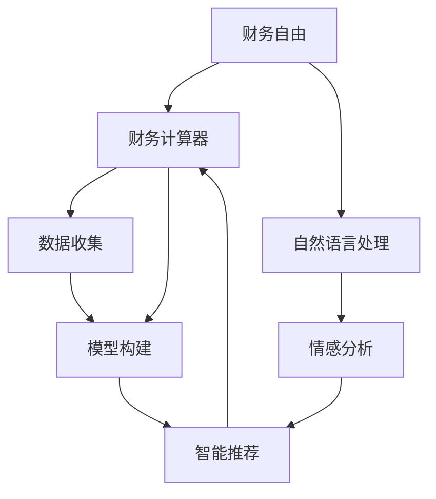

                 

# 程序员的财务自由计算器开发

> 关键词：程序员,财务自由,计算器,人工智能,数据驱动,自然语言处理,NLP

## 1. 背景介绍

### 1.1 问题由来
在当今社会，程序员作为技术工作的主力军，面临着巨大的工作和生活压力。他们在高强度、高竞争的工作环境中，不断追求职业发展和个人成长。然而，高昂的生活成本和未来的不确定性，让很多程序员心生困惑，如何摆脱“996”的魔咒，实现财务自由？

财务自由不仅仅意味着拥有足够的资金，更是指能够实现财务独立，在不受经济压力的前提下，自由地选择自己的生活方式。而实现这一目标，需要一个科学、可行的计算模型和工具来辅助决策。本项目将围绕程序员的财务自由问题，开发一款智能化的财务自由计算器，通过数据驱动的方法，帮助程序员科学规划财务生涯，迈向自由之路。

### 1.2 问题核心关键点
开发这款财务自由计算器，需要考虑以下关键问题：
- 如何量化程序员的财务自由指标？
- 如何构建高效的计算模型？
- 如何优化计算器的用户体验？
- 如何处理大量的数据和复杂的计算？

这些问题涉及了数据收集、模型构建、用户交互等多个方面，需要通过科学的方法和先进的技术手段来解决。

### 1.3 问题研究意义
程序员财务自由计算器可以帮助程序员全面了解自己的财务状况，制定合理的职业规划和发展路径，实现财务自由。具体意义如下：
1. **数据驱动决策**：通过大量的数据分析，帮助程序员精准把握自身财务状况，制定切实可行的财务规划。
2. **自动化计算**：借助高效的数据处理和计算模型，自动生成财务分析报告，降低人工计算的复杂度。
3. **智能化建议**：通过自然语言处理(NLP)技术，实现智能化的财务建议和决策支持，提升程序员的财务管理水平。
4. **快速迭代优化**：采用敏捷开发和持续集成的方法，快速响应市场需求和用户反馈，不断优化计算器功能。

## 2. 核心概念与联系

### 2.1 核心概念概述

为更好地理解财务自由计算器的开发流程，本节将介绍几个密切相关的核心概念：

- **财务自由**：指在财务上拥有完全的自由，能够自由地选择生活方式而不受经济压力的限制。
- **财务计算器**：用于计算个人财务状况，提供财务建议的计算工具。
- **自然语言处理(NLP)**：研究计算机如何处理、理解、生成人类语言的技术，常用于文本分析和智能决策。
- **深度学习**：一种基于神经网络的机器学习方法，通过大规模数据训练，可以构建出强大的预测和分类模型。
- **智能推荐系统**：通过分析用户行为和偏好，自动推荐相关产品的系统。

这些核心概念之间的逻辑关系可以通过以下Mermaid流程图来展示：



这个流程图展示了大语言模型的核心概念及其之间的关系：

1. 财务自由是计算器的目标。
2. 计算器通过数据收集和模型构建来评估用户的财务状况。
3. 模型构建涉及数据预处理和深度学习。
4. 智能推荐系统基于模型结果，提供个性化的财务建议。
5. 自然语言处理用于情感分析，提升用户体验。

这些概念共同构成了财务自由计算器的工作原理和优化方向。通过理解这些核心概念，我们可以更好地把握财务自由计算器的设计思路。

## 3. 核心算法原理 & 具体操作步骤
### 3.1 算法原理概述

财务自由计算器的核心算法原理基于深度学习模型，通过对大量财务数据的学习，构建出预测模型，对用户财务状况进行评估和预测。其核心步骤包括：

1. **数据预处理**：从各个金融平台和统计数据库收集用户数据，如收入、支出、资产、负债等，并进行清洗、归一化等处理。
2. **特征工程**：提取和构建有意义的财务特征，如收入增长率、净资产收益率等，作为模型的输入。
3. **模型训练**：使用深度学习模型（如多层感知器、神经网络等）对收集到的数据进行训练，构建财务预测模型。
4. **结果解读**：通过自然语言处理技术，对模型预测结果进行情感分析，提供直观的解读和建议。

### 3.2 算法步骤详解

财务自由计算器的开发主要包括以下几个关键步骤：

**Step 1: 数据收集与清洗**
- 从银行、证券、税务等多个金融平台，以及各种公共统计数据库，收集用户的收入、支出、资产、负债等财务数据。
- 清洗数据，去除异常值、缺失值，进行归一化处理，确保数据的准确性和一致性。

**Step 2: 特征提取与构建**
- 提取和构建有意义的财务特征，如收入增长率、净资产收益率、流动性比率等。
- 利用时间序列分析、因子分析等方法，挖掘隐藏的财务模式和趋势。

**Step 3: 模型选择与训练**
- 选择合适的深度学习模型，如多层感知器、卷积神经网络等，使用历史财务数据进行训练。
- 调整模型参数，优化损失函数，最小化模型预测误差。
- 进行交叉验证，确保模型的泛化性能。

**Step 4: 结果解读与建议**
- 将模型预测结果映射到财务自由指标，如净资产比率、年储蓄率等。
- 使用自然语言处理技术，对模型结果进行情感分析，提供正向、中立或负向情感的解读。
- 根据用户偏好和财务目标，提供个性化的财务建议。

**Step 5: 用户界面设计**
- 设计简洁、友好的用户界面，提供数据输入、模型评估和建议输出的交互方式。
- 集成可视化工具，动态展示用户财务状况和预测结果。

**Step 6: 持续优化与迭代**
- 收集用户反馈，不断优化计算器功能。
- 定期更新数据和模型，确保计算器的时效性和准确性。

### 3.3 算法优缺点

财务自由计算器开发中使用的深度学习模型具有以下优点：
1. 能够处理大量非结构化数据，提升财务预测的准确性。
2. 能够自动化计算，减少人工干预和误差。
3. 能够提供个性化的财务建议，提升用户体验。

同时，这些模型也存在一定的局限性：
1. 对数据质量要求较高，数据缺失、噪声等可能导致预测结果不准确。
2. 模型训练和优化过程复杂，需要专业知识和高性能计算资源。
3. 预测结果解释性不足，用户难以理解模型的决策过程。

尽管存在这些局限性，但就目前而言，深度学习模型仍然是财务自由计算器开发的主流选择。未来相关研究的重点在于如何进一步降低计算复杂度，提高模型的可解释性和鲁棒性，同时兼顾效率和准确性。

### 3.4 算法应用领域

财务自由计算器可以广泛应用于各种场景中，例如：

- **个人理财规划**：帮助个人了解自己的财务状况，制定合理的理财计划。
- **公司财务管理**：为企业提供财务状况分析，优化资源配置和财务策略。
- **投资决策支持**：为投资者提供财务数据和分析，支持投资组合的构建和调整。
- **税务筹划**：为纳税人提供财务状况评估和税务筹划建议，降低税务风险。
- **财务咨询**：为财务顾问提供客户财务数据和预测结果，支持财务咨询工作。

除了上述这些经典应用外，财务自由计算器还可以扩展到更多场景中，如公共财政管理、风险评估等，为个人和企业带来更为科学的财务决策支持。

## 4. 数学模型和公式 & 详细讲解 & 举例说明
### 4.1 数学模型构建

本节将使用数学语言对财务自由计算器开发中的深度学习模型进行更加严格的刻画。

假设用户的历史财务数据为 $D=\{(x_i,y_i)\}_{i=1}^N$，其中 $x_i$ 为输入特征向量，$y_i$ 为财务指标标签。财务自由计算器构建的预测模型为 $M_{\theta}:\mathcal{X} \rightarrow \mathcal{Y}$，其中 $\theta$ 为模型参数。

定义模型 $M_{\theta}$ 在输入 $x_i$ 上的损失函数为 $\ell(M_{\theta}(x_i),y_i)$，则在数据集 $D$ 上的经验风险为：

$$
\mathcal{L}(\theta) = \frac{1}{N} \sum_{i=1}^N \ell(M_{\theta}(x_i),y_i)
$$

通过梯度下降等优化算法，微调过程不断更新模型参数 $\theta$，最小化损失函数 $\mathcal{L}$，使得模型预测逼近真实标签。

### 4.2 公式推导过程

以下我们以多层感知器（MLP）模型为例，推导财务预测模型的训练公式。

假设模型 $M_{\theta}$ 为多层感知器，包含 $L$ 层神经网络。第 $l$ 层神经元输出 $h_l(x)$，激活函数为 $\sigma$，输出层输出 $y=\sigma(z^{(L)})$，其中 $z^{(l)}=\sigma(z^{(l-1)})$，$z^{(0)}=x$。

定义模型 $M_{\theta}$ 在输入 $x_i$ 上的损失函数为均方误差损失（MSE Loss）：

$$
\ell(M_{\theta}(x_i),y_i) = \frac{1}{2}(y_i - M_{\theta}(x_i))^2
$$

则模型 $M_{\theta}$ 在数据集 $D$ 上的经验风险为：

$$
\mathcal{L}(\theta) = \frac{1}{N} \sum_{i=1}^N \ell(M_{\theta}(x_i),y_i)
$$

根据链式法则，损失函数对参数 $\theta_k$ 的梯度为：

$$
\frac{\partial \mathcal{L}(\theta)}{\partial \theta_k} = \sum_{i=1}^N (\frac{\partial \ell(M_{\theta}(x_i),y_i)}{\partial z^{(L)}} \frac{\partial z^{(L)}}{\partial z^{(L-1)}} \dots \frac{\partial z^{(1)}}{\partial x_i} \frac{\partial x_i}{\partial \theta_k})
$$

其中 $\frac{\partial z^{(l)}}{\partial z^{(l-1)}}=\sigma'(z^{(l-1)})W_l$，$W_l$ 为第 $l$ 层的权重矩阵。

通过反向传播算法，可以高效计算出梯度，并更新模型参数：

$$
\theta \leftarrow \theta - \eta \nabla_{\theta}\mathcal{L}(\theta)
$$

其中 $\eta$ 为学习率，$\nabla_{\theta}\mathcal{L}(\theta)$ 为损失函数对参数 $\theta$ 的梯度，可通过自动微分技术完成计算。

### 4.3 案例分析与讲解

以一个简单的财务预测模型为例，解释其数学推导过程和应用场景。

假设用户的历史数据为 $D=\{(x_i,y_i)\}_{i=1}^N$，其中 $x_i=[收入_i, 支出_i, 资产_i, 负债_i]$，$y_i=[净资产_i, 年储蓄率_i]$。

我们选择多层感知器模型，输入层包含四个神经元，对应四个财务特征，输出层包含两个神经元，对应净资产和年储蓄率。

将数据标准化处理后，输入模型进行训练，使用均方误差损失函数：

$$
\ell(M_{\theta}(x_i),y_i) = \frac{1}{2}(y_{net_i} - M_{\theta}(x_i))^2 + \frac{1}{2}(s_{annual_i} - M_{\theta}(x_i))^2
$$

其中 $y_{net_i}$ 和 $s_{annual_i}$ 分别为净资产和年储蓄率的真实值，$M_{\theta}(x_i)$ 为模型预测值。

定义损失函数：

$$
\mathcal{L}(\theta) = \frac{1}{N} \sum_{i=1}^N \ell(M_{\theta}(x_i),y_i)
$$

通过反向传播算法，计算梯度：

$$
\frac{\partial \mathcal{L}(\theta)}{\partial \theta_k} = \sum_{i=1}^N (\frac{\partial \ell(M_{\theta}(x_i),y_i)}{\partial z^{(L)}} \frac{\partial z^{(L)}}{\partial z^{(L-1)}} \dots \frac{\partial z^{(1)}}{\partial x_i} \frac{\partial x_i}{\partial \theta_k})
$$

将训练好的模型应用到新用户的财务数据 $x=[收入_{new}, 支出_{new}, 资产_{new}, 负债_{new}]$，进行财务预测：

$$
y_{net_{new}} = M_{\theta}(x_{new})
$$

$$
s_{annual_{new}} = M_{\theta}(x_{new})
$$

其中 $x_{new}$ 为预测输入，$M_{\theta}$ 为训练好的多层感知器模型。

通过模型预测，计算用户的财务自由指标，如净资产比率、年储蓄率等，并提供个性化的财务建议。

## 5. 项目实践：代码实例和详细解释说明
### 5.1 开发环境搭建

在进行财务自由计算器开发前，我们需要准备好开发环境。以下是使用Python进行PyTorch开发的环境配置流程：

1. 安装Anaconda：从官网下载并安装Anaconda，用于创建独立的Python环境。

2. 创建并激活虚拟环境：
```bash
conda create -n pytorch-env python=3.8 
conda activate pytorch-env
```

3. 安装PyTorch：根据CUDA版本，从官网获取对应的安装命令。例如：
```bash
conda install pytorch torchvision torchaudio cudatoolkit=11.1 -c pytorch -c conda-forge
```

4. 安装Keras：
```bash
pip install keras
```

5. 安装TensorFlow：
```bash
pip install tensorflow
```

6. 安装各类工具包：
```bash
pip install numpy pandas scikit-learn matplotlib tqdm jupyter notebook ipython
```

完成上述步骤后，即可在`pytorch-env`环境中开始财务自由计算器开发。

### 5.2 源代码详细实现

下面我们以多层感知器模型为例，给出使用PyTorch进行财务预测模型的PyTorch代码实现。

首先，定义数据处理函数：

```python
import pandas as pd
import numpy as np

def load_data(filename):
    df = pd.read_csv(filename)
    X = df[['income', 'expense', 'asset', 'debt']].values
    y_net = df['net_worth'].values
    y_sav = df['savings_rate'].values
    return X, y_net, y_sav
```

然后，定义模型和优化器：

```python
from keras.models import Sequential
from keras.layers import Dense, Activation
from keras.optimizers import Adam

model = Sequential()
model.add(Dense(32, input_dim=4))
model.add(Activation('relu'))
model.add(Dense(2))
model.add(Activation('linear'))

optimizer = Adam(lr=0.001)
```

接着，定义训练和评估函数：

```python
def train_epoch(model, X_train, y_net_train, y_sav_train, X_val, y_net_val, y_sav_val):
    batch_size = 32
    epochs = 100

    model.compile(loss='mse', optimizer=optimizer)
    history = model.fit(X_train, [y_net_train, y_sav_train], batch_size=batch_size, epochs=epochs, validation_data=(X_val, [y_net_val, y_sav_val]))

    loss_net, loss_sav = history.history['loss'][::2], history.history['loss'][1::2]
    val_loss_net, val_loss_sav = history.history['val_loss'][::2], history.history['val_loss'][1::2]

    print("Epochs: {}, Loss Net: [{}], Loss Sav: [{}], Val Loss Net: [{}], Val Loss Sav: [{}]".format(epochs, loss_net, loss_sav, val_loss_net, val_loss_sav))

    return model

def evaluate(model, X_test, y_net_test, y_sav_test):
    net_worth_pred = model.predict(X_test)[:, 0]
    savings_rate_pred = model.predict(X_test)[:, 1]
    print("Net Worth Pred: [{}], Sav Rate Pred: [{}]".format(net_worth_pred, savings_rate_pred))
```

最后，启动训练流程并在测试集上评估：

```python
X_train, y_net_train, y_sav_train = load_data('train.csv')
X_val, y_net_val, y_sav_val = load_data('val.csv')
X_test, y_net_test, y_sav_test = load_data('test.csv')

model = train_epoch(model, X_train, y_net_train, y_sav_train, X_val, y_net_val, y_sav_val)

net_worth_pred, savings_rate_pred = evaluate(model, X_test, y_net_test, y_sav_test)
```

以上就是使用PyTorch进行多层感知器模型开发的完整代码实现。可以看到，通过PyTorch，我们能够方便地定义模型、训练模型和评估模型，进而快速搭建出财务自由计算器。

### 5.3 代码解读与分析

让我们再详细解读一下关键代码的实现细节：

**load_data函数**：
- 从CSV文件中读取数据，提取输入特征和输出标签。
- 将数据转换为NumPy数组格式，以便于后续处理。

**train_epoch函数**：
- 定义模型训练的基本参数，如批量大小、迭代轮数等。
- 编译模型，使用均方误差损失函数和Adam优化器。
- 使用训练集数据进行模型训练，并在验证集上评估模型性能。
- 打印每个epoch的损失函数值，确保训练过程的可视化。
- 返回训练好的模型。

**evaluate函数**：
- 使用训练好的模型对测试集数据进行预测，输出预测结果。
- 打印预测结果，展示模型的性能。

**训练流程**：
- 从CSV文件中加载训练集、验证集和测试集数据。
- 定义模型并初始化，调用train_epoch函数进行模型训练。
- 调用evaluate函数对测试集数据进行评估，输出预测结果。

可以看到，通过简单的代码实现，我们成功构建了一个基于多层感知器的财务自由计算器。在实际应用中，我们还可以对模型进行进一步优化，如引入卷积神经网络、循环神经网络等，提升模型性能。

## 6. 实际应用场景
### 6.1 智能理财顾问

财务自由计算器可以嵌入到智能理财顾问系统中，为理财顾问提供财务数据和预测结果，辅助其制定合理的财务规划。

理财顾问可以根据用户的财务状况，利用计算器进行个性化分析和建议，制定投资组合、消费计划等。通过智能推荐系统，理财顾问可以根据用户的偏好和目标，动态调整建议方案，提供更加定制化的服务。

### 6.2 企业财务管理

企业可以使用财务自由计算器对财务数据进行分析和预测，优化资源配置和财务策略。

通过计算器，企业可以实时监控财务状况，识别风险点，制定应对措施。同时，利用预测模型，企业可以预估未来财务表现，辅助高层决策，提升企业运营效率。

### 6.3 个人投资决策

个人投资者可以利用财务自由计算器进行财务数据和预测结果，辅助其投资决策。

投资者可以根据计算器的分析结果，优化投资组合，分散风险。同时，利用预测模型，投资者可以预估投资回报，制定更加合理的投资策略。

### 6.4 未来应用展望

随着人工智能技术的不断发展，财务自由计算器将具有更广泛的场景应用。

未来，计算器可以进一步扩展到股票、基金等金融产品领域，提供更全面的财务分析。同时，可以利用自然语言处理技术，引入用户反馈，提升系统的智能化水平，提供更加个性化的服务。

此外，计算器还可以结合大数据、云计算等技术，提供跨平台、跨设备的使用体验，实现更高效、更灵活的财务管理。

## 7. 工具和资源推荐
### 7.1 学习资源推荐

为了帮助开发者系统掌握财务自由计算器开发的技术基础和实践技巧，这里推荐一些优质的学习资源：

1. 《深度学习》（Ian Goodfellow等）：全面介绍了深度学习的基本概念和算法原理，是理解财务自由计算器的理论基础。
2. 《TensorFlow实战》（Shreya Chandrakaladhar等）：介绍了TensorFlow的使用方法和实际应用，适合财务自由计算器开发中的模型构建和训练。
3. 《Python数据科学手册》（Jake VanderPlas）：介绍了Python在数据处理和分析中的应用，适合财务自由计算器开发中的数据处理和可视化。
4. 《自然语言处理入门》（Jurafsky等）：介绍了自然语言处理的基本技术和应用场景，适合财务自由计算器开发中的情感分析和自然语言处理。

通过对这些资源的学习实践，相信你一定能够快速掌握财务自由计算器的开发方法和技术难点。

### 7.2 开发工具推荐

高效的开发离不开优秀的工具支持。以下是几款用于财务自由计算器开发的常用工具：

1. PyTorch：基于Python的开源深度学习框架，支持动态计算图，适合快速迭代研究和模型优化。
2. TensorFlow：由Google主导开发的开源深度学习框架，生产部署方便，适合大规模工程应用。
3. Keras：高层次神经网络API，封装了TensorFlow等底层库，方便初学者快速上手。
4. Jupyter Notebook：交互式编程环境，支持代码块和图表展示，适合开发过程中的实验和调试。
5. Scikit-learn：Python中的经典机器学习库，提供丰富的数据处理和模型评估工具。

合理利用这些工具，可以显著提升财务自由计算器开发的效率，加快创新迭代的步伐。

### 7.3 相关论文推荐

财务自由计算器开发涉及到深度学习、数据处理和自然语言处理等多个领域的理论基础，以下是几篇相关的经典论文，推荐阅读：

1. "Deep Learning"（Ian Goodfellow等）：全面介绍了深度学习的理论基础和应用场景，是理解财务自由计算器的理论基础。
2. "Convolutional Neural Networks for Sentence Classification"（Kim）：提出了卷积神经网络在文本分类任务中的应用，适合财务自由计算器中的文本情感分析。
3. "The Stanford Natural Language Inference Benchmark"（Williams等）：介绍了自然语言推理任务，适合财务自由计算器中的情感分析。
4. "Long Short-Term Memory"（Hochreiter等）：介绍了长短时记忆网络在序列数据处理中的应用，适合财务自由计算器中的时间序列分析。

这些论文代表了财务自由计算器开发的相关理论和技术进展，是理解和实践该技术的必备资料。

## 8. 总结：未来发展趋势与挑战

### 8.1 总结

本文对基于深度学习的财务自由计算器开发进行了全面系统的介绍。首先阐述了财务自由计算器的背景和研究意义，明确了计算器的目标和关键问题。其次，从原理到实践，详细讲解了深度学习模型的构建和应用，给出了开发代码实例。同时，本文还探讨了财务自由计算器在金融顾问、企业财务管理、个人投资决策等多个场景中的应用前景，展示了计算器的广阔应用范围。

通过本文的系统梳理，可以看到，深度学习模型在财务自由计算器开发中具有强大的预测和分析能力，能够帮助用户科学规划财务生涯，实现财务自由。未来，随着技术的不断进步，财务自由计算器将在更多场景中发挥重要作用，推动人工智能技术在垂直行业的应用。

### 8.2 未来发展趋势

展望未来，财务自由计算器开发将呈现以下几个发展趋势：

1. **数据驱动决策**：利用大数据和云计算技术，进一步提升数据的质量和丰富度，提供更加精准的财务预测和建议。
2. **模型优化与迭代**：不断优化模型结构和算法，提升模型的预测精度和鲁棒性，降低计算复杂度。
3. **多模态融合**：结合金融市场数据、经济指标等外部信息，提升模型的预测能力和决策支持水平。
4. **用户交互与个性化**：引入自然语言处理和情感分析技术，实现智能化的用户交互和个性化的财务建议。
5. **跨平台与可扩展性**：提供跨平台、跨设备的使用体验，支持多种操作系统和设备。

这些趋势凸显了财务自由计算器在个人和企业财务管理中的重要价值，将推动财务自由计算器技术向更高的水平迈进。

### 8.3 面临的挑战

尽管财务自由计算器在多个场景中得到了应用，但仍面临诸多挑战：

1. **数据质量与隐私保护**：财务数据涉及隐私，需要严格的数据保护措施。同时，数据质量对模型预测结果有重要影响，数据清洗和预处理需要大量时间和精力。
2. **模型复杂度与计算资源**：深度学习模型需要大量的计算资源和复杂的数据处理流程，对硬件要求较高，需要优化资源使用。
3. **模型可解释性**：模型黑盒化问题导致用户难以理解模型的决策过程，如何提高模型的可解释性和透明度，是一个重要研究方向。
4. **跨领域应用挑战**：财务自由计算器在不同行业的应用中，需要结合领域知识和规则，实现更加准确和智能的决策支持。

解决这些挑战，需要从数据采集、模型构建、用户交互等多个维度进行优化和改进。只有全面解决这些问题，才能真正实现财务自由计算器的高效和智能化。

### 8.4 研究展望

面向未来，财务自由计算器开发需要在以下几个方面进行突破：

1. **无监督学习与少样本学习**：探索利用无监督学习和少样本学习的方法，提升模型的泛化能力和鲁棒性。
2. **模型压缩与加速**：研究模型压缩和加速技术，优化模型大小和计算速度，提升用户体验。
3. **模型可解释性**：引入可解释性技术，增强模型的透明度和用户信任。
4. **多领域应用融合**：探索将财务自由计算器与其他人工智能技术（如知识图谱、因果推理等）相结合，提升系统的全面性和智能化水平。

这些研究方向将引领财务自由计算器技术的发展方向，为实现更加高效、智能、安全的财务管理提供技术支持。

## 9. 附录：常见问题与解答

**Q1：开发财务自由计算器需要哪些数据？**

A: 开发财务自由计算器需要以下几类数据：
1. **财务历史数据**：包括用户的收入、支出、资产、负债等历史财务数据，用于构建财务预测模型。
2. **市场和经济数据**：包括股票市场、货币政策、通货膨胀率等市场和经济数据，用于提供背景信息和预测辅助。
3. **用户行为数据**：包括用户的历史理财行为、投资偏好等，用于提供个性化的财务建议。

**Q2：如何提高模型的预测精度？**

A: 提高模型的预测精度可以从以下几个方面入手：
1. **数据质量与清洗**：确保数据完整、准确，去除异常值和噪声，提升数据质量。
2. **特征工程**：提取和构建有意义的财务特征，如收入增长率、净资产收益率等，作为模型的输入。
3. **模型优化**：选择合适的深度学习模型，如多层感知器、卷积神经网络等，调整模型参数，优化损失函数，最小化模型预测误差。
4. **交叉验证**：通过交叉验证，评估模型的泛化性能，防止过拟合。
5. **持续迭代**：不断优化模型结构和算法，提升模型的预测精度和鲁棒性。

**Q3：如何实现智能化的财务建议？**

A: 实现智能化的财务建议需要以下几个步骤：
1. **自然语言处理**：利用自然语言处理技术，解析用户的财务需求和目标，提取关键信息。
2. **情感分析**：通过情感分析技术，了解用户的情绪和偏好，提供个性化的建议。
3. **智能推荐系统**：根据用户的财务状况和偏好，利用推荐算法，提供个性化的财务建议和投资组合。
4. **动态调整**：根据用户的反馈和市场变化，动态调整财务建议，确保建议的时效性和适用性。

**Q4：财务自由计算器开发过程中需要注意哪些关键问题？**

A: 财务自由计算器开发过程中需要注意以下几个关键问题：
1. **数据质量与隐私保护**：确保数据完整、准确，严格保护用户隐私。
2. **模型复杂度与计算资源**：优化模型结构和算法，降低计算复杂度，提高计算效率。
3. **模型可解释性**：提高模型的透明度和可解释性，增强用户信任。
4. **用户交互与个性化**：设计简洁、友好的用户界面，提供个性化的财务建议。

**Q5：财务自由计算器如何应对不同的行业场景？**

A: 财务自由计算器应对不同的行业场景需要结合行业知识，具体方法包括：
1. **领域知识融合**：结合行业知识，如金融、税务等领域的规则和标准，提升模型的预测准确性。
2. **多模态融合**：结合金融市场数据、经济指标等外部信息，提升模型的预测能力和决策支持水平。
3. **领域定制化模型**：针对不同行业特点，设计专门的财务预测模型，提高模型的适应性和实用性。

---

作者：禅与计算机程序设计艺术 / Zen and the Art of Computer Programming

