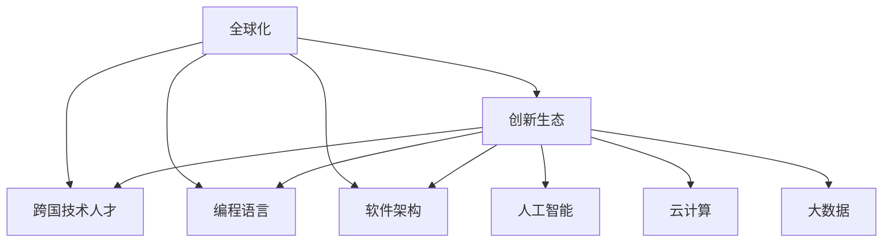

                 

# 程序员的跨国发展：硅谷、中国与东南亚的机遇

> 关键词：全球化，跨国技术人才，创新生态，职业生涯发展，编程语言，软件架构，人工智能，云计算，大数据

## 1. 背景介绍

在全球化时代，技术的边界正在逐渐模糊。各国之间的技术交流日益频繁，为程序员的跨国发展提供了广阔的舞台。硅谷、中国和东南亚等地区的技术创新生态各具特色，吸引了全球程序员的目光。本文将从背景、核心概念与联系、核心算法原理及具体操作步骤等角度，全面探讨程序员在硅谷、中国与东南亚的跨国发展机遇。

### 1.1 问题由来

随着互联网技术的普及和信息技术的不断进步，全球各地的技术生态系统都在快速发展。尤其是硅谷、中国和东南亚等地区，成为全球技术创新的热点。这些地区不仅拥有领先的技术平台和丰富的应用场景，还具备完善的职业发展体系和开放的人才市场。程序员的跨国发展，意味着可以在不同地区积累经验、拓宽视野，甚至探索全新的职业路径。

## 2. 核心概念与联系

### 2.1 核心概念概述

为更好地理解程序员的跨国发展，本节将介绍几个密切相关的核心概念：

- 全球化（Globalization）：技术的全球化促进了各国间的信息交流和知识共享，程序员的跨国流动成为可能。
- 跨国技术人才（Global Tech Talent）：在全球化背景下，程序员可以通过跨国流动，获取更广泛的知识和技能，拓展职业边界。
- 创新生态（Innovation Ecosystem）：指的是一个地区的技术创新体系，包括研发、创业、资本、市场等多方面要素。
- 编程语言与软件架构（Programming Language & Software Architecture）：程序员需要掌握不同地区的编程语言和软件架构风格，以适应不同的开发环境和工具链。
- 人工智能（AI）与云计算（Cloud Computing）：这些技术是当前全球技术创新的重点，程序员可以在不同地区参与到这些前沿领域的研究和应用中。
- 大数据（Big Data）：大数据技术是处理海量数据的关键工具，程序员可以在不同地区积累处理不同类型数据的实践经验。

这些核心概念之间的逻辑关系可以通过以下Mermaid流程图来展示：



这个流程图展示了几大核心概念及其之间的关系：

1. 全球化是基础，通过信息流通促进了程序员的跨国流动。
2. 跨国技术人才是在全球化背景下，程序员实现发展的目标群体。
3. 创新生态提供了一个良好的技术交流与合作环境，吸引全球人才。
4. 编程语言与软件架构是程序员在技术领域的基础工具。
5. 人工智能、云计算和大数据是当前技术创新的前沿领域，对程序员的技能要求较高。

这些概念共同构成了程序员跨国发展的理论基础，为后续讨论提供了清晰的框架。

## 3. 核心算法原理 & 具体操作步骤

### 3.1 算法原理概述

程序员的跨国发展，本质上是一个跨文化、跨技术的知识迁移和技能提升过程。通过在不同地区的工作和学习，程序员可以获得新的编程语言和软件架构经验，掌握前沿技术的最新进展，并理解不同地区的商业环境和技术需求。

形式化地，假设程序员甲在地区A学习编程语言和软件架构，后到地区B从事人工智能相关的项目。设甲在地区A掌握的技能集为 $S_A$，在地区B学习到的技能集为 $S_B$，则跨国发展的效果可以表示为：

$$
S_{AB} = S_A \cap S_B \cup S_{new}
$$

其中 $S_{new}$ 表示在地区B新学习的技能。

### 3.2 算法步骤详解

程序员的跨国发展可以通过以下几个关键步骤实现：

**Step 1: 选择合适的地区**
- 根据个人兴趣和职业规划，选择适合的跨国目标地区。硅谷、中国和东南亚等地区各具特色，可以根据自己的职业需求选择。

**Step 2: 学习目标地区的编程语言和软件架构**
- 在目标地区，先熟悉当地的编程语言和开发环境，学习流行的软件架构风格。例如，硅谷地区的Java、Python等技术栈，中国的Go、Kotlin等，东南亚地区的PHP、Ruby等。

**Step 3: 参与本地技术社区和项目**
- 积极参与本地的技术社区，如Meetup、GitHub等，参加技术会议和讲座，拓展人脉和知识面。同时，通过参与开源项目，积累实际开发经验。

**Step 4: 寻找工作机会**
- 利用LinkedIn、Indeed等招聘网站，寻找本地岗位机会，或通过内部推荐进入本地公司。也可考虑灵活的自由职业者方式，如自由职业平台Freelancer、Upwork等。

**Step 5: 持续学习和提升**
- 在新的环境中，不断学习新技术，参加培训和认证，如Google、AWS等云服务提供商提供的认证课程。同时，利用本地资源，如大学、科研机构等，进行深入学习和研究。

**Step 6: 跨文化适应**
- 注意文化差异，积极融入本地工作和生活环境。尊重本地工作习惯，理解不同地区的商业文化和沟通方式。

### 3.3 算法优缺点

程序员的跨国发展具有以下优点：
1. 拓宽技能边界。通过在不同地区的学习和实践，获得新的编程语言和软件架构经验，提升综合能力。
2. 增强职业竞争力。不同地区的技术需求和应用场景不同，跨国经历可以丰富简历，提高职业竞争力。
3. 丰富职业路径。跨国流动可以探索新的职业机会，如创业、咨询等，拓宽职业选择。

同时，该方法也存在一定的局限性：
1. 语言和文化障碍。不同地区的工作环境和文化差异，可能导致适应困难。
2. 移民和签证问题。跨国流动可能需要办理签证，并适应新的移民政策，增加了复杂性。
3. 家庭和社交网络。离开熟悉的环境和社交网络，需要建立新的生活圈。

尽管存在这些局限性，但就目前而言，程序员的跨国发展仍然是一个具有吸引力的选择。通过系统规划和积极适应，许多程序员已经在全球各地取得了成功，为技术交流和全球合作开辟了新的道路。

### 3.4 算法应用领域

程序员的跨国发展在多个领域中得到了应用，包括但不限于：

- 云计算和大数据：程序员可以在全球各地参与到AWS、Google Cloud等云服务提供商的开发和运维中。
- 人工智能和机器学习：通过参与全球各地的AI研究项目和创业公司，获取最新的AI算法和应用实践。
- 软件架构与系统设计：了解不同地区流行的系统架构和技术栈，提升系统设计能力。
- 移动应用开发：根据本地市场的需求，开发适合不同地区的移动应用，如东南亚市场的LBS（Location-Based Services）应用。

## 4. 数学模型和公式 & 详细讲解 & 举例说明

### 4.1 数学模型构建

为更好地理解程序员的跨国发展，我们可以使用数学模型来表示和分析这一过程。

设程序员甲在地区A和地区B的技能集分别为 $S_A$ 和 $S_B$，在地区B新学习的技能集为 $S_{new}$，则跨国发展的效果可以表示为：

$$
S_{AB} = S_A \cap S_B \cup S_{new}
$$

其中 $S_{AB}$ 表示跨国后的总技能集，$S_A \cap S_B$ 表示在两地共有的技能，$S_{new}$ 表示在地区B新学习的技能。

### 4.2 公式推导过程

为了更好地理解上述模型，我们以程序员甲在硅谷和中国的跨国发展为例，进行详细推导。

假设程序员甲在硅谷掌握了Python、Java等编程语言，参与过AI、机器学习等项目，积累了丰富的软件开发经验。设甲在硅谷的技能集为 $S_A = \{Python, Java, AI, Machine Learning, Software Development\}$。

甲来到中国后，学习了Go、Kotlin等编程语言，并参与了大数据、云计算等项目，积累了新的技能。设甲在中国的技能集为 $S_B = \{Go, Kotlin, Big Data, Cloud Computing, Software Development\}$。

跨国发展后的技能集 $S_{AB}$ 可以表示为：

$$
S_{AB} = S_A \cap S_B \cup S_{new} = \{Python, Java, AI, Machine Learning, Software Development\} \cap \{Go, Kotlin, Big Data, Cloud Computing, Software Development\} \cup \{Go, Kotlin, Big Data, Cloud Computing\}
$$

化简得：

$$
S_{AB} = \{Python, Java, AI, Machine Learning, Software Development, Go, Kotlin, Big Data, Cloud Computing\}
$$

可以看到，甲在跨国发展后，不仅保留了原有的技能，还学习并掌握了新的技能，实现了技能的多样化和提升。

### 4.3 案例分析与讲解

以下是一个具体的案例，说明程序员甲在中国和东南亚的跨国发展过程：

**案例：**
程序员甲在美国某科技公司从事机器学习算法开发，掌握了Python、Java等编程语言，并积累了丰富的项目经验。在某个项目中，甲有机会参与到大数据和云计算相关的项目，学习了Hadoop、Spark、AWS等技术。

随后，甲决定跨国到中国发展，进入国内某大数据科技公司，继续从事机器学习和大数据项目。甲在中国学习了Go、Kotlin等编程语言，并深入了解了Hadoop、Spark等大数据技术，同时参与了AWS相关的云计算项目。

最后，甲前往东南亚发展，进入当地某金融科技公司，参与区块链和人工智能项目。甲在东南亚学习了智能合约、区块链、Go等技术，并掌握了本地的金融知识。

通过这一过程，甲不仅在原有的机器学习和AI领域保持了竞争力，还学习了新的编程语言和大数据技术，拓展了职业路径，参与了本地特色的区块链项目，实现了全面发展和多样化技能的提升。

## 5. 项目实践：代码实例和详细解释说明

### 5.1 开发环境搭建

在进行跨国发展实践前，我们需要准备好开发环境。以下是使用Python进行跨地区开发的开发环境配置流程：

1. 安装Anaconda：从官网下载并安装Anaconda，用于创建独立的Python环境。

2. 创建并激活虚拟环境：
```bash
conda create -n py-env python=3.8 
conda activate py-env
```

3. 安装Python编程语言和开发工具：
```bash
pip install python
pip install pycharm pydev
```

4. 安装Python开发库：
```bash
pip install requests numpy pandas
```

完成上述步骤后，即可在`py-env`环境中开始跨国开发的实践。

### 5.2 源代码详细实现

下面我们以程序员甲在硅谷和中国参与大数据项目为例，给出使用Python进行跨国开发的代码实现。

首先，定义数据处理函数：

```python
import requests
import pandas as pd
import numpy as np

def fetch_data(url):
    response = requests.get(url)
    return response.json()
```

然后，使用Python进行数据处理和分析：

```python
# 获取大数据数据
url = 'http://big-data-dataset.com'
data = fetch_data(url)

# 将数据转换为Pandas DataFrame
df = pd.DataFrame(data)

# 数据分析和处理
# ...

# 输出处理后的数据
print(df)
```

接着，使用Python进行云计算服务的使用：

```python
# 使用AWS S3进行数据存储
import boto3

s3 = boto3.client('s3')
s3.upload_file('data.csv', 'bucket-name', 'data.csv')
```

最后，使用Python进行机器学习和人工智能项目：

```python
# 使用Scikit-learn进行机器学习
from sklearn import svm

# 训练模型
clf = svm.SVC()
clf.fit(X, y)

# 预测结果
predictions = clf.predict(X_test)

# 输出预测结果
print(predictions)
```

### 5.3 代码解读与分析

让我们再详细解读一下关键代码的实现细节：

**fetch_data函数**：
- 使用requests库从指定URL获取JSON格式的数据。

**data处理**：
- 将JSON格式的数据转换为Pandas DataFrame，方便后续数据分析和处理。

**云计算**：
- 使用boto3库连接AWS S3，将数据上传到指定的S3桶中。

**机器学习**：
- 使用Scikit-learn库，构建一个支持向量机（SVM）模型，并训练和预测结果。

可以看到，Python作为全球通用的编程语言，其跨地区开发的便捷性得到了充分体现。通过使用Python和相关库，程序员可以在全球各地无缝衔接，实现高效开发。

## 6. 实际应用场景

### 6.1 硅谷地区

硅谷地区一直是全球技术创新的中心，吸引了大量顶尖的程序员和企业。这里的创新生态系统包括：

- 丰富的风险投资：Google、Facebook、Apple等科技巨头总部在此，吸引了大量的风险投资。
- 强大的研究机构：斯坦福大学、加州大学伯克利分校等顶尖高校，提供强大的科研支持。
- 活跃的创业环境：Y Combinator、Tencent Incubator等孵化器，为创业者提供资金和资源支持。
- 丰富的技术社区：GitHub、Stack Overflow等平台，为程序员提供交流和学习的机会。

在硅谷，程序员可以参与到前沿技术的研发和应用中，获取最新的技术动态和职业机会。例如，在人工智能和机器学习领域，程序员可以参与到OpenAI、Google Brain等公司的研究项目中，积累最前沿的AI技术经验。

### 6.2 中国地区

中国地区拥有庞大的人口和丰富的应用场景，吸引了大量程序员和科技企业。这里的创新生态系统包括：

- 强大的市场需求：中国庞大的互联网用户和电子商务市场，为技术应用提供了广阔空间。
- 丰富的资源支持：BAT（Baidu, Alibaba, Tencent）等科技巨头，提供强大的平台和工具支持。
- 完善的技术体系：开源社区如Gitee、CSDN等，为程序员提供资源和交流平台。
- 丰富的政策支持：中国政府对科技创新的政策支持，为创业者提供了良好的环境。

在中国，程序员可以参与到大数据、人工智能和云计算等领域的研发和应用中，获取实际项目的实战经验。例如，在大数据领域，程序员可以参与到政府和企业的大数据应用项目中，积累数据处理和分析的实践经验。

### 6.3 东南亚地区

东南亚地区作为新兴市场，吸引了大量程序员和科技企业。这里的创新生态系统包括：

- 快速增长的市场：东南亚互联网市场快速增长，提供了丰富的应用场景。
- 多样化的技术需求：本地化的语言和文化需求，对技术和产品的多样性提出了更高要求。
- 活跃的创业氛围：如Grab、Gojek等新兴公司，提供了丰富的创业机会。
- 灵活的商业模式：本地的灵活商业模式，如线上支付、物流等，为技术应用提供了新的方向。

在东南亚，程序员可以参与到本地化的技术应用和创新中，探索新的商业模式和技术应用。例如，在移动应用领域，程序员可以参与到东南亚特色的LBS应用开发中，探索新的应用场景和商业模式。

### 6.4 未来应用展望

随着全球化技术的不断发展，程序员的跨国发展前景将更加广阔。未来的技术发展可能包括以下方向：

- 区块链和去中心化技术：区块链技术的全球应用，为程序员提供了新的技术方向和职业机会。
- 边缘计算和IoT技术：物联网和边缘计算的普及，为程序员提供了新的技术挑战和应用场景。
- 量子计算和AI：量子计算和AI技术的突破，为程序员提供了前沿技术探索的机会。

程序员的跨国发展不仅可以拓宽技能边界，提升职业竞争力，还可以探索新的技术方向和职业路径。随着全球化技术的不断发展，未来会有更多机会和挑战等待程序员去探索和解决。

## 7. 工具和资源推荐

### 7.1 学习资源推荐

为了帮助程序员系统掌握跨国发展的理论基础和实践技巧，这里推荐一些优质的学习资源：

1. 《全球化编程：跨越不同文化和技术的代码实践》系列博文：由大模型技术专家撰写，深入浅出地介绍了全球化编程的概念、技术和实践。

2. Coursera《全球化编程与软件开发》课程：斯坦福大学开设的编程与软件开发课程，涵盖了全球化编程的基本概念和实用技能。

3. 《跨文化技术交流：全球化编程指南》书籍：详细介绍了跨国编程的挑战和解决方案，适合程序员阅读和学习。

4. GitHub官方文档：GitHub提供了丰富的开源项目和资源，程序员可以通过GitHub学习最新的技术动态和实践经验。

5. WeChat Work：微信工作平台，提供了丰富的技术交流和协作工具，适合跨国团队的开发。

通过对这些资源的学习实践，相信你一定能够快速掌握程序员跨国发展的精髓，并用于解决实际的跨国开发问题。

### 7.2 开发工具推荐

高效的开发离不开优秀的工具支持。以下是几款用于全球化编程开发的常用工具：

1. Visual Studio Code：跨平台的代码编辑器，支持丰富的插件和扩展，适合全球化的开发环境。
2. Git：版本控制系统，支持全球协作开发和代码版本管理。
3. Docker：容器化技术，支持跨平台部署和运行，方便跨国团队的协作。
4. Slack：实时通信工具，支持跨国团队的协作和沟通。
5. JIRA：项目管理系统，支持跨国团队的计划和跟踪。

合理利用这些工具，可以显著提升全球化编程任务的开发效率，加快创新迭代的步伐。

### 7.3 相关论文推荐

程序员的跨国发展技术源于学界的持续研究。以下是几篇奠基性的相关论文，推荐阅读：

1. "Global Programming: Bridging Different Cultures and Technologies"：介绍了全球化编程的概念、技术和实践，是程序员跨国发展的理论基础。

2. "Programming Across Cultures: A Comparative Study"：通过对不同地区编程文化的比较研究，为程序员提供了全球化编程的实用技巧。

3. "Software Engineering Across Borders: A Case Study"：通过案例研究，展示了跨国技术开发的过程和挑战，为程序员提供了实践参考。

这些论文代表了大语言模型微调技术的发展脉络。通过学习这些前沿成果，可以帮助研究者把握学科前进方向，激发更多的创新灵感。

## 8. 总结：未来发展趋势与挑战

### 8.1 研究成果总结

本文对程序员的跨国发展进行了全面系统的介绍。首先阐述了程序员跨国发展的背景和意义，明确了跨国发展在拓展职业边界、提升技能和开拓职业路径方面的独特价值。其次，从原理到实践，详细讲解了跨国发展的数学模型和关键步骤，给出了跨国开发任务的具体代码实现。同时，本文还探讨了跨国发展在硅谷、中国与东南亚等地区的具体应用场景，展示了跨国发展的广阔前景。最后，本文精选了跨国发展技术的学习资源和开发工具，力求为程序员提供全方位的技术指引。

通过本文的系统梳理，可以看到，程序员的跨国发展是一个动态变化的过程，既包含机会也存在挑战。未来的技术发展必将进一步拓展跨国发展的可能性，为程序员提供更多的职业选择和创新空间。

### 8.2 未来发展趋势

展望未来，程序员的跨国发展将呈现以下几个发展趋势：

1. 技术融合加速：随着全球化技术的不断发展，程序员的跨国发展将进一步促进技术和文化的融合，产生更多的创新成果。
2. 全球化人才流动：更多的程序员将跨越国界流动，形成全球化的人才网络，促进技术和知识的共享。
3. 本地化技术应用：程序员将更多地参与到本地化的技术应用和创新中，探索新的应用场景和商业模式。
4. 技术生态系统建设：各国将进一步完善本地化的技术生态系统，吸引更多的全球人才。
5. 政策支持和激励：各国政府将进一步加强对科技创新的政策支持，为程序员提供更好的工作环境和发展机会。

这些趋势凸显了程序员跨国发展的广阔前景，为技术交流和全球合作提供了新的方向。

### 8.3 面临的挑战

尽管程序员的跨国发展前景广阔，但在迈向更加智能化、普适化应用的过程中，它仍面临着诸多挑战：

1. 文化差异：不同地区的文化差异可能导致交流和协作困难。程序员需要适应新的文化环境，学习新的沟通方式。
2. 语言障碍：非英语母语的工作环境和交流需求，可能导致语言学习的压力。程序员需要掌握目标地区的语言和商务用语。
3. 法律和签证：跨国流动可能需要办理签证，并遵守不同地区的法律法规。程序员需要了解目标地区的移民政策和法律规定。
4. 市场和需求：不同地区的市场需求和技术应用差异较大，程序员需要适应新的市场环境和技术需求。
5. 技术生态：不同地区的技术生态系统差异较大，程序员需要适应新的开发工具和平台。

尽管存在这些挑战，但通过系统规划和积极适应，许多程序员已经在全球各地取得了成功，为技术交流和全球合作开辟了新的道路。相信随着全球化技术的不断发展，这些挑战终将一一被克服，程序员的跨国发展将迎来更广阔的未来。

### 8.4 研究展望

面对程序员跨国发展所面临的挑战，未来的研究需要在以下几个方面寻求新的突破：

1. 文化适应培训：提供跨文化交流和适应培训，帮助程序员快速融入新的文化环境。
2. 语言学习和教育：提供语言学习资源和教育平台，帮助程序员掌握目标地区的语言和商务用语。
3. 法律和签证咨询：提供法律和签证咨询服务，帮助程序员了解目标地区的移民政策和法律规定。
4. 技术生态系统建设：提供技术交流和协作平台，帮助程序员适应新的开发工具和平台。
5. 市场和需求分析：提供市场和需求分析工具，帮助程序员了解不同地区的市场需求和技术应用。

这些研究方向的探索，将进一步推动程序员的跨国发展，为全球化技术的普及和应用提供新的动力。

## 9. 附录：常见问题与解答

**Q1：程序员的跨国发展是否适合所有技术领域？**

A: 程序员的跨国发展适合大多数技术领域，但需要根据具体技术和市场特点进行调整。对于涉及本地化技术需求和应用的领域，跨国发展尤其适合。例如，涉及本地化语言和文化需求的移动应用开发、大数据分析等，非常适合程序员跨国发展。

**Q2：程序员如何选择合适的跨国目标地区？**

A: 程序员可以根据自己的职业规划和技术兴趣，选择适合的跨国目标地区。考虑地区的发展水平、技术生态、市场需求、生活成本等因素，选择最适合自己的发展环境。例如，对于希望从事人工智能和机器学习开发的程序员，硅谷和中国都是不错的选择。

**Q3：程序员在跨国发展过程中需要注意哪些问题？**

A: 程序员在跨国发展过程中需要注意以下几个问题：
1. 文化适应：积极适应新的文化环境，学习新的沟通方式和商务用语。
2. 语言学习：掌握目标地区的语言和商务用语，提升交流能力。
3. 法律和签证：了解目标地区的移民政策和法律规定，妥善处理签证和法律问题。
4. 技术生态：适应新的开发工具和平台，快速融入本地技术生态系统。
5. 市场和需求：了解不同地区的市场需求和技术应用，灵活调整技术方向和职业路径。

**Q4：程序员如何应对跨国发展中的文化差异？**

A: 程序员可以通过以下方法应对跨国发展中的文化差异：
1. 文化适应培训：参加跨文化交流和适应培训，了解目标地区的文化背景和社交习惯。
2. 积极沟通：多与本地同事和团队沟通，积极参与本地活动，增进了解和友谊。
3. 开放心态：保持开放心态，尊重不同文化的差异，适应新的工作和生活方式。

**Q5：程序员如何利用工具和资源提升跨国发展效果？**

A: 程序员可以通过以下方法利用工具和资源提升跨国发展效果：
1. 学习资源：利用在线课程、博客、书籍等资源，了解目标地区的技术趋势和实践经验。
2. 开发工具：使用跨平台和跨工具的开发环境，如Visual Studio Code、Git等，提高开发效率。
3. 技术社区：积极参与本地技术社区和开源项目，与本地开发者交流和学习。
4. 协作平台：利用Slack、JIRA等协作工具，提升跨国团队的沟通和协作效率。

程序员的跨国发展需要系统规划和积极适应，通过合理利用工具和资源，可以在全球各地实现职业成长和技能提升。相信随着全球化技术的不断发展，程序员的跨国发展将迎来更广阔的未来。

---

作者：禅与计算机程序设计艺术 / Zen and the Art of Computer Programming

