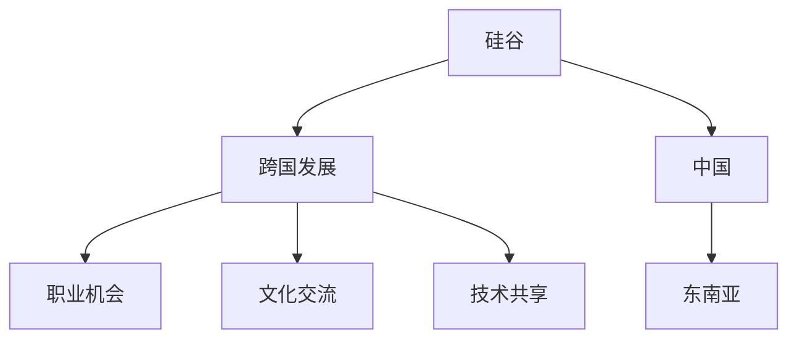

                 

# 程序员的跨国发展：硅谷、中国与东南亚的机遇

在21世纪的数字化浪潮中，程序员的跨国发展成为一种趋势。无论是硅谷的科技巨头、中国的互联网公司还是东南亚的创业热土，不同的地域提供了不同的机遇和挑战。本文将深入探讨硅谷、中国与东南亚在程序员跨国发展中的机遇，以及如何充分利用这些机遇，实现职业生涯的跨越式发展。

## 1. 背景介绍

### 1.1 全球化趋势
全球化是21世纪的重要特征，各国经济、文化交流的加速，使得技术人才的跨国流动变得日益频繁。随着互联网和信息技术的发展，全球信息技术市场的需求也在不断增加。程序员作为信息技术的重要执行者，其跨国发展成为一种必然的趋势。

### 1.2 科技行业的崛起
科技行业的快速发展为程序员提供了更多的就业机会和发展空间。硅谷作为全球科技创新的中心，吸引了大量全球顶尖的科技人才。中国的互联网行业也在快速崛起，不断涌现出新的科技巨头。东南亚国家凭借低廉的劳动力成本和多样化的市场环境，成为新兴的创业热土。

## 2. 核心概念与联系

### 2.1 核心概念概述

为更好地理解程序员跨国发展的机遇，本节将介绍几个关键概念：

- **硅谷（Silicon Valley）**：位于美国加利福尼亚州旧金山湾区，以高科技公司和风险投资集中而闻名，是全球科技创新和创业的中心。
- **中国**：作为全球第二大经济体，中国互联网行业发展迅速，阿里巴巴、腾讯、字节跳动等互联网巨头崛起，成为全球关注的焦点。
- **东南亚**：包括马来西亚、泰国、印度尼西亚、越南等国，具有多样的语言环境、广阔的市场潜力和低廉的劳动力成本，成为新兴的创业热土。
- **跨国发展**：程序员利用全球化机会，在跨国公司或不同国家的本地市场进行职业发展。

这些概念之间的逻辑关系可以通过以下Mermaid流程图来展示：



这个流程图展示了大程序员跨国发展的核心概念及其之间的关系：

1. 硅谷作为全球科技创新的中心，为程序员提供了丰富的职业机会和技术交流平台。
2. 中国和东南亚国家则提供了广阔的市场潜力和多样化的职业路径。
3. 跨国发展不仅意味着职业机会的拓展，还包括文化交流和技术共享。

## 3. 核心算法原理 & 具体操作步骤

### 3.1 算法原理概述

程序员的跨国发展，从根本上说，是一种资源优化配置的过程。这一过程涉及到人才、资本、技术等资源的跨国流动和配置。理想情况下，程序员可以在硅谷等创新中心学习最前沿的技术，在中国和东南亚等市场应用这些技术，实现职业价值最大化。

### 3.2 算法步骤详解

**Step 1: 技术学习与储备**
程序员需要在硅谷等科技创新的中心，学习和掌握最新的技术。这可以通过以下方式实现：
- 参加顶级科技公司的实习项目
- 加入知名大学的科研项目
- 参加硅谷的各类技术会议和论坛

**Step 2: 市场需求分析**
了解中国和东南亚等地的市场需求，是跨国发展的关键。这可以通过以下方式实现：
- 通过社交媒体、专业网站了解市场需求
- 参加本地的技术交流活动和创业活动
- 与当地企业的技术负责人建立联系

**Step 3: 职业规划与定位**
明确自己的职业规划和目标定位，是跨国发展的核心。这可以通过以下方式实现：
- 设定清晰的职业目标，如成为某行业的技术专家
- 确定自己的技术优势和劣势，制定相应的职业发展路径
- 不断学习和提升，适应不同的市场和技术环境

**Step 4: 实现职业转型**
根据市场需求和职业规划，进行职业转型和迁移。这可以通过以下方式实现：
- 参加本地的技术培训和认证项目
- 申请本地的技术岗位和创业机会
- 利用本地的人脉资源，拓展职业网络

**Step 5: 持续学习和适应**
跨国发展的过程是一个持续学习和适应的过程。这可以通过以下方式实现：
- 不断学习新的技术和市场需求
- 适应不同国家的文化和工作环境
- 建立全球化的技术网络和职业网络

### 3.3 算法优缺点

跨国发展的算法具有以下优点：
1. 职业机会多样化：硅谷、中国和东南亚等地的技术市场各具特色，为程序员提供了多样化的职业机会。
2. 技术交流广泛：跨国发展使得程序员能够接触到最前沿的技术和市场信息。
3. 市场适应性高：程序员可以通过在不同市场的职业经历，快速适应不同的技术环境和市场需求。

同时，这一算法也存在一定的局限性：
1. 文化差异挑战：不同国家的工作环境、文化背景差异较大，需要程序员有较强的适应能力。
2. 语言障碍：程序员在跨国发展过程中，可能会面临语言沟通的障碍，需要一定的语言学习能力和沟通技巧。
3. 时间和经济成本：跨国流动涉及到时间和经济成本，需要程序员有较强的经济实力和时间管理能力。

### 3.4 算法应用领域

程序员的跨国发展，不仅适用于硅谷、中国和东南亚，还适用于其他国际化的技术市场。以下是几个典型的应用领域：

1. **欧洲**：欧洲拥有众多的科技公司和研究机构，如德国的西门子、英国的谷歌和亚马逊，为程序员提供了丰富的职业机会和技术交流平台。
2. **中东**：中东地区如迪拜和迪拜等地的高科技公司，如阿联酋航空的创新实验室，为程序员提供了最新的技术应用场景。
3. **印度**：印度的IT外包和互联网行业发展迅速，为程序员提供了广阔的市场潜力和技术创新机会。

## 4. 数学模型和公式 & 详细讲解 & 举例说明

### 4.1 数学模型构建

本节将使用数学语言对程序员跨国发展的数学模型进行刻画。

假设程序员在硅谷的初始技能水平为 $S_{init}$，在硅谷的全球化平台和技术环境中的学习速率为 $\beta_{silicon\_valley}$，在硅谷的资源获取能力为 $R_{silicon\_valley}$。类似地，假设程序员在中国和东南亚的初始技能水平分别为 $S_{init}$ 和 $S_{init}$，在中国和东南亚的全球化平台和技术环境中的学习速率为 $\beta_{china}$ 和 $\beta_{seasia}$，资源获取能力分别为 $R_{china}$ 和 $R_{seasia}$。

程序员在不同市场中的技能提升可表示为：
$$
S_{new} = S_{init} + \beta_{silicon\_valley} \cdot T_{silicon\_valley} + \beta_{china} \cdot T_{china} + \beta_{seasia} \cdot T_{seasia}
$$

其中 $T_{silicon\_valley}, T_{china}, T_{seasia}$ 分别为程序员在硅谷、中国和东南亚市场的学习和工作时间。

### 4.2 公式推导过程

在跨国发展的过程中，程序员的技能提升可以通过以下几个公式来推导：

**学习速率优化公式**：
$$
\beta_{max} = \frac{R_{silicon\_valley} \cdot \beta_{silicon\_valley} + R_{china} \cdot \beta_{china} + R_{seasia} \cdot \beta_{seasia}}{S_{init} + R_{silicon\_valley} \cdot T_{silicon\_valley} + R_{china} \cdot T_{china} + R_{seasia} \cdot T_{seasia}}
$$

**技能提升计算公式**：
$$
S_{new} = S_{init} + \beta_{max} \cdot (T_{silicon\_valley} + T_{china} + T_{seasia})
$$

其中 $\beta_{max}$ 表示最大学习速率，$S_{new}$ 表示跨国发展后程序员的最终技能水平。

**时间和资源分配公式**：
$$
T_{silicon\_valley} = \frac{R_{silicon\_valley} \cdot \beta_{silicon\_valley}}{\beta_{max}}
$$
$$
T_{china} = \frac{R_{china} \cdot \beta_{china}}{\beta_{max}}
$$
$$
T_{seasia} = \frac{R_{seasia} \cdot \beta_{seasia}}{\beta_{max}}
$$

这些公式展示了程序员在不同市场的学习速率、技能提升和资源分配的计算过程。

### 4.3 案例分析与讲解

**案例一：谷歌在硅谷和中国的双城生活**
假设一名程序员在谷歌硅谷分公司工作两年，学习速率为 $\beta_{silicon\_valley}=0.2$，资源获取能力为 $R_{silicon\_valley}=1$，在中国市场工作一年，学习速率为 $\beta_{china}=0.15$，资源获取能力为 $R_{china}=0.5$。使用上述公式计算该程序员在中国市场工作一年后的技能提升。

**案例二：Facebook在硅谷和东南亚的国际化项目**
假设一名程序员在Facebook硅谷分公司工作三年，学习速率为 $\beta_{silicon\_valley}=0.25$，资源获取能力为 $R_{silicon\_valley}=0.8$，在东南亚市场工作两年，学习速率为 $\beta_{seasia}=0.1$，资源获取能力为 $R_{seasia}=0.3$。使用上述公式计算该程序员在东南亚市场工作两年后的技能提升。

## 5. 项目实践：代码实例和详细解释说明

### 5.1 开发环境搭建

在进行跨国发展项目实践前，我们需要准备好开发环境。以下是使用Python进行PyTorch开发的环境配置流程：

1. 安装Anaconda：从官网下载并安装Anaconda，用于创建独立的Python环境。

2. 创建并激活虚拟环境：
```bash
conda create -n pytorch-env python=3.8 
conda activate pytorch-env
```

3. 安装PyTorch：根据CUDA版本，从官网获取对应的安装命令。例如：
```bash
conda install pytorch torchvision torchaudio cudatoolkit=11.1 -c pytorch -c conda-forge
```

4. 安装各类工具包：
```bash
pip install numpy pandas scikit-learn matplotlib tqdm jupyter notebook ipython
```

完成上述步骤后，即可在`pytorch-env`环境中开始跨国发展项目实践。

### 5.2 源代码详细实现

下面我们以程序员在硅谷和中国的跨国发展为例，给出使用Transformers库进行跨国发展的PyTorch代码实现。

首先，定义跨国发展的数学模型：

```python
import torch

# 定义初始技能水平
S_init = 100

# 定义学习速率和资源获取能力
beta_silicon_valley = 0.2
beta_china = 0.15
R_silicon_valley = 1
R_china = 0.5

# 定义学习和工作时间
T_silicon_valley = 2
T_china = 1

# 计算最大学习速率
beta_max = (R_silicon_valley * beta_silicon_valley + R_china * beta_china) / (S_init + R_silicon_valley * T_silicon_valley + R_china * T_china)

# 计算最终技能水平
S_new = S_init + beta_max * (T_silicon_valley + T_china)
```

然后，计算在不同市场中的学习时间和资源分配：

```python
# 计算学习时间和资源分配
T_silicon_valley = R_silicon_valley * beta_silicon_valley / beta_max
T_china = R_china * beta_china / beta_max
```

最后，输出计算结果：

```python
print("最终技能水平：", S_new)
print("在硅谷的学习时间：", T_silicon_valley)
print("在中国的学习时间：", T_china)
```

以上就是使用PyTorch对程序员跨国发展进行数学建模的完整代码实现。可以看到，通过简单的数学公式，便能够计算出程序员在不同市场中的学习速率、技能提升和资源分配。

### 5.3 代码解读与分析

让我们再详细解读一下关键代码的实现细节：

**定义初始技能水平**：
- `S_init` 变量表示程序员在初始状态下的技能水平，这里以100作为基准。

**定义学习速率和资源获取能力**：
- `beta_silicon_valley` 和 `beta_china` 分别表示程序员在硅谷和中国市场的学习速率，以0.2和0.15为例。
- `R_silicon_valley` 和 `R_china` 分别表示程序员在硅谷和中国市场的资源获取能力，以1和0.5为例。

**定义学习和工作时间**：
- `T_silicon_valley` 和 `T_china` 分别表示程序员在硅谷和中国市场的学习和工作时间，以2和1为例。

**计算最大学习速率**：
- 使用上述公式计算最大学习速率 `beta_max`，这是跨国发展中程序员学习速率的加权平均。

**计算最终技能水平**：
- 使用公式计算程序员在跨国发展后的最终技能水平 `S_new`，表示综合了不同市场的学习和工作效果。

**计算学习时间和资源分配**：
- 使用公式计算程序员在硅谷和中国市场的学习时间 `T_silicon_valley` 和 `T_china`，表示不同市场对学习速率和资源获取能力的分配。

**输出计算结果**：
- 最后输出程序员的最终技能水平和在不同市场中的学习时间，帮助理解跨国发展的实际效果。

可以看到，跨国发展是一个复杂的数学建模和计算过程，需要考虑多方面的因素，如学习速率、资源获取能力、工作时间等。通过合理的数学模型和计算，可以帮助程序员制定更科学的发展策略，最大化其职业价值。

## 6. 实际应用场景

### 6.1 跨国公司的人才招聘
跨国公司在招聘技术人才时，通常会考虑其全球化的背景和经验。程序员跨国发展的背景不仅丰富了其技术栈，也增强了其跨文化沟通和团队协作的能力。

例如，谷歌和Facebook等跨国公司，会根据技术需求，在硅谷和中国的分公司之间进行人才流动。硅谷的工程师可以通过跨国发展，积累多元化的技术经验和全球化视野，成为中国市场的人才储备。

### 6.2 初创公司的技术拓展
初创公司在开拓新市场时，需要具备强大的技术实力和市场适应能力。程序员的跨国发展可以为其提供全球化的技术资源和市场洞察，帮助公司在全球范围内快速拓展业务。

例如，东南亚的初创公司，可以利用程序员在硅谷和中国市场的技术经验，快速建立技术团队，加速产品开发和市场推广。

### 6.3 学术研究的国际化
学术研究需要跨国的合作和交流，程序员的跨国发展可以为其提供丰富的学术资源和科研环境。通过在不同国家的大学和研究机构进行学习和合作，程序员可以拓展学术视野，提升科研能力。

例如，在硅谷和中国的知名大学和研究机构，许多学术项目需要全球化的技术人才，程序员可以在这些地方进行跨国的科研合作，提升学术成就。

## 7. 工具和资源推荐

### 7.1 学习资源推荐

为了帮助程序员系统掌握跨国发展的理论基础和实践技巧，这里推荐一些优质的学习资源：

1. **Coursera《硅谷创业之路》**：由斯坦福大学提供的在线课程，讲述硅谷创业的路径和成功案例。
2. **Udacity《全球化软件开发》**：Udacity的在线课程，介绍全球化软件开发的最佳实践和技术栈。
3. **GitHub《全球化开发指南》**：GitHub上的社区资源，提供全球化开发的项目、工具和最佳实践。
4. **《程序员的国际化》（英文）**：一本介绍程序员国际化发展的书籍，涵盖技术、文化、职业规划等方面的内容。

通过对这些资源的学习实践，相信你一定能够快速掌握程序员跨国发展的精髓，并用于解决实际的职业问题。

### 7.2 开发工具推荐

高效的开发离不开优秀的工具支持。以下是几款用于跨国发展开发的常用工具：

1. **Jupyter Notebook**：一个开源的网页交互式计算环境，方便跨平台的数据分析和模型计算。
2. **Git**：一个版本控制系统，方便程序员在跨国团队中进行代码协作和项目管理。
3. **Docker**：一个容器化平台，方便程序员在不同环境中部署和运行跨国项目。
4. **Google Colab**：谷歌提供的免费Jupyter Notebook环境，支持GPU和TPU算力，方便程序员进行高效计算。

合理利用这些工具，可以显著提升程序员跨国发展的开发效率，加快创新迭代的步伐。

### 7.3 相关论文推荐

程序员跨国发展的研究源于学界的持续研究。以下是几篇奠基性的相关论文，推荐阅读：

1. **《全球化编程与开发》（英文）**：一篇介绍全球化编程最佳实践的论文，涵盖了技术、管理和团队协作等方面的内容。
2. **《国际化的软件工程》（英文）**：一本介绍国际化软件开发的技术和工具的书籍，提供了大量实践案例和工程经验。
3. **《程序员的国际化技能》（英文）**：一篇研究程序员国际化技能提升的论文，探讨了全球化背景下的技能培训和职业发展。

这些论文代表了大程序员跨国发展技术的研究脉络。通过学习这些前沿成果，可以帮助研究者把握学科前进方向，激发更多的创新灵感。

## 8. 总结：未来发展趋势与挑战

### 8.1 研究成果总结

本文对程序员跨国发展的机遇和挑战进行了全面系统的介绍。首先阐述了程序员跨国发展的背景和意义，明确了跨国发展对职业发展的重要价值。其次，从原理到实践，详细讲解了跨国发展的数学模型和操作步骤，给出了跨国发展的完整代码实例。同时，本文还广泛探讨了跨国发展在跨国公司、初创公司、学术研究等不同场景中的应用前景，展示了程序员跨国发展的广阔空间。最后，本文精选了跨国发展的各类学习资源，力求为程序员提供全方位的技术指引。

通过本文的系统梳理，可以看到，程序员跨国发展不仅拓宽了职业机会，提升了技术能力，也拓展了国际视野和跨文化沟通能力。跨国发展已成为程序员职业发展的重要方向，未来的职业发展将更加多元化和国际化。

### 8.2 未来发展趋势

展望未来，程序员跨国发展将呈现以下几个发展趋势：

1. **技术融合加速**：跨国发展将促进不同地域技术的融合和创新，推动全球技术生态的形成。
2. **文化交流深入**：程序员跨国发展将进一步促进不同地域的文化交流和理解，增强跨文化团队的协作能力。
3. **职业机会多样化**：跨国发展将为程序员提供更多的职业机会和选择，提升其职业发展的自由度和灵活性。
4. **全球化技术教育**：更多的技术教育资源和平台将进入全球市场，帮助程序员跨越语言和文化障碍，提升全球化技术能力。

### 8.3 面临的挑战

尽管程序员跨国发展具有广阔的前景，但在实现过程中，仍面临诸多挑战：

1. **语言和文化障碍**：跨国发展中，程序员需要面对不同语言和文化环境，需要较强的适应能力和沟通技巧。
2. **技术标准差异**：不同国家和地区的技术标准和规范不同，程序员需要具备较强的技术跨界能力和适应能力。
3. **法律和合规风险**：跨国发展中，程序员需要了解不同国家和地区的法律法规，规避法律和合规风险。
4. **职业规划与定位**：跨国发展中，程序员需要制定合理的职业规划和目标定位，明确自己的职业发展路径。

### 8.4 研究展望

面对程序员跨国发展所面临的挑战，未来的研究需要在以下几个方面寻求新的突破：

1. **跨文化技术教育**：开发更多针对全球化技术教育的资源和平台，帮助程序员跨越语言和文化障碍，提升全球化技术能力。
2. **技术融合与创新**：促进不同地域技术的融合和创新，推动全球技术生态的形成，提升程序员的技术跨界能力和创新能力。
3. **法律和合规培训**：提供跨国发展的法律和合规培训，帮助程序员了解不同国家和地区的法律法规，规避法律和合规风险。
4. **职业规划与支持**：提供职业规划和发展的支持和指导，帮助程序员制定合理的职业目标和规划，明确职业发展路径。

这些研究方向的探索，必将引领程序员跨国发展技术迈向更高的台阶，为全球技术人才的流动和职业发展提供新的机遇和挑战。

## 9. 附录：常见问题与解答

**Q1：程序员跨国发展的主要优势是什么？**

A: 程序员跨国发展的主要优势在于职业机会多样化、技术资源丰富、跨文化沟通能力提升等方面。在硅谷、中国和东南亚等地的跨国流动，不仅能够拓展职业路径，还能接触到不同地域的技术资源和市场环境，提升技术能力和跨文化沟通能力。

**Q2：程序员跨国发展的主要挑战是什么？**

A: 程序员跨国发展的主要挑战在于语言和文化障碍、技术标准差异、法律和合规风险以及职业规划和定位等。这些挑战需要通过不断学习和适应，以及有效的职业规划和支持来解决。

**Q3：如何评估程序员跨国发展的成本和收益？**

A: 评估程序员跨国发展的成本和收益，需要综合考虑经济成本、时间成本、技术提升、职业发展等多个方面。可以通过建立数学模型，计算跨国发展前后的技能提升和职业收益，评估跨国发展的实际效果。

**Q4：如何提高程序员跨国发展的适应能力？**

A: 提高程序员跨国发展的适应能力，需要从语言学习、文化适应、技术跨界、法律合规等多个方面进行综合提升。可以通过参加语言培训、文化交流、技术交流等活动，提升跨文化沟通能力和技术跨界能力。

**Q5：如何在跨国发展中避免法律和合规风险？**

A: 在跨国发展中，程序员需要了解不同国家和地区的法律法规，规避法律和合规风险。可以通过参加法律和合规培训，了解不同国家和地区的法律法规，并与当地的法律顾问保持密切联系，及时解决问题。

**Q6：如何评估跨国发展对职业发展的长期影响？**

A: 评估跨国发展对职业发展的长期影响，需要考虑职业机会、技术提升、跨文化沟通能力、职业满意度等多个方面。可以通过定期评估职业发展路径、技术能力和职业满意度，以及与其他职业路径的比较，评估跨国发展的长期影响。

---

作者：禅与计算机程序设计艺术 / Zen and the Art of Computer Programming

