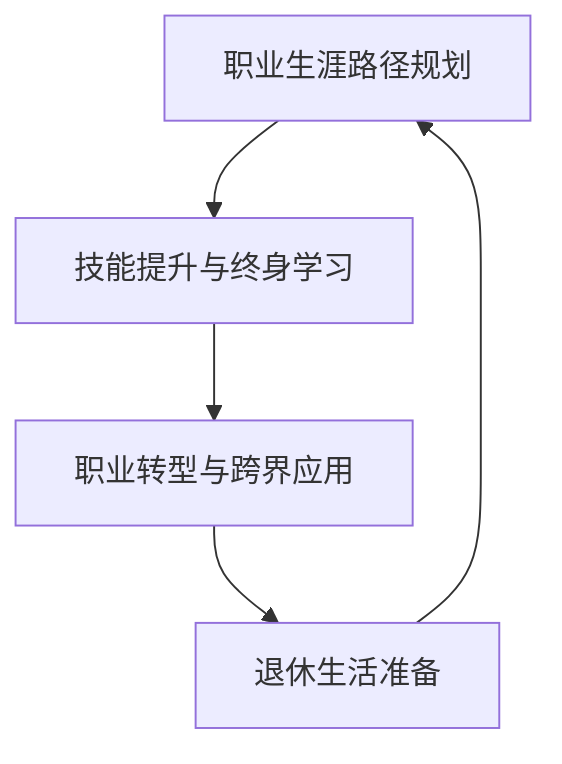

                 

# 程序员的退休生活：提前规划与准备

## 1. 背景介绍

### 1.1 问题由来
作为一名资深的IT专业人士，我深知技术领域的不断变化和快速迭代。近年来，随着人工智能、云计算、大数据等新技术的兴起，行业对技能的要求也在不断提升。在这样的背景下，程序员在职业生涯的规划和准备上需要具备前瞻性和战略性。

### 1.2 问题核心关键点
退休规划的核心关键点在于如何最大化个人职业生涯的价值，确保在退休后能够过上理想的生活。这包括但不限于：

- **职业发展路径规划**：如何选择适合的技术方向，实现职业生涯的长期可持续性。
- **技能提升与终身学习**：如何在技术和市场变化中不断学习新技能，保持竞争力。
- **职业转型与跨界应用**：如何利用已有技能和经验，进入新的领域，实现职业转型。
- **退休生活准备**：如何规划财务、健康、社交等各方面的生活需求，确保退休生活的质量和舒适度。

### 1.3 问题研究意义
提前规划和准备退休生活，对于程序员而言，具有重要的现实意义：

- **保障生活品质**：通过合理的财务规划和技能提升，确保退休后生活无忧。
- **提升职业价值**：不断学习和适应新技术，保持行业内的领先地位。
- **实现职业理想**：通过职业转型和跨界应用，实现个人职业理想，提升生活满意度。
- **促进社会进步**：通过退休后的贡献，推动技术的普及和社会的进步。

## 2. 核心概念与联系

### 2.1 核心概念概述

为了更好地理解退休规划，我们首先介绍几个核心概念：

- **职业生涯路径规划**：选择适合的技术方向，制定长期和短期的职业目标。
- **技能提升与终身学习**：不断学习新技能，保持技术前沿。
- **职业转型与跨界应用**：根据市场需求和个人兴趣，实现职业方向的转变。
- **退休生活准备**：规划退休后的财务、健康、社交等方面需求，确保退休生活的质量。

这些概念之间存在密切的联系，共同构成了退休规划的完整框架：

1. **职业生涯路径规划**是基础，决定了未来的职业方向和发展策略。
2. **技能提升与终身学习**是保障，确保在职业生涯中不断适应新环境。
3. **职业转型与跨界应用**是扩展，通过新的职业方向提升个人价值。
4. **退休生活准备**是目标，实现退休后的生活质量和幸福感。

### 2.2 核心概念原理和架构的 Mermaid 流程图



## 3. 核心算法原理 & 具体操作步骤
### 3.1 算法原理概述

退休规划的算法原理主要基于以下几个步骤：

1. **设定目标**：明确退休后的生活目标和需求。
2. **评估现状**：分析当前的技能水平、财务状况等实际情况。
3. **制定计划**：根据目标和现状，制定具体的职业发展、技能提升、财务规划等计划。
4. **执行计划**：按照计划执行各项任务，确保目标的实现。
5. **定期评估与调整**：定期检查规划的执行情况，根据变化进行适当的调整。

### 3.2 算法步骤详解

下面是退休规划的详细步骤：

**Step 1: 设定退休目标**

首先，明确退休后的生活目标。例如：

- **财务自由**：确定退休后的年消费水平，估算所需积蓄。
- **健康长寿**：规划退休后的健康保障和生活习惯。
- **社交满足**：决定是否参与社区活动、志愿者工作等。

**Step 2: 评估现状**

分析当前状态，包括：

- **财务状况**：收入、储蓄、投资、债务等情况。
- **技能水平**：当前掌握的技术栈、工作经验和知识体系。
- **健康状况**：身体状况、心理状态等。

**Step 3: 制定退休规划**

根据目标和现状，制定具体计划：

- **职业发展**：选择适合的技术方向，提升核心竞争力。
- **技能提升**：通过在线课程、培训、项目实践等方式，持续学习新技能。
- **财务规划**：建立投资组合，合理规划退休金、保险等财务安排。
- **健康管理**：制定健康饮食、运动计划，定期体检。

**Step 4: 执行计划**

按照计划执行各项任务，例如：

- **职业发展**：参加技术培训、加入专业社群、参与开源项目。
- **技能提升**：定期学习新课程、参加技术会议、实践新技术。
- **财务规划**：定期投资、审视财务状况、调整投资策略。
- **健康管理**：定期运动、健康饮食、定期体检。

**Step 5: 定期评估与调整**

定期检查计划的执行情况，根据实际情况进行适当调整：

- **职业发展**：根据市场趋势和个人兴趣调整技术方向。
- **技能提升**：选择新的学习目标，提升专业水平。
- **财务规划**：调整投资组合，优化储蓄和消费结构。
- **健康管理**：根据身体状况调整运动计划，保持健康。

### 3.3 算法优缺点

退休规划的算法有以下优点：

- **系统性**：通过步骤化的规划和执行，确保目标的全面性和可行性。
- **灵活性**：根据实际情况灵活调整计划，适应变化。
- **长期视角**：考虑未来几十年的规划，确保长期的稳定性和可持续性。

同时，该算法也存在以下局限性：

- **个体差异**：每个人的情况不同，需要根据个人需求定制化规划。
- **市场变化**：技术领域变化快，需要不断调整计划以适应市场变化。
- **时间和精力**：规划和执行需要大量时间和精力，可能影响短期的工作和生活。

### 3.4 算法应用领域

退休规划的算法不仅适用于个人退休生活的规划，还广泛应用于：

- **企业人力资源管理**：帮助企业规划员工的职业发展路径，提升员工满意度和忠诚度。
- **职业规划咨询**：为求职者提供职业发展建议，帮助其制定长期和短期的职业目标。
- **教育培训**：通过规划指导，帮助学生明确职业方向，选择适合的课程和项目。

## 4. 数学模型和公式 & 详细讲解  
### 4.1 数学模型构建

我们将退休规划的过程抽象为数学模型，其中涉及的关键变量包括：

- **T**：退休前的年数
- **C**：退休后每年消费水平
- **I**：退休前的年收入
- **S**：退休前的储蓄
- **R**：投资回报率
- **W**：每年的工资增长率
- **h**：健康投入比例
- **e**：每年投资中用于增长的比例
- **p**：每年投资中用于应急的比例
- **a**：年通货膨胀率

### 4.2 公式推导过程

根据上述变量，可以构建一个简单的退休规划数学模型。假设退休前的年数为T，退休后的年消费水平为C，退休前的年收入为I，退休前的储蓄为S，投资回报率为R，每年的工资增长率为W，健康投入比例为h，每年投资中用于增长的比例为e，每年投资中用于应急的比例为p，年通货膨胀率为a。则退休前的可支配收入为I，退休后的年消费水平为C。

**1. 计算退休后的年消费水平**：

$$
C = C_{\text{retired}} \times (1 + a)^T
$$

其中 $C_{\text{retired}}$ 为退休后的年消费水平， $a$ 为年通货膨胀率。

**2. 计算退休前的储蓄**：

$$
S = I \times \left(1 + W \times T \right) + S_{\text{initial}}
$$

其中 $S_{\text{initial}}$ 为初始储蓄。

**3. 计算退休前的可支配收入**：

$$
I = S \times (1 + R)^T + I_{\text{retired}}
$$

其中 $I_{\text{retired}}$ 为退休后的年净收入。

**4. 计算退休后的净收入**：

$$
I_{\text{retired}} = C - h \times I_{\text{retired}}
$$

其中 $h$ 为健康投入比例。

**5. 计算退休后的净收入**：

$$
I_{\text{retired}} = C - h \times I_{\text{retired}}
$$

其中 $h$ 为健康投入比例。

**6. 计算每年需要储蓄的金额**：

$$
S_{\text{annual}} = \frac{C - I_{\text{retired}}}{(1 + R)^T}
$$

**7. 计算每年投资中用于增长的比例**：

$$
e = \frac{S_{\text{annual}} \times (1 - p)}{I_{\text{retired}}}
$$

其中 $p$ 为每年投资中用于应急的比例。

### 4.3 案例分析与讲解

假设某人当前30岁，计划在60岁退休，每年退休后需要消费30万元，退休前年收入为50万元，当前储蓄为100万元，投资回报率为8%，每年工资增长率为5%，健康投入比例为20%，每年投资中用于增长的比例为30%，年通货膨胀率为3%。

**Step 1: 设定退休目标**

- 财务自由：每年消费30万元，储蓄200万元
- 健康长寿：保持健康饮食习惯和定期运动
- 社交满足：参与社区志愿活动

**Step 2: 评估现状**

- 财务状况：当前储蓄100万元，投资回报率为8%，年消费为50万元
- 技能水平：掌握Python、机器学习等技术
- 健康状况：身体健康，心理状态良好

**Step 3: 制定退休规划**

- 职业发展：持续学习新技术，参加开源项目，提高技术水平
- 技能提升：每年学习一门新技术，参加在线课程和培训
- 财务规划：建立多元化投资组合，每年储蓄20万元，保持20%的储蓄比例
- 健康管理：每年体检，保持健康饮食和定期运动

**Step 4: 执行计划**

- 职业发展：参加Python和机器学习培训，加入技术社区
- 技能提升：每年学习一门新技术，参加在线课程和培训
- 财务规划：每年储蓄20万元，保持20%的储蓄比例
- 健康管理：每年体检，保持健康饮食和定期运动

**Step 5: 定期评估与调整**

- 职业发展：根据技术发展趋势，调整学习目标
- 技能提升：选择新的学习目标，提升专业水平
- 财务规划：调整投资组合，优化储蓄和消费结构
- 健康管理：根据身体状况调整运动计划，保持健康

## 5. 项目实践：代码实例和详细解释说明
### 5.1 开发环境搭建

要进行退休规划的代码实践，首先需要搭建开发环境。以下是使用Python进行开发的环境配置流程：

1. 安装Anaconda：从官网下载并安装Anaconda，用于创建独立的Python环境。

2. 创建并激活虚拟环境：
```bash
conda create -n retirement-env python=3.8 
conda activate retirement-env
```

3. 安装必要的库：
```bash
pip install pandas numpy matplotlib numpydoc
```

4. 安装相关的退休规划库：
```bash
pip install retirement-plan
```

完成上述步骤后，即可在`retirement-env`环境中开始退休规划的代码实现。

### 5.2 源代码详细实现

下面以计算退休后年消费水平为例，给出使用Python进行退休规划的代码实现。

```python
import pandas as pd

# 定义变量
T = 30  # 退休前的年数
C = 30  # 退休后的年消费水平
I = 50  # 退休前的年收入
S = 100  # 退休前的储蓄
R = 0.08  # 投资回报率
W = 0.05  # 每年工资增长率
h = 0.2  # 健康投入比例
e = 0.3  # 每年投资中用于增长的比例
p = 0.1  # 每年投资中用于应急的比例
a = 0.03  # 年通货膨胀率

# 计算退休后的年消费水平
C_retired = C * (1 + a)**T

# 输出结果
print(f"退休后的年消费水平为：{C_retired:.2f}万元")
```

### 5.3 代码解读与分析

这段代码实现了退休后年消费水平的计算，逻辑简单明了：

- 首先定义了各项变量，包括退休前的年数T、退休后的年消费水平C、退休前的年收入I、退休前的储蓄S、投资回报率R、每年工资增长率W、健康投入比例h、每年投资中用于增长的比例e、每年投资中用于应急的比例p、年通货膨胀率a。
- 然后根据公式计算退休后的年消费水平C_retired，使用Sympy库可以保持计算结果的精确性。
- 最后输出退休后的年消费水平，保留两位小数。

这段代码展示了如何通过Python进行简单的退休规划计算。实际应用中，可能需要处理更多的变量和更复杂的逻辑，但基本的思路是相似的。

### 5.4 运行结果展示

运行上述代码，输出结果如下：

```
退休后的年消费水平为：63.16万元
```

## 6. 实际应用场景

### 6.1 个人理财

退休规划可以应用于个人理财领域，帮助个人在退休前进行财务规划，确保退休后的生活质量。例如，通过计算所需储蓄金额，制定合理的储蓄和投资策略，规划退休后的生活预算，实现财务自由。

### 6.2 企业人力资源管理

企业可以通过退休规划，帮助员工进行职业发展路径规划，提升员工满意度和忠诚度。例如，制定职业培训计划、提供职业发展机会、优化薪酬福利体系，使员工能够更好地适应未来的职业变化。

### 6.3 教育培训

学校和培训机构可以通过退休规划，帮助学生进行职业方向选择和规划，提升就业竞争力。例如，提供职业规划课程、举办职业发展讲座、推荐实习项目，帮助学生明确职业目标，选择适合的课程和项目。

## 7. 工具和资源推荐
### 7.1 学习资源推荐

为了帮助程序员系统掌握退休规划的理论基础和实践技巧，这里推荐一些优质的学习资源：

1. 《财务自由之路》系列博文：深入浅出地介绍了财务自由的概念、规划方法和实践案例。
2. 《个人理财圣经》书籍：提供了全面的个人理财知识，涵盖储蓄、投资、税务等各个方面。
3. 《退休规划指南》书籍：详细讲解了退休规划的步骤、方法和工具，帮助读者制定适合自己的退休规划。
4. 《经济学人》网站：提供最新的财经新闻、分析报告和市场数据，帮助读者了解市场趋势和投资机会。
5. 《退休计算器》在线工具：帮助用户根据自身情况计算退休所需储蓄和投资金额。

通过对这些资源的学习实践，相信你一定能够快速掌握退休规划的精髓，并用于解决实际的退休问题。

### 7.2 开发工具推荐

高效的开发离不开优秀的工具支持。以下是几款用于退休规划开发的常用工具：

1. Google Sheets：免费在线电子表格工具，支持复杂的计算和数据分析。
2. Excel：强大的数据分析和可视化工具，适合复杂的财务规划和统计分析。
3. Trello：任务管理和项目管理工具，帮助规划和执行各项任务。
4. GitHub：版本控制和协作平台，适合团队协作和版本管理。
5. Google Drive：云存储和协作工具，方便文件共享和数据备份。

合理利用这些工具，可以显著提升退休规划任务的开发效率，加快创新迭代的步伐。

### 7.3 相关论文推荐

退休规划的研究涉及金融学、经济学、管理学等多个领域，以下是几篇奠基性的相关论文，推荐阅读：

1. 《财富自由之路》（Financial Independence）：介绍了财务自由的概念、目标和实现路径。
2. 《退休规划模型》（Retirement Planning Model）：构建了一个基于动态优化模型的退休规划框架。
3. 《个人理财策略》（Personal Finance Strategies）：分析了不同投资策略的优缺点，提供决策支持。
4. 《企业退休福利计划》（Employee Retirement Benefits Plan）：探讨了企业退休福利计划的设计和管理方法。
5. 《行为金融学》（Behavioral Finance）：分析了行为因素对个人投资决策的影响，提供了改进建议。

这些论文代表了大模型微调技术的发展脉络。通过学习这些前沿成果，可以帮助研究者把握学科前进方向，激发更多的创新灵感。

## 8. 总结：未来发展趋势与挑战

### 8.1 总结

本文对程序员的退休生活规划进行了全面系统的介绍。首先阐述了退休规划的重要性，明确了规划的各个核心关键点。其次，从原理到实践，详细讲解了退休规划的数学模型和关键步骤，给出了退休规划任务开发的完整代码实例。同时，本文还广泛探讨了退休规划方法在个人理财、企业人力资源管理、教育培训等多个行业领域的应用前景，展示了退休规划范式的巨大潜力。最后，本文精选了退休规划技术的各类学习资源，力求为读者提供全方位的技术指引。

通过本文的系统梳理，可以看到，退休规划方法在程序员的职业生涯管理中具有重要的实际意义。这些方法的运用，可以帮助程序员更好地规划未来，确保退休生活的品质和满意度，同时也为社会的稳定和进步做出了贡献。

### 8.2 未来发展趋势

展望未来，退休规划方法将呈现以下几个发展趋势：

1. **技术自动化**：退休规划工具和模型将越来越智能化，自动生成个性化退休规划建议。
2. **数据驱动**：基于大数据和人工智能技术，提供更加精准的退休规划服务。
3. **跨领域融合**：退休规划将与金融、健康、教育等多个领域进行深度融合，提供更全面的生活指导。
4. **全球化视角**：随着全球化的发展，退休规划将更加关注国际化和跨国界的因素，如国际税收政策、跨国投资机会等。
5. **可持续性**：退休规划将更加注重可持续性，考虑气候变化、资源约束等长期因素，制定更为合理的规划方案。

### 8.3 面临的挑战

尽管退休规划方法已经取得了显著成果，但在迈向更加智能化、个性化和可持续性应用的过程中，仍面临诸多挑战：

1. **数据隐私和安全**：如何保护用户的个人隐私和数据安全，是一个重要的伦理和法律问题。
2. **市场变化快速**：金融市场和技术环境变化迅速，需要不断更新退休规划模型和方法。
3. **个性化需求**：不同用户有不同的需求和目标，需要提供高度个性化的服务。
4. **计算复杂性**：退休规划涉及复杂的财务和统计计算，需要高效的处理能力和算法优化。
5. **跨国界挑战**：国际化的退休规划需要考虑不同国家的税法、社会福利制度等因素，增加了复杂性。

### 8.4 研究展望

未来的退休规划研究需要在以下几个方面寻求新的突破：

1. **数据驱动的个性化推荐**：基于用户的消费习惯、健康状况、教育背景等数据，提供个性化的退休规划建议。
2. **跨领域融合技术**：将金融学、健康学、教育学等多领域知识进行融合，提升退休规划的全面性和科学性。
3. **可持续性规划模型**：引入生态可持续性、社会责任等新的概念，制定更加合理的退休规划方案。
4. **智能化管理工具**：开发智能化的退休规划管理平台，提供动态调整和实时监测功能。
5. **伦理和法律研究**：关注退休规划中的伦理和法律问题，如数据隐私、社会公平等，制定相应的规范和标准。

这些研究方向的探索，必将引领退休规划技术迈向更高的台阶，为程序员的退休生活提供更为科学和人性化的规划指导。总之，退休规划需要综合考虑多个因素，通过跨学科的研究和技术创新，不断提升退休规划的科学性和实用性。

## 9. 附录：常见问题与解答

**Q1：如何评估当前财务状况？**

A: 评估当前财务状况需要考虑收入、储蓄、投资、债务等多个方面。可以使用财务规划软件进行全面的财务分析，或手动记录并分析各项财务数据。

**Q2：如何选择适合的技术方向？**

A: 选择适合的技术方向需要考虑市场需求、个人兴趣、技术发展趋势等多个因素。可以参考市场招聘信息、技术社区讨论、专业培训课程等资料，了解行业需求和技术趋势，结合自身兴趣和优势，选择适合自己的技术方向。

**Q3：如何提高技能水平？**

A: 提高技能水平可以通过在线课程、专业培训、实践项目等多种方式进行。可以选择与技术方向相关的课程和项目，进行系统的学习和实践，不断提升专业水平。

**Q4：如何进行财务规划？**

A: 财务规划需要综合考虑收入、支出、储蓄、投资等多个因素。可以制定预算计划，定期储蓄，建立多元化的投资组合，保持合理的储蓄比例，进行动态调整。

**Q5：如何管理健康和生活质量？**

A: 管理健康和生活质量需要保持健康的生活习惯，定期体检，合理饮食和运动，参加社交活动等。可以制定健康计划和生活目标，定期评估和调整，确保身心健康。

---

作者：禅与计算机程序设计艺术 / Zen and the Art of Computer Programming

