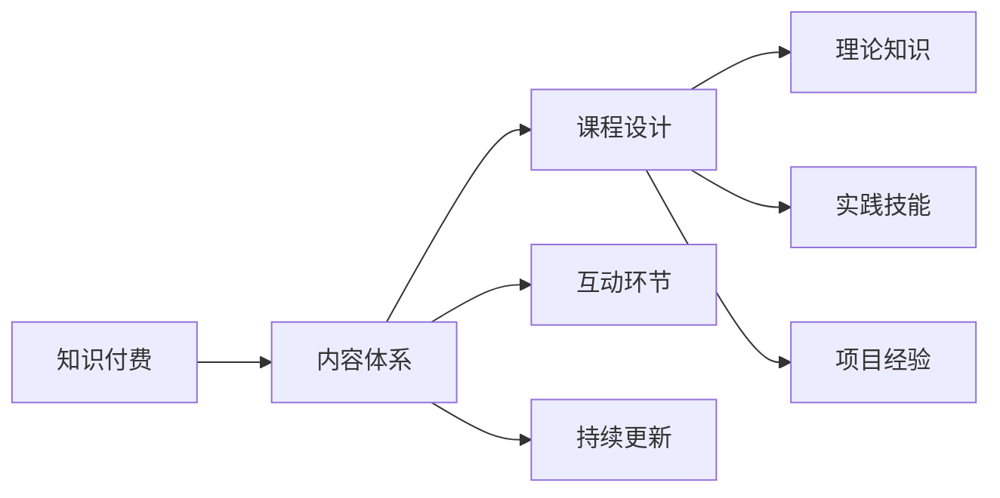

                 

# 程序员知识付费的内容体系构建

## 1. 背景介绍

### 1.1 问题由来

在互联网快速发展的时代，知识付费成为一种新兴的学习方式，特别是在技术领域，程序员们对于深入学习新技术、优化自身技能的需求日益增加。然而，传统的技术培训方式往往内容单一、形式固定，难以满足广大程序员多样化的学习需求。知识付费平台应运而生，以线上课程、电子书、直播讲座等多种形式，为程序员提供了丰富、灵活的学习资源。然而，知识付费内容体系如何构建，才能最大化其价值，让程序员真正从中受益，成为一项值得深入探讨的问题。

### 1.2 问题核心关键点

知识付费内容体系构建的关键在于如何设计出系统化、结构化的学习路径，覆盖从入门到进阶的各个阶段，满足不同层次程序员的需求。具体来说，主要包括以下几个关键点：

- **内容丰富性**：课程内容应该涵盖技术领域的各个方面，包括但不限于前端、后端、移动端、大数据、人工智能等。
- **层次分明**：课程应该从基础概念讲起，逐步深入到高级技术和实战经验，形成完整的学习路径。
- **实践导向**：重视编程实践和项目实战，帮助学员将理论知识转化为实际能力。
- **持续更新**：随着技术的发展，知识体系应该不断更新，确保内容的先进性和实用性。
- **互动性**：提供互动环节，如在线问答、代码交流、项目协作等，增强学习效果。

### 1.3 问题研究意义

构建一个系统化的知识付费内容体系，对于提升程序员技能、推动技术进步、加速行业发展具有重要意义：

1. **提升技能**：系统化的学习路径能够帮助程序员更全面地掌握技术知识，提升职业竞争力。
2. **促进创新**：多样化的学习内容可以激发程序员的创新思维，推动技术创新。
3. **加速行业发展**：高质量的知识付费内容有助于技术快速普及和应用，加速行业发展进程。
4. **实现知识共享**：通过知识付费平台，可以将优质资源分享给更广泛的群体，实现知识共享。

## 2. 核心概念与联系

### 2.1 核心概念概述

为了更好地理解知识付费内容体系的构建，首先需要明确几个核心概念：

- **知识付费**：指通过付费方式获取特定知识和技能的学习方式，强调知识的价值和版权保护。
- **内容体系**：指围绕特定主题或技能构建的知识结构，包括理论知识、实践技能、项目经验等。
- **课程设计**：指根据学习目标和学员需求，设计课程内容、教学方法、考核方式等。
- **互动环节**：指在课程中设置的互动环节，如在线讨论、项目协作等，增强学习效果。
- **持续更新**：指根据技术发展，定期更新课程内容，保持知识的先进性和实用性。

这些核心概念之间的逻辑关系可以通过以下Mermaid流程图来展示：



这个流程图展示了一个知识付费内容体系构建的基本框架：

1. **知识付费**是整个体系的核心驱动力，旨在通过付费机制保护知识的价值。
2. **内容体系**是体系的具体体现，包括课程设计、互动环节和持续更新三个方面。
3. **课程设计**是内容体系的基础，涉及理论知识、实践技能和项目经验的系统化设计。
4. **互动环节**和**持续更新**是内容体系的生命力所在，通过增强学习效果和保持知识先进性，确保体系的有效性和实用性。

## 3. 核心算法原理 & 具体操作步骤

### 3.1 算法原理概述

知识付费内容体系的构建，本质上是一个系统化的设计过程。其核心思想是：围绕学习目标，将知识内容按照一定的逻辑结构进行组织，形成完整的学习路径，并通过互动和更新机制，不断优化学习效果。

形式化地，假设课程体系的目标是 $T$，其中 $T$ 表示学习目标集合，课程内容为 $C$，互动环节为 $I$，持续更新机制为 $U$。体系构建的目标是最大化学习效果 $E$，即：

$$
E = f(C, I, U)
$$

其中 $f$ 表示一个复杂的多元函数，涉及课程内容、互动环节和持续更新机制的综合影响。

### 3.2 算法步骤详解

知识付费内容体系的构建一般包括以下几个关键步骤：

**Step 1: 定义学习目标**
- 根据市场需求和技术趋势，确定课程体系的学习目标 $T$，包括但不限于编程语言、框架、算法、工具等。

**Step 2: 设计课程内容**
- 根据学习目标，设计课程内容 $C$，包括理论知识、实践技能和项目经验等。课程设计应遵循由浅入深、循序渐进的原则，确保内容的系统性和连贯性。

**Step 3: 引入互动环节**
- 在课程中引入互动环节 $I$，增强学习效果。例如，设置在线讨论、代码交流、项目协作等环节，鼓励学员积极参与。

**Step 4: 建立持续更新机制**
- 建立持续更新机制 $U$，根据技术发展，定期更新课程内容，保持知识的先进性和实用性。

**Step 5: 实施评估与优化**
- 通过学员反馈和市场调研，评估课程效果 $E$，根据评估结果，不断优化课程设计、互动环节和更新机制。

### 3.3 算法优缺点

知识付费内容体系构建方法具有以下优点：

1. **系统化设计**：系统化的学习路径能够帮助学员全面掌握技术知识，提升职业竞争力。
2. **灵活性高**：课程设计可以根据市场需求和技术趋势进行调整，满足多样化学习需求。
3. **互动性强**：互动环节能够增强学习效果，提高学员的学习兴趣和参与度。
4. **知识更新**：持续更新机制确保课程内容保持先进性，提升学员的学习效果。

同时，该方法也存在一些局限性：

1. **资源投入大**：构建一个完善的内容体系需要大量的人力和时间投入。
2. **需求匹配困难**：课程内容难以完全满足所有学员的需求，存在一定匹配难度。
3. **维护成本高**：持续更新和互动环节需要定期维护和优化，维护成本较高。

尽管存在这些局限性，但就目前而言，系统化的知识付费内容体系构建方法仍然是提升程序员技能、推动技术进步的重要手段。未来相关研究的重点在于如何进一步优化课程设计、增强互动性、降低维护成本，以实现更高的学习效果。

### 3.4 算法应用领域

知识付费内容体系的构建，已经在多个领域得到了应用，如：

- **编程教育**：涵盖前端、后端、移动端、大数据等方向的课程体系，满足不同层次程序员的需求。
- **人工智能**：从基础算法、深度学习到实战项目的系统化课程设计，帮助学员掌握人工智能核心技术。
- **软件开发**：涵盖敏捷开发、DevOps、架构设计等方向的课程体系，提升软件开发的效率和质量。
- **数据科学**：从数据处理、机器学习到项目实战的系统化课程设计，帮助学员掌握数据科学核心技能。

除了上述这些经典领域外，知识付费内容体系还将在更多场景中得到应用，如企业培训、职业发展、技能认证等，为程序员的职业成长提供全方位的支持。

## 4. 数学模型和公式 & 详细讲解 & 举例说明

### 4.1 数学模型构建

假设课程体系的学习目标为 $T=\{t_1, t_2, ..., t_n\}$，课程内容为 $C=\{c_1, c_2, ..., c_m\}$，互动环节为 $I=\{i_1, i_2, ..., i_k\}$，持续更新机制为 $U=\{u_1, u_2, ..., u_l\}$。

课程体系构建的目标是最大化学习效果 $E$，即：

$$
E = \max_{C, I, U} \sum_{t \in T} f_t(C, I, U)
$$

其中 $f_t$ 表示学习目标 $t$ 对应的学习效果函数，具体定义如下：

$$
f_t(C, I, U) = \sum_{c \in C} \alpha_c f_{c,t} + \sum_{i \in I} \beta_i f_{i,t} + \sum_{u \in U} \gamma_u f_{u,t}
$$

其中 $\alpha_c$、$\beta_i$、$\gamma_u$ 分别表示课程内容、互动环节、持续更新机制对学习效果的影响权重。

### 4.2 公式推导过程

以下我们以编程教育为例，推导课程体系构建的数学模型：

假设编程教育课程体系的学习目标为 $T=\{Java, Python, React, Node.js\}$，课程内容为 $C=\{基础语法, 数据结构, 面向对象编程, Web开发\}$，互动环节为 $I=\{在线讨论, 代码交流, 项目协作\}$，持续更新机制为 $U=\{定期更新, 实时反馈\}$。

学习效果函数 $f_{c,t}$、$f_{i,t}$、$f_{u,t}$ 的具体形式如下：

- 课程内容对学习效果的影响：

$$
f_{c,t} = \left\{
  \begin{aligned}
    1.0 &\quad \text{如果 } t=c \\
    0.0 &\quad \text{如果 } t \neq c
  \end{aligned}
  \right.
$$

- 互动环节对学习效果的影响：

$$
f_{i,t} = \left\{
  \begin{aligned}
    0.5 &\quad \text{如果 } t=i \\
    0.0 &\quad \text{如果 } t \neq i
  \end{aligned}
  \right.
$$

- 持续更新机制对学习效果的影响：

$$
f_{u,t} = \left\{
  \begin{aligned}
    0.3 &\quad \text{如果 } t=u \\
    0.0 &\quad \text{如果 } t \neq u
  \end{aligned}
  \right.
$$

将这些函数代入学习效果函数，得到：

$$
f_t(C, I, U) = \alpha_{c_1}f_{c_1,t} + \alpha_{c_2}f_{c_2,t} + \alpha_{c_3}f_{c_3,t} + \alpha_{c_4}f_{c_4,t} + \beta_{i_1}f_{i_1,t} + \beta_{i_2}f_{i_2,t} + \beta_{i_3}f_{i_3,t} + \gamma_{u_1}f_{u_1,t} + \gamma_{u_2}f_{u_2,t}
$$

通过求解上述优化问题，可以得到最优的课程体系设计，使得学习效果最大化。

### 4.3 案例分析与讲解

以编程教育为例，具体的课程体系设计如下：

1. **Java课程**：涵盖基础语法、数据结构、面向对象编程、项目实战，引入在线讨论和代码交流环节，定期更新课程内容，保持先进性。

2. **Python课程**：涵盖基础语法、高级特性、Web开发、项目实战，引入在线讨论和项目协作环节，定期更新课程内容，保持先进性。

3. **React课程**：涵盖基础语法、组件化开发、路由、项目实战，引入在线讨论和代码交流环节，实时反馈更新内容，保持实用性。

4. **Node.js课程**：涵盖基础语法、异步编程、模块化开发、项目实战，引入在线讨论和项目协作环节，实时反馈更新内容，保持实用性。

通过以上课程体系设计，学员可以系统地掌握编程教育中的核心技能，并通过互动环节和持续更新机制，不断提高学习效果。

## 5. 项目实践：代码实例和详细解释说明

### 5.1 开发环境搭建

在进行知识付费内容体系构建的实践前，我们需要准备好开发环境。以下是使用Python进行Django开发的环境配置流程：

1. 安装Anaconda：从官网下载并安装Anaconda，用于创建独立的Python环境。

2. 创建并激活虚拟环境：
```bash
conda create -n django-env python=3.8 
conda activate django-env
```

3. 安装Django：
```bash
pip install django
```

4. 安装Django-allauth：
```bash
pip install django-allauth
```

5. 安装django-ajax-ordering：
```bash
pip install django-ajax-ordering
```

6. 安装Gunicorn：
```bash
pip install gunicorn
```

完成上述步骤后，即可在`django-env`环境中开始知识付费平台开发。

### 5.2 源代码详细实现

下面以一个简单的知识付费平台为例，给出Django代码实现。

首先，定义课程模型：

```python
from django.db import models

class Course(models.Model):
    title = models.CharField(max_length=200)
    description = models.TextField()
    instructor = models.CharField(max_length=100)
    duration = models.IntegerField()
    price = models.DecimalField(max_digits=10, decimal_places=2)
    created_at = models.DateTimeField(auto_now_add=True)
    updated_at = models.DateTimeField(auto_now=True)

    def __str__(self):
        return self.title
```

然后，定义课程内容模型：

```python
class CourseContent(models.Model):
    course = models.ForeignKey(Course, on_delete=models.CASCADE)
    name = models.CharField(max_length=200)
    type = models.CharField(max_length=200)
    url = models.URLField()
    created_at = models.DateTimeField(auto_now_add=True)
    updated_at = models.DateTimeField(auto_now=True)

    def __str__(self):
        return self.name
```

接着，定义学员模型：

```python
class Member(models.Model):
    email = models.EmailField(unique=True)
    name = models.CharField(max_length=200)
    joined_at = models.DateTimeField(auto_now_add=True)

    def __str__(self):
        return self.name
```

最后，定义支付模型：

```python
from django.db.models.signals import post_save
from django.dispatch import receiver

class Payment(models.Model):
    member = models.ForeignKey(Member, on_delete=models.CASCADE)
    course = models.ForeignKey(Course, on_delete=models.CASCADE)
    amount_paid = models.DecimalField(max_digits=10, decimal_places=2)
    paid_at = models.DateTimeField(auto_now_add=True)

    @receiver(post_save, sender=Payment)
    def update_last_payment(sender, instance, created, **kwargs):
        member = instance.member
        member.last_payment = instance.paid_at
        member.save()
```

### 5.3 代码解读与分析

让我们再详细解读一下关键代码的实现细节：

**Course模型**：
- `title` 和 `description` 分别表示课程标题和简介。
- `instructor` 表示课程讲师。
- `duration` 表示课程时长。
- `price` 表示课程价格。
- `created_at` 和 `updated_at` 分别表示课程创建和更新时间。

**CourseContent模型**：
- `course` 表示所属课程。
- `name` 和 `type` 分别表示内容名称和类型。
- `url` 表示内容链接。
- `created_at` 和 `updated_at` 分别表示内容创建和更新时间。

**Member模型**：
- `email` 表示学员邮箱。
- `name` 表示学员姓名。
- `joined_at` 表示学员加入时间。

**Payment模型**：
- `member` 表示学员。
- `course` 表示课程。
- `amount_paid` 表示支付金额。
- `paid_at` 表示支付时间。

在以上代码中，我们可以看到Django模型的定义和使用方式。通过定义相应的模型，即可构建一个基本的知识付费平台。后续的开发需要实现学员注册、课程浏览、内容发布、支付等功能。

## 6. 实际应用场景

### 6.1 在线教育

知识付费内容体系构建在在线教育领域有着广泛的应用。在线教育平台可以通过系统化的课程设计，提供从基础到高级的各类编程课程，满足不同层次学员的需求。例如，Udacity、Coursera等平台已经成功地运用知识付费模式，提供高质量的编程教育资源，帮助学员系统地学习编程技能。

### 6.2 企业培训

企业内部也可以通过构建知识付费内容体系，提升员工的编程技能和工作效率。例如，Google、Facebook等科技公司都有自己的内部培训系统，通过系统化的课程设计，帮助员工快速掌握新技术和新工具，提升企业的技术实力和竞争力。

### 6.3 个人学习

对于个人学习者，知识付费内容体系可以提供结构化、系统化的学习路径，帮助他们更高效地掌握编程技能。例如，Codecademy、LeetCode等平台提供丰富的编程课程和实战项目，帮助用户从零基础到进阶，系统性地掌握编程技能。

### 6.4 未来应用展望

随着知识付费模式的不断发展，未来的知识付费内容体系将更加系统化、多样化、个性化。具体来说，以下趋势值得关注：

1. **多模态学习**：知识付费内容将不仅仅局限于文本和视频，还将包括代码示例、实验环境、互动问答等多种形式，提供更加丰富、多样化的学习体验。
2. **个性化推荐**：通过数据分析和机器学习技术，为学员提供个性化的课程推荐，提升学习效果和体验。
3. **实时互动**：通过实时聊天、视频会议等互动方式，增强学习过程中的互动性和参与感，提高学习效果。
4. **跨平台学习**：知识付费内容体系将不仅仅局限于单一平台，还将跨平台集成，方便学员在不同设备上学习和使用。
5. **虚拟现实技术**：通过虚拟现实技术，构建更加沉浸式、体验感更强的学习环境，提升学习效果。

这些趋势将进一步推动知识付费内容体系的发展，为程序员和其他技术从业者提供更加丰富、高效的学习资源。

## 7. 工具和资源推荐

### 7.1 学习资源推荐

为了帮助开发者系统掌握知识付费内容体系的构建，这里推荐一些优质的学习资源：

1. **《知识付费：未来教育的新趋势》**：一本系统介绍知识付费模式的书籍，涵盖知识付费的发展历史、现状和未来趋势。
2. **《Python Django开发实战》**：一本深入介绍Django框架的书籍，涵盖Django开发的基础知识和高级技巧。
3. **《知识付费内容体系构建》**：一篇系统介绍知识付费内容体系构建的博客文章，涵盖课程设计、互动环节、持续更新机制等核心内容。
4. **Coursera官网**：一个提供丰富在线课程的平台，涵盖编程教育、数据科学、人工智能等多个领域，是知识付费内容体系构建的优质参考。
5. **Udacity官网**：一个提供高质量在线课程的平台，涵盖编程教育、人工智能、自动驾驶等多个领域，是知识付费内容体系构建的优质参考。

通过对这些资源的学习实践，相信你一定能够系统地掌握知识付费内容体系的构建，并用于解决实际的技术问题。

### 7.2 开发工具推荐

高效的开发离不开优秀的工具支持。以下是几款用于知识付费内容体系开发的常用工具：

1. **Visual Studio Code**：一个轻量级、功能强大的代码编辑器，支持多种编程语言和插件，适用于知识付费平台的开发。
2. **Git**：一个版本控制系统，适用于知识付费平台的项目管理和协作开发。
3. **Django框架**：一个Python的Web开发框架，支持MVC架构，适用于知识付费平台的开发和部署。
4. **Jupyter Notebook**：一个交互式编程环境，适用于知识付费平台的代码实现和数据分析。
5. **TensorFlow**：一个开源的机器学习框架，适用于知识付费平台的数据分析和模型训练。

合理利用这些工具，可以显著提升知识付费内容体系的开发效率，加快创新迭代的步伐。

### 7.3 相关论文推荐

知识付费内容体系的构建涉及诸多领域，包括教育学、计算机科学、心理学等。以下是几篇奠基性的相关论文，推荐阅读：

1. **《知识付费：一种新型在线教育模式》**：研究知识付费模式的发展现状和应用前景，提出系统化课程设计的思路。
2. **《知识付费内容体系构建：理论基础与实践方法》**：系统介绍知识付费内容体系的构建方法和优化策略。
3. **《知识付费平台的用户行为分析》**：研究知识付费平台的用户行为，提出提高用户参与度的策略。
4. **《知识付费内容体系的多模态设计》**：探讨知识付费内容体系的多模态设计方法，提升学习效果和用户体验。

这些论文代表了大语言模型微调技术的发展脉络。通过学习这些前沿成果，可以帮助研究者把握学科前进方向，激发更多的创新灵感。

## 8. 总结：未来发展趋势与挑战

### 8.1 总结

本文对知识付费内容体系的构建进行了全面系统的介绍。首先阐述了知识付费在技术领域的应用背景和意义，明确了知识付费内容体系的构建方法。其次，从原理到实践，详细讲解了知识付费内容体系的数学模型和设计方法，给出了知识付费平台开发的完整代码实例。同时，本文还广泛探讨了知识付费内容体系在多个行业领域的应用前景，展示了知识付费模式的巨大潜力。此外，本文精选了知识付费内容体系的各类学习资源，力求为读者提供全方位的技术指引。

通过本文的系统梳理，可以看到，知识付费内容体系的构建是一个系统化的设计过程，能够帮助学员系统地掌握技术知识，提升职业竞争力。知识付费模式在提升技能、推动技术进步、加速行业发展方面具有重要意义。未来，随着技术的发展和市场需求的不断变化，知识付费内容体系也将不断优化和创新，为技术从业者提供更加丰富、高效的学习资源。

### 8.2 未来发展趋势

展望未来，知识付费内容体系的构建将呈现以下几个发展趋势：

1. **内容多样化**：知识付费内容将不仅仅局限于视频和文本，还将包括代码示例、实验环境、互动问答等多种形式，提供更加丰富、多样化的学习体验。
2. **个性化推荐**：通过数据分析和机器学习技术，为学员提供个性化的课程推荐，提升学习效果和体验。
3. **实时互动**：通过实时聊天、视频会议等互动方式，增强学习过程中的互动性和参与感，提高学习效果。
4. **跨平台学习**：知识付费内容体系将不仅仅局限于单一平台，还将跨平台集成，方便学员在不同设备上学习和使用。
5. **虚拟现实技术**：通过虚拟现实技术，构建更加沉浸式、体验感更强的学习环境，提升学习效果。

这些趋势将进一步推动知识付费内容体系的发展，为程序员和其他技术从业者提供更加丰富、高效的学习资源。

### 8.3 面临的挑战

尽管知识付费内容体系已经取得了瞩目成就，但在迈向更加智能化、普适化应用的过程中，它仍面临着诸多挑战：

1. **内容质量**：知识付费内容的质量直接影响到学员的学习效果，需要不断优化课程设计，提升内容的实用性和准确性。
2. **师资力量**：高质量的师资力量是知识付费平台的核心竞争力，需要不断吸引和培养优秀的讲师。
3. **技术支持**：知识付费平台的开发和维护需要技术支持，需要不断提升技术水平和开发效率。
4. **市场竞争**：知识付费平台之间的竞争激烈，需要不断创新和优化，提升平台的竞争力。
5. **用户需求**：知识付费平台需要不断了解用户需求，提供符合用户期望的学习资源。

这些挑战需要知识付费平台从内容质量、师资力量、技术支持、市场竞争和用户需求等多个维度进行全面优化，才能真正实现高质量的知识付费服务。

### 8.4 研究展望

面对知识付费内容体系所面临的种种挑战，未来的研究需要在以下几个方面寻求新的突破：

1. **系统化课程设计**：开发更加系统化的课程设计方法，覆盖从基础到高级的各个阶段，满足不同层次学员的需求。
2. **互动环节增强**：通过引入更多的互动环节，增强学习效果和学员的参与感。
3. **个性化推荐**：利用数据分析和机器学习技术，为学员提供个性化的课程推荐。
4. **技术平台优化**：优化知识付费平台的开发和维护，提升技术水平和开发效率。
5. **师资力量建设**：吸引和培养优秀的讲师，提升平台的核心竞争力。

这些研究方向的探索，必将引领知识付费内容体系的发展，为技术从业者提供更加丰富、高效的学习资源。面向未来，知识付费内容体系还需要与其他技术进行更深入的融合，如虚拟现实、人工智能等，多路径协同发力，共同推动技术教育的进步。只有勇于创新、敢于突破，才能不断拓展知识付费内容体系的边界，让技术教育更加普及和高效。

## 9. 附录：常见问题与解答

**Q1：如何构建一个知识付费内容体系？**

A: 构建知识付费内容体系一般包括以下几个步骤：

1. 定义学习目标：根据市场需求和技术趋势，确定课程体系的学习目标。
2. 设计课程内容：根据学习目标，设计课程内容，包括理论知识、实践技能和项目经验等。课程设计应遵循由浅入深、循序渐进的原则。
3. 引入互动环节：在课程中引入互动环节，增强学习效果。例如，设置在线讨论、代码交流、项目协作等环节。
4. 建立持续更新机制：根据技术发展，定期更新课程内容，保持知识的先进性和实用性。

**Q2：如何提升知识付费内容的质量？**

A: 提升知识付费内容的质量需要从多个方面进行优化：

1. 师资力量：吸引和培养优秀的讲师，提升课程内容的质量。
2. 互动环节：通过互动环节增强学习效果，提升学员的参与感。
3. 持续更新：根据技术发展，定期更新课程内容，保持知识的先进性和实用性。
4. 反馈机制：建立学员反馈机制，根据学员的反馈不断优化课程设计。

**Q3：如何降低知识付费内容体系的维护成本？**

A: 降低知识付费内容体系的维护成本需要从多个方面进行优化：

1. 自动化：利用自动化技术，减少人工操作，提升开发和维护效率。
2. 开源合作：与其他平台和机构合作，共同开发和维护课程内容，分担维护成本。
3. 模块化设计：将课程内容设计为模块化结构，便于更新和维护。
4. 持续优化：根据技术发展，不断优化课程设计，提升内容质量和用户体验。

这些措施将有助于降低知识付费内容体系的维护成本，提升平台的竞争力。

通过以上系统化的学习路径和持续更新的课程体系，相信知识付费内容体系能够帮助程序员和其他技术从业者系统地掌握技术知识，提升职业竞争力，推动技术教育的发展。未来，随着技术的发展和市场需求的不断变化，知识付费内容体系也将不断优化和创新，为技术从业者提供更加丰富、高效的学习资源。

---

作者：禅与计算机程序设计艺术 / Zen and the Art of Computer Programming

