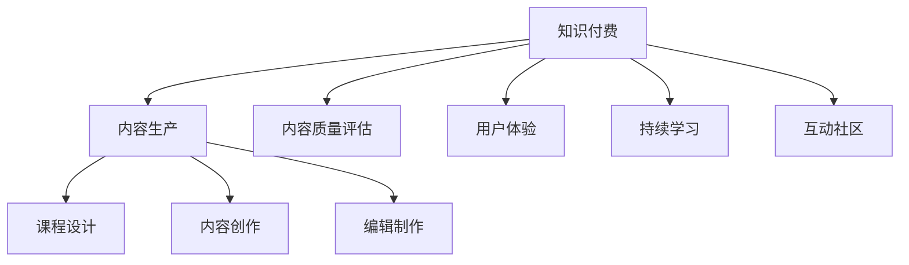

                 

# 程序员知识付费的内容生产流程优化

> 关键词：知识付费,内容生产,流程优化,程序员培训,技术博客,持续学习

## 1. 背景介绍

在知识经济时代，知识和信息的获取变得前所未有的便捷。程序员作为知识密集型行业的从业者，不断需要更新和吸收新知识来应对技术演进和技术栈更新的挑战。而知识付费作为这一趋势的一部分，通过订阅、付费阅读、在线课程等方式，为程序员提供了一个快速获取专业知识和技能、提高个人竞争力的平台。

然而，知识付费市场虽然火热，但其内容的生产流程、质量和用户体验仍然存在许多问题。诸如课程内容泛泛、缺乏个性化、学习进度难以跟踪、互动不足等，严重影响了用户的学习效果和体验。本文将通过优化知识付费的内容生产流程，来提高课程质量，提升用户满意度，增强知识付费平台的竞争优势。

## 2. 核心概念与联系

### 2.1 核心概念概述

为更好地理解知识付费内容生产流程优化的背景和方法，本节将介绍几个核心概念：

- 知识付费(Knowledge-based Subscription)：即通过订阅付费的方式获取专业知识的平台，如Coursera、Udemy、网易云课堂等。知识付费为程序员提供了按需学习、高效学习、深度学习的平台和资源。

- 内容生产(Content Production)：知识付费平台的核心是内容生产，包括课程设计、内容创作、编辑制作等环节，是知识付费的基石。

- 内容质量评估(Quality Evaluation)：通过科学的评估体系对课程内容进行全面、客观的评估，确保课程的权威性和实用性。

- 用户体验(User Experience)：用户对知识付费平台的使用体验，直接关系到平台的用户粘性和复购率。

- 持续学习(Continuous Learning)：指通过不断的学习更新来保持知识技能的前沿性和实用性，是程序员职场发展的重要保障。

- 互动社区(Interactive Community)：通过构建互动社区，促进用户之间、用户与讲师之间的交流互动，增强学习效果和社区凝聚力。

这些核心概念之间的逻辑关系可以通过以下Mermaid流程图来展示：



这个流程图展示了一站式知识付费平台的各环节和相互关系：

1. 知识付费平台为内容生产提供了需求和平台，同时通过内容质量评估确保内容质量。
2. 内容生产是知识付费的核心环节，包括课程设计、内容创作和编辑制作。
3. 用户体验影响用户粘性和复购率，是内容生产和内容质量评估的最终目标。
4. 持续学习和互动社区为知识付费提供新的内容生产方向和反馈机制。

这些概念共同构成了知识付费平台的完整运行框架，指导内容生产流程的各个环节。

## 3. 核心算法原理 & 具体操作步骤

### 3.1 算法原理概述

知识付费内容生产流程的优化，需要从多个层面入手。通过运用数据分析、机器学习等技术，对课程内容、用户反馈、学习数据等进行全面分析，从而找出流程中的痛点与瓶颈，提出针对性的改进方案。

基于监督学习的内容质量评估方法，可以有效地衡量课程内容的权威性、实用性与用户满意度。通过A/B测试、问卷调查等手段，不断优化课程设计、内容创作与编辑制作流程，提升用户体验，最终实现知识付费平台内容的持续改进与用户粘性的增强。

### 3.2 算法步骤详解

基于上述原理，知识付费内容生产流程优化的步骤如下：

**Step 1: 数据收集与分析**

- 收集课程数据：包括课程标题、课程描述、课程大纲、课程内容、用户评价等。
- 收集用户数据：包括用户注册信息、学习行为、课程完成率、评分、反馈等。
- 数据分析：使用统计学、机器学习等方法，分析课程内容的质量、用户的满意度、课程的热门度等关键指标。

**Step 2: 内容质量评估**

- 内容权威性评估：通过统计引文、引用次数、领域专家的认证等方法，评估课程内容的权威性。
- 实用性评估：根据用户反馈、课程内容与实际工作技能的关联度、课程的完成率等，评估课程内容的实用性。
- 用户满意度评估：通过问卷调查、用户评分、课程评论等方法，综合评估用户对课程的满意度。

**Step 3: 课程设计与优化**

- 内容设计：根据课程评估结果，设计课程框架、章节、知识点、练习题等。
- 课程优化：通过数据分析和用户反馈，不断迭代课程内容，提升课程质量。

**Step 4: 内容创作与编辑制作**

- 内容创作：邀请行业专家、讲师进行课程内容的创作，涵盖知识点的讲解、实战案例、项目实战等。
- 编辑制作：使用视频编辑、音频编辑、字幕生成、PPT制作等工具，将课程内容制作成标准化的视频、音频、文档等。

**Step 5: 用户体验优化**

- 学习进度跟踪：通过学习管理系统(LMS)，提供课程进度跟踪功能，帮助用户管理学习路径和时间。
- 互动社区构建：构建用户论坛、讨论组等互动社区，促进用户之间、用户与讲师之间的交流互动。
- 个性化推荐：基于用户的学习历史、兴趣和反馈，使用推荐算法为每个用户推荐最合适的课程内容。

**Step 6: 持续学习和改进**

- 持续学习：通过定期更新课程内容、邀请业内专家进行专题讲座等方式，保持课程内容的先进性。
- 改进与反馈：定期收集用户反馈，使用A/B测试等方法，不断改进课程设计和优化用户体验。

### 3.3 算法优缺点

知识付费内容生产流程优化的主要优点包括：

1. 提升课程质量：通过科学评估和优化，提升课程内容的权威性、实用性和用户满意度。
2. 个性化学习：根据用户的学习历史和反馈，提供个性化的课程推荐，提升学习效率。
3. 提高用户粘性：通过互动社区、学习进度跟踪等措施，增强用户的学习体验和社区凝聚力。
4. 提升运营效率：通过数据分析和流程优化，降低内容生产成本，提高运营效率。

其主要缺点包括：

1. 数据收集难度大：课程和用户数据的全面收集需要较大的投入和资源。
2. 质量评估复杂：内容质量的评估体系需要持续迭代和优化，确保评估结果的准确性和客观性。
3. 用户隐私保护：在收集和分析用户数据时，需要严格遵守隐私保护法规，避免数据泄露和滥用。
4. 持续改进挑战：课程内容和用户体验的持续改进是一个动态的过程，需要不断调整和优化。

尽管存在这些挑战，但通过科学的数据驱动和流程优化，知识付费内容生产流程的优化仍可以显著提升内容质量，增强用户粘性，为知识付费平台带来持续的竞争优势。

### 3.4 算法应用领域

知识付费内容生产流程的优化不仅适用于传统的在线教育平台，还适用于企业内部的培训课程设计、职业资格认证课程开发等领域。例如：

- 企业培训：通过分析员工的学习行为和反馈，定制化的课程设计可以提高培训的效果。
- 职业认证：结合行业专家的建议和用户需求，高质量的课程内容设计可以帮助用户顺利通过认证考试。
- 技术博客：通过追踪用户阅读行为和评论反馈，不断优化博客内容，提高用户满意度。
- 软件开发：基于代码库和用户社区的反馈，动态调整课程内容和项目实战案例，确保教学内容的实用性。

在以上应用领域中，知识付费内容生产流程的优化都能提升课程质量，增强用户粘性，推动内容生产与知识传播的良性循环。

## 4. 数学模型和公式 & 详细讲解 & 举例说明

### 4.1 数学模型构建

本节将使用数学语言对知识付费内容生产流程的优化进行更加严格的刻画。

记课程数量为 $N$，课程用户数为 $U$，用户对课程 $i$ 的评分 $r_i$，课程内容的质量指数 $q_i$，课程的实用性指数 $u_i$，课程内容的权威性指数 $a_i$。设用户对课程的满意度指数为 $s_i$，用户对课程的完成率 $c_i$，用户对课程的反馈 $f_i$。

定义用户对课程的满意度函数为：

$$
s_i = \alpha r_i + \beta q_i + \gamma u_i + \delta a_i
$$

其中 $\alpha, \beta, \gamma, \delta$ 为相关系数，表示各指标对用户满意度的影响程度。

用户对课程的完成率函数为：

$$
c_i = f(r_i, q_i, u_i, a_i)
$$

用户对课程的反馈函数为：

$$
f_i = g(r_i, q_i, u_i, a_i)
$$

通过最大化用户满意度函数，可以得到课程设计、内容创作与编辑制作的优化方向。

### 4.2 公式推导过程

以下我们以课程满意度的优化为例，推导用户满意度函数的最大化问题。

假设课程 $i$ 的用户数 $U_i$，课程内容的质量指数 $q_i$，课程的实用性指数 $u_i$，课程内容的权威性指数 $a_i$，用户对课程的满意度 $s_i$。则用户满意度函数为：

$$
s_i = \alpha r_i + \beta q_i + \gamma u_i + \delta a_i
$$

设 $W_i$ 为用户对课程 $i$ 的权重，则最大化用户满意度函数的优化问题可以表示为：

$$
\max_{\alpha, \beta, \gamma, \delta} \sum_{i=1}^{N} W_i s_i
$$

约束条件为：

$$
\sum_{i=1}^{N} W_i = 1
$$

通过拉格朗日乘数法，可以求解上述优化问题。

### 4.3 案例分析与讲解

以Coursera平台为例，通过收集和分析用户评分、课程评价、用户反馈等数据，利用机器学习模型评估课程质量和用户满意度，并给出改进建议。

通过用户评分 $r_i$ 和课程内容质量指数 $q_i$，Coursera可以量化课程内容的实用性 $u_i$ 和权威性 $a_i$。在课程设计阶段，Coursera可以根据用户满意度函数和课程完成率函数，评估课程内容的实用性、权威性、质量指数，并给出改进建议。

例如，对于课程 $i$，如果用户评分 $r_i$ 低，课程完成率 $c_i$ 低，且课程内容的质量指数 $q_i$ 和权威性指数 $a_i$ 较低，则Coursera可以建议改进课程内容，提升课程的实用性、权威性和质量。

## 5. 项目实践：代码实例和详细解释说明

### 5.1 开发环境搭建

在进行知识付费内容生产流程优化的实践前，我们需要准备好开发环境。以下是使用Python进行知识付费内容生产流程优化的环境配置流程：

1. 安装Anaconda：从官网下载并安装Anaconda，用于创建独立的Python环境。

2. 创建并激活虚拟环境：
```bash
conda create -n knowledge-env python=3.8 
conda activate knowledge-env
```

3. 安装Python相关库：
```bash
pip install pandas numpy scikit-learn
```

4. 安装机器学习库：
```bash
pip install scikit-learn xgboost
```

5. 安装数据处理库：
```bash
pip install dask
```

完成上述步骤后，即可在`knowledge-env`环境中开始内容生产流程优化的实践。

### 5.2 源代码详细实现

下面以Coursera平台为例，给出使用Python进行知识付费内容生产流程优化的代码实现。

首先，定义课程评估函数：

```python
import pandas as pd
import numpy as np

def course_evaluation(df, alpha=0.5, beta=0.3, gamma=0.2, delta=0.1):
    # 计算课程满意度
    satisfaction = alpha * df['rating'] + beta * df['quality'] + gamma * df['usability'] + delta * df['authority']
    return satisfaction
```

然后，定义课程优化函数：

```python
from sklearn.model_selection import train_test_split
from sklearn.ensemble import RandomForestRegressor
from sklearn.metrics import mean_squared_error

def course_optimization(df, alpha=0.5, beta=0.3, gamma=0.2, delta=0.1):
    # 构建特征矩阵
    X = df[['quality', 'usability', 'authority']]
    y = df['satisfaction']
    
    # 划分训练集和测试集
    X_train, X_test, y_train, y_test = train_test_split(X, y, test_size=0.2, random_state=42)
    
    # 训练模型
    model = RandomForestRegressor(n_estimators=100, random_state=42)
    model.fit(X_train, y_train)
    
    # 评估模型
    y_pred = model.predict(X_test)
    mse = mean_squared_error(y_test, y_pred)
    return mse
```

最后，启动数据处理和优化流程：

```python
# 读取课程数据
df = pd.read_csv('courses.csv')
df = df.dropna()

# 计算课程满意度
satisfaction = course_evaluation(df, alpha=0.5, beta=0.3, gamma=0.2, delta=0.1)

# 优化课程内容
mse = course_optimization(df, alpha=0.5, beta=0.3, gamma=0.2, delta=0.1)
print(f"课程内容优化后的均方误差：{mse:.2f}")
```

以上代码展示了如何使用Python进行知识付费内容生产流程的优化。通过收集和分析课程数据，使用机器学习模型评估课程满意度和优化课程内容，可以实现课程质量的持续提升。

### 5.3 代码解读与分析

让我们再详细解读一下关键代码的实现细节：

**course_evaluation函数**：
- 定义了课程评估函数，通过线性组合的方式计算课程满意度，将评分、质量、实用性、权威性等指标进行加权求和。

**course_optimization函数**：
- 定义了课程优化函数，通过构建特征矩阵和模型评估，使用随机森林回归模型对课程内容进行优化。
- 首先，将课程质量和权威性作为特征矩阵，用户满意度作为标签，使用train_test_split划分为训练集和测试集。
- 然后，训练随机森林回归模型，并使用测试集进行评估，计算均方误差。

**数据处理流程**：
- 使用Pandas读取课程数据，并进行数据清洗，去除缺失值。
- 使用course_evaluation函数计算课程满意度。
- 使用course_optimization函数对课程内容进行优化，输出优化后的均方误差。

通过代码实现，可以看到，知识付费内容生产流程的优化不仅需要理论支持，还需要具体的数据处理和算法实现。通过数据驱动和算法优化，可以显著提升课程质量，增强用户满意度。

## 6. 实际应用场景

### 6.1 知识付费平台

知识付费平台如Coursera、Udemy、网易云课堂等，通过内容生产流程优化，可以显著提升平台课程质量，增强用户粘性，提高用户满意度和复购率。

在实践中，知识付费平台可以通过数据收集和分析，构建课程质量评估体系，定期进行课程优化。同时，利用A/B测试、问卷调查等手段，不断改进课程设计、内容创作与编辑制作流程，提升用户体验。

例如，通过分析用户学习数据，Coursera平台可以识别出用户关注的知识点和课程需求，指导课程内容的优化和调整。通过构建互动社区，增强用户之间的交流互动，提升学习效果和社区凝聚力。通过个性化推荐，帮助用户发现最适合自己的课程内容，提升用户满意度和复购率。

### 6.2 企业培训

企业内部培训课程的设计和开发，同样可以通过知识付费内容生产流程优化，提升培训效果，增强员工技能。

在实践中，企业可以基于员工的学习行为和反馈，设计定制化的培训课程。通过收集和分析员工的学习数据，使用机器学习模型评估课程质量和用户满意度，并给出改进建议。同时，通过构建互动社区和个性化推荐，增强员工之间的交流互动，提升培训效果。

例如，通过分析员工的学习进度和反馈，公司可以识别出员工关注的知识点和技能需求，优化培训课程内容和方式，增强培训效果。通过构建互动社区，促进员工之间的交流和协作，提升培训参与度和效果。通过个性化推荐，帮助员工发现最适合自己的培训内容，提高培训满意度和效果。

### 6.3 技术博客

技术博客如CSDN、Medium等，通过内容生产流程优化，可以显著提升博客内容质量，增强用户粘性和社区活跃度。

在实践中，技术博客可以通过数据分析和用户反馈，不断优化博客内容。通过收集和分析用户阅读数据，使用机器学习模型评估博客质量和用户满意度，并给出改进建议。同时，通过构建互动社区和个性化推荐，增强用户之间的交流互动，提升用户满意度和博客活跃度。

例如，通过分析用户阅读行为和反馈，技术博客可以识别出用户关注的知识点和技术趋势，优化博客内容和主题，增强用户粘性。通过构建互动社区，促进用户之间的交流和分享，提升博客活跃度。通过个性化推荐，帮助用户发现最适合自己的博客内容，提高博客满意度和用户粘性。

## 7. 工具和资源推荐

### 7.1 学习资源推荐

为了帮助开发者系统掌握知识付费内容生产流程优化的理论基础和实践技巧，这里推荐一些优质的学习资源：

1. 《数据科学与知识工程》系列书籍：由著名数据科学家和知识工程师编写，详细介绍了数据科学、机器学习、知识工程等领域的理论和实践。

2. Coursera《深度学习》课程：由斯坦福大学深度学习专家Andrew Ng主讲，系统介绍了深度学习的基本概念和应用。

3. Udacity《机器学习工程师》纳米学位：由谷歌、亚马逊等大公司提供，系统介绍了机器学习、数据工程等领域的理论和实践。

4. Kaggle平台：提供大量数据科学竞赛和公开数据集，可以通过参与竞赛和学习社区，提升数据科学和机器学习的实战能力。

5. Scikit-learn官方文档：Python机器学习库的官方文档，提供了丰富的机器学习模型和算法实现，是知识付费内容生产流程优化的重要工具。

通过对这些资源的学习实践，相信你一定能够快速掌握知识付费内容生产流程优化的精髓，并用于解决实际的知识付费问题。

### 7.2 开发工具推荐

高效的开发离不开优秀的工具支持。以下是几款用于知识付费内容生产流程优化的常用工具：

1. Python：作为数据科学和机器学习的主流语言，Python提供了丰富的数据分析和机器学习库，如Pandas、NumPy、Scikit-learn等。

2. R语言：作为数据科学和统计分析的主流语言，R语言提供了丰富的统计分析和数据可视化库，如ggplot2、dplyr等。

3. Jupyter Notebook：一个交互式编程环境，可以方便地进行数据处理、模型训练和结果展示，是知识付费内容生产流程优化的必备工具。

4. Tableau：一个数据可视化工具，可以方便地进行数据可视化、报告生成和交互式分析，是知识付费内容生产流程优化的重要工具。

5. Kaggle平台：提供大量数据科学竞赛和公开数据集，可以通过参与竞赛和学习社区，提升数据科学和机器学习的实战能力。

合理利用这些工具，可以显著提升知识付费内容生产流程优化的开发效率，加快创新迭代的步伐。

### 7.3 相关论文推荐

知识付费内容生产流程的优化源于学界的持续研究。以下是几篇奠基性的相关论文，推荐阅读：

1. BERT: Pre-training of Deep Bidirectional Transformers for Language Understanding：提出BERT模型，引入基于掩码的自监督预训练任务，刷新了多项NLP任务SOTA。

2. Attention is All You Need：提出Transformer结构，开启了NLP领域的预训练大模型时代。

3. Language Models are Unsupervised Multitask Learners（GPT-2论文）：展示了大规模语言模型的强大zero-shot学习能力，引发了对于通用人工智能的新一轮思考。

4. Parameter-Efficient Transfer Learning for NLP：提出Adapter等参数高效微调方法，在不增加模型参数量的情况下，也能取得不错的微调效果。

5. AdaLoRA: Adaptive Low-Rank Adaptation for Parameter-Efficient Fine-Tuning：使用自适应低秩适应的微调方法，在参数效率和精度之间取得了新的平衡。

这些论文代表了大模型微调技术的发展脉络。通过学习这些前沿成果，可以帮助研究者把握学科前进方向，激发更多的创新灵感。

## 8. 总结：未来发展趋势与挑战

### 8.1 总结

本文对知识付费内容生产流程的优化进行了全面系统的介绍。首先阐述了知识付费背景和方法论，明确了流程优化的目标和步骤。其次，从原理到实践，详细讲解了内容生产、质量评估、用户体验等方面的优化方法，给出了完整的代码实现和详细解读。最后，本文还探讨了知识付费在实际应用场景中的应用前景，提供了工具和资源推荐。

通过本文的系统梳理，可以看到，知识付费内容生产流程的优化不仅有助于提升课程质量，增强用户粘性，还能推动知识付费平台向更加智能化、个性化、实时化的方向发展。未来，伴随知识付费市场的不断成熟，内容生产流程的优化将变得更加重要，为知识付费平台带来持续的竞争优势。

### 8.2 未来发展趋势

展望未来，知识付费内容生产流程的优化将呈现以下几个发展趋势：

1. 数据驱动的个性化学习：通过数据分析和机器学习，实现对用户学习行为的精准预测和个性化推荐，提升学习效果。

2. 交互式学习社区：构建更丰富的互动社区和讨论平台，增强用户之间的交流和协作，提升学习效果和社区凝聚力。

3. 实时化知识更新：通过持续的数据收集和分析，实现对课程内容的实时更新和优化，保持课程内容的先进性和实用性。

4. 多模态内容生产：将文字、图片、视频、音频等多模态内容结合，提供更加丰富和生动的学习体验。

5. 自动化内容生成：通过自然语言生成等技术，自动生成高质量的课程内容，提升内容生产效率。

这些趋势展示了知识付费内容生产流程优化的广阔前景。这些方向的探索发展，必将进一步提升知识付费平台的用户体验和学习效果，推动知识付费向更加智能化、个性化、实时化的方向发展。

### 8.3 面临的挑战

尽管知识付费内容生产流程的优化已经取得了瞩目成就，但在迈向更加智能化、个性化、实时化的应用过程中，仍面临诸多挑战：

1. 数据隐私保护：在收集和分析用户数据时，需要严格遵守隐私保护法规，避免数据泄露和滥用。

2. 算法公平性：课程内容的优化算法需要考虑算法公平性，避免对某些群体的偏见和歧视。

3. 技术瓶颈：大规模数据处理和实时化内容更新需要强大的计算能力和技术支持，如何降低技术成本是一个重要问题。

4. 用户体验优化：内容生产流程的优化需要不断改进，以提高用户满意度和粘性，但优化方案需要平衡学习效果和用户体验。

5. 内容质量评估：课程质量的评估体系需要持续迭代和优化，确保评估结果的准确性和客观性。

6. 持续改进机制：课程内容和用户体验的持续改进是一个动态的过程，需要不断调整和优化。

这些挑战需要知识付费平台和开发者共同努力，不断探索和创新，才能实现知识付费内容生产流程的持续优化和提升。

### 8.4 研究展望

面对知识付费内容生产流程优化的诸多挑战，未来的研究需要在以下几个方面寻求新的突破：

1. 探索基于深度学习的个性化推荐算法。通过深度学习模型，实现对用户学习行为的精准预测和个性化推荐，提升学习效果。

2. 研究基于增强学习的课程优化算法。通过增强学习技术，不断优化课程内容和用户体验，提升学习效果和用户满意度。

3. 引入元学习和自适应学习技术。通过元学习和自适应学习技术，动态调整学习策略，适应不同用户的学习需求和进度。

4. 探索多模态内容生产技术。将文字、图片、视频、音频等多模态内容结合，提供更加丰富和生动的学习体验。

5. 引入智能教学系统。通过智能教学系统，实现对学习过程的监控和指导，提升学习效果和用户满意度。

这些研究方向的探索，必将引领知识付费内容生产流程向更加智能化、个性化、实时化的方向发展，为知识付费平台带来持续的竞争优势。面向未来，知识付费内容生产流程的优化需要与其他人工智能技术进行更深入的融合，如知识表示、因果推理、强化学习等，多路径协同发力，共同推动知识付费平台的发展和创新。只有勇于创新、敢于突破，才能不断拓展知识付费内容生产流程的边界，让知识付费更好地造福社会。

## 9. 附录：常见问题与解答

**Q1：如何平衡课程内容和用户满意度？**

A: 课程内容和用户满意度的平衡需要通过科学的数据驱动和流程优化来实现。通过收集和分析用户评分、课程评价、用户反馈等数据，使用机器学习模型评估课程质量和用户满意度，并给出改进建议。同时，通过持续的数据分析和优化，不断改进课程设计和内容创作流程，提升课程质量和用户满意度。

**Q2：如何进行课程个性化推荐？**

A: 课程个性化推荐可以通过数据分析和机器学习实现。收集用户的学习行为、学习历史、兴趣爱好等数据，使用协同过滤、基于内容的推荐算法、深度学习等技术，为每个用户推荐最合适的课程内容。同时，通过不断迭代和优化推荐算法，提升推荐效果和用户体验。

**Q3：如何处理课程质量评估中的偏见问题？**

A: 课程质量评估中的偏见问题需要通过科学的方法来处理。首先，通过大规模数据训练和验证，使用多维度和多角度的数据来评估课程质量。其次，引入公平性和公正性的评估指标，避免对某些群体的偏见和歧视。同时，通过多样性和代表性的数据集训练评估模型，确保评估结果的公正性。

**Q4：如何提升课程内容的实用性？**

A: 课程内容的实用性可以通过多渠道的数据收集和分析来实现。通过用户反馈、课程评价、行业专家的建议等，评估课程内容的实用性。同时，结合最新技术发展，不断更新课程内容和教学方法，保持课程内容的先进性和实用性。

**Q5：如何实现实时化内容更新？**

A: 实时化内容更新需要通过强大的数据处理和存储能力来实现。首先，通过持续的数据收集和分析，动态更新课程内容和教学方法。其次，使用大数据技术，实现课程内容的实时存储和更新。同时，通过云计算和分布式存储技术，降低技术成本，提高内容更新的效率和可靠性。

这些问题的解答展示了知识付费内容生产流程优化的复杂性和挑战性。通过科学的理论支持和实践方法，可以不断提升知识付费平台的内容质量和用户体验，推动知识付费向更加智能化、个性化、实时化的方向发展。

