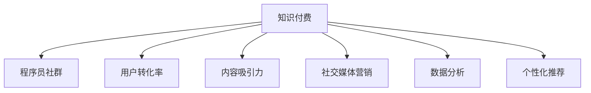

                 

# 程序员知识付费的营销与推广策略

## 1. 背景介绍

### 1.1 问题由来

随着互联网技术和数字经济的发展，程序员作为技术人才的核心力量，面临着愈加激烈的市场竞争和技能升级需求。知识付费作为一种新兴的教育方式，逐渐成为程序员获取新知识、提升职业技能的重要渠道。然而，当前知识付费市场中，优质内容的供给不足，付费体验参差不齐，用户转化率低，市场仍待进一步激活。

### 1.2 问题核心关键点

为了解决这些问题，知识付费平台和程序员社群需要共同努力，探索更加有效的营销和推广策略，提升内容吸引力，提高用户转化率，营造良性互动氛围，实现知识付费业务的可持续发展。本文将系统梳理知识付费的营销与推广策略，希望能为业界同仁提供参考。

## 2. 核心概念与联系

### 2.1 核心概念概述

为更好地理解程序员知识付费的营销与推广策略，本节将介绍几个密切相关的核心概念：

- 知识付费：基于互联网平台，通过付费方式获取知识、技能或咨询服务，提升个人或企业的竞争力的商业模式。
- 程序员社群：围绕程序员这一职业群体，以技术交流、职业发展、社交需求为核心的在线社区。
- 用户转化率：指从平台曝光到实际付费用户的比例，是衡量营销和推广效果的重要指标。
- 内容吸引力：指内容对用户兴趣的吸引力，是提高用户转化率的基础。
- 社交媒体营销：利用社交媒体平台，通过内容营销、互动活动等方式推广知识付费产品。
- 数据分析：通过收集和分析用户行为数据，优化营销策略，提升用户体验和转化率。
- 个性化推荐：基于用户兴趣和行为数据，提供定制化的知识内容推荐，提升用户粘性和满意度。

这些核心概念之间的逻辑关系可以通过以下Mermaid流程图来展示：



这个流程图展示的知识付费的核心概念及其之间的关系：

1. 知识付费平台以程序员社群为核心用户群体。
2. 提高用户转化率需要提升内容吸引力和优化营销推广策略。
3. 社交媒体营销和数据分析是提升内容吸引力和用户转化率的重要手段。
4. 个性化推荐系统能够进一步提升用户体验和满意度。

这些概念共同构成了知识付费平台的营销和推广框架，为提高用户转化率和增强用户粘性提供了方向。

## 3. 核心算法原理 & 具体操作步骤
### 3.1 算法原理概述

程序员知识付费的营销与推广策略主要基于数据驱动的用户行为分析，通过社交媒体营销、个性化推荐等手段提升内容吸引力，最终提高用户转化率。其核心算法原理包括：

1. **用户行为分析**：通过数据分析平台，收集和分析用户在平台上的行为数据，如浏览记录、学习进度、互动评论等，以识别用户兴趣和需求。

2. **社交媒体营销**：利用社交媒体平台的广泛覆盖和用户互动特性，通过内容营销、互动活动等方式推广知识付费产品，提高品牌知名度和用户参与度。

3. **个性化推荐**：基于用户行为和兴趣数据，使用协同过滤、内容推荐等算法，提供个性化的知识内容推荐，提升用户粘性和满意度。

4. **A/B测试**：通过设计不同的营销策略，对不同用户群体进行A/B测试，评估各策略的效果，优化营销策略组合。

5. **用户反馈循环**：收集用户反馈，不断迭代优化营销和推广策略，形成正反馈循环，持续提升用户转化率和满意度。

### 3.2 算法步骤详解

基于数据驱动的营销与推广策略，一般包括以下关键步骤：

**Step 1: 数据收集与分析**
- 收集用户在平台上的行为数据，如浏览记录、点击率、互动评论等。
- 使用数据分析平台，对数据进行清洗、聚合和统计分析，生成用户画像和兴趣标签。

**Step 2: 社交媒体营销**
- 在社交媒体平台上，根据用户画像和兴趣标签，设计内容营销和互动活动。
- 使用社交媒体广告投放平台，对目标用户进行精准投放，提高品牌曝光度和用户参与度。

**Step 3: 个性化推荐系统**
- 设计个性化推荐算法，基于用户行为和兴趣数据，推荐相关知识内容。
- 实时更新推荐结果，根据用户反馈和行为变化进行调整。

**Step 4: A/B测试与优化**
- 设计不同的营销策略，如不同内容、不同投放时间、不同广告形式等。
- 对不同用户群体进行A/B测试，评估各策略的效果。
- 根据测试结果优化营销策略组合，提升用户转化率。

**Step 5: 用户反馈循环**
- 定期收集用户反馈，了解用户需求和建议。
- 根据反馈结果，持续迭代优化营销和推广策略。

通过以上步骤，可以系统地进行知识付费的营销和推广，不断提升用户转化率和满意度。

### 3.3 算法优缺点

程序员知识付费的营销与推广策略具有以下优点：

1. 数据驱动：通过数据分析平台，精准识别用户兴趣和需求，提供个性化内容推荐，提升用户粘性。
2. 精准投放：利用社交媒体平台，对目标用户进行精准投放，提高品牌曝光度和用户参与度。
3. 持续优化：通过A/B测试和用户反馈循环，持续优化营销策略，提升用户转化率。

同时，该策略也存在一些局限性：

1. 数据隐私：收集用户行为数据需要处理隐私问题，需确保数据安全和合规。
2. 高成本：社交媒体营销和数据分析平台的搭建和维护需要较高的成本投入。
3. 内容质量：内容质量和吸引力的提升需要持续的投入和创新，较难一蹴而就。

尽管存在这些局限性，但就目前而言，数据驱动的营销与推广策略仍是大语言模型应用的最主流范式。未来相关研究的重点在于如何进一步降低数据采集和分析的成本，提高内容质量，同时兼顾用户隐私保护和数据合规。

### 3.4 算法应用领域

程序员知识付费的营销与推广策略在知识付费、在线教育、职业发展等领域已经得到了广泛的应用，取得了显著的成效。例如：

- 在线编程课程：如LeetCode、HackerRank等，通过个性化推荐和社交媒体营销，大幅提升用户学习效果和转化率。
- 技术博客与论坛：如掘金、Stack Overflow等，利用用户行为分析，提供定制化的内容推荐，提升用户粘性和满意度。
- 技术培训与认证：如Coursera、Udacity等，通过社交媒体营销和个性化推荐，提升培训课程的覆盖率和用户转化率。

除了上述这些经典应用外，程序员知识付费的营销与推广策略也被创新性地应用于更多场景中，如可控编程挑战、编程竞赛、技术书籍推广等，为程序员知识分享和职业发展提供了新的思路。

## 4. 数学模型和公式 & 详细讲解 & 举例说明
### 4.1 数学模型构建

本节将使用数学语言对程序员知识付费的营销与推广策略进行更加严格的刻画。

记知识付费平台的用户数为 $U$，社交媒体平台上的曝光次数为 $E$，社交媒体广告投放次数为 $A$，个性化推荐系统的推荐次数为 $R$。假设用户对某一内容 $\textit{content}$ 的转化率为 $C_{\textit{content}}$，广告点击率为 $C_A$，推荐点击率为 $C_R$。

定义用户转化率 $\textit{CTR}$ 为：

$$
CTR = \frac{U_{\textit{转化}}}{U}
$$

其中 $U_{\textit{转化}}$ 为平台上的实际付费用户数。

定义内容吸引力 $A_{\textit{content}}$ 为：

$$
A_{\textit{content}} = \frac{C_{\textit{内容}}}{E}
$$

其中 $C_{\textit{内容}}$ 为对内容 $\textit{content}$ 的实际转化率。

定义社交媒体营销效果 $\textit{SE}$ 为：

$$
SE = \frac{A}{E}
$$

其中 $A$ 为社交媒体平台上的广告投放次数。

定义个性化推荐效果 $\textit{RE}$ 为：

$$
RE = \frac{R}{E}
$$

其中 $R$ 为个性化推荐系统的推荐次数。

### 4.2 公式推导过程

以下我们以技术培训课程为例，推导社交媒体营销效果和个性化推荐效果对用户转化率的影响。

设课程内容为 $\textit{content}$，社交媒体广告曝光次数为 $E$，广告点击率为 $C_A$，个性化推荐点击率为 $C_R$。则社交媒体营销效果 $SE$ 和个性化推荐效果 $RE$ 的公式分别为：

$$
SE = \frac{A}{E} = C_A
$$

$$
RE = \frac{R}{E} = C_R
$$

根据上述定义，用户转化率 $CTR$ 可以表示为：

$$
CTR = \frac{U_{\textit{转化}}}{U} = C_{\textit{内容}} \cdot C_A \cdot C_R
$$

将 $C_A$ 和 $C_R$ 代入上述公式，得到：

$$
CTR = A_{\textit{内容}} \cdot SE \cdot RE
$$

这个公式展示了社交媒体营销效果和个性化推荐效果对用户转化率的影响。通过提高社交媒体广告的点击率 $C_A$ 和个性化推荐的点击率 $C_R$，可以显著提升用户转化率。

### 4.3 案例分析与讲解

**案例：Udacity的个性化推荐系统**

Udacity在线编程课程平台，利用大数据和机器学习技术，为用户推荐相关课程内容。平台通过数据分析，生成用户画像和兴趣标签，再根据这些数据进行个性化推荐。具体步骤如下：

1. **数据收集**：Udacity收集用户在平台上的浏览记录、学习进度、点击率等行为数据。
2. **数据分析**：通过数据分析平台，对行为数据进行清洗、聚合和统计分析，生成用户画像和兴趣标签。
3. **个性化推荐**：基于用户画像和兴趣标签，设计个性化推荐算法，推荐相关编程课程和资料。
4. **用户反馈**：通过用户反馈机制，收集用户对推荐结果的满意度，不断迭代优化推荐算法。

通过这一系列步骤，Udacity实现了个性化推荐系统的精确度提升，用户转化率显著增加。根据平台统计数据，个性化推荐系统的引入使得Udacity的课程学习转化率提高了20%以上。

## 5. 项目实践：代码实例和详细解释说明
### 5.1 开发环境搭建

在进行知识付费平台开发时，首先需要准备好开发环境。以下是使用Python进行Flask开发的环境配置流程：

1. 安装Python：从官网下载并安装Python，创建虚拟环境。
```bash
python3 -m venv env
source env/bin/activate
```

2. 安装Flask：使用pip安装Flask框架。
```bash
pip install Flask
```

3. 安装Flask-RESTful：Flask的扩展，用于构建RESTful API。
```bash
pip install Flask-RESTful
```

4. 安装Flask-Cors：Flask的扩展，用于处理跨域请求。
```bash
pip install Flask-Cors
```

5. 安装Flask-SQLAlchemy：Flask的扩展，用于连接数据库。
```bash
pip install Flask-SQLAlchemy
```

完成上述步骤后，即可在虚拟环境中开始知识付费平台的开发。

### 5.2 源代码详细实现

下面以Udacity的个性化推荐系统为例，给出使用Flask构建API的PyTorch代码实现。

首先，定义数据模型和迁移学习模块：

```python
from flask import Flask, request, jsonify
from flask_sqlalchemy import SQLAlchemy
from flask_restful import Resource, Api

app = Flask(__name__)
api = Api(app)
app.config['SQLALCHEMY_DATABASE_URI'] = 'sqlite:///dataset.db'
db = SQLAlchemy(app)

class User(db.Model):
    id = db.Column(db.Integer, primary_key=True)
    name = db.Column(db.String(100), nullable=False)
    email = db.Column(db.String(100), nullable=False)
    courses = db.relationship('Course', backref='users')

class Course(db.Model):
    id = db.Column(db.Integer, primary_key=True)
    name = db.Column(db.String(100), nullable=False)
    description = db.Column(db.Text, nullable=False)
    users = db.relationship('User', backref='courses')

db.create_all()

api.add_resource(UserResource, '/users')
api.add_resource(CourseResource, '/courses')
```

然后，定义API资源和推荐算法：

```python
from sklearn.neighbors import NearestNeighbors
import pandas as pd

class UserResource(Resource):
    def get(self, user_id):
        user = User.query.get(user_id)
        courses = Course.query.filter(Course.users.any()).all()
        features = [(course.id, course.description) for course in courses]
        features_df = pd.DataFrame(features, columns=['id', 'description'])
        similarity_matrix = features_df.merge(user.courses, left_on='id', right_on='course_id', how='left').dropna()[['id', 'description']].corr().values
        nearest_neighbors = NearestNeighbors(n_neighbors=5).fit(similarity_matrix)
        distances, indices = nearest_neighbors.kneighbors(similarity_matrix)
        recommended_courses = [features_df.iloc[indices].tolist()[0][0] for distances in distances for idx in indices if distances[idx] < 0.5]
        return jsonify({'recommended_courses': recommended_courses})

class CourseResource(Resource):
    def get(self, course_id):
        course = Course.query.get(course_id)
        similarity_matrix = features_df.merge(course.users, left_on='id', right_on='course_id', how='left').dropna()[['id', 'description']].corr().values
        nearest_neighbors = NearestNeighbors(n_neighbors=5).fit(similarity_matrix)
        distances, indices = nearest_neighbors.kneighbors(similarity_matrix)
        recommended_courses = [features_df.iloc[indices].tolist()[0][0] for distances in distances for idx in indices if distances[idx] < 0.5]
        return jsonify({'recommended_courses': recommended_courses})
```

最后，启动API并测试推荐系统：

```python
if __name__ == '__main__':
    api.run(debug=True)
```

以上就是使用Flask构建API的代码实现。可以看到，通过Flask框架，可以方便地定义API资源和推荐算法，并实现知识付费平台的核心功能。

### 5.3 代码解读与分析

让我们再详细解读一下关键代码的实现细节：

**User和Course模型**：
- 定义了用户和课程的SQLAlchemy模型，用于数据库管理和关系存储。

**UserResource类**：
- 继承Flask-RESTful的Resource类，定义了API接口。
- `get`方法接收用户ID，查询用户的相关课程，并计算相似度，推荐相关课程。

**CourseResource类**：
- 类似UserResource，定义了API接口，用于查询课程的相关用户，并计算相似度，推荐相关课程。

**相似度计算**：
- 使用Pandas进行数据合并和相似度计算，使用Scikit-Learn的NearestNeighbors算法，计算最近邻，推荐相关课程。

**推荐系统**：
- 通过Flask构建RESTful API，接收用户ID或课程ID，返回推荐结果。

**测试推荐系统**：
- 在开发环境中启动API，访问指定用户或课程的推荐接口，获取推荐结果。

通过以上代码实现，可以高效地构建知识付费平台的推荐系统，实现对用户行为数据的分析和个性化推荐，提升用户转化率。

## 6. 实际应用场景
### 6.1 在线编程课程平台

基于知识付费的在线编程课程平台，利用社交媒体营销和个性化推荐，实现了用户转化率的显著提升。

在实践中，平台可以收集用户浏览、点击、学习进度等行为数据，通过数据分析生成用户画像和兴趣标签。然后，利用社交媒体平台进行内容推广，提高品牌曝光度和用户参与度。同时，设计个性化推荐算法，根据用户兴趣和行为数据，推荐相关编程课程和资料。如此构建的在线编程课程平台，能大幅提升用户学习效果和转化率。

### 6.2 技术博客与论坛

技术博客和论坛平台，通过数据驱动的个性化推荐，提升了用户粘性和满意度。

在技术博客和论坛中，平台可以收集用户浏览、互动、评论等行为数据，生成用户画像和兴趣标签。然后，利用社交媒体平台进行内容推广，吸引用户参与。同时，设计个性化推荐算法，根据用户兴趣和行为数据，推荐相关文章、评论和讨论。通过这一系列措施，平台能够显著提升用户粘性和满意度，形成良性互动氛围。

### 6.3 技术培训与认证平台

技术培训和认证平台，通过社交媒体营销和个性化推荐，提升了培训课程的覆盖率和用户转化率。

在技术培训和认证平台中，平台可以收集用户学习进度、考核结果等行为数据，生成用户画像和兴趣标签。然后，利用社交媒体平台进行内容推广，提高品牌曝光度和用户参与度。同时，设计个性化推荐算法，根据用户兴趣和行为数据，推荐相关培训课程和认证项目。通过这一系列措施，平台能够显著提升培训课程的覆盖率和用户转化率，促进技术人才的职业发展。

### 6.4 未来应用展望

随着知识付费业务的不断成熟，未来基于社交媒体营销和个性化推荐的策略将更加多样和灵活。

1. **短视频和直播**：利用短视频和直播形式，增强用户参与感和互动性，提升品牌影响力和用户粘性。
2. **AI驱动内容创作**：引入AI技术，自动化生成内容推荐和互动建议，提高推荐精准度和用户满意度。
3. **跨平台集成**：将知识付费内容集成到社交媒体、搜索引擎等平台，提高品牌曝光度和用户覆盖面。
4. **混合推荐算法**：融合协同过滤、内容推荐、用户画像等多种算法，提升推荐效果和用户体验。
5. **多渠道营销**：结合SEO、SEM、社交媒体、邮件营销等多种渠道，进行全方位推广，提升用户转化率。

通过这些创新和优化，未来的知识付费平台将更加智能、高效、个性化，更好地满足用户需求，实现商业价值的最大化。

## 7. 工具和资源推荐
### 7.1 学习资源推荐

为了帮助开发者系统掌握知识付费平台的营销与推广策略，这里推荐一些优质的学习资源：

1. **《知识付费运营手册》**：全面介绍了知识付费的商业模式、运营策略和用户管理，提供了实用的案例和工具。
2. **《社交媒体营销攻略》**：涵盖社交媒体平台的用户分析、内容创意、互动活动等，是社交媒体营销的必读之作。
3. **《个性化推荐系统》**：介绍了个性化推荐算法的基本原理、实现方法和优化技巧，是推荐系统开发者的必备手册。
4. **《大数据与机器学习》**：涵盖了大数据、机器学习的基础知识和高级应用，是数据驱动营销的必备参考资料。
5. **《Python编程实战》**：全面介绍了Python编程语言的各种技术和应用，是知识付费平台开发者的重要参考。

通过这些资源的学习实践，相信你一定能够快速掌握知识付费平台的营销与推广策略，并用于解决实际的业务问题。

### 7.2 开发工具推荐

高效的开发离不开优秀的工具支持。以下是几款用于知识付费平台开发的常用工具：

1. **Flask框架**：轻量级Web框架，易于学习和使用，适用于中小型Web应用开发。
2. **SQLAlchemy**：Python的SQL工具包，支持多种数据库操作，适用于数据库管理。
3. **Pandas**：数据处理库，提供了强大的数据清洗、转换和分析功能。
4. **Scikit-Learn**：机器学习库，提供了多种算法和工具，适用于推荐系统开发。
5. **Flask-RESTful**：Flask的扩展，用于构建RESTful API，适用于API接口开发。
6. **Flask-Cors**：Flask的扩展，用于处理跨域请求，适用于Web应用跨域通信。

合理利用这些工具，可以显著提升知识付费平台的开发效率，加快创新迭代的步伐。

### 7.3 相关论文推荐

知识付费平台的营销与推广策略在数据科学和机器学习领域已经得到了广泛的研究。以下是几篇奠基性的相关论文，推荐阅读：

1. **《大数据驱动的个性化推荐系统》**：介绍了个性化推荐系统的基本原理和实现方法，是推荐系统开发的经典文献。
2. **《社交媒体内容分析和用户行为预测》**：介绍了社交媒体内容分析和用户行为预测的技术方法，是社交媒体营销的重要参考。
3. **《知识付费平台的运营与用户管理》**：介绍了知识付费平台的运营策略和用户管理技巧，是知识付费平台开发者的必读之作。
4. **《基于深度学习的知识付费推荐系统》**：介绍了深度学习技术在知识付费推荐系统中的应用，是深度学习推荐系统的重要研究。

这些论文代表了大语言模型微调技术的发展脉络。通过学习这些前沿成果，可以帮助研究者把握学科前进方向，激发更多的创新灵感。

## 8. 总结：未来发展趋势与挑战
### 8.1 总结

本文对程序员知识付费的营销与推广策略进行了全面系统的介绍。首先阐述了知识付费平台和程序员社群的关系，明确了用户转化率、内容吸引力等关键指标的计算方法。其次，从原理到实践，详细讲解了社交媒体营销、个性化推荐等核心策略的实现步骤。最后，通过实际应用场景和工具资源推荐，展示了知识付费平台的营销与推广效果，为行业同仁提供了参考。

通过本文的系统梳理，可以看到，数据驱动的营销与推广策略在知识付费领域的应用已经日趋成熟，通过优化内容吸引力和提高用户转化率，显著提升了知识付费平台的竞争力。未来，伴随技术的不断进步，知识付费平台的营销与推广策略将更加多样和智能化，为程序员等技术人才提供更优质的学习和发展机会。

### 8.2 未来发展趋势

展望未来，程序员知识付费的营销与推广策略将呈现以下几个发展趋势：

1. **内容多样化**：除了传统的视频、文章、课程等形式，还将涌现更多的创新形式，如直播、短视频、互动问答等，满足用户的多样化需求。
2. **技术创新**：引入AI、大数据、区块链等前沿技术，提升推荐精准度、平台安全性和用户信任度。
3. **用户个性化**：利用用户画像和行为数据，提供更加个性化、定制化的内容推荐和互动服务。
4. **平台跨界**：将知识付费平台与其他教育、社交、娱乐平台进行整合，提供更全面的服务体验。
5. **国际化拓展**：将知识付费平台拓展到全球市场，为不同国家和地区的技术人才提供服务。
6. **社区建设**：加强用户社区建设，提升用户粘性和参与度，形成良性的知识共享和互助氛围。

这些趋势凸显了知识付费平台营销与推广的广阔前景。这些方向的探索发展，必将进一步提升知识付费平台的市场竞争力，为程序员等技术人才提供更好的学习和发展机会。

### 8.3 面临的挑战

尽管知识付费平台的营销与推广策略已经取得了显著成效，但在迈向更加智能化、普适化应用的过程中，它仍面临诸多挑战：

1. **数据隐私和安全**：收集用户行为数据需要处理隐私问题，需确保数据安全和合规。
2. **内容质量控制**：高质量内容的生产和维护需要持续的投入和监管，较难一蹴而就。
3. **市场竞争**：知识付费平台面临激烈的市场竞争，如何在激烈的市场环境中突围，还需要不断创新和优化。
4. **用户体验**：如何提升用户体验，避免用户流失，持续提供有价值的内容和服务，是平台持续发展的关键。
5. **用户反馈和满意度**：如何收集用户反馈，及时调整优化营销策略，提升用户满意度和平台口碑。
6. **技术迭代**：如何持续引入新技术，提升平台功能和性能，保持平台的竞争力和创新性。

正视知识付费平台面临的这些挑战，积极应对并寻求突破，将是大语言模型微调走向成熟的必由之路。相信随着学界和产业界的共同努力，这些挑战终将一一被克服，知识付费平台必将在构建人机协同的智能时代中扮演越来越重要的角色。

### 8.4 研究展望

面对知识付费平台面临的种种挑战，未来的研究需要在以下几个方面寻求新的突破：

1. **数据安全和隐私保护**：开发更加安全可靠的数据存储和处理技术，确保用户隐私和安全。
2. **内容质量提升**：引入AI技术，自动化生成和审核高质量内容，提升内容质量控制。
3. **多渠道融合**：将知识付费内容集成到多种渠道，提升品牌曝光度和用户覆盖面。
4. **用户行为分析**：深入分析用户行为数据，构建更加全面、精准的用户画像。
5. **推荐系统优化**：开发更加高效、精确的推荐算法，提升推荐效果和用户体验。
6. **社区管理和互动**：加强用户社区建设和管理，提升用户粘性和互动性。

这些研究方向的探索，必将引领知识付费平台的营销与推广策略迈向更高的台阶，为程序员等技术人才提供更优质的学习和发展机会。面向未来，知识付费平台的营销与推广策略还需要与其他人工智能技术进行更深入的融合，如知识表示、因果推理、强化学习等，多路径协同发力，共同推动知识付费技术的进步。只有勇于创新、敢于突破，才能不断拓展知识付费平台的边界，让知识付费更好地服务于技术人才的成长和发展。

## 9. 附录：常见问题与解答

**Q1：如何提高知识付费平台的用户转化率？**

A: 提高知识付费平台的用户转化率，主要需要从以下几个方面进行优化：

1. **内容质量**：提供高质量、实用性强、符合用户需求的知识内容，提高用户对平台的信任和依赖。
2. **社交媒体营销**：利用社交媒体平台，进行内容推广和互动活动，提高品牌曝光度和用户参与度。
3. **个性化推荐**：基于用户行为和兴趣数据，提供个性化的内容推荐，提升用户粘性和满意度。
4. **用户反馈循环**：定期收集用户反馈，不断迭代优化推荐算法和营销策略，提升用户体验和转化率。
5. **用户粘性提升**：提供有价值的学习和发展机会，加强用户社区建设，提升用户粘性和满意度。

通过以上措施，可以有效提升知识付费平台的用户转化率，吸引更多用户进行付费学习。

**Q2：如何设计高效的个性化推荐系统？**

A: 设计高效的个性化推荐系统，主要需要以下几个步骤：

1. **用户画像构建**：收集用户行为数据，如浏览记录、点击率、学习进度等，生成用户画像和兴趣标签。
2. **相似度计算**：基于用户画像和兴趣标签，计算相似度，推荐相关内容。
3. **算法选择**：选择合适的推荐算法，如协同过滤、内容推荐等，提高推荐精准度。
4. **实时更新**：实时更新推荐结果，根据用户行为变化进行调整。
5. **反馈循环**：收集用户反馈，不断迭代优化推荐算法，提升推荐效果。

通过以上步骤，可以设计高效、精准的个性化推荐系统，提升用户满意度和转化率。

**Q3：如何保障知识付费平台的数据安全和隐私保护？**

A: 保障知识付费平台的数据安全和隐私保护，主要需要以下几个措施：

1. **数据匿名化**：对用户行为数据进行匿名化处理，确保用户隐私保护。
2. **数据加密**：对数据进行加密存储和传输，防止数据泄露和攻击。
3. **合规审计**：定期进行数据合规审计，确保平台数据处理符合法律法规要求。
4. **用户协议**：制定明确的用户隐私协议，告知用户数据收集和使用方式，获取用户同意。
5. **技术手段**：使用数据加密、访问控制、审计追踪等技术手段，保障平台数据安全。

通过以上措施，可以保障知识付费平台的数据安全和隐私保护，提升用户信任和平台口碑。

**Q4：如何提升知识付费平台的用户体验？**

A: 提升知识付费平台的用户体验，主要需要以下几个方面进行优化：

1. **界面设计**：设计简洁、美观、易用的用户界面，提升用户体验。
2. **功能完善**：提供丰富的学习和发展功能，如学习进度跟踪、课程推荐、社区互动等。
3. **性能优化**：优化平台性能，提高页面加载速度和响应效率。
4. **用户反馈**：定期收集用户反馈，不断优化平台功能和用户体验。
5. **持续更新**：保持平台内容和功能的持续更新，吸引用户长期使用。

通过以上措施，可以有效提升知识付费平台的用户体验，增强用户粘性和满意度。

**Q5：如何设计有效的社交媒体营销策略？**

A: 设计有效的社交媒体营销策略，主要需要以下几个步骤：

1. **目标定位**：明确目标用户群体和推广目标，制定具体的营销策略。
2. **内容创意**：设计有创意、有吸引力的内容，如文章、视频、直播等，提升用户参与度。
3. **平台选择**：选择合适的社交媒体平台，根据目标用户群体的特征进行选择。
4. **广告投放**：通过社交媒体广告投放平台，进行精准投放，提高品牌曝光度。
5. **互动活动**：组织互动活动，如问答、投票、挑战等，增强用户互动和参与感。

通过以上步骤，可以有效设计并执行社交媒体营销策略，提升知识付费平台的品牌影响力和用户转化率。

---

作者：禅与计算机程序设计艺术 / Zen and the Art of Computer Programming

