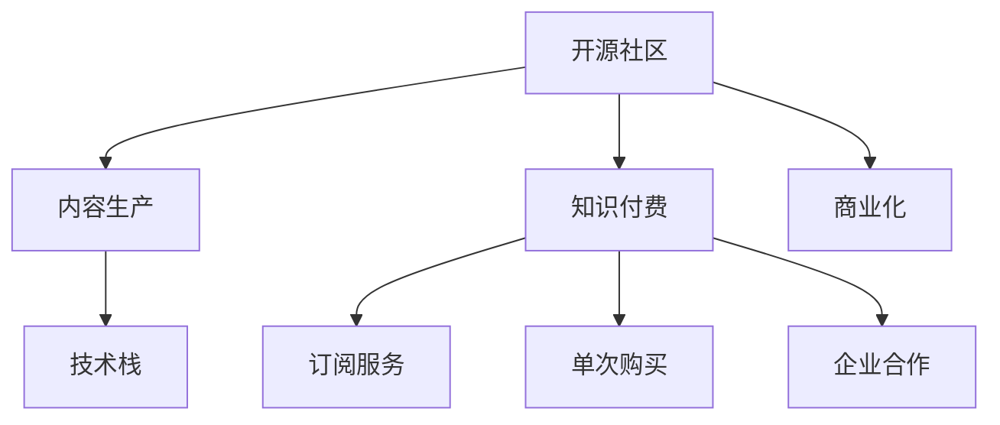

                 

# 程序员知识付费：从免费到收费

> 关键词：知识付费,程序员,开源,商业化,技术栈,内容生产,变现模式

## 1. 背景介绍

### 1.1 问题由来
互联网时代，信息爆炸和知识碎片化成为显著特征。程序员作为技术含量高、知识更新迅速的职业，更是处于信息汪洋中航行的舟。然而，面对日益庞杂的知识体系和海量信息，如何筛选、整合、深入理解和学习这些知识，成为了困扰程序员的核心问题。传统论坛、博客、视频网站等免费资源虽然易于获取，但缺乏系统性、深入性和即时性，难以满足程序员高效学习的需求。而知识付费平台通过专业筛选、深入讲解、系统整理，为用户提供了更为优质和高效的学习体验，迅速成为了程序员获取知识的重要渠道。

### 1.2 问题核心关键点
知识付费平台的兴起，在一定程度上改变了程序员的学习方式，但随之而来的问题也不容忽视。特别是在开源资源丰富的开源社区，如何平衡好开源与知识付费之间的关系，成为了一个重要的议题。本文将从开源与知识付费的交织关系出发，探讨程序员知识付费的价值、现状和未来，以及如何从免费资源到收费服务的平滑过渡。

## 2. 核心概念与联系

### 2.1 核心概念概述

为更好地理解程序员知识付费的问题，本节将介绍几个密切相关的核心概念：

- 知识付费：指用户为获取专业、系统、深入的知识而支付费用的商业模式。在程序员领域，知识付费通常表现为订阅平台、培训课程、在线咨询等形式。

- 开源社区：指通过互联网分享源代码的开放平台，程序员可以在开源社区中协作开发、交流分享，共同提升技术水平。

- 商业化：指将产品或服务从免费模式向收费模式转变的过程，涉及内容生产、变现渠道、用户激励等环节。

- 技术栈：指开发项目中使用的所有技术组件和框架的集合，程序员的知识付费服务往往会涉及特定技术栈的深度讲解和实战演练。

- 内容生产：指知识付费平台内容制作的过程，包括内容选题、知识整理、内容发布等。

- 变现模式：指知识付费平台通过订阅、单次购买、企业合作等方式实现盈利的方式。

这些核心概念之间的逻辑关系可以通过以下Mermaid流程图来展示：



这个流程图展示了几类核心概念及其之间的关系：

1. 开源社区提供丰富的技术资源，为知识付费内容的生产提供了坚实基础。
2. 知识付费平台通过内容生产，将技术资源转化为可变现的知识服务。
3. 技术栈是知识付费内容的重要组成部分，深度讲解特定技术栈可以增强平台的吸引力。
4. 订阅服务、单次购买、企业合作等变现模式，为知识付费平台创造了多元化的盈利渠道。
5. 商业化进程中，开源与知识付费的边界逐渐清晰，两者之间的协同互补关系更加紧密。

## 3. 核心算法原理 & 具体操作步骤

### 3.1 算法原理概述

程序员知识付费的兴起，本质上是知识生产与消费的关系演进。在开源社区的语境下，知识付费与开源的融合是一个渐进的过程，涉及从免费到收费的算法转换。

- **算法一**：
  - **原理**：开源资源（源代码）免费获取，用户通过付费订阅或单次购买，获得更深入、系统、实时更新的技术讲解和服务。
  - **步骤**：
    1. 开源社区提供丰富的开源项目和源代码，用户免费下载和浏览。
    2. 用户通过知识付费平台订阅或购买课程，获得专家的深入讲解和实战指导。
    3. 知识付费平台集成开源资源，提供更全面的技术支持和服务。

- **算法二**：
  - **原理**：开源资源免费，用户仅需支付少量订阅费或单次购买费，即可获取专家提供的定制化解决方案和技术支持。
  - **步骤**：
    1. 开源社区提供免费的基础源代码和文档，用户可自由下载使用。
    2. 用户通过知识付费平台订阅或购买，获得专家针对项目需求提供的定制化技术支持。
    3. 知识付费平台提供多种技术栈的定制化解决方案，提高用户开发效率。

### 3.2 算法步骤详解

1. **用户注册与筛选**：
   - 用户注册：知识付费平台需提供简单易用的注册系统，支持多平台登录。
   - 用户筛选：通过兴趣、技术栈、项目需求等多维度筛选，将用户与匹配的内容连接起来。

2. **内容制作与发布**：
   - 内容选题：根据用户需求和市场趋势，制定符合用户预期的课程大纲和技术栈。
   - 知识整理：将开源项目和技术栈进行系统整理，形成详细的课程讲义和实战指南。
   - 内容发布：将制作好的课程内容发布到知识付费平台，供用户订阅或购买。

3. **用户订阅与购买**：
   - 订阅服务：提供按月或按年订阅的服务，用户可根据个人需求选择订阅周期。
   - 单次购买：针对特定的技术讲解或实战演练，提供单次购买的选项。
   - 企业合作：与企业达成合作，提供定制化技术支持和解决方案。

4. **内容更新与迭代**：
   - 定期更新：根据技术发展和用户反馈，定期更新课程内容，保持技术的先进性。
   - 持续迭代：在知识付费平台上建立用户反馈机制，根据用户需求和市场变化，进行课程内容迭代优化。

### 3.3 算法优缺点

**优点**：

1. **内容深度与广度**：知识付费平台通过系统性、深度讲解技术栈和开源项目，帮助用户快速掌握最新技术。
2. **实时更新与优化**：定期更新和迭代课程内容，保持技术的先进性和实用性。
3. **专家指导与支持**：提供专家的深度指导和技术支持，解决实际开发中的问题。

**缺点**：

1. **收费门槛**：部分内容需支付费用，可能对部分用户形成经济门槛。
2. **资源依赖**：知识付费平台依赖开源社区的内容支持，一旦开源社区发生变化，平台内容可能需要快速调整。
3. **用户粘性不足**：部分用户可能仅需免费资源，不愿支付订阅费用。

### 3.4 算法应用领域

程序员知识付费的应用领域广泛，涵盖如下几方面：

1. **技术栈学习**：如Java、Python、React等主流技术栈的深度讲解。
2. **开源项目实战**：如Spring Boot、Vue.js、TensorFlow等开源项目的实战演练。
3. **软件开发流程**：如敏捷开发、测试驱动开发、DevOps等软件开发流程的讲解。
4. **项目管理工具**：如JIRA、GitLab、Docker等项目管理工具的使用技巧。
5. **安全与隐私**：如网络安全、数据隐私保护等安全相关内容的讲解。
6. **职业发展**：如简历写作、面试技巧、职业规划等职业发展相关内容的讲解。

## 4. 数学模型和公式 & 详细讲解 & 举例说明

### 4.1 数学模型构建

在程序员知识付费中，数学模型的构建主要涉及用户筛选、内容推荐和收益分配等环节。以下是一个简单的数学模型示例：

- **用户筛选模型**：
  $$
  F_{user}(u) = w_1f_{interest}(u) + w_2f_{experience}(u) + w_3f_{learning_rate}(u)
  $$
  其中 $F_{user}(u)$ 为用户筛选函数，$w_i$ 为权重，$f_{...}$ 为特征函数，如兴趣、经验、学习速度等。

- **内容推荐模型**：
  $$
  R_{content}(c) = w_1f_{quality}(c) + w_2f_{popularity}(c) + w_3f_{related}(c)
  $$
  其中 $R_{content}(c)$ 为内容推荐函数，$w_i$ 为权重，$f_{...}$ 为特征函数，如内容质量、受欢迎度、相关性等。

- **收益分配模型**：
  $$
  P_{income}(p) = w_1p_{subscription}(p) + w_2p_{single}(p) + w_3p_{enterprise}(p)
  $$
  其中 $P_{income}(p)$ 为收益分配函数，$w_i$ 为权重，$p_{...}$ 为盈利方式，如订阅收入、单次购买收入、企业合作收入等。

### 4.2 公式推导过程

以用户筛选模型为例，假设用户 $u$ 对课程 $c$ 的兴趣度为 $I(u,c)$，用户 $u$ 的经验度为 $E(u)$，用户 $u$ 的学习速度为 $L(u)$。用户筛选函数 $F_{user}(u)$ 可以表示为：

$$
F_{user}(u) = I(u,c) \cdot E(u) \cdot L(u)
$$

其中 $I(u,c)$ 表示用户对课程 $c$ 的兴趣度，$E(u)$ 表示用户的经验度，$L(u)$ 表示用户的学习速度。

假设 $I(u,c)$、$E(u)$、$L(u)$ 分别由如下函数表示：

$$
I(u,c) = \sum_{i=1}^n w_i \cdot g_i(u,c)
$$

$$
E(u) = \sum_{j=1}^m w_j \cdot h_j(u)
$$

$$
L(u) = \sum_{k=1}^p w_k \cdot l_k(u)
$$

其中 $w_i$、$w_j$、$w_k$ 为权重，$g_i(u,c)$、$h_j(u)$、$l_k(u)$ 为特征函数，如兴趣点、经验水平、学习速度等。

代入用户筛选函数 $F_{user}(u)$，得：

$$
F_{user}(u) = \left(\sum_{i=1}^n w_i \cdot g_i(u,c)\right) \cdot \left(\sum_{j=1}^m w_j \cdot h_j(u)\right) \cdot \left(\sum_{k=1}^p w_k \cdot l_k(u)\right)
$$

进一步化简，得：

$$
F_{user}(u) = \sum_{i,j,k} w_i \cdot w_j \cdot w_k \cdot g_i(u,c) \cdot h_j(u) \cdot l_k(u)
$$

该模型通过多维度特征函数，综合评估用户对课程的兴趣度，为用户筛选合适的课程。

### 4.3 案例分析与讲解

以开源社区Github为例，Github提供了大量开源项目，用户可以免费查看和下载源代码。Github平台通过知识付费提供更加深入的讲解和技术支持，吸引了大量付费用户。

1. **用户筛选**：
   - 用户注册后，Github通过用户兴趣、关注项目、历史贡献等多维度信息，对用户进行筛选。
   - 对于开源项目，用户可以根据项目名称、语言、状态等筛选，了解项目的最新动态和贡献者信息。

2. **内容制作**：
   - 开源社区的专家和贡献者可以发布教程、博客、视频等，提供项目背景、技术栈、实战演练等深入讲解。
   - 付费用户可以通过订阅服务，获取专家提供的定制化解决方案和技术支持。

3. **用户订阅与购买**：
   - 用户可以选择按月或按年订阅，获取特定项目或技术栈的深入讲解。
   - 对于单次购买内容，如项目实战演练、课程讲解视频等，用户只需支付单次费用即可获取。

4. **内容更新与迭代**：
   - 开源社区的专家和贡献者定期更新内容，保持项目和技术的先进性。
   - 用户可以随时获取最新版本的代码和技术讲解，确保掌握最新动态。

## 5. 项目实践：代码实例和详细解释说明

### 5.1 开发环境搭建

在进行知识付费平台的开发实践前，我们需要准备好开发环境。以下是使用Python进行Flask框架开发的Web开发环境配置流程：

1. 安装Anaconda：从官网下载并安装Anaconda，用于创建独立的Python环境。

2. 创建并激活虚拟环境：
```bash
conda create -n flask-env python=3.8 
conda activate flask-env
```

3. 安装Flask：
```bash
pip install flask
```

4. 安装Gunicorn：
```bash
pip install gunicorn
```

5. 安装Flask-RESTful：
```bash
pip install flask-restful
```

完成上述步骤后，即可在`flask-env`环境中开始Web开发实践。

### 5.2 源代码详细实现

下面是一个简单的知识付费平台Web应用示例，实现用户注册、登录、订阅、购买等功能。

```python
from flask import Flask, request, jsonify
from flask_restful import Resource, Api

app = Flask(__name__)
api = Api(app)

# 用户数据存储
users = []

# 课程数据存储
courses = {
    "Java编程基础": {
        "price": 49,
        "instructor": "张三",
        "description": "Java编程基础课程"
    },
    "Python数据分析": {
        "price": 39,
        "instructor": "李四",
        "description": "Python数据分析实战"
    },
    "Flask Web开发": {
        "price": 59,
        "instructor": "王五",
        "description": "Flask Web开发教程"
    }
}

class User(Resource):
    def get(self, username):
        for user in users:
            if user["username"] == username:
                return jsonify(user), 200
        return jsonify({"error": "User not found"}), 404

    def post(self, username, password):
        new_user = {"username": username, "password": password}
        users.append(new_user)
        return jsonify(new_user), 201

    def put(self, username):
        for user in users:
            if user["username"] == username:
                user["password"] = request.json["new_password"]
                return jsonify(user), 200
        return jsonify({"error": "User not found"}), 404

    def delete(self, username):
        for user in users:
            if user["username"] == username:
                users.remove(user)
                return jsonify({"message": "User deleted"}), 200
        return jsonify({"error": "User not found"}), 404

class Course(Resource):
    def get(self, course_name):
        if course_name in courses:
            return jsonify(courses[course_name]), 200
        return jsonify({"error": "Course not found"}), 404

    def post(self, course_name, payment_method):
        course = courses[course_name]
        if payment_method == "credit":
            course["price"] = 30
        elif payment_method == "paypal":
            course["price"] = 40
        else:
            return jsonify({"error": "Invalid payment method"}), 400
        return jsonify(course), 201

if __name__ == "__main__":
    api.add_resource(User, "/user/<string:username>")
    api.add_resource(Course, "/course/<string:course_name>")
    app.run(debug=True)
```

### 5.3 代码解读与分析

让我们再详细解读一下关键代码的实现细节：

**User类**：
- `get`方法：根据用户名查询用户信息，如果不存在则返回404错误。
- `post`方法：注册新用户，保存用户信息，并返回201状态码。
- `put`方法：修改用户密码，返回用户信息，如果不存在则返回404错误。
- `delete`方法：删除用户，返回200状态码或404错误。

**Course类**：
- `get`方法：根据课程名称查询课程信息，如果不存在则返回404错误。
- `post`方法：修改课程价格，支持信用卡和PayPal支付，返回课程信息，如果不存在则返回404错误或400错误。

**app.run(debug=True)**：启动Flask应用，设置调试模式为True，方便开发调试。

## 6. 实际应用场景

### 6.1 开源社区与知识付费的融合

开源社区与知识付费的融合，是知识付费平台的核心商业模式。Github、GitLab等开源社区平台，已经积极探索了这一模式。

1. **Github**：
   - Github提供免费的开源项目托管服务，吸引大量开发者贡献代码。
   - 付费用户可以通过订阅服务，获取专家提供的深入讲解和支持。
   - 专家可以通过发布教程、博客、视频等，获取平台的奖励和粉丝支持。

2. **GitLab**：
   - GitLab提供免费和付费两种服务模式，用户可以根据需求选择。
   - 付费用户可以通过订阅服务，获取专家提供的定制化解决方案和技术支持。
   - 专家可以通过发布教程、博客、视频等，获取平台的奖励和粉丝支持。

### 6.2 商业化路径与盈利模式

知识付费平台的商业化路径与盈利模式，涉及内容生产、用户激励、广告收入等多个环节。以下是一个简单的盈利模型示例：

- **内容生产**：平台通过专家和社区贡献者发布高质量内容，吸引用户订阅和购买。
- **用户激励**：平台通过积分、会员、虚拟货币等方式激励用户积极参与内容生产和互动。
- **广告收入**：平台在内容页面和应用内广告位，引入第三方广告，获取广告收入。
- **企业合作**：平台与企业达成合作，提供定制化技术支持和解决方案，获取企业合作收入。

## 7. 工具和资源推荐

### 7.1 学习资源推荐

为了帮助开发者系统掌握知识付费平台的技术栈和实现方法，这里推荐一些优质的学习资源：

1. **《Web开发实战》系列书籍**：详细介绍Flask、Django等Web框架的实战开发，涵盖前后端开发、API设计、用户认证等环节。
2. **《知识付费平台构建》课程**：针对知识付费平台的项目开发和管理，提供详细的课程讲解和实践指南。
3. **《Python网络编程》课程**：涵盖网络编程、RESTful API、HTTP请求等知识，帮助开发者掌握Web开发基础。

### 7.2 开发工具推荐

高效的开发离不开优秀的工具支持。以下是几款用于知识付费平台开发的常用工具：

1. **Visual Studio Code**：跨平台的代码编辑器，支持多种编程语言和扩展插件，是Web开发的首选工具。
2. **PyCharm**：由JetBrains开发的Python开发工具，支持代码分析、调试、测试等综合开发功能。
3. **Postman**：API测试和开发工具，支持多种API测试方法，提高开发效率。
4. **JIRA**：项目管理工具，支持敏捷开发、缺陷追踪、任务分配等功能。
5. **GitLab**：开源社区平台，支持代码托管、项目管理、CI/CD等功能，是知识付费平台的重要组成部分。

### 7.3 相关论文推荐

知识付费平台的研究涉及多个领域，以下是几篇奠基性的相关论文，推荐阅读：

1. **《Web开发技术栈》论文**：探讨了Web开发常用的技术栈和开发框架，如React、Vue.js、Flask等。
2. **《用户行为分析》论文**：通过数据挖掘和机器学习，分析用户行为和需求，提供个性化的内容推荐。
3. **《知识图谱与推荐系统》论文**：探讨了知识图谱在推荐系统中的应用，提升推荐内容的质量和相关性。
4. **《开源社区管理》论文**：研究了开源社区的管理和治理机制，提升社区活跃度和贡献度。

## 8. 总结：未来发展趋势与挑战

### 8.1 总结

本文对程序员知识付费从免费到收费的演进进行了全面系统的介绍。首先阐述了开源社区和知识付费的交织关系，明确了知识付费的价值和现状。其次，从算法原理和具体操作步骤，详细讲解了知识付费平台的核心实现方法。同时，本文还广泛探讨了知识付费在实际应用场景中的应用前景，展示了开源与知识付费融合的广阔空间。

通过本文的系统梳理，可以看到，程序员知识付费平台的兴起，正在改变程序员的学习方式和知识获取渠道。开源社区与知识付费的融合，为程序员提供了更为优质、高效、深度、实时的内容服务。未来，伴随着技术栈的不断丰富、内容生产的持续优化、用户需求的不断增长，知识付费平台必将在程序员培训和职业发展中发挥更加重要的作用。

### 8.2 未来发展趋势

展望未来，程序员知识付费平台的发展将呈现以下几个趋势：

1. **内容多样化**：除了技术讲解和实战演练，知识付费平台还将引入更多领域的课程内容，如项目管理、数据分析、人工智能等。
2. **交互性增强**：通过视频会议、实时互动等方式，增强用户与专家之间的交互，提升学习体验。
3. **个性化推荐**：利用大数据和机器学习技术，提供个性化的课程推荐，帮助用户快速找到适合自己的内容。
4. **社区化协作**：通过知识付费平台，构建开发者社区，促进知识交流和协作，形成良性生态。
5. **实时更新**：知识付费平台将不断更新课程内容，保持技术的先进性和实用性。

### 8.3 面临的挑战

尽管知识付费平台取得了显著成效，但在迈向成熟的过程中，仍面临诸多挑战：

1. **内容质量参差不齐**：部分平台内容质量不高，缺乏系统性、深度性，难以满足用户需求。
2. **用户体验不足**：部分平台界面和功能设计不够人性化，难以吸引用户长期使用。
3. **广告干扰**：部分平台过度引入广告，影响用户体验和内容质量。
4. **隐私保护不足**：部分平台缺乏有效的隐私保护措施，用户隐私难以保障。
5. **盈利模式单一**：部分平台依赖订阅费用，缺乏多元化的盈利渠道。

### 8.4 研究展望

面对知识付费平台面临的这些挑战，未来的研究需要在以下几个方面寻求新的突破：

1. **内容质量提升**：通过专家筛选、用户评价、平台审核等手段，提升平台内容的系统性、深度性和实用性。
2. **用户体验优化**：通过UI/UX设计、功能优化、交互增强等方式，提升用户的使用体验和满意度。
3. **广告管理优化**：平衡广告收入和用户体验，引入高质量广告，提升广告效果。
4. **隐私保护加强**：加强隐私保护措施，保障用户数据的安全性和隐私性。
5. **盈利模式多元化**：引入企业合作、课程销售、内容增值等多元化的盈利模式，增加平台的盈利渠道。

这些研究方向将引领知识付费平台走向更加成熟和稳定的发展，为程序员提供更优质、高效、个性化的学习体验。

## 9. 附录：常见问题与解答

**Q1：知识付费平台的盈利模式有哪些？**

A: 知识付费平台的盈利模式主要包括：
1. **订阅服务**：用户按月或按年订阅课程，获取专家提供的深入讲解和支持。
2. **单次购买**：用户支付单次费用，获取特定课程或教程。
3. **企业合作**：平台与企业达成合作，提供定制化技术支持和解决方案，获取企业合作收入。
4. **广告收入**：平台在内容页面和应用内广告位，引入第三方广告，获取广告收入。
5. **内容增值**：平台通过提供高质量内容，如电子书、视频课程、代码库等，收取增值服务费用。

**Q2：如何平衡知识付费平台的免费资源和收费内容？**

A: 平衡知识付费平台的免费资源和收费内容，需考虑以下几个方面：
1. **免费资源的质量和深度**：确保免费资源具备高质量、高深度，满足用户的基础需求。
2. **收费内容的价值和差异性**：确保收费内容具有更高价值和差异性，满足用户的专业和进阶需求。
3. **价格策略**：通过灵活的价格策略，如月度订阅、年度订阅、单次购买等，满足不同用户的需求。
4. **用户激励**：通过积分、会员、虚拟货币等方式激励用户积极参与内容生产和互动，提升平台的活跃度。
5. **广告收入**：平衡广告收入和用户体验，引入高质量广告，提升广告效果，增加平台盈利。

**Q3：如何确保知识付费平台的内容质量？**

A: 确保知识付费平台的内容质量，需考虑以下几个方面：
1. **专家筛选**：邀请具有丰富经验和专业背景的专家进行内容制作，确保内容的权威性和实用性。
2. **平台审核**：建立严格的内容审核机制，确保内容符合平台规范，不含有误导性和有害信息。
3. **用户评价**：引入用户评价机制，通过用户反馈不断优化和改进内容。
4. **内容更新**：定期更新和迭代内容，保持技术的先进性和实用性。
5. **多样化内容**：提供多样化的课程内容，涵盖技术讲解、实战演练、案例分析等，满足不同用户需求。

通过以上措施，可以有效提升知识付费平台的内容质量，提高用户满意度和平台口碑。

---

作者：禅与计算机程序设计艺术 / Zen and the Art of Computer Programming

