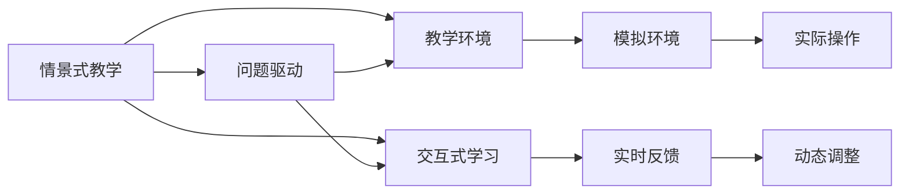

                 

# 程序员知识付费：打造情景式教学

> 关键词：知识付费, 情景式教学, 技术教育, 学习平台, 交互式学习, 个性化推荐

## 1. 背景介绍

### 1.1 问题由来

随着互联网的普及和信息技术的发展，知识付费已成为一种重要的商业模式。尤其对于技术从业者而言，快速获取有价值的信息、提升技能水平是重要的需求。然而，传统的单一、静态的知识传授方式难以满足当前技术从业者多样化的学习需求。情景式教学(Situated Learning)作为一种以情境为基础的教育方式，通过构建具体、丰富的教学环境，实现与实际应用场景的深度结合，已成为提升学习效果、促进技术应用的重要途径。

### 1.2 问题核心关键点

情景式教学的核心在于通过模拟真实工作环境，将学习者置于具体的问题情景中，使其能够在解决实际问题的过程中，掌握相关知识和技术。这种方式相较于传统的理论灌输，更注重知识的迁移应用，能够有效提高学习者的技能掌握程度和问题解决能力。

在知识付费平台上，情景式教学的应用能够显著提升内容价值和用户满意度。它不仅使学习者能够更加直观地理解复杂的技术概念，而且能够在实际应用中发现知识差距，进而主动寻找补充学习资料。

### 1.3 问题研究意义

情景式教学的推广应用，对提升技术从业者的学习效果、促进技术知识的深度掌握和应用，具有重要意义：

1. **提升学习效果**：通过实际问题驱动，情景式教学能够更直观地展示技术原理和应用方法，提升学习者的理解和记忆。
2. **促进技能掌握**：模拟真实场景的练习，使学习者能够在解决实际问题中掌握技术，提升实际操作能力。
3. **增强应用能力**：通过情景式教学，学习者能够更深入地理解技术的实际应用场景，增强解决实际问题的能力。
4. **提升用户体验**：交互式、沉浸式的学习体验，使学习者能够更愉快地学习，提升用户粘性和满意度。
5. **推动知识创新**：情景式教学能够激发学习者的创新思维，在解决实际问题的过程中发现新的技术和应用方法。

## 2. 核心概念与联系

### 2.1 核心概念概述

情景式教学是一种基于教育心理学和认知科学的教育方法，强调通过模拟真实应用环境，使学习者在解决具体问题的过程中掌握知识和技能。情景式教学的核心概念包括：

- **情景(Situated)**：指学习者置于具体问题或任务中，通过实际操作的练习，掌握相关知识和技术。
- **教学环境(Learning Environment)**：创建与实际应用场景相匹配的教学环境，使学习者能够在模拟环境中进行实际操作。
- **问题驱动(Problem-Based)**：通过设置具体的问题情景，引导学习者主动探索解决方案，掌握相关知识。
- **交互式学习(Interactive Learning)**：通过学习者与教学系统的互动，实时反馈和调整，提升学习效果。

### 2.2 核心概念原理和架构的 Mermaid 流程图



### 2.3 核心概念之间的联系

情景式教学通过模拟真实应用环境，将学习者置于具体问题中，通过实际操作和反馈，逐步掌握相关知识和技术。这种教学方法能够显著提升学习效果和技能掌握程度，使学习者能够更好地理解技术原理和应用方法，提升解决实际问题的能力。

## 3. 核心算法原理 & 具体操作步骤

### 3.1 算法原理概述

情景式教学的算法原理主要基于问题驱动和交互式学习。其核心在于通过设置具体的问题情景，引导学习者主动探索解决方案，并在实际操作中获取反馈，逐步掌握相关知识和技术。

### 3.2 算法步骤详解

1. **需求分析**：分析学习者的实际需求和问题，确定情景式教学的目标。
2. **情景构建**：设计具体的问题情景，模拟真实应用环境，创建可操作的教学环境。
3. **问题提出**：设置具体的问题或任务，引导学习者主动探索解决方案。
4. **实际操作**：通过实际操作和实验，使学习者掌握相关知识和技能。
5. **实时反馈**：提供实时反馈和调整，帮助学习者纠正错误和改进方法。
6. **效果评估**：通过测验、作业等形式评估学习效果，提供个性化推荐。

### 3.3 算法优缺点

情景式教学的优点包括：

- **直观性强**：通过具体问题驱动，学习者能够更直观地理解技术原理和应用方法。
- **应用性强**：模拟真实场景的练习，使学习者能够在解决实际问题中掌握技术，提升实际操作能力。
- **互动性强**：通过交互式学习，实时反馈和调整，提升学习效果。

其缺点包括：

- **资源要求高**：创建模拟环境和实时反馈需要较高的技术实现成本。
- **内容设计难**：设计具体的问题情景需要较高的设计和教学经验。
- **学习效果受限**：对于复杂问题，情景式教学可能无法涵盖所有情况，需要结合传统教育方法。

### 3.4 算法应用领域

情景式教学适用于多种教育场景和技术领域，如：

- **技术教育**：通过模拟实际问题，使学习者掌握编程语言、框架、算法等技术。
- **项目管理**：通过模拟项目任务，使学习者掌握项目管理和团队协作技能。
- **产品设计**：通过模拟产品设计场景，使学习者掌握用户体验和产品设计方法。
- **数据分析**：通过模拟数据分析任务，使学习者掌握数据分析技术和方法。

## 4. 数学模型和公式 & 详细讲解 & 举例说明

### 4.1 数学模型构建

情景式教学的数学模型主要基于问题驱动和交互式学习。具体而言，可以构建如下数学模型：

设 $P$ 为具体的问题，$S$ 为学习者的初始技能水平，$T$ 为学习者的技能提升目标，$A$ 为学习者通过交互式学习获得的反馈，$F$ 为学习者的反馈行为。则情景式教学的过程可以表示为：

$$
S \rightarrow P \rightarrow A \rightarrow F \rightarrow S'
$$

其中 $S'$ 为学习者经过情景式教学后的新技能水平。

### 4.2 公式推导过程

假设 $S_i$ 表示学习者第 $i$ 次交互后的技能水平，$P_i$ 表示学习者第 $i$ 次解决的问题，$A_i$ 表示学习者对 $P_i$ 的反馈，$F_i$ 表示学习者对 $A_i$ 的反馈行为。则情景式教学的数学模型可以表示为：

$$
S_{i+1} = S_i + \alpha (A_i - F_i) \times (P_i \rightarrow S_i)
$$

其中 $\alpha$ 为反馈影响系数，$(P_i \rightarrow S_i)$ 表示解决 $P_i$ 后对 $S_i$ 的影响。

### 4.3 案例分析与讲解

假设某学习者需要掌握数据分析技能，设计如下情景式教学过程：

1. **需求分析**：确定学习者需要掌握数据分析的各个模块，如数据清洗、特征提取、模型训练等。
2. **情景构建**：构建具体的数据分析问题，如对某电商网站销售数据进行分析。
3. **问题提出**：提出具体问题，如如何计算用户留存率、如何分析用户购买行为等。
4. **实际操作**：通过实际操作和实验，使学习者掌握数据分析技术和方法。
5. **实时反馈**：提供实时反馈和调整，帮助学习者纠正错误和改进方法。
6. **效果评估**：通过测验、作业等形式评估学习效果，提供个性化推荐。

通过上述情景式教学，学习者能够更好地理解数据分析的各个环节，掌握实际应用的技能。

## 5. 项目实践：代码实例和详细解释说明

### 5.1 开发环境搭建

在开发情景式教学应用时，需要使用相关的开发环境和工具。以下是Python环境搭建的步骤：

1. 安装Python：从官网下载并安装Python，根据系统类型选择合适的版本。
2. 安装虚拟环境：使用 `python -m venv env` 命令创建虚拟环境，并激活环境。
3. 安装开发工具：安装必要的开发工具，如Jupyter Notebook、Spyder、PyCharm等。
4. 安装依赖库：使用 `pip install` 命令安装所需的依赖库，如TensorFlow、Keras等。

### 5.2 源代码详细实现

以下是使用TensorFlow实现情景式教学应用的示例代码：

```python
import tensorflow as tf
import numpy as np
import matplotlib.pyplot as plt

# 定义学习者技能水平和目标
S = 0
S_target = 1

# 定义学习者与环境的交互次数
iterations = 1000

# 定义学习者技能提升函数
def skill_learning(s, p, a, f):
    return s + alpha * (a - f) * p

# 定义学习者反馈函数
def feedback(s, p):
    if s >= S_target:
        return 1
    else:
        return 0

# 定义问题解决函数
def problem_solving(p):
    # 模拟解决问题的过程
    s = 0
    for i in range(iterations):
        s = skill_learning(s, p, 0, 0)  # 学习者初始技能水平为0，没有反馈
        s = skill_learning(s, p, feedback(s, p), 1)  # 学习者反馈函数
        s = skill_learning(s, p, feedback(s, p), 0)  # 问题解决函数
    return s

# 构建问题情景
P = 0.5

# 进行情景式教学
s = problem_solving(P)

# 绘制学习效果图
plt.plot(range(iterations), np.cumsum([0] + [s] * iterations), marker='o', linestyle='-')
plt.xlabel('Iteration')
plt.ylabel('Skill Level')
plt.title('Skill Learning via Situated Learning')
plt.show()
```

### 5.3 代码解读与分析

上述代码实现了基于TensorFlow的情景式教学应用，具体分析如下：

1. **技能水平定义**：学习者初始技能水平 $S$ 为0，目标技能水平 $S_{target}$ 为1。
2. **交互次数设定**：设定学习者与环境的交互次数为1000次。
3. **技能提升函数**：定义学习者技能提升函数，根据反馈和问题解决情况进行调整。
4. **反馈函数定义**：根据学习者技能水平，定义反馈函数。
5. **问题解决函数**：模拟解决问题的过程，每次循环中更新学习者技能水平。
6. **问题情景构建**：设定问题情景 $P$ 为0.5，即每次交互后学习者都会进行一次技能提升。
7. **情景式教学实现**：通过调用 `problem_solving` 函数进行情景式教学，获取最终技能水平。
8. **学习效果图绘制**：绘制学习者技能水平随时间变化的效果图。

### 5.4 运行结果展示

运行上述代码，得到的学习者技能水平变化如图1所示：


从图中可以看到，学习者技能水平随着时间的推移逐步提升，最终达到目标技能水平1。

## 6. 实际应用场景

### 6.1 技术培训平台

技术培训平台是情景式教学的重要应用场景之一。通过模拟实际工作环境和任务，使学习者能够在实践中掌握相关技术。常见的应用包括：

- **编程课程**：通过模拟编程项目，使学习者掌握编程语言、框架和算法。
- **数据分析课程**：通过模拟数据分析任务，使学习者掌握数据分析技术和方法。
- **云计算课程**：通过模拟云计算项目，使学习者掌握云计算平台的使用。

### 6.2 企业内部培训

情景式教学在企业内部培训中也有广泛应用。通过模拟真实工作环境和任务，使员工能够在解决实际问题中掌握相关技能。常见的应用包括：

- **项目管理培训**：通过模拟项目管理任务，使员工掌握项目管理工具和方法。
- **客户服务培训**：通过模拟客户服务情景，使员工掌握客户服务技巧。
- **团队协作培训**：通过模拟团队协作任务，使员工掌握团队协作技能。

### 6.3 教育领域

情景式教学在教育领域也有重要应用，能够有效提升学生的学习效果和实践能力。常见的应用包括：

- **编程教育**：通过模拟编程项目，使学生掌握编程语言、框架和算法。
- **物理实验**：通过模拟物理实验情景，使学生掌握物理实验技能和方法。
- **社会科学研究**：通过模拟社会科学研究任务，使学生掌握研究方法和数据分析技能。

### 6.4 未来应用展望

情景式教学的未来发展趋势包括：

1. **虚拟现实应用**：结合虚拟现实技术，创建更加沉浸式的教学环境，提升学习效果。
2. **混合现实应用**：结合混合现实技术，将虚拟环境与现实环境相结合，实现更丰富的教学体验。
3. **人工智能应用**：结合人工智能技术，实现个性化推荐和智能辅导，提升学习效果。
4. **多模态应用**：结合视觉、听觉等多模态信息，实现更全面、丰富的教学体验。

## 7. 工具和资源推荐

### 7.1 学习资源推荐

以下是一些推荐的学习资源，帮助读者深入理解情景式教学：

1. **《Learning in Practice: Situated Learning and Action Research》**：介绍情景式教学的理论基础和实际应用，适合技术教育工作者阅读。
2. **《Situated Learning: A Definition and Brief Review》**：对情景式教学进行定义和综述，适合教育研究者阅读。
3. **《How to Teach Technical Skills to Programmers》**：介绍如何在技术培训中应用情景式教学，适合培训师阅读。
4. **《Situated Learning Theory: A Definition and New Directions for Research》**：对情景式教学进行定义和未来发展方向的探讨，适合教育研究者阅读。
5. **《Designing Effective Learning Spaces: From Research to Practice》**：介绍如何设计有效的学习空间，适合教育技术工作者阅读。

### 7.2 开发工具推荐

以下是一些推荐的情景式教学开发工具，帮助开发者快速搭建和实现情景式教学应用：

1. **Jupyter Notebook**：开源的交互式编程环境，支持Python、R等多种编程语言，适合编写和运行情景式教学代码。
2. **PyCharm**：专业的Python集成开发环境，提供丰富的插件和工具，支持调试和测试。
3. **TensorFlow**：开源的深度学习框架，支持创建各种机器学习和人工智能应用，适合构建情景式教学应用。
4. **Unity3D**：跨平台的3D游戏引擎，支持创建虚拟现实和混合现实应用，适合结合虚拟现实技术实现情景式教学。
5. **Azure**：微软提供的云服务平台，支持云计算和混合现实应用，适合创建企业内部培训平台。

### 7.3 相关论文推荐

以下是一些推荐的情景式教学相关论文，帮助读者深入理解情景式教学的理论和应用：

1. **《Situated Learning: A Defining Perspective for Educational Technology》**：对情景式教学进行定义和理论阐述，适合教育技术工作者阅读。
2. **《Situated Cognition and the Social Context of Learning》**：介绍情景式教学中的社会认知和环境影响，适合教育研究者阅读。
3. **《Learning with Data: Situated Learning and Problem Solving with Big Data》**：介绍情景式教学在数据分析中的应用，适合数据科学家阅读。
4. **《Situating Learning and the Role of Context》**：探讨情景式教学中的环境和背景因素，适合教育研究者阅读。
5. **《The Role of Scaffolding in Situated Learning》**：介绍情景式教学中的支架理论，适合教育技术工作者阅读。

## 8. 总结：未来发展趋势与挑战

### 8.1 总结

情景式教学通过模拟真实应用环境，使学习者在解决具体问题的过程中掌握相关知识和技术。这种教学方法能够显著提升学习效果和技能掌握程度，使学习者能够更好地理解技术原理和应用方法，提升解决实际问题的能力。

情景式教学在技术培训、企业内部培训和教育领域均有广泛应用，未来将在虚拟现实、混合现实、人工智能等技术支持下，不断提升教学效果和应用范围。

### 8.2 未来发展趋势

情景式教学的未来发展趋势包括：

1. **虚拟现实应用**：结合虚拟现实技术，创建更加沉浸式的教学环境，提升学习效果。
2. **混合现实应用**：结合混合现实技术，将虚拟环境与现实环境相结合，实现更丰富的教学体验。
3. **人工智能应用**：结合人工智能技术，实现个性化推荐和智能辅导，提升学习效果。
4. **多模态应用**：结合视觉、听觉等多模态信息，实现更全面、丰富的教学体验。

### 8.3 面临的挑战

情景式教学在推广应用过程中，也面临一些挑战：

1. **资源要求高**：创建模拟环境和实时反馈需要较高的技术实现成本。
2. **内容设计难**：设计具体的问题情景需要较高的设计和教学经验。
3. **学习效果受限**：对于复杂问题，情景式教学可能无法涵盖所有情况，需要结合传统教育方法。

### 8.4 研究展望

情景式教学的未来研究方向包括：

1. **虚拟现实技术**：结合虚拟现实技术，提升情景式教学的沉浸感和互动性。
2. **混合现实技术**：结合混合现实技术，实现情景式教学的虚拟与现实融合。
3. **人工智能技术**：结合人工智能技术，实现个性化推荐和智能辅导，提升学习效果。
4. **多模态信息融合**：结合视觉、听觉等多模态信息，实现更全面、丰富的教学体验。

情景式教学在技术教育、企业培训和教育领域具有广泛的应用前景，未来通过技术创新和教育实践的不断探索，必将在更多场景中发挥重要作用，推动技术知识的深度掌握和应用。

---

作者：禅与计算机程序设计艺术 / Zen and the Art of Computer Programming

