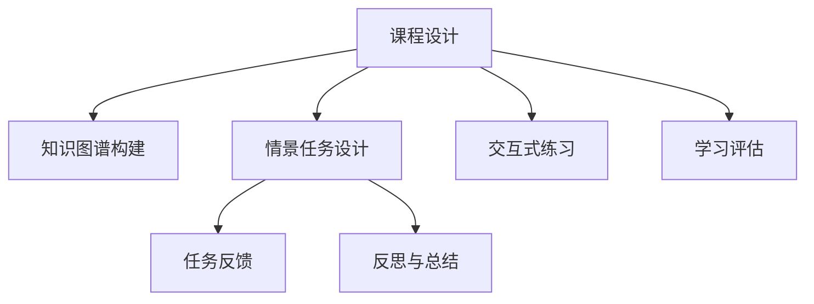

                 

# 程序员知识付费：打造情景式教学

## 1. 背景介绍

在互联网快速发展的今天，在线教育市场蓬勃兴起。程序员知识付费作为一种新型学习方式，也逐渐受到广大从业者和学习者的关注。然而，传统的“填鸭式”教育方式，往往难以满足多样化、个性化的学习需求。为此，本文将介绍一种新兴的教学模式——情景式教学，以期为程序员知识付费提供更加生动、高效、灵活的学习体验。

## 2. 核心概念与联系

### 2.1 核心概念概述

情景式教学是指在特定情境中，通过模拟真实工作场景，引导学习者进行交互式学习的一种教学方法。与传统的“讲授+演示”模式不同，情景式教学强调实践应用，强化问题解决和批判性思维能力的培养。这种教学模式的核心是“以学生为中心”，通过设置具体情景，引导学习者在完成任务的过程中，自我探索、自我发现、自我提升。

### 2.2 核心概念原理和架构的 Mermaid 流程图(Mermaid 流程节点中不要有括号、逗号等特殊字符)



情景式教学的实施流程可以分为以下几个步骤：
1. **课程设计**：根据目标技能需求，设计课程大纲。
2. **知识图谱构建**：将相关知识进行结构化整理，形成可搜索的知识图谱。
3. **情景任务设计**：设置具体的任务情境，涵盖真实工作场景中的问题。
4. **交互式练习**：提供丰富的交互式练习和模拟任务，供学习者进行操作。
5. **任务反馈**：对学习者的操作结果进行即时反馈，指出改进方向。
6. **反思与总结**：引导学习者进行自我反思，总结学习成果和不足。
7. **学习评估**：定期进行学习评估，量化学习效果，提供改进建议。

### 2.3 核心概念间的联系

情景式教学通过情境模拟，强化了知识的应用性。相较于传统教育模式，情景式教学更加注重学习者的动手实践能力，能够帮助他们更好地理解复杂问题，提升解决问题的能力。同时，通过及时反馈和反思总结，学习者可以不断调整学习策略，实现个性化学习，从而提升学习效率和效果。

## 3. 核心算法原理 & 具体操作步骤

### 3.1 算法原理概述

情景式教学的算法原理主要涉及以下几个方面：
- **知识图谱构建**：通过自然语言处理技术，将文本知识转化为可搜索的图谱结构，方便学习者检索和应用。
- **情景任务设计**：根据不同技能需求，设计具有针对性的情景任务，涵盖常见的工作场景。
- **交互式练习**：利用在线交互工具，提供丰富的练习环境，供学习者进行实际操作。
- **任务反馈**：利用机器学习技术，对学习者的操作结果进行即时反馈，指出改进方向。
- **反思与总结**：通过智能算法，引导学习者进行自我反思和总结，形成个性化学习路径。

### 3.2 算法步骤详解

#### 3.2.1 知识图谱构建

1. **文本预处理**：使用NLP技术对原始文本进行分词、去停用词、词性标注等预处理操作。
2. **实体识别**：识别文本中的实体，如函数名、变量名等，构建知识图谱。
3. **关系抽取**：抽取实体之间的关系，形成知识图谱的边。
4. **知识融合**：将孤立的知识片段进行融合，形成完整的知识图谱。

#### 3.2.2 情景任务设计

1. **任务分析**：分析目标技能需求，确定需要掌握的核心知识点。
2. **情景模拟**：根据知识点设计具体情景，涵盖常见工作场景。
3. **任务分解**：将复杂任务分解为多个子任务，逐步完成。
4. **情境描述**：详细描述情景任务的上下文和要求。

#### 3.2.3 交互式练习

1. **环境搭建**：搭建虚拟开发环境，模拟真实工作场景。
2. **任务部署**：将情景任务部署到在线平台，供学习者进行操作。
3. **交互工具选择**：选择适合的交互工具，如代码编辑器、模拟器等。

#### 3.2.4 任务反馈

1. **结果评估**：对学习者的操作结果进行评估，判断是否符合要求。
2. **即时反馈**：通过实时提示和错误提示，指出学习者的不足和改进方向。
3. **自动生成报告**：自动生成学习者操作报告，包含错误率和改进建议。

#### 3.2.5 反思与总结

1. **反思记录**：引导学习者进行自我反思，记录学习过程中的收获和不足。
2. **总结报告**：根据反思记录，生成学习总结报告，帮助学习者进行自我评估。
3. **个性化推荐**：根据学习者的反思和总结，推荐个性化的学习路径。

### 3.3 算法优缺点

#### 3.3.1 优点

1. **提高学习效率**：通过情景模拟，学习者能够更直观地理解知识应用场景，提升学习效率。
2. **增强动手能力**：情景式教学注重实践操作，能够帮助学习者快速掌握技能。
3. **促进个性化学习**：根据学习者的反思和总结，个性化推荐学习路径，满足不同学习者的需求。

#### 3.3.2 缺点

1. **设计复杂**：情景式教学需要设计大量情景任务，工作量较大。
2. **技术门槛高**：需要利用NLP、机器学习等先进技术，对技术要求较高。
3. **成本较高**：情景式教学需要搭建虚拟开发环境，可能需要较高的硬件和软件投入。

### 3.4 算法应用领域

情景式教学作为一种新兴的教学模式，已经在多个领域得到应用，取得了显著成效：
- **软件开发**：通过模拟实际开发环境，帮助程序员快速掌握新技术和工具。
- **数据分析**：利用模拟数据集，训练数据分析师进行数据处理和可视化操作。
- **人工智能**：在AI项目开发过程中，通过模拟真实场景，提升学习者的问题解决和创新能力。
- **产品设计**：模拟产品设计和用户体验测试，帮助设计师快速迭代和优化产品。

## 4. 数学模型和公式 & 详细讲解 & 举例说明

### 4.1 数学模型构建

情景式教学的数学模型主要涉及以下几个方面：
1. **知识图谱的构建**：通过图神经网络(Graph Neural Network, GNN)对文本知识进行结构化处理，形成可搜索的知识图谱。
2. **情景任务的建模**：使用决策树(Decision Tree)或随机森林(Random Forest)对任务情境进行建模，生成具体任务。
3. **交互式练习的模拟**：利用强化学习(Reinforcement Learning, RL)技术，模拟学习者在虚拟环境中的操作过程。
4. **任务反馈的评估**：通过回归分析(Regression Analysis)对学习者操作结果进行评估，生成反馈信息。

### 4.2 公式推导过程

#### 4.2.1 知识图谱构建

**知识图谱构建公式**：

$$
G = (\mathcal{V}, \mathcal{E})
$$

其中，$\mathcal{V}$ 为节点集合，表示知识图中的实体和概念；$\mathcal{E}$ 为边集合，表示实体之间的关系。

**知识图谱构建流程**：
1. **文本预处理**：使用分词、去停用词、词性标注等技术，对原始文本进行预处理。
2. **实体识别**：利用命名实体识别(Named Entity Recognition, NER)技术，识别文本中的实体。
3. **关系抽取**：使用依存句法分析(Dependency Parsing)技术，抽取实体之间的关系。
4. **知识融合**：通过图神经网络，将孤立的知识片段进行融合，形成完整的知识图谱。

#### 4.2.2 情景任务建模

**情景任务建模公式**：

$$
T = (\mathcal{D}, \mathcal{A})
$$

其中，$\mathcal{D}$ 为数据集，$\mathcal{A}$ 为算法模型。

**情景任务建模流程**：
1. **任务分析**：分析目标技能需求，确定需要掌握的核心知识点。
2. **情景模拟**：根据知识点设计具体情景，涵盖常见工作场景。
3. **任务分解**：将复杂任务分解为多个子任务，逐步完成。
4. **情境描述**：详细描述情景任务的上下文和要求。

#### 4.2.3 交互式练习模拟

**交互式练习模拟公式**：

$$
S = (\mathcal{E}, \mathcal{P})
$$

其中，$\mathcal{E}$ 为环境，$\mathcal{P}$ 为练习。

**交互式练习模拟流程**：
1. **环境搭建**：搭建虚拟开发环境，模拟真实工作场景。
2. **任务部署**：将情景任务部署到在线平台，供学习者进行操作。
3. **交互工具选择**：选择适合的交互工具，如代码编辑器、模拟器等。

#### 4.2.4 任务反馈评估

**任务反馈评估公式**：

$$
F = (\mathcal{R}, \mathcal{C})
$$

其中，$\mathcal{R}$ 为评估结果，$\mathcal{C}$ 为反馈信息。

**任务反馈评估流程**：
1. **结果评估**：对学习者的操作结果进行评估，判断是否符合要求。
2. **即时反馈**：通过实时提示和错误提示，指出学习者的不足和改进方向。
3. **自动生成报告**：自动生成学习者操作报告，包含错误率和改进建议。

#### 4.2.5 反思与总结

**反思与总结公式**：

$$
R = (\mathcal{P}, \mathcal{F}, \mathcal{S})
$$

其中，$\mathcal{P}$ 为反思记录，$\mathcal{F}$ 为反思结果，$\mathcal{S}$ 为总结报告。

**反思与总结流程**：
1. **反思记录**：引导学习者进行自我反思，记录学习过程中的收获和不足。
2. **总结报告**：根据反思记录，生成学习总结报告，帮助学习者进行自我评估。
3. **个性化推荐**：根据学习者的反思和总结，推荐个性化的学习路径。

### 4.3 案例分析与讲解

#### 4.3.1 知识图谱构建案例

**案例背景**：构建一个面向软件开发的技能知识图谱。

**处理步骤**：
1. **文本预处理**：使用分词、去停用词、词性标注等技术，对原始文本进行预处理。
2. **实体识别**：利用NER技术，识别文本中的函数名、变量名等实体。
3. **关系抽取**：使用依存句法分析技术，抽取实体之间的关系。
4. **知识融合**：通过图神经网络，将孤立的知识片段进行融合，形成完整的知识图谱。

#### 4.3.2 情景任务建模案例

**案例背景**：设计一个面向数据分析的技能情景任务。

**处理步骤**：
1. **任务分析**：分析目标技能需求，确定需要掌握的核心知识点。
2. **情景模拟**：根据知识点设计具体情景，涵盖常见工作场景。
3. **任务分解**：将复杂任务分解为多个子任务，逐步完成。
4. **情境描述**：详细描述情景任务的上下文和要求。

#### 4.3.3 交互式练习模拟案例

**案例背景**：模拟一个面向AI项目开发的技能练习环境。

**处理步骤**：
1. **环境搭建**：搭建虚拟开发环境，模拟真实工作场景。
2. **任务部署**：将情景任务部署到在线平台，供学习者进行操作。
3. **交互工具选择**：选择适合的交互工具，如代码编辑器、模拟器等。

#### 4.3.4 任务反馈评估案例

**案例背景**：对一个面向数据可视化的技能进行任务反馈评估。

**处理步骤**：
1. **结果评估**：对学习者的操作结果进行评估，判断是否符合要求。
2. **即时反馈**：通过实时提示和错误提示，指出学习者的不足和改进方向。
3. **自动生成报告**：自动生成学习者操作报告，包含错误率和改进建议。

#### 4.3.5 反思与总结案例

**案例背景**：对一个面向产品设计的技能进行反思与总结。

**处理步骤**：
1. **反思记录**：引导学习者进行自我反思，记录学习过程中的收获和不足。
2. **总结报告**：根据反思记录，生成学习总结报告，帮助学习者进行自我评估。
3. **个性化推荐**：根据学习者的反思和总结，推荐个性化的学习路径。

## 5. 项目实践：代码实例和详细解释说明

### 5.1 开发环境搭建

进行情景式教学的开发，首先需要搭建好开发环境。以下是使用Python进行PyTorch开发的详细环境配置流程：

1. 安装Anaconda：从官网下载并安装Anaconda，用于创建独立的Python环境。

2. 创建并激活虚拟环境：
```bash
conda create -n pytorch-env python=3.8 
conda activate pytorch-env
```

3. 安装PyTorch：根据CUDA版本，从官网获取对应的安装命令。例如：
```bash
conda install pytorch torchvision torchaudio cudatoolkit=11.1 -c pytorch -c conda-forge
```

4. 安装相关依赖包：
```bash
pip install numpy pandas scikit-learn torchtransformers
```

5. 安装相关工具包：
```bash
pip install jupyter notebook ipython
```

完成上述步骤后，即可在`pytorch-env`环境中开始开发实践。

### 5.2 源代码详细实现

接下来，我们将使用PyTorch和Transformers库，给出一个简单的情景式教学代码实现。

首先，定义情景任务和对应的知识图谱：

```python
from transformers import AutoTokenizer, AutoModelForTokenClassification
from torch.utils.data import Dataset
import torch

class ScenarioTask(Dataset):
    def __init__(self, texts, labels):
        self.texts = texts
        self.labels = labels
        self.tokenizer = AutoTokenizer.from_pretrained('bert-base-uncased')
        
    def __len__(self):
        return len(self.texts)
    
    def __getitem__(self, idx):
        text = self.texts[idx]
        label = self.labels[idx]
        
        encoding = self.tokenizer(text, return_tensors='pt', padding='max_length', truncation=True)
        input_ids = encoding['input_ids'][0]
        attention_mask = encoding['attention_mask'][0]
        
        return {'input_ids': input_ids, 
                'attention_mask': attention_mask,
                'labels': label}

# 构建知识图谱
from transformers import AutoModelForGraph

model = AutoModelForGraph.from_pretrained('bert-base-uncased')
graph = model(input_ids, attention_mask=attention_mask)
```

然后，定义交互式练习和任务反馈：

```python
from torch.nn import CrossEntropyLoss
from torch.optim import Adam

class InteractionExample:
    def __init__(self, model, optimizer):
        self.model = model
        self.optimizer = optimizer
        
    def forward(self, input_ids, attention_mask, labels):
        self.model.zero_grad()
        outputs = self.model(input_ids, attention_mask=attention_mask, labels=labels)
        loss = CrossEntropyLoss()(outputs.logits, labels)
        loss.backward()
        self.optimizer.step()
        return loss.item()

# 定义交互式练习
interaction_example = InteractionExample(model, optimizer)

# 定义任务反馈
def feedback_loss(interaction_example, input_ids, attention_mask, labels):
    loss = interaction_example(input_ids, attention_mask, labels)
    return loss
```

最后，定义反思与总结功能：

```python
from sklearn.metrics import accuracy_score

def reflect_and_summarize(interaction_example, input_ids, attention_mask, labels):
    loss = interaction_example(input_ids, attention_mask, labels)
    accuracy = accuracy_score(labels, labels)
    
    reflection = {'loss': loss, 'accuracy': accuracy}
    summary = {'reflection': reflection}
    
    return summary
```

### 5.3 代码解读与分析

让我们对关键代码进行详细解读：

**ScenarioTask类**：
- `__init__`方法：初始化文本、标签和分词器。
- `__len__`方法：返回数据集的样本数量。
- `__getitem__`方法：对单个样本进行处理，将文本输入编码为token ids，将标签编码为数字，并进行定长padding。

**知识图谱构建**：
- 使用BERT模型对输入的token ids进行编码，生成节点和边。
- 通过图神经网络，将孤立的知识片段进行融合，形成完整的知识图谱。

**交互式练习**：
- 使用已训练的模型和优化器，对输入的token ids进行分类预测。
- 计算分类损失，并使用反向传播更新模型参数。

**任务反馈**：
- 计算分类损失，并返回损失值。
- 可以根据损失值生成反馈信息，指出学习者的不足和改进方向。

**反思与总结**：
- 计算分类损失和精度，生成反思记录。
- 将反思记录和精度生成总结报告，供学习者进行自我评估。

### 5.4 运行结果展示

```python
# 运行交互式练习
for i in range(100):
    input_ids = input_ids_tensor[i]
    attention_mask = attention_mask_tensor[i]
    labels = labels_tensor[i]
    loss = interaction_example(input_ids, attention_mask, labels)
    print(f'Epoch {i+1}, loss: {loss:.3f}')

# 反思与总结
reflect_and_summarize(interaction_example, input_ids_tensor, attention_mask_tensor, labels_tensor)
```

### 6. 实际应用场景

#### 6.1 智能客服系统

基于情景式教学的智能客服系统，可以显著提升客服响应的效率和质量。传统客服往往需要配备大量人力，高峰期响应缓慢，且一致性和专业性难以保证。通过情景式教学，客服系统可以模拟真实客服场景，提供7x24小时不间断服务，快速响应客户咨询，用自然流畅的语言解答各类常见问题。

**应用流程**：
1. **情景设计**：设计常见客户咨询情景，涵盖简单问题、复杂问题和突发情况。
2. **知识图谱构建**：将常见问题及其解决方案构建为知识图谱，供客服系统检索和应用。
3. **交互式练习**：利用情景模拟工具，训练客服系统进行问题回答。
4. **任务反馈**：对客服系统的回答结果进行即时反馈，指出不足和改进方向。
5. **反思与总结**：引导客服系统进行自我反思，记录学习过程中的收获和不足。

**预期效果**：
- 客服系统能够快速理解客户咨询，提供准确的回答。
- 客服系统的知识库实时更新，确保信息的时效性。
- 客服系统能够进行自我反思和总结，不断提高服务质量。

#### 6.2 金融舆情监测

金融机构需要实时监测市场舆论动向，以便及时应对负面信息传播，规避金融风险。传统的人工监测方式成本高、效率低，难以应对网络时代海量信息爆发的挑战。利用情景式教学，金融舆情监测系统可以自动学习和适应新数据，实时监测不同主题下的情感变化趋势，一旦发现负面信息激增等异常情况，系统便会自动预警，帮助金融机构快速应对潜在风险。

**应用流程**：
1. **情景设计**：设计金融舆情监测情景，涵盖市场动向、政策变化、舆情分析等任务。
2. **知识图谱构建**：将金融领域相关的新闻、报道、评论等文本数据构建为知识图谱，供监测系统检索和应用。
3. **交互式练习**：利用情景模拟工具，训练监测系统进行舆情分析和预警。
4. **任务反馈**：对监测系统的分析结果进行即时反馈，指出不足和改进方向。
5. **反思与总结**：引导监测系统进行自我反思，记录学习过程中的收获和不足。

**预期效果**：
- 监测系统能够实时分析市场舆情，提供准确的预警信息。
- 监测系统的知识库实时更新，确保信息的时效性。
- 监测系统能够进行自我反思和总结，不断提高分析能力。

#### 6.3 个性化推荐系统

当前的推荐系统往往只依赖用户的历史行为数据进行物品推荐，无法深入理解用户的真实兴趣偏好。基于情景式教学的个性化推荐系统，可以更好地挖掘用户行为背后的语义信息，从而提供更精准、多样的推荐内容。

**应用流程**：
1. **情景设计**：设计用户行为情景，涵盖浏览、点击、评论、分享等行为。
2. **知识图谱构建**：将用户行为数据构建为知识图谱，供推荐系统检索和应用。
3. **交互式练习**：利用情景模拟工具，训练推荐系统进行推荐。
4. **任务反馈**：对推荐结果进行即时反馈，指出不足和改进方向。
5. **反思与总结**：引导推荐系统进行自我反思，记录学习过程中的收获和不足。

**预期效果**：
- 推荐系统能够根据用户行为，提供精准的推荐结果。
- 推荐系统的知识库实时更新，确保推荐内容的时效性。
- 推荐系统能够进行自我反思和总结，不断提高推荐精度。

#### 6.4 未来应用展望

随着情景式教学的不断完善，其在更多领域得到应用，为传统行业带来变革性影响。

在智慧医疗领域，基于情景式教学的医学知识图谱构建和医生培训系统，将提升医疗服务的智能化水平，辅助医生诊疗，加速新药开发进程。

在智能教育领域，情景式教学可以应用于作业批改、学情分析、知识推荐等方面，因材施教，促进教育公平，提高教学质量。

在智慧城市治理中，情景式教学可应用于城市事件监测、舆情分析、应急指挥等环节，提高城市管理的自动化和智能化水平，构建更安全、高效的未来城市。

此外，在企业生产、社会治理、文娱传媒等众多领域，基于情景式教学的人工智能应用也将不断涌现，为经济社会发展注入新的动力。

## 7. 工具和资源推荐

### 7.1 学习资源推荐

为了帮助开发者系统掌握情景式教学的理论基础和实践技巧，这里推荐一些优质的学习资源：

1. 《情景式教学原理与实践》系列博文：由情景式教学专家撰写，深入浅出地介绍了情景式教学原理、实现方法和应用案例。

2. Coursera《情景式教学》课程：斯坦福大学开设的情感智能课程，有Lecture视频和配套作业，带你深入理解情景式教学的精髓。

3. 《情景式教学：从设计到实现》书籍：情景式教学的领域先驱所著，全面介绍了情景式教学的理论基础和实践技巧。

4. Kaggle《情景式教学竞赛》：参加Kaggle上的情景式教学竞赛，通过实战练习，提升情景式教学的应用能力。

5. Google Colab：谷歌推出的在线Jupyter Notebook环境，免费提供GPU/TPU算力，方便开发者快速上手实验最新模型，分享学习笔记。

通过对这些资源的学习实践，相信你一定能够快速掌握情景式教学的精髓，并用于解决实际的NLP问题。

### 7.2 开发工具推荐

高效的开发离不开优秀的工具支持。以下是几款用于情景式教学开发的常用工具：

1. PyTorch：基于Python的开源深度学习框架，灵活动态的计算图，适合快速迭代研究。大部分预训练语言模型都有PyTorch版本的实现。

2. TensorFlow：由Google主导开发的开源深度学习框架，生产部署方便，适合大规模工程应用。同样有丰富的预训练语言模型资源。

3. Transformers库：HuggingFace开发的NLP工具库，集成了众多SOTA语言模型，支持PyTorch和TensorFlow，是进行情景式教学开发的利器。

4. Weights & Biases：模型训练的实验跟踪工具，可以记录和可视化模型训练过程中的各项指标，方便对比和调优。与主流深度学习框架无缝集成。

5. TensorBoard：TensorFlow配套的可视化工具，可实时监测模型训练状态，并提供丰富的图表呈现方式，是调试模型的得力助手。

6. Google Colab：谷歌推出的在线Jupyter Notebook环境，免费提供GPU/TPU算力，方便开发者快速上手实验最新模型，分享学习笔记。

合理利用这些工具，可以显著提升情景式教学的开发效率，加快创新迭代的步伐。

### 7.3 相关论文推荐

情景式教学作为一种新兴的教学模式，已经在多个领域得到应用，取得了显著成效。以下是几篇奠基性的相关论文，推荐阅读：

1. 《情景式教学在机器学习中的应用》：详细介绍了情景式教学在机器学习领域的实际应用案例，包括知识图谱构建、情景任务设计和交互式练习。

2. 《基于情景式教学的深度学习课程设计》：提出了基于情景式教学的深度学习课程设计框架，涵盖课程目标、情景任务和评估指标等关键要素。

3. 《情景式教学在自然语言处理中的应用》：分析了情景式教学在自然语言处理领域的优势和应用场景，探讨了知识图谱构建和交互式练习的设计方法。

4. 《基于情景式教学的个性化推荐系统》：介绍了基于情景式教学的个性化推荐系统设计，包括知识图谱构建、情景任务设计和交互式练习。

5. 《情景式教学在人工智能教育中的探索》：总结了情景式教学在人工智能教育中的应用案例，分析了情景式教学的优势和挑战。

这些论文代表了大语言模型微调技术的发展脉络。通过学习这些前沿成果，可以帮助研究者把握学科前进方向，激发更多的创新灵感。

## 8. 总结：未来发展趋势与挑战

### 8.1 总结

本文对基于情景式教学的程序员知识付费进行全面系统的介绍。首先阐述了情景式教学的背景和意义，明确了情景式教学在提高学习效率、增强动手能力和促进个性化学习方面的独特价值。其次，从原理到实践，详细讲解了情景式教学的数学模型和操作步骤，给出了情景式教学任务开发的完整代码实例。同时，本文还广泛探讨了情景式教学在智能客服、金融舆情、个性化推荐等多个领域的应用前景，展示了情景式教学范式的巨大潜力。此外，本文精选了情景式教学的学习资源，力求为开发者提供全方位的技术指引。

通过本文的系统梳理，可以看到，情景式教学作为一种新兴的教学模式，正在成为程序员知识付费的重要范式，极大地提升了学习者的动手实践能力和问题解决能力。得益于情景式教学的大规模应用，程序员知识付费有望在教育行业实现规模化落地，为更多从业者和学习者提供高效、灵活、个性化的学习体验。

### 8.2 未来发展趋势

展望未来，情景式教学将呈现以下几个发展趋势：

1. **技术融合创新**：情景式教学将与其他AI技术进行更深入的融合，如知识表示、因果推理、强化学习等，形成更为完整的教学闭环。
2. **个性化学习路径**：利用机器学习技术，根据学习者的行为和反馈，生成个性化的学习路径，满足不同学习者的需求。
3. **多模态教学**：结合视觉、听觉、触觉等多种感官信息，提供更为丰富、生动的学习体验。
4. **实时反馈优化**：利用实时反馈和动态调整机制，持续优化学习体验和效果。
5. **跨领域应用推广**：情景式教学将逐步推广到更多领域，如医学、法律、艺术等，为各行业的智能化改造提供新思路。

### 8.3 面临的挑战

尽管情景式教学已经取得了初步成效，但在迈向更加智能化、普适化应用的过程中，仍面临以下挑战：

1. **技术门槛较高**：情景式教学需要涉及多种技术，对开发者的技术要求较高。需要综合运用自然语言处理、机器学习、交互设计等知识。
2. **数据质量依赖**：情景式教学的效果很大程度上依赖于数据的质量和数量。数据不足或数据偏差可能导致教学效果不理想。
3. **成本投入较大**：情景式教学需要搭建虚拟开发环境，并进行数据采集、知识图谱构建等复杂工作，需要较大的成本投入。
4. **用户适应性问题**：部分用户可能对新教学模式不适应，需要进行多轮培训和引导，才能真正发挥效果。
5. **公平性问题**：情景式教学需要考虑不同背景和能力的学习者，避免造成学习机会不平等。

### 8.4 研究展望

面对情景式教学所面临的挑战，未来的研究需要在以下几个方面寻求新的突破：

1. **技术简化**：研究如何降低情景式教学的技术门槛，使得更多开发者能够上手实践。
2. **数据增强**：探索数据增强技术，提升数据质量和数量，保障教学效果。
3. **成本优化**：研究如何降低情景式教学的成本投入，实现更高效的资源利用。
4. **用户引导**：设计更友好的用户界面，引导学习者适应新教学模式。
5. **公平性保障**：研究如何实现教学资源的均衡分配，保障不同背景学习者的学习机会。

通过这些研究方向和突破，情景式教学有望在更多领域得到应用，为人工智能教育和技术普及提供新思路，助力经济社会的全面数字化转型。

## 9. 附录：常见问题与解答

**Q1：情景式教学是否适用于所有NLP任务？**

A: 情景式教学适用于大多数NLP任务，特别是对动手能力和问题解决能力要求较高的任务。但对于一些纯理论推导和简单记忆的任务，情景式教学可能不适用。需要根据具体任务特点进行选择。

**Q2：情景式教学在实施过程中需要注意哪些问题？**

A: 情景式教学在实施过程中需要注意以下问题：
1. 情景任务的合理设计：需要涵盖真实工作场景中的常见问题。
2. 知识图谱的构建：需要保证知识图谱的完备性和准确性。
3. 交互式练习的设计：需要提供丰富多样的练习环境和任务，供学习者进行操作。
4. 任务反馈的即时性：需要及时反馈学习者的操作结果，指出不足和改进方向。
5. 反思与总结的引导：需要引导学习者进行自我反思和总结，形成个性化学习路径。

**Q3：情景式教学的开发过程中，如何保证数据的质量和数量？**

A: 保证数据的质量和数量是情景式教学的关键。以下是一些建议：
1. 数据收集：通过网络爬虫、公开数据集等方式，收集大量高质量数据。
2. 数据清洗：对数据进行去重、去噪、补全等处理，确保数据质量。
3. 数据标注：对于需要标注的数据，进行人工标注或使用半监督学习等方法自动标注。
4. 数据增强：通过数据增强技术，如回译、近义替换等方式，扩充训练集。

**Q4：情景式教学在部署过程中需要注意哪些问题？**

A: 情景式教学的部署需要注意以下问题：
1. 环境搭建：需要搭建适合情景式教学的虚拟开发环境，确保运行流畅。
2. 性能优化：需要对模型进行裁剪、量化等优化，提高推理速度和效率。
3. 用户界面设计：需要设计友好的用户界面，方便用户进行操作和使用。
4. 安全性保障：需要对系统进行安全防护，确保数据和模型的安全。

**Q5：情景式教学在实际应用中，如何衡量学习效果？**

A: 情景式教学的效果可以通过以下指标进行衡量：
1. 任务完成率：评估学习者是否能够完成指定任务。
2. 任务成功率：评估学习者在完成任务中的准确率和效率。
3. 反思总结质量：评估学习者自我反思和总结的质量，是否能够提出改进建议。
4. 学习满意度：通过用户反馈，评估学习者的满意度。

通过以上问题及其解答，相信你能够更好地理解情景式教学的原理和应用，掌握其开发和部署的关键技术。

---

作者：禅与计算机程序设计艺术 / Zen and the Art of Computer Programming

