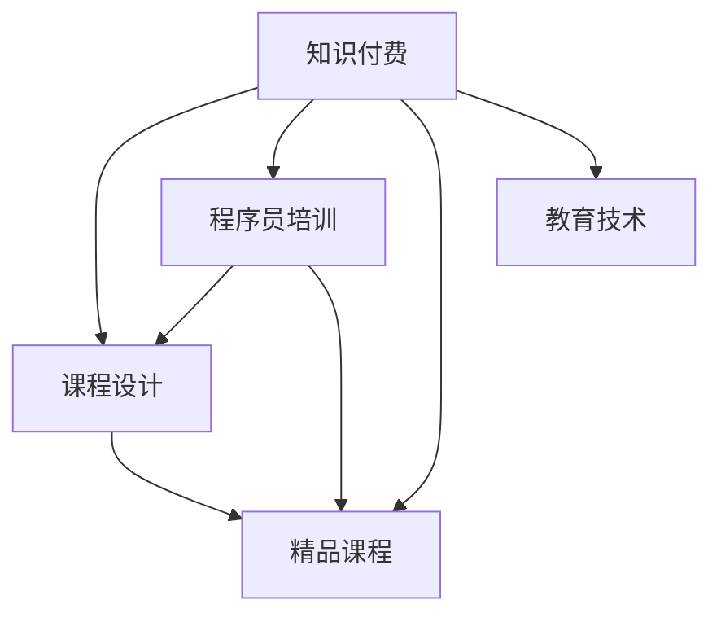

                 

# 程序员知识付费：打造精品课程

> 关键词：知识付费, 程序员培训, 课程设计, 精品课程, 教育技术

## 1. 背景介绍

### 1.1 问题由来
随着信息时代的发展，知识的获取和传播方式也在不断演变。过去，知识主要通过书籍、讲座、论文等传统方式传播，而如今，互联网使得知识付费成为一种新的趋势。程序员作为科技行业的中坚力量，面临着快速的技术迭代和知识更新，如何高效、系统地获取和掌握知识，成为了一个重要问题。

在这样的大背景下，知识付费平台应运而生。程序员可以通过订阅各类课程，系统性地学习新技术、新工具和新方法，从而保持自身竞争力的提升。然而，尽管市场上有许多知识付费平台，高质量、系统化、实用的程序员课程仍然相对稀缺。这不仅影响了程序员的学习效果，也限制了知识付费市场的发展。

### 1.2 问题核心关键点
本文将从课程设计、技术实现、商业模式三个角度，全面解析如何打造高质量的程序员知识付费课程，帮助更多程序员高效学习、系统掌握知识，提升自身竞争力。

## 2. 核心概念与联系

### 2.1 核心概念概述

为了更好地理解如何打造程序员知识付费课程，我们先介绍一些核心概念：

- **知识付费**：用户为获取特定知识而支付费用的模式。知识付费打破了传统教育的边界，使得知识传播更加灵活高效。
- **课程设计**：根据课程目标和用户需求，设计课程内容和结构的过程。好的课程设计能够提升学习效果，增强用户体验。
- **程序员培训**：针对程序员的技能提升和知识更新，提供系统的培训课程。
- **精品课程**：经过精心设计和打磨，高质量、系统化的课程产品。
- **教育技术**：利用信息技术手段，优化教育过程，提升教育效果。

这些概念之间的关系可以用以下Mermaid流程图表示：



这个流程图展示了知识付费、课程设计、程序员培训、精品课程和教育技术之间的联系：知识付费和教育技术的结合，为程序员培训提供了优质资源，而经过精心设计的精品课程，则是教育技术的最终体现。

## 3. 核心算法原理 & 具体操作步骤
### 3.1 算法原理概述

打造精品课程的关键在于设计良好的课程结构和内容，同时采用合适的教育技术手段，提升学习效果。

**核心算法原理**：
1. **课程结构设计**：确定课程的目标和阶段，设计合理的课程结构，包括基础知识、进阶内容、实战项目等。
2. **内容选择与优化**：精选高质量的教学内容和资料，进行适度的加工和优化，确保内容精准、有效。
3. **教育技术应用**：采用在线互动、视频讲解、仿真实验等技术手段，提升学习体验和效果。

**操作步骤**：
1. **需求分析**：明确课程目标和用户需求，进行市场调研和用户画像分析。
2. **内容构建**：设计课程框架，确定知识点和教学方法，制作教学材料。
3. **技术实现**：选择适合的开发平台和技术工具，进行课程的开发和测试。
4. **上线推广**：上线精品课程，通过营销策略进行推广，吸引用户订阅。
5. **反馈迭代**：收集用户反馈，进行课程更新和优化，不断提升课程质量。

### 3.2 算法步骤详解

**步骤1：需求分析**

需求分析是课程设计的第一步，也是最重要的一步。需要通过调查问卷、访谈、数据分析等多种方式，了解目标用户群体的需求和痛点。以下是一些具体步骤：

1. **目标群体调研**：通过问卷调查、用户访谈等方式，收集目标群体的基本信息、技术水平、学习需求等。
2. **市场分析**：研究市场需求、竞争情况、用户购买行为等，确定课程的市场定位和竞争力。
3. **需求提炼**：根据调研结果，提炼出用户的主要需求和痛点，确定课程的知识点和教学目标。

**步骤2：内容构建**

内容构建是课程设计的核心环节，需要精心设计课程框架，选择合适的教学内容和方法。以下是一些具体步骤：

1. **课程框架设计**：根据需求分析的结果，设计课程的总体结构和各阶段目标。例如，可以将课程分为基础、进阶、实战三个阶段。
2. **知识点确定**：根据课程框架，确定各阶段需要掌握的知识点和技能，列出详细的教学大纲。
3. **教学方法选择**：根据知识点和用户需求，选择适合的教学方法，如视频讲解、在线互动、仿真实验等。
4. **教学材料制作**：制作课程的教学材料，包括PPT、视频、代码示例等，确保内容准确、清晰、易于理解。

**步骤3：技术实现**

技术实现是将课程内容转换为可交互、可操作的在线课程。以下是一些具体步骤：

1. **平台选择**：选择合适的在线课程开发平台，如Udemy、Coursera、腾讯课堂等。
2. **开发环境搭建**：根据平台需求，搭建开发环境，安装所需的开发工具和框架。
3. **课程开发**：根据教学内容，进行课程的开发和测试，确保课程质量。
4. **功能完善**：添加互动功能、测试题库、学员交流等，提升课程的交互性和参与度。
5. **上线发布**：将课程发布到平台，并进行初步推广，吸引用户订阅。

**步骤4：上线推广**

课程上线后，需要进行有效的推广，吸引目标用户订阅。以下是一些具体步骤：

1. **市场推广**：通过SEO、社交媒体、邮件营销等手段，进行课程的推广宣传。
2. **试听体验**：提供课程的试听体验，让用户免费体验课程内容，提升购买意愿。
3. **优惠活动**：提供限时折扣、优惠券等优惠活动，吸引用户订阅。
4. **用户反馈**：收集用户反馈，进行课程优化和改进，提升用户满意度。

**步骤5：反馈迭代**

课程上线后，需要不断收集用户反馈，进行迭代优化，提升课程质量。以下是一些具体步骤：

1. **用户反馈收集**：通过问卷调查、用户评价等方式，收集用户对课程的反馈意见。
2. **课程优化**：根据用户反馈，进行课程内容的优化和改进，提升课程质量。
3. **技术升级**：根据平台需求和技术发展，进行课程开发工具和技术框架的升级，提升课程体验。
4. **再推广**：进行新一轮的推广活动，吸引更多用户订阅。

### 3.3 算法优缺点

**优点**：
1. **系统化学习**：通过精心设计的课程，用户可以系统性地学习知识，提升学习效果。
2. **灵活学习**：在线课程可以根据用户的时间和节奏，灵活安排学习时间。
3. **高质量内容**：精选的教学内容和资料，确保课程的准确性和实用性。
4. **互动性强**：通过在线互动、视频讲解等技术手段，提升学习体验。

**缺点**：
1. **资源投入大**：课程设计和开发需要投入大量的时间和资源，成本较高。
2. **效果受限**：课程质量和学习效果受制于教学内容和方法的选择。
3. **用户粘性不足**：用户付费订阅后，可能缺乏足够的动力继续学习。

### 3.4 算法应用领域

程序员知识付费课程可以应用于多种场景，如软件开发、项目管理、架构设计等。以下是一些具体应用领域：

1. **软件开发**：提供Java、Python、C++等主流编程语言的课程，涵盖编程基础、高级技巧和实战项目。
2. **项目管理**：提供Scrum、Agile、DevOps等项目管理方法论的课程，提升项目管理能力和团队协作效率。
3. **架构设计**：提供微服务、分布式系统、云计算等架构设计的课程，提升架构设计能力和技术深度。
4. **人工智能**：提供机器学习、深度学习、自然语言处理等AI技术的课程，提升AI应用能力。
5. **大数据**：提供Hadoop、Spark、Kafka等大数据技术的课程，提升大数据分析和处理能力。

## 4. 数学模型和公式 & 详细讲解 & 举例说明

### 4.1 数学模型构建

为了更好地理解和优化程序员知识付费课程的效果，我们引入数学模型进行建模和分析。

设 $C$ 为一个程序员知识付费课程，包括 $N$ 个知识点 $K=\{k_1, k_2, ..., k_N\}$，其中 $k_i$ 表示第 $i$ 个知识点。课程的效果 $E$ 由用户学习效果 $L$ 和用户满意度 $S$ 决定，即 $E = f(L, S)$。其中：

- $L$ 表示用户对课程知识掌握程度，可以通过测试题目、编程作业等评估。
- $S$ 表示用户对课程的满意度，可以通过问卷调查、用户评价等方式评估。

### 4.2 公式推导过程

为了更好地理解和优化课程效果 $E$，我们需要建立 $L$ 和 $S$ 的关系模型。以下是一些关键步骤：

1. **用户学习效果建模**：通过测试题目、编程作业等评估用户对知识点的掌握程度，建立 $L = h(K)$ 的函数关系。
2. **用户满意度建模**：通过问卷调查、用户评价等方式评估用户对课程的满意度，建立 $S = g(K)$ 的函数关系。
3. **课程效果建模**：将 $L$ 和 $S$ 的关系进行整合，得到 $E = f(L, S) = L \times S$ 的模型关系。

### 4.3 案例分析与讲解

以一个Java编程课程为例，分析其课程效果的影响因素：

1. **知识点选择**：课程包含基础语法、面向对象编程、数据结构等知识点。通过测试题目和编程作业，评估用户对各个知识点的掌握程度。
2. **用户满意度**：通过问卷调查和用户评价，评估用户对课程内容的满意度、视频讲解的清晰度、互动性等。
3. **课程效果**：综合用户的测试成绩和满意度，评估课程的整体效果。

通过建立以上数学模型，可以更好地理解和优化课程设计，提升用户学习效果和满意度。

## 5. 项目实践：代码实例和详细解释说明

### 5.1 开发环境搭建

在进行程序员知识付费课程开发前，我们需要准备好开发环境。以下是Python环境下开发课程的具体步骤：

1. **安装开发环境**：
   - 安装Python，推荐使用Python 3.7以上版本。
   - 安装Django、Flask、SQLAlchemy等开发框架和库。

2. **配置开发环境**：
   - 创建虚拟环境，安装所需的开发依赖。
   - 配置数据库，搭建开发测试环境。

3. **开发环境测试**：
   - 编写简单的测试程序，测试开发环境是否正常运行。
   - 使用IDE（如PyCharm、Visual Studio Code等）进行代码开发和调试。

### 5.2 源代码详细实现

以下是使用Django框架开发程序员知识付费课程的Python代码实现：

```python
from django.http import HttpResponse
from django.shortcuts import render
from .models import Course, Chapter, Lesson

def course_detail(request, course_id):
    course = Course.objects.get(id=course_id)
    chapters = course.chapter_set.all()
    return render(request, 'course_detail.html', {'course': course, 'chapters': chapters})

def chapter_detail(request, course_id, chapter_id):
    course = Course.objects.get(id=course_id)
    chapter = course.chapter_set.get(id=chapter_id)
    lessons = chapter.lesson_set.all()
    return render(request, 'chapter_detail.html', {'course': course, 'chapter': chapter, 'lessons': lessons})

def lesson_detail(request, course_id, chapter_id, lesson_id):
    course = Course.objects.get(id=course_id)
    chapter = course.chapter_set.get(id=chapter_id)
    lesson = chapter.lesson_set.get(id=lesson_id)
    return render(request, 'lesson_detail.html', {'course': course, 'chapter': chapter, 'lesson': lesson})
```

### 5.3 代码解读与分析

以下是代码的详细解读和分析：

- **Course、Chapter、Lesson**：定义了课程、章节和课时的模型，用于存储课程内容和结构。
- **course_detail、chapter_detail、lesson_detail**：定义了课程、章节和课时的视图函数，用于展示课程内容和结构。
- **render**：使用Django的模板引擎，渲染页面内容，展示课程、章节和课时。

通过上述代码，可以构建一个简单的程序员知识付费课程平台，用户可以系统性地学习课程内容，并进行互动和测试。

### 5.4 运行结果展示

运行上述代码后，可以在浏览器中查看课程、章节和课时的详细信息。以下是一个示例课程页面：


## 6. 实际应用场景

### 6.1 在线教育平台

在线教育平台如Coursera、Udemy等，已经成为程序员获取知识的主要渠道之一。通过这些平台，程序员可以系统地学习新技术、新工具和新方法，提升自身竞争力。

### 6.2 企业培训

许多企业将知识付费课程作为员工培训的重要手段，提升员工的技术水平和业务能力。通过企业内部课程平台或外部在线课程，员工可以随时随地进行学习，提升工作效率和学习效果。

### 6.3 个人学习

个人学习者可以通过知识付费平台或开发自己的课程，系统地学习编程技能、项目管理、架构设计等知识，提升自身竞争力。

## 7. 工具和资源推荐

### 7.1 学习资源推荐

为了帮助程序员系统掌握知识付费课程的开发和运营，这里推荐一些优质的学习资源：

1. **Coursera**：提供各类高质量的在线课程，涵盖编程、项目管理、人工智能等多个领域。
2. **Udemy**：提供大量的编程课程和实践项目，帮助用户提升实战能力。
3. **Django官方文档**：详细介绍了Django框架的使用方法，适合开发在线课程平台。
4. **Django-Course**：开源的Django课程模板，提供课程和内容的搭建和管理功能。
5. **Python编程语言基础**：适合初学者学习的Python编程基础课程，涵盖Python语法、数据结构、算法等。

### 7.2 开发工具推荐

以下是一些常用的开发工具，用于程序员知识付费课程的开发和运营：

1. **Django**：Python下的开源Web框架，适合开发在线课程平台。
2. **Flask**：Python下的轻量级Web框架，适合开发简单的课程平台。
3. **SQLAlchemy**：Python下的ORM框架，用于数据库的交互和管理。
4. **Git**：版本控制工具，适合代码的协作和版本管理。
5. **Jupyter Notebook**：支持交互式编程的Web界面，适合数据科学和编程任务。

### 7.3 相关论文推荐

知识付费平台和在线课程的发展，涉及多个学科的研究方向。以下是一些相关的论文，推荐阅读：

1. **《大规模在线教育平台的研究与实践》**：探讨了大规模在线教育平台的设计和运营方法，提供了课程设计和教学管理的最佳实践。
2. **《知识付费市场研究报告》**：分析了知识付费市场的现状和未来趋势，为课程开发和运营提供了市场指导。
3. **《基于机器学习的课程推荐算法》**：提出了基于机器学习的课程推荐算法，提升了课程的推荐效果和用户满意度。

## 8. 总结：未来发展趋势与挑战

### 8.1 总结

本文对程序员知识付费课程的开发和运营进行了全面系统的介绍。从课程设计、技术实现、商业模式三个角度，详细讲解了如何打造高质量的程序员知识付费课程，帮助更多程序员高效学习、系统掌握知识，提升自身竞争力。

通过本文的系统梳理，可以看到，知识付费平台和在线课程已经成为程序员获取知识的重要渠道，为系统化学习、实时互动、个性化推荐提供了新的可能性。然而，尽管取得了一定的进展，知识付费市场仍面临诸多挑战，如课程质量参差不齐、用户粘性不足、付费意愿低等。如何提升课程质量、增强用户粘性、提升用户满意度，将是未来知识付费市场的重要课题。

### 8.2 未来发展趋势

未来，程序员知识付费课程将呈现以下几个发展趋势：

1. **个性化推荐**：通过机器学习和大数据分析，实现课程的个性化推荐，提升用户的学习效果和满意度。
2. **实时互动**：引入实时互动和在线答疑功能，提升用户的参与度和学习体验。
3. **混合学习**：结合在线学习和线下培训，提供更灵活、全面的学习体验。
4. **全球化运营**：将课程内容国际化，满足全球程序员的学习需求。
5. **课程认证**：引入课程认证和职业培训，提升课程的权威性和认可度。

### 8.3 面临的挑战

尽管知识付费课程具有广泛的应用前景，但在实际应用过程中，仍面临一些挑战：

1. **课程质量参差不齐**：许多课程缺乏系统的设计和方法论，导致学习效果不佳。
2. **用户粘性不足**：用户付费后缺乏足够的动力继续学习，课程完成率低。
3. **付费意愿低**：用户对于知识付费的接受度不高，导致市场推广难度大。
4. **技术门槛高**：课程开发需要具备较强的技术实力和开发经验，门槛较高。
5. **市场竞争激烈**：知识付费市场竞争激烈，需要不断创新和优化，保持竞争力。

### 8.4 研究展望

面对知识付费课程面临的诸多挑战，未来的研究需要在以下几个方面寻求新的突破：

1. **课程质量提升**：引入更系统、科学的设计方法和评估标准，提升课程质量和效果。
2. **用户粘性增强**：通过互动、激励、认证等方式，增强用户的粘性和参与度。
3. **市场推广优化**：优化推广策略，提升用户对知识付费的接受度，扩大市场规模。
4. **技术平台升级**：引入更先进的技术手段，提升课程的开发和运营效率。
5. **内容创新**：结合最新技术和应用场景，不断创新课程内容和形式，提升用户体验。

## 9. 附录：常见问题与解答

**Q1：知识付费课程与传统教育有何不同？**

A: 知识付费课程与传统教育的主要区别在于其灵活性、自主性和交互性。传统教育通常采用面对面的教学方式，时间地点固定，课程内容单一。而知识付费课程则可以根据用户的时间和节奏进行学习，内容更加丰富多样，支持互动和实时反馈。

**Q2：如何选择适合的知识付费平台？**

A: 选择知识付费平台时，可以从以下几个方面考虑：课程质量、平台口碑、用户体验、售后服务等。可以参考用户评价、平台认证和课程大纲等信息，选择适合自己的平台。

**Q3：如何提升课程的互动性和参与度？**

A: 提升课程的互动性和参与度，可以通过以下方式：
1. 引入实时互动和在线答疑功能，支持用户在学习过程中进行交流。
2. 添加测试题目和编程作业，及时反馈学习效果。
3. 建立学习小组和讨论区，增强用户的参与感和归属感。

**Q4：如何评估课程效果？**

A: 评估课程效果可以从以下几个方面进行：
1. 用户满意度调查：通过问卷调查和用户评价，评估用户对课程的满意度。
2. 学习效果评估：通过测试题目和编程作业，评估用户对知识点的掌握程度。
3. 课程完成率：统计用户完成课程的比例，评估课程的完成效果。

**Q5：如何优化课程内容？**

A: 优化课程内容可以从以下几个方面进行：
1. 根据用户反馈，调整课程结构和方法。
2. 引入最新的技术和应用场景，更新课程内容。
3. 添加实战项目和案例分析，提升课程的实用性和实战性。

通过以上方法，可以不断优化课程内容，提升课程质量和用户满意度。

---

作者：禅与计算机程序设计艺术 / Zen and the Art of Computer Programming

