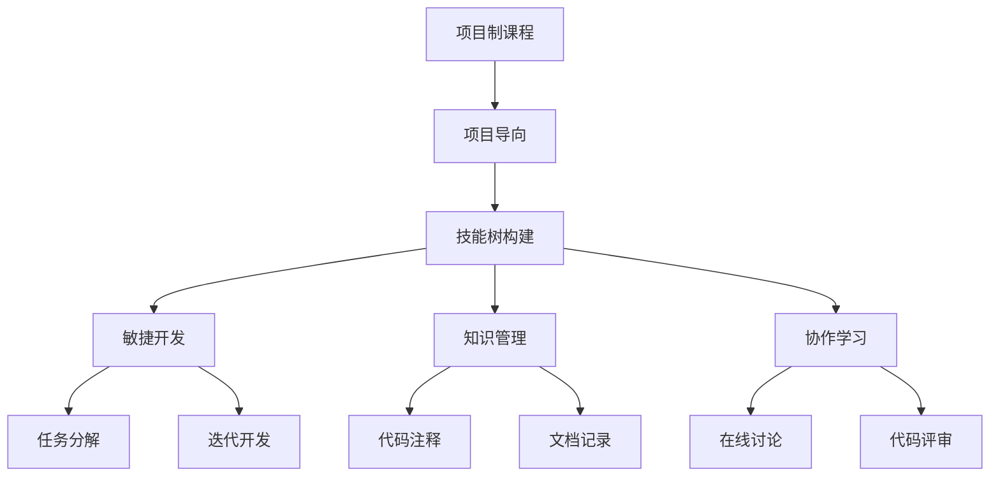
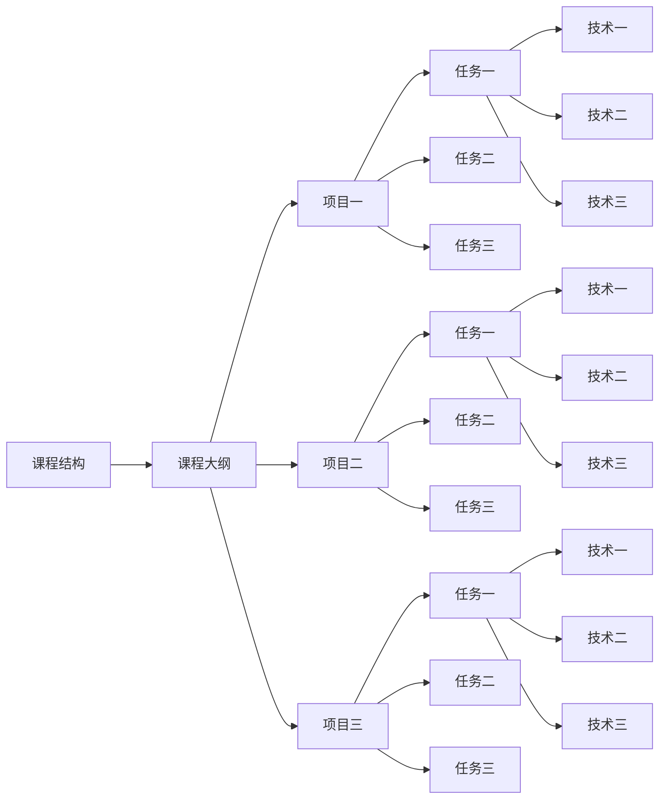

                 

# 程序员知识付费：打造项目制课程

## 1. 背景介绍

在当今知识爆炸的时代，程序员面临的学习压力和挑战前所未有。一方面，技术的日新月异要求程序员不断更新自己的知识体系；另一方面，实际工作中的需求复杂多变，导致很多开发者难以集中时间和精力进行系统学习。在这样的背景下，知识付费逐渐成为一种新的学习方式，通过付费获取系统化的课程资源，可以高效地提升编程技能。然而，传统线性和结构化的课程内容往往难以满足个性化需求，项目制课程以其“项目驱动、实践为主”的特点，正受到越来越多的关注。

### 1.1 问题由来

在教育领域，长期以来以理论知识为主，实践操作为辅的课程体系，已经不能满足当前行业发展的需求。传统的教育模式更加注重学科知识的掌握，而对技能的应用和创新能力培养不够。同时，大多数在线教育平台以单向的知识传授为主，缺乏互动和反馈机制，导致学习效果不佳。此外，在IT行业中，许多新技术和新工具的快速发展，要求程序员不断学习和更新自己的技能，而传统课程体系更新缓慢，难以跟上行业变化。

### 1.2 问题核心关键点

项目制课程的核心在于通过具体的项目实践，引导学员系统掌握特定的技术技能，并能将这些技能应用到实际工作中。这种课程结构更加符合程序员的学习特点和工作需求，具有以下优点：

1. **理论与实践结合**：通过实践项目来学习新技能，能够更加深入地理解理论知识，并在实践中发现问题并解决。
2. **目标导向明确**：每个项目都有明确的目标，能够帮助学员集中注意力，避免漫无目的地学习。
3. **持续性学习**：项目制课程更加注重过程而非结果，学员可以通过项目实践持续提升技能，而不仅仅是记忆知识点。
4. **自主性提高**：项目制课程以学员为主导，鼓励自主学习和探索，有助于提升学习兴趣和效率。
5. **跨学科融合**：项目往往涉及多个学科领域的知识，有助于培养学员的综合素质和跨学科思维。

这些优点使得项目制课程成为当前IT教育的一个热门趋势，也是未来教育发展的方向之一。

## 2. 核心概念与联系

### 2.1 核心概念概述

为更好地理解项目制课程的原理和架构，我们首先介绍几个关键概念：

- **项目制课程**：以实际项目为主导，通过实践操作进行技能学习的一种课程体系。通常包括项目目标设定、任务分解、技术选型、实施过程、评估验收等多个环节。
- **项目导向**：课程内容以项目为主线，通过具体项目实现技术目标，强调实践性和应用性。
- **技能树构建**：通过项目实践，逐步构建起系统的技能树，涵盖编程语言、开发框架、算法设计、软件工程等多个维度。
- **敏捷开发**：采用敏捷开发方法，将项目分解为多个小任务，以迭代方式进行开发，提升项目完成的效率和质量。
- **知识管理**：课程中注重知识点的整理和管理，通过文档记录和代码注释等方式，帮助学员系统整理所学知识。
- **协作学习**：鼓励学员通过在线讨论、代码评审等方式进行团队协作，提升协作能力和沟通技巧。

这些概念通过以下Mermaid流程图展示它们之间的联系：



### 2.2 核心概念原理和架构的 Mermaid 流程图



该流程图展示了项目制课程的整体结构和内容布局。每个项目包含多个任务，每个任务涉及多种技术，最终构成系统化的课程内容。

## 3. 核心算法原理 & 具体操作步骤

### 3.1 算法原理概述

项目制课程的开发基于敏捷开发和迭代式学习的基本原理。课程开发者首先需要定义项目目标和任务，并将任务分解为具体的可执行子任务，随后通过迭代开发的方式逐步完成每个子任务。在每个迭代周期内，开发者会进行项目进展汇报、代码评审和需求变更等活动，确保项目能够按期完成并达到预期目标。

### 3.2 算法步骤详解

项目制课程开发的具体步骤如下：

1. **需求分析**：确定课程的总体目标和预期成果，进行市场调研和需求收集，明确课程的定位和受众。
2. **项目设计**：设计具体的项目案例，将课程目标细化为具体的项目任务，每个任务设定明确的技术要求和成果标准。
3. **任务分解**：将项目任务分解为具体的子任务，每个子任务独立可执行，可评估。
4. **敏捷开发**：采用敏捷开发方法，将任务分配给团队成员，通过迭代式开发逐步完成每个子任务。
5. **技术选型**：根据项目需求和任务特点，选择合适的技术栈和工具，确保课程内容的实用性。
6. **实践操作**：鼓励学员通过编程实践，完成项目任务的开发，并在实践中积累经验和技能。
7. **评估验收**：定期进行项目评审和成果验收，评估学员的学习进度和技术掌握情况，并及时进行调整。
8. **知识整理**：通过文档记录和代码注释等方式，整理所学知识，形成系统的知识体系。
9. **协作学习**：鼓励学员通过在线讨论、代码评审等方式进行团队协作，提升沟通和协作能力。

### 3.3 算法优缺点

项目制课程有以下优点：

1. **目标导向明确**：课程内容围绕具体项目展开，每个项目都有明确的目标和成果，能够帮助学员集中注意力，避免漫无目的地学习。
2. **理论与实践结合**：通过实践项目来学习新技能，能够更加深入地理解理论知识，并在实践中发现问题并解决。
3. **持续性学习**：项目制课程注重过程而非结果，学员可以通过项目实践持续提升技能，而不仅仅是记忆知识点。
4. **自主性提高**：项目制课程以学员为主导，鼓励自主学习和探索，有助于提升学习兴趣和效率。
5. **跨学科融合**：项目往往涉及多个学科领域的知识，有助于培养学员的综合素质和跨学科思维。

但同时也存在一些缺点：

1. **实施难度较大**：项目制课程需要丰富的课程资源和高效的项目管理，实施难度较大。
2. **课程设计复杂**：每个项目设计需要耗费大量的时间和精力，课程设计难度较高。
3. **成果评估困难**：项目成果的评估需要客观公正的评审标准，否则可能导致评估结果不准确。
4. **课程内容灵活性差**：每个项目的内容固定，难以根据学员的学习进度进行灵活调整。

### 3.4 算法应用领域

项目制课程在IT教育中的应用非常广泛，涵盖以下多个领域：

1. **Web开发**：通过具体Web应用项目的开发，掌握前端、后端、数据库等多个技术栈，提升开发能力。
2. **移动应用**：通过开发iOS、Android等移动应用项目，学习移动开发技术，并提升项目管理和协作能力。
3. **数据科学**：通过数据挖掘、数据分析和数据可视化等项目，掌握数据科学核心技术，并应用到实际问题中。
4. **人工智能**：通过机器学习、深度学习等项目，学习AI核心算法和工具，提升实际应用能力。
5. **系统架构**：通过设计和实施复杂系统架构项目，掌握系统设计和架构设计技能，提升技术水平。
6. **软技能**：通过团队协作、项目管理等项目，提升软技能和团队合作能力，为职业发展打下坚实基础。

这些应用领域涵盖了IT教育的多个方向，能够帮助学员系统掌握技术技能，并应用于实际工作中。

## 4. 数学模型和公式 & 详细讲解 & 举例说明

### 4.1 数学模型构建

项目制课程的数学模型可以表示为：

$$
C = \bigcup_{i=1}^{n} P_i
$$

其中，$C$ 表示整个课程，$P_i$ 表示第 $i$ 个项目，$n$ 表示课程包含的项目数量。每个项目 $P_i$ 可以进一步分解为多个子任务 $T_{i,j}$，即：

$$
P_i = \bigcup_{j=1}^{m} T_{i,j}
$$

其中，$m$ 表示项目 $P_i$ 包含的子任务数量。每个子任务 $T_{i,j}$ 可以表示为：

$$
T_{i,j} = (T_{i,j}^{input}, T_{i,j}^{output}, T_{i,j}^{task}, T_{i,j}^{result})
$$

其中，$T_{i,j}^{input}$ 表示子任务的输入条件，$T_{i,j}^{output}$ 表示子任务的输出结果，$T_{i,j}^{task}$ 表示子任务的技术要求，$T_{i,j}^{result}$ 表示子任务的实际完成情况。

### 4.2 公式推导过程

在项目制课程的实施过程中，每个子任务都需要按照以下步骤进行：

1. **需求分析**：明确子任务的技术要求和输入条件，设定具体的任务目标。
2. **任务分解**：将子任务分解为更小的、可执行的子子任务，每个子子任务独立可执行，可评估。
3. **技术选型**：根据子任务的特点，选择合适的技术栈和工具，确保子任务的实施可行。
4. **实施过程**：通过编程实践，逐步完成子子任务的开发，并记录代码和文档。
5. **评估验收**：对子子任务的完成情况进行评估，确保满足技术要求。
6. **迭代优化**：根据评估结果，对子任务进行优化和调整，提升任务完成的效率和质量。

### 4.3 案例分析与讲解

以一个简单的Web开发项目为例，该项目的目标是开发一个在线购物网站，具体任务包括：

1. **前端开发**：
    - 任务分解：页面布局、页面样式、用户交互
    - 技术选型：HTML、CSS、JavaScript
    - 实施过程：实现页面布局、添加样式、实现用户交互
    - 评估验收：检查页面布局是否合理、样式是否美观、交互是否顺畅
    - 迭代优化：根据用户反馈，调整页面布局和交互方式

2. **后端开发**：
    - 任务分解：数据库设计、API开发、后台管理
    - 技术选型：Node.js、MongoDB、Express
    - 实施过程：设计数据库结构、开发API接口、实现后台管理
    - 评估验收：测试API接口是否正确、后台管理是否稳定
    - 迭代优化：优化API性能、提升后台管理功能

通过这些具体的项目任务，学员可以系统掌握Web开发的核心技能，并应用到实际项目中。

## 5. 项目实践：代码实例和详细解释说明

### 5.1 开发环境搭建

在项目制课程的开发过程中，需要搭建一个合适的开发环境。以下是一些常用工具和环境搭建的步骤：

1. **编程语言选择**：根据项目需求选择合适的编程语言，如Java、Python、JavaScript等。
2. **IDE配置**：安装并配置一个合适的IDE，如IntelliJ IDEA、Visual Studio Code等。
3. **版本控制**：使用Git进行版本控制，方便代码管理和协作。
4. **持续集成**：使用Jenkins或Travis CI等工具进行持续集成，确保代码的稳定性和可维护性。
5. **容器化部署**：使用Docker等容器化工具进行项目部署，确保项目在不同环境中的一致性。
6. **云平台部署**：使用云平台如AWS、阿里云、腾讯云等进行项目部署，享受云资源的高可用性和高扩展性。

### 5.2 源代码详细实现

以一个简单的Java Web项目为例，具体代码实现如下：

1. **前端代码**：
    ```java
    import javax.servlet.ServletException;
    import javax.servlet.annotation.WebServlet;
    import javax.servlet.http.HttpServlet;
    import javax.servlet.http.HttpServletRequest;
    import javax.servlet.http.HttpServletResponse;
    import java.io.IOException;
    import java.io.PrintWriter;
    
    @WebServlet("/index")
    public class IndexServlet extends HttpServlet {
        protected void doGet(HttpServletRequest request, HttpServletResponse response) throws ServletException, IOException {
            response.setContentType("text/html");
            PrintWriter out = response.getWriter();
            out.println("<html><head><title>Hello, World!</title></head><body><h1>Welcome to my website!</h1></body></html>");
        }
    }
    ```

2. **后端代码**：
    ```java
    import javax.servlet.ServletException;
    import javax.servlet.annotation.WebServlet;
    import javax.servlet.http.HttpServlet;
    import javax.servlet.http.HttpServletRequest;
    import javax.servlet.http.HttpServletResponse;
    import java.io.IOException;
    import java.io.PrintWriter;
    
    @WebServlet("/api")
    public class ApiServlet extends HttpServlet {
        protected void doGet(HttpServletRequest request, HttpServletResponse response) throws ServletException, IOException {
            response.setContentType("application/json");
            PrintWriter out = response.getWriter();
            out.println("{\"message\": \"Hello, API!\"}");
        }
    }
    ```

### 5.3 代码解读与分析

以上代码实现了一个简单的Java Web项目，包括一个首页和一个API接口。具体分析如下：

1. **前端代码**：
    - 通过注解 `@WebServlet("/index")`，将 `IndexServlet` 类映射到 `/index` 路径，确保可以在浏览器中访问该路径。
    - 在 `doGet` 方法中，设置响应类型为 `text/html`，使用 `PrintWriter` 输出HTML内容，显示欢迎信息。
2. **后端代码**：
    - 通过注解 `@WebServlet("/api")`，将 `ApiServlet` 类映射到 `/api` 路径，确保可以在浏览器或API客户端访问该路径。
    - 在 `doGet` 方法中，设置响应类型为 `application/json`，使用 `PrintWriter` 输出JSON内容，返回一个简单的问候信息。

### 5.4 运行结果展示

运行以上代码，在浏览器中访问 `http://localhost:8080/index` 和 `http://localhost:8080/api`，可以分别看到欢迎页面和API接口的响应结果。

## 6. 实际应用场景

### 6.1 教育培训

在教育培训领域，项目制课程以其目标导向明确、理论与实践结合的特点，成为一种高效的学习方式。通过具体项目的实践操作，学员可以系统掌握编程技能，并在实践中发现问题并解决。这种课程结构不仅有助于提高学习效率，还能增强学员的动手能力和自主学习能力。

### 6.2 企业培训

在企业培训中，项目制课程以其持续性学习、自主性提高等特点，成为一种灵活的培训方式。通过具体的项目案例，员工可以学习到实际工作中的核心技能，并应用到具体工作中。这种课程结构不仅有助于提升员工的技能水平，还能增强其团队合作和项目管理能力。

### 6.3 社区教育

在社区教育中，项目制课程以其跨学科融合、自主性提高等特点，成为一种多元化的教育方式。通过具体项目的实践操作，社区成员可以系统掌握多个学科领域的知识，并应用到实际生活中。这种课程结构不仅有助于提高社区成员的综合素质，还能增强其创新能力和跨学科思维。

### 6.4 未来应用展望

随着技术的发展和教育模式的变革，项目制课程必将得到更广泛的应用，涵盖更多领域。未来，项目制课程将呈现以下几个发展趋势：

1. **跨学科融合**：项目制课程将融合更多学科领域的知识，培养学员的综合素质和跨学科思维。
2. **技术栈多样化**：项目制课程将涵盖更多技术栈和工具，满足不同技术需求。
3. **实时互动**：项目制课程将引入更多实时互动和协作工具，提升学习效率和体验。
4. **个性化定制**：项目制课程将根据学员的学习进度和兴趣，提供个性化的项目和任务，满足不同学员的需求。
5. **在线化平台**：项目制课程将更多地采用在线化平台进行教学，方便学员随时随地学习。

这些趋势将使得项目制课程更加灵活、高效，更好地满足不同学习者的需求。

## 7. 工具和资源推荐

### 7.1 学习资源推荐

为了帮助开发者系统掌握项目制课程的开发方法，这里推荐一些优质的学习资源：

1. **Udacity**：Udacity提供的计算机科学纳米学位课程，涵盖多个方向的项目制课程，包括Web开发、移动应用、数据科学等。
2. **Coursera**：Coursera提供的计算机科学课程，涵盖多个方向的项目制课程，包括机器学习、人工智能、网络安全等。
3. **edX**：edX提供的计算机科学课程，涵盖多个方向的项目制课程，包括数据库、软件开发、网络安全等。
4. **Khan Academy**：Khan Academy提供的计算机科学课程，涵盖多个方向的项目制课程，包括编程基础、Web开发、算法设计等。
5. **Udemy**：Udemy提供的计算机科学课程，涵盖多个方向的项目制课程，包括Java编程、Python编程、数据科学等。

这些资源涵盖了项目制课程的多个方向和领域，能够帮助开发者系统掌握项目制课程的开发方法，提升技能水平。

### 7.2 开发工具推荐

在项目制课程的开发过程中，需要使用多种工具进行支持，以下是一些推荐的工具：

1. **IDE**：如IntelliJ IDEA、Visual Studio Code等，支持代码编辑、调试和版本控制。
2. **版本控制**：如Git，支持代码管理和版本控制，方便协作和迭代。
3. **持续集成**：如Jenkins、Travis CI等，支持代码持续集成和自动化测试。
4. **容器化部署**：如Docker，支持代码的容器化部署，确保环境一致性。
5. **云平台**：如AWS、阿里云、腾讯云等，支持云资源的弹性扩展和部署。

这些工具能够帮助开发者高效地进行项目制课程的开发和实施，提升开发效率和质量。

### 7.3 相关论文推荐

项目制课程的发展离不开学界的持续研究。以下是几篇奠基性的相关论文，推荐阅读：

1. **"Project-Based Learning: Learning Through Doing"**：探讨项目制学习的方法和效果，强调实践操作在技能学习中的重要性。
2. **"Agile Education: A New Approach to Learning in Software Development"**：探讨敏捷教育的方法和实践，强调迭代开发和持续改进在项目制课程中的应用。
3. **"Project-Based Learning in Computer Science Education"**：探讨项目制课程在计算机科学教育中的应用，强调自主学习和跨学科融合的重要性。
4. **"K12 Project-Based Learning: Towards a National Policy Agenda"**：探讨项目制课程在K-12教育中的应用，强调项目制学习在培养学生综合素质中的作用。
5. **"Project-Based Learning: A Guide to Integrating Projects into Any Curriculum"**：探讨项目制课程在各学科中的应用，强调项目制学习在培养学生创新能力中的作用。

这些论文代表了大语言模型微调技术的发展脉络，帮助开发者理解项目制课程的理论基础和实践方法。

## 8. 总结：未来发展趋势与挑战

### 8.1 研究成果总结

本文对项目制课程的开发方法进行了全面系统的介绍。首先阐述了项目制课程的背景和特点，明确了其在IT教育中的重要价值。其次，从原理到实践，详细讲解了项目制课程的数学模型和具体步骤，给出了完整的项目实践代码。同时，本文还探讨了项目制课程在多个行业领域的应用前景，展示了其广阔的应用空间。

通过本文的系统梳理，可以看到，项目制课程是一种高效、灵活、目标导向明确的学习方式，能够系统提升编程技能，并应用到实际工作中。项目制课程不仅有助于提升学员的技能水平，还能增强其自主学习能力和跨学科思维，适应未来技术的快速变化。

### 8.2 未来发展趋势

展望未来，项目制课程将呈现以下几个发展趋势：

1. **跨学科融合**：项目制课程将融合更多学科领域的知识，培养学员的综合素质和跨学科思维。
2. **技术栈多样化**：项目制课程将涵盖更多技术栈和工具，满足不同技术需求。
3. **实时互动**：项目制课程将引入更多实时互动和协作工具，提升学习效率和体验。
4. **个性化定制**：项目制课程将根据学员的学习进度和兴趣，提供个性化的项目和任务，满足不同学员的需求。
5. **在线化平台**：项目制课程将更多地采用在线化平台进行教学，方便学员随时随地学习。

这些趋势将使得项目制课程更加灵活、高效，更好地满足不同学习者的需求。

### 8.3 面临的挑战

尽管项目制课程具有诸多优势，但在迈向更加智能化、普适化应用的过程中，它仍面临诸多挑战：

1. **实施难度较大**：项目制课程需要丰富的课程资源和高效的项目管理，实施难度较大。
2. **课程设计复杂**：每个项目设计需要耗费大量的时间和精力，课程设计难度较高。
3. **成果评估困难**：项目成果的评估需要客观公正的评审标准，否则可能导致评估结果不准确。
4. **课程内容灵活性差**：每个项目的内容固定，难以根据学员的学习进度进行灵活调整。

### 8.4 研究展望

面对项目制课程所面临的挑战，未来的研究需要在以下几个方面寻求新的突破：

1. **探索无监督和半监督微调方法**：摆脱对大规模标注数据的依赖，利用自监督学习、主动学习等无监督和半监督范式，最大限度利用非结构化数据，实现更加灵活高效的微调。
2. **研究参数高效和计算高效的微调范式**：开发更加参数高效的微调方法，在固定大部分预训练参数的同时，只更新极少量的任务相关参数。同时优化微调模型的计算图，减少前向传播和反向传播的资源消耗，实现更加轻量级、实时性的部署。
3. **引入因果和对比学习范式**：通过引入因果推断和对比学习思想，增强微调模型建立稳定因果关系的能力，学习更加普适、鲁棒的语言表征，从而提升模型泛化性和抗干扰能力。
4. **结合因果分析和博弈论工具**：将因果分析方法引入微调模型，识别出模型决策的关键特征，增强输出解释的因果性和逻辑性。借助博弈论工具刻画人机交互过程，主动探索并规避模型的脆弱点，提高系统稳定性。
5. **纳入伦理道德约束**：在模型训练目标中引入伦理导向的评估指标，过滤和惩罚有偏见、有害的输出倾向。同时加强人工干预和审核，建立模型行为的监管机制，确保输出符合人类价值观和伦理道德。

这些研究方向的探索，将引领项目制课程技术迈向更高的台阶，为构建安全、可靠、可解释、可控的智能系统铺平道路。面向未来，项目制课程技术还需要与其他人工智能技术进行更深入的融合，如知识表示、因果推理、强化学习等，多路径协同发力，共同推动自然语言理解和智能交互系统的进步。只有勇于创新、敢于突破，才能不断拓展语言模型的边界，让智能技术更好地造福人类社会。

## 9. 附录：常见问题与解答

**Q1：项目制课程适用于所有编程语言吗？**

A: 项目制课程主要适用于各种主流编程语言，如Java、Python、C++等。每种编程语言有其独特的语法和开发环境，需要针对性地进行课程设计和实施。

**Q2：项目制课程的实施难度如何？**

A: 项目制课程的实施难度较大，需要丰富的课程资源和高效的项目管理。通常需要组建一个由课程开发者、项目经理和学员组成的团队，共同完成课程的实施。

**Q3：如何选择合适的技术栈？**

A: 选择合适的技术栈需要考虑多个因素，包括项目的复杂度、学员的技术水平、资源可用性等。通常建议选择成熟的、易于上手的技术栈，以确保项目能够顺利完成。

**Q4：项目制课程的评估标准是什么？**

A: 项目制课程的评估标准需要根据具体的项目目标和任务要求进行设定。通常包括代码规范、功能实现、性能测试、用户体验等方面。评估标准需要明确、客观，并根据学员的学习进度进行动态调整。

**Q5：如何提高项目制课程的互动性？**

A: 提高项目制课程的互动性可以通过以下方式实现：
- 引入在线讨论和代码评审机制，鼓励学员之间的交流和反馈。
- 定期进行项目评审和成果展示，提升学员的团队合作和沟通能力。
- 引入实时的编程环境，如Jupyter Notebook，方便学员进行协作和迭代。

这些措施能够提升项目制课程的互动性，帮助学员更好地掌握技能。

