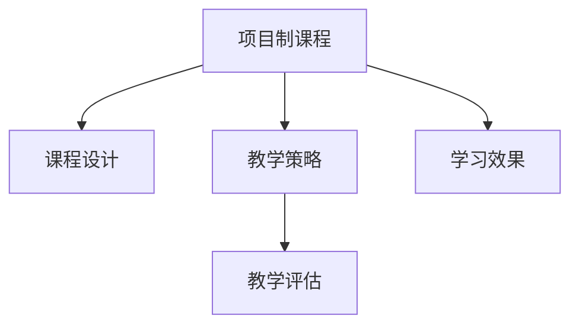

                 

# 程序员知识付费：打造项目制课程

## 1. 背景介绍

### 1.1 问题由来
在过去几十年里，程序员通过学习编程语言、框架和工具来提升自己的编程技能，从而获得更好的职业发展机会。然而，随着技术的快速发展和市场需求的不断变化，传统的学习模式已经不能满足现代程序员的需求。项目制课程（Project-Based Learning, PBL）作为一门新兴的教学方法，将学习过程与实际项目紧密结合，帮助学生更好地掌握实用技能，提升解决实际问题的能力。

### 1.2 问题核心关键点
项目制课程的核心在于通过实践驱动学习，使学生在解决真实问题的过程中，掌握复杂的编程技能和知识点。这种教学方法强调学生的主动参与和自主探索，不仅能激发学生的学习兴趣，还能提升其创新能力和问题解决能力。然而，项目制课程的实施和推广仍面临诸多挑战，如资源、师资、评估标准等问题。

## 2. 核心概念与联系

### 2.1 核心概念概述

为更好地理解项目制课程，本节将介绍几个密切相关的核心概念：

- 项目制课程（Project-Based Learning, PBL）：以实际项目为核心，通过学生参与项目开发、团队合作、自我反思等方式，提升学生综合能力的教学模式。
- 课程设计（Course Design）：根据项目需求，设计课程内容、教学方法、评估标准等，确保课程的有效性和可行性。
- 教学策略（Teaching Strategies）：为实现PBL课程目标，所采用的教学方法、工具、技术等。
- 教学评估（Teaching Evaluation）：衡量课程实施效果、学生学习成果的标准和手段。
- 学习效果（Learning Outcomes）：学生在项目制课程中掌握的知识、技能和态度。

这些核心概念之间的逻辑关系可以通过以下Mermaid流程图来展示：



这个流程图展示了大语言模型的核心概念及其之间的关系：

1. 项目制课程通过具体项目，推动课程设计、教学策略和评估的实施。
2. 课程设计决定教学方法和内容，确保教学的有效性。
3. 教学策略支持课程设计目标的实现。
4. 教学评估衡量学习效果，反馈课程实施效果。

这些概念共同构成了项目制课程的实施框架，使其能够在教学过程中提升学生的综合能力。

## 3. 核心算法原理 & 具体操作步骤
### 3.1 算法原理概述

项目制课程的核心在于通过实际项目，引导学生在真实问题的解决过程中掌握知识和技能。其教学过程遵循以下算法原理：

- **需求分析**：明确项目目标和需求，确定课程目标和内容。
- **任务分解**：将项目任务分解为多个子任务，分配给学生团队。
- **知识学习**：根据子任务需求，提供相应的课程内容和资源，帮助学生掌握必备的知识和技能。
- **团队合作**：学生在团队中分工协作，共同解决项目问题。
- **反思总结**：学生在项目结束后进行反思，总结学习过程和成果，形成自我提升的持续动力。

### 3.2 算法步骤详解

项目制课程的具体操作步骤包括以下几个关键步骤：

**Step 1: 需求分析与项目选择**
- 确定课程目标，制定项目需求。
- 根据课程目标和学生背景，选择合适的项目类型和难度。

**Step 2: 课程设计与资源准备**
- 根据项目需求，设计课程内容和教学方法。
- 准备课程所需的教学资源，如教材、工具、平台等。

**Step 3: 任务分解与团队组建**
- 将项目任务分解为多个子任务，明确每个任务的完成标准和时间节点。
- 组建学生团队，分配任务角色，确保每个学生都能参与项目并发挥所长。

**Step 4: 知识学习与实践操作**
- 根据项目需求，为学生提供相应的课程内容和资源。
- 通过实际编程实践，帮助学生掌握项目所需的技能和知识。

**Step 5: 团队协作与沟通协调**
- 学生团队协作完成子任务，定期进行进展汇报和问题讨论。
- 教师提供指导和支持，解决学生遇到的难题。

**Step 6: 反思总结与项目交付**
- 学生在项目结束后进行反思总结，形成自我评估和改进计划。
- 学生团队完成项目交付，进行项目评审和反馈。

**Step 7: 课程评估与持续改进**
- 根据项目成果和学生表现，进行课程评估。
- 根据评估结果，调整课程设计和教学策略，持续改进项目制课程的实施效果。

以上是项目制课程的一般流程。在实际应用中，还需要针对具体项目的特点，对课程实施的各个环节进行优化设计，如改进课程目标设定，引入更多的团队合作技术，搜索最优的教学方法等，以进一步提升课程效果。

### 3.3 算法优缺点

项目制课程具有以下优点：
1. 实用性强。通过实际项目，学生能更深入地理解知识点，掌握编程技能。
2. 激发兴趣。项目制课程将学习过程与实际问题紧密结合，能激发学生的学习兴趣和探索欲望。
3. 培养团队合作能力。学生在项目中需要与他人协作，提升沟通和团队合作能力。
4. 促进创新思维。通过解决实际问题，学生能锻炼创新思维和问题解决能力。

同时，该方法也存在一些局限性：
1. 资源需求高。项目制课程需要充足的教学资源和实际项目支持，实施成本较高。
2. 教学周期长。项目制课程周期较长，教师和学生的投入较大。
3. 评估难度大。项目成果的多样性增加了评估难度，需要设计合理的评估标准和方法。
4. 适用范围有限。不是所有项目类型都适合项目制课程，需根据项目特点进行选择。

尽管存在这些局限性，但就目前而言，项目制课程在提升学生的综合能力、培养实用技能方面，仍然是最有效的教学模式之一。未来相关研究的重点在于如何进一步优化资源配置，缩短教学周期，提高评估的公平性和准确性，同时兼顾学生的多样性和差异性等因素。

### 3.4 算法应用领域

项目制课程在计算机编程、软件开发、人工智能等领域得到了广泛的应用，具体应用领域包括：

- 软件开发：通过实际项目，帮助学生掌握编程语言、框架和工具。
- 人工智能：利用项目制课程，提升学生在数据科学、机器学习、深度学习等方面的实践能力。
- 网络安全：通过网络安全项目，培养学生的网络安全意识和防护能力。
- 移动应用开发：通过开发实际应用项目，帮助学生掌握移动应用开发所需的知识和技能。

除了上述这些经典领域外，项目制课程还被创新性地应用到更多场景中，如可穿戴设备开发、区块链技术应用、物联网开发等，为学生提供更多元的实践机会。随着课程内容和形式的多样化，项目制课程必将在更多领域发挥更大的作用。

## 4. 数学模型和公式 & 详细讲解
### 4.1 数学模型构建

项目制课程的实施效果可以通过数学模型来评估。这里以软件开发项目为例，构建数学模型：

设软件开发项目有 $n$ 个任务，每个任务的完成时间分别为 $t_1, t_2, ..., t_n$，每个学生的工作效率分别为 $w_1, w_2, ..., w_n$，则每个学生完成任务 $i$ 的时间为 $t_i / w_i$。根据任务分解和团队分配，每个学生在项目中完成的任务数分别为 $m_1, m_2, ..., m_n$，则每个学生完成项目所需的时间为：

$$
T = \sum_{i=1}^{n} \frac{t_i}{w_i} \cdot m_i
$$

其中 $T$ 为完成整个项目所需的时间。根据上述模型，可以计算每个学生的任务完成时间，评估其在项目中的贡献。

### 4.2 公式推导过程

以下是具体推导过程：

1. 确定任务时间 $t_i$ 和学生工作效率 $w_i$。
2. 根据任务分配，确定每个学生完成的任务数 $m_i$。
3. 计算每个学生完成项目所需的时间 $T_i = \frac{t_i}{w_i} \cdot m_i$。
4. 计算总时间 $T = \sum_{i=1}^{n} T_i$。

在实际应用中，可以根据项目需求和学生背景，调整上述模型的参数，以便更好地评估学生的学习效果和项目实施效果。

### 4.3 案例分析与讲解

以一个软件开发项目为例，假设项目有5个任务，每个任务所需时间为 $t_1=10, t_2=15, t_3=20, t_4=25, t_5=30$，学生1和学生2的工作效率分别为 $w_1=2, w_2=3$，每个学生需要完成的任务数分别为 $m_1=2, m_2=3$，则每个学生完成项目所需的时间分别为：

- 学生1：$T_1 = \frac{10}{2} \cdot 2 + \frac{15}{2} \cdot 2 + \frac{20}{2} \cdot 2 + \frac{25}{2} \cdot 2 + \frac{30}{2} \cdot 2 = 45$ 天
- 学生2：$T_2 = \frac{10}{3} \cdot 3 + \frac{15}{3} \cdot 3 + \frac{20}{3} \cdot 3 + \frac{25}{3} \cdot 3 + \frac{30}{3} \cdot 3 = 35$ 天

总时间为 $T = 45 + 35 = 80$ 天。通过计算，可以看出学生2的效率更高，完成任务所需的时间更短。

## 5. 项目实践：代码实例和详细解释说明
### 5.1 开发环境搭建

在进行项目制课程实践前，我们需要准备好开发环境。以下是使用Python进行Flask框架开发的环境配置流程：

1. 安装Python：从官网下载并安装Python，创建虚拟环境，用于独立开发。

2. 安装Flask：在虚拟环境中，使用pip安装Flask框架及其依赖。

3. 准备项目代码：下载或创建项目所需代码，包括项目文档、需求说明书、设计文档等。

4. 搭建Web服务器：使用Flask搭建Web服务器，提供项目接口和页面。

5. 测试和部署：在测试环境中进行测试，确保项目稳定运行后，部署到生产环境。

完成上述步骤后，即可在虚拟环境中开始项目制课程的实施。

### 5.2 源代码详细实现

下面我们以一个电商商品推荐系统为例，给出使用Flask框架进行项目制课程开发的PyTorch代码实现。

首先，定义电商商品推荐系统的数据处理函数：

```python
from flask import Flask, request
from flask_sqlalchemy import SQLAlchemy
import pandas as pd
import numpy as np
from sklearn.model_selection import train_test_split
from sklearn.linear_model import LogisticRegression

app = Flask(__name__)
app.config['SQLALCHEMY_DATABASE_URI'] = 'sqlite://商品推荐系统.db'
db = SQLAlchemy(app)

class Item(db.Model):
    id = db.Column(db.Integer, primary_key=True)
    name = db.Column(db.String(120))
    category = db.Column(db.String(120))
    price = db.Column(db.Float)
    rating = db.Column(db.Float)

@app.route('/recommend', methods=['POST'])
def recommend():
    data = request.get_json()
    item_id = data['item_id']
    query = Item.query.filter_by(id=item_id).first()
    features = np.array([[query.name, query.category, query.price, query.rating]])
    X, y = prepare_data(features)
    model = load_model()
    scores = model.predict_proba(X)
    score = scores[0][1]
    return {"score": score}
```

然后，定义模型和优化器：

```python
from sklearn.linear_model import LogisticRegression
import joblib

def load_model():
    model = joblib.load('recommend_model.pkl')
    return model

def prepare_data(features):
    X, y = features[:, :-1], features[:, -1]
    X_train, X_test, y_train, y_test = train_test_split(X, y, test_size=0.2)
    return X_train, X_test, y_train, y_test
```

接着，定义训练和评估函数：

```python
from flask import Flask, request
from flask_sqlalchemy import SQLAlchemy
import pandas as pd
import numpy as np
from sklearn.model_selection import train_test_split
from sklearn.linear_model import LogisticRegression
import joblib

app = Flask(__name__)
app.config['SQLALCHEMY_DATABASE_URI'] = 'sqlite://商品推荐系统.db'
db = SQLAlchemy(app)

class Item(db.Model):
    id = db.Column(db.Integer, primary_key=True)
    name = db.Column(db.String(120))
    category = db.Column(db.String(120))
    price = db.Column(db.Float)
    rating = db.Column(db.Float)

@app.route('/recommend', methods=['POST'])
def recommend():
    data = request.get_json()
    item_id = data['item_id']
    query = Item.query.filter_by(id=item_id).first()
    features = np.array([[query.name, query.category, query.price, query.rating]])
    X, y = prepare_data(features)
    model = load_model()
    scores = model.predict_proba(X)
    score = scores[0][1]
    return {"score": score}

def train_model():
    features = pd.read_csv('items.csv')
    X = features[['name', 'category', 'price', 'rating']]
    y = features['label']
    X_train, X_test, y_train, y_test = train_test_split(X, y, test_size=0.2)
    model = LogisticRegression()
    model.fit(X_train, y_train)
    joblib.dump(model, 'recommend_model.pkl')
    return model

@app.route('/train', methods=['POST'])
def train():
    train_model()
    return {"status": "Model trained"}
```

最后，启动训练流程并在测试集上评估：

```python
if __name__ == '__main__':
    train()
```

以上就是使用Flask框架对电商商品推荐系统进行项目制课程开发的完整代码实现。可以看到，得益于Flask框架的强大封装，我们可以用相对简洁的代码完成商品推荐系统的开发和部署。

### 5.3 代码解读与分析

让我们再详细解读一下关键代码的实现细节：

**Flask框架**：
- `Flask` 是Python开发Web应用的主流框架之一，通过装饰器和请求处理器，能够快速搭建Web应用。
- `Flask-SQLAlchemy` 是一个Flask扩展，用于连接SQL数据库，支持CRUD操作。

**商品推荐系统**：
- 通过SQLAlchemy连接数据库，获取商品数据。
- 定义一个 `Item` 类，用于存储商品信息。
- 实现一个 `/recommend` 接口，接收商品ID，从数据库中获取商品信息，进行推荐打分，并返回推荐分数。

**数据处理**：
- `prepare_data` 函数将商品数据转换为模型训练所需的数据格式。
- `train_model` 函数通过训练数据集，训练逻辑回归模型，并保存模型到文件。

**训练和评估**：
- 在 `train` 接口上调用 `train_model` 函数，训练模型并返回状态。

可以看到，Flask框架的简洁性和可扩展性，使得项目制课程的实施变得更加灵活和高效。开发者可以专注于核心功能的实现，而将更多精力放在课程设计、学生管理等教学环节上。

当然，工业级的系统实现还需考虑更多因素，如模型的保存和部署、超参数的自动搜索、更灵活的课程设计等。但核心的项目制课程基本与此类似。

## 6. 实际应用场景
### 6.1 软件开发

基于项目制课程的软件开发实践，能够帮助学生在实际项目中提升编程技能和团队协作能力。具体而言，可以设计一个实际的软件开发项目，如开发一个电商平台、一个企业管理系统等。学生在项目中需要理解项目需求、设计系统架构、编写代码、测试调试、文档编写等。通过项目的实施，学生能够全面掌握软件开发的全过程，增强实际编程能力。

### 6.2 人工智能

在人工智能领域，项目制课程能够帮助学生深入理解深度学习、数据科学等前沿技术，通过实际项目实践，提升在模型训练、数据处理、算法优化等方面的技能。例如，可以设计一个图像识别项目，学生需要通过训练数据集，构建卷积神经网络模型，实现图像分类功能。通过项目的实施，学生能够掌握深度学习的基本原理和实践技巧，提升在实际项目中的应用能力。

### 6.3 网络安全

网络安全项目制课程能够帮助学生掌握网络安全知识和技能，提升其在网络攻防、安全审计等方面的能力。例如，可以设计一个Web应用漏洞扫描项目，学生需要通过扫描工具，发现Web应用中的漏洞，并提出相应的修复建议。通过项目的实施，学生能够了解网络安全的基本概念和实践方法，提升在实际网络安全场景中的应用能力。

### 6.4 未来应用展望

随着人工智能技术的不断发展和应用场景的不断扩大，项目制课程必将在更多领域得到应用，为传统行业带来变革性影响。

在智慧医疗领域，基于项目制课程的医疗软件开发实践，能够帮助学生掌握医疗软件的基本架构和开发技能，提升在医疗信息化系统中的开发能力。

在智能教育领域，项目制课程能够帮助学生掌握智能教育技术，如学习数据分析、在线教育平台开发等，提升在教育信息化系统中的开发能力。

在智慧城市治理中，基于项目制课程的城市信息化系统开发实践，能够帮助学生掌握智慧城市技术，如城市事件监测、舆情分析、应急指挥等，提升在智慧城市系统中的开发能力。

此外，在企业生产、社会治理、文娱传媒等众多领域，基于项目制课程的实践，都能够为学生提供更多元的实践机会，提升其实践能力和创新能力。

## 7. 工具和资源推荐
### 7.1 学习资源推荐

为了帮助开发者系统掌握项目制课程的理论基础和实践技巧，这里推荐一些优质的学习资源：

1. 《Project-Based Learning: A Guide for Success in the Digital Age》：项目制课程的入门指南，介绍了项目制课程的基本概念、设计方法和实施技巧。
2. CS508《Agile Project Management》课程：麻省理工学院开设的Agile项目管理课程，介绍了Agile开发方法论在项目制课程中的应用。
3. Coursera上的《Data Science for Business》课程：由Wharton School教授授课，介绍了数据分析和数据科学在项目制课程中的应用。
4. GitHub上的开源项目：收集了大量的项目制课程资源，包括课程设计、教学方法、评估标准等，供开发者参考和学习。
5. Udacity上的《Project-Based Software Engineering》课程：介绍了项目制课程在软件工程中的应用，强调团队协作和项目管理的重要性。

通过对这些资源的学习实践，相信你一定能够系统掌握项目制课程的精髓，并用于解决实际的开发问题。

### 7.2 开发工具推荐

高效的开发离不开优秀的工具支持。以下是几款用于项目制课程开发的常用工具：

1. GitHub：提供版本控制和代码托管服务，方便团队协作和代码管理。
2. JIRA：项目管理工具，支持任务分配、进度跟踪和问题解决等功能。
3. Trello：团队协作工具，支持看板管理和任务分配。
4. Slack：团队沟通工具，支持实时消息、文件共享等功能。
5. Google Docs：在线文档协作工具，支持多人协同编辑和文档分享。
6. Zoom：视频会议工具，支持远程教学和团队讨论。

合理利用这些工具，可以显著提升项目制课程的开发效率，加快创新迭代的步伐。

### 7.3 相关论文推荐

项目制课程的发展源于学界的持续研究。以下是几篇奠基性的相关论文，推荐阅读：

1. "Project-Based Learning: A Brief Overview"（Tom W. Phillips, 2007）：介绍了项目制课程的基本概念和实施方法。
2. "Design and Implementation of Project-Based Learning in Computer Science Education"（Elizabeth M. Koester, 2010）：介绍了项目制课程在计算机科学教育中的应用。
3. "A Comparison of Project-Based Learning and Traditional Instruction in a Technical Course"（Mary Pat Fallon, 2004）：比较了项目制课程和传统教学方法在技术课程中的效果。
4. "The Impact of Project-Based Learning on Computer Science Student Retention"（Darlene P. DeFreitas, 2011）：研究了项目制课程对计算机科学学生保留率的影响。
5. "Project-Based Learning in Information Technology Education"（Lynne J. Pitt, 2012）：介绍了项目制课程在信息技术教育中的应用。

这些论文代表了大语言模型微调技术的发展脉络。通过学习这些前沿成果，可以帮助研究者把握学科前进方向，激发更多的创新灵感。

## 8. 总结：未来发展趋势与挑战

### 8.1 总结

本文对基于项目制课程的教学方法进行了全面系统的介绍。首先阐述了项目制课程的背景和意义，明确了项目制课程在提升学生综合能力、培养实用技能方面的独特价值。其次，从原理到实践，详细讲解了项目制课程的实施方法，提供了完整的代码实现，给出了项目制课程的实际应用场景。同时，本文还精选了项目制课程的学习资源和开发工具，力求为开发者提供全方位的教学指导。

通过本文的系统梳理，可以看到，基于项目制课程的教学方法正在成为编程教育的主流范式，极大地提升了学生在实际项目中的实战能力和创新能力。未来，伴随项目制课程内容和形式的不断创新，必将在更多领域实现应用，为编程教育和软件开发提供新的思路和方法。

### 8.2 未来发展趋势

展望未来，项目制课程将呈现以下几个发展趋势：

1. 内容多样化。随着技术的发展和需求的变化，项目制课程的内容将不断丰富，涵盖更多的技术和工具。例如，可以引入机器学习、人工智能、区块链等新兴技术，提升学生的创新能力。
2. 技术工具化。项目制课程将更多地依赖于技术工具和平台，提升教学效率和开发效率。例如，使用GitHub、JIRA等工具，提升团队协作和项目管理能力。
3. 在线化。项目制课程将更多地借助在线平台和远程教学工具，实现全球化教学。例如，使用Zoom、Google Docs等工具，实现远程教学和在线协作。
4. 项目小型化。项目制课程将更多地关注小型项目，提升学生的实际编程能力和团队协作能力。例如，设计小型应用项目，学生可以在短时间内完成并交付成果。
5. 数据驱动化。项目制课程将更多地利用数据驱动教学，提升课程实施效果和学生学习效果。例如，通过数据分析工具，评估学生项目成果和课程效果，提供个性化指导。

以上趋势凸显了项目制课程的多样化和灵活性，能够更好地适应学生的个性化需求和实际应用场景。相信在未来的教育领域，项目制课程将发挥更大的作用，为编程教育带来新的突破。

### 8.3 面临的挑战

尽管项目制课程在提升学生综合能力、培养实用技能方面取得了显著成效，但在推广和实施过程中，仍然面临诸多挑战：

1. 师资力量不足。项目制课程需要具备丰富的教学经验和实践能力的教师，但目前很多学校和机构缺乏这样的人才。如何培养和吸引优秀的教师，成为一项重要任务。
2. 教学资源缺乏。项目制课程需要大量的教学资源和实际项目支持，但很多学校和机构在资源配置上存在不足。如何优化资源配置，提升教学质量，是一个亟待解决的问题。
3. 评估标准不明确。项目制课程的评估标准和方法需要进一步明确和细化，以确保评估的公平性和准确性。如何制定合理的评估标准，评估学生的学习效果和项目成果，是未来需要重点研究的方向。
4. 学生差异大。不同学生的背景和能力不同，如何因材施教，制定个性化的教学方案，提升每个学生的学习效果，是项目制课程实施中的一大挑战。
5. 技术工具复杂。项目制课程需要借助各种技术工具和平台，但这些工具和平台往往需要较高的技术门槛，如何简化工具的使用，提高教学效率，是一个需要解决的问题。

这些挑战凸显了项目制课程在推广和实施过程中的复杂性，需要学校、教师和学生共同努力，不断优化教学方案，提升教学效果。

### 8.4 研究展望

面对项目制课程所面临的挑战，未来的研究需要在以下几个方面寻求新的突破：

1. 探索个性化教学方法。根据学生的不同背景和能力，制定个性化的教学方案，提升每个学生的学习效果。
2. 优化教学资源配置。利用在线平台和远程教学工具，提升教学资源的利用效率，降低教学成本。
3. 制定合理的评估标准。设计多样化的评估方法和工具，确保评估的公平性和准确性。
4. 简化技术工具的使用。开发简单易用的技术工具和平台，降低技术门槛，提升教学效率。
5. 引入数据驱动教学。利用数据分析工具，评估学生项目成果和课程效果，提供个性化指导。

这些研究方向的探索，必将引领项目制课程技术向更高的台阶，为编程教育带来新的突破。面向未来，项目制课程还需要与其他人工智能技术进行更深入的融合，如知识表示、因果推理、强化学习等，多路径协同发力，共同推动编程教育和软件开发系统的进步。只有勇于创新、敢于突破，才能不断拓展项目制课程的边界，让编程教育更加智能化、高效化。

## 9. 附录：常见问题与解答

**Q1：项目制课程是否适用于所有学生？**

A: 项目制课程适用于大多数学生，尤其是那些对编程和实际项目感兴趣的学生。但有些学生可能更倾向于理论学习，项目制课程可能不太适合。因此，教师需要根据学生的不同背景和需求，灵活调整教学方法和内容。

**Q2：项目制课程的实施效果如何评估？**

A: 项目制课程的实施效果可以通过多方面进行评估，如学生完成项目所需时间、项目成果质量、学生反馈等。具体评估方法包括：
1. 学生自评：学生自行评估自己在项目中的贡献和表现。
2. 教师评价：教师根据学生的项目成果和表现，进行综合评价。
3. 同伴评价：学生互相评价，提供多角度的反馈。
4. 项目评审：邀请行业专家对学生项目进行评审，提供专业的反馈。

**Q3：如何提高项目制课程的教学效率？**

A: 提高项目制课程的教学效率可以从以下几个方面入手：
1. 利用技术工具：使用GitHub、JIRA、Trello等工具，提升团队协作和项目管理能力。
2. 简化项目规模：设计小型应用项目，学生在短时间内完成并交付成果，提高教学效率。
3. 提供个性化指导：根据学生的不同背景和能力，制定个性化的教学方案，提升每个学生的学习效果。
4. 引入数据驱动教学：利用数据分析工具，评估学生项目成果和课程效果，提供个性化指导。

这些措施能够有效提高项目制课程的教学效率，提升学生的学习效果和实际编程能力。

**Q4：项目制课程在实际应用中需要注意哪些问题？**

A: 在实际应用中，项目制课程需要注意以下问题：
1. 资源需求高：项目制课程需要充足的教学资源和实际项目支持，实施成本较高。
2. 教学周期长：项目制课程周期较长，教师和学生的投入较大。
3. 评估难度大：项目成果的多样性增加了评估难度，需要设计合理的评估标准和方法。
4. 适用范围有限：不是所有项目类型都适合项目制课程，需根据项目特点进行选择。
5. 技术工具复杂：项目制课程需要借助各种技术工具和平台，这些工具和平台往往需要较高的技术门槛。

只有在充分考虑这些问题的基础上，才能更好地实施项目制课程，提升学生的学习效果和实际编程能力。

---

作者：禅与计算机程序设计艺术 / Zen and the Art of Computer Programming

