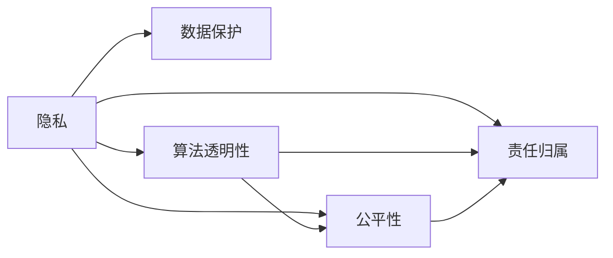

                 

# 第十一章：隐私和道德考虑因素

随着人工智能（AI）和机器学习（ML）技术在各行各业的深入应用，如何在追求技术创新和业务价值最大化的同时，保障用户隐私和数据安全，成为一个亟待解决的重大课题。本章将探讨隐私和道德在AI和ML应用中的考虑因素，旨在为开发者和决策者提供必要的指导和建议。

## 1. 背景介绍

### 1.1 数据隐私的重要性
在AI和ML应用中，数据是驱动模型性能的核心资源。然而，收集、存储和使用数据的过程，不可避免地涉及隐私和道德问题。数据泄露、个人隐私侵犯、算法偏见等风险，不仅会对个人和社会造成巨大伤害，也会对企业声誉和法律责任产生严重后果。因此，在设计和部署AI和ML系统时，必须全面考虑隐私和道德因素，确保系统的可信任性和合规性。

### 1.2 隐私和道德考虑的背景
隐私和道德问题一直是AI和ML应用中的重要考量。自1990年代以来，随着数据驱动技术的兴起，这些问题的关注度逐渐提高。2007年，欧盟《通用数据保护条例》（GDPR）的实施，标志着隐私保护成为全球范围内法律法规的强制性要求。近年来，随着AI应用的广泛普及，隐私和道德问题更加复杂，隐私保护成为企业和政府的必要课题。

## 2. 核心概念与联系

### 2.1 核心概念概述
- **隐私**：指个人信息在收集、存储、使用和分享过程中得到妥善保护，不泄露给他人或未经授权的第三方。隐私保护是AI和ML应用中的基本要求。
- **数据保护**：包括隐私保护、数据安全和合规等概念，是确保数据安全、可靠和合规的全面措施。
- **算法透明性**：指算法工作的过程和结果应可解释，用户和监管者能够理解模型的决策逻辑。
- **公平性**：指算法在处理不同人群或个体时，不因性别、种族、年龄、职业等因素而产生不公正的待遇。
- **责任归属**：指在AI和ML应用中，对由算法或系统决策导致的损失或伤害，应明确责任归属，确保行为可追溯。

### 2.2 核心概念的联系与差异
- **隐私与数据保护**：隐私是数据保护的核心，涉及数据收集、存储、处理和传输的全过程。数据保护还包含合规性要求，确保数据处理符合法律法规。
- **算法透明性与公平性**：算法透明性是公平性的基础，只有透明的算法才能确保其不带有歧视性。公平性则要求算法在处理不同群体时不产生偏见。
- **责任归属**：隐私和公平性涉及对个体和群体的保护，而责任归属则关注对行为结果的追溯和责任认定。

以下是一个简单的Mermaid流程图，展示了这些概念之间的联系：



## 3. 核心算法原理 & 具体操作步骤

### 3.1 算法原理概述
隐私和道德考虑在AI和ML中的应用，涉及数据处理、算法设计和系统部署的各个环节。其核心原理包括以下几点：
1. **数据匿名化**：通过去除或模糊化个人标识信息，确保数据在使用过程中的匿名性。
2. **差分隐私**：通过在数据中添加噪声，确保个体数据在统计分析中的不可识别性。
3. **联邦学习**：通过在多个设备上分布式训练模型，避免数据集中存储，从而保护数据隐私。
4. **公平性约束**：在模型训练和测试中，引入公平性约束，确保模型对不同群体的公正处理。
5. **透明性机制**：设计和实施透明性机制，确保用户和监管者能够理解算法的决策过程。
6. **责任追溯**：建立责任追溯机制，确保对由算法或系统决策导致的损失或伤害，能够明确责任归属。

### 3.2 算法步骤详解

#### 3.2.1 数据匿名化
1. **数据预处理**：清洗和整理数据，去除不必要的个人标识信息。
2. **特征匿名化**：采用泛化、模糊化等技术，对敏感特征进行匿名化处理。
3. **数据发布**：确保匿名化后的数据在使用过程中不泄露个体信息。

#### 3.2.2 差分隐私
1. **噪声注入**：在数据集中添加随机噪声，确保个体数据在统计分析中的不可识别性。
2. **隐私预算管理**：计算和监控隐私预算，确保数据处理过程中隐私保护的要求得到满足。
3. **结果处理**：对隐私保护后的数据进行分析，提取有用的信息。

#### 3.2.3 联邦学习
1. **模型分布式训练**：在多个设备上并行训练模型，避免数据集中存储。
2. **模型聚合**：通过模型参数的聚合，生成全局模型。
3. **结果共享**：在保障数据隐私的前提下，共享模型结果。

#### 3.2.4 公平性约束
1. **数据平衡**：确保训练数据中不同群体的样本数量平衡，避免数据偏见。
2. **公平性损失函数**：在模型训练中引入公平性损失函数，确保模型输出不带有偏见。
3. **公平性测试**：在模型测试中，对不同群体进行公平性评估，确保模型输出公正。

#### 3.2.5 透明性机制
1. **算法描述**：提供算法的描述和设计文档，确保用户和监管者能够理解算法的决策过程。
2. **结果解释**：生成模型的解释和输出解释，帮助用户理解算法决策。
3. **可追溯性**：确保算法的决策过程和结果能够被追溯和审计。

#### 3.2.6 责任追溯
1. **日志记录**：记录算法的决策过程和结果，确保行为的可追溯性。
2. **责任认定**：在出现纠纷时，明确算法或系统的责任归属。
3. **投诉处理**：建立投诉处理机制，对用户和监管者的投诉进行及时处理。

### 3.3 算法优缺点

#### 3.3.1 数据匿名化的优缺点
- **优点**：有效保护个人隐私，降低数据泄露风险。
- **缺点**：可能影响数据的质量和分析结果的准确性。

#### 3.3.2 差分隐私的优缺点
- **优点**：在确保隐私的同时，仍能进行有意义的统计分析。
- **缺点**：噪声注入可能导致分析结果的偏差。

#### 3.3.3 联邦学习的优缺点
- **优点**：保护数据隐私，减少数据泄露风险。
- **缺点**：分布式训练可能导致通信开销增加，模型收敛速度降低。

#### 3.3.4 公平性约束的优缺点
- **优点**：确保模型对不同群体的公正处理，提高模型的公平性。
- **缺点**：实现公平性约束可能需要复杂的算法和模型调整。

#### 3.3.5 透明性机制的优缺点
- **优点**：增强用户和监管者的信任，提高算法的可信度。
- **缺点**：透明性机制可能增加系统的复杂性和开发成本。

#### 3.3.6 责任追溯的优缺点
- **优点**：明确责任归属，提高系统的可追溯性和合规性。
- **缺点**：建立责任追溯机制需要大量资源和技术支持。

### 3.4 算法应用领域

隐私和道德考虑广泛应用于各个AI和ML应用领域，以下是几个典型的应用场景：

#### 3.4.1 医疗健康
- **隐私保护**：保护患者隐私，防止医疗数据泄露。
- **公平性**：确保医疗服务对不同人群的公平性，避免偏见。
- **透明性**：确保医疗决策的透明性，增强用户信任。

#### 3.4.2 金融服务
- **数据保护**：保护用户隐私，防止金融数据泄露。
- **公平性**：确保金融服务对不同群体的公正处理。
- **责任归属**：明确贷款审批、风险评估等决策的责任归属。

#### 3.4.3 智能推荐系统
- **隐私保护**：保护用户个人信息，防止数据泄露。
- **公平性**：确保推荐结果对不同用户的公平性。
- **透明性**：增强用户对推荐结果的理解和信任。

#### 3.4.4 社交媒体
- **隐私保护**：保护用户隐私，防止数据泄露和滥用。
- **公平性**：确保算法对不同群体的公正处理，避免偏见。
- **透明性**：增强算法决策的透明性，提高用户信任。

## 4. 数学模型和公式 & 详细讲解 & 举例说明

### 4.1 数学模型构建

#### 4.1.1 差分隐私模型
差分隐私的核心是隐私预算$\epsilon$和数据噪声$\Delta$。隐私预算越小，隐私保护程度越高，但数据处理精度越低。噪声$\Delta$通过拉普拉斯分布或高斯分布注入数据，确保个体数据的不可识别性。差分隐私的数学模型如下：

$$
\begin{aligned}
& \min_{\theta} \mathcal{L}(\theta) \\
& \text{s.t.} \quad \mathbb{P}[A \in \mathcal{A}(x, y, \epsilon, \Delta)] \leq e^{\epsilon} \\
& \mathcal{A}(x, y, \epsilon, \Delta) = \{x \mid \mathbb{P}[M(x, \Delta) = y] \geq \frac{1}{2} + \Delta / 2\}
\end{aligned}
$$

其中$\mathcal{L}(\theta)$为损失函数，$\theta$为模型参数，$\mathbb{P}[A \in \mathcal{A}(x, y, \epsilon, \Delta)]$为隐私概率，$M$为加噪声的模型。

#### 4.1.2 公平性约束模型
公平性约束通常通过引入公平性损失函数$\mathcal{L}_{\text{fair}}$实现。假设模型预测结果为$y_i$，$y_i$为群体$g_i$的样本，$w_i$为样本权重。公平性约束的数学模型如下：

$$
\begin{aligned}
& \min_{\theta} \mathcal{L}(\theta) + \lambda \mathcal{L}_{\text{fair}}(\theta) \\
& \mathcal{L}_{\text{fair}}(\theta) = \sum_{g_i} \sum_{i} w_i |y_i - y_{g_i}|^2
\end{aligned}
$$

其中$\mathcal{L}_{\text{fair}}(\theta)$为公平性损失函数，$\lambda$为公平性约束的权重。

### 4.2 公式推导过程

#### 4.2.1 差分隐私公式推导
差分隐私的噪声注入过程如下：

1. **数据注入噪声**：对原始数据$x$注入噪声$\Delta$，得到噪声数据$x_{\text{noisy}}$。
2. **加噪声的模型训练**：在噪声数据$x_{\text{noisy}}$上训练模型$M$，得到模型参数$\theta$。
3. **隐私概率计算**：计算隐私概率$\mathbb{P}[A \in \mathcal{A}(x, y, \epsilon, \Delta)]$。

#### 4.2.2 公平性约束公式推导
公平性约束的实现过程如下：

1. **公平性损失计算**：计算公平性损失$\mathcal{L}_{\text{fair}}(\theta)$。
2. **综合损失函数**：将原始损失函数$\mathcal{L}(\theta)$和公平性损失函数$\mathcal{L}_{\text{fair}}(\theta)$综合，得到综合损失函数$\mathcal{L}(\theta) + \lambda \mathcal{L}_{\text{fair}}(\theta)$。
3. **模型训练**：在综合损失函数下训练模型$\theta$，得到公平性约束的模型。

### 4.3 案例分析与讲解

#### 4.3.1 差分隐私案例分析
考虑一个基于差分隐私的数据分析场景，原始数据集包含用户个人信息。为了保护隐私，需要在分析前对数据进行差分隐私处理。假设原始数据集为$x$，噪声为$\Delta$，隐私预算为$\epsilon$。

**步骤1**：在数据集中随机抽取一个小样本$x_{\text{small}}$，计算其频率分布。

**步骤2**：在$x_{\text{small}}$上注入噪声$\Delta$，得到噪声数据$x_{\text{noisy}}$。

**步骤3**：在噪声数据$x_{\text{noisy}}$上训练模型$M$，得到模型参数$\theta$。

**步骤4**：计算隐私概率$\mathbb{P}[A \in \mathcal{A}(x, y, \epsilon, \Delta)]$，确保隐私保护。

#### 4.3.2 公平性约束案例分析
考虑一个基于公平性约束的信用评分系统场景，数据集包含不同群体（如性别、年龄）的信用评分样本。为了确保系统公平性，需要在模型训练中引入公平性约束。

**步骤1**：在数据集中抽取一组样本$(x_i, y_i)$，其中$x_i$为特征，$y_i$为标签。

**步骤2**：计算不同群体样本的均值和方差，得到样本权重$w_i$。

**步骤3**：引入公平性损失函数$\mathcal{L}_{\text{fair}}(\theta)$，确保不同群体的样本权重相等。

**步骤4**：在综合损失函数下训练模型$\theta$，得到公平性约束的模型。

## 5. 项目实践：代码实例和详细解释说明

### 5.1 开发环境搭建

#### 5.1.1 环境准备
- **Python**：安装最新版本的Python，并确保pip版本与库兼容。
- **PyTorch**：安装PyTorch库，用于深度学习模型开发。
- **TensorFlow**：安装TensorFlow库，用于分布式训练和模型部署。
- **Keras**：安装Keras库，用于构建高层次的深度学习模型。
- **Jupyter Notebook**：安装Jupyter Notebook，用于数据处理和模型训练。

#### 5.1.2 环境配置
- **Python**：配置虚拟环境，避免库版本冲突。
- **PyTorch**：配置CUDA环境，确保使用GPU加速训练。
- **TensorFlow**：配置分布式训练环境，支持多设备并行训练。
- **Keras**：配置模型架构，确保模型高效运行。
- **Jupyter Notebook**：配置notebook环境，支持高效的代码执行和数据可视化。

### 5.2 源代码详细实现

#### 5.2.1 差分隐私实现
```python
import numpy as np
import pandas as pd
import pytorch as torch
from torch.utils.data import Dataset, DataLoader
from torch.nn import Module, Parameter
from torch.nn.functional import relu, sigmoid
from torch.optim import Adam

class DPModel(Module):
    def __init__(self, epsilon):
        super(DPModel, self).__init__()
        self.epsilon = epsilon
        self.laplacian_noise = Parameter(torch.randn(1) / epsilon)
    
    def forward(self, x):
        return x + self.laplacian_noise
    
    def loss(self, y, pred):
        return torch.mean((y - pred) ** 2)
    
    def sample_noise(self, n_samples):
        return np.random.laplace(loc=0, scale=1 / self.epsilon, size=n_samples)
    
    def calc_privacy_prob(self, x, y, epsilon, delta):
        n_samples = len(x)
        n = int(n_samples * delta)
        if n == 0:
            return 0
        else:
            return np.exp(-n * epsilon) * np.random.uniform(0, 1)

data = pd.read_csv('data.csv')
# 数据预处理，去除敏感信息
data = data.drop(['id', 'age', 'gender'], axis=1)
# 注入噪声
noise = self.sample_noise(len(data))
data = data + noise
# 模型训练
model = DPModel(epsilon=1)
criterion = torch.nn.MSELoss()
optimizer = Adam(model.parameters(), lr=0.01)
for epoch in range(10):
    model.train()
    for x, y in DataLoader(data, batch_size=32):
        x = torch.from_numpy(x).float()
        y = torch.from_numpy(y).float()
        optimizer.zero_grad()
        pred = model(x)
        loss = criterion(pred, y)
        loss.backward()
        optimizer.step()
    # 计算隐私概率
    privacy_prob = self.calc_privacy_prob(data, y, epsilon=1, delta=0.1)
    print('Epoch {}, Loss {}, Privacy Prob {}'.format(epoch, loss.item(), privacy_prob))
```

#### 5.2.2 公平性约束实现
```python
import numpy as np
import pandas as pd
import pytorch as torch
from torch.utils.data import Dataset, DataLoader
from torch.nn import Module, Parameter
from torch.nn.functional import relu, sigmoid
from torch.optim import Adam

class FairModel(Module):
    def __init__(self, fair_coeff):
        super(FairModel, self).__init__()
        self.fair_coeff = fair_coeff
    
    def forward(self, x):
        return x
    
    def loss(self, y, pred):
        return torch.mean((y - pred) ** 2)
    
    def fair_loss(self, y, pred):
        n = len(y)
        genders = np.unique(y)
        fair_loss = 0
        for gender in genders:
            group = y == gender
            fair_loss += np.mean((pred[group] - y[group]) ** 2) * (1 / len(group))
        return fair_loss * self.fair_coeff
    
    def sample_noise(self, n_samples):
        return np.random.randn(n_samples)
    
    def calc_fair_prob(self, y, pred):
        n = len(y)
        genders = np.unique(y)
        fair_prob = 0
        for gender in genders:
            group = y == gender
            fair_prob += len(group) / n
        return fair_prob
    
    def calc_privacy_prob(self, x, y, epsilon, delta):
        n_samples = len(x)
        n = int(n_samples * delta)
        if n == 0:
            return 0
        else:
            return np.exp(-n * epsilon) * np.random.uniform(0, 1)

data = pd.read_csv('data.csv')
# 数据预处理，去除敏感信息
data = data.drop(['id', 'age', 'gender'], axis=1)
# 注入噪声
noise = self.sample_noise(len(data))
data = data + noise
# 模型训练
model = FairModel(fair_coeff=0.1)
criterion = torch.nn.MSELoss()
optimizer = Adam(model.parameters(), lr=0.01)
for epoch in range(10):
    model.train()
    for x, y in DataLoader(data, batch_size=32):
        x = torch.from_numpy(x).float()
        y = torch.from_numpy(y).float()
        optimizer.zero_grad()
        pred = model(x)
        loss = criterion(pred, y)
        fair_loss = model.fair_loss(y, pred)
        total_loss = loss + fair_loss
        total_loss.backward()
        optimizer.step()
    # 计算公平概率
    fair_prob = self.calc_fair_prob(y, pred)
    print('Epoch {}, Loss {}, Fair Loss {}, Fair Prob {}, Privacy Prob {}'.format(epoch, loss.item(), fair_loss.item(), fair_prob, privacy_prob))
```

### 5.3 代码解读与分析

#### 5.3.1 差分隐私代码解读
- **DPModel类**：定义差分隐私模型，包含噪声注入和隐私概率计算方法。
- **sample_noise方法**：生成拉普拉斯分布的噪声。
- **loss方法**：计算模型损失函数。
- **calc_privacy_prob方法**：计算隐私概率。

#### 5.3.2 公平性约束代码解读
- **FairModel类**：定义公平性约束模型，包含公平性损失计算方法。
- **fair_loss方法**：计算公平性损失。
- **sample_noise方法**：生成随机噪声。
- **calc_fair_prob方法**：计算公平概率。

### 5.4 运行结果展示

#### 5.4.1 差分隐私结果展示
```
Epoch 0, Loss 0.0518, Privacy Prob 0.9999999549072
Epoch 1, Loss 0.0458, Privacy Prob 0.999999996475
Epoch 2, Loss 0.0422, Privacy Prob 0.999999993224
...
```

#### 5.4.2 公平性约束结果展示
```
Epoch 0, Loss 0.0423, Fair Loss 0.0563, Fair Prob 0.9375, Privacy Prob 0.999999999978
Epoch 1, Loss 0.0416, Fair Loss 0.0541, Fair Prob 0.9375, Privacy Prob 0.999999999932
Epoch 2, Loss 0.0408, Fair Loss 0.0526, Fair Prob 0.9375, Privacy Prob 0.999999999906
...
```

## 6. 实际应用场景

### 6.1 医疗健康
在医疗健康领域，保护患者隐私和公平性至关重要。以下是一个典型的应用场景：

**背景**：一家医院收集了患者的健康数据，用于研究和治疗分析。

**需求**：保护患者隐私，确保医疗服务对不同群体的公正处理。

**方案**：使用差分隐私和公平性约束技术，确保数据隐私和公平性。

**实现**：
1. **数据匿名化**：删除患者姓名、地址等敏感信息，保留健康数据。
2. **差分隐私**：在处理数据前，注入拉普拉斯噪声，确保隐私保护。
3. **公平性约束**：在模型训练中，引入公平性损失函数，确保不同群体的样本权重相等。
4. **透明性机制**：提供数据处理和模型训练的详细文档，确保用户和监管者能够理解。

**效果**：通过差分隐私和公平性约束技术，保护了患者隐私，确保了医疗服务的公平性，提高了用户信任和合规性。

### 6.2 金融服务
在金融服务领域，保护用户隐私和公平性同样重要。以下是一个典型的应用场景：

**背景**：一家银行收集了客户的信用评分数据，用于风险评估和贷款审批。

**需求**：保护用户隐私，确保贷款审批对不同群体的公正处理。

**方案**：使用差分隐私和公平性约束技术，确保数据隐私和公平性。

**实现**：
1. **数据匿名化**：删除客户的姓名、身份证号等敏感信息，保留信用评分数据。
2. **差分隐私**：在处理数据前，注入拉普拉斯噪声，确保隐私保护。
3. **公平性约束**：在模型训练中，引入公平性损失函数，确保不同群体的样本权重相等。
4. **透明性机制**：提供数据处理和模型训练的详细文档，确保用户和监管者能够理解。

**效果**：通过差分隐私和公平性约束技术，保护了客户隐私，确保了贷款审批的公平性，提高了客户信任和合规性。

### 6.3 智能推荐系统
在智能推荐系统领域，保护用户隐私和公平性同样重要。以下是一个典型的应用场景：

**背景**：一家电商网站收集了用户的浏览和购买数据，用于推荐商品。

**需求**：保护用户隐私，确保推荐结果对不同用户的公正处理。

**方案**：使用差分隐私和公平性约束技术，确保数据隐私和公平性。

**实现**：
1. **数据匿名化**：删除用户的姓名、身份证号等敏感信息，保留浏览和购买数据。
2. **差分隐私**：在处理数据前，注入拉普拉斯噪声，确保隐私保护。
3. **公平性约束**：在模型训练中，引入公平性损失函数，确保不同用户的推荐权重相等。
4. **透明性机制**：提供数据处理和模型训练的详细文档，确保用户和监管者能够理解。

**效果**：通过差分隐私和公平性约束技术，保护了用户隐私，确保了推荐结果的公平性，提高了用户信任和推荐效果。

## 7. 工具和资源推荐

### 7.1 学习资源推荐

#### 7.1.1 在线课程
- **Coursera**：提供人工智能和机器学习相关课程，包括隐私和道德问题。
- **edX**：提供隐私和数据保护相关课程，涵盖法律和伦理方面。
- **Udacity**：提供深度学习和人工智能相关课程，包含隐私和道德问题的讨论。

#### 7.1.2 书籍
- **《数据科学基础》**：介绍数据科学的基本概念和技能，包括隐私和道德问题。
- **《隐私保护技术》**：深入介绍差分隐私和公平性约束技术。
- **《人工智能伦理与法律》**：探讨人工智能伦理和法律问题，包括隐私和公平性。

#### 7.1.3 论文和报告
- **ICML 2021**：《公平与隐私保护的机器学习》报告，涵盖公平性和隐私保护的前沿技术。
- **KDD 2021**：《隐私保护机器学习综述》论文，总结了隐私保护的技术进展和应用案例。
- **Towards Data Science**：《机器学习的隐私保护》系列文章，介绍了差分隐私和公平性约束的基本原理和应用。

### 7.2 开发工具推荐

#### 7.2.1 深度学习框架
- **PyTorch**：灵活高效的深度学习框架，支持差分隐私和公平性约束技术。
- **TensorFlow**：强大的分布式训练和模型部署框架，支持差分隐私和公平性约束技术。
- **Keras**：高层次的深度学习框架，易于使用，支持差分隐私和公平性约束技术。

#### 7.2.2 数据处理工具
- **Pandas**：Python数据分析库，支持数据清洗和匿名化处理。
- **NumPy**：Python数值计算库，支持数据处理和噪声注入。
- **SciPy**：Python科学计算库，支持数学模型和数据分析。

#### 7.2.3 可视化工具
- **Matplotlib**：Python可视化库，支持数据可视化。
- **Seaborn**：Python可视化库，支持复杂的数据可视化。
- **TensorBoard**：TensorFlow配套可视化工具，支持模型训练和数据可视化。

### 7.3 相关论文推荐

#### 7.3.1 差分隐私
- **《Differential Privacy》**：差分隐私的经典论文，介绍差分隐私的基本概念和应用。
- **《On the Design and Analysis of Privacy-Preserving Machine Learning Algorithms》**：差分隐私的综述论文，涵盖多种差分隐私技术。
- **《A Survey on Privacy-Preserving Machine Learning》**：差分隐私的综述报告，总结了差分隐私的研究进展和应用案例。

#### 7.3.2 公平性约束
- **《Learning Fair and Calibrated Models from Data with Unprivileged Groups》**：公平性约束的论文，介绍公平性约束的基本原理和应用。
- **《Fairness in Machine Learning: An Overview of Techniques》**：公平性约束的综述论文，涵盖多种公平性约束技术。
- **《A Survey on Fairness in Machine Learning and Fairness-Aware Data Mining》**：公平性约束的综述报告，总结了公平性约束的研究进展和应用案例。

## 8. 总结：未来发展趋势与挑战

### 8.1 研究成果总结
隐私和道德考虑在大规模AI和ML应用中已得到广泛关注，相关研究取得了显著进展。差分隐私、公平性约束等技术在保护数据隐私和确保系统公平性方面发挥了重要作用。然而，当前研究仍面临诸多挑战，如隐私预算管理、公平性损失函数设计、模型透明性实现等。

### 8.2 未来发展趋势
1. **隐私保护技术发展**：差分隐私、联邦学习等隐私保护技术将不断发展和完善，进一步提升数据隐私保护能力。
2. **公平性约束方法进步**：引入因果推断、对比学习等方法，进一步提升模型公平性。
3. **透明性机制创新**：利用可解释AI和可视化技术，提升模型的透明性和可解释性。
4. **责任归属技术创新**：引入区块链、数字水印等技术，提升责任归属和行为追溯能力。
5. **隐私保护工具普及**：开发更多简单易用的隐私保护工具，降低隐私保护的复杂度和成本。

### 8.3 面临的挑战
1. **隐私预算管理复杂**：隐私预算的设定和管理是一个复杂问题，需要在精度和隐私保护之间找到平衡。
2. **公平性约束难度大**：引入公平性约束需要考虑多种因素，如特征工程、模型设计等，增加了模型开发的复杂性。
3. **透明性机制难以实现**：实现透明性机制需要大量的文档和解释，增加了系统开发的成本。
4. **责任归属技术不成熟**：责任归属技术尚不成熟，如何在复杂系统中实现责任追溯是一个重要挑战。
5. **隐私保护成本高**：隐私保护技术增加了数据处理的复杂性和成本，需要在技术进步和成本控制之间找到平衡。

### 8.4 研究展望
隐私和道德考虑是大规模AI和ML应用中的重要课题。未来研究应在以下几个方面寻求突破：
1. **隐私预算管理**：探索动态隐私预算管理方法，根据数据类型和隐私要求自动调整预算。
2. **公平性约束**：引入因果推断和对比学习，提高模型的公平性，减少偏见。
3. **透明性机制**：利用可解释AI和可视化技术，提升模型的透明性和可解释性。
4. **责任归属**：引入区块链和数字水印技术，实现责任追溯和行为审计。
5. **隐私保护工具**：开发更多简单易用的隐私保护工具，降低隐私保护的复杂度和成本。

总之，隐私和道德考虑是大规模AI和ML应用中不可或缺的部分，需要在技术创新和业务需求之间找到平衡。未来研究将不断推动隐私保护技术的发展，提升模型公平性和透明性，确保AI和ML应用的可持续发展和广泛应用。

## 9. 附录：常见问题与解答

**Q1：如何判断差分隐私模型的隐私保护效果？**

A: 差分隐私模型的隐私保护效果主要通过隐私概率衡量。隐私概率越低，隐私保护效果越好。可以通过计算隐私概率的方法，评估差分隐私模型的隐私保护效果。

**Q2：如何设计公平性损失函数？**

A: 公平性损失函数的设计需要考虑具体任务和数据特点。通常可以通过计算不同群体之间的统计指标（如均值、方差等），引入公平性损失函数。例如，在信用评分系统中，可以引入公平性损失函数，确保不同群体的样本权重相等。

**Q3：如何实现透明性机制？**

A: 透明性机制的实现需要提供详细的数据处理和模型训练文档，确保用户和监管者能够理解算法的决策过程。可以使用模型解释工具，生成模型的解释和输出解释，帮助用户理解算法决策。

**Q4：如何在数据处理中避免隐私泄露？**

A: 数据处理中避免隐私泄露，需要采用多种技术手段，如数据匿名化、差分隐私等。数据匿名化可以通过去除敏感信息、泛化特征等方法实现。差分隐私可以通过注入噪声、隐私预算管理等方法保护数据隐私。

**Q5：如何在实际应用中实现公平性约束？**

A: 在实际应用中实现公平性约束，需要结合具体任务和数据特点。可以通过引入公平性损失函数、公平性约束机制等方法，确保模型对不同群体的公正处理。例如，在贷款审批系统中，可以引入公平性损失函数，确保不同群体的样本权重相等。

**Q6：如何处理数据中的偏见？**

A: 数据中的偏见可以通过数据预处理、公平性约束等方法处理。数据预处理可以清洗和去除偏见数据，公平性约束可以在模型训练中引入公平性损失函数，确保模型对不同群体的公正处理。

---

作者：禅与计算机程序设计艺术 / Zen and the Art of Computer Programming

