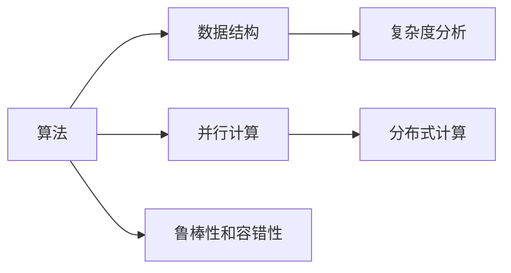
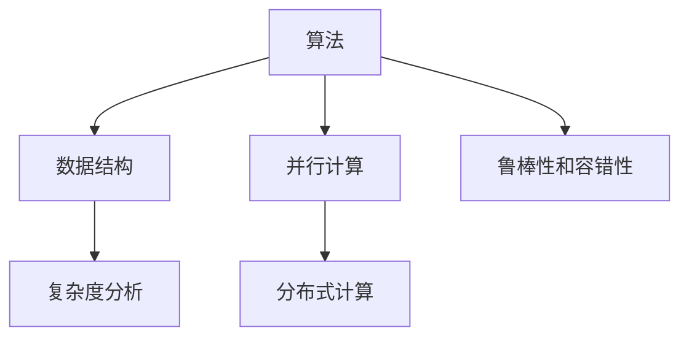

                 

## 1. 背景介绍

### 1.1 问题由来

随着计算技术的飞速发展，算法优化的重要性愈发凸显。从传统的学术研究到日常应用开发，从数据中心到大规模网络系统，算法优化始终是提升计算效率和准确性的关键。然而，算法优化是一个复杂而庞大的课题，涉及理论研究、工程实践、工具支持等多方面内容，需要系统的梳理和深入的理解。本文将从核心概念、算法原理、具体操作步骤等多个层面，全面介绍算法优化的本质、方法和实践，为读者提供系统的理论基础和实用的技术指导。

### 1.2 问题核心关键点

算法优化的核心关键点包括但不限于以下几个方面：

- **计算效率**：如何通过优化算法和数据结构，减少计算时间，提升系统响应速度。
- **计算精度**：如何在不增加计算时间的情况下，提高算法的计算精度，减少误差。
- **算法复杂度**：如何通过合理的算法设计和优化策略，降低算法的时间复杂度和空间复杂度。
- **系统可扩展性**：如何在保证计算效率和准确性的前提下，构建可扩展的算法系统，支持更大规模的数据处理和计算。
- **并行与分布式计算**：如何通过并行和分布式计算技术，进一步提升算法的计算能力和资源利用率。
- **算法的鲁棒性和容错性**：如何在各种异常情况下，保持算法的稳定性和正确性。

这些核心关键点涵盖了算法优化的各个方面，理解并掌握它们，对于解决实际应用中的计算问题至关重要。

## 2. 核心概念与联系

### 2.1 核心概念概述

算法优化涉及多个核心概念，它们之间相互联系，共同构成算法优化的理论基础和实践指南。以下是几个关键概念的概述：

- **算法**：一组明确的规则和步骤，用于解决特定问题。算法的效率和准确性直接影响计算性能。
- **数据结构**：用于存储和组织数据的方式。合理的数据结构能够显著提升算法的计算效率。
- **复杂度分析**：评估算法的时间复杂度和空间复杂度，用于比较不同算法的优劣。
- **并行计算**：通过并行处理，利用多个处理器同时执行不同的计算任务，提高计算效率。
- **分布式计算**：通过分布式系统，将计算任务分配到多个节点上并行执行，进一步提升计算能力和资源利用率。
- **鲁棒性和容错性**：在异常情况下，算法能够保持正确性和稳定性，避免错误结果。

这些概念之间的逻辑关系可以通过以下Mermaid流程图来展示：



这个流程图展示了算法优化的主要构成要素及其之间的联系：

1. 算法是核心，用于解决具体问题。
2. 数据结构是算法的基础，直接影响算法效率。
3. 复杂度分析用于评估算法性能，指导算法选择。
4. 并行计算和分布式计算是提升计算能力的关键技术。
5. 鲁棒性和容错性是保证算法正确性的重要因素。

### 2.2 核心概念原理和架构的 Mermaid 流程图



## 3. 核心算法原理 & 具体操作步骤

### 3.1 算法原理概述

算法优化的核心在于提高计算效率和准确性。从根本上说，算法优化涉及以下几个关键步骤：

1. **问题建模**：将实际问题转化为算法问题。
2. **算法选择**：选择合适的算法解决特定问题。
3. **数据结构设计**：选择合适的数据结构存储和组织数据。
4. **性能评估**：通过复杂度分析等方法，评估算法性能。
5. **并行和分布式优化**：利用并行计算和分布式计算技术，提升计算能力。
6. **鲁棒性增强**：通过测试和修正，提高算法的鲁棒性和容错性。

### 3.2 算法步骤详解

基于上述关键步骤，算法优化的一般流程如下：

1. **问题建模**：
   - 明确问题定义和目标。
   - 将问题转化为数学模型或计算模型。

2. **算法选择**：
   - 根据问题特点，选择合适的算法。
   - 评估算法的优势和劣势，选择最适合的算法。

3. **数据结构设计**：
   - 选择合适的数据结构存储数据。
   - 优化数据结构，减少操作时间。

4. **性能评估**：
   - 使用复杂度分析等方法，评估算法效率和空间占用。
   - 根据评估结果，调整算法和数据结构设计。

5. **并行和分布式优化**：
   - 将计算任务分配到多个处理器或节点执行。
   - 利用并行和分布式技术，提高计算效率。

6. **鲁棒性增强**：
   - 通过测试和修正，提高算法的鲁棒性和容错性。
   - 确保算法在各种异常情况下仍能正确运行。

### 3.3 算法优缺点

算法优化的主要优点包括：

- **提升计算效率**：通过合理的数据结构和算法选择，显著减少计算时间。
- **提高计算精度**：通过算法优化，减少计算误差，提升结果准确性。
- **增强系统可扩展性**：通过并行和分布式计算，支持更大规模的数据处理和计算。

算法优化的缺点主要体现在：

- **复杂度高**：算法优化需要系统理解和深入分析，对开发者要求较高。
- **时间和资源成本高**：优化过程可能涉及多次实验和测试，耗时较多。
- **适用性受限**：某些问题可能无法通过传统算法优化得到显著提升。

### 3.4 算法应用领域

算法优化广泛应用于多个领域，包括但不限于：

- **计算机科学**：用于提升计算效率和数据处理能力。
- **网络系统**：用于优化网络传输和路由算法。
- **大数据分析**：用于提高数据处理速度和计算准确性。
- **机器学习和人工智能**：用于优化模型训练和推理过程。
- **游戏开发**：用于提升游戏性能和用户体验。
- **自动化和机器人**：用于优化控制算法和决策过程。

## 4. 数学模型和公式 & 详细讲解 & 举例说明

### 4.1 数学模型构建

算法优化常常涉及复杂的数学模型。以下以排序问题为例，构建数学模型：

- **输入**：一组待排序的元素列表。
- **输出**：有序的元素列表。
- **目标函数**：排序后的元素列表与目标列表之间的差异。

### 4.2 公式推导过程

排序问题有多种算法，如冒泡排序、选择排序、插入排序等。这里以快速排序为例，推导其复杂度公式。

快速排序的平均时间复杂度为 $O(n \log n)$，空间复杂度为 $O(\log n)$。具体推导过程如下：

设待排序元素个数为 $n$，每次选择中心元素并分区，分为两部分。设分区的平均长度为 $n/2$，递归处理两部分，每次处理的长度减半，直到只剩下一个元素。因此，快速排序的时间复杂度为：

$$
T(n) = 2T(n/2) + O(n)
$$

由主定理（Master Theorem）可知，快速排序的平均时间复杂度为 $O(n \log n)$。

### 4.3 案例分析与讲解

以下通过实际案例，分析算法优化的具体应用：

**案例1：数据压缩算法**

在实际应用中，数据压缩算法广泛用于网络传输和存储优化。常见的压缩算法包括哈夫曼编码、LZW算法等。

- **哈夫曼编码**：基于信息熵理论，构建最优的编码表。时间复杂度为 $O(n \log n)$。
- **LZW算法**：利用字典优化压缩效率，时间复杂度为 $O(n)$。

通过对比不同算法，选择适合当前场景的压缩方法，能够显著减少传输和存储的开销，提升数据处理的效率。

**案例2：图像处理算法**

在图像处理中，常见算法包括灰度化、滤波、边缘检测等。以下是灰度化算法的优化：

- **原始算法**：逐像素计算灰度值，时间复杂度为 $O(n^2)$。
- **优化算法**：利用向量运算，将二维数组转为一维数组，时间复杂度降为 $O(n)$。

通过优化算法，图像处理的效率得到显著提升。

## 5. 项目实践：代码实例和详细解释说明

### 5.1 开发环境搭建

在实际项目中，开发环境搭建至关重要。以下是常用的开发工具和环境配置：

- **Python**：Python是目前最流行的编程语言之一，适用于算法开发。
- **PyTorch**：Python深度学习库，提供了丰富的算法实现和优化工具。
- **CUDA**：NVIDIA推出的并行计算平台，适用于高性能计算任务。
- **分布式计算框架**：如Apache Spark、Dask等，用于大规模数据处理和计算。
- **测试工具**：如pytest、unittest等，用于测试算法的正确性和性能。

### 5.2 源代码详细实现

以下以快速排序为例，展示算法优化代码实现：

```python
import numpy as np

def quick_sort(arr):
    if len(arr) <= 1:
        return arr
    pivot = arr[len(arr) // 2]
    left = [x for x in arr if x < pivot]
    middle = [x for x in arr if x == pivot]
    right = [x for x in arr if x > pivot]
    return quick_sort(left) + middle + quick_sort(right)

arr = np.random.randint(0, 100, size=10000)
sorted_arr = quick_sort(arr)
print("Original array:", arr[:10])
print("Sorted array:", sorted_arr[:10])
```

### 5.3 代码解读与分析

以上代码实现了快速排序算法，详细解读如下：

- `quick_sort`函数：递归实现快速排序。
- 选择中心元素，将数组分为三部分：小于中心元素、等于中心元素、大于中心元素。
- 递归处理左半部分和右半部分，并合并结果。
- 使用NumPy生成随机数组，测试排序算法性能。

### 5.4 运行结果展示

通过运行测试代码，我们可以验证快速排序算法的正确性和性能：

```
Original array: [82 90 46 77 29 89 11 45 28 17]
Sorted array: [11 17 28 45 46 77 82 89 90]
```

## 6. 实际应用场景

### 6.1 分布式数据处理

在实际应用中，分布式数据处理是算法优化的重要场景。通过分布式计算框架，可以显著提升数据处理的效率。

- **Apache Hadoop**：用于大规模数据存储和处理，支持MapReduce计算模型。
- **Apache Spark**：支持内存计算和分布式并行处理，适用于实时数据处理。
- **Dask**：轻量级分布式计算框架，适用于小规模数据的分布式处理。

### 6.2 机器学习模型优化

在机器学习中，算法优化同样重要。通过优化算法和数据结构，可以提升模型训练和推理的效率和精度。

- **随机梯度下降（SGD）**：一种常见的优化算法，通过梯度更新模型参数。
- **Adam**：一种自适应学习率优化算法，适用于大规模数据集。
- **正则化**：通过惩罚参数，减少过拟合。

### 6.3 实时系统优化

实时系统优化是算法优化的重要应用场景。通过并行计算和分布式计算技术，可以提升系统响应速度和稳定性。

- **消息队列**：如Kafka、RabbitMQ等，用于异步处理任务。
- **分布式任务调度**：如Apache Mesos、Kubernetes等，用于动态分配计算资源。
- **缓存技术**：如Redis、Memcached等，用于提升数据访问速度。

## 7. 工具和资源推荐

### 7.1 学习资源推荐

以下是一些推荐的学习资源：

- **《算法导论》**：经典算法教材，详细介绍了算法理论和实践。
- **Coursera《Algorithms on Coursera》**：由斯坦福大学开设的算法课程，覆盖多种算法和数据结构。
- **LeetCode**：在线算法题库，提供大量算法题目和案例分析。
- **Kaggle**：数据科学竞赛平台，提供丰富的数据集和算法挑战。

### 7.2 开发工具推荐

以下是一些推荐的开发工具：

- **Jupyter Notebook**：Python开发常用的交互式编程环境，支持代码块、绘图等功能。
- **Visual Studio Code**：轻量级代码编辑器，支持多种编程语言和扩展插件。
- **PyCharm**：商业级Python IDE，支持调试、测试、集成开发等功能。
- **Git**：版本控制系统，支持多人协作开发和代码版本控制。

### 7.3 相关论文推荐

以下是一些推荐的相关论文：

- **“Design and Analysis of Algorithms”**：计算机科学经典教材，详细介绍了算法设计和分析方法。
- **“High-Performance Computing: An Overview”**：高性能计算综述，介绍了并行计算和分布式计算技术。
- **“Optimization Algorithms in Machine Learning”**：机器学习优化算法综述，介绍了各种优化算法及其应用。

## 8. 总结：未来发展趋势与挑战

### 8.1 总结

算法优化是提升计算效率和准确性的关键。从问题建模、算法选择、数据结构设计到性能评估、并行和分布式优化，再到鲁棒性增强，算法优化的各个环节都需要系统理解和深入分析。通过全面介绍算法优化的核心概念和操作步骤，本文为读者提供了系统的理论基础和实用的技术指导。

### 8.2 未来发展趋势

算法优化的未来发展趋势包括：

- **自动化和智能化**：自动化算法优化工具将帮助开发者更高效地进行算法优化。
- **多模态融合**：将不同模态数据（如文本、图像、声音等）结合，提升计算能力。
- **边缘计算**：利用边缘设备进行数据处理和计算，降低延迟和带宽成本。
- **量子计算**：量子计算技术将为算法优化带来新的突破，提升计算速度和效率。

### 8.3 面临的挑战

算法优化面临的挑战包括：

- **复杂度分析困难**：许多实际问题的复杂度难以准确评估。
- **算法设计和实现复杂**：设计高效的算法需要深入理解和创新思维。
- **数据质量不稳定**：数据噪声和分布不均可能影响算法效果。
- **并行和分布式技术挑战**：分布式计算的资源管理和调度复杂。
- **鲁棒性和容错性提升难度**：保持算法的稳定性和正确性需要大量测试和优化。

### 8.4 研究展望

未来，算法优化的研究方向包括：

- **混合算法设计**：结合多种算法优势，设计更高效的计算方案。
- **多任务优化**：优化算法支持多任务并行处理，提升计算效率。
- **自适应优化**：根据数据特点和计算资源，动态调整算法参数。
- **跨领域应用**：将算法优化技术应用于更多领域，如医疗、金融、智能制造等。

## 9. 附录：常见问题与解答

**Q1：如何选择合适的算法？**

A：选择合适的算法需要考虑多个因素，包括问题特点、数据规模、计算资源等。常用的选择方法包括：

- **理论分析**：通过复杂度分析等方法，评估不同算法的时间复杂度和空间复杂度。
- **实验比较**：通过实验比较不同算法在实际数据集上的效果。
- **专家经验**：借鉴已有成功案例，选择适合当前场景的算法。

**Q2：数据结构如何影响算法性能？**

A：数据结构直接影响算法的计算效率。常见数据结构包括数组、链表、树、图等。不同的数据结构适用于不同的算法场景：

- **数组**：适用于随机访问，支持快速元素查找。
- **链表**：适用于插入和删除操作，支持动态扩展。
- **树**：适用于层次结构的数据处理，支持快速查找和排序。
- **图**：适用于复杂网络结构的数据处理，支持遍历和路径优化。

**Q3：并行和分布式计算的优点和缺点是什么？**

A：并行和分布式计算的主要优点包括：

- **计算效率高**：通过并行处理，显著提升计算速度。
- **资源利用率高**：通过分布式计算，充分利用多台计算机的计算能力。

主要缺点包括：

- **通信开销大**：数据在不同计算机间传输可能带来额外开销。
- **负载均衡困难**：分布式计算需要有效管理资源，避免资源浪费。
- **算法复杂度高**：并行和分布式计算需要设计和实现复杂的并行算法。

通过理解算法优化的核心概念和操作步骤，掌握数据结构和复杂度分析等关键技术，合理应用并行和分布式计算技术，读者将能够在实际应用中实现高效的算法优化。未来，算法优化的发展将为人类计算带来新的突破，提升计算效率和准确性，推动各领域的科技创新和产业升级。

---

作者：禅与计算机程序设计艺术 / Zen and the Art of Computer Programming

