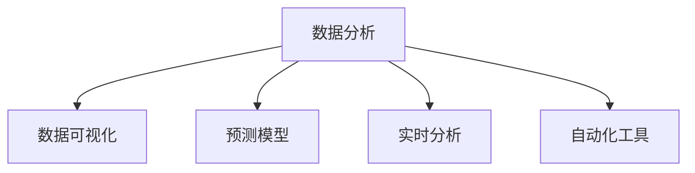

                 

# 管理者如何应对快速变化的商业环境

在当今快速变化的商业环境中，管理者需要具备灵活应对和快速决策的能力，以确保企业能够适应市场的动态变化，并持续创新以保持竞争力。本文将从核心概念、算法原理、实际应用和未来展望等方面，深入探讨管理者如何利用数据分析和机器学习技术，来应对和利用商业环境中的不确定性和复杂性。

## 1. 背景介绍

### 1.1 问题由来

在数字化时代，商业环境中的变化速度前所未有。消费者需求不断变化，竞争对手策略难以捉摸，技术更新迭代迅速。管理者需要具备洞察市场趋势、预测未来变化的能力，并迅速调整企业策略以应对这些变化。

### 1.2 问题核心关键点

管理者应对快速变化商业环境的核心挑战包括：
- 数据驱动决策：利用数据洞察市场趋势和消费者行为。
- 实时分析与监控：监控企业关键指标，快速响应市场变化。
- 模型预测与优化：构建预测模型，优化决策流程。
- 智能自动化：利用自动化工具提高运营效率，释放管理者的注意力。

### 1.3 问题研究意义

通过数据分析和机器学习技术，管理者可以更加科学地做出决策，减少人为错误，提高效率和准确性。这不仅有助于应对快速变化的商业环境，还能推动企业不断创新，提升市场竞争力。

## 2. 核心概念与联系

### 2.1 核心概念概述

为更好地理解如何利用数据分析和机器学习技术应对商业环境变化，本节将介绍几个密切相关的核心概念：

- 数据分析（Data Analysis）：通过收集、处理和分析数据，提取有价值的信息和洞见，以支持决策。
- 数据可视化（Data Visualization）：将数据转换为直观的图表和图形，帮助管理者理解和沟通数据。
- 预测模型（Predictive Modeling）：利用历史数据构建模型，预测未来趋势和事件。
- 实时分析（Real-time Analytics）：实时监控和分析数据流，及时响应变化。
- 自动化工具（Automation Tools）：自动化执行重复性任务，提高效率和准确性。

这些核心概念之间的逻辑关系可以通过以下Mermaid流程图来展示：



这个流程图展示数据分析、数据可视化、预测模型、实时分析和自动化工具之间的关系：

1. 数据分析是从数据中提取有价值信息的基础步骤。
2. 数据可视化将数据分析结果转化为易于理解的图形，便于决策者理解。
3. 预测模型利用历史数据预测未来趋势，辅助决策。
4. 实时分析监控数据流，及时响应变化。
5. 自动化工具执行重复性任务，提高效率。

这些概念共同构成了管理者应对快速变化商业环境的技术框架，使管理者能够更加科学地做出决策。

## 3. 核心算法原理 & 具体操作步骤

### 3.1 算法原理概述

数据分析和机器学习技术在商业环境中的应用，主要是通过构建和优化预测模型来实现的。预测模型的核心思想是通过历史数据和特征，构建模型来预测未来的趋势和事件。以下是一些常用的预测模型及其基本原理：

- 线性回归（Linear Regression）：预测连续变量，模型形式简单，易于理解和实现。
- 逻辑回归（Logistic Regression）：预测二分类变量，适用于解释和预测变量之间的关系。
- 决策树（Decision Trees）：通过树形结构分解数据，易于解释和理解。
- 随机森林（Random Forest）：多个决策树的集成，提高模型的稳定性和准确性。
- 支持向量机（Support Vector Machines, SVM）：在高维空间中寻找最优超平面，适用于分类和回归问题。
- 深度学习模型（Deep Learning Models）：如神经网络（Neural Networks）和卷积神经网络（Convolutional Neural Networks, CNNs），能够处理复杂非线性关系，适用于大规模数据集。

### 3.2 算法步骤详解

构建和优化预测模型的步骤如下：

**Step 1: 数据收集与预处理**

- 收集相关历史数据，确保数据质量和多样性。
- 数据清洗和预处理，包括缺失值填充、异常值检测和处理、特征工程等。

**Step 2: 特征选择与提取**

- 选择与预测目标相关的特征。
- 通过降维、组合和生成等技术提取特征。

**Step 3: 模型构建**

- 选择合适的模型架构，如线性模型、树模型、神经网络等。
- 确定模型参数，如学习率、正则化强度、隐藏层数量等。

**Step 4: 模型训练与验证**

- 使用训练集训练模型，最小化预测误差。
- 在验证集上评估模型性能，调整参数以避免过拟合。

**Step 5: 模型应用与优化**

- 将训练好的模型应用到实时数据中，进行预测和监控。
- 定期更新模型，重新训练以适应新的数据和趋势。

### 3.3 算法优缺点

数据分析和机器学习技术在商业环境中的应用，具有以下优点：
- 自动化程度高：减少人为错误，提高效率和准确性。
- 数据驱动决策：基于数据洞察做出决策，科学合理。
- 预测未来趋势：通过历史数据预测未来，提前做好准备。

同时，这些技术也存在一定的局限性：
- 数据质量要求高：需要高质量、完整的数据支持。
- 模型复杂度高：构建和优化复杂模型需要专业知识和经验。
- 对技术依赖强：需要掌握相关的技术和工具。

尽管存在这些局限性，但就目前而言，数据分析和机器学习技术仍是商业决策中不可或缺的工具。管理者应充分利用这些技术的优势，克服其局限性，以更好地应对快速变化的商业环境。

### 3.4 算法应用领域

数据分析和机器学习技术在商业环境中的应用，涵盖了多个领域，包括：

- 市场分析：利用数据分析市场趋势，制定营销策略。
- 客户关系管理：通过分析客户数据，提升客户满意度和忠诚度。
- 供应链管理：监控供应链数据，优化物流和库存管理。
- 风险管理：利用预测模型识别和防范风险，保护企业利益。
- 产品开发：通过市场和用户数据，指导产品设计和改进。
- 财务分析：分析财务数据，优化投资决策和成本控制。

这些应用领域展示了数据分析和机器学习技术在商业环境中的广泛适用性，为管理者提供了科学决策的依据。

## 4. 数学模型和公式 & 详细讲解 & 举例说明

### 4.1 数学模型构建

本文以线性回归模型为例，介绍如何构建和优化预测模型。

假设有一组历史数据集 $D=\{(x_i,y_i)\}_{i=1}^N$，其中 $x_i$ 为输入特征，$y_i$ 为输出目标。线性回归模型的目标是找到一条线性关系 $y=\beta_0+\beta_1x_1+\beta_2x_2+\ldots+\beta_nx_n$，使得模型对数据集 $D$ 的预测误差最小化。

### 4.2 公式推导过程

线性回归模型的目标函数为：

$$
\min_{\beta} \sum_{i=1}^N (y_i - \hat{y}_i)^2
$$

其中 $\hat{y}_i=\beta_0+\beta_1x_{i1}+\beta_2x_{i2}+\ldots+\beta_nx_{in}$ 为模型对样本 $i$ 的预测值。

使用最小二乘法求解上述优化问题，得到模型的系数：

$$
\beta=(X^TX)^{-1}X^Ty
$$

其中 $X=\begin{bmatrix}1 & x_{11} & x_{12} & \ldots & x_{1n} \\ 1 & x_{21} & x_{22} & \ldots & x_{2n} \\ \vdots & \vdots & \vdots & \ddots & \vdots \\ 1 & x_{N1} & x_{N2} & \ldots & x_{Nn} \end{bmatrix}$ 为设计矩阵，$y=\begin{bmatrix}y_1 \\ y_2 \\ \vdots \\ y_N \end{bmatrix}$ 为输出向量。

### 4.3 案例分析与讲解

假设有一家电商企业，希望通过数据分析来预测下一季度的销售额。企业收集了过去五年的销售额数据，以及节假日、季节性变化等因素。

**Step 1: 数据收集与预处理**

- 收集过去五年的销售额数据，以及相关节假日、季节性变化等特征。
- 数据清洗和预处理，包括缺失值填充、异常值检测和处理、特征工程等。

**Step 2: 特征选择与提取**

- 选择销售额、节假日、季节性变化等与预测目标相关的特征。
- 将季节性变化等周期性特征进行分解，转化为线性可用的特征。

**Step 3: 模型构建**

- 选择线性回归模型，作为预测下一季度销售额的工具。
- 确定模型参数，如学习率、正则化强度等。

**Step 4: 模型训练与验证**

- 使用过去五年的数据训练模型，最小化预测误差。
- 在验证集上评估模型性能，调整参数以避免过拟合。

**Step 5: 模型应用与优化**

- 将训练好的模型应用到实时数据中，进行下一季度的销售额预测。
- 定期更新模型，重新训练以适应新的数据和趋势。

## 5. 项目实践：代码实例和详细解释说明

### 5.1 开发环境搭建

在进行数据分析和机器学习实践前，我们需要准备好开发环境。以下是使用Python进行Scikit-learn开发的环境配置流程：

1. 安装Anaconda：从官网下载并安装Anaconda，用于创建独立的Python环境。

2. 创建并激活虚拟环境：
```bash
conda create -n sklearn-env python=3.8 
conda activate sklearn-env
```

3. 安装Scikit-learn：使用pip或conda安装Scikit-learn库，包括需要的依赖包。

```bash
pip install scikit-learn
```

4. 安装各类工具包：
```bash
pip install numpy pandas matplotlib seaborn scikit-image
```

完成上述步骤后，即可在`sklearn-env`环境中开始数据分析和机器学习实践。

### 5.2 源代码详细实现

以下是使用Scikit-learn进行线性回归模型构建的Python代码实现：

```python
import pandas as pd
import numpy as np
from sklearn.linear_model import LinearRegression
from sklearn.model_selection import train_test_split
from sklearn.metrics import mean_squared_error, r2_score

# 加载数据集
data = pd.read_csv('sales_data.csv')

# 数据预处理
X = data.drop(['销售额'], axis=1)
y = data['销售额']

# 划分训练集和验证集
X_train, X_val, y_train, y_val = train_test_split(X, y, test_size=0.2, random_state=42)

# 构建线性回归模型
model = LinearRegression()

# 训练模型
model.fit(X_train, y_train)

# 验证模型
y_pred = model.predict(X_val)
mse = mean_squared_error(y_val, y_pred)
r2 = r2_score(y_val, y_pred)

print(f'验证集的MSE: {mse:.2f}, R^2: {r2:.2f}')
```

以上代码展示了使用Scikit-learn进行线性回归模型构建的基本流程。可以看到，使用Scikit-learn进行模型构建和优化，只需几行代码，非常方便。

### 5.3 代码解读与分析

让我们再详细解读一下关键代码的实现细节：

**数据加载和预处理**：
- `data.read_csv('sales_data.csv')`：加载数据集。
- `X.drop(['销售额'], axis=1)`：从特征中移除目标变量。
- `X_train, X_val, y_train, y_val = train_test_split(X, y, test_size=0.2, random_state=42)`：将数据集分为训练集和验证集。

**模型构建**：
- `model = LinearRegression()`：创建线性回归模型对象。
- `model.fit(X_train, y_train)`：使用训练集数据训练模型。

**模型验证**：
- `y_pred = model.predict(X_val)`：使用验证集数据进行预测。
- `mean_squared_error(y_val, y_pred)`：计算均方误差。
- `r2_score(y_val, y_pred)`：计算决定系数，衡量模型的拟合效果。

**结果输出**：
- `print(f'验证集的MSE: {mse:.2f}, R^2: {r2:.2f}')`：输出模型的均方误差和决定系数。

通过以上代码，可以看出Scikit-learn的简洁和易用性，使得数据分析和机器学习模型的构建变得非常直观。开发者可以根据具体需求，进一步拓展和优化模型。

## 6. 实际应用场景

### 6.1 电商销售额预测

电商企业可以通过销售额预测来优化库存管理，减少过剩或短缺，提升客户满意度。利用历史销售数据和相关特征，构建线性回归模型，可以准确预测未来销售趋势，帮助企业制定库存采购计划。

**具体实现**：
- 收集历史销售数据，包括销售额、季节性变化、节假日等因素。
- 进行数据预处理，包括缺失值填充、异常值检测和处理、特征工程等。
- 构建线性回归模型，利用过去五年的数据进行训练。
- 在验证集上评估模型性能，调整参数以避免过拟合。
- 将训练好的模型应用到实时数据中，进行下一季度销售额预测。

**结果展示**：
- 输出验证集的均方误差和决定系数，评估模型性能。
- 根据模型预测结果，优化库存管理。

### 6.2 客户流失预测

客户流失是企业面临的重要问题，及时预测客户流失可以提前采取措施，降低流失率。利用客户行为数据，如购买频率、满意度等，构建逻辑回归模型，可以预测客户流失的概率。

**具体实现**：
- 收集客户行为数据，包括购买频率、满意度、反馈信息等。
- 进行数据预处理，包括缺失值填充、异常值检测和处理、特征工程等。
- 构建逻辑回归模型，利用历史数据进行训练。
- 在验证集上评估模型性能，调整参数以避免过拟合。
- 将训练好的模型应用到实时数据中，进行客户流失预测。

**结果展示**：
- 输出验证集的分类准确率、召回率和F1分数，评估模型性能。
- 根据模型预测结果，制定客户保留策略。

## 7. 工具和资源推荐

### 7.1 学习资源推荐

为了帮助开发者系统掌握数据分析和机器学习理论基础和实践技巧，这里推荐一些优质的学习资源：

1. 《Python数据分析与机器学习实战》：涵盖数据预处理、特征工程、模型构建与评估等基本概念和技巧。
2. 《机器学习实战》：介绍Scikit-learn、TensorFlow等主流机器学习库的使用方法。
3. 《深度学习》课程：斯坦福大学机器学习课程，深入讲解深度学习理论和实践。
4. Kaggle：提供大量数据集和竞赛，帮助开发者实践和应用数据分析和机器学习技术。
5. Coursera：提供多门数据分析和机器学习相关的课程，涵盖从入门到高级的内容。

通过对这些资源的学习实践，相信你一定能够快速掌握数据分析和机器学习技术的精髓，并用于解决实际的商业问题。

### 7.2 开发工具推荐

高效的开发离不开优秀的工具支持。以下是几款用于数据分析和机器学习开发的常用工具：

1. Python：普及度高的编程语言，拥有丰富的数据分析和机器学习库。
2. R：统计分析的常用语言，适合数据处理和可视化。
3. Scikit-learn：基于Python的机器学习库，包含多种经典算法和工具。
4. TensorFlow：由Google主导开发的深度学习框架，支持大规模模型训练和推理。
5. Keras：基于TensorFlow等框架的高级API，便于模型构建和优化。
6. Jupyter Notebook：交互式的数据分析和机器学习环境，方便编写和分享代码。

合理利用这些工具，可以显著提升数据分析和机器学习任务的开发效率，加快创新迭代的步伐。

### 7.3 相关论文推荐

数据分析和机器学习技术的发展源于学界的持续研究。以下是几篇奠基性的相关论文，推荐阅读：

1. 《On the Shoulders of Giants: The Quest for General Human Intelligence through Planning》：提出AlphaGo，展示了机器学习在博弈论领域的突破。
2. 《Deep Learning》：深度学习领域的经典教材，详细介绍了深度学习理论和技术。
3. 《Python for Data Analysis》：数据科学领域的畅销书籍，介绍了Python在数据处理和分析中的应用。
4. 《Machine Learning Yearning》：Andrew Ng的实战指南，涵盖机器学习模型的构建和优化。
5. 《The Elements of Statistical Learning》：统计学习领域的经典教材，介绍了各种机器学习算法和应用。

这些论文代表了大数据分析和机器学习技术的发展脉络。通过学习这些前沿成果，可以帮助研究者把握学科前进方向，激发更多的创新灵感。

## 8. 总结：未来发展趋势与挑战

### 8.1 总结

本文对如何利用数据分析和机器学习技术应对快速变化的商业环境进行了全面系统的介绍。首先阐述了数据分析和机器学习技术在商业环境中的应用背景和核心挑战，明确了这些技术在决策支持、风险管理、客户关系管理等方面的重要作用。其次，从算法原理到实际操作，详细讲解了线性回归模型的构建和优化步骤，给出了具体的代码实现和结果分析。同时，本文还广泛探讨了数据分析和机器学习技术在电商、客户流失预测等商业场景中的应用，展示了其广泛适用性。

通过本文的系统梳理，可以看到，数据分析和机器学习技术在商业环境中的应用前景广阔，是管理者应对快速变化的重要工具。未来，伴随技术的不断进步和应用场景的拓展，这些技术必将在商业决策中发挥更加重要的作用。

### 8.2 未来发展趋势

展望未来，数据分析和机器学习技术在商业环境中的应用，将呈现以下几个发展趋势：

1. 自动化程度提高。随着技术的发展，自动化工具和平台将变得更加智能，能够自动完成数据清洗、特征工程、模型构建和优化等步骤。

2. 实时分析能力增强。大数据和云计算技术的普及，使得实时数据流的处理和分析成为可能。实时分析将帮助管理者更快速地响应市场变化。

3. 多模态数据融合。数据来源和形式日益多样化，管理者需要处理文本、图像、视频等多种类型的数据，以获得更全面的洞见。

4. 深度学习模型广泛应用。深度学习模型在处理复杂非线性关系方面具有优势，未来将在更多商业场景中得到应用。

5. 强化学习融合。强化学习能够通过与环境的交互学习最优策略，未来将与数据分析和机器学习技术相结合，推动智能决策系统的进步。

6. 决策支持系统普及。数据分析和机器学习技术将融入决策支持系统，帮助管理者做出科学合理的决策。

以上趋势凸显了数据分析和机器学习技术的广阔前景，这些方向的探索发展，必将进一步提升商业决策的科学性和准确性。

### 8.3 面临的挑战

尽管数据分析和机器学习技术已经取得了瞩目成就，但在迈向更加智能化、普适化应用的过程中，仍面临诸多挑战：

1. 数据质量和隐私问题。高质量的数据是数据分析和机器学习的基础，但数据收集和处理过程中可能存在隐私和数据安全问题。

2. 模型复杂度高。构建复杂模型需要专业知识和经验，对数据科学家的要求较高。

3. 模型解释性和透明性不足。机器学习模型往往被视为"黑盒"，难以解释其内部工作机制和决策逻辑。

4. 技术门槛高。数据分析和机器学习技术需要掌握多种工具和技能，对管理者的技术能力提出了更高要求。

尽管存在这些挑战，但数据分析和机器学习技术在商业决策中的潜力巨大。管理者应充分利用这些技术的优势，克服其局限性，以更好地应对快速变化的商业环境。

### 8.4 研究展望

面向未来，数据分析和机器学习技术的研究将围绕以下几个方向进行：

1. 提升模型可解释性和透明性。通过引入因果分析和可解释性方法，使模型决策过程更加透明和可理解。

2. 探索模型自动构建和优化技术。开发更加智能化的模型构建和优化平台，降低技术门槛，提升开发效率。

3. 融合多模态数据源。研究和开发多模态数据融合技术，提升数据利用率和模型性能。

4. 强化学习与决策系统的结合。通过强化学习技术，优化决策支持系统的策略，提升决策的科学性和准确性。

5. 大数据与云计算的融合。利用云计算和大数据技术，实现实时数据分析和处理，提升决策效率。

这些研究方向的探索，必将推动数据分析和机器学习技术在商业环境中的应用深入发展，为管理者的决策提供更科学、更可靠的支持。

## 9. 附录：常见问题与解答

**Q1：数据分析和机器学习技术是否适用于所有商业环境？**

A: 数据分析和机器学习技术在大多数商业环境都能取得不错的效果，特别是对于数据量较大、规律性较强的场景。但对于一些特定的行业，如金融、医疗等，需要更加谨慎和专业的处理方式。

**Q2：如何选择合适的特征进行建模？**

A: 选择合适的特征是构建准确模型的关键。通常需要经过多次试验和验证，确定对预测目标有显著影响的特征。同时可以参考领域知识和专家经验，选择最有意义的特征。

**Q3：如何避免模型过拟合？**

A: 避免模型过拟合的主要方法包括：
1. 增加训练数据量，使模型能够学习到更多的数据规律。
2. 使用正则化技术，如L2正则、Dropout等，减少模型的复杂度。
3. 采用交叉验证技术，评估模型在不同数据集上的泛化性能。
4. 使用集成学习技术，如Bagging、Boosting等，提升模型的稳定性和鲁棒性。

**Q4：如何提高模型预测的准确性？**

A: 提高模型预测准确性的方法包括：
1. 增加模型复杂度，如增加模型层数、增加特征数量等。
2. 调整模型参数，如学习率、正则化强度等，优化模型性能。
3. 使用高级算法，如集成学习、深度学习等，提升模型效果。
4. 结合领域知识和专家经验，优化特征选择和模型构建过程。

**Q5：如何评估模型的性能？**

A: 模型性能评估通常使用以下指标：
1. 均方误差（Mean Squared Error, MSE）：适用于回归问题，衡量模型预测与真实值之间的差异。
2. 准确率（Accuracy）：适用于分类问题，衡量模型预测与真实标签之间的匹配度。
3. 召回率（Recall）和精确率（Precision）：适用于分类问题，衡量模型在不同类别上的性能。
4. R^2分数（R^2 Score）：衡量模型对数据的拟合程度。
5. F1分数（F1 Score）：综合考虑准确率和召回率，适用于不平衡数据集。

通过对这些问题的解答，可以看出数据分析和机器学习技术在商业环境中的应用需要综合考虑多个因素，科学合理地选择和使用相关技术，才能取得理想的效果。

---

作者：禅与计算机程序设计艺术 / Zen and the Art of Computer Programming

