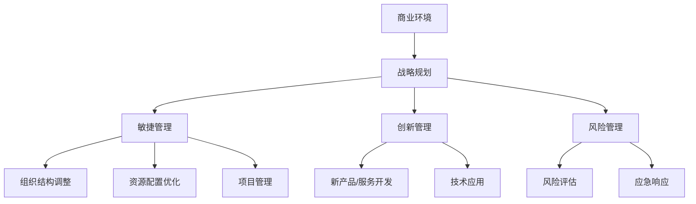

                 

# 管理者如何应对快速变化的商业环境

在当今全球化的商业环境中，快速变化是唯一恒定不变的主题。市场需求的波动、技术进步的加速、消费者行为的变化、全球经济形势的不确定性等因素，使得管理者面临前所未有的挑战。如何在这个瞬息万变的环境中保持竞争优势，成为每个企业管理的核心问题。本文将从理论到实践，全面探讨管理者如何有效应对快速变化的商业环境，包括关键管理概念、核心算法、实际操作技巧、以及未来的发展趋势和挑战。

## 1. 背景介绍

### 1.1 问题由来

在全球化和数字化的背景下，商业环境的快速变化已成为一个不可避免的趋势。首先，互联网和移动技术的普及，使得消费者能更快地获取信息、比较价格、进行购买。其次，新兴市场和技术不断涌现，如人工智能、区块链、物联网等，对传统商业模式造成颠覆性影响。再者，新冠疫情的全球蔓延加速了数字化转型的进程，使得线下业务大规模转向线上，企业需要迅速调整策略以适应这一变化。

### 1.2 问题核心关键点

管理者在快速变化的商业环境中需要具备以下几个关键能力：

1. **战略洞察力**：识别和理解市场趋势、技术发展方向和消费者需求变化。
2. **灵活应变**：能够迅速调整业务模式、产品和服务，以适应环境变化。
3. **风险管理**：有效评估和管理外部风险，如经济波动、市场竞争、供应链问题等。
4. **创新驱动**：推动组织内部的创新文化，持续引入新技术、新方法。
5. **人才管理**：吸引、培养和保留具备创新能力和适应变化的人才。

### 1.3 问题研究意义

快速变化的环境要求管理者具备前瞻性思维和敏捷的反应能力，以确保企业能够持续发展和竞争优势。通过系统的学习和实践，管理者可以提升应变能力，推动组织转型，从而在激烈的市场竞争中占据优势地位。

## 2. 核心概念与联系

### 2.1 核心概念概述

理解快速变化商业环境的应对策略，首先需要掌握以下几个核心概念：

1. **商业环境**：商业环境包括市场、技术、政策、竞争等多方面因素，对企业经营产生深远影响。
2. **战略规划**：战略规划是企业长期发展的方向和目标，指导具体行动。
3. **敏捷管理**：敏捷管理强调灵活性和快速响应，适应环境变化的能力。
4. **创新管理**：创新管理旨在促进组织内部的创新，保持竞争优势。
5. **风险管理**：风险管理通过识别、评估和控制风险，保护企业免受不利影响。

这些概念之间通过一系列的管理流程和机制相互关联，形成了一套完整的应对快速变化商业环境的系统方法。

### 2.2 核心概念原理和架构的 Mermaid 流程图



此流程图展示了商业环境变化如何通过战略规划、敏捷管理、创新管理和风险管理等机制，最终影响企业的组织结构、资源配置、产品开发和风险控制等方面，形成了一个闭环的管理系统。

## 3. 核心算法原理 & 具体操作步骤

### 3.1 算法原理概述

在快速变化的商业环境中，管理者的决策过程通常需要依赖于一系列算法和模型，以支持分析和预测。这些算法和模型包括但不限于：

- **预测分析**：使用机器学习模型预测市场趋势、消费者行为、销售变化等。
- **优化算法**：通过数学和计算模型优化资源分配、物流安排、生产调度等。
- **模拟仿真**：使用仿真技术模拟不同的市场环境和经营策略，评估其影响。
- **数据挖掘**：从历史数据中提取有价值的信息，为决策提供依据。

这些算法和模型共同构成了一个数据驱动的管理决策系统，帮助管理者在变化的环境中做出明智的决策。

### 3.2 算法步骤详解

以下是一个具体的算法步骤示例，用于预测某产品的市场需求变化：

1. **数据收集与处理**：收集历史销售数据、市场调研数据、消费者行为数据等。
2. **特征工程**：对原始数据进行清洗、转换、选择，提取对市场需求有影响力的特征。
3. **模型选择与训练**：选择适合的机器学习模型（如线性回归、随机森林、神经网络等），并使用历史数据对其进行训练。
4. **模型评估与优化**：使用测试数据集评估模型性能，根据结果对模型进行调整和优化。
5. **结果应用与反馈**：将模型应用于实际预测场景，并根据实际效果进行反馈，不断改进模型。

### 3.3 算法优缺点

快速变化商业环境下的管理决策算法有以下优缺点：

**优点**：
- **数据驱动**：通过数据和模型进行决策，减少了主观判断的偏差。
- **高效响应**：算法可以快速处理大量数据，快速产生决策建议。
- **可复用性**：模型可以在不同场景下进行复用，提升决策的通用性。

**缺点**：
- **数据依赖**：算法的有效性高度依赖于数据质量和模型选择。
- **复杂性**：复杂模型可能需要较长的训练和调试时间，增加了决策复杂度。
- **解释性**：部分模型（如深度学习模型）结果难以解释，降低了决策的透明度。

### 3.4 算法应用领域

商业环境变化下的管理决策算法广泛应用于以下领域：

- **市场营销**：预测市场需求，制定精准营销策略。
- **供应链管理**：优化库存水平，提升供应链效率。
- **产品开发**：识别新产品/服务机会，评估市场潜力。
- **财务分析**：预测财务指标，评估投资回报。
- **人力资源**：分析员工流失率，优化招聘策略。

## 4. 数学模型和公式 & 详细讲解 & 举例说明

### 4.1 数学模型构建

在管理决策中，常用数学模型包括线性回归、逻辑回归、决策树、神经网络等。以线性回归模型为例，构建过程如下：

假设市场需求 $y$ 与多个影响因素 $x_1, x_2, \ldots, x_n$ 之间存在线性关系，模型形式为：
$$ y = \beta_0 + \beta_1 x_1 + \beta_2 x_2 + \ldots + \beta_n x_n + \epsilon $$

其中，$\beta_0, \beta_1, \ldots, \beta_n$ 为模型的系数，$\epsilon$ 为误差项。

### 4.2 公式推导过程

在线性回归模型中，求解系数 $\beta_0, \beta_1, \ldots, \beta_n$ 的过程如下：
1. 使用最小二乘法，最小化误差平方和 $SSE$：
   $$ SSE = \sum_{i=1}^N (y_i - \hat{y}_i)^2 $$
2. 求解最小二乘解：
   $$ \beta_0, \beta_1, \ldots, \beta_n = \mathop{\arg\min}_{\beta_0, \beta_1, \ldots, \beta_n} SSE $$
   $$ \beta_j = \frac{\sum_{i=1}^N x_{ij}(y_i - \bar{y})}{\sum_{i=1}^N x_{ij}^2 - \sum_{i=1}^N x_{ij}^2 \bar{x}_j} $$
   其中，$\bar{y}$ 和 $\bar{x}_j$ 分别为 $y$ 和 $x_j$ 的均值。

### 4.3 案例分析与讲解

假设某电子产品市场需求 $y$ 与广告投入 $x_1$、竞争对手定价 $x_2$、经济增长 $x_3$ 等因素有关。通过收集历史数据并使用线性回归模型，可以得到市场需求与各影响因素之间的关系，并据此预测未来市场需求变化。

## 5. 项目实践：代码实例和详细解释说明

### 5.1 开发环境搭建

开发环境搭建包括安装所需的Python包、配置计算资源等。以Python开发为例：

1. 安装Python和相关库（如pandas、numpy、scikit-learn等）。
2. 准备数据集（如销售数据、市场调研数据等）。
3. 配置计算资源（如GPU、CPU等）。

### 5.2 源代码详细实现

以下是一个简单的线性回归模型代码示例：

```python
from sklearn.linear_model import LinearRegression
from sklearn.metrics import mean_squared_error

# 准备数据
X = pd.DataFrame(...)
y = pd.Series(...)

# 构建模型并训练
model = LinearRegression()
model.fit(X, y)

# 预测
y_pred = model.predict(X_test)

# 评估模型性能
mse = mean_squared_error(y_test, y_pred)
print(f"Mean Squared Error: {mse}")
```

### 5.3 代码解读与分析

上述代码展示了线性回归模型的构建、训练和评估过程。其中，`LinearRegression` 类用于构建线性回归模型，`mean_squared_error` 函数用于评估模型预测的均方误差。

## 6. 实际应用场景

### 6.1 智能营销

智能营销通过大数据分析和机器学习算法，预测消费者行为，制定个性化营销策略。例如，某电商平台使用线性回归模型预测用户购买意愿，并根据预测结果推送个性化广告，提高转化率。

### 6.2 供应链优化

通过预测分析，企业可以优化库存水平和物流安排，降低供应链成本。例如，某零售企业使用神经网络模型预测需求波动，调整库存策略，减少缺货和过剩库存。

### 6.3 新产品开发

市场需求预测帮助企业识别新产品/服务机会，并评估其市场潜力。例如，某饮料公司使用预测模型评估新口味的市场接受度，制定产品开发策略。

### 6.4 未来应用展望

未来，管理决策算法将更加智能化和自动化，结合大数据、人工智能、物联网等技术，提升决策的准确性和响应速度。例如，通过实时数据流分析，企业可以实时调整策略，应对市场变化。

## 7. 工具和资源推荐

### 7.1 学习资源推荐

1. **在线课程**：Coursera、edX、Udacity 等平台提供的管理决策、数据分析相关课程。
2. **书籍**：《数据科学导论》、《机器学习实战》、《深度学习》等书籍。
3. **公开数据库**：如UCI机器学习库、Kaggle数据集等。

### 7.2 开发工具推荐

1. **Python开发环境**：Anaconda、Jupyter Notebook 等。
2. **数据处理工具**：Pandas、NumPy、SciPy 等。
3. **机器学习框架**：Scikit-learn、TensorFlow、PyTorch 等。

### 7.3 相关论文推荐

1. **预测模型论文**：《Grokking Linear Regression》、《The Elements of Statistical Learning》等。
2. **优化算法论文**：《Introduction to Operations Research》、《Optimization by Vector Space Methods》等。
3. **模拟仿真论文**：《Discrete-Event System Simulation》、《System Dynamics》等。

## 8. 总结：未来发展趋势与挑战

### 8.1 研究成果总结

本文介绍了快速变化商业环境下的管理决策算法，包括线性回归、预测分析、优化算法等，并提供了代码实例和实际应用案例。通过系统学习，管理者可以掌握这些算法，提升决策能力。

### 8.2 未来发展趋势

未来管理决策算法的发展趋势包括：

1. **算法智能化**：引入深度学习、强化学习等更先进的算法，提升决策智能化水平。
2. **数据实时化**：使用流数据处理技术，实现实时数据驱动的决策。
3. **模型自动化**：开发自动化模型构建和管理工具，简化决策流程。
4. **集成化**：将不同算法和模型集成到一个决策平台，提升决策系统的综合性。

### 8.3 面临的挑战

快速变化商业环境下的管理决策算法面临以下挑战：

1. **数据质量**：数据缺失、噪声等问题可能导致模型失效。
2. **算法复杂性**：复杂的算法模型需要更多的计算资源和时间。
3. **模型可解释性**：黑盒模型的决策过程难以解释，降低决策透明度。
4. **隐私与安全**：数据隐私和安全问题，需要加强数据管理和安全控制。

### 8.4 研究展望

未来研究需要从以下几个方面进行探索：

1. **算法优化**：优化算法的计算效率和精度，适应大规模数据处理。
2. **模型解释**：增强模型的可解释性，提升决策透明度。
3. **多领域融合**：将不同领域的知识和技术融合到决策算法中，提升决策效果。
4. **跨学科合作**：结合心理学、社会学等学科知识，提升决策的全面性和科学性。

## 9. 附录：常见问题与解答

**Q1：如何快速获取高质量的数据？**

A: 高质量的数据是管理决策算法的基础。以下是一些获取高质量数据的方法：
1. **公开数据集**：利用公开的数据库和数据集，如UCI机器学习库、Kaggle数据集等。
2. **内部数据**：挖掘和整理企业内部的数据资源，如销售记录、客户反馈等。
3. **数据购买**：购买商业数据服务或专业数据提供商的数据。

**Q2：如何选择适合的预测模型？**

A: 选择合适的预测模型需要考虑以下几个因素：
1. **数据特性**：根据数据类型（如连续、分类、文本等）选择适合的模型。
2. **业务需求**：根据业务目标（如需求预测、风险评估、资源优化等）选择合适的模型。
3. **模型复杂度**：根据数据量和计算资源选择模型复杂度合适的模型。

**Q3：如何快速部署模型？**

A: 快速部署模型需要以下步骤：
1. **模型优化**：使用模型压缩、量化等技术优化模型，减小资源消耗。
2. **自动化部署**：使用容器化技术（如Docker、Kubernetes）部署模型。
3. **API接口设计**：设计简洁易用的API接口，便于外部系统调用。

**Q4：如何评估模型效果？**

A: 评估模型效果的方法包括：
1. **均方误差**：评估预测值与实际值之间的误差。
2. **准确率、召回率、F1分数**：评估分类模型的性能。
3. **ROC曲线**：评估分类模型的预测性能。
4. **交叉验证**：评估模型的泛化能力。

通过本文的系统梳理，管理者可以更好地理解和应用管理决策算法，提升应对快速变化商业环境的能力，推动企业持续发展和竞争优势。

---

作者：禅与计算机程序设计艺术 / Zen and the Art of Computer Programming

