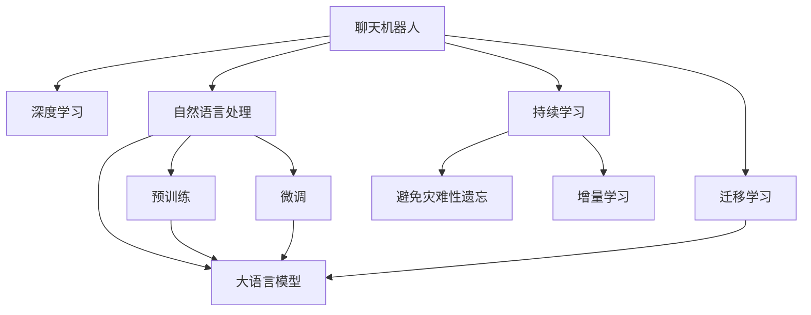

                 

# 聊天机器人教育：在线教学和辅导

## 1. 背景介绍

随着人工智能技术的不断进步，聊天机器人作为新一代的人机交互方式，正在教育领域大放异彩。特别是基于深度学习的自然语言处理技术，使得聊天机器人能够在回答学生提问、提供个性化辅导、进行学习评估等方面发挥重要作用。这不仅有助于提高学生的学习效率，还能为教师教学提供有力的辅助工具。

### 1.1 问题由来
近年来，在线教育市场迅速发展，传统的线下教育模式正被线上教育所取代。随着智能设备如智能音箱、智能手机等普及，用户对智能语音助手的需求日益增长。然而，教育领域的AI技术仍处于初级阶段，大部分在线教育产品仍以传统的讲授和练习形式为主，缺乏与学生的实时互动。如何利用AI技术，构建实时、智能、个性化的在线教育平台，成为了一个重要课题。

### 1.2 问题核心关键点
聊天机器人教育的核心在于如何将AI技术与教学内容深度结合，通过自然语言理解和生成技术，实现与学生的自然对话，从而提供个性化的学习支持和评估。聊天机器人的教育应用主要包括以下几个方面：
1. **实时答疑**：在学生有疑惑时，机器人能够即时响应，提供准确解答。
2. **个性化辅导**：根据学生的知识水平和兴趣点，推荐合适的学习内容和路径。
3. **学习评估**：通过自然语言推理，自动评估学生的作业和考试，并给出个性化反馈。
4. **互动教学**：模拟教师的讲解和提问，进行互动式学习。

这些功能的实现，依赖于大语言模型在预训练和微调后的强大能力，尤其是模型在理解语言背景、上下文、语义等方面的优势。

### 1.3 问题研究意义
聊天机器人教育对于提升在线教育的互动性和智能化水平，具有重要意义：

1. **提高学习效率**：通过智能对话，实时解决学生疑惑，减少学习时间浪费。
2. **个性化学习**：根据学生的知识水平和兴趣点，提供定制化学习资源和策略，提高学习效果。
3. **降低教育成本**：减少对人力教师的依赖，降低教育成本，扩大优质教育资源的覆盖面。
4. **灵活教学方式**：不受时间地点限制，随时随地进行学习，提升学习便利性。
5. **数据驱动决策**：通过大数据分析，评估教学效果，改进教学策略，提高教学质量。

聊天机器人教育有望成为未来在线教育的重要组成部分，为传统教育模式带来变革性影响。

## 2. 核心概念与联系

### 2.1 核心概念概述

为更好地理解聊天机器人教育的原理和实现方式，本节将介绍几个关键概念：

- **聊天机器人(Chatbot)**：基于自然语言处理技术的智能交互系统，能够与用户进行实时对话。
- **深度学习(Deep Learning)**：一种基于神经网络结构的机器学习方法，通过大数据训练模型，实现复杂的任务。
- **自然语言处理(NLP)**：涉及计算机对自然语言的理解、生成和处理，是聊天机器人的核心技术。
- **大语言模型(Large Language Model, LLM)**：以自回归或自编码模型为代表的大规模预训练语言模型，如BERT、GPT等。
- **预训练(Pre-training)**：通过大规模无标签数据训练模型，学习语言表示。
- **微调(Fine-tuning)**：在预训练模型的基础上，使用下游任务的少量标注数据，进一步优化模型。
- **迁移学习(Transfer Learning)**：将一个领域学到的知识，迁移应用到另一个不同但相关的领域。
- **持续学习(Continual Learning)**：模型能够不断学习新知识，同时保持已学习的知识。

这些概念之间的逻辑关系可以通过以下Mermaid流程图来展示：



这个流程图展示了大语言模型的核心概念及其之间的关系：

1. 聊天机器人通过自然语言处理技术，使用深度学习模型进行搭建。
2. 自然语言处理中，大语言模型是核心技术，通过预训练和微调获得语言理解能力。
3. 聊天机器人通过迁移学习，能够适应不同领域的教育任务。
4. 持续学习使得聊天机器人能够不断学习新知识，避免遗忘旧知识。

这些概念共同构成了聊天机器人教育的核心技术框架，使其能够提供高质量的智能教育服务。

## 3. 核心算法原理 & 具体操作步骤
### 3.1 算法原理概述

聊天机器人教育的核心算法原理，主要是基于自然语言处理技术的深度学习模型。其核心思想是：利用大语言模型在自然语言处理方面的强大能力，构建能够进行实时对话、个性化辅导、学习评估等功能的聊天机器人。

形式化地，假设聊天机器人模型为 $M_{\theta}$，其中 $\theta$ 为模型的参数。给定教育任务 $T$ 的训练集 $D=\{(x_i, y_i)\}_{i=1}^N$，其中 $x_i$ 为输入问题，$y_i$ 为输出回答，$\theta$ 为模型参数。聊天机器人教育的优化目标是最小化经验风险，即找到最优参数：

$$
\theta^* = \mathop{\arg\min}_{\theta} \mathcal{L}(M_{\theta},D)
$$

其中 $\mathcal{L}$ 为针对任务 $T$ 设计的损失函数，用于衡量模型预测输出与真实标签之间的差异。常见的损失函数包括交叉熵损失、均方误差损失等。

通过梯度下降等优化算法，聊天机器人教育过程不断更新模型参数 $\theta$，最小化损失函数 $\mathcal{L}$，使得模型输出逼近真实标签。由于 $\theta$ 已经通过预训练获得了较好的初始化，因此即便在教育任务上，也能较快收敛到理想的模型参数 $\hat{\theta}$。

### 3.2 算法步骤详解

聊天机器人教育的一般流程包括：

**Step 1: 准备预训练模型和数据集**
- 选择合适的预训练语言模型 $M_{\theta}$ 作为初始化参数，如 BERT、GPT 等。
- 准备教育任务 $T$ 的标注数据集 $D$，划分为训练集、验证集和测试集。

**Step 2: 添加任务适配层**
- 根据教育任务类型，在预训练模型顶层设计合适的输出层和损失函数。
- 对于问答任务，通常在顶层添加线性分类器和交叉熵损失函数。
- 对于生成任务，通常使用语言模型的解码器输出概率分布，并以负对数似然为损失函数。

**Step 3: 设置教育超参数**
- 选择合适的优化算法及其参数，如 AdamW、SGD 等，设置学习率、批大小、迭代轮数等。
- 设置正则化技术及强度，包括权重衰减、Dropout、Early Stopping 等。
- 确定冻结预训练参数的策略，如仅微调顶层，或全部参数都参与微调。

**Step 4: 执行梯度训练**
- 将训练集数据分批次输入模型，前向传播计算损失函数。
- 反向传播计算参数梯度，根据设定的优化算法和学习率更新模型参数。
- 周期性在验证集上评估模型性能，根据性能指标决定是否触发 Early Stopping。
- 重复上述步骤直到满足预设的迭代轮数或 Early Stopping 条件。

**Step 5: 测试和部署**
- 在测试集上评估微调后模型 $M_{\hat{\theta}}$ 的性能，对比微调前后的精度提升。
- 使用微调后的模型对新问题进行推理预测，集成到实际的教育系统中。
- 持续收集新的问题，定期重新微调模型，以适应数据分布的变化。

以上是聊天机器人教育的一般流程。在实际应用中，还需要针对具体教育任务的特点，对微调过程的各个环节进行优化设计，如改进训练目标函数，引入更多的正则化技术，搜索最优的超参数组合等，以进一步提升模型性能。

### 3.3 算法优缺点

聊天机器人教育方法具有以下优点：
1. 实时互动。聊天机器人能够实时响应学生提问，提高学习效率。
2. 个性化支持。通过理解学生的语境和问题，提供个性化的辅导和建议。
3. 灵活教学。不受时间和地点限制，学生可以随时学习。
4. 数据驱动。通过分析学生的互动数据，优化教学策略，提高教学效果。
5. 低成本高效率。相较于传统教师，聊天机器人教育成本较低，且可以同时服务多名学生。

同时，该方法也存在一定的局限性：
1. 知识限制。聊天机器人依赖于训练数据和算法，难以应对非常规问题。
2. 对话质量。在处理复杂、歧义的问题时，回答的准确性和自然度有限。
3. 伦理问题。聊天机器人的决策过程缺乏可解释性，可能存在偏见。
4. 数据隐私。学生数据的安全和隐私保护是重要问题，需要特别关注。
5. 技术复杂度。构建高质量的聊天机器人需要较高的技术门槛，需要专业的开发人员。

尽管存在这些局限性，但就目前而言，聊天机器人教育仍是大语言模型应用的重要方向。未来相关研究的重点在于如何进一步提升聊天机器人的智能化水平，优化交互体验，提高回答质量，同时兼顾可解释性和伦理安全性等因素。

### 3.4 算法应用领域

聊天机器人教育已经广泛应用于多个教育场景，例如：

- **在线课程辅导**：在课程学习过程中，通过问答机器人辅助解答疑问，提供个性化辅导。
- **考试测评**：自动批改选择题、填空题等客观题目，通过自然语言推理评估主观题答案。
- **作业辅助**：解答学生的作业疑问，提供参考资料，提高作业完成效率。
- **个性化推荐**：根据学生的学习行为和成绩，推荐合适的学习资源和路径。
- **情感疏导**：通过情感识别技术，及时发现学生的心理问题，提供心理辅导。
- **学术研究**：辅助科学研究的资料收集、问题解答，促进学术交流。

除了上述这些经典应用外，聊天机器人教育还在不断拓展新的应用场景，如学术讲座、企业培训、职业咨询等，为教育和社会发展提供新动力。

## 4. 数学模型和公式 & 详细讲解 & 举例说明

### 4.1 数学模型构建

本节将使用数学语言对聊天机器人教育的微调过程进行更加严格的刻画。

记聊天机器人模型为 $M_{\theta}$，其中 $\theta$ 为模型参数。假设教育任务为问答任务，训练集为 $D=\{(x_i,y_i)\}_{i=1}^N$，其中 $x_i$ 为学生提问，$y_i$ 为教师回答。

定义模型 $M_{\theta}$ 在输入 $x$ 上的输出为 $\hat{y}=M_{\theta}(x) \in [0,1]$，表示学生提问的预测答案。真实标签 $y \in \{0,1\}$。则二分类交叉熵损失函数定义为：

$$
\ell(M_{\theta}(x),y) = -[y\log \hat{y} + (1-y)\log (1-\hat{y})]
$$

将其代入经验风险公式，得：

$$
\mathcal{L}(\theta) = -\frac{1}{N}\sum_{i=1}^N [y_i\log M_{\theta}(x_i)+(1-y_i)\log(1-M_{\theta}(x_i))]
$$

根据链式法则，损失函数对参数 $\theta_k$ 的梯度为：

$$
\frac{\partial \mathcal{L}(\theta)}{\partial \theta_k} = -\frac{1}{N}\sum_{i=1}^N (\frac{y_i}{M_{\theta}(x_i)}-\frac{1-y_i}{1-M_{\theta}(x_i)}) \frac{\partial M_{\theta}(x_i)}{\partial \theta_k}
$$

其中 $\frac{\partial M_{\theta}(x_i)}{\partial \theta_k}$ 可进一步递归展开，利用自动微分技术完成计算。

### 4.2 公式推导过程

以下我们以问答任务为例，推导交叉熵损失函数及其梯度的计算公式。

假设模型 $M_{\theta}$ 在输入 $x$ 上的输出为 $\hat{y}=M_{\theta}(x) \in [0,1]$，表示学生提问的预测答案。真实标签 $y \in \{0,1\}$。则二分类交叉熵损失函数定义为：

$$
\ell(M_{\theta}(x),y) = -[y\log \hat{y} + (1-y)\log (1-\hat{y})]
$$

将其代入经验风险公式，得：

$$
\mathcal{L}(\theta) = -\frac{1}{N}\sum_{i=1}^N [y_i\log M_{\theta}(x_i)+(1-y_i)\log(1-M_{\theta}(x_i))]
$$

根据链式法则，损失函数对参数 $\theta_k$ 的梯度为：

$$
\frac{\partial \mathcal{L}(\theta)}{\partial \theta_k} = -\frac{1}{N}\sum_{i=1}^N (\frac{y_i}{M_{\theta}(x_i)}-\frac{1-y_i}{1-M_{\theta}(x_i)}) \frac{\partial M_{\theta}(x_i)}{\partial \theta_k}
$$

其中 $\frac{\partial M_{\theta}(x_i)}{\partial \theta_k}$ 可进一步递归展开，利用自动微分技术完成计算。

在得到损失函数的梯度后，即可带入参数更新公式，完成模型的迭代优化。重复上述过程直至收敛，最终得到适应问答任务的最优模型参数 $\theta^*$。

## 5. 项目实践：代码实例和详细解释说明
### 5.1 开发环境搭建

在进行聊天机器人教育实践前，我们需要准备好开发环境。以下是使用Python进行PyTorch开发的环境配置流程：

1. 安装Anaconda：从官网下载并安装Anaconda，用于创建独立的Python环境。

2. 创建并激活虚拟环境：
```bash
conda create -n pytorch-env python=3.8 
conda activate pytorch-env
```

3. 安装PyTorch：根据CUDA版本，从官网获取对应的安装命令。例如：
```bash
conda install pytorch torchvision torchaudio cudatoolkit=11.1 -c pytorch -c conda-forge
```

4. 安装Transformers库：
```bash
pip install transformers
```

5. 安装各类工具包：
```bash
pip install numpy pandas scikit-learn matplotlib tqdm jupyter notebook ipython
```

完成上述步骤后，即可在`pytorch-env`环境中开始聊天机器人教育的微调实践。

### 5.2 源代码详细实现

下面我们以问答任务为例，给出使用Transformers库对BERT模型进行微调的PyTorch代码实现。

首先，定义问答任务的输入输出函数：

```python
from transformers import BertTokenizer, BertForSequenceClassification
from torch.utils.data import Dataset
import torch

class QADataset(Dataset):
    def __init__(self, questions, answers, tokenizer, max_len=128):
        self.questions = questions
        self.answers = answers
        self.tokenizer = tokenizer
        self.max_len = max_len
        
    def __len__(self):
        return len(self.questions)
    
    def __getitem__(self, item):
        question = self.questions[item]
        answer = self.answers[item]
        
        encoding = self.tokenizer(question, return_tensors='pt', max_length=self.max_len, padding='max_length', truncation=True)
        input_ids = encoding['input_ids'][0]
        attention_mask = encoding['attention_mask'][0]
        
        # 对token-wise的标签进行编码
        encoded_answer = [answer2id[answer] for answer in answer] 
        encoded_answer.extend([answer2id['O']] * (self.max_len - len(encoded_answer)))
        labels = torch.tensor(encoded_answer, dtype=torch.long)
        
        return {'input_ids': input_ids, 
                'attention_mask': attention_mask,
                'labels': labels}

# 标签与id的映射
answer2id = {'O': 0, 'A': 1}
id2answer = {v: k for k, v in answer2id.items()}

# 创建dataset
tokenizer = BertTokenizer.from_pretrained('bert-base-cased')

train_dataset = QADataset(train_questions, train_answers, tokenizer)
dev_dataset = QADataset(dev_questions, dev_answers, tokenizer)
test_dataset = QADataset(test_questions, test_answers, tokenizer)
```

然后，定义模型和优化器：

```python
from transformers import BertForTokenClassification, AdamW

model = BertForTokenClassification.from_pretrained('bert-base-cased', num_labels=len(answer2id))

optimizer = AdamW(model.parameters(), lr=2e-5)
```

接着，定义训练和评估函数：

```python
from torch.utils.data import DataLoader
from tqdm import tqdm
from sklearn.metrics import classification_report

device = torch.device('cuda') if torch.cuda.is_available() else torch.device('cpu')
model.to(device)

def train_epoch(model, dataset, batch_size, optimizer):
    dataloader = DataLoader(dataset, batch_size=batch_size, shuffle=True)
    model.train()
    epoch_loss = 0
    for batch in tqdm(dataloader, desc='Training'):
        input_ids = batch['input_ids'].to(device)
        attention_mask = batch['attention_mask'].to(device)
        labels = batch['labels'].to(device)
        model.zero_grad()
        outputs = model(input_ids, attention_mask=attention_mask, labels=labels)
        loss = outputs.loss
        epoch_loss += loss.item()
        loss.backward()
        optimizer.step()
    return epoch_loss / len(dataloader)

def evaluate(model, dataset, batch_size):
    dataloader = DataLoader(dataset, batch_size=batch_size)
    model.eval()
    preds, labels = [], []
    with torch.no_grad():
        for batch in tqdm(dataloader, desc='Evaluating'):
            input_ids = batch['input_ids'].to(device)
            attention_mask = batch['attention_mask'].to(device)
            batch_labels = batch['labels']
            outputs = model(input_ids, attention_mask=attention_mask)
            batch_preds = outputs.logits.argmax(dim=2).to('cpu').tolist()
            batch_labels = batch_labels.to('cpu').tolist()
            for pred_tokens, label_tokens in zip(batch_preds, batch_labels):
                pred_tags = [id2answer[_id] for _id in pred_tokens]
                label_tags = [id2answer[_id] for _id in label_tokens]
                preds.append(pred_tags[:len(label_tokens)])
                labels.append(label_tags)
                
    print(classification_report(labels, preds))
```

最后，启动训练流程并在测试集上评估：

```python
epochs = 5
batch_size = 16

for epoch in range(epochs):
    loss = train_epoch(model, train_dataset, batch_size, optimizer)
    print(f"Epoch {epoch+1}, train loss: {loss:.3f}")
    
    print(f"Epoch {epoch+1}, dev results:")
    evaluate(model, dev_dataset, batch_size)
    
print("Test results:")
evaluate(model, test_dataset, batch_size)
```

以上就是使用PyTorch对BERT进行问答任务微调的完整代码实现。可以看到，得益于Transformers库的强大封装，我们可以用相对简洁的代码完成BERT模型的加载和微调。

### 5.3 代码解读与分析

让我们再详细解读一下关键代码的实现细节：

**QADataset类**：
- `__init__`方法：初始化问题和答案，分词器等关键组件。
- `__len__`方法：返回数据集的样本数量。
- `__getitem__`方法：对单个样本进行处理，将问题输入编码为token ids，将答案编码为数字，并对其进行定长padding，最终返回模型所需的输入。

**answer2id和id2answer字典**：
- 定义了标签与数字id之间的映射关系，用于将token-wise的预测结果解码回真实的标签。

**训练和评估函数**：
- 使用PyTorch的DataLoader对数据集进行批次化加载，供模型训练和推理使用。
- 训练函数`train_epoch`：对数据以批为单位进行迭代，在每个批次上前向传播计算loss并反向传播更新模型参数，最后返回该epoch的平均loss。
- 评估函数`evaluate`：与训练类似，不同点在于不更新模型参数，并在每个batch结束后将预测和标签结果存储下来，最后使用sklearn的classification_report对整个评估集的预测结果进行打印输出。

**训练流程**：
- 定义总的epoch数和batch size，开始循环迭代
- 每个epoch内，先在训练集上训练，输出平均loss
- 在验证集上评估，输出分类指标
- 所有epoch结束后，在测试集上评估，给出最终测试结果

可以看到，PyTorch配合Transformers库使得BERT微调的代码实现变得简洁高效。开发者可以将更多精力放在数据处理、模型改进等高层逻辑上，而不必过多关注底层的实现细节。

当然，工业级的系统实现还需考虑更多因素，如模型的保存和部署、超参数的自动搜索、更灵活的任务适配层等。但核心的微调范式基本与此类似。

## 6. 实际应用场景
### 6.1 智能问答系统

智能问答系统是聊天机器人教育的核心应用之一。传统的问答系统往往需要构建大量的知识库和规则，实现起来较为复杂。而基于大语言模型微调的方法，可以通过预训练-微调范式，轻松构建高精度的智能问答系统。

在技术实现上，可以收集常见问题及其答案，构建监督数据集。通过微调BERT等预训练语言模型，使其能够自动回答问题，并在此基础上进行对话。对于新问题，可以通过检索系统实时搜索相关信息，辅助机器人给出答案。如此构建的智能问答系统，能够快速响应学生查询，提高学习效率。

### 6.2 虚拟辅导员

虚拟辅导员作为聊天机器人教育的另一个重要应用，通过自然语言理解技术，能够实时解答学生的各种疑问，进行个性化辅导和情感疏导。在虚拟辅导员中，可以采用BERT等模型进行微调，使其具备较强的语言理解能力，并能够进行多轮对话。

具体实现时，可以对虚拟辅导员进行多轮对话训练，让其能够理解上下文和语境，从而提供更准确的回答。虚拟辅导员还可以集成情感分析技术，及时发现学生的情绪波动，提供相应的心理支持。这种虚拟辅导员能够提供24小时不间断的服务，有助于减轻教师的工作压力，提升学生学习的体验和效果。

### 6.3 考试测评系统

考试测评系统也是聊天机器人教育的重要应用场景。传统的考试测评需要耗费大量人力进行阅卷，且评估标准难以统一。而通过微调BERT等预训练模型，可以构建自动批改试卷的系统，提高批改的准确性和效率。

具体实现时，可以使用Seq2Seq模型或CTC模型，将学生的回答与标准答案进行比较，并计算得分。同时，可以引入自然语言推理技术，评估学生的答题逻辑和表述是否合理。通过微调后的模型，可以自动批改选择题、填空题等客观题目，并对主观题进行评价。这种自动测评系统不仅能够减轻教师的工作负担，还能保证评估的客观性和一致性。

### 6.4 未来应用展望

随着大语言模型微调技术的不断发展，聊天机器人教育将在更多领域得到应用，为教育系统带来变革性影响。

在智慧校园中，基于聊天机器人的教育应用可以构建智能课堂、虚拟实验室、在线考试等系统，提升教育信息化水平，促进教育的现代化转型。

在企业培训中，聊天机器人可以提供实时在线培训、员工辅导等，帮助员工快速掌握新知识和技能，提升企业竞争力。

在智能医疗中，基于聊天机器人的教育应用可以提供健康知识普及、疾病预防咨询等服务，帮助公众提高健康意识，促进健康中国的建设。

此外，在公共安全、智慧城市、社会服务等领域，基于聊天机器人的教育应用也将不断涌现，为社会治理和公民服务提供新的工具。

## 7. 工具和资源推荐
### 7.1 学习资源推荐

为了帮助开发者系统掌握聊天机器人教育的理论基础和实践技巧，这里推荐一些优质的学习资源：

1. 《深度学习与自然语言处理》系列博文：由大语言模型技术专家撰写，深入浅出地介绍了深度学习在自然语言处理中的应用，包括问答系统、情感分析、文本生成等。

2. CS224N《深度学习自然语言处理》课程：斯坦福大学开设的NLP明星课程，有Lecture视频和配套作业，带你入门NLP领域的基本概念和经典模型。

3. 《Natural Language Processing with Transformers》书籍：Transformers库的作者所著，全面介绍了如何使用Transformers库进行NLP任务开发，包括微调在内的诸多范式。

4. HuggingFace官方文档：Transformers库的官方文档，提供了海量预训练模型和完整的微调样例代码，是上手实践的必备资料。

5. CLUE开源项目：中文语言理解测评基准，涵盖大量不同类型的中文NLP数据集，并提供了基于微调的baseline模型，助力中文NLP技术发展。

通过对这些资源的学习实践，相信你一定能够快速掌握聊天机器人教育的精髓，并用于解决实际的NLP问题。
###  7.2 开发工具推荐

高效的开发离不开优秀的工具支持。以下是几款用于聊天机器人教育开发的常用工具：

1. PyTorch：基于Python的开源深度学习框架，灵活动态的计算图，适合快速迭代研究。大部分预训练语言模型都有PyTorch版本的实现。

2. TensorFlow：由Google主导开发的开源深度学习框架，生产部署方便，适合大规模工程应用。同样有丰富的预训练语言模型资源。

3. Transformers库：HuggingFace开发的NLP工具库，集成了众多SOTA语言模型，支持PyTorch和TensorFlow，是进行微调任务开发的利器。

4. Weights & Biases：模型训练的实验跟踪工具，可以记录和可视化模型训练过程中的各项指标，方便对比和调优。与主流深度学习框架无缝集成。

5. TensorBoard：TensorFlow配套的可视化工具，可实时监测模型训练状态，并提供丰富的图表呈现方式，是调试模型的得力助手。

6. Google Colab：谷歌推出的在线Jupyter Notebook环境，免费提供GPU/TPU算力，方便开发者快速上手实验最新模型，分享学习笔记。

合理利用这些工具，可以显著提升聊天机器人教育任务的开发效率，加快创新迭代的步伐。

### 7.3 相关论文推荐

聊天机器人教育技术的发展源于学界的持续研究。以下是几篇奠基性的相关论文，推荐阅读：

1. Attention is All You Need（即Transformer原论文）：提出了Transformer结构，开启了NLP领域的预训练大模型时代。

2. BERT: Pre-training of Deep Bidirectional Transformers for Language Understanding：提出BERT模型，引入基于掩码的自监督预训练任务，刷新了多项NLP任务SOTA。

3. Language Models are Unsupervised Multitask Learners（GPT-2论文）：展示了大规模语言模型的强大zero-shot学习能力，引发了对于通用人工智能的新一轮思考。

4. Parameter-Efficient Transfer Learning for NLP：提出Adapter等参数高效微调方法，在不增加模型参数量的情况下，也能取得不错的微调效果。

5. Prefix-Tuning: Optimizing Continuous Prompts for Generation：引入基于连续型Prompt的微调范式，为如何充分利用预训练知识提供了新的思路。

6. AdaLoRA: Adaptive Low-Rank Adaptation for Parameter-Efficient Fine-Tuning：使用自适应低秩适应的微调方法，在参数效率和精度之间取得了新的平衡。

这些论文代表了大语言模型微调技术的发展脉络。通过学习这些前沿成果，可以帮助研究者把握学科前进方向，激发更多的创新灵感。

## 8. 总结：未来发展趋势与挑战
### 8.1 总结

本文对基于自然语言处理技术的聊天机器人教育方法进行了全面系统的介绍。首先阐述了聊天机器人教育的背景和意义，明确了其在使用深度学习技术进行实时对话、个性化辅导、学习评估等方面的独特价值。其次，从原理到实践，详细讲解了聊天机器人教育的数学原理和关键步骤，给出了微调任务开发的完整代码实例。同时，本文还广泛探讨了聊天机器人教育在智能问答、虚拟辅导员、考试测评等诸多场景中的应用前景，展示了其广阔的应用潜力。

通过本文的系统梳理，可以看到，基于大语言模型的聊天机器人教育方法正在成为教育技术发展的重要趋势，极大地提升了在线教育的互动性和智能化水平，为传统教育模式带来变革性影响。未来，伴随预训练语言模型和微调方法的不断进步，基于聊天机器人教育的应用将更加广泛，为教育领域的数字化转型提供强大动力。

### 8.2 未来发展趋势

展望未来，聊天机器人教育技术将呈现以下几个发展趋势：

1. 模型的智能化水平不断提高。大语言模型的语言理解能力和生成能力将不断提升，聊天机器人的对话质量将显著改善，能够应对更复杂的任务。
2. 对话系统的多模态化。除了文本对话，聊天机器人将逐步支持语音、图像等多模态交互，为用户提供更丰富的交流方式。
3. 个性化学习的深入应用。基于用户行为和反馈，聊天机器人将能够提供更加精准和个性化的学习支持，提升学习效果。
4. 数据驱动的教育决策。通过大数据分析，聊天机器人将能够实时监测和评估学生的学习状况，优化教学策略。
5. 跨领域知识的应用。聊天机器人将能够整合不同领域的知识，提供更加全面的学习资源和解答。
6. 伦理和安全的重视。随着聊天机器人与用户互动的深入，隐私保护和伦理安全问题将受到更多关注，相关技术和法规将逐步完善。

这些趋势凸显了聊天机器人教育技术的广阔前景。未来的研究将在模型的智能化水平、多模态交互、个性化学习、数据驱动决策等方面不断深入，推动教育技术的创新和应用。

### 8.3 面临的挑战

尽管聊天机器人教育技术已经取得了不小的进展，但在迈向更加智能化、普适化应用的过程中，仍面临诸多挑战：

1. 模型的泛化能力不足。聊天机器人在处理新问题时，可能难以达到与人类专家相同的理解和表达水平。
2. 用户交互的复杂性。多轮对话和上下文理解对模型的要求较高，现有模型在复杂对话场景中的表现仍需改进。
3. 数据和隐私问题。用户数据的隐私保护是重要问题，需要严格的数据治理和安全保障。
4. 计算资源消耗。大模型的推理和训练需要消耗大量计算资源，如何提升计算效率，降低成本，是重要的研究方向。
5. 模型的可解释性。聊天机器人的决策过程缺乏可解释性，难以满足用户对决策透明度的要求。

尽管存在这些挑战，但随着学界和产业界的共同努力，这些挑战终将一一被克服，聊天机器人教育必将在构建智能教育系统方面发挥更大作用。

### 8.4 研究展望

面对聊天机器人教育所面临的挑战，未来的研究需要在以下几个方面寻求新的突破：

1. 引入更多先验知识。将符号化的先验知识，如知识图谱、逻辑规则等，与神经网络模型进行巧妙融合，引导微调过程学习更准确、合理的语言模型。
2. 提高模型的多模态交互能力。结合视觉、语音等多模态信息，实现更加丰富和自然的人机交互。
3. 开发更高效的多轮对话模型。引入记忆机制和注意力机制，提高模型的上下文理解和长期记忆能力。
4. 强化数据隐私和安全保障。通过差分隐私、联邦学习等技术，保护用户数据的隐私，提升系统的安全性。
5. 增强模型的可解释性。通过可解释性研究，揭示模型决策的逻辑和机制，增强用户对系统的信任度。
6. 探索更广泛的教育应用。将聊天机器人教育应用于更多场景，如学术研究、公共服务、社会治理等，拓宽教育技术的应用边界。

这些研究方向的探索，必将引领聊天机器人教育技术迈向更高的台阶，为构建安全、可靠、可解释、可控的智能教育系统铺平道路。面向未来，聊天机器人教育技术还需要与其他人工智能技术进行更深入的融合，如知识表示、因果推理、强化学习等，多路径协同发力，共同推动自然语言理解和智能交互系统的进步。只有勇于创新、敢于突破，才能不断拓展语言模型的边界，让智能技术更好地造福人类社会。

## 9. 附录：常见问题与解答

**Q1：聊天机器人教育是否适用于所有教育场景？**

A: 聊天机器人教育适用于大多数教育场景，特别是在学生有大量疑问或需要进行个性化辅导的场合。但对于一些需要深度教学和复杂思维训练的任务，如写作、设计、编程等，传统的教师指导仍然是必要的选择。

**Q2：如何构建高质量的聊天机器人教育系统？**

A: 构建高质量的聊天机器人教育系统，需要以下几个步骤：
1. 选择合适的预训练语言模型，如BERT、GPT等。
2. 准备教育任务的数据集，进行数据清洗和标注。
3. 设计任务适配层，选择合适的损失函数。
4. 进行微调，使用合适的优化器和学习率。
5. 评估模型性能，进行迭代优化。
6. 上线部署，持续收集用户反馈，优化系统。

这些步骤需要专业团队进行系统设计和开发，不断迭代优化，才能构建出高效、智能的聊天机器人教育系统。

**Q3：聊天机器人教育对教师的角色有何影响？**

A: 聊天机器人教育可以大大减轻教师的工作负担，使其能够专注于更有深度和创造性的教学活动。同时，教师可以借助聊天机器人提供的数据分析，更好地了解学生的学习状况，进行个性化辅导和教学改进。

**Q4：如何保证聊天机器人教育的安全性？**

A: 保证聊天机器人教育的安全性，需要采取以下措施：
1. 数据隐私保护：确保用户数据的安全存储和传输，采用加密技术。
2. 模型公平性：通过评估模型的偏见和歧视性，及时调整训练策略。
3. 用户知情同意：在收集和使用用户数据前，明确告知用户并获得同意。
4. 安全检测：采用安全检测和漏洞修复技术，确保系统的安全性。

只有建立完善的安全机制，才能保证聊天机器人教育系统的健康发展。

**Q5：如何提高聊天机器人的对话质量？**

A: 提高聊天机器人的对话质量，可以从以下几个方面入手：
1. 优化模型架构：引入多模态交互、上下文理解等技术，提高模型的对话能力。
2. 增加训练数据：通过数据增强和多源数据融合，提高模型的泛化能力。
3. 引入人类专家知识：将领域专家的知识整合到模型中，提升回答的准确性和专业性。
4. 优化对话策略：通过对话策略优化和反馈机制，提升机器人的回答质量。

通过这些优化措施，可以显著提高聊天机器人的对话质量，提升用户满意度。

---

作者：禅与计算机程序设计艺术 / Zen and the Art of Computer Programming

