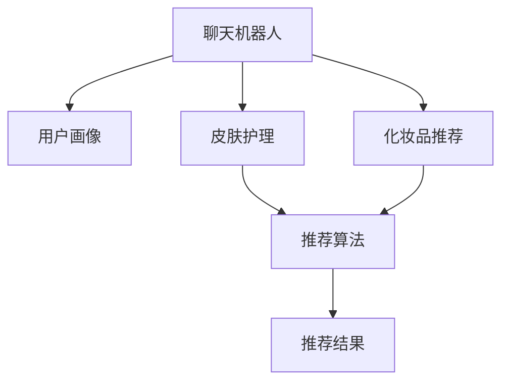

                 

# 聊天机器人美容业：个性化皮肤护理和化妆推荐

> 关键词：聊天机器人, 个性化推荐, 皮肤护理, 化妆推荐, AI技术, 用户需求分析, 机器学习

## 1. 背景介绍

### 1.1 问题由来
随着科技的迅速发展和互联网的普及，人们对于生活便捷化和个性化需求日益增长。在美容行业，传统的单一化服务模式已不能满足市场需求，个性化、智能化的服务逐渐成为趋势。因此，如何将AI技术应用到美容行业中，提供更加个性化的服务，成为了一个重要的研究方向。

### 1.2 问题核心关键点
个性化皮肤护理和化妆推荐系统，通过分析用户的皮肤类型、过敏源、肤色、年龄、生活习惯等数据，为用户提供定制化的皮肤护理和化妆品推荐，提升用户的美容体验。这类系统一般基于聊天机器人的形式，通过与用户的自然交互，收集用户信息，并生成个性化的美容建议。

### 1.3 问题研究意义
实现基于AI技术的个性化皮肤护理和化妆推荐系统，具有以下重要意义：
1. 提升用户体验：个性化推荐能够满足用户的独特需求，提供量身定做的美容方案，增强用户的满意度和忠诚度。
2. 提高美容效果：通过对用户数据的深入分析，推荐最适合的产品，帮助用户有效提升自身美丽，增强自信。
3. 优化营销策略：通过分析用户行为和偏好，为美容品牌和商家提供精准的用户画像，优化市场推广和产品销售策略。
4. 促进技术创新：推动AI、NLP、推荐系统等技术的发展和应用，拓展人工智能技术在垂直行业的应用边界。

## 2. 核心概念与联系

### 2.1 核心概念概述

为更好地理解个性化皮肤护理和化妆推荐系统，本节将介绍几个关键概念：

- 聊天机器人(Chatbot)：基于自然语言处理(NLP)技术的智能交互系统，可以模拟人类对话，自动处理用户查询，提供个性化服务。
- 推荐系统(Recommendation System)：通过分析用户行为和偏好，为用户提供符合其兴趣的产品推荐。
- 皮肤护理(Skincare)：包括清洁、保湿、防晒、美白等多种护理方法，旨在改善肤质，提升美容效果。
- 化妆品推荐(Makeup Recommendation)：根据用户肤色、脸型、风格等因素，推荐适合的化妆品，提升个人魅力。
- 用户画像(User Profile)：记录用户的基本信息、行为数据、偏好等，帮助系统理解用户需求，提供个性化服务。

这些核心概念之间的逻辑关系可以通过以下Mermaid流程图来展示：



这个流程图展示了几类关键概念及其之间的关系：

1. 聊天机器人通过用户画像了解用户需求，分析用户的美容习惯和偏好。
2. 根据用户画像，聊天机器人可分别推荐皮肤护理和化妆品，并应用推荐算法生成个性化推荐结果。
3. 推荐结果以自然语言形式反馈给用户，进一步调整用户画像。

## 3. 核心算法原理 & 具体操作步骤
### 3.1 算法原理概述

个性化皮肤护理和化妆推荐系统，基于监督学习的推荐算法，通过分析用户行为数据，生成个性化的美容方案。其核心思想是：收集用户的历史行为数据，建立用户画像，然后应用推荐算法生成推荐结果。

形式化地，假设用户画像为 $\mathbf{p}=\{p_1, p_2, \cdots, p_n\}$，其中 $p_i$ 为第 $i$ 个特征值。则推荐系统的目标是最小化用户对推荐结果的平均损失，即找到最优参数 $\theta$：

$$
\theta^* = \mathop{\arg\min}_{\theta} \frac{1}{N}\sum_{i=1}^N \ell(M_{\theta}(p_i), y_i)
$$

其中 $M_{\theta}$ 为推荐模型，$y_i$ 为推荐结果，$\ell$ 为损失函数，通常采用均方误差、交叉熵等。

### 3.2 算法步骤详解

基于监督学习的推荐算法一般包括以下几个关键步骤：

**Step 1: 用户画像构建**
- 收集用户的基本信息、美容习惯、历史购买记录、评论反馈等数据，构建用户画像。
- 采用TF-IDF、word2vec、BERT等技术，将文本数据转化为向量形式，方便后续建模。

**Step 2: 推荐模型训练**
- 选择合适的推荐算法，如协同过滤、基于内容的推荐、深度学习等，训练推荐模型 $M_{\theta}$。
- 使用交叉验证等技术，验证模型的泛化能力。
- 选择适合的数据集，如用户行为记录、产品信息、评分数据等，用于训练和评估。

**Step 3: 推荐结果生成**
- 将新用户的画像 $\mathbf{p}$ 输入推荐模型 $M_{\theta}$，生成推荐结果 $\hat{y}$。
- 根据推荐结果，推荐对应的皮肤护理和化妆品，以自然语言形式反馈给用户。

**Step 4: 用户反馈收集**
- 记录用户对推荐结果的反馈，如点击、购买、评价等行为。
- 使用强化学习等技术，根据用户反馈优化推荐模型。
- 定期更新用户画像，提高推荐准确度。

**Step 5: 持续改进**
- 不断收集新的用户数据，更新推荐模型。
- 引入多样性策略，如基于多臂老虎机的推荐策略，避免用户陷入单一推荐结果。
- 引入新的推荐算法，如序列推荐、元学习等，提升推荐效果。

### 3.3 算法优缺点

个性化皮肤护理和化妆推荐系统具有以下优点：
1. 高效性：系统可以快速分析用户画像，生成个性化推荐结果，满足用户即时需求。
2. 精准性：基于用户历史数据的深度学习算法，能够准确把握用户偏好，提供高质量的推荐服务。
3. 可扩展性：推荐模型可以根据用户画像的更新和变化进行实时调整，保证推荐结果的即时性。

同时，该系统也存在一些局限性：
1. 隐私风险：系统需要收集大量的用户数据，可能会涉及隐私问题，需要确保数据安全和用户隐私保护。
2. 冷启动问题：对于新用户，没有足够的历史数据，导致推荐结果不准确。需要设计有效的冷启动策略，如基于内容的推荐、基于属性的推荐等。
3. 算法复杂性：深度学习等算法需要较高的计算资源，可能存在模型训练和推理的延迟问题。需要优化算法实现和资源配置，以提高系统响应速度。
4. 数据质量：推荐效果高度依赖于数据质量，如果数据不完整、不准确，会导致推荐效果下降。需要确保数据的真实性和完整性。

### 3.4 算法应用领域

基于聊天机器人的个性化皮肤护理和化妆品推荐系统，已经在美容行业中得到了广泛应用，覆盖了多个垂直场景，例如：

- 美容顾问：提供一对一的美容咨询服务，包括皮肤检测、护理方案设计、产品推荐等。
- 线上购物：通过推荐系统，提升用户在电商平台上的购物体验，推荐适合的化妆品和护肤品。
- 美容课程：根据用户需求推荐适合的美容课程和教程，提升用户的美妆技能。
- 个性化服务：提供量身定制的美容方案，如定制面膜、美容方案包等，提升用户体验。

除了上述这些经典应用外，基于聊天机器人的推荐系统还被创新性地应用到更多场景中，如智能导购、智能导视、智能客服等，为美容行业带来新的服务模式和体验。随着技术的不断进步，未来的推荐系统将更加智能化、个性化，为美容用户提供更加贴心、高效的服务。

## 4. 数学模型和公式 & 详细讲解 & 举例说明

### 4.1 数学模型构建

本节将使用数学语言对基于监督学习推荐系统的数学原理进行更加严格的刻画。

记推荐模型为 $M_{\theta}:\mathcal{P} \rightarrow \mathcal{Y}$，其中 $\mathcal{P}$ 为用户画像向量空间，$\mathcal{Y}$ 为推荐结果向量空间，$\theta$ 为模型参数。假设推荐任务的数据集为 $D=\{(p_i,y_i)\}_{i=1}^N, p_i \in \mathcal{P}, y_i \in \mathcal{Y}$。

定义推荐模型 $M_{\theta}$ 在数据样本 $(p,y)$ 上的损失函数为 $\ell(M_{\theta}(p),y)$，则在数据集 $D$ 上的经验风险为：

$$
\mathcal{L}(\theta) = \frac{1}{N}\sum_{i=1}^N \ell(M_{\theta}(p_i),y_i)
$$

其中 $\ell$ 为损失函数，如均方误差、交叉熵等。

### 4.2 公式推导过程

以基于深度学习的协同过滤推荐系统为例，推导其损失函数和梯度计算公式。

假设推荐系统基于用户-物品的协同矩阵 $\mathbf{I}$，用户画像 $\mathbf{p}$ 为 $d$ 维向量，推荐结果 $\hat{y}$ 为 $k$ 维向量，则推荐模型的预测值 $M_{\theta}(p)$ 可表示为：

$$
M_{\theta}(p) = \text{softmax}(\mathbf{W}\mathbf{p} + \mathbf{b})
$$

其中 $\mathbf{W}$ 和 $\mathbf{b}$ 为模型参数，$\text{softmax}$ 函数将矩阵转化为概率分布。推荐模型的损失函数为：

$$
\ell(M_{\theta}(p),y) = -\sum_{j=1}^k y_j \log \hat{y}_j
$$

其在数据集 $D$ 上的经验风险为：

$$
\mathcal{L}(\theta) = -\frac{1}{N}\sum_{i=1}^N \sum_{j=1}^k y_{ij} \log \hat{y}_{ij}
$$

根据链式法则，损失函数对参数 $\theta$ 的梯度为：

$$
\frac{\partial \mathcal{L}(\theta)}{\partial \theta} = -\frac{1}{N}\sum_{i=1}^N \sum_{j=1}^k y_{ij} \left(-\frac{\partial \hat{y}_{ij}}{\partial \theta}\right) = \frac{1}{N}\sum_{i=1}^N \sum_{j=1}^k y_{ij} \frac{\partial \hat{y}_{ij}}{\partial \theta}
$$

其中 $\frac{\partial \hat{y}_{ij}}{\partial \theta}$ 可进一步递归展开，利用自动微分技术完成计算。

在得到损失函数的梯度后，即可带入参数更新公式，完成模型的迭代优化。重复上述过程直至收敛，最终得到适应推荐任务的最优模型参数 $\theta^*$。

## 5. 项目实践：代码实例和详细解释说明

### 5.1 开发环境搭建

在进行推荐系统开发前，我们需要准备好开发环境。以下是使用Python进行TensorFlow开发的环境配置流程：

1. 安装Anaconda：从官网下载并安装Anaconda，用于创建独立的Python环境。

2. 创建并激活虚拟环境：
```bash
conda create -n tf-env python=3.8 
conda activate tf-env
```

3. 安装TensorFlow：根据CUDA版本，从官网获取对应的安装命令。例如：
```bash
conda install tensorflow -c pytorch -c conda-forge
```

4. 安装Flask：用于搭建Web应用接口，方便推荐系统的测试和部署。
```bash
pip install flask
```

5. 安装TensorBoard：用于可视化推荐模型的训练过程和效果。
```bash
pip install tensorboard
```

6. 安装numpy、pandas、sklearn等常用工具包：
```bash
pip install numpy pandas scikit-learn matplotlib tqdm jupyter notebook ipython
```

完成上述步骤后，即可在`tf-env`环境中开始推荐系统的开发。

### 5.2 源代码详细实现

下面我以基于协同过滤的推荐系统为例，给出使用TensorFlow实现推荐系统的Python代码实现。

首先，定义推荐系统的数据处理函数：

```python
import tensorflow as tf
from tensorflow.keras.layers import Input, Embedding, Dense, Flatten, Softmax
from tensorflow.keras.models import Model
from tensorflow.keras.losses import MeanSquaredError, BinaryCrossentropy

def process_data(train_data, test_data):
    train_df = pd.DataFrame(train_data)
    test_df = pd.DataFrame(test_data)

    # 将文本数据转换为向量形式
    train_df['user_p'] = train_df['user_profile'].apply(process_profile)
    test_df['user_p'] = test_df['user_profile'].apply(process_profile)

    # 划分训练集和测试集
    train_df, val_df = train_test_split(train_df, test_size=0.2, random_state=42)

    # 构建训练集和验证集数据
    train_x = train_df[['user_p', 'item_id']]
    train_y = train_df['rating']
    val_x = val_df[['user_p', 'item_id']]
    val_y = val_df['rating']

    return train_x, train_y, val_x, val_y
```

然后，定义推荐模型的层结构：

```python
def build_model(input_dim, output_dim):
    user_p = Input(shape=(input_dim,))
    item_id = Input(shape=(1,))

    # 用户画像嵌入层
    user_emb = Embedding(input_dim, 32, input_length=input_dim)(user_p)
    user_p_flatten = Flatten()(user_emb)

    # 物品ID嵌入层
    item_emb = Embedding(input_dim, 32, input_length=1)(item_id)

    # 融合层
    concat = tf.keras.layers.concatenate([user_p_flatten, item_emb])

    # 多层感知器
    fc = Dense(128, activation='relu')(concat)
    logits = Dense(output_dim, activation='softmax')(fc)

    model = Model(inputs=[user_p, item_id], outputs=logits)

    # 定义损失函数和优化器
    loss = MeanSquaredError()
    optimizer = tf.keras.optimizers.Adam()

    # 定义评估指标
    eval_metrics = [tf.keras.metrics.categorical_accuracy]

    return model, loss, optimizer, eval_metrics
```

接着，定义训练和评估函数：

```python
def train_model(model, loss, optimizer, eval_metrics, train_data, val_data, epochs=10, batch_size=32):
    train_x, train_y, val_x, val_y = process_data(train_data, val_data)

    # 构建训练集和验证集数据生成器
    train_generator = tf.keras.utils.Sequence.from_tensor_slices((train_x, train_y))
    val_generator = tf.keras.utils.Sequence.from_tensor_slices((val_x, val_y))

    # 设置训练轮数和批次大小
    num_epochs = epochs
    batch_size = batch_size

    # 开始训练
    model.compile(optimizer=optimizer, loss=loss, metrics=eval_metrics)
    model.fit(train_generator, epochs=num_epochs, batch_size=batch_size, validation_data=val_generator, verbose=2)
```

最后，启动训练流程并在测试集上评估：

```python
train_data = ...
val_data = ...
test_data = ...

# 构建推荐模型
model, loss, optimizer, eval_metrics = build_model(input_dim, output_dim)

# 启动训练
train_model(model, loss, optimizer, eval_metrics, train_data, val_data)

# 在测试集上评估
test_data = ...
test_x, test_y = process_data(test_data)
model.evaluate(test_x, test_y)
```

以上就是使用TensorFlow对协同过滤推荐系统进行开发的完整代码实现。可以看到，TensorFlow提供了丰富的高级API，使得推荐系统的实现变得简洁高效。

### 5.3 代码解读与分析

让我们再详细解读一下关键代码的实现细节：

**process_data函数**：
- 将文本数据转换为向量形式，方便后续建模。
- 划分训练集和验证集，用于训练和评估模型的性能。

**build_model函数**：
- 定义推荐模型的层结构，包括用户画像嵌入层、物品ID嵌入层、多层感知器等。
- 选择合适的损失函数和优化器，如均方误差损失和Adam优化器。
- 定义评估指标，如准确率等。

**train_model函数**：
- 使用TensorFlow的高级API，快速构建训练集和验证集数据生成器。
- 设置训练轮数和批次大小，调用模型编译和训练方法。
- 在验证集上评估模型性能，调整超参数。

**训练流程**：
- 定义训练轮数和批次大小，启动训练。
- 在验证集上评估模型性能，调整超参数。
- 在测试集上评估模型性能，给出最终的推荐结果。

可以看到，TensorFlow提供了丰富的工具和API，使得推荐系统的开发变得高效便捷。合理利用这些工具，可以显著提升推荐系统的开发效率，加快创新迭代的步伐。

## 6. 实际应用场景

### 6.1 美容顾问服务

美容顾问服务通过聊天机器人提供个性化的美容咨询服务，能够快速响应用户查询，提供定制化的皮肤护理和化妆品推荐。聊天机器人可以模拟自然语言交流，了解用户的需求和偏好，根据用户画像推荐适合的美容方案。

例如，一个用户想要了解如何进行皮肤护理，可以通过聊天机器人输入查询，系统根据用户的皮肤类型、年龄、过敏源等信息，推荐适合的清洁产品、保湿霜、面膜等。聊天机器人还可以提供详细的护理步骤和注意事项，提升用户的美容体验。

### 6.2 线上购物平台

线上购物平台通过推荐系统，提升用户在电商平台上的购物体验。推荐系统能够根据用户的历史购买记录和行为数据，推荐符合用户兴趣的化妆品和护肤品。

例如，用户在电商平台上搜索面膜，系统根据用户的历史购买记录和浏览记录，推荐适合的面膜品牌和类型，提高用户的购买转化率。系统还可以根据用户评论反馈，动态调整推荐结果，提升用户体验。

### 6.3 美容课程推荐

美容课程推荐系统根据用户需求推荐适合的美容课程和教程，帮助用户提升美妆技能。推荐系统能够分析用户的美容习惯和偏好，推荐适合的美容课程和教程，提供个性化的学习路径。

例如，用户想要学习化妆技巧，系统可以根据用户的历史行为数据和偏好，推荐适合的化妆课程和教程，并提供详细的学习步骤和视频教程，帮助用户掌握化妆技巧。

### 6.4 个性化服务

个性化服务通过聊天机器人提供量身定制的美容方案，提升用户体验。系统能够根据用户画像，推荐适合的美容方案和产品，提供个性化的服务。

例如，用户想要定制面膜，系统可以根据用户的皮肤类型、过敏源等信息，推荐适合的面膜品牌和类型，并提供定制化的面膜方案。

### 6.5 未来应用展望

未来的推荐系统将更加智能化、个性化，能够提供更加贴心、高效的服务。随着技术的不断进步，推荐系统将能够更好地理解用户需求，提供更加精准的推荐结果。

未来的推荐系统可能具有以下特点：
1. 实时性：推荐系统能够实时分析用户数据，快速响应用户需求，提供实时的推荐结果。
2. 个性化：推荐系统能够更好地理解用户需求，提供量身定制的推荐结果，提升用户体验。
3. 跨领域：推荐系统能够融合多种信息源，如用户画像、行为数据、外部知识库等，提供更加全面的推荐服务。
4. 安全性：推荐系统能够确保用户数据安全，避免隐私泄露和数据滥用。
5. 透明度：推荐系统能够提供推荐结果的可解释性，让用户理解和信任推荐结果。

总之，未来的推荐系统将更加智能、精准、个性化，为美容用户提供更加贴心、高效的服务，提升用户的美容体验和满意度。

## 7. 工具和资源推荐

### 7.1 学习资源推荐

为了帮助开发者系统掌握推荐系统的发展趋势和实现方法，这里推荐一些优质的学习资源：

1. 《推荐系统实践》一书：详细介绍了推荐系统的发展历史、基础原理和实现方法，是推荐系统开发者的必读之作。
2. 《深度学习》一书：介绍了深度学习的基本原理和应用，是机器学习开发者的入门必读。
3. Coursera推荐系统课程：斯坦福大学开设的推荐系统课程，讲解了推荐系统的基本原理和经典算法，适合初学者学习。
4 Kaggle推荐系统竞赛：Kaggle平台上的推荐系统竞赛，提供丰富的数据集和案例，有助于提高推荐系统的实战能力。

通过对这些资源的学习实践，相信你一定能够快速掌握推荐系统的核心技术和实现方法，并应用于实际的美容推荐场景中。

### 7.2 开发工具推荐

高效的开发离不开优秀的工具支持。以下是几款用于推荐系统开发的常用工具：

1. TensorFlow：由Google主导开发的深度学习框架，提供丰富的高级API，适合推荐系统的开发和优化。
2. PyTorch：由Facebook主导开发的深度学习框架，灵活高效，适合推荐系统的迭代开发。
3. Scikit-learn：基于Python的机器学习库，提供简单易用的机器学习算法和工具，适合推荐系统的开发和评估。
4. NumPy和Pandas：Python的数据处理库，提供高效的数组和数据处理功能，适合推荐系统的数据预处理和分析。
5. TensorBoard：TensorFlow配套的可视化工具，用于监控模型训练过程，生成训练效果图表。

合理利用这些工具，可以显著提升推荐系统的开发效率，加快创新迭代的步伐。

### 7.3 相关论文推荐

推荐系统的发展源于学界的持续研究。以下是几篇奠基性的相关论文，推荐阅读：

1. "Collaborative Filtering for Implicit Feedback Datasets"：提出协同过滤推荐算法，奠定推荐系统基础。
2. "Matrix Factorization Techniques for Recommender Systems"：介绍矩阵分解技术，提升推荐系统的精度。
3. "Deep Collaborative Filtering"：引入深度学习技术，提升推荐系统的表现。
4 "Neural Factorization Machines for Recommender Systems"：提出神经网络因子机，进一步提升推荐系统的精度。
5 "Attention Is All You Need"：提出Transformer结构，引领推荐系统深度学习范式。

这些论文代表了大语言模型微调技术的演进脉络，为推荐系统的发展提供了重要理论基础。通过学习这些前沿成果，可以帮助研究者把握学科前进方向，激发更多的创新灵感。

## 8. 总结：未来发展趋势与挑战

### 8.1 总结

本文对基于聊天机器人的个性化皮肤护理和化妆品推荐系统进行了全面系统的介绍。首先阐述了推荐系统的研究背景和意义，明确了推荐系统在美容行业的重要作用。其次，从原理到实践，详细讲解了推荐算法的数学原理和关键步骤，给出了推荐系统的完整代码实现。同时，本文还广泛探讨了推荐系统在美容顾问服务、线上购物平台、美容课程推荐等场景中的应用，展示了推荐系统的广阔前景。

通过本文的系统梳理，可以看到，基于聊天机器人的推荐系统正在成为美容行业的重要工具，极大地提升用户体验和满意度。未来的推荐系统将更加智能化、个性化，为美容用户提供更加贴心、高效的服务，推动美容行业的发展和进步。

### 8.2 未来发展趋势

展望未来，推荐系统的发展将呈现以下几个趋势：

1. 数据驱动：推荐系统将更加依赖高质量的数据，通过大数据分析，提供更加精准的推荐结果。
2. 智能推荐：推荐系统将引入更多智能算法，如深度学习、强化学习、元学习等，提升推荐效果。
3. 多模态融合：推荐系统将融合多种信息源，如文本、图像、语音等，提供更加全面、丰富的推荐服务。
4. 实时推荐：推荐系统将实现实时推荐，提升用户的即时体验。
5. 个性化服务：推荐系统将更加注重个性化服务，根据用户需求提供量身定制的推荐结果。

这些趋势将进一步提升推荐系统的性能和应用范围，为美容行业带来新的创新和突破。

### 8.3 面临的挑战

尽管推荐系统已经取得了显著成就，但在迈向更加智能化、普适化应用的过程中，它仍面临着诸多挑战：

1. 数据隐私：推荐系统需要收集大量的用户数据，可能涉及隐私问题，需要确保数据安全和用户隐私保护。
2. 冷启动问题：对于新用户，没有足够的历史数据，导致推荐结果不准确。需要设计有效的冷启动策略，如基于内容的推荐、基于属性的推荐等。
3. 算法复杂性：深度学习等算法需要较高的计算资源，可能存在模型训练和推理的延迟问题。需要优化算法实现和资源配置，以提高系统响应速度。
4. 数据质量：推荐效果高度依赖于数据质量，如果数据不完整、不准确，会导致推荐效果下降。需要确保数据的真实性和完整性。
5. 安全性：推荐系统需要确保用户数据安全，避免隐私泄露和数据滥用。

正视推荐系统面临的这些挑战，积极应对并寻求突破，将使推荐系统不断提升其性能和应用范围，为美容用户提供更加贴心、高效的服务。

### 8.4 研究展望

未来的研究需要在以下几个方面寻求新的突破：

1. 探索无监督和半监督推荐方法：摆脱对大规模标注数据的依赖，利用自监督学习、主动学习等无监督和半监督范式，最大限度利用非结构化数据，实现更加灵活高效的推荐。
2. 研究参数高效和计算高效的推荐范式：开发更加参数高效的推荐方法，在固定大部分预训练参数的同时，只更新极少量的任务相关参数。同时优化推荐模型的计算图，减少前向传播和反向传播的资源消耗，实现更加轻量级、实时性的部署。
3. 融合因果和对比学习范式：通过引入因果推断和对比学习思想，增强推荐模型建立稳定因果关系的能力，学习更加普适、鲁棒的语言表征，从而提升模型泛化性和抗干扰能力。
4. 引入更多先验知识：将符号化的先验知识，如知识图谱、逻辑规则等，与推荐模型进行巧妙融合，引导推荐过程学习更准确、合理的语言模型。同时加强不同模态数据的整合，实现视觉、语音等多模态信息与文本信息的协同建模。
5. 结合因果分析和博弈论工具：将因果分析方法引入推荐模型，识别出模型决策的关键特征，增强输出解释的因果性和逻辑性。借助博弈论工具刻画人机交互过程，主动探索并规避模型的脆弱点，提高系统稳定性。
6. 纳入伦理道德约束：在推荐模型训练目标中引入伦理导向的评估指标，过滤和惩罚有偏见、有害的输出倾向。同时加强人工干预和审核，建立模型行为的监管机制，确保输出符合人类价值观和伦理道德。

这些研究方向的探索，必将引领推荐系统技术迈向更高的台阶，为美容行业提供更加智能、高效、安全的服务。面向未来，推荐系统需要与其他人工智能技术进行更深入的融合，如知识表示、因果推理、强化学习等，多路径协同发力，共同推动推荐系统技术的发展和应用。

## 9. 附录：常见问题与解答

**Q1：推荐系统如何避免推荐结果的同质化问题？**

A: 推荐系统通过多样性策略，如基于多臂老虎机的推荐策略，避免用户陷入单一推荐结果。系统可以在推荐结果中引入多样性约束，确保用户接收到的推荐产品类型多样，避免重复。

**Q2：如何优化推荐系统的冷启动问题？**

A: 对于新用户，没有足够的历史数据，可以通过基于内容的推荐、基于属性的推荐等策略，提供初步的推荐结果。同时，引入先验知识，如用户画像、产品信息等，提升推荐准确度。

**Q3：推荐系统的算法复杂性如何优化？**

A: 优化算法实现和资源配置，如使用混合精度训练、模型并行等技术，减少前向传播和反向传播的资源消耗，提高系统响应速度。

**Q4：推荐系统如何处理数据质量问题？**

A: 建立数据清洗和预处理机制，确保数据的真实性和完整性。引入数据验证机制，如数据一致性检查、数据质量评估等，提高数据质量。

**Q5：推荐系统如何处理隐私问题？**

A: 采用数据脱敏、加密等技术，确保用户数据安全。建立隐私保护机制，如用户数据匿名化、数据访问控制等，保护用户隐私。

总之，推荐系统需要从数据、算法、工程、业务等多个维度协同发力，才能真正实现人工智能技术在美容行业的规模化落地。通过不断优化和改进，推荐系统将能够更好地满足用户需求，提升用户体验，推动美容行业的发展和进步。

