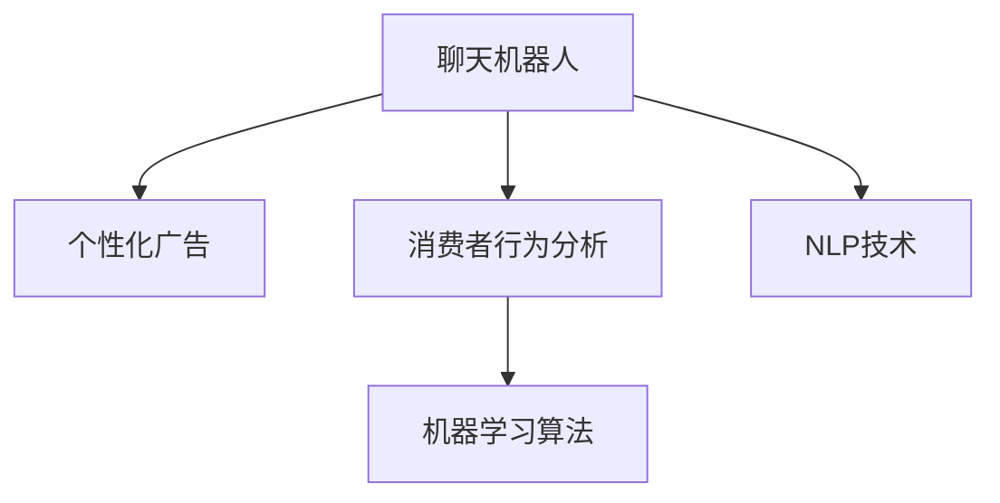
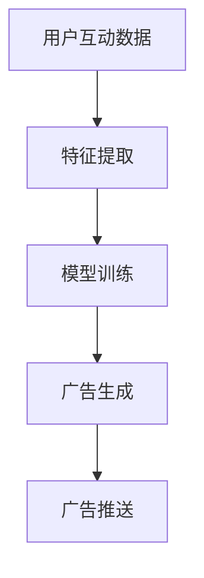
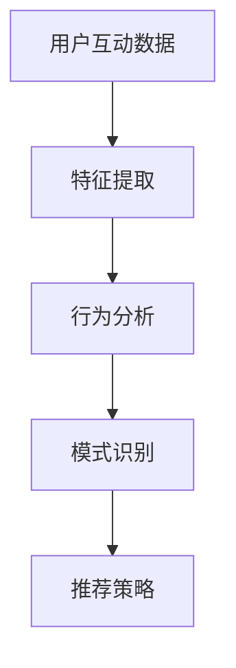

                 

# 聊天机器人营销：个性化广告和洞察力

在数字化转型的浪潮中，企业营销的边界被不断扩展，智能聊天机器人逐渐成为企业客户互动、品牌推广、市场洞察的重要工具。本文聚焦于聊天机器人在个性化广告和洞察力方面的应用，深度剖析其工作原理、算法实现、实施步骤及潜在挑战。

## 1. 背景介绍

### 1.1 问题由来

随着社交媒体和智能设备的普及，消费者获取信息和进行互动的方式发生了根本变化。企业传统以“推式”为主的信息传播模式逐渐失效，取而代之的是基于消费者兴趣、行为的“拉式”互动模式。消费者不再被动接受信息，而是主动搜索和互动，对广告的响应更加精准和个性化。

智能聊天机器人通过自动化与消费者互动，能够实现个性化广告推送和深入洞察消费者行为，为企业的精准营销提供了全新的途径。聊天机器人不仅仅是一个自动回复工具，更是一个基于数据的智能决策系统，能够在互动中收集和分析用户数据，辅助企业制定营销策略。

### 1.2 问题核心关键点

聊天机器人营销的核心关键点包括：
- **个性化广告推送**：通过分析用户行为和偏好，智能生成个性化广告内容，提升广告效果。
- **消费者行为洞察**：实时收集用户互动数据，分析用户兴趣和需求，辅助企业制定针对性营销策略。
- **用户交互优化**：通过智能回答和引导，提升用户体验和满意度，增加用户粘性。
- **数据驱动决策**：利用机器学习算法对用户数据进行深度分析，发现隐藏的用户行为模式和趋势，为决策提供科学依据。

## 2. 核心概念与联系

### 2.1 核心概念概述

为了更好地理解聊天机器人营销，本文将介绍几个密切相关的核心概念：

- **聊天机器人**：一种基于人工智能的自然语言处理技术，能够通过对话系统与用户互动，执行信息查询、订单处理等任务。
- **个性化广告**：根据用户行为和兴趣，定制并推送个性化的广告内容，提高广告的点击率和转化率。
- **消费者行为分析**：通过分析用户互动数据，识别用户兴趣、偏好和行为模式，为营销策略提供依据。
- **机器学习算法**：如聚类分析、分类、回归等，用于分析用户数据，提取有用的模式和洞察。
- **NLP技术**：自然语言处理技术，包括语言模型、情感分析、实体识别等，用于处理和理解用户语言。

这些核心概念之间的逻辑关系可以通过以下Mermaid流程图来展示：



这个流程图展示了聊天机器人营销的核心概念及其之间的关系：

1. 聊天机器人通过与用户互动，收集用户行为数据。
2. 利用消费者行为分析技术，对用户数据进行深入分析。
3. 应用机器学习算法，挖掘用户行为模式和趋势。
4. 结合NLP技术，理解用户语言和情感。
5. 基于以上分析结果，生成个性化广告内容。

## 3. 核心算法原理 & 具体操作步骤

### 3.1 算法原理概述

聊天机器人营销的算法原理主要涉及个性化广告生成和消费者行为分析两个方面：

1. **个性化广告生成**：通过机器学习算法对用户行为数据进行分析，生成符合用户兴趣和偏好的广告内容。
2. **消费者行为分析**：利用机器学习算法对用户互动数据进行聚类、分类、回归等分析，发现用户的兴趣和行为模式。

### 3.2 算法步骤详解

#### 3.2.1 个性化广告生成

1. **数据收集**：从用户互动中收集点击、浏览、购买等行为数据。
2. **特征工程**：对行为数据进行特征提取和转换，如时间、地点、商品类别、互动内容等。
3. **模型训练**：使用聚类、分类、回归等机器学习算法对用户特征进行建模，生成用户兴趣标签。
4. **广告生成**：根据用户兴趣标签，生成个性化广告内容，如文案、图片、视频等。
5. **投放优化**：通过A/B测试等方法，评估广告效果，不断优化广告内容和投放策略。

#### 3.2.2 消费者行为分析

1. **数据收集**：从聊天机器人互动中收集用户的聊天记录、互动内容等。
2. **文本预处理**：对聊天记录进行分词、去除停用词、提取情感等文本预处理。
3. **特征提取**：提取用户互动中的关键特征，如关键词、情感倾向、互动频率等。
4. **聚类分析**：使用K-means、LDA等聚类算法，将用户分为不同兴趣群体。
5. **模式分析**：对聚类结果进行分析，识别用户行为模式和趋势。
6. **行为预测**：利用回归等算法，预测用户未来的行为和需求。

### 3.3 算法优缺点

聊天机器人营销的优势在于能够实现实时个性化广告推送和深入用户行为分析：
- **高效互动**：聊天机器人可以全天候提供服务，提升用户体验和满意度。
- **数据驱动**：通过数据分析，精准定位用户需求，提升广告效果。
- **用户粘性**：通过智能引导，增加用户互动频率和粘性。
- **营销优化**：辅助企业制定针对性营销策略，提高ROI。

然而，也存在一些局限性：
- **隐私问题**：用户互动数据涉及隐私，需合理使用和保护。
- **技术门槛**：需要具备较强的数据分析和算法开发能力。
- **数据质量**：用户数据的完整性和准确性直接影响分析结果。
- **用户接受度**：部分用户可能对聊天机器人存在抵触情绪。

### 3.4 算法应用领域

聊天机器人营销在多个领域有着广泛的应用：

- **零售电商**：通过个性化推荐和互动，提升用户购物体验，增加销售转化。
- **金融服务**：利用用户互动数据，提供个性化的金融产品推荐和客户服务。
- **旅游服务**：提供实时旅游资讯和行程规划，提升用户体验和满意度。
- **医疗健康**：通过智能问答，提供健康咨询和个性化治疗建议。
- **教育培训**：提供个性化的学习推荐和互动，提升学习效果。

## 4. 数学模型和公式 & 详细讲解 & 举例说明

### 4.1 数学模型构建

在本节中，我们将通过数学模型来详细讲解聊天机器人营销的核心算法。

1. **个性化广告生成模型**：
   - **输入**：用户行为数据 $X$，包括点击、浏览、购买等行为。
   - **输出**：个性化广告内容 $Y$。

   模型形式化表示为：
   $$
   Y = f(X)
   $$

2. **消费者行为分析模型**：
   - **输入**：用户互动数据 $Z$，包括聊天记录、互动内容等。
   - **输出**：用户兴趣群体 $G$，行为模式 $P$。

   模型形式化表示为：
   $$
   G, P = g(Z)
   $$

### 4.2 公式推导过程

#### 4.2.1 个性化广告生成

假设用户行为数据 $X$ 包含 $d$ 个特征，如点击次数、浏览时间、购买金额等，用 $\boldsymbol{x} \in \mathbb{R}^d$ 表示。个性化广告生成的目标是将 $X$ 映射到广告内容 $Y$。

我们使用神经网络模型进行映射，其中 $\boldsymbol{w} \in \mathbb{R}^d$ 为模型参数，$b \in \mathbb{R}$ 为偏置项，$f(\boldsymbol{x})$ 表示模型输出。

假设 $Y$ 为文本数据，则我们定义损失函数为交叉熵损失：
$$
L = -\frac{1}{N} \sum_{i=1}^N \sum_{j=1}^k y_{ij} \log p_{ij}
$$
其中 $y_{ij}$ 为第 $i$ 个样本在类别 $j$ 上的真实标签，$p_{ij}$ 为模型预测概率。

使用随机梯度下降优化算法，更新模型参数 $\boldsymbol{w}, b$：
$$
\boldsymbol{w}, b \leftarrow \boldsymbol{w} - \eta \nabla_{\boldsymbol{w}, b}L
$$
其中 $\eta$ 为学习率。

#### 4.2.2 消费者行为分析

假设用户互动数据 $Z$ 包含 $m$ 个样本，每个样本包含 $n$ 个特征，用 $\boldsymbol{z}_i \in \mathbb{R}^n$ 表示。消费者行为分析的目标是将 $Z$ 聚类为不同兴趣群体 $G$，并分析用户行为模式 $P$。

我们使用K-means聚类算法，将用户分为 $k$ 个兴趣群体。K-means算法形式化表示为：
$$
\boldsymbol{\mu} = \mathop{\arg\min}_{\boldsymbol{\mu}} \sum_{i=1}^m \|\boldsymbol{z}_i - \boldsymbol{\mu}_g\|^2
$$
其中 $\boldsymbol{\mu}_g$ 为第 $g$ 个兴趣群体的中心点。

聚类结果 $G$ 和行为模式 $P$ 可通过以下公式表示：
$$
G = \mathop{\arg\min}_{G} \sum_{i=1}^m \sum_{g=1}^k \|\boldsymbol{z}_i - \boldsymbol{\mu}_g\|^2
$$
$$
P = \mathop{\arg\min}_{P} \sum_{i=1}^m \sum_{g=1}^k \|\boldsymbol{z}_i - \boldsymbol{\mu}_g\|^2
$$

### 4.3 案例分析与讲解

#### 4.3.1 电商个性化推荐

假设某电商平台通过聊天机器人收集了用户点击、浏览、购买等行为数据，提取了用户兴趣标签。基于这些标签，电商系统可以生成个性化广告内容，推送给用户。

电商系统的流程图如下：



其中，特征提取过程包括对行为数据进行向量化和特征选择，生成特征向量 $\boldsymbol{x}_i$。模型训练使用深度神经网络，对用户特征进行建模，生成用户兴趣标签 $y_i$。广告生成过程中，使用自动生成模型，根据兴趣标签生成广告文案和图片。广告推送阶段，利用推荐系统将广告内容推送给用户。

#### 4.3.2 金融个性化服务

某金融机构通过聊天机器人收集用户的互动数据，进行行为分析。分析结果显示，用户对理财产品的关注度和购买意愿。基于这些信息，金融机构可以制定针对性的理财推荐和营销策略。

金融机构的流程图如下：



其中，特征提取过程包括对互动数据进行预处理，提取关键词、情感等关键特征。行为分析阶段使用聚类算法，将用户分为不同兴趣群体。模式识别阶段使用回归算法，预测用户未来的购买意愿。推荐策略阶段，根据预测结果，制定个性化的理财推荐。

## 5. 项目实践：代码实例和详细解释说明

### 5.1 开发环境搭建

在进行项目实践前，我们需要准备好开发环境。以下是使用Python进行PyTorch开发的环境配置流程：

1. 安装Anaconda：从官网下载并安装Anaconda，用于创建独立的Python环境。

2. 创建并激活虚拟环境：
```bash
conda create -n pytorch-env python=3.8 
conda activate pytorch-env
```

3. 安装PyTorch：根据CUDA版本，从官网获取对应的安装命令。例如：
```bash
conda install pytorch torchvision torchaudio cudatoolkit=11.1 -c pytorch -c conda-forge
```

4. 安装TensorFlow：
```bash
pip install tensorflow
```

5. 安装Flask：
```bash
pip install flask
```

6. 安装相关库：
```bash
pip install numpy pandas scikit-learn nltk pydub
```

完成上述步骤后，即可在`pytorch-env`环境中开始项目实践。

### 5.2 源代码详细实现

下面我们以电商个性化推荐系统为例，给出使用TensorFlow进行项目开发的PyTorch代码实现。

首先，定义数据处理函数：

```python
import pandas as pd
from sklearn.preprocessing import StandardScaler
from sklearn.model_selection import train_test_split
from tensorflow.keras.preprocessing.text import Tokenizer
from tensorflow.keras.preprocessing.sequence import pad_sequences

def load_data(file_path):
    data = pd.read_csv(file_path)
    return data

def preprocess_data(data):
    # 数据预处理
    texts = data['text'].tolist()
    labels = data['label'].tolist()
    
    # 特征提取
    tokenizer = Tokenizer(num_words=5000, oov_token='<OOV>')
    tokenizer.fit_on_texts(texts)
    sequences = tokenizer.texts_to_sequences(texts)
    sequences = pad_sequences(sequences, maxlen=50, padding='post', truncating='post')
    
    # 特征标准化
    scaler = StandardScaler()
    features = scaler.fit_transform(sequences)
    
    # 划分训练集和测试集
    X_train, X_test, y_train, y_test = train_test_split(features, labels, test_size=0.2, random_state=42)
    
    return X_train, X_test, y_train, y_test

# 加载数据
data = load_data('data.csv')

# 数据预处理
X_train, X_test, y_train, y_test = preprocess_data(data)
```

然后，定义模型和训练函数：

```python
from tensorflow.keras.layers import Input, Embedding, Dense, LSTM, Dropout
from tensorflow.keras.models import Model
from tensorflow.keras.optimizers import Adam

def build_model(input_shape, output_shape):
    # 构建模型
    input = Input(shape=input_shape)
    x = Embedding(input_dim=5000, output_dim=128)(input)
    x = LSTM(64, dropout=0.2, recurrent_dropout=0.2)(x)
    x = Dropout(0.2)(x)
    x = Dense(32, activation='relu')(x)
    output = Dense(output_shape, activation='softmax')(x)
    
    model = Model(inputs=input, outputs=output)
    return model

# 定义模型
model = build_model(input_shape=(50,), output_shape=2)

# 定义优化器
optimizer = Adam(lr=0.001)

# 定义损失函数
loss_function = 'categorical_crossentropy'
```

接着，定义训练和评估函数：

```python
import numpy as np
from tensorflow.keras.callbacks import EarlyStopping

def train_model(model, X_train, y_train, X_test, y_test, epochs=10, batch_size=32):
    # 训练模型
    history = model.fit(X_train, y_train, epochs=epochs, batch_size=batch_size, validation_data=(X_test, y_test), callbacks=[EarlyStopping(patience=2)])
    
    # 评估模型
    test_loss, test_acc = model.evaluate(X_test, y_test)
    print(f'Test Loss: {test_loss:.4f}, Test Acc: {test_acc:.4f}')
    
    return history

# 训练模型
history = train_model(model, X_train, y_train, X_test, y_test)
```

最后，测试模型并可视化训练过程：

```python
import matplotlib.pyplot as plt

# 可视化训练过程
plt.plot(history.history['loss'], label='Train Loss')
plt.plot(history.history['val_loss'], label='Validation Loss')
plt.title('Model Training Loss')
plt.xlabel('Epoch')
plt.ylabel('Loss')
plt.legend()
plt.show()

plt.plot(history.history['accuracy'], label='Train Acc')
plt.plot(history.history['val_accuracy'], label='Validation Acc')
plt.title('Model Training Accuracy')
plt.xlabel('Epoch')
plt.ylabel('Accuracy')
plt.legend()
plt.show()
```

以上就是使用TensorFlow进行电商个性化推荐系统开发的完整代码实现。可以看到，TensorFlow提供了强大的API和可视化工具，可以方便地进行模型构建、训练和评估。

### 5.3 代码解读与分析

让我们再详细解读一下关键代码的实现细节：

**数据处理函数**：
- `load_data`方法：加载数据集。
- `preprocess_data`方法：进行数据预处理，包括文本向量化、特征标准化、划分训练集和测试集。

**模型定义函数**：
- 使用TensorFlow的Keras API，定义一个包含嵌入层、LSTM层、Dropout层和全连接层的神经网络模型。
- 使用Adam优化器进行模型训练，设置学习率为0.001。
- 定义损失函数为交叉熵损失，适用于多分类任务。

**训练函数**：
- 使用Keras的`fit`方法训练模型，设置迭代轮数为10，批大小为32。
- 使用EarlyStopping回调函数，防止过拟合。
- 在训练过程中，记录损失和准确率，并在训练结束后输出测试集的结果。

**可视化训练过程**：
- 使用Matplotlib库，绘制损失和准确率的训练曲线。

可以看出，TensorFlow提供了丰富的工具和接口，使得模型开发和训练过程变得简洁高效。开发者可以集中精力在模型设计和算法实现上，而不必过多关注底层细节。

## 6. 实际应用场景

### 6.1 金融理财推荐

某金融机构通过聊天机器人收集用户互动数据，进行行为分析。分析结果显示，用户对理财产品的关注度和购买意愿。基于这些信息，金融机构可以制定针对性的理财推荐和营销策略。

金融机构的服务流程图如下：


其中，特征提取过程包括对互动数据进行预处理，提取关键词、情感等关键特征。行为分析阶段使用聚类算法，将用户分为不同兴趣群体。模式识别阶段使用回归算法，预测用户未来的购买意愿。推荐策略阶段，根据预测结果，制定个性化的理财推荐。

### 6.2 在线教育课程推荐

某在线教育平台通过聊天机器人收集用户互动数据，进行行为分析。分析结果显示，用户对不同课程的兴趣和学习进度。基于这些信息，平台可以推荐用户感兴趣和适合的课程，提升学习效果。

教育平台的服务流程图如下：


其中，特征提取过程包括对互动数据进行预处理，提取关键词、学习进度等关键特征。行为分析阶段使用聚类算法，将用户分为不同兴趣群体。模式识别阶段使用回归算法，预测用户未来的学习进度。推荐策略阶段，根据预测结果，推荐用户感兴趣和适合的课程。

### 6.3 智能客服系统

某电商平台通过聊天机器人收集用户互动数据，进行行为分析。分析结果显示，用户对不同商品和服务的关注度和反馈。基于这些信息，平台可以优化客服策略，提升用户满意度。

电商平台的服务流程图如下：


其中，特征提取过程包括对互动数据进行预处理，提取关键词、反馈内容等关键特征。行为分析阶段使用聚类算法，将用户分为不同兴趣群体。模式识别阶段使用回归算法，预测用户未来的行为。推荐策略阶段，根据预测结果，优化客服策略，提升用户满意度。

### 6.4 未来应用展望

随着聊天机器人技术的不断发展，其在个性化广告和洞察力方面的应用前景广阔。未来，我们期待以下几个方面的突破：

1. **多模态数据融合**：结合文本、语音、图像等多模态数据，提升用户行为分析的全面性和准确性。
2. **跨平台协同**：实现跨平台的用户互动数据整合，提供更一致的用户体验。
3. **隐私保护技术**：引入隐私保护技术，如差分隐私、联邦学习等，保障用户数据的隐私安全。
4. **实时互动优化**：通过实时反馈机制，不断优化聊天机器人交互策略，提升用户满意度。
5. **智能推荐算法**：引入更加先进的推荐算法，如协同过滤、深度学习等，提升个性化推荐的精度和效果。

这些方向的探索发展，将进一步拓展聊天机器人的应用边界，提升用户体验和品牌价值。

## 7. 工具和资源推荐

### 7.1 学习资源推荐

为了帮助开发者系统掌握聊天机器人营销的理论基础和实践技巧，这里推荐一些优质的学习资源：

1. 《深度学习》课程：斯坦福大学李飞飞教授开设的深度学习课程，涵盖深度学习的基础理论和实践应用。
2. 《自然语言处理综论》书籍：北京大学王斌教授主编，全面介绍了自然语言处理的理论和技术。
3. 《Python机器学习》书籍：由Stefan J. G. Müller和Peter Stuckey合著，深入浅出地讲解了Python机器学习应用。
4. 《TensorFlow实战》书籍：由王晋东教授合著，介绍了TensorFlow框架的搭建、训练和优化方法。
5. 《自然语言处理理论与实践》课程：由南洋理工大学提供的NLP课程，详细讲解了NLP的理论和实践。

通过对这些资源的学习实践，相信你一定能够快速掌握聊天机器人营销的精髓，并用于解决实际的NLP问题。

### 7.2 开发工具推荐

高效的开发离不开优秀的工具支持。以下是几款用于聊天机器人营销开发的常用工具：

1. TensorFlow：由Google主导开发的开源深度学习框架，生产部署方便，适合大规模工程应用。
2. PyTorch：由Facebook主导开发的开源深度学习框架，灵活的计算图，适合快速迭代研究。
3. NLTK：Python自然语言处理库，提供丰富的NLP工具和算法。
4. Flask：Python轻量级Web框架，用于搭建聊天机器人服务。
5. GCP AI和AWS AI：Google和Amazon提供的AI服务，可以快速搭建聊天机器人平台。

合理利用这些工具，可以显著提升聊天机器人营销项目的开发效率，加快创新迭代的步伐。

### 7.3 相关论文推荐

聊天机器人营销领域的研究论文不断涌现，以下是几篇奠基性的相关论文，推荐阅读：

1. GPT-3：OpenAI发布的GPT-3模型，展示了大语言模型在多模态数据处理和推荐系统中的应用。
2. DialoGPT：OpenAI发布的DialoGPT模型，展示了聊天机器人技术在对话系统中的应用。
3. SVM：Support Vector Machine，广泛应用于分类和回归任务，是推荐系统中的经典算法。
4. K-means：聚类算法，广泛应用于用户分群和行为分析。
5. CNN：卷积神经网络，广泛应用于图像和文本数据的特征提取和分析。

这些论文代表了大语言模型和聊天机器人技术的最新进展，阅读这些论文将有助于你深入理解相关技术，提升实践能力。

## 8. 总结：未来发展趋势与挑战

### 8.1 总结

本文对聊天机器人营销进行了全面系统的介绍。首先阐述了聊天机器人营销的背景和意义，明确了个性化广告推送和消费者行为分析的核心关键点。其次，从原理到实践，详细讲解了聊天机器人营销的数学模型和算法实现，提供了完整的数据处理和模型训练代码。最后，探讨了聊天机器人营销在金融理财、在线教育、智能客服等多个领域的应用前景，并提出了未来发展的方向和挑战。

通过本文的系统梳理，可以看到，聊天机器人营销技术正在成为数字化转型的重要工具，极大地提升了企业的市场竞争力和客户满意度。未来，随着技术的不断进步和应用场景的不断拓展，聊天机器人营销将发挥更大的作用，带来更多商业价值。

### 8.2 未来发展趋势

展望未来，聊天机器人营销将呈现以下几个发展趋势：

1. **多模态数据融合**：结合文本、语音、图像等多模态数据，提升用户行为分析的全面性和准确性。
2. **跨平台协同**：实现跨平台的用户互动数据整合，提供更一致的用户体验。
3. **隐私保护技术**：引入隐私保护技术，如差分隐私、联邦学习等，保障用户数据的隐私安全。
4. **实时互动优化**：通过实时反馈机制，不断优化聊天机器人交互策略，提升用户满意度。
5. **智能推荐算法**：引入更加先进的推荐算法，如协同过滤、深度学习等，提升个性化推荐的精度和效果。

这些趋势将进一步拓展聊天机器人营销的应用边界，提升用户体验和品牌价值。

### 8.3 面临的挑战

尽管聊天机器人营销技术已经取得了瞩目成就，但在迈向更加智能化、普适化应用的过程中，它仍面临着诸多挑战：

1. **数据质量问题**：用户互动数据可能存在噪声和不完整性，影响分析结果。
2. **隐私和安全问题**：用户互动数据涉及隐私，需合理使用和保护。
3. **技术复杂性**：需要具备较强的数据分析和算法开发能力。
4. **用户体验问题**：部分用户可能对聊天机器人存在抵触情绪。
5. **模型可解释性**：需要解决模型黑盒问题，提高可解释性。

### 8.4 研究展望

面对聊天机器人营销所面临的挑战，未来的研究需要在以下几个方面寻求新的突破：

1. **数据质量优化**：引入数据清洗和增强技术，提升数据质量。
2. **隐私保护技术**：引入差分隐私、联邦学习等技术，保障用户隐私安全。
3. **模型优化算法**：引入先进的算法和模型，提升个性化推荐的精度和效果。
4. **智能交互设计**：引入自然语言生成和理解技术，提升聊天机器人的交互体验。
5. **多模态融合技术**：引入跨模态学习技术，提升数据融合效果。

这些研究方向将进一步推动聊天机器人营销技术的发展，提升用户体验和品牌价值。

## 9. 附录：常见问题与解答

**Q1：如何优化聊天机器人个性化广告的生成效果？**

A: 优化聊天机器人个性化广告的生成效果可以从以下几个方面入手：
1. 数据质量：确保数据完整性和准确性，减少噪声数据的影响。
2. 特征工程：选择和构造更有区分度的特征，提升模型的预测能力。
3. 模型优化：使用更先进的深度学习模型和优化算法，提升模型的精度和泛化能力。
4. 反馈机制：引入实时反馈机制，不断优化广告内容和投放策略。
5. A/B测试：通过A/B测试等方法，评估不同广告效果，选择最优策略。

**Q2：如何提升聊天机器人对用户行为的分析能力？**

A: 提升聊天机器人对用户行为的分析能力可以从以下几个方面入手：
1. 数据收集：全面收集用户互动数据，涵盖文本、语音、行为等多种形式的数据。
2. 数据预处理：对数据进行清洗、去噪、标准化等预处理，提升数据质量。
3. 特征提取：选择和构造更具代表性的特征，提升模型的预测能力。
4. 聚类分析：使用聚类算法，将用户分为不同兴趣群体，发现用户行为模式。
5. 模式识别：使用回归、分类等算法，识别用户行为趋势，预测用户行为。

**Q3：聊天机器人营销中如何保障用户隐私？**

A: 保障聊天机器人营销中用户隐私可以从以下几个方面入手：
1. 数据匿名化：对用户数据进行匿名化处理，避免个人隐私泄露。
2. 差分隐私：使用差分隐私技术，在数据发布时添加噪声，保护用户隐私。
3. 联邦学习：使用联邦学习技术，在本地设备上进行模型训练，避免数据集中存储。
4. 数据加密：使用数据加密技术，对数据进行加密存储和传输，保障数据安全。
5. 隐私政策：制定明确的隐私政策，告知用户数据使用情况，并获得用户授权。

**Q4：如何优化聊天机器人对话体验？**

A: 优化聊天机器人对话体验可以从以下几个方面入手：
1. 自然语言理解：提高聊天机器人的自然语言理解能力，减少误解和误导。
2. 多轮对话管理：引入多轮对话管理技术，提升对话流畅性和连贯性。
3. 情感识别：引入情感识别技术，根据用户情绪调整对话策略，提升用户满意度。
4. 实时反馈：引入实时反馈机制，根据用户反馈不断优化对话策略。
5. 智能推荐：引入智能推荐技术，提升对话质量和用户体验。

通过以上方法，可以显著提升聊天机器人的对话体验，增强用户粘性和满意度。

---

作者：禅与计算机程序设计艺术 / Zen and the Art of Computer Programming

